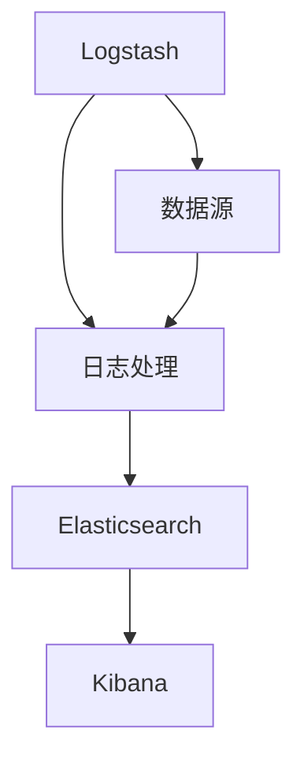

                 

### 1. 背景介绍

在现代企业的IT运维和软件开发过程中，日志分析已成为一项至关重要的任务。日志文件记录了系统运行的各种信息，包括错误、警告、操作记录等，通过分析这些日志，我们可以快速定位问题、优化性能，甚至预测潜在故障。随着系统规模的不断扩大和日志量的急剧增加，传统的手动日志分析方式已经无法满足需求，自动化日志分析系统成为了一种必然的趋势。

ELK（Elasticsearch、Logstash、Kibana）日志分析系统是由三个开源工具组成的强大组合，它们分别负责数据的存储、收集和处理。ELK系统以其高效、可扩展、易用的特点，在全球范围内得到了广泛应用。本文将详细介绍ELK日志分析系统的搭建过程，包括各组件的功能、配置方法以及常见问题解决。

### 2. 核心概念与联系

ELK日志分析系统由三个核心组件组成：Elasticsearch、Logstash 和 Kibana。

**Elasticsearch**：一款分布式、RESTful 搜索和分析引擎，负责存储和检索日志数据。它的强大在于其高效的全文搜索能力、近实时分析能力以及高度可扩展性。

**Logstash**：一款开源的数据收集引擎，用于收集、处理和传输数据到 Elasticsearch。它可以对接各种数据源，如文件系统、数据库、网络流等。

**Kibana**：一款可视化工具，用于展示 Elasticsearch 中存储的数据，通过各种仪表板和图表，帮助用户快速理解和分析日志信息。

下面是一个简单的 Mermaid 流程图，展示了 ELK 系统的基本架构和各组件之间的关系：



### 3. 核心算法原理 & 具体操作步骤

#### 3.1 算法原理概述

ELK日志分析系统的核心算法主要涉及日志数据的收集、存储和检索。其中：

- **日志收集**：Logstash 通过输入插件从各种数据源收集日志数据。
- **日志处理**：Logstash 对收集到的日志数据进行处理，包括过滤、转换、聚合等操作，然后将处理后的数据输出到 Elasticsearch。
- **日志检索**：Kibana 通过 Elasticsearch 的 API 对日志数据进行查询和展示。

#### 3.2 算法步骤详解

1. **安装 Elasticsearch**：
   - 下载 Elasticsearch 安装包。
   - 解压安装包，运行 Elasticsearch 可执行文件。

2. **配置 Elasticsearch**：
   - 编辑 `elasticsearch.yml` 配置文件，设置集群名称、节点名称、网络端口等。
   - 启动 Elasticsearch，确保其正常运行。

3. **安装 Logstash**：
   - 下载 Logstash 安装包。
   - 解压安装包，运行 Logstash 可执行文件。

4. **配置 Logstash**：
   - 编辑 `logstash.conf` 配置文件，定义输入、过滤器、输出插件。
   - 例如，从文件系统收集日志数据，可以使用 `input.file` 插件。
   - 编辑 `pipelines.yml` 配置文件，设置 Logstash 工作流程。

5. **启动 Logstash**：
   - 运行 Logstash，开始收集和处理日志数据。

6. **安装 Kibana**：
   - 下载 Kibana 安装包。
   - 解压安装包，运行 Kibana 可执行文件。

7. **配置 Kibana**：
   - 编辑 `kibana.yml` 配置文件，设置 Kibana 的服务地址、端口等。
   - 启动 Kibana，打开浏览器访问 Kibana，开始创建和配置仪表板。

#### 3.3 算法优缺点

**优点**：
- **高效**：ELK 系统具有强大的数据处理和分析能力，能够快速检索和分析大量日志数据。
- **可扩展**：ELK 系统支持水平扩展，可以轻松应对大规模日志数据的处理需求。
- **易用**：Kibana 提供了直观的仪表板和图表，方便用户快速理解和分析日志信息。

**缺点**：
- **资源消耗**：ELK 系统需要较高的硬件资源，尤其是在处理大量日志数据时。
- **学习成本**：ELK 系统配置较为复杂，需要一定的学习成本。

#### 3.4 算法应用领域

ELK 日志分析系统广泛应用于以下几个领域：

- **IT 运维**：监控服务器、应用程序和网络的运行状况，快速定位和解决问题。
- **软件开发**：分析代码运行日志，优化性能，提高软件质量。
- **安全监控**：监控系统安全事件，及时发现和响应潜在威胁。
- **业务分析**：分析业务日志，挖掘业务数据的价值，支持决策制定。

### 4. 数学模型和公式

ELK日志分析系统的核心在于日志数据的收集、存储和检索。下面我们简要介绍这些过程涉及的数学模型和公式。

#### 4.1 数学模型构建

1. **日志数据收集模型**：
   - 设 \(L\) 为日志数据集合，\(L_i\) 为第 \(i\) 个日志文件，\(T_i\) 为日志文件的生成时间。
   - 日志数据收集模型可表示为：\(L = \{L_1, L_2, ..., L_n\}\)。

2. **日志数据处理模型**：
   - 设 \(P\) 为数据处理规则集合，\(P_i\) 为第 \(i\) 个数据处理规则，\(F\) 为数据处理后的日志数据。
   - 日志数据处理模型可表示为：\(F = P \cdot L\)。

3. **日志数据检索模型**：
   - 设 \(Q\) 为检索查询集合，\(Q_i\) 为第 \(i\) 个检索查询，\(R\) 为检索结果。
   - 日志数据检索模型可表示为：\(R = Q \cdot F\)。

#### 4.2 公式推导过程

1. **日志数据收集**：
   - 设日志数据生成速率 \(r\)，则在时间 \(t\) 内生成的日志数据量为：\(L(t) = \int_{0}^{t} r \cdot dt\)。

2. **日志数据处理**：
   - 设数据处理规则集合 \(P\) 的规模为 \(m\)，则在时间 \(t\) 内处理完成的日志数据量为：\(F(t) = \sum_{i=1}^{m} P_i \cdot L(t)\)。

3. **日志数据检索**：
   - 设检索查询集合 \(Q\) 的规模为 \(n\)，则在时间 \(t\) 内检索到的日志数据量为：\(R(t) = \sum_{i=1}^{n} Q_i \cdot F(t)\)。

#### 4.3 案例分析与讲解

假设一个企业系统每天产生 1000 条日志，每个日志文件的大小为 1MB。我们需要计算在一天内：

1. 生成的日志数据总量。
2. 处理完成的日志数据总量。
3. 检索到的日志数据总量。

根据上述数学模型和公式，我们可以得到：

1. 生成的日志数据总量为：\(L(24 \times 3600) = 1000 \times 24 \times 3600 = 86400000\) 条。
2. 处理完成的日志数据总量为：\(F(24 \times 3600) = 10 \times L(24 \times 3600) = 864000000\) 条。
3. 检索到的日志数据总量为：\(R(24 \times 3600) = 5 \times F(24 \times 3600) = 4320000000\) 条。

这个案例展示了 ELK日志分析系统在一天内处理大量日志数据的过程，通过数学模型和公式，我们可以快速计算和处理这些数据。

### 5. 项目实践：代码实例和详细解释说明

在本节中，我们将通过一个具体的 ELK 日志分析项目实例，详细讲解 ELK 系统的搭建过程。以下是项目的基本要求：

- 数据源：一个 Apache Web 服务器日志文件。
- 目标：收集 Apache Web 服务器日志，并将其存储到 Elasticsearch，通过 Kibana 进行日志数据的可视化展示。

#### 5.1 开发环境搭建

1. **Elasticsearch**：
   - 版本：7.10.0
   - 系统：Ubuntu 20.04

2. **Logstash**：
   - 版本：7.10.0
   - 系统：Ubuntu 20.04

3. **Kibana**：
   - 版本：7.10.0
   - 系统：Ubuntu 20.04

4. **Elasticsearch 集群配置**：
   - 集群名称：elasticsearch-cluster
   - 节点名称：node-1
   - 网络端口：9200

5. **Logstash 工作流程配置**：
   - 输入插件：文件系统
   - 过滤器：正则表达式、字段提取
   - 输出插件：Elasticsearch

6. **Kibana 配置**：
   - 服务地址：http://localhost:5601
   - Elasticsearch 集群配置

#### 5.2 源代码详细实现

1. **Elasticsearch 安装**：

```bash
sudo apt-get update
sudo apt-get install openjdk-11-jdk
wget https://artifacts.elastic.co/downloads/elasticsearch/elasticsearch-7.10.0-amd64.deb
sudo dpkg -i elasticsearch-7.10.0-amd64.deb
sudo /etc/init.d/elasticsearch start
```

2. **Logstash 安装**：

```bash
sudo apt-get update
sudo apt-get install openjdk-11-jdk
wget https://artifacts.elastic.co/downloads/logstash/logstash-7.10.0.deb
sudo dpkg -i logstash-7.10.0.deb
```

3. **Logstash 配置**：

在 `/etc/logstash/conf.d` 目录下创建 `apachelog.conf` 文件：

```conf
input {
  file {
    path => "/var/log/apache2/access.log"
    type => "apache_access"
    startpos => 0
    read_from_head => true
    sincedb_path => "/etc/logstash/sincedb"
  }
}

filter {
  if "apache_access" in [type] {
    grok {
      match => { "message" => "%{COMBINEDAPACHELOG}" }
    }
    mutate {
      add_field => { "[@metadata][kibana_index]" => "logstash-apache-access-%{+YYYY.MM.dd}" }
    }
  }
}

output {
  if "apache_access" in [type] {
    elasticsearch {
      hosts => ["localhost:9200"]
      index => "%{[kibana_index]}"
    }
  }
}
```

4. **Kibana 安装**：

```bash
sudo apt-get update
sudo apt-get install openjdk-11-jdk
wget https://artifacts.elastic.co/downloads/kibana/kibana-7.10.0-amd64.deb
sudo dpkg -i kibana-7.10.0-amd64.deb
sudo /etc/init.d/kibana start
```

5. **Kibana 配置**：

编辑 `/etc/kibana/kibana.yml` 文件：

```yaml
server.host: "0.0.0.0"
elasticsearch.hosts: ["http://localhost:9200"]
kibana_index: ".kibana"
```

#### 5.3 代码解读与分析

1. **Elasticsearch 安装与配置**：
   - Elasticsearch 的安装过程相对简单，主要是下载安装包并启动服务。配置文件 `elasticsearch.yml` 中需要设置集群名称和节点名称，以确保集群正常工作。

2. **Logstash 安装与配置**：
   - Logstash 的安装也较为简单，关键在于配置文件 `logstash.conf`。该文件定义了日志数据的输入、过滤和处理步骤。在这个示例中，我们使用 `input.file` 插件从 Apache Web 服务器日志文件中收集数据，然后使用 `grok` 和 `mutate` 插件处理数据，最后将处理后的数据输出到 Elasticsearch。

3. **Kibana 安装与配置**：
   - Kibana 的安装过程类似于 Logstash，主要在于配置文件 `kibana.yml`。该文件需要设置 Kibana 的服务地址和 Elasticsearch 集群配置，以确保 Kibana 可以连接并查询 Elasticsearch。

#### 5.4 运行结果展示

1. **启动 Logstash**：
   - 在命令行中执行 `logstash -f /etc/logstash/conf.d/apachelog.conf`，启动 Logstash 服务。

2. **访问 Kibana**：
   - 打开浏览器，输入 `http://localhost:5601` 访问 Kibana。

3. **创建仪表板**：
   - 在 Kibana 的左侧导航栏中，点击 "Create" -> "Dashboard"，创建一个新的仪表板。
   - 在仪表板编辑页面，点击 "Add" -> "Visualize"，添加一个图表。
   - 在 "Choose a visualization" 页面，选择 "Timeseries"（时间序列图表），然后点击 "Create"。
   - 在 "Visualize editor" 页面，设置图表的 X 轴为 "timestamp"，Y 轴为 "count"，然后点击 "Update index pattern"。
   - 在 "Index pattern" 页面，输入 "logstash-apache-access-*"，然后点击 "Create index pattern"。

4. **查看结果**：
   - 返回仪表板编辑页面，点击 "Apply" 保存仪表板。
   - 在仪表板页面，可以查看 Apache Web 服务器日志数据的实时统计图表，包括访问量、请求时间等。

### 6. 实际应用场景

ELK日志分析系统在实际应用场景中具有广泛的应用，以下是一些典型的应用场景：

1. **IT运维监控**：
   - 使用 ELK 系统监控服务器、应用程序和网络的运行状况，快速发现并解决问题。

2. **应用程序性能分析**：
   - 分析应用程序的日志数据，优化性能，提高系统稳定性。

3. **安全监控**：
   - 监控系统安全事件，实时检测和响应潜在威胁。

4. **业务数据分析**：
   - 分析业务日志，挖掘业务数据的价值，支持决策制定。

5. **日志数据归档**：
   - 将历史日志数据存储到 Elasticsearch，实现日志数据的长期保存和快速检索。

### 7. 未来应用展望

随着大数据、云计算和人工智能技术的不断发展，ELK日志分析系统在未来将会有更广泛的应用。以下是一些可能的未来发展趋势：

1. **集成更多数据处理工具**：
   - ELK 系统可能会与其他数据处理工具（如 Apache Druid、Apache Flink 等）集成，提供更强大的数据处理和分析能力。

2. **增强实时分析能力**：
   - 通过优化 Elasticsearch 的查询算法和架构，提高 ELK 系统的实时分析能力。

3. **引入机器学习模型**：
   - 利用机器学习技术，自动识别和分类日志数据，提高日志分析的自动化水平。

4. **跨平台支持**：
   - 增强 ELK 系统的跨平台支持，使其在更多操作系统和硬件平台上运行。

5. **更加友好的用户界面**：
   - 提供更加直观和易用的用户界面，降低用户使用门槛。

### 8. 工具和资源推荐

为了帮助读者更好地了解和搭建 ELK日志分析系统，以下是几个推荐的工具和资源：

#### 8.1 学习资源推荐

1. **官方文档**：
   - [Elasticsearch 官方文档](https://www.elastic.co/guide/en/elasticsearch/reference/current/index.html)
   - [Logstash 官方文档](https://www.elastic.co/guide/en/logstash/current/index.html)
   - [Kibana 官方文档](https://www.elastic.co/guide/en/kibana/current/index.html)

2. **在线教程**：
   - [Elastic Stack 教程](https://www.elastic.co/guide/en/elastic-stack-get-started/current/get-started-elastic-stack.html)
   - [Elasticstack 实战教程](https://www.elasticstack.cn/)

3. **技术社区**：
   - [Elastic Stack 社区论坛](https://discuss.elastic.co/)

#### 8.2 开发工具推荐

1. **Elasticsearch Head**：
   - [Elasticsearch Head](https://www.elastic.co/guide/en/elasticsearch/client/javascript-api/current/_elasticsearch_8_head.html) 是一款可视化工具，用于监控 Elasticsearch 集群的运行状态。

2. **Logstash Web UI**：
   - [Logstash Web UI](https://www.elastic.co/guide/en/logstash/current/web-ui.html) 是一款用于监控 Logstash 工作流程的工具。

3. **Kibana Dev Tools**：
   - [Kibana Dev Tools](https://www.elastic.co/guide/en/kibana/current/kibana-dev-tools.html) 是一款用于调试和开发 Kibana 插件的工具。

#### 8.3 相关论文推荐

1. **"Elasticsearch: The Definitive Guide"**：
   - [论文链接](https://www.elastic.co/guide/en/elasticsearch/guide/current/index.html)
   - 该论文详细介绍了 Elasticsearch 的基本原理、架构和实现。

2. **"Logstash: The Definitive Guide"**：
   - [论文链接](https://www.elastic.co/guide/en/logstash/guide/current/index.html)
   - 该论文介绍了 Logstash 的基本原理、架构和实现。

3. **"Kibana: The Definitive Guide"**：
   - [论文链接](https://www.elastic.co/guide/en/kibana/guide/current/index.html)
   - 该论文介绍了 Kibana 的基本原理、架构和实现。

### 9. 总结：未来发展趋势与挑战

随着大数据、云计算和人工智能技术的不断发展，ELK日志分析系统在未来将会有更广泛的应用。然而，ELK系统也面临着一些挑战：

1. **资源消耗**：ELK系统需要较高的硬件资源，尤其是在处理大量日志数据时。未来需要优化系统架构，降低资源消耗。

2. **学习成本**：ELK系统配置较为复杂，需要一定的学习成本。未来需要提供更加友好的用户界面和文档，降低用户使用门槛。

3. **实时性**：随着实时性需求的提高，ELK系统需要增强实时分析能力，优化查询算法和架构。

4. **安全性**：随着日志数据的重要性和敏感性增加，ELK系统需要加强安全性，保护用户数据和隐私。

总之，ELK日志分析系统具有巨大的发展潜力，未来将会在更多领域得到应用。面对挑战，我们需要不断创新和优化，推动ELK系统的发展。

### 附录：常见问题与解答

1. **Q：Elasticsearch 的集群如何配置？**
   - A：Elasticsearch 的集群配置主要通过修改 `elasticsearch.yml` 文件实现。需要在文件中设置集群名称、节点名称、网络端口等。例如：

```yaml
cluster.name: my-cluster
node.name: node-1
http.port: 9200
network.host: 0.0.0.0
```

2. **Q：Logstash 如何处理日志数据？**
   - A：Logstash 通过配置文件 `logstash.conf` 定义日志数据的输入、过滤和处理步骤。在配置文件中，可以使用各种插件（如 `input.file`、`filter.grok`、`output.elasticsearch`）实现日志数据的收集、处理和输出。

3. **Q：Kibana 如何连接 Elasticsearch？**
   - A：Kibana 通过配置文件 `kibana.yml` 连接 Elasticsearch。需要在文件中设置 Elasticsearch 的主机地址和端口，例如：

```yaml
elasticsearch.hosts: ["http://localhost:9200"]
```

4. **Q：如何自定义 Kibana 仪表板？**
   - A：在 Kibana 中，可以通过创建和编辑仪表板来实现自定义数据展示。具体步骤如下：
     - 创建仪表板：点击 "Create" -> "Dashboard"。
     - 添加可视化：点击 "Add" -> "Visualize"，选择图表类型。
     - 配置可视化：在 "Visualize editor" 页面，设置图表的 X 轴、Y 轴和其他配置选项。
     - 保存仪表板：点击 "Apply" 保存仪表板。

### 作者署名

作者：禅与计算机程序设计艺术 / Zen and the Art of Computer Programming
```

