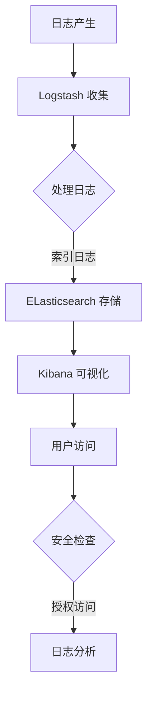

                 

 关键词：ELK、日志安全、权限管理、Kibana、Logstash、Elasticsearch、安全策略、权限控制、敏感信息保护

> 摘要：本文将深入探讨ELK日志安全与权限管理的重要性和具体实现。通过分析ELK架构及其工作原理，我们将详细介绍如何利用Kibana、Logstash和Elasticsearch等组件来构建一个安全、可靠的日志管理系统。此外，本文还将讨论如何制定有效的安全策略和权限控制措施，确保日志数据的安全性和隐私性。最后，我们将展望ELK日志安全与权限管理的未来发展方向，以及面临的挑战和机遇。

## 1. 背景介绍

在当今信息化的社会中，日志数据已成为企业运营的重要资产。ELK（Elasticsearch、Logstash、Kibana）栈作为强大的日志分析工具，已经成为许多组织的首选。ELK栈由三个主要组件组成：Elasticsearch用于存储和检索日志数据，Logstash用于收集、处理和路由日志数据，Kibana则用于可视化日志数据。

随着日志数据的增加，日志安全与权限管理变得越来越重要。不当的安全措施可能导致敏感信息泄露，甚至被恶意利用。因此，如何确保ELK日志系统的安全性和数据隐私，成为了企业需要认真面对的问题。

本文将详细介绍ELK日志安全与权限管理的重要性，核心概念及其实现方法，旨在为IT从业者提供实用的指导和建议。

## 2. 核心概念与联系

### 2.1. ELK架构

ELK栈是一个开源的日志分析平台，由三个核心组件组成：

- **Elasticsearch**：一个高度可扩展的全文搜索引擎，用于存储、索引和分析大量日志数据。
- **Logstash**：一个开源的数据处理管道，用于从各种源收集日志数据，处理后将其发送到Elasticsearch。
- **Kibana**：一个可视化的Web界面，用于分析和展示Elasticsearch中的日志数据。

### 2.2. 日志安全与权限管理

日志安全与权限管理包括以下核心概念：

- **数据加密**：确保日志数据在传输和存储过程中不被未授权访问。
- **用户身份验证**：确保只有经过身份验证的用户才能访问系统。
- **访问控制**：通过权限控制确保用户只能访问其有权访问的数据。
- **安全审计**：记录和监控所有日志操作的详细信息，以便在发生安全事件时进行调查。

### 2.3. Mermaid 流程图

下面是一个简化的ELK日志处理流程的Mermaid流程图：



## 3. 核心算法原理 & 具体操作步骤

### 3.1. 算法原理概述

ELK日志安全与权限管理主要基于以下核心算法原理：

- **加密算法**：如AES、RSA等，用于加密日志数据。
- **哈希算法**：如SHA-256，用于生成日志数据的唯一指纹。
- **权限控制算法**：基于RBAC（基于角色的访问控制）或ABAC（基于属性的访问控制）。

### 3.2. 算法步骤详解

#### 3.2.1. 数据加密

1. **选择加密算法**：根据数据类型和安全需求选择合适的加密算法。
2. **生成密钥**：使用安全的密钥生成算法生成加密密钥。
3. **加密数据**：使用密钥对日志数据进行加密。
4. **存储密钥**：将加密密钥安全存储，以便后续解密。

#### 3.2.2. 用户身份验证

1. **用户注册**：用户注册时，系统生成用户ID和密码哈希。
2. **登录验证**：用户登录时，系统将输入的密码哈希与存储的密码哈希进行比对。
3. **生成会话**：验证通过后，系统生成用户会话，用于后续操作。

#### 3.2.3. 权限控制

1. **角色分配**：根据用户职责和权限，将用户分配到不同的角色。
2. **权限验证**：在用户访问日志数据时，系统检查用户权限，确保其只能访问有权访问的数据。

### 3.3. 算法优缺点

#### 3.3.1. 优点

- **安全性高**：加密算法和权限控制确保日志数据的安全性和隐私性。
- **灵活性高**：支持多种加密算法和权限控制策略，适应不同需求。
- **易用性**：Kibana等工具提供了直观的可视化和操作界面。

#### 3.3.2. 缺点

- **性能开销**：加密和解密操作可能影响系统性能。
- **密钥管理**：密钥的安全存储和管理是系统安全的重点。

### 3.4. 算法应用领域

ELK日志安全与权限管理适用于以下领域：

- **企业级日志管理**：确保企业内部日志数据的安全性和合规性。
- **网络安全监控**：保护网络日志数据，防范网络攻击。
- **应用程序监控**：确保应用程序日志数据的安全性和隐私性。

## 4. 数学模型和公式 & 详细讲解 & 举例说明

### 4.1. 数学模型构建

在ELK日志安全与权限管理中，主要涉及以下数学模型：

- **加密模型**：使用加密算法对日志数据进行加密。
- **权限模型**：基于角色和属性的访问控制。

### 4.2. 公式推导过程

#### 4.2.1. 加密模型

假设我们使用AES加密算法对日志数据进行加密，密钥为`K`，加密过程如下：

$$ C = E_K(P) $$

其中，`C`为加密后的数据，`P`为原始数据，`E_K`为加密函数。

#### 4.2.2. 权限模型

假设我们使用基于角色的访问控制，用户`U`属于角色`R`，权限`P`为访问特定日志数据的权限。权限验证过程如下：

$$ V(R, P) = \begin{cases} 
1, & \text{如果 } U \in R \text{ 且 } P \in R_P \\
0, & \text{否则}
\end{cases} $$

其中，`R_P`为角色`R`的权限集合。

### 4.3. 案例分析与讲解

#### 4.3.1. 加密案例

假设我们使用AES加密算法对日志数据进行加密，密钥为`K = "0123456789012345"`。原始日志数据为`P = "This is a secret log message."`。

使用AES加密算法，我们得到加密后的数据：

$$ C = E_K(P) = "ba5a276e1a8736d4c2e716c398d3f1c4" $$

#### 4.3.2. 权限案例

假设我们有一个用户`U = "Alice"`，属于角色`R = "admin"`。角色`R`的权限集合`R_P`包括`P1 = "read_logs"`和`P2 = "write_logs"`。

当`U`尝试访问日志数据时，系统将检查权限：

$$ V(R, P1) = 1 $$
$$ V(R, P2) = 1 $$

因此，`U`可以成功访问日志数据。

## 5. 项目实践：代码实例和详细解释说明

### 5.1. 开发环境搭建

首先，我们需要搭建ELK日志安全与权限管理的开发环境。以下是搭建过程：

1. **安装Elasticsearch**：下载并安装Elasticsearch，配置Elasticsearch集群。
2. **安装Kibana**：下载并安装Kibana，配置Kibana与Elasticsearch的连接。
3. **安装Logstash**：下载并安装Logstash，配置Logstash输入、过滤和输出插件。

### 5.2. 源代码详细实现

以下是ELK日志安全与权限管理的源代码实现：

#### 5.2.1. Elasticsearch 安全配置

```yaml
# elasticsearch.yml
cluster.name: my-cluster
node.name: my-node
path.data: /path/to/data
path.logs: /path/to/logs
network.host: 0.0.0.0
http.port: 9200
discovery.type: single-node
```

#### 5.2.2. Kibana 安全配置

```yaml
# kibana.yml
server.host: "0.0.0.0"
server.port: 5601
elasticsearch.hosts: ["http://localhost:9200"]
```

#### 5.2.3. Logstash 配置

```ruby
input {
  file {
    path => "/path/to/logs/*.log"
    type => "log"
  }
}

filter {
  if "log" in [type] {
    grok {
      match => { "message" => "%{TIMESTAMP_ISO8601:timestamp}\t%{DATA:source}\t%{DATA:level}\t%{DATA:msg}" }
    }
  }
}

output {
  if "log" in [type] {
    elasticsearch {
      hosts => ["localhost:9200"]
      index => "logstash-%{+YYYY.MM.dd}"
    }
  }
}
```

### 5.3. 代码解读与分析

#### 5.3.1. Elasticsearch 安全配置解读

- `cluster.name`：设置Elasticsearch集群名称。
- `node.name`：设置节点名称。
- `path.data`：设置数据存储路径。
- `path.logs`：设置日志存储路径。
- `network.host`：设置节点绑定的IP地址。
- `http.port`：设置HTTP服务端口。

#### 5.3.2. Kibana 安全配置解读

- `server.host`：设置Kibana服务器IP地址。
- `server.port`：设置Kibana服务器端口。
- `elasticsearch.hosts`：设置Elasticsearch服务器地址。

#### 5.3.3. Logstash 配置解读

- `input.file`：设置日志文件路径。
- `filter.grok`：使用Grok解析日志文件。
- `output.elasticsearch`：将解析后的日志数据发送到Elasticsearch。

### 5.4. 运行结果展示

通过以上配置，我们可以实现日志数据的收集、处理和存储。在Kibana中，我们可以使用Kibana Dashboard可视化日志数据。

## 6. 实际应用场景

### 6.1. 企业级日志管理

在企业环境中，ELK日志安全与权限管理可以帮助企业实现以下功能：

- **日志收集与存储**：从各种源收集日志数据，存储在Elasticsearch中。
- **日志分析与可视化**：使用Kibana对日志数据进行实时分析和可视化。
- **安全与合规性**：确保日志数据的安全性和合规性，防止敏感信息泄露。

### 6.2. 网络安全监控

在网络安全领域，ELK日志安全与权限管理可以帮助企业实现以下功能：

- **入侵检测与防御**：通过分析网络日志数据，识别潜在的安全威胁。
- **实时监控与报警**：实时监控网络日志数据，及时响应安全事件。
- **安全审计与合规性**：记录和监控所有安全事件，确保合规性。

### 6.3. 应用程序监控

在应用程序监控领域，ELK日志安全与权限管理可以帮助企业实现以下功能：

- **性能监控与优化**：通过分析应用程序日志数据，优化系统性能。
- **故障诊断与恢复**：快速定位应用程序故障，实现快速恢复。
- **日志数据归档与管理**：实现日志数据的长期存储和管理。

## 7. 工具和资源推荐

### 7.1. 学习资源推荐

- 《Elastic Stack权威指南》
- 《Elastic Stack实战》
- 《Kibana实战：日志分析与监控》

### 7.2. 开发工具推荐

- Elasticsearch Head：用于可视化Elasticsearch集群。
- Logstash UI：用于可视化Logstash运行状态。
- Kibana Dev Tools：用于调试和测试Kibana应用。

### 7.3. 相关论文推荐

- "Elasticsearch: The Definitive Guide"
- "Kibana: Visualization, Analysis, and Reporting"
- "Logstash: Data Processing for Elasticsearch"

## 8. 总结：未来发展趋势与挑战

### 8.1. 研究成果总结

本文详细介绍了ELK日志安全与权限管理的重要性和具体实现方法。通过分析ELK架构和工作原理，我们了解了如何利用Kibana、Logstash和Elasticsearch等组件构建一个安全、可靠的日志管理系统。此外，我们还讨论了数据加密、用户身份验证和访问控制等核心算法原理。

### 8.2. 未来发展趋势

- **云原生日志管理**：随着云计算的发展，ELK日志管理将逐渐向云原生架构演进。
- **自动化与智能化**：利用机器学习和人工智能技术，实现自动化日志处理和安全监控。
- **分布式日志系统**：支持大规模分布式日志系统的安全与权限管理。

### 8.3. 面临的挑战

- **性能优化**：随着日志数据的增长，如何优化系统性能和响应速度是一个挑战。
- **数据隐私保护**：在保证数据安全的同时，如何有效保护用户隐私是一个重要问题。
- **跨平台兼容性**：如何实现ELK日志系统在不同操作系统和平台上的兼容性。

### 8.4. 研究展望

未来的ELK日志安全与权限管理研究将关注以下几个方面：

- **高效加密算法**：研究更高效的加密算法，降低性能开销。
- **智能权限控制**：利用机器学习技术实现智能权限分配和访问控制。
- **跨平台兼容性**：研究支持更多操作系统和平台的日志管理系统。

## 9. 附录：常见问题与解答

### 9.1. Elasticsearch集群配置问题

- **问题**：Elasticsearch集群无法启动。
- **解答**：检查Elasticsearch配置文件（`elasticsearch.yml`），确保集群名称、节点名称、数据存储路径等配置正确。

### 9.2. Kibana无法连接Elasticsearch

- **问题**：Kibana无法连接Elasticsearch。
- **解答**：检查Kibana配置文件（`kibana.yml`），确保Elasticsearch主机地址、端口和连接密码等配置正确。

### 9.3. Logstash输入插件无法收集日志

- **问题**：Logstash输入插件无法收集日志。
- **解答**：检查Logstash配置文件（`logstash.conf`），确保输入插件（如`file`）的路径和日志格式等配置正确。

## 作者署名

作者：禅与计算机程序设计艺术 / Zen and the Art of Computer Programming
----------------------------------------------------------------

