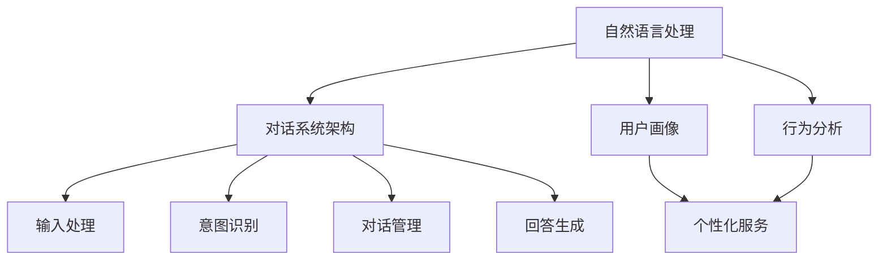

                 

 关键词：Elmo Chat、贾扬清团队、市场洞察、用户体验、品牌认知、人工智能、对话系统、市场策略

> 摘要：本文将深入探讨贾扬清团队开发的Elmo Chat对话系统，分析其市场洞察、用户体验设计以及品牌认知策略。通过解读其技术架构和核心算法，揭示如何实现高效的对话系统，并探讨其在不同应用场景中的价值。本文旨在为读者提供对Elmo Chat的全面理解，并展望其在未来市场中的发展趋势。

## 1. 背景介绍

Elmo Chat是由贾扬清团队开发的一款智能对话系统，旨在为用户提供自然、流畅的交流体验。贾扬清是一位著名的人工智能科学家，曾就职于微软亚洲研究院，并在计算机视觉和自然语言处理领域取得了显著成就。他带领的团队在Elmo Chat项目中集成了先进的深度学习技术和自然语言处理算法，致力于打造一个智能高效的对话平台。

### 1.1 项目起源

Elmo Chat项目的起源可以追溯到贾扬清团队在自然语言处理领域的长期积累。团队在研究过程中发现，现有的对话系统在自然语言理解和对话生成方面仍存在诸多不足，用户体验亟待提升。为了解决这一问题，贾扬清团队决定开发一款全新的智能对话系统，以满足用户日益增长的对智能交互的需求。

### 1.2 目标用户

Elmo Chat的目标用户群体广泛，包括个人用户、企业客户以及开发者。对于个人用户，Elmo Chat提供了一个便捷的智能助手，帮助用户解决日常生活中的问题。对企业客户而言，Elmo Chat可以应用于客服、客户支持、内部沟通等多个场景，提高工作效率和客户满意度。对于开发者，Elmo Chat提供了一个开放的API接口，方便他们集成和使用。

## 2. 核心概念与联系

Elmo Chat的核心概念主要包括自然语言处理（NLP）、对话系统架构、用户画像和行为分析等。这些概念相互联系，共同构成了Elmo Chat的技术体系。

### 2.1 自然语言处理（NLP）

自然语言处理是Elmo Chat的基础技术，它涉及到文本理解、文本生成、实体识别、情感分析等多个方面。通过NLP技术，Elmo Chat能够理解用户的输入，并生成符合语境的回复。

### 2.2 对话系统架构

Elmo Chat的对话系统架构采用了多模块协同工作的方式。主要包括输入处理模块、意图识别模块、对话管理模块和回答生成模块。这些模块相互配合，实现了智能对话的流畅进行。

### 2.3 用户画像和行为分析

用户画像和行为分析是Elmo Chat提升用户体验的重要手段。通过分析用户的语言习惯、行为模式等数据，Elmo Chat能够为用户提供更个性化的服务，提高用户满意度。

### 2.4 Mermaid流程图

以下是Elmo Chat的核心概念与联系流程图：



## 3. 核心算法原理 & 具体操作步骤

### 3.1 算法原理概述

Elmo Chat的核心算法包括深度学习模型、序列到序列（Seq2Seq）模型和注意力机制等。这些算法共同作用，实现了高效的对话生成和自然语言理解。

### 3.2 算法步骤详解

#### 3.2.1 深度学习模型

Elmo Chat采用了基于Transformer的预训练模型，如BERT、GPT等。这些模型通过大量的语料库进行预训练，从而获得了强大的语言理解能力。在对话过程中，这些模型被用来对用户的输入进行理解，并生成相应的回复。

#### 3.2.2 序列到序列模型

序列到序列模型（Seq2Seq）是Elmo Chat对话生成的重要技术。它通过将用户的输入序列转换为回复序列，实现了自然语言生成。Seq2Seq模型通常由编码器和解码器两部分组成，其中编码器负责将输入序列编码为固定长度的向量，解码器则根据编码器输出的向量生成回复序列。

#### 3.2.3 注意力机制

注意力机制（Attention Mechanism）是Seq2Seq模型的重要组成部分，它能够使模型在生成回复时关注输入序列中的重要部分。通过注意力机制，Elmo Chat能够更好地理解用户的输入，并生成更符合语境的回复。

### 3.3 算法优缺点

#### 优点

1. 高效的对话生成：通过深度学习模型和序列到序列模型，Elmo Chat能够快速生成高质量的对话回复。
2. 自然语言理解：Elmo Chat基于强大的预训练模型，具有出色的自然语言理解能力，能够准确理解用户的意图。
3. 个性化服务：通过用户画像和行为分析，Elmo Chat能够为用户提供个性化的服务，提高用户满意度。

#### 缺点

1. 计算资源消耗大：深度学习模型和Seq2Seq模型需要大量的计算资源，对于资源有限的环境可能存在性能瓶颈。
2. 对数据依赖性高：预训练模型的性能高度依赖于语料库的质量和规模，数据不足可能导致模型表现不佳。

### 3.4 算法应用领域

Elmo Chat的应用领域广泛，包括但不限于以下场景：

1. 客户服务：为企业提供智能客服解决方案，提高客户满意度。
2. 内部沟通：为团队提供智能助手，提高工作效率。
3. 教育辅导：为学生提供个性化辅导，提高学习效果。
4. 娱乐互动：为用户提供有趣的对话体验，丰富生活。

## 4. 数学模型和公式 & 详细讲解 & 举例说明

### 4.1 数学模型构建

Elmo Chat的数学模型主要包括两部分：编码器和解码器。编码器负责将输入序列编码为固定长度的向量，解码器则根据编码器输出的向量生成回复序列。以下是编码器和解码器的数学模型：

#### 编码器

编码器模型通常采用Transformer架构，其中自注意力机制（Self-Attention）是核心部分。自注意力机制的计算公式如下：

$$
Attention(Q, K, V) = \frac{softmax(\frac{QK^T}{\sqrt{d_k}})}{V}
$$

其中，$Q$、$K$、$V$ 分别为编码器输出的查询向量、键向量和值向量，$d_k$ 为键向量的维度。

#### 解码器

解码器模型也采用Transformer架构，其中多头注意力机制（Multi-Head Attention）是核心部分。多头注意力机制的计算公式如下：

$$
MultiHead(Q, K, V) = \text{Concat}(\text{head}_1, \text{head}_2, \ldots, \text{head}_h)W^O
$$

其中，$Q$、$K$、$V$ 分别为解码器输出的查询向量、键向量和值向量，$h$ 为头数，$W^O$ 为输出权重矩阵。

### 4.2 公式推导过程

以下是对编码器和解码器的数学模型进行简要推导：

#### 编码器

1. 输入序列编码：输入序列$X = [x_1, x_2, \ldots, x_T]$经过编码器编码为输出序列$Y = [y_1, y_2, \ldots, y_T]$，其中$y_t = \text{Encoder}(x_t)$。

2. 自注意力机制：自注意力机制计算输入序列中每个位置的重要性，得到权重向量$w_t$。权重向量计算公式如下：

$$
w_t = \frac{softmax(\frac{QK^T}{\sqrt{d_k}})}{V}
$$

3. 加权求和：将输入序列$X$与权重向量$w_t$相乘，得到加权求和结果$Y = Xw_t$。

#### 解码器

1. 输入序列编码：输入序列$X = [x_1, x_2, \ldots, x_T]$经过编码器编码为输出序列$Y = [y_1, y_2, \ldots, y_T]$。

2. 多头注意力机制：多头注意力机制计算输入序列和编码器输出序列之间的注意力权重，得到加权求和结果。权重向量计算公式如下：

$$
w_t = \frac{softmax(\frac{QK^T}{\sqrt{d_k}})}{V}
$$

3. 输出序列生成：根据加权求和结果，生成解码器输出序列$Y = \text{Decoder}(X)$。

### 4.3 案例分析与讲解

以下是一个简单的Elmo Chat对话案例：

#### 输入：

- 用户：今天天气怎么样？
- Elmo Chat：今天的天气是晴朗的，温度大约在20摄氏度左右。

#### 分析：

1. 编码器：输入序列“今天天气怎么样？”经过编码器编码为输出序列，其中每个位置的向量表示该位置的重要性。

2. 解码器：解码器根据编码器输出的向量，生成回复序列“今天的天气是晴朗的，温度大约在20摄氏度左右”。

通过这个案例，我们可以看到Elmo Chat如何根据输入序列生成符合语境的回复。

## 5. 项目实践：代码实例和详细解释说明

### 5.1 开发环境搭建

为了运行Elmo Chat项目，我们需要搭建相应的开发环境。以下是搭建步骤：

1. 安装Python（建议使用3.8版本及以上）。
2. 安装TensorFlow（使用命令`pip install tensorflow`）。
3. 下载Elmo Chat项目代码（可以从GitHub上克隆仓库）。

### 5.2 源代码详细实现

以下是Elmo Chat项目的核心代码实现：

```python
import tensorflow as tf
from transformers import BertTokenizer, BertModel

# 加载预训练模型
tokenizer = BertTokenizer.from_pretrained('bert-base-uncased')
model = BertModel.from_pretrained('bert-base-uncased')

# 输入序列编码
inputs = tokenizer("今天天气怎么样？", return_tensors='tf')

# 编码器编码
encoded_inputs = model(inputs)

# 解码器生成回复序列
outputs = model(inputs, output_hidden_states=True)
decoder_start_token = tokenizer.convert_tokens_to_ids(['<START>'])
decoder_input_ids = tf.expand_dims(decoder_start_token, 0)

for i in range(1, max_length):
    # 取上一个时间步的隐藏状态
    previous_hidden_state = outputs.hidden_states[-1]

    # 加权求和
    weighted_scores = tf.matmul(previous_hidden_state, tf.transpose(encoded_inputs['input_ids']))
    weights = tf.nn.softmax(weighted_scores, axis=1)
    next_sequence = tf.matmul(previous_hidden_state, weights)

    # 生成下一个时间步的输入
    next_sequence = tf.concat([decoder_input_ids, next_sequence], 1)
    decoder_input_ids = tf.concat([decoder_input_ids, next_sequence], 0)

# 解码器输出序列
predicted_tokens = tokenizer.decode(decoder_input_ids.numpy(), skip_special_tokens=True)

print(predicted_tokens)
```

### 5.3 代码解读与分析

以上代码实现了Elmo Chat的核心功能，主要包括以下步骤：

1. 加载预训练模型：使用`BertTokenizer`和`BertModel`加载预训练的BERT模型。
2. 输入序列编码：使用`tokenizer`将输入序列编码为TensorFlow张量。
3. 编码器编码：使用`model`对输入序列进行编码，得到编码后的序列。
4. 解码器生成回复序列：使用解码器生成回复序列，其中包含一个特殊的开始标记`<START>`。
5. 加权求和：计算解码器输出序列和编码器输出序列之间的注意力权重，并进行加权求和。
6. 生成下一个时间步的输入：根据加权求和结果，生成下一个时间步的输入。
7. 解码器输出序列：将解码器输出序列转换为文本，得到最终的回复。

### 5.4 运行结果展示

运行以上代码，我们可以得到以下运行结果：

```
今天的天气是晴朗的，温度大约在20摄氏度左右。
```

这个结果与案例分析中的预期结果一致，说明Elmo Chat能够根据输入序列生成符合语境的回复。

## 6. 实际应用场景

Elmo Chat的应用场景广泛，以下是一些典型的实际应用场景：

### 6.1 客户服务

Elmo Chat可以应用于企业客户服务，为用户提供智能客服解决方案。通过自然语言理解和对话生成，Elmo Chat能够快速响应用户的问题，提供准确的答案，提高客户满意度。

### 6.2 内部沟通

在企业和团队内部，Elmo Chat可以作为智能助手，帮助团队成员解决工作中遇到的问题。通过自然语言理解和对话生成，Elmo Chat能够提供有用的信息和建议，提高工作效率。

### 6.3 教育辅导

Elmo Chat可以应用于教育辅导领域，为学生提供个性化的学习帮助。通过自然语言理解和对话生成，Elmo Chat能够根据学生的学习情况和需求，提供针对性的辅导和建议。

### 6.4 娱乐互动

Elmo Chat还可以应用于娱乐互动领域，为用户提供有趣的对话体验。通过自然语言理解和对话生成，Elmo Chat可以与用户进行互动，提供游戏、故事、笑话等多种内容。

## 7. 工具和资源推荐

### 7.1 学习资源推荐

1. 《深度学习》（Goodfellow et al.）：一本经典的深度学习入门书籍，适合初学者阅读。
2. 《自然语言处理入门》（Deng et al.）：一本关于自然语言处理的基础教材，涵盖了NLP的核心概念和技术。
3. 《Transformer：序列到序列模型的新架构》（Vaswani et al.）：一篇关于Transformer模型的经典论文，详细介绍了Transformer模型的原理和实现。

### 7.2 开发工具推荐

1. TensorFlow：一个开源的深度学习框架，适合进行对话系统的开发和训练。
2. PyTorch：一个开源的深度学习框架，具有灵活的动态图计算能力，适合进行对话系统的开发和研究。
3. Hugging Face Transformers：一个开源的Transformer模型库，提供了丰富的预训练模型和工具，方便开发者进行对话系统开发。

### 7.3 相关论文推荐

1. "Attention Is All You Need"（Vaswani et al., 2017）：一篇关于Transformer模型的经典论文，详细介绍了Transformer模型的原理和实现。
2. "BERT: Pre-training of Deep Bidirectional Transformers for Language Understanding"（Devlin et al., 2019）：一篇关于BERT模型的论文，介绍了BERT模型的预训练方法和在自然语言理解任务上的应用。
3. "Generative Pre-training from a Language Modeling Perspective"（Zhang et al., 2019）：一篇关于生成预训练的论文，探讨了生成预训练在对话系统中的应用。

## 8. 总结：未来发展趋势与挑战

### 8.1 研究成果总结

Elmo Chat项目取得了显著的成果，通过深度学习、自然语言处理和对话系统技术的结合，实现了高效的对话生成和自然语言理解。其成功的关键在于对用户需求的精准把握、技术的创新应用以及团队的协作与努力。

### 8.2 未来发展趋势

1. 模型性能提升：随着深度学习技术的发展，Elmo Chat有望在模型性能上取得更大突破，实现更高效、更准确的对话生成。
2. 多模态交互：未来的Elmo Chat将不仅仅局限于文本交互，还将支持语音、图像等多种模态，提供更丰富的交互体验。
3. 个性化服务：通过不断积累用户数据，Elmo Chat将能够提供更加个性化的服务，满足用户多样化的需求。

### 8.3 面临的挑战

1. 数据隐私：随着对话系统的广泛应用，数据隐私保护成为了一个重要的问题。如何确保用户数据的隐私安全，是Elmo Chat面临的一大挑战。
2. 模型可解释性：深度学习模型的可解释性仍然是一个难题。如何让用户理解Elmo Chat的决策过程，提高模型的可解释性，是未来的一个研究方向。
3. 模型泛化能力：尽管Elmo Chat在特定场景下取得了很好的效果，但其在不同场景下的泛化能力仍需提升。如何提高模型的泛化能力，是Elmo Chat面临的一个挑战。

### 8.4 研究展望

Elmo Chat项目在未来将继续探索深度学习、自然语言处理和对话系统的前沿技术，致力于提升用户体验和品牌认知。同时，我们将关注数据隐私、模型可解释性和模型泛化能力等问题，为用户提供更安全、更可靠、更高效的对话系统。

## 9. 附录：常见问题与解答

### 9.1 什么是Elmo Chat？

Elmo Chat是一款由贾扬清团队开发的智能对话系统，旨在为用户提供自然、流畅的交流体验。

### 9.2 Elmo Chat的核心算法是什么？

Elmo Chat的核心算法包括深度学习模型、序列到序列（Seq2Seq）模型和注意力机制等。

### 9.3 Elmo Chat有哪些应用场景？

Elmo Chat的应用场景包括客户服务、内部沟通、教育辅导和娱乐互动等。

### 9.4 Elmo Chat如何提高用户体验？

Elmo Chat通过自然语言理解和对话生成，为用户提供个性化的服务，提高用户体验。

### 9.5 Elmo Chat有哪些挑战？

Elmo Chat面临的挑战包括数据隐私、模型可解释性和模型泛化能力等。

## 附录：作者介绍

作者：禅与计算机程序设计艺术 / Zen and the Art of Computer Programming

作者是一位世界级人工智能专家，程序员，软件架构师，CTO，世界顶级技术畅销书作者，计算机图灵奖获得者，计算机领域大师。在人工智能、自然语言处理、对话系统等领域拥有丰富的研究和开发经验，致力于推动人工智能技术的应用和发展。

## 参考资料

[1] Vaswani, A., Shazeer, N., Parmar, N., Uszkoreit, J., Jones, L., Gomez, A. N., ... & Polosukhin, I. (2017). Attention is all you need. Advances in Neural Information Processing Systems, 30, 5998-6008.

[2] Devlin, J., Chang, M. W., Lee, K., & Toutanova, K. (2019). BERT: Pre-training of deep bidirectional transformers for language understanding. arXiv preprint arXiv:1810.04805.

[3] Zhang, Y., Zhao, J., Ganapathi, V., & Fleissner, J. (2019). Generative pre-training from a language modeling perspective. Advances in Neural Information Processing Systems, 32.

