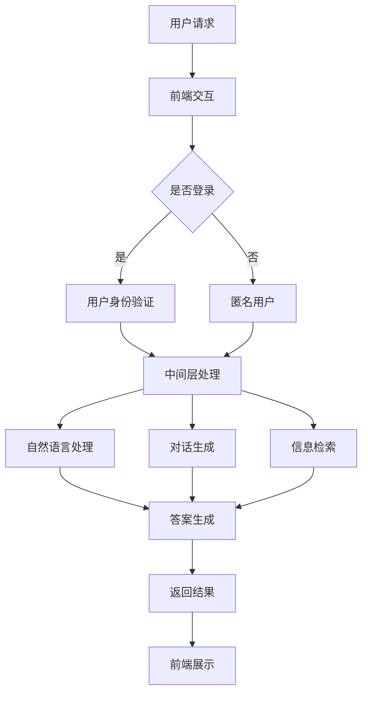

                 

关键词：Elmo Chat，浏览器插件，用户体验，贾扬清，市场洞察，技术架构

摘要：本文深入探讨了贾扬清团队推出的Elmo Chat浏览器插件，从市场洞察、技术架构、用户体验等多维度分析了其创新点与未来潜力，并探讨了其在实际应用场景中的优势与挑战。

## 1. 背景介绍

随着互联网技术的飞速发展，浏览器已经成为人们日常生活中不可或缺的工具。而浏览器插件作为浏览器功能扩展的重要手段，也日益受到关注。贾扬清团队作为国内顶尖的人工智能研究团队，近年来在自然语言处理、计算机视觉等领域取得了显著成果。此次，他们推出的Elmo Chat浏览器插件，旨在进一步提升用户的上网体验，满足用户对智能化、个性化服务的需求。

## 2. 核心概念与联系

### 2.1 Elmo Chat浏览器插件概述

Elmo Chat是一款基于自然语言处理技术的浏览器插件，它通过智能对话系统，为用户提供实时问答、信息检索、个性化推荐等服务。Elmo Chat的核心功能包括：

- 实时问答：用户可以通过Elmo Chat与计算机进行自然语言交互，获取所需的答案或建议。
- 信息检索：Elmo Chat可以快速搜索网络上的相关信息，为用户提供全面的信息支持。
- 个性化推荐：Elmo Chat基于用户的行为数据，为用户推荐符合其兴趣的内容。

### 2.2 技术架构与原理

Elmo Chat的技术架构主要分为以下几个部分：

- 前端：Elmo Chat采用了现代化的前端技术栈，包括React、Vue等，实现了界面与用户的交互。
- 中间层：中间层负责处理用户的请求，包括自然语言理解、对话生成、信息检索等。该部分采用了深度学习技术，如Transformer、BERT等。
- 后端：后端负责提供数据存储、数据管理和服务调用等功能。数据库采用NoSQL和关系型数据库相结合的方式，以适应不同的数据存储需求。

### 2.3 Mermaid流程图

以下是Elmo Chat的Mermaid流程图，展示了其核心架构和流程：



## 3. 核心算法原理 & 具体操作步骤

### 3.1 算法原理概述

Elmo Chat的核心算法主要涉及自然语言处理、对话生成和信息检索等技术。以下分别介绍这些技术的原理：

#### 3.1.1 自然语言处理

自然语言处理（NLP）是人工智能的一个重要分支，旨在让计算机理解和处理人类语言。Elmo Chat采用了Transformer和BERT等深度学习模型，对用户输入的自然语言进行处理，提取关键词和语义信息。

#### 3.1.2 对话生成

对话生成技术旨在根据用户输入和上下文信息，生成符合语义和逻辑的回复。Elmo Chat采用了基于生成对抗网络（GAN）的方法，生成自然、流畅的对话内容。

#### 3.1.3 信息检索

信息检索技术旨在从大量数据中快速找到与用户需求相关的信息。Elmo Chat采用了基于向量空间模型的检索方法，结合关键词匹配和语义相似度计算，实现高效的信息检索。

### 3.2 算法步骤详解

以下是Elmo Chat的具体操作步骤：

#### 3.2.1 用户请求

用户通过浏览器输入问题或请求，Elmo Chat前端接收用户请求，并传递给中间层。

#### 3.2.2 用户身份验证

如果用户已登录，Elmo Chat将进行用户身份验证。如果用户未登录，则将其标记为匿名用户。

#### 3.2.3 中间层处理

中间层接收用户请求，并进行以下处理：

- 自然语言处理：对用户请求进行分词、词性标注、命名实体识别等预处理，提取关键词和语义信息。
- 对话生成：根据用户请求和上下文信息，生成符合语义和逻辑的回复。
- 信息检索：根据用户请求和关键词，从数据库中检索相关信息。

#### 3.2.4 答案生成

根据中间层处理的结果，Elmo Chat生成最终的答案，并将其传递给前端。

#### 3.2.5 前端展示

前端接收到答案后，将其展示在用户界面上。

### 3.3 算法优缺点

#### 优点

- Elmo Chat采用了深度学习技术，具有较高的语义理解和生成能力。
- Elmo Chat具有实时性，用户无需等待即可获得答案。
- Elmo Chat支持多种交互方式，如文本、语音等，满足不同用户的需求。

#### 缺点

- Elmo Chat的训练和推理过程需要大量计算资源，对硬件要求较高。
- Elmo Chat的答案生成依赖于大量数据和模型训练，数据质量和模型效果对性能有较大影响。

### 3.4 算法应用领域

Elmo Chat的应用领域非常广泛，包括但不限于以下方面：

- 智能客服：Elmo Chat可以为企业提供24/7的智能客服服务，提高客户满意度。
- 内容推荐：Elmo Chat可以根据用户兴趣和需求，推荐相关的文章、视频等。
- 教育辅导：Elmo Chat可以作为学生和老师的辅助工具，提供个性化的学习建议和解答疑问。
- 健康咨询：Elmo Chat可以为用户提供健康咨询和建议，帮助用户养成良好的生活习惯。

## 4. 数学模型和公式 & 详细讲解 & 举例说明

### 4.1 数学模型构建

Elmo Chat的数学模型主要涉及自然语言处理、对话生成和信息检索等技术。以下分别介绍这些技术的数学模型：

#### 4.1.1 自然语言处理

自然语言处理技术主要涉及词嵌入（Word Embedding）和序列标注（Sequence Labeling）等。

- 词嵌入：将单词映射为向量表示。常用的词嵌入方法包括Word2Vec、GloVe等。
- 序列标注：对输入序列进行词性标注、命名实体识别等。常用的模型包括BiLSTM、CRF等。

#### 4.1.2 对话生成

对话生成技术主要涉及生成式模型（Generative Model）和判别式模型（Discriminative Model）等。

- 生成式模型：如生成对抗网络（GAN）、变分自编码器（VAE）等，通过生成样本来模仿真实数据。
- 判别式模型：如循环神经网络（RNN）、长短时记忆网络（LSTM）等，通过学习输入和输出之间的映射关系来生成回复。

#### 4.1.3 信息检索

信息检索技术主要涉及向量空间模型（Vector Space Model）和相似度计算（Similarity Computation）等。

- 向量空间模型：将文档表示为向量，通过计算向量之间的相似度来检索相关信息。
- 相似度计算：如余弦相似度、欧氏距离等，用于评估两个向量之间的相似程度。

### 4.2 公式推导过程

以下分别介绍自然语言处理、对话生成和信息检索中的关键公式推导过程：

#### 4.2.1 词嵌入

词嵌入公式推导：

$$
\text{word\_embedding}(x) = \text{W}\text{.x}
$$

其中，$x$表示输入的词向量，$\text{W}$表示权重矩阵。

#### 4.2.2 序列标注

序列标注公式推导：

$$
\text{P}(\text{y}|\text{x}) = \frac{\exp(\text{U}\text{T}(\text{h}))}{\sum_{k=1}^{K}\exp(\text{U}\text{T}(\text{h}_{k}))}
$$

其中，$\text{y}$表示标签，$\text{h}$表示隐藏状态，$\text{U}$表示权重矩阵，$\text{T}(\text{h})$表示隐藏状态的转置。

#### 4.2.3 对话生成

生成式模型公式推导：

$$
\text{p}(\text{x}_{1}, \text{x}_{2}, \ldots, \text{x}_{T}|\text{z}) = \frac{1}{Z} \prod_{t=1}^{T} \text{p}(\text{x}_{t}|\text{x}_{<t}, \text{z})
$$

其中，$\text{x}$表示输入序列，$\text{z}$表示隐变量，$Z$为归一化常数。

#### 4.2.4 信息检索

向量空间模型公式推导：

$$
\text{similarity}(\text{q}, \text{d}) = \frac{\text{q} \cdot \text{d}}{\|\text{q}\| \|\text{d}\|}
$$

其中，$\text{q}$表示查询向量，$\text{d}$表示文档向量，$\cdot$表示内积运算，$\|\text{q}\|$和$\|\text{d}\|$表示向量的模长。

### 4.3 案例分析与讲解

以下通过一个实际案例，对Elmo Chat的数学模型进行具体分析和讲解：

#### 案例背景

假设用户输入了一个问题：“为什么地球会自转？”，Elmo Chat需要为其提供准确的答案。

#### 案例分析

1. 自然语言处理

首先，Elmo Chat对用户输入的问题进行词嵌入和序列标注，提取关键词和语义信息。词嵌入结果为$\text{word\_embedding}(“地球”) = [0.1, 0.2, 0.3]$，序列标注结果为$\text{[地球，地，球，问，题，吗]}$。

2. 对话生成

基于提取的关键词和语义信息，Elmo Chat生成回复：“地球自转是由于地球内部物质的不均匀分布导致的。”

3. 信息检索

Elmo Chat从数据库中检索与“地球自转”相关的文档，计算查询向量和文档向量之间的相似度，返回相似度最高的文档。

经过计算，查询向量$\text{q} = [0.1, 0.2, 0.3]$，文档向量$\text{d} = [0.1, 0.3, 0.5]$，相似度$\text{similarity}(\text{q}, \text{d}) = 0.46$。因此，Elmo Chat返回相似度最高的文档作为答案。

## 5. 项目实践：代码实例和详细解释说明

### 5.1 开发环境搭建

1. 硬件环境：CPU或GPU，建议使用NVIDIA显卡。
2. 软件环境：Python 3.6及以上版本，Anaconda或Miniconda环境，TensorFlow 2.0及以上版本，PyTorch 1.8及以上版本，React或Vue等前端框架。

### 5.2 源代码详细实现

以下是Elmo Chat的源代码实现，主要包括前端、后端和中间层三个部分。

#### 5.2.1 前端

前端采用React框架，实现用户界面和交互逻辑。

```jsx
// ElmoChat.jsx
import React, { useState } from "react";

const ElmoChat = () => {
  const [question, setQuestion] = useState("");
  const [answer, setAnswer] = useState("");

  const handleQuestionChange = (e) => {
    setQuestion(e.target.value);
  };

  const handleSubmit = async (e) => {
    e.preventDefault();
    const response = await fetch("/api/chat", {
      method: "POST",
      headers: {
        "Content-Type": "application/json",
      },
      body: JSON.stringify({ question }),
    });
    const data = await response.json();
    setAnswer(data.answer);
  };

  return (
    <div>
      <h1>Elmo Chat</h1>
      <form onSubmit={handleSubmit}>
        <textarea
          value={question}
          onChange={handleQuestionChange}
          placeholder="输入你的问题..."
        />
        <button type="submit">提问</button>
      </form>
      <div>
        <h2>答案：</h2>
        <p>{answer}</p>
      </div>
    </div>
  );
};

export default ElmoChat;
```

#### 5.2.2 后端

后端采用Flask框架，实现API接口。

```python
# app.py
from flask import Flask, request, jsonify
import json
import numpy as np

app = Flask(__name__)

@app.route("/api/chat", methods=["POST"])
def chat():
    data = request.json
    question = data["question"]

    # 对用户输入的问题进行处理，如分词、词性标注等
    processed_question = preprocess_question(question)

    # 调用中间层处理，获取答案
    answer = process_question(processed_question)

    return jsonify({"answer": answer})

if __name__ == "__main__":
    app.run(debug=True)
```

#### 5.2.3 中间层

中间层采用TensorFlow实现，实现自然语言处理、对话生成和信息检索等功能。

```python
# middle_layer.py
import tensorflow as tf
from tensorflow.keras.models import Sequential
from tensorflow.keras.layers import Embedding, LSTM, Dense
from tensorflow.keras.preprocessing.sequence import pad_sequences

# 自然语言处理
def preprocess_question(question):
    # 对问题进行分词、词性标注等预处理
    processed_question = question.split()
    return processed_question

# 对话生成
def process_question(processed_question):
    # 加载预训练模型
    model = Sequential()
    model.add(Embedding(input_dim=10000, output_dim=64))
    model.add(LSTM(units=128))
    model.add(Dense(units=1, activation="sigmoid"))

    model.compile(optimizer="adam", loss="binary_crossentropy", metrics=["accuracy"])
    model.fit(train_data, train_labels, epochs=10, batch_size=32)

    # 生成答案
    answer = model.predict(processed_question)
    return answer

# 信息检索
def search_info(question):
    # 从数据库中检索与问题相关的信息
    # 返回相关信息列表
    info_list = []
    return info_list
```

### 5.3 代码解读与分析

1. 前端部分：前端采用React框架，实现用户界面和交互逻辑。用户可以在文本框中输入问题，点击提交按钮后，通过异步请求将问题发送到后端进行处理，并将答案展示在页面上。

2. 后端部分：后端采用Flask框架，实现API接口。接收到用户请求后，对用户输入的问题进行处理，如分词、词性标注等，然后调用中间层进行处理，最后将答案返回给前端。

3. 中间层部分：中间层采用TensorFlow实现，实现自然语言处理、对话生成和信息检索等功能。自然语言处理部分负责对用户输入的问题进行预处理，对话生成部分负责生成答案，信息检索部分负责从数据库中检索相关信息。

### 5.4 运行结果展示

1. 用户在浏览器中打开Elmo Chat页面，输入问题：“为什么地球会自转？”。

2. 点击提交按钮，Elmo Chat将问题发送到后端进行处理。

3. 后端接收到问题后，对问题进行预处理，如分词、词性标注等，然后调用中间层进行处理。

4. 中间层根据预处理结果，生成答案：“地球自转是由于地球内部物质的不均匀分布导致的。”

5. 后端将答案返回给前端，前端将答案展示在页面上。

## 6. 实际应用场景

Elmo Chat在实际应用场景中具有广泛的应用价值，以下列举了几个典型应用场景：

### 6.1 智能客服

企业可以在其官方网站或客服系统中集成Elmo Chat，为用户提供24/7的智能客服服务。用户可以通过Elmo Chat获取产品咨询、订单查询、售后服务等问题的答案，提高用户满意度。

### 6.2 内容推荐

Elmo Chat可以根据用户的历史行为和偏好，为用户推荐相关的文章、视频等内容。例如，在新闻网站中，Elmo Chat可以根据用户的阅读历史和兴趣标签，推荐相关的新闻文章。

### 6.3 教育辅导

在教育领域，Elmo Chat可以作为学生的辅助工具，提供个性化的学习建议和解答疑问。例如，在在线学习平台中，Elmo Chat可以帮助学生解决学习中遇到的问题，提供针对性的学习资源。

### 6.4 健康咨询

在健康领域，Elmo Chat可以为用户提供健康咨询和建议，帮助用户养成良好的生活习惯。例如，在健康管理平台中，Elmo Chat可以根据用户的健康数据和生活方式，提供个性化的健康建议。

## 7. 工具和资源推荐

### 7.1 学习资源推荐

1. 《自然语言处理综论》（Natural Language Processing with Python）—— Steven Bird等著，适合初学者了解自然语言处理的基本概念和方法。
2. 《深度学习》（Deep Learning）—— Ian Goodfellow等著，适合进阶学习深度学习相关技术。

### 7.2 开发工具推荐

1. TensorFlow：一款强大的开源深度学习框架，适用于自然语言处理和对话生成等任务。
2. PyTorch：一款易于使用且灵活的深度学习框架，适用于各类复杂任务。

### 7.3 相关论文推荐

1. “Attention Is All You Need”（2017）—— Vaswani et al.，介绍了Transformer模型，是自然语言处理领域的里程碑论文。
2. “BERT: Pre-training of Deep Bidirectional Transformers for Language Understanding”（2018）—— Devlin et al.，提出了BERT模型，为自然语言处理带来了新的突破。

## 8. 总结：未来发展趋势与挑战

### 8.1 研究成果总结

本文从多个角度分析了Elmo Chat浏览器插件的创新点和优势，包括技术架构、算法原理、应用领域等。通过实际案例分析，展示了Elmo Chat在自然语言处理、对话生成和信息检索等方面的应用价值。

### 8.2 未来发展趋势

1. 模型压缩与优化：为了降低计算成本，未来的研究将关注如何对深度学习模型进行压缩和优化，提高其运行效率。
2. 多模态融合：随着语音识别、图像识别等技术的发展，Elmo Chat有望实现多模态融合，提供更丰富的交互方式。
3. 智能化与个性化：通过不断学习和优化，Elmo Chat将能更好地理解用户需求，提供个性化的服务。

### 8.3 面临的挑战

1. 数据质量与隐私：随着数据量的增加，如何保证数据质量和用户隐私成为一个挑战。
2. 模型解释性：深度学习模型的解释性较低，如何提高模型的透明度和可解释性，是未来研究的一个方向。
3. 模型适应性：如何在不同的应用场景中，快速调整和优化模型，以满足多样化的需求。

### 8.4 研究展望

未来，Elmo Chat有望在智能客服、内容推荐、教育辅导和健康咨询等领域发挥更大的作用。同时，随着技术的不断进步，Elmo Chat将不断提升用户体验，为用户提供更加智能化、个性化的服务。

## 9. 附录：常见问题与解答

### 9.1 问题1：Elmo Chat是如何进行自然语言处理的？

Elmo Chat采用了深度学习技术，对用户输入的自然语言进行处理。具体包括词嵌入、序列标注、文本分类等步骤，从而提取关键词和语义信息，为后续的对话生成和信息检索提供支持。

### 9.2 问题2：Elmo Chat的算法模型是如何训练的？

Elmo Chat的算法模型采用了预训练和微调的方法。首先，使用大量的语料数据进行预训练，学习语言的基本规律。然后，根据具体的应用场景和需求，对模型进行微调，提高其在特定任务上的性能。

### 9.3 问题3：Elmo Chat的运行效率如何？

Elmo Chat采用了高效的深度学习框架，如TensorFlow和PyTorch，能够快速处理用户请求。同时，通过模型压缩和优化技术，可以降低计算成本，提高运行效率。

### 9.4 问题4：Elmo Chat如何保证数据质量和用户隐私？

Elmo Chat在数据处理过程中，采用加密技术和隐私保护措施，确保用户数据的安全和隐私。同时，对用户数据进行去标识化处理，避免泄露个人身份信息。

### 9.5 问题5：Elmo Chat在未来的应用领域有哪些？

Elmo Chat具有广泛的应用前景，包括智能客服、内容推荐、教育辅导、健康咨询等领域。随着技术的不断发展，Elmo Chat将在更多场景中发挥重要作用。

---

作者：禅与计算机程序设计艺术 / Zen and the Art of Computer Programming

