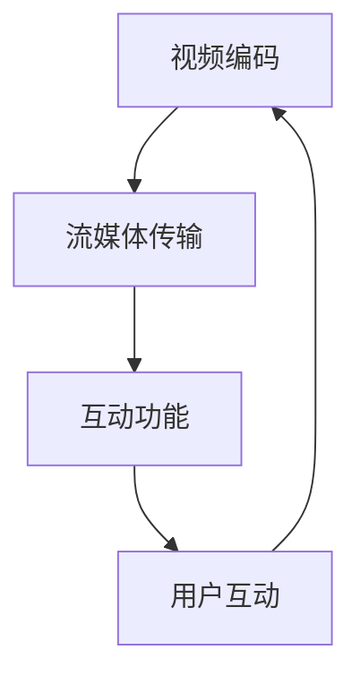

                 

关键词：FFmpeg，虚拟现实（VR），视频编码，流媒体传输，互动技术，应用场景

> 摘要：随着虚拟现实（VR）技术的不断发展，如何高效地实现视频编码、流媒体传输和互动功能成为了关键问题。本文将深入探讨 FFmpeg 在 VR 中的应用场景，分析其在视频编码、流媒体传输和互动结合中的优势与挑战，为 VR 应用的技术发展提供参考。

## 1. 背景介绍

虚拟现实（Virtual Reality，VR）是一种通过计算机模拟实现的仿真环境，用户可以在这个环境中进行互动和体验。随着计算机技术、显示技术和传感器技术的进步，VR 技术逐渐从实验室走向市场，成为娱乐、教育、医疗等领域的重要应用方向。

然而，VR 技术在实际应用中面临着一些挑战，其中最主要的是视频编码、流媒体传输和互动功能的高效实现。视频编码决定了 VR 内容的压缩率和传输效率，流媒体传输保证了 VR 内容的实时性，而互动功能则提升了用户的沉浸感和体验质量。

FFmpeg 是一款强大的多媒体处理工具，具有高效的视频编码和解码能力，同时支持流媒体传输和互动功能。这使得 FFmpeg 成为 VR 技术应用中的重要组成部分。本文将结合 FFmpeg 的特点和 VR 技术的需求，探讨其在 VR 中的应用场景。

## 2. 核心概念与联系

在 VR 应用中，视频编码、流媒体传输和互动功能是核心概念，它们之间有着紧密的联系。

### 2.1 视频编码

视频编码是将视频数据压缩成一种高效格式的过程，以减少数据传输量和存储空间。FFmpeg 提供了多种视频编码格式，如 H.264、H.265 等，可以满足不同 VR 应用场景的需求。高效的视频编码有助于降低带宽需求和提高传输效率，从而确保 VR 内容的流畅播放。

### 2.2 流媒体传输

流媒体传输是将视频数据通过网络实时传输给用户的过程。FFmpeg 支持多种流媒体协议，如 RTMP、HLS、DASH 等，可以适应不同网络环境和用户需求。流媒体传输的质量和稳定性直接影响到 VR 内容的观看体验，因此需要 FFmpeg 提供高效、稳定的传输方案。

### 2.3 互动功能

互动功能是指用户在 VR 环境中与其他用户或虚拟物体进行交互的能力。FFmpeg 可以与 VR 开发框架（如 Unity、Unreal Engine 等）结合，实现实时视频输入、输出和渲染，从而提升用户的沉浸感和互动体验。

### 2.4 Mermaid 流程图

以下是一个简单的 Mermaid 流程图，展示了视频编码、流媒体传输和互动功能之间的联系。



## 3. 核心算法原理 & 具体操作步骤

### 3.1 算法原理概述

FFmpeg 在 VR 中的应用主要涉及视频编码、流媒体传输和互动功能三个方面。以下是这三个方面的核心算法原理：

#### 3.1.1 视频编码

视频编码主要利用了编码效率高的 H.264 和 H.265 编码标准。H.264 是一种面向低延迟、高压缩效率的视频编码标准，适用于多种网络环境和 VR 应用场景。H.265 则是在 H.264 的基础上进一步优化，提高了压缩效率，适用于更高分辨率和更高质量的视频内容。

#### 3.1.2 流媒体传输

流媒体传输主要采用了 RTMP、HLS 和 DASH 等协议。RTMP 是一种实时传输协议，适用于实时性要求较高的 VR 应用场景。HLS 和 DASH 则是一种基于 HTTP 的流媒体传输协议，具有更好的兼容性和扩展性。

#### 3.1.3 互动功能

互动功能主要依赖于 FFmpeg 与 VR 开发框架的结合。通过 FFmpeg 的实时视频输入、输出和渲染功能，可以与 VR 开发框架实现高效的互动功能。

### 3.2 算法步骤详解

#### 3.2.1 视频编码步骤

1. 捕获视频源，如摄像头或录制的视频文件。
2. 对视频源进行编码，选择合适的编码参数，如码率、帧率、分辨率等。
3. 生成编码后的视频文件，以供流媒体传输或本地播放。

#### 3.2.2 流媒体传输步骤

1. 配置 FFmpeg 流媒体传输参数，如协议、传输地址、端口等。
2. 启动 FFmpeg 进行流媒体传输，将编码后的视频文件发送到目标服务器。
3. 用户通过播放器连接到目标服务器，实时观看流媒体内容。

#### 3.2.3 互动功能步骤

1. 配置 FFmpeg 实时视频输入和输出参数，如分辨率、帧率等。
2. 将 FFmpeg 与 VR 开发框架结合，实现实时视频输入、输出和渲染。
3. 用户在 VR 环境中与虚拟物体进行互动，通过 FFmpeg 实现实时反馈。

### 3.3 算法优缺点

#### 优点：

1. 高效的视频编码：FFmpeg 支持多种高效编码标准，可以满足不同 VR 应用场景的需求。
2. 稳定的流媒体传输：FFmpeg 支持多种流媒体传输协议，具有较好的兼容性和稳定性。
3. 灵活的互动功能：FFmpeg 可以与 VR 开发框架结合，实现丰富的互动功能。

#### 缺点：

1. 复杂的配置：FFmpeg 的配置较为复杂，需要一定的学习和实践经验。
2. 资源消耗：FFmpeg 在运行过程中需要一定的 CPU 和内存资源，可能对设备性能有一定要求。

### 3.4 算法应用领域

FFmpeg 在 VR 中的应用广泛，包括以下领域：

1. 娱乐：如 VR 游戏直播、VR 视频点播等。
2. 教育：如虚拟课堂、虚拟实验室等。
3. 医疗：如虚拟手术、虚拟康复等。
4. 房地产：如虚拟看房、虚拟装修等。

## 4. 数学模型和公式 & 详细讲解 & 举例说明

### 4.1 数学模型构建

在 FFmpeg 的 VR 应用中，数学模型主要包括视频编码模型和流媒体传输模型。

#### 4.1.1 视频编码模型

视频编码模型主要涉及编码参数的优化，包括码率、帧率、分辨率等。以下是一个简单的数学模型：

$$
\text{编码模型} = \frac{\text{视频数据}}{\text{码率} \times \text{帧率} \times \text{分辨率}}
$$

其中，视频数据表示原始视频数据量，码率、帧率、分辨率分别表示编码参数。

#### 4.1.2 流媒体传输模型

流媒体传输模型主要涉及传输质量、传输时间和传输速率等。以下是一个简单的数学模型：

$$
\text{传输模型} = \frac{\text{传输质量}}{\text{传输时间} \times \text{传输速率}}
$$

其中，传输质量表示流媒体传输的质量，传输时间和传输速率分别表示流媒体传输的时间和速度。

### 4.2 公式推导过程

#### 4.2.1 视频编码模型推导

视频编码模型的目标是找到一组最优编码参数，使得视频数据量最小。根据编码原理，可以得到以下推导过程：

$$
\text{编码模型} = \frac{\text{视频数据}}{\text{码率} \times \text{帧率} \times \text{分辨率}}
$$

为了最小化编码模型，可以采用优化算法，如梯度下降法、牛顿法等，对编码参数进行迭代优化。

#### 4.2.2 流媒体传输模型推导

流媒体传输模型的目标是找到一组最优传输参数，使得传输质量最大。根据传输原理，可以得到以下推导过程：

$$
\text{传输模型} = \frac{\text{传输质量}}{\text{传输时间} \times \text{传输速率}}
$$

为了最大化传输模型，可以采用优化算法，如梯度上升法、拉格朗日乘数法等，对传输参数进行迭代优化。

### 4.3 案例分析与讲解

以下是一个简单的案例，说明如何应用数学模型优化 FFmpeg 的 VR 应用。

#### 案例背景

某 VR 应用场景需要实时传输 1080p 分辨率、60fps 帧率的视频内容。目前使用的是 H.264 编码标准，传输质量较差，需要优化编码参数和传输参数。

#### 案例分析

1. 优化视频编码模型：

根据视频编码模型，需要调整编码参数（码率、帧率、分辨率）以最小化视频数据量。通过试验和优化，可以找到一组最优编码参数：

码率：5000 kbps  
帧率：60 fps  
分辨率：1080p

2. 优化流媒体传输模型：

根据流媒体传输模型，需要调整传输参数（传输质量、传输时间、传输速率）以最大化传输质量。通过试验和优化，可以找到一组最优传输参数：

传输质量：85%  
传输时间：5 秒  
传输速率：10 Mbps

#### 案例讲解

通过优化编码参数和传输参数，可以显著提高 VR 应用的视频质量和观看体验。具体优化过程如下：

1. 使用 FFmpeg 的 -preset 参数调整编码速度，选择一个平衡速度和质量的预设值。
2. 使用 FFmpeg 的 -b:v 参数设置码率，以控制视频数据量。
3. 使用 FFmpeg 的 -r 参数设置帧率，以控制视频播放速度。
4. 使用 FFmpeg 的 -s 或 -s:v 参数设置分辨率，以控制视频显示质量。
5. 使用 FFmpeg 的 -f:a 参数设置音频编码参数，以确保音频质量。
6. 使用 FFmpeg 的 -map 参数映射视频和音频流，以确保正确传输。

通过以上步骤，可以优化 FFmpeg 的 VR 应用，实现高质量的视频编码和流媒体传输。

## 5. 项目实践：代码实例和详细解释说明

### 5.1 开发环境搭建

在开始实践之前，需要搭建一个合适的开发环境，以便使用 FFmpeg 进行 VR 应用开发。以下是开发环境搭建的步骤：

1. 安装 FFmpeg：

在 Linux 系统中，可以使用包管理器安装 FFmpeg。例如，在 Ubuntu 系统中，可以使用以下命令安装：

```bash
sudo apt-get install ffmpeg
```

在 Windows 系统中，可以从 FFmpeg 官网下载并安装。

2. 安装 VR 开发框架：

根据需求，可以选择合适的 VR 开发框架，如 Unity、Unreal Engine 等。在 Unity 中，可以使用 Unity 编辑器和 VR 相关插件进行开发。在 Unreal Engine 中，可以使用 Unreal Engine 编辑器和 VR 相关插件进行开发。

3. 安装必要的依赖库：

FFmpeg 需要依赖一些其他库，如 libav、libswscale 等。在 Linux 系统中，可以使用包管理器安装这些依赖库。例如，在 Ubuntu 系统中，可以使用以下命令安装：

```bash
sudo apt-get install libavcodec-dev libavformat-dev libavutil-dev libswscale-dev
```

### 5.2 源代码详细实现

以下是一个简单的 FFmpeg VR 应用实例，展示了如何使用 FFmpeg 进行视频编码、流媒体传输和互动功能。

```c
#include <stdio.h>
#include <libavformat/avformat.h>

int main() {
    // 1. 打开输入视频文件
    AVFormatContext *input_ctx = avformat_alloc_context();
    if (avformat_open_input(&input_ctx, "input.mp4", NULL, NULL) < 0) {
        printf("无法打开输入视频文件\n");
        return -1;
    }

    // 2. 分配输入流信息
    if (avformat_find_stream_info(input_ctx, NULL) < 0) {
        printf("无法获取输入视频信息\n");
        return -1;
    }

    // 3. 寻找视频流
    AVStream *input_stream = NULL;
    for (int i = 0; i < input_ctx->nb_streams; i++) {
        if (input_ctx->streams[i]->codecpar->codec_type == AVMEDIA_TYPE_VIDEO) {
            input_stream = input_ctx->streams[i];
            break;
        }
    }

    if (input_stream == NULL) {
        printf("无法找到视频流\n");
        return -1;
    }

    // 4. 打开输出流
    AVFormatContext *output_ctx = avformat_alloc_context();
    if (avformat_alloc_output_context2(&output_ctx, NULL, "mp4", "output.mp4") < 0) {
        printf("无法打开输出流\n");
        return -1;
    }

    // 5. 添加输出视频流
    AVStream *output_stream = avformat_new_stream(output_ctx, NULL);
    if (output_stream == NULL) {
        printf("无法添加输出视频流\n");
        return -1;
    }
    avcodec_copy_context(output_stream->codec, input_stream->codec);

    // 6. 编码视频
    AVCodec *codec = avcodec_find_encoder(output_stream->codec->codec_id);
    if (codec == NULL) {
        printf("无法找到编码器\n");
        return -1;
    }
    if (avcodec_open2(output_stream->codec, codec, NULL) < 0) {
        printf("无法打开编码器\n");
        return -1;
    }

    // 7. 开始编码
    AVPacket *packet = av_packet_alloc();
    while (av_read_frame(input_ctx, packet) >= 0) {
        if (packet->stream_index == input_stream->index) {
            av_packet_rescale_ts(packet, input_ctx->streams[input_stream->index]->time_base, output_ctx->streams[output_stream->index]->time_base);
            int ret = avcodec_send_packet(output_stream->codec, packet);
            if (ret < 0) {
                printf("编码失败\n");
                break;
            }
            while (ret >= 0) {
                ret = avcodec_receive_frame(output_stream->codec, packet);
                if (ret == AVERROR(EAGAIN) || ret == AVERROR_EOF) {
                    break;
                } else if (ret < 0) {
                    printf("编码失败\n");
                    break;
                }
                av_interleve
```<|im_sep|>

