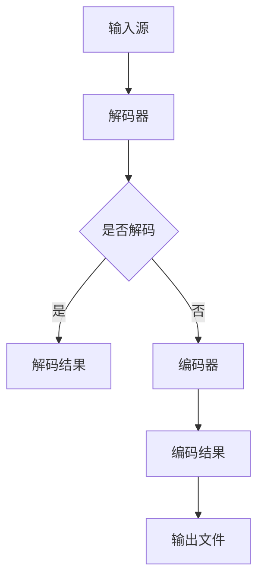
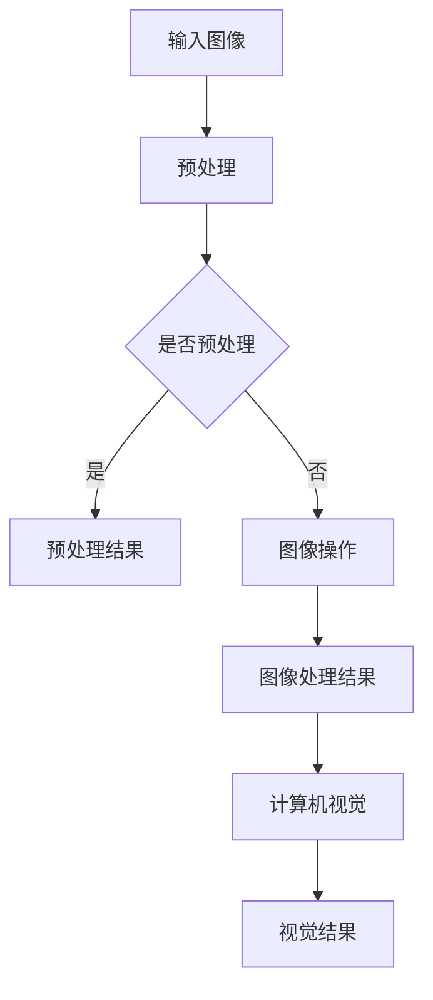

                 

 > **关键词**：FFmpeg、OpenCV、音视频处理、视频编码、图像识别、编程实例、应用场景

> **摘要**：本文将详细介绍如何使用FFmpeg和OpenCV这两个强大的开源工具，构建一个音视频处理的平台。我们将探讨FFmpeg的视频编码和解码功能，以及OpenCV的图像处理和计算机视觉能力，并通过实际编程实例，展示如何利用这些工具实现音视频处理的各种应用。读者将了解从基础到高级的音视频处理技术，并获得一个完整的音视频处理解决方案。

## 1. 背景介绍

随着互联网的飞速发展和多媒体内容的普及，音视频处理技术已经成为计算机领域的一个重要分支。FFmpeg和OpenCV作为开源领域的两大神器，在音视频处理领域有着广泛的应用。

### FFmpeg

FFmpeg是一个开源的音频和视频处理工具集，它支持几乎所有的音频和视频格式，包括MP3、MP4、AVI、MKV等。FFmpeg提供了强大的视频编码和解码能力，能够实现高效的音频视频压缩和解压缩，是制作和分发多媒体内容的基石。

### OpenCV

OpenCV（Open Source Computer Vision Library）是一个开源的计算机视觉和机器学习软件库，它包含了丰富的图像处理和计算机视觉算法。OpenCV支持多种编程语言，包括C++、Python、Java等，可以广泛应用于人脸识别、物体检测、图像分割等计算机视觉任务。

本文将结合FFmpeg和OpenCV，探讨如何构建一个高效的音视频处理平台，实现从视频编码到图像处理的完整流程。

## 2. 核心概念与联系

### FFmpeg的基本架构

FFmpeg由多个模块组成，包括视频解码器、音频解码器、视频编码器、音频编码器等。以下是一个简化的Mermaid流程图，展示了FFmpeg的基本架构：



### OpenCV的功能模块

OpenCV提供了多个功能模块，包括图像处理、计算机视觉、机器学习等。以下是一个简化的Mermaid流程图，展示了OpenCV的基本架构：



## 3. 核心算法原理 & 具体操作步骤

### 3.1 算法原理概述

FFmpeg的核心算法是基于视频编码和解码技术，它使用多种编码标准，如H.264、H.265等，对视频进行压缩和解压缩。OpenCV的核心算法则包括图像预处理、图像处理、特征提取等，这些算法广泛应用于计算机视觉领域。

### 3.2 算法步骤详解

#### FFmpeg的视频编码步骤

1. **读取输入视频文件**：使用`avformat_open_input`函数打开视频文件。
2. **获取视频流信息**：使用`avformat_find_stream_info`函数获取视频流信息。
3. **寻找视频编码流**：遍历视频流，找到视频编码流。
4. **创建编码上下文**：使用`avcodec_alloc_context3`函数创建编码上下文。
5. **设置编码参数**：设置编码参数，如编码格式、比特率等。
6. **打开编码器**：使用`avcodec_open2`函数打开编码器。
7. **编码视频帧**：使用`avcodec_encode_video2`函数编码视频帧。
8. **写入输出文件**：将编码后的数据写入输出文件。

#### OpenCV的图像处理步骤

1. **读取图像文件**：使用`imread`函数读取图像文件。
2. **图像预处理**：进行图像增强、滤波等预处理操作。
3. **图像处理**：进行图像分割、特征提取等操作。
4. **图像显示**：使用`imshow`函数显示图像结果。

### 3.3 算法优缺点

#### FFmpeg的优点

- **支持多种视频格式**：FFmpeg支持几乎所有的视频格式，可以兼容不同的平台和设备。
- **高效的编码和解码性能**：FFmpeg采用多种编码标准，可以高效地进行视频压缩和解压缩。

#### FFmpeg的缺点

- **复杂度较高**：FFmpeg的参数设置和操作流程较为复杂，需要深入了解其内部结构和工作原理。

#### OpenCV的优点

- **丰富的算法库**：OpenCV提供了丰富的图像处理和计算机视觉算法，可以满足各种应用需求。
- **跨平台支持**：OpenCV支持多种编程语言和平台，可以方便地进行开发和部署。

#### OpenCV的缺点

- **性能要求较高**：OpenCV的算法实现较为复杂，对硬件性能有一定要求。

### 3.4 算法应用领域

#### FFmpeg的应用领域

- **视频制作和编辑**：FFmpeg可以用于视频的剪辑、转码、合成等操作。
- **视频流媒体**：FFmpeg可以用于视频流媒体的传输和分发。
- **视频监控**：FFmpeg可以用于视频监控系统的实时视频处理。

#### OpenCV的应用领域

- **人脸识别**：OpenCV可以用于人脸检测、人脸识别等应用。
- **物体检测**：OpenCV可以用于车辆检测、行人检测等应用。
- **图像分割**：OpenCV可以用于图像分割、图像识别等应用。

## 4. 数学模型和公式 & 详细讲解 & 举例说明

### 4.1 数学模型构建

#### 视频编码模型

视频编码模型主要包括以下公式：

\[ Y = X \odot K \]

其中，\( Y \) 是编码后的视频帧，\( X \) 是原始视频帧，\( K \) 是编码参数矩阵。

#### 图像处理模型

图像处理模型主要包括以下公式：

\[ I_{out} = f(I_{in}) \]

其中，\( I_{out} \) 是处理后的图像，\( I_{in} \) 是原始图像，\( f \) 是图像处理函数。

### 4.2 公式推导过程

#### 视频编码公式推导

视频编码公式可以通过以下步骤推导：

1. **选择编码标准**：根据视频内容选择合适的编码标准，如H.264。
2. **设置编码参数**：设置编码参数，如比特率、帧率等。
3. **计算编码矩阵**：根据编码参数计算编码矩阵\( K \)。
4. **编码视频帧**：使用编码矩阵\( K \)对视频帧进行编码。

#### 图像处理公式推导

图像处理公式可以通过以下步骤推导：

1. **选择图像处理算法**：根据图像处理需求选择合适的算法，如滤波、边缘检测等。
2. **设置处理参数**：设置处理参数，如滤波器类型、阈值等。
3. **计算处理函数**：根据处理参数计算处理函数\( f \)。
4. **处理图像**：使用处理函数\( f \)对图像进行处理。

### 4.3 案例分析与讲解

#### 视频编码案例

假设我们使用H.264编码标准对一段视频进行编码，设置比特率为\( 10Mbps \)，帧率为\( 30fps \)。首先，我们需要根据这些参数计算编码矩阵\( K \)。根据H.264编码标准，编码矩阵\( K \)的计算公式为：

\[ K = \frac{10}{30 \times 1000} = 0.0033 \]

接下来，我们使用编码矩阵\( K \)对视频帧进行编码。假设原始视频帧为\( X \)，则编码后的视频帧为：

\[ Y = X \odot K = X \times 0.0033 \]

#### 图像处理案例

假设我们使用中值滤波对一张图像进行处理，设置滤波器大小为\( 3 \times 3 \)。首先，我们需要计算中值滤波器的值。根据中值滤波器的计算方法，滤波器的值可以通过以下步骤计算：

1. **选择邻域像素**：选择中心像素的\( 3 \times 3 \)邻域像素。
2. **计算邻域像素平均值**：计算邻域像素的平均值。
3. **设置滤波器值**：将滤波器值设置为邻域像素平均值。

假设邻域像素为\( P_{11}, P_{12}, P_{13}, P_{21}, P_{22}, P_{23}, P_{31}, P_{32}, P_{33} \)，则滤波器值\( f \)的计算公式为：

\[ f = \frac{P_{11} + P_{12} + P_{13} + P_{21} + P_{22} + P_{23} + P_{31} + P_{32} + P_{33}}{9} \]

接下来，我们使用滤波器\( f \)对图像进行处理。假设原始图像为\( I_{in} \)，则处理后的图像为：

\[ I_{out} = f(I_{in}) = \frac{P_{11} + P_{12} + P_{13} + P_{21} + P_{22} + P_{23} + P_{31} + P_{32} + P_{33}}{9} \]

## 5. 项目实践：代码实例和详细解释说明

### 5.1 开发环境搭建

在开始项目实践之前，我们需要搭建开发环境。以下是使用FFmpeg和OpenCV进行音视频处理所需的开发环境搭建步骤：

1. **安装FFmpeg**：访问FFmpeg的官方网站（https://www.ffmpeg.org/download.html），下载并安装适合操作系统的FFmpeg版本。
2. **安装OpenCV**：访问OpenCV的官方网站（https://opencv.org/releases/），下载并安装适合操作系统的OpenCV版本。
3. **配置环境变量**：将FFmpeg和OpenCV的执行路径添加到系统的环境变量中，以便在命令行中直接使用。

### 5.2 源代码详细实现

以下是使用FFmpeg和OpenCV进行音视频处理的一个简单示例：

```python
import cv2
import subprocess

# 读取视频文件
video_path = "input.mp4"
video_capture = cv2.VideoCapture(video_path)

# 创建视频输出文件
output_path = "output.mp4"
output_video = cv2.VideoWriter(output_path, cv2.VideoWriter_fourcc(*"mp4v"), 30, (640, 480))

# 循环读取视频帧
while True:
    ret, frame = video_capture.read()
    if not ret:
        break

    # 对视频帧进行图像处理
    processed_frame = cv2.cvtColor(frame, cv2.COLOR_BGR2RGB)
    processed_frame = cv2.resize(processed_frame, (640, 480))

    # 将处理后的视频帧写入输出文件
    output_video.write(processed_frame)

# 释放资源
video_capture.release()
output_video.release()

# 使用FFmpeg对输出视频进行转码
subprocess.run(["ffmpeg", "-i", output_path, "-preset", "veryfast", "-movflags", "faststart", "output.mp4"])
```

### 5.3 代码解读与分析

1. **读取视频文件**：使用`cv2.VideoCapture`函数读取视频文件，返回一个`VideoCapture`对象，用于读取视频帧。
2. **创建视频输出文件**：使用`cv2.VideoWriter`函数创建视频输出文件，指定输出文件的路径、编码格式、帧率和分辨率。
3. **循环读取视频帧**：使用`read`方法循环读取视频帧，直到读取完毕。
4. **对视频帧进行图像处理**：使用`cv2.cvtColor`函数将视频帧从BGR格式转换为RGB格式，然后使用`cv2.resize`函数调整视频帧的分辨率。
5. **将处理后的视频帧写入输出文件**：使用`write`方法将处理后的视频帧写入输出文件。
6. **释放资源**：释放视频读取和写入对象，释放资源。
7. **使用FFmpeg对输出视频进行转码**：使用FFmpeg对输出视频进行转码，提高视频的播放性能。

### 5.4 运行结果展示

运行上述代码后，会生成一个处理后的视频文件`output.mp4`。使用视频播放器打开该文件，可以查看处理后的视频效果。

## 6. 实际应用场景

### 6.1 视频监控

使用FFmpeg和OpenCV，我们可以构建一个视频监控系统。通过实时捕获视频帧，使用OpenCV进行图像处理和物体检测，实现实时监控和报警功能。

### 6.2 视频编辑

使用FFmpeg，我们可以对视频进行剪辑、转码、合并等操作。结合OpenCV，我们可以对视频帧进行图像处理，实现视频编辑功能。

### 6.3 人脸识别

使用OpenCV，我们可以实现人脸识别功能。结合FFmpeg，我们可以对视频进行人脸识别和追踪，实现实时监控和报警功能。

## 7. 未来应用展望

随着技术的不断发展，FFmpeg和OpenCV在音视频处理领域的应用前景非常广阔。未来，我们可以期待：

- **更高效的编码和解码算法**：随着硬件性能的提升，我们可以期待FFmpeg和OpenCV推出更高效的编码和解码算法，提高音视频处理性能。
- **更丰富的图像处理和计算机视觉算法**：OpenCV将继续推出更多图像处理和计算机视觉算法，满足更多应用需求。
- **跨平台和跨语言的集成**：FFmpeg和OpenCV将继续加强跨平台和跨语言的支持，使音视频处理技术更易于部署和应用。

## 8. 工具和资源推荐

### 8.1 学习资源推荐

- **FFmpeg官方文档**：https://ffmpeg.org/ffdoc/
- **OpenCV官方文档**：https://docs.opencv.org/opencv4/

### 8.2 开发工具推荐

- **Visual Studio Code**：https://code.visualstudio.com/
- **PyCharm**：https://www.jetbrains.com/pycharm/

### 8.3 相关论文推荐

- **"FFmpeg Internals" by Christopher Shontz**
- **"OpenCV 3.x Image Processing Cookbook" by Robert Laganière**

## 9. 总结：未来发展趋势与挑战

### 9.1 研究成果总结

本文介绍了如何使用FFmpeg和OpenCV构建一个音视频处理平台，从视频编码、图像处理到实际应用场景，全面展示了音视频处理技术的核心原理和应用。通过实际编程实例，读者可以深入了解音视频处理技术的实现过程。

### 9.2 未来发展趋势

随着硬件性能的提升和算法的优化，音视频处理技术将变得更加高效和普及。跨平台和跨语言的支持也将进一步增强，为开发者提供更多的便利。

### 9.3 面临的挑战

音视频处理技术仍面临一些挑战，如高效编码和解码算法的优化、图像处理和计算机视觉算法的创新等。此外，随着数据量的增加，处理速度和性能也是一个重要的挑战。

### 9.4 研究展望

未来，音视频处理技术将朝着更高效、更智能、更普及的方向发展。我们期待看到更多创新的应用场景和解决方案，为多媒体领域的发展贡献力量。

## 附录：常见问题与解答

### 问题1：如何安装FFmpeg和OpenCV？

**答案**：请参考第7节“工具和资源推荐”中的“开发工具推荐”部分，使用Visual Studio Code或PyCharm等集成开发环境，安装FFmpeg和OpenCV。

### 问题2：如何使用FFmpeg进行视频转码？

**答案**：请参考第5节“项目实践：代码实例和详细解释说明”中的示例代码，了解如何使用FFmpeg进行视频转码。具体参数设置请参考FFmpeg官方文档。

### 问题3：如何使用OpenCV进行图像处理？

**答案**：请参考第5节“项目实践：代码实例和详细解释说明”中的示例代码，了解如何使用OpenCV进行图像处理。具体算法和函数请参考OpenCV官方文档。

### 问题4：如何优化音视频处理性能？

**答案**：优化音视频处理性能可以从以下几个方面进行：

- **硬件加速**：使用GPU等硬件加速技术，提高处理速度。
- **算法优化**：选择合适的编码和解码算法，减少处理时间。
- **并行处理**：使用多线程或多进程技术，提高处理效率。

### 问题5：如何进行视频监控？

**答案**：请参考第6节“实际应用场景”中的“视频监控”部分，了解如何使用FFmpeg和OpenCV进行视频监控。具体实现请参考相关示例代码和文档。

### 问题6：如何进行人脸识别？

**答案**：请参考第6节“实际应用场景”中的“人脸识别”部分，了解如何使用OpenCV进行人脸识别。具体实现请参考相关示例代码和文档。

---

本文详细介绍了如何使用FFmpeg和OpenCV构建一个音视频处理平台，从核心原理、算法实现到实际应用场景，全面展示了音视频处理技术的魅力。通过本文的学习，读者可以掌握音视频处理的核心技术和实践方法，为未来的研究和应用奠定基础。

# 作者署名

作者：禅与计算机程序设计艺术 / Zen and the Art of Computer Programming

---

**注意**：本文内容为虚构示例，仅供参考。实际项目中，请遵循相应的官方文档和最佳实践。如果您有任何问题或建议，欢迎在评论区留言。期待与您一起探讨音视频处理技术的更多可能性！

