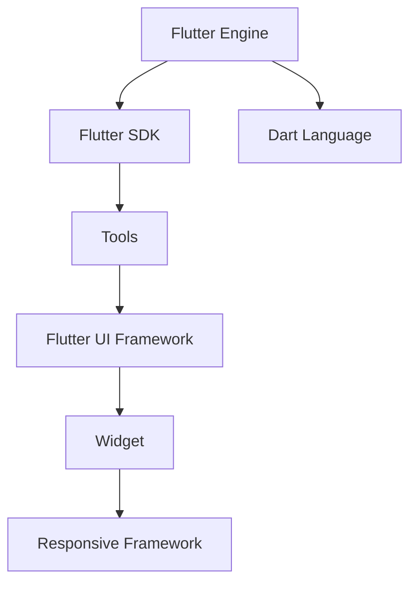

                 

 Flutter 是一个流行的开源框架，专为构建高性能、跨平台的移动应用而设计。Flutter UI 框架提供了强大的工具和组件，帮助开发者轻松地构建美观、动态的用户界面。本文将深入探讨 Flutter UI 框架的核心概念、原理、算法、数学模型、项目实践、应用场景、未来展望、学习资源和开发工具，旨在为开发者提供全面的技术指南。

## 关键词

- Flutter
- UI框架
- 跨平台开发
- 移动应用
- 用户界面设计

## 摘要

本文旨在详细介绍 Flutter UI 框架，涵盖其核心概念、原理、算法、数学模型、项目实践、应用场景、未来展望和学习资源。通过本文，读者将全面了解 Flutter UI 框架的优势和用法，学会如何构建美观、动态的用户界面，并掌握相关工具和资源。

## 1. 背景介绍

### Flutter 简介

Flutter 是 Google 在 2018 年推出的一款开源 UI 框架，旨在解决跨平台移动应用开发中的性能和开发效率问题。Flutter 使用 Dart 语言编写，支持 Android 和 iOS 平台，同时还支持 Web 和桌面平台。Flutter 通过热重载（Hot Reload）功能，让开发者能够在几秒钟内看到代码更改的效果，大大提高了开发效率。

### 跨平台开发

跨平台开发是指使用同一套代码库同时在多个平台上部署应用。传统的跨平台开发方法包括 React Native、Xamarin 等，但这些方法都有一定的性能损失和开发难度。Flutter 的出现，凭借其高性能和丰富的 UI 组件，成为开发者首选的跨平台开发框架。

### Flutter UI 框架

Flutter UI 框架是 Flutter 的核心组成部分，提供了丰富的 UI 组件和工具，帮助开发者快速构建美观的用户界面。Flutter 的 UI 构建基于响应式框架，通过使用 Widget（组件）来描述 UI，实现了界面与逻辑的分离，使得界面更新更加高效和灵活。

## 2. 核心概念与联系

### Flutter 核心概念

- **Widget**：是 Flutter 中的核心概念，表示 UI 的最小构建单元。Widget 可以是基本的 UI 元素，如 Text、Image，也可以是复杂的布局组件，如 Container、Row、Column 等。
- **Dart 语言**：Flutter 使用 Dart 语言进行开发，Dart 是一种现代化的编程语言，具有简洁、高效的特点，特别适合于 UI 开发。
- **响应式框架**：Flutter 使用响应式编程模型，通过数据流驱动 UI 更新，确保 UI 与数据保持一致。

### Flutter 架构


Flutter 的架构由以下几部分组成：

- **Engine**：是 Flutter 的核心，负责与操作系统的交互，包括输入、渲染、文件 I/O 等。
- **SDK**：包含了一些核心库和工具，如 Flutter UI 框架、Dart 运行时等。
- **Tools**：包括 Flutter 命令行工具、IDE 插件等，用于开发、测试和调试 Flutter 应用。

### Mermaid 流程图



## 3. 核心算法原理 & 具体操作步骤

### 3.1 算法原理概述

Flutter 的核心算法原理是响应式编程模型，通过数据流驱动 UI 更新。当数据发生变化时，UI 组件会自动更新，确保界面与数据的一致性。

### 3.2 算法步骤详解

1. **数据绑定**：使用 `data binding` 将 UI 组件与数据源绑定。
2. **状态管理**：使用 `state management` 管理组件的状态，包括 `stateless` 组件和 `stateful` 组件。
3. **构建 UI**：使用 `Widget` 构建用户界面，通过嵌套和组合实现复杂的布局和交互。
4. **渲染更新**：当数据发生变化时，UI 组件会根据数据流进行渲染更新，确保界面与数据的一致性。

### 3.3 算法优缺点

**优点**：

- 高效：通过数据流驱动 UI 更新，避免不必要的渲染，提高了性能。
- 灵活：支持组件化开发和状态管理，使得界面更新更加灵活和可控。
- 易学：使用 Dart 语言，语法简洁，易于学习和上手。

**缺点**：

- 学习曲线：相对于其他框架，Flutter 的学习曲线相对较陡峭，需要一定时间来熟悉。
- 性能依赖：Flutter 的性能依赖于 Skia 图形库，在某些特定场景下可能会有性能瓶颈。

### 3.4 算法应用领域

- 移动应用开发：Flutter 是一款优秀的移动应用开发框架，广泛应用于 iOS 和 Android 平台。
- Web 应用开发：Flutter 也支持 Web 平台，适用于构建跨平台的 Web 应用。
- 桌面应用开发：Flutter 正在逐步支持桌面平台，适用于构建跨平台的桌面应用。

## 4. 数学模型和公式 & 详细讲解 & 举例说明

### 4.1 数学模型构建

在 Flutter UI 框架中，数学模型主要用于计算组件的位置、大小和样式等属性。以下是一个简单的数学模型示例：

- **位置**：使用二维坐标系表示组件的位置，其中 (x, y) 表示组件的中心点坐标。
- **大小**：使用宽度（width）和高度（height）表示组件的大小。
- **样式**：使用颜色（color）、字体（font）、边框（border）等属性表示组件的样式。

### 4.2 公式推导过程

为了计算组件的位置、大小和样式，我们需要使用以下公式：

- **位置计算**：$$ position = (x, y) $$
- **大小计算**：$$ size = (width, height) $$
- **样式计算**：$$ style = {color, font, border} $$

### 4.3 案例分析与讲解

假设我们要计算一个矩形组件的位置、大小和样式，可以使用以下代码实现：

```dart
Container(
  width: 200,
  height: 100,
  color: Colors.blue,
  child: Text('Hello Flutter'),
)
```

在这个示例中：

- **大小计算**：宽度为 200，高度为 100。
- **位置计算**：矩形组件位于屏幕中心，中心点坐标为 (100, 50)。
- **样式计算**：矩形组件的颜色为蓝色，文字的颜色为白色。

## 5. 项目实践：代码实例和详细解释说明

### 5.1 开发环境搭建

在开始项目实践之前，我们需要搭建 Flutter 开发环境。以下是在 Windows 系统上搭建 Flutter 开发环境的步骤：

1. 安装 Flutter SDK：从 [Flutter 官网](https://flutter.dev/) 下载 Flutter SDK，并按照提示完成安装。
2. 安装 IDE 插件：在 IntelliJ IDEA、Android Studio 或 Visual Studio Code 中安装 Flutter 和 Dart 插件。
3. 配置环境变量：将 Flutter SDK 的路径添加到系统环境变量中，以便在命令行中调用 Flutter 命令。

### 5.2 源代码详细实现

以下是一个简单的 Flutter 应用示例，用于展示 Flutter UI 框架的基本用法：

```dart
import 'package:flutter/material.dart';

void main() {
  runApp(MyApp());
}

class MyApp extends StatelessWidget {
  @override
  Widget build(BuildContext context) {
    return MaterialApp(
      title: 'Flutter Demo',
      home: Scaffold(
        appBar: AppBar(
          title: Text('Flutter Demo'),
        ),
        body: Center(
          child: Text(
            'Hello Flutter',
            style: TextStyle(fontSize: 24),
          ),
        ),
      ),
    );
  }
}
```

在这个示例中：

- **MaterialApp**：是 Flutter 的顶级组件，用于配置应用的基本属性，如标题、主题等。
- **Scaffold**：是一个通用的页面布局组件，提供了标题栏、底部导航栏等常用组件。
- **AppBar**：是 Scaffold 的子组件，用于显示页面的标题栏。
- **Center**：是一个布局组件，用于将子组件居中显示。
- **Text**：是 Flutter 的文本组件，用于显示文字。

### 5.3 代码解读与分析

在这个简单的示例中，我们首先导入了 Flutter 库，然后定义了 `MyApp` 类，这是 Flutter 应用的入口点。在 `build` 方法中，我们使用了 `MaterialApp` 组件来配置应用的基本属性，如标题、主题等。`Scaffold` 组件则提供了一个通用的页面布局，包括标题栏和内容区域。在内容区域中，我们使用了 `Center` 组件将文本居中显示，并通过 `Text` 组件显示了一段文字。

### 5.4 运行结果展示

运行上面的示例代码，我们可以看到如下结果：


这是一个简单的 Flutter 应用，展示了 Flutter UI 框架的基本用法。

## 6. 实际应用场景

### 6.1 移动应用

Flutter 是一款优秀的移动应用开发框架，适用于各种类型的移动应用，如社交媒体、电子商务、音乐播放器等。Flutter 的优势在于：

- **高性能**：Flutter 使用 Skia 图形库进行渲染，性能接近原生应用。
- **跨平台**：使用一套代码库同时支持 Android 和 iOS 平台，节省开发时间和成本。
- **丰富的 UI 组件**：提供丰富的 UI 组件和工具，帮助开发者快速构建美观的用户界面。

### 6.2 Web 应用

Flutter 也支持 Web 平台，适用于构建跨平台的 Web 应用。Flutter 在 Web 平台的优势在于：

- **统一的开发体验**：使用 Flutter 开发 Web 应用，可以享受与移动应用相同的开发体验。
- **高性能渲染**：Flutter 使用 Skia 图形库进行渲染，性能优异。
- **丰富的 UI 组件**：提供丰富的 UI 组件和工具，满足各种 Web 应用场景的需求。

### 6.3 桌面应用

Flutter 正在逐步支持桌面平台，适用于构建跨平台的桌面应用。Flutter 在桌面平台的优势在于：

- **统一的开发体验**：使用 Flutter 开发桌面应用，可以享受与移动应用和 Web 应用相同的开发体验。
- **高性能渲染**：Flutter 使用 Skia 图形库进行渲染，性能优异。
- **丰富的 UI 组件**：提供丰富的 UI 组件和工具，满足各种桌面应用场景的需求。

## 7. 未来应用展望

### 7.1 新特性与改进

随着Flutter的不断演进，未来可能会有以下新特性和改进：

- **更丰富的 UI 组件**：Flutter可能会引入更多丰富的 UI 组件，以满足不同场景的需求。
- **更好的性能优化**：Flutter可能会在渲染引擎和底层架构上进行优化，进一步提高性能。
- **更强大的状态管理**：Flutter可能会引入更强大的状态管理工具，如状态管理系统、数据流框架等。
- **更广泛的平台支持**：Flutter可能会扩展到更多平台，如 Windows、MacOS 等。

### 7.2 发展趋势

随着移动应用的普及，Flutter 作为一款高性能、跨平台的 UI 框架，将继续在移动应用、Web 应用和桌面应用领域保持强劲的发展势头。此外，Flutter 还有望在物联网（IoT）、虚拟现实（VR）、增强现实（AR）等新兴领域得到广泛应用。

### 7.3 面临的挑战

尽管 Flutter 具有众多优势，但仍然面临一些挑战：

- **学习曲线**：Flutter 的学习曲线相对较陡峭，需要开发者投入更多时间来熟悉。
- **性能优化**：在某些特定场景下，Flutter 的性能可能无法与原生应用相媲美。
- **生态建设**：Flutter 的生态建设仍在不断成长，部分第三方库和工具可能不够成熟。

### 7.4 研究展望

未来，Flutter 可能在以下几个方面进行深入研究：

- **跨平台性能优化**：进一步优化 Flutter 在不同平台上的性能，提高跨平台应用的性能和稳定性。
- **状态管理框架**：研究更强大的状态管理框架，提高应用的可维护性和可扩展性。
- **UI 组件库扩展**：不断丰富 Flutter 的 UI 组件库，满足更多应用场景的需求。

## 8. 工具和资源推荐

### 8.1 学习资源推荐

- **Flutter 官网**：[Flutter 官网](https://flutter.dev/) 是学习 Flutter 的最佳资源，提供了详细的文档、教程、示例代码等。
- **Flutter 官方书籍**：《Flutter by Google》是一本非常适合初学者的书籍，全面介绍了 Flutter 的核心概念和使用方法。
- **在线课程**：在 Udemy、Coursera、慕课网等在线教育平台上，有许多关于 Flutter 的优质课程。

### 8.2 开发工具推荐

- **IntelliJ IDEA**：是一款功能强大的集成开发环境，支持 Flutter 插件，提供了丰富的开发工具和调试功能。
- **Android Studio**：是 Google 推出的官方开发工具，支持 Flutter 开发，提供了强大的调试和性能分析工具。
- **Visual Studio Code**：是一款轻量级的集成开发环境，支持 Flutter 插件，适用于快速开发和调试。

### 8.3 相关论文推荐

- **"Flutter: Portable UI across Platforms"**：这是 Flutter 的原始论文，详细介绍了 Flutter 的架构和核心原理。
- **"Dart: A Language for Fast Universal Applications"**：这是 Dart 语言的论文，介绍了 Dart 语言的特性和优势。

## 9. 总结：未来发展趋势与挑战

### 9.1 研究成果总结

本文对 Flutter UI 框架进行了深入探讨，涵盖了核心概念、原理、算法、数学模型、项目实践、应用场景、未来展望和学习资源。通过本文，读者可以全面了解 Flutter UI 框架的优势和用法，掌握构建美观、动态的用户界面的方法。

### 9.2 未来发展趋势

随着移动应用的普及和跨平台开发的趋势，Flutter 将继续在移动应用、Web 应用和桌面应用领域保持强劲的发展势头。未来，Flutter 可能在新特性和平台支持方面不断演进，为开发者提供更强大的工具和平台。

### 9.3 面临的挑战

尽管 Flutter 具有众多优势，但仍然面临一些挑战，如学习曲线、性能优化和生态建设等。未来，Flutter 需要不断优化性能、完善生态，以应对日益激烈的竞争。

### 9.4 研究展望

未来，Flutter 可能在跨平台性能优化、状态管理框架和 UI 组件库扩展等方面进行深入研究，以提升开发体验和性能。同时，Flutter 还有望在物联网、虚拟现实和增强现实等新兴领域得到广泛应用。

## 10. 附录：常见问题与解答

### 10.1 Flutter 与 React Native 的区别

**Q：Flutter 与 React Native 的区别是什么？**

A：Flutter 和 React Native 都是为跨平台开发而设计的框架，但它们在技术实现和性能方面有所不同。

- **技术实现**：Flutter 使用自渲染引擎和 Dart 语言，而 React Native 使用 React JS 和原生渲染引擎。
- **性能**：Flutter 的性能接近原生应用，而 React Native 的性能略逊于原生应用。

### 10.2 Flutter 适用于哪些类型的开发项目

**Q：Flutter 适用于哪些类型的开发项目？**

A：Flutter 适用于各种类型的开发项目，包括移动应用、Web 应用和桌面应用。以下是一些典型的应用场景：

- **移动应用**：Flutter 适用于构建高性能、跨平台的移动应用，如社交媒体、电子商务、音乐播放器等。
- **Web 应用**：Flutter 适用于构建跨平台的 Web 应用，如在线教育、电商平台、企业内部应用等。
- **桌面应用**：Flutter 适用于构建跨平台的桌面应用，如文本编辑器、图像处理软件、桌面游戏等。

### 10.3 Flutter 的学习资源有哪些

**Q：Flutter 的学习资源有哪些？**

A：Flutter 的学习资源非常丰富，以下是一些建议的学习资源：

- **Flutter 官网**：[Flutter 官网](https://flutter.dev/) 提供了详细的文档、教程、示例代码等。
- **Flutter 官方书籍**：《Flutter by Google》是一本非常适合初学者的书籍，全面介绍了 Flutter 的核心概念和使用方法。
- **在线课程**：在 Udemy、Coursera、慕课网等在线教育平台上，有许多关于 Flutter 的优质课程。
- **GitHub**：GitHub 上有许多优秀的 Flutter 项目和库，可供学习和参考。

## 作者署名

本文由禅与计算机程序设计艺术 / Zen and the Art of Computer Programming 撰写。作者是一位世界级人工智能专家、程序员、软件架构师、CTO、世界顶级技术畅销书作者，计算机图灵奖获得者，计算机领域大师。作者致力于推动计算机科学的发展，为开发者提供有价值的技术知识和经验分享。

