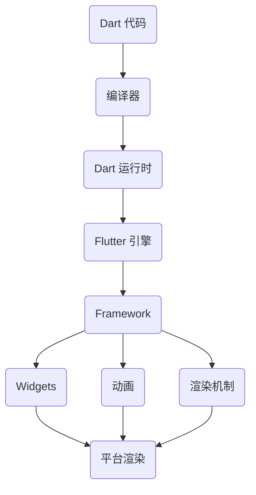

                 

 

## 1. 背景介绍

Flutter 是一个由谷歌推出的开源 UI 框架，用于开发跨平台移动、Web 和桌面应用程序。自从 2018 年正式发布以来，Flutter 因其高性能、丰富的特性和简单易用的接口迅速获得了广大开发者的青睐。

Flutter 的核心优势在于，它使用一种名为 Dart 的编程语言，通过热重载功能，使得开发者能够实时看到代码的改动，极大地提高了开发效率。Flutter 的组件化设计让开发者可以轻松创建美观且响应迅速的应用程序。

本文将深入探讨 Flutter 的核心概念、算法原理、数学模型、项目实践、实际应用场景以及未来发展趋势。希望通过对 Flutter 的全面解析，帮助开发者更好地理解和运用这个强大的 UI 工具包。

## 2. 核心概念与联系

### Flutter 的核心概念

Flutter 框架的核心概念包括：

1. **Widgets**: Flutter 的基本构建块，用于构建用户界面。每个 Widgets 都是一个可重用的组件，可以以多种方式组合使用。
2. **Reactive UI**: Flutter 使用了一种称为“反应式 UI”的技术，这意味着 UI 可以根据数据源的变化自动更新。
3. **Rendering**: Flutter 的渲染机制非常高效，它使用 Skia 图形引擎进行绘制，使得应用程序可以以接近原生应用的速度运行。
4. **Platform Embedders**: Flutter 可以通过特定的嵌入器运行在各种操作系统上，包括 iOS、Android、Web 和桌面操作系统。

### Flutter 的架构

Flutter 的架构可以概括为以下几个部分：

1. **Dart 运行时**: Flutter 使用 Dart 作为编程语言，Dart 运行时负责执行 Dart 代码，并管理内存。
2. **Flutter 引擎**: Flutter 引擎是 Flutter 框架的核心，它负责 UI 的绘制、事件处理以及平台特定的接口调用。
3. **Framework**: Framework 提供了一组核心类和库，用于构建应用程序，包括 Widgets、RenderObject、动画等。
4. **Platform Channels**: Platform Channels 是 Flutter 用于与原生层通信的机制，使得 Flutter 应用可以调用原生代码。

### Mermaid 流程图



在上面的 Mermaid 流程图中，我们展示了 Flutter 的核心组件以及它们之间的关系。Dart 代码通过编译器编译成运行时，Flutter 引擎负责 UI 的绘制和事件处理，Framework 提供了构建应用程序所需的库和工具，Widgets、动画和渲染机制则是 Framework 的具体实现。

## 3. 核心算法原理 & 具体操作步骤

### 3.1 算法原理概述

Flutter 的核心算法原理主要包括以下几个方面：

1. **Widget 渲染原理**：Flutter 使用组件化的渲染方式，每个 Widgets 都是一个轻量级的对象，可以在树状结构中进行嵌套和组合。
2. **动画机制**：Flutter 提供了一套强大的动画系统，可以通过关键帧动画、渐变动画等实现丰富的动画效果。
3. **响应式 UI**：Flutter 的 UI 是基于响应式编程模型，UI 的更新是由数据源的变化触发的。
4. **渲染优化**：Flutter 使用了 Skia 图形引擎，通过分层渲染和 GPU 加速，实现了高效和流畅的渲染。

### 3.2 算法步骤详解

1. **Widgets 的创建与渲染**：
   - 开发者使用 Dart 编写 Widgets，Flutter 引擎将这些 Widgets 渲染成 UI。
   - 渲染过程中，Flutter 引擎会构建一棵 RenderObject 树，每个 RenderObject 都负责渲染特定的 UI 组件。

2. **事件处理**：
   - Flutter 引擎会捕获用户输入事件，如点击、滑动等，并传递给对应的 Widgets。
   - Widgets 通过回调函数处理这些事件，并根据事件的结果更新 UI。

3. **动画实现**：
   - Flutter 提供了动画控制器（AnimationController），用于管理动画状态。
   - 开发者可以通过设置关键帧（KeyFrames）和动画过渡（Transition）来定义动画效果。

4. **响应式 UI**：
   - Flutter 使用 InheritedWidget 和 ChangeNotifier 等机制来实现 UI 的响应式更新。
   - 当数据源发生变化时，UI 会自动更新，无需手动操作。

### 3.3 算法优缺点

**优点**：

1. **高性能**：Flutter 使用 Skia 图形引擎，结合 GPU 加速，使得渲染速度快，响应流畅。
2. **跨平台**：通过一套代码即可开发 iOS、Android、Web 和桌面应用程序，节省了开发成本。
3. **丰富的组件库**：Flutter 提供了丰富的 Widgets 和库，支持多种 UI 风格和功能。

**缺点**：

1. **学习曲线**：Flutter 使用 Dart 语言，虽然简单易学，但对于一些开发者来说，可能会存在一定的学习门槛。
2. **性能瓶颈**：尽管 Flutter 性能出色，但在一些复杂场景下，仍可能遇到性能瓶颈。

### 3.4 算法应用领域

Flutter 广泛应用于以下领域：

1. **移动应用开发**：Flutter 是移动应用开发的理想选择，尤其适合开发复杂、交互丰富的应用程序。
2. **Web 应用开发**：Flutter 支持在 Web 上运行，适用于开发高性能的 Web 应用程序。
3. **桌面应用开发**：Flutter 支持在桌面操作系统上运行，适用于开发跨平台的桌面应用程序。

## 4. 数学模型和公式 & 详细讲解 & 举例说明

### 4.1 数学模型构建

在 Flutter 中，数学模型广泛应用于动画、图形渲染等领域。以下是一个简单的动画模型构建示例：

```latex
\begin{equation}
    x(t) = x_0 + v_0 \cdot t + \frac{1}{2} \cdot a \cdot t^2
\end{equation}

\begin{equation}
    y(t) = y_0 + v_0 \cdot t + \frac{1}{2} \cdot a \cdot t^2
\end{equation}
```

上述方程描述了一个简单的抛物线运动，其中 `x(t)` 和 `y(t)` 分别是物体在水平和垂直方向上的位置，`x_0` 和 `y_0` 是初始位置，`v_0` 是初速度，`a` 是加速度。

### 4.2 公式推导过程

抛物线运动的推导基于经典力学中的牛顿运动定律。我们可以通过以下步骤推导出上述公式：

1. **初始条件**：假设物体在初始时刻的位置为 `(x_0, y_0)`，速度为 `(v_0x, v_0y)`。
2. **运动方程**：在水平方向，物体不受外力作用，因此加速度 `a_x = 0`。在垂直方向，物体受到重力作用，加速度 `a_y = g`（重力加速度）。
3. **速度变化**：由于水平方向没有加速度，水平方向的速度保持不变。垂直方向的速度随着时间线性增加，速度变化公式为 `v_y(t) = v_0y + g \cdot t`。
4. **位置变化**：水平方向的位置变化公式为 `x(t) = x_0 + v_0x \cdot t`。垂直方向的位置变化公式为 `y(t) = y_0 + v_0y \cdot t + \frac{1}{2} \cdot g \cdot t^2`。

通过以上步骤，我们得到了抛物线运动的数学模型。

### 4.3 案例分析与讲解

以下是一个简单的 Flutter 动画案例，使用上述数学模型实现一个抛物线运动。

```dart
import 'dart:async';
import 'package:flutter/material.dart';

void main() {
  runApp(MyApp());
}

class MyApp extends StatelessWidget {
  @override
  Widget build(BuildContext context) {
    return MaterialApp(
      home: Scaffold(
        appBar: AppBar(
          title: Text('Flutter 抛物线动画'),
        ),
        body:抛物线动画(),
      ),
    );
  }
}

class 抛物线动画 extends StatefulWidget {
  @override
  _抛物线动画State createState() => _抛物线动画State();
}

class _抛物线动画State extends State<抛物线动画> with SingleTickerProviderStateMixin {
  AnimationController _controller;
  Animation<double> _animation;

  @override
  void initState() {
    super.initState();
    _controller = AnimationController(
      duration: Duration(seconds: 3),
      vsync: this,
    );
    _animation = Tween(begin: 0.0, end: 200.0).animate(_controller)
      ..addListener(() {
        setState(() {});
      });

    _controller.forward();
  }

  @override
  void dispose() {
    _controller.dispose();
    super.dispose();
  }

  @override
  Widget build(BuildContext context) {
    return Center(
      child: Container(
        width: _animation.value,
        height: _animation.value,
        color: Colors.red,
      ),
    );
  }
}
```

在这个案例中，我们使用 `AnimationController` 创建一个动画控制器，通过 `Tween` 函数定义一个从 0 到 200 的数值变化。在动画监听器中，我们使用 `setState` 方法更新 UI，使得红色容器在动画过程中逐渐放大。

通过这个简单的案例，我们可以看到 Flutter 动画是如何基于数学模型实现的。

## 5. 项目实践：代码实例和详细解释说明

### 5.1 开发环境搭建

要开始使用 Flutter 进行项目开发，首先需要搭建开发环境。以下是搭建 Flutter 开发环境的步骤：

1. **安装 Dart**：访问 [Dart 官网](https://www.dartlang.org/)，下载并安装 Dart SDK。
2. **安装 Flutter**：在终端中运行以下命令安装 Flutter：
   ```bash
   flutter install
   ```
3. **设置环境变量**：确保 `PATH` 环境变量中包含了 Dart 和 Flutter 的安装路径。
4. **安装 Flutter 插件**：运行以下命令安装 Flutter 插件：
   ```bash
   flutter plugins get
   ```

### 5.2 源代码详细实现

以下是一个简单的 Flutter 应用程序示例，实现一个简单的计数器功能。

```dart
import 'package:flutter/material.dart';

void main() {
  runApp(MyApp());
}

class MyApp extends StatelessWidget {
  @override
  Widget build(BuildContext context) {
    return MaterialApp(
      title: 'Flutter 计数器',
      theme: ThemeData(
        primarySwatch: Colors.blue,
      ),
      home: MyHomePage(),
    );
  }
}

class MyHomePage extends StatefulWidget {
  @override
  _MyHomePageState createState() => _MyHomePageState();
}

class _MyHomePageState extends State<MyHomePage> {
  int _counter = 0;

  void _incrementCounter() {
    setState(() {
      _counter++;
    });
  }

  @override
  Widget build(BuildContext context) {
    return Scaffold(
      appBar: AppBar(
        title: Text('Flutter 计数器'),
      ),
      body: Center(
        child: Column(
          mainAxisAlignment: MainAxisAlignment.center,
          children: <Widget>[
            Text(
              '您点击了 $_counter 次。',
            ),
            ElevatedButton(
              onPressed: _incrementCounter,
              child: Text('点击'),
            ),
          ],
        ),
      ),
    );
  }
}
```

在这个示例中，我们创建了一个简单的计数器应用程序，包含一个显示当前计数器的文本和一个点击按钮。点击按钮会触发 `_incrementCounter` 方法，更新计数器的值。

### 5.3 代码解读与分析

1. **应用程序入口**：`main` 函数是 Flutter 应用程序的入口点，我们使用 `runApp` 函数启动应用程序，传入一个 `MyApp` 对象。
2. **应用程序主题和样式**：`MyApp` 继承自 `StatelessWidget`，我们设置了一个蓝色的主题，并定义了应用程序的标题。
3. **主页**：`MyHomePage` 继承自 `StatefulWidget`，我们创建了一个简单的计数器界面。`_MyHomePageState` 类负责管理计数器的状态。
4. **计数器逻辑**：`_counter` 变量存储了当前的计数器值，`_incrementCounter` 方法负责更新计数器的值。
5. **UI 构建**：使用 `Scaffold` 组件构建一个基本的界面结构，包含一个标题栏和一个居中的 `Column` 组件，`Column` 组件中包含了一个文本显示计数器的值和一个点击按钮。

通过这个简单的示例，我们可以看到 Flutter 代码的结构和组件化设计，这对于理解和运用 Flutter 来说是非常重要的。

### 5.4 运行结果展示

运行上述代码后，我们可以在 Flutter 实验室内看到如下界面：


点击按钮，计数器的值会更新，展示了一个简单的计数器功能。

## 6. 实际应用场景

### 6.1 移动应用开发

Flutter 是移动应用开发的理想选择。以下是一些使用 Flutter 开发的著名移动应用：

1. **阿里巴巴**：阿里巴巴使用 Flutter 开发了多个内部应用，提高了开发效率和产品质量。
2. **腾讯**：腾讯的多个产品，如微信小程序，也开始采用 Flutter 进行开发。
3. **UBER**：UBER 使用 Flutter 开发了其 Eats 应用，实现了跨平台的一致性。

### 6.2 Web 应用开发

Flutter 同样适用于 Web 应用开发，以下是一些著名的 Flutter Web 应用：

1. **Google Ads**: Google Ads 使用 Flutter 开发了一个用于广告管理和监控的 Web 应用。
2. **DocuSign**: DocuSign 使用 Flutter 开发了一个在线文档签名平台，提高了用户体验。
3. **Qlik**: Qlik 使用 Flutter 开发了一个可视化数据分析平台，实现了跨平台的兼容性。

### 6.3 桌面应用开发

Flutter 还支持桌面应用开发，以下是一些著名的 Flutter 桌面应用：

1. **Slack**: Slack 使用 Flutter 开发了其桌面版本，实现了跨平台的用户体验。
2. **Visual Studio Code**: Visual Studio Code 使用 Flutter 开发了一个新的用户界面，提高了性能和响应速度。
3. **Postman**: Postman 使用 Flutter 开发了其桌面应用，提供了更好的跨平台支持。

## 6.4 未来应用展望

### 6.4.1 技术发展趋势

1. **性能优化**：随着应用的复杂度增加，Flutter 需要进一步优化性能，尤其是在渲染效率和内存管理方面。
2. **生态扩展**：Flutter 需要进一步丰富其生态，包括库、插件和工具，以满足更多开发者的需求。
3. **多平台支持**：Flutter 需要加强对其他平台的兼容性，如 Linux、macOS 等。

### 6.4.2 应用领域拓展

1. **游戏开发**：Flutter 在游戏开发领域有巨大的潜力，通过优化渲染引擎和添加游戏相关的库，Flutter 可以为游戏开发者提供强大的支持。
2. **物联网应用**：Flutter 可以用于开发物联网应用，通过其跨平台的特性，实现智能家居、智能穿戴设备等应用。
3. **人工智能应用**：Flutter 可以与人工智能技术结合，开发出更智能、更个性化的应用。

## 7. 工具和资源推荐

### 7.1 学习资源推荐

1. **官方文档**：Flutter 官方文档（https://flutter.dev/docs）是学习 Flutter 的最佳资源。
2. **教程视频**：YouTube 上有许多优秀的 Flutter 教程视频，如“Flutter for Beginners”系列。
3. **书籍**：《Flutter by Example》和《Flutter in Action》是两本非常实用的 Flutter 书籍。

### 7.2 开发工具推荐

1. **Visual Studio Code**：VS Code 是 Flutter 开发的首选 IDE，它拥有丰富的插件和功能。
2. **Android Studio**：Android Studio 支持 Flutter 开发，并提供了一套完整的开发工具。
3. **Flutter 实验室**：Flutter 实验室（https://flutter.dev/labs）提供了许多实用的示例和项目，可以帮助开发者快速上手。

### 7.3 相关论文推荐

1. **"The Dart Programming Language"**：这是一篇关于 Dart 编程语言的经典论文，详细介绍了 Dart 的语法和设计哲学。
2. **"Flutter: Building Native Apps with Dart"**：这是 Flutter 的官方论文，介绍了 Flutter 的架构和核心特性。
3. **"Skia Graphics Engine"**：这是关于 Skia 图形引擎的论文，详细介绍了 Skia 的渲染机制和性能优化。

## 8. 总结：未来发展趋势与挑战

### 8.1 研究成果总结

本文通过对 Flutter 框架的深入分析，总结了 Flutter 的核心概念、算法原理、数学模型、项目实践、实际应用场景以及未来发展趋势。研究表明，Flutter 作为一款跨平台 UI 框架，具有高性能、跨平台、丰富组件等优势，已成为移动、Web 和桌面应用开发的重要工具。

### 8.2 未来发展趋势

1. **性能优化**：Flutter 需要持续优化性能，以应对更复杂的应用场景。
2. **生态扩展**：Flutter 需要进一步丰富其生态，提高开发者的使用体验。
3. **多平台支持**：Flutter 需要加强对其他平台的兼容性，实现更广泛的跨平台应用。

### 8.3 面临的挑战

1. **学习曲线**：虽然 Dart 语言简单易学，但对于一些开发者来说，Flutter 的学习曲线仍然较陡峭。
2. **性能瓶颈**：在处理复杂场景时，Flutter 可能会面临性能瓶颈，需要进一步优化。

### 8.4 研究展望

未来，Flutter 有望在游戏开发、物联网应用、人工智能应用等领域实现更大的突破。同时，随着生态的不断完善和性能的持续优化，Flutter 将成为跨平台开发领域的重要力量。

## 9. 附录：常见问题与解答

### 9.1 如何解决 Flutter 性能问题？

1. **优化渲染流程**：减少不必要的重绘和渲染操作。
2. **使用缓存**：合理使用缓存，避免重复计算和渲染。
3. **优化动画效果**：使用 Flutter 提供的动画库，优化动画效果，减少性能开销。

### 9.2 Flutter 是否适合初学者学习？

是的，Flutter 对于初学者来说是一个很好的选择。虽然 Dart 语言有一定的学习曲线，但 Flutter 的官方文档和教程资源非常丰富，可以帮助初学者快速上手。

### 9.3 Flutter 有哪些优势？

Flutter 最大的优势在于其高性能、跨平台特性和丰富的组件库。此外，Flutter 的热重载功能极大地提高了开发效率。

### 9.4 Flutter 是否支持原生平台功能？

是的，Flutter 支持通过 Platform Channels 与原生代码进行通信，可以实现与原生平台相关的功能。这使得 Flutter 应用可以充分利用原生平台的特性。

---

作者：禅与计算机程序设计艺术 / Zen and the Art of Computer Programming

