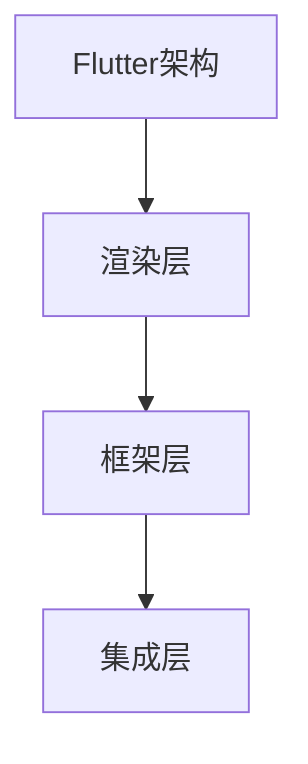

                 

关键词：Flutter、跨平台开发、一套代码、多端运行、技术博客、IT领域

摘要：本文将深入探讨Flutter框架在跨平台开发中的应用，通过讲解其核心概念、算法原理、数学模型以及项目实践，帮助读者全面了解Flutter的优势和操作方法，为未来跨平台开发提供新的思路和方向。

## 1. 背景介绍

随着移动互联网的快速发展，跨平台开发成为当前IT领域的一个重要趋势。开发者们希望能够在不同的操作系统上实现一套代码，从而节省开发时间和成本。Flutter作为一款优秀的跨平台UI框架，凭借其高性能、灵活性和丰富的组件库，在近年来受到了广泛关注。

Flutter是由Google推出的一款开源UI框架，旨在帮助开发者使用一套代码库来创建美观、高性能的应用程序，可以在Android、iOS和Web等多个平台上运行。Flutter使用Dart语言编写，具有高效率、低内存消耗和强大的社区支持等优点。

## 2. 核心概念与联系

### 2.1 Flutter架构

Flutter的架构可以分为以下三个层次：

1. **渲染层**：Flutter使用Skia图形库进行渲染，实现了一套完整的渲染引擎，使得应用程序在Android和iOS上具有相似的外观和性能。
2. **框架层**：Flutter提供了丰富的组件库，包括按钮、文本框、列表等，开发者可以通过组合这些组件来构建应用界面。
3. **集成层**：Flutter通过平台特定代码来集成原生功能，例如相机、定位和传感器等。

### 2.2 核心概念原理

1. **Dart语言**：Flutter使用Dart语言进行开发，Dart是一种现代化的编程语言，具有高效的性能和简洁的语法。
2. **Widget**：Flutter中的UI组件被称为Widget，每个Widget都代表了一个UI元素，可以通过组合不同的Widget来构建复杂的用户界面。
3. **Stateful和Stateless Widget**：Stateful Widget具有状态，可以响应用户操作；Stateless Widget没有状态，通常用于展示静态内容。

### 2.3 Mermaid流程图



## 3. 核心算法原理 & 具体操作步骤

### 3.1 算法原理概述

Flutter的核心算法原理主要包括以下几个方面：

1. **布局算法**：Flutter采用了一种基于框架层的布局算法，通过计算Widget的大小和位置来构建用户界面。
2. **绘制算法**：Flutter使用Skia图形库进行绘制，通过将UI元素拆分为基本的图形和文本，然后进行渲染。

### 3.2 算法步骤详解

1. **布局计算**：首先，Flutter会根据布局规则计算每个Widget的大小和位置。
2. **绘制顺序**：然后，Flutter按照绘制顺序，依次将每个Widget绘制到屏幕上。

### 3.3 算法优缺点

1. **优点**：
   - **高性能**：Flutter使用Skia图形库进行渲染，具有优异的性能表现。
   - **灵活性**：Flutter提供了丰富的组件和布局方式，开发者可以自由地构建用户界面。
2. **缺点**：
   - **学习曲线**：Flutter的布局和渲染机制与原生开发有所不同，初学者可能需要一定时间来适应。
   - **平台依赖**：虽然Flutter可以实现跨平台，但某些特定平台的功能可能需要编写平台特定代码。

### 3.4 算法应用领域

Flutter适用于多种应用场景，包括：

- **移动应用开发**：Flutter可以用于开发Android和iOS移动应用，实现一套代码覆盖多个平台。
- **Web应用开发**：Flutter支持Web平台，可以用于开发Web应用。
- **桌面应用开发**：Flutter正在扩展到桌面平台，可以用于开发Windows、macOS和Linux桌面应用。

## 4. 数学模型和公式 & 详细讲解 & 举例说明

### 4.1 数学模型构建

Flutter的布局算法涉及到多个数学模型，包括：

1. **矩阵变换**：用于计算Widget的位置和大小。
2. **贝塞尔曲线**：用于绘制曲线和动画。

### 4.2 公式推导过程

以矩阵变换为例，公式推导如下：

$$
\begin{align*}
\text{变换矩阵} &= \begin{bmatrix}
a & b \\
c & d
\end{bmatrix} \\
\text{点} &= \begin{bmatrix}
x \\
y
\end{bmatrix} \\
\text{变换后点} &= \begin{bmatrix}
x' \\
y'
\end{bmatrix}
\end{align*}
$$

通过矩阵乘法，可以得到变换后的点坐标：

$$
\begin{align*}
x' &= a \cdot x + b \cdot y + c \\
y' &= c \cdot x + d \cdot y + d
\end{align*}
$$

### 4.3 案例分析与讲解

假设有一个Widget，其位置为(2, 3)，大小为(4, 6)。我们需要计算该Widget的变换后位置和大小。

- **位置变换**：

$$
\begin{align*}
x' &= 2a + 3b + c \\
y' &= 2c + 3d + d
\end{align*}
$$

- **大小变换**：

$$
\begin{align*}
w' &= a \cdot w + b \cdot h + c \\
h' &= c \cdot w + d \cdot h + d
\end{align*}
$$

其中，\(w\)和\(h\)分别为原始大小，\(a\)、\(b\)、\(c\)、\(d\)为变换矩阵的元素。

## 5. 项目实践：代码实例和详细解释说明

### 5.1 开发环境搭建

搭建Flutter开发环境，首先需要安装以下软件：

1. **Dart SDK**：用于编写Flutter应用程序。
2. **Flutter SDK**：用于构建和运行Flutter应用程序。
3. **Android Studio**：用于开发Android应用程序。
4. **Xcode**：用于开发iOS应用程序。

安装完成后，可以通过以下命令检查环境是否配置成功：

```bash
flutter doctor
```

### 5.2 源代码详细实现

以下是一个简单的Flutter应用程序示例：

```dart
import 'package:flutter/material.dart';

void main() {
  runApp(MyApp());
}

class MyApp extends StatelessWidget {
  @override
  Widget build(BuildContext context) {
    return MaterialApp(
      title: 'Flutter Demo',
      theme: ThemeData(
        primarySwatch: Colors.blue,
      ),
      home: Scaffold(
        appBar: AppBar(
          title: Text('Flutter Demo'),
        ),
        body: Center(
          child: Text(
            'Hello, Flutter!',
            style: TextStyle(fontSize: 24),
          ),
        ),
      ),
    );
  }
}
```

### 5.3 代码解读与分析

- **main函数**：应用程序的入口点，使用`runApp`函数启动Flutter应用程序。
- **MyApp类**：定义了一个无状态的Widget，用于构建应用程序的根组件。
- **MaterialApp**：用于创建一个Material风格的UI应用程序，包括主题、导航栏等。
- **Scaffold**：用于创建应用程序的骨架，包括标题、菜单栏、底部导航栏等。
- **Center**：用于使文本在屏幕中心对齐。

### 5.4 运行结果展示

运行应用程序后，将显示一个包含标题和文本的界面。

## 6. 实际应用场景

Flutter在多个领域有着广泛的应用：

1. **移动应用开发**：Flutter可以用于开发Android和iOS移动应用，实现一套代码覆盖多个平台。
2. **Web应用开发**：Flutter支持Web平台，可以用于开发Web应用。
3. **桌面应用开发**：Flutter正在扩展到桌面平台，可以用于开发Windows、macOS和Linux桌面应用。
4. **游戏开发**：Flutter可以用于开发游戏应用，利用其高性能渲染能力。

## 7. 工具和资源推荐

### 7.1 学习资源推荐

- **官方文档**：[Flutter 官方文档](https://flutter.cn/docs)
- **入门教程**：[Flutter 入门教程](https://flutter.cn/docs/get-started/install)
- **实战项目**：[Flutter 实战项目](https://github.com/flutter-samples/flutter_samples)

### 7.2 开发工具推荐

- **Android Studio**：用于开发Android应用程序。
- **Xcode**：用于开发iOS应用程序。
- **Visual Studio Code**：适用于Dart和Flutter开发的轻量级代码编辑器。

### 7.3 相关论文推荐

- **Flutter: Building Native Apps with Less Code**：介绍Flutter框架的论文。
- **Dart Programming Language**：介绍Dart语言的论文。

## 8. 总结：未来发展趋势与挑战

### 8.1 研究成果总结

Flutter作为一款跨平台开发框架，已经在移动应用、Web应用和桌面应用等多个领域取得了显著的成果。其高性能、灵活性和丰富的组件库使得开发者能够快速构建高质量的应用程序。

### 8.2 未来发展趋势

1. **更多平台支持**：Flutter将继续扩展到更多平台，如物联网、虚拟现实等。
2. **性能优化**：Flutter将在性能方面进行持续优化，提高跨平台应用的整体性能。
3. **社区发展**：Flutter社区将持续壮大，为开发者提供更多资源和支持。

### 8.3 面临的挑战

1. **平台兼容性**：随着不同平台的发展，Flutter需要不断适应新的技术和标准。
2. **性能瓶颈**：在高性能要求的应用场景下，Flutter可能面临性能瓶颈。
3. **开发者技能**：Flutter的学习曲线相对较高，需要开发者具备一定的技能和经验。

### 8.4 研究展望

Flutter在未来跨平台开发中将发挥越来越重要的作用。通过不断优化性能、扩展平台支持和加强社区建设，Flutter有望成为开发者首选的跨平台开发框架。

## 9. 附录：常见问题与解答

### 9.1 如何解决Flutter应用性能问题？

- **优化渲染流程**：减少不必要的绘制操作，提高渲染效率。
- **使用优化库**：如Flutter的`flutter性能优化工具包`等。
- **合理使用线程**：避免在主线程进行复杂的计算和IO操作。

### 9.2 如何在Flutter中实现原生功能？

- **平台特定代码**：使用Flutter的`Platform`类来判断当前运行的平台，然后编写相应的平台特定代码。
- **使用插件**：Flutter社区提供了丰富的插件，可以实现许多原生功能。

### 9.3 如何解决Flutter应用打包问题？

- **使用Flutter打包工具**：如`flutter build`命令，可以生成不同平台的打包文件。
- **调整配置文件**：在`android/app/build.gradle`和`ios/Flutter/App.swift`中调整配置。

---

作者：禅与计算机程序设计艺术 / Zen and the Art of Computer Programming
------------------------------------------------------------------
### 结束
<|im_back|>

