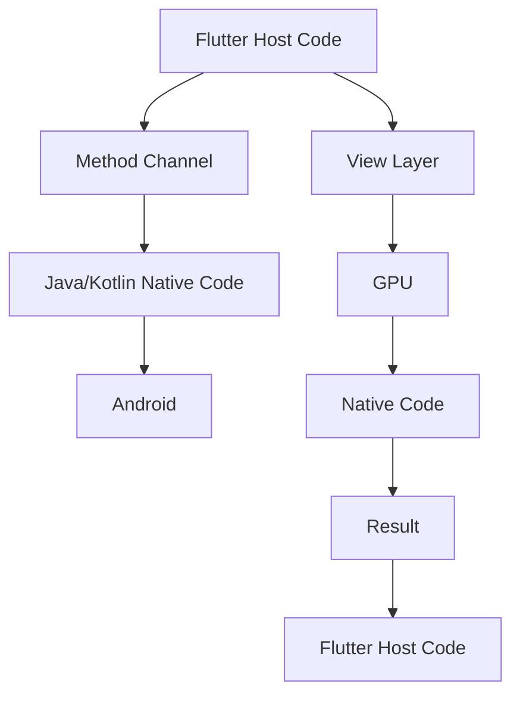

                 

关键词：Flutter、跨平台、插件开发、Dart语言、原生集成、性能优化、组件化设计、技术栈

## 摘要

本文将深入探讨Flutter跨平台插件开发的方方面面。作为一款流行的UI框架，Flutter凭借其高性能和丰富的特性，在移动开发领域得到了广泛应用。然而，在实际开发过程中，我们不可避免地需要与原生平台进行交互，这就需要通过插件来桥接Flutter与原生代码。本文将详细介绍Flutter插件开发的核心概念、技术原理、开发步骤以及性能优化策略，帮助开发者更好地理解和掌握Flutter插件开发的技巧。

## 1. 背景介绍

### Flutter的崛起

Flutter是谷歌推出的一款用于构建跨平台移动应用的开源UI框架。自2018年发布以来，Flutter以其高性能、丰富的组件库和出色的UI渲染能力，迅速获得了开发者的青睐。Flutter应用可以同时运行在Android和iOS平台上，大大提高了开发效率和代码复用率。

### 跨平台开发的必要性

跨平台开发已经成为现代移动应用开发的趋势。随着移动设备的多样化，开发单一平台的应用已无法满足市场需求。跨平台开发不仅可以降低开发和维护成本，还能更快速地将产品推向市场，抢占先机。

### 插件在Flutter中的应用

Flutter插件是用于扩展Flutter功能的重要工具。通过插件，开发者可以调用原生API、访问设备硬件资源，或者集成第三方库和框架。Flutter官方提供了一系列常用的插件，但实际项目中往往需要定制化开发，以满足特定的业务需求。

## 2. 核心概念与联系

### 插件开发的基本概念

- **Host Platform（宿主平台）**：指Flutter应用运行的平台，可以是Android或iOS。
- **Target Platform（目标平台）**：指插件要集成的原生平台，通常也是Android或iOS。
- **Plugin Package**：插件的整体封装，包括宿主平台的代码和目标平台的代码。

### 插件架构


- **Dart Host Code**：Flutter应用侧的代码，通过`dart:ui`接口与原生平台进行通信。
- **Java/Kotlin Native Code**：Android平台的原生代码，通常使用Java或Kotlin编写。
- **Objective-C/Swift Native Code**：iOS平台的原生代码，通常使用Objective-C或Swift编写。

### Mermaid流程图



## 3. 核心算法原理 & 具体操作步骤

### 3.1 算法原理概述

Flutter插件开发的核心在于方法通道（Method Channel）和事件通道（Event Channel）。方法通道用于Flutter应用和原生代码之间的双向通信，而事件通道则用于单向通信，通常用于原生代码向Flutter应用发送通知。

### 3.2 算法步骤详解

#### （1）创建Method Channel

1. 在Flutter应用侧，使用`MethodChannel`创建方法通道。
2. 在原生代码侧，创建对应的原生方法通道。

#### （2）通信过程

1. Flutter应用侧调用方法通道，发送请求。
2. 原生代码侧接收请求，执行相应操作。
3. 原生代码侧将结果返回给Flutter应用。

### 3.3 算法优缺点

- **优点**：
  - 高效的双向通信机制。
  - 支持多平台，易于集成和维护。
  - 提供了丰富的通信选项，如`BasicMessageChannel`和`EventChannel`。

- **缺点**：
  - 需要编写额外的原生代码。
  - 通信过程中可能会有性能开销。

### 3.4 算法应用领域

Flutter插件开发广泛应用于以下领域：

- 设备硬件访问：如摄像头、麦克风、传感器等。
- 第三方库集成：如支付、地图、推送等。
- 原生组件扩展：如自定义View、按钮等。

## 4. 数学模型和公式 & 详细讲解 & 举例说明

### 4.1 数学模型构建

Flutter插件通信的数学模型可以看作是一个状态机，其中状态包括：

- **空闲状态**：等待接收请求。
- **发送请求状态**：正在发送请求。
- **接收响应状态**：正在接收原生代码的响应。

### 4.2 公式推导过程

假设通信过程中的响应时间为$t$，根据响应时间和通信频率，可以计算出插件通信的吞吐量$Q$：

$$
Q = \frac{1}{t \times f}
$$

其中，$f$为通信频率。

### 4.3 案例分析与讲解

#### 案例背景

某款Flutter应用需要集成第三方支付库，实现支付功能。支付库仅支持原生集成，无法直接在Flutter中使用。

#### 解决方案

1. 在Flutter应用侧，创建一个支付插件。
2. 在原生代码侧，集成第三方支付库。
3. 通过方法通道实现Flutter与原生代码的通信。

#### 实现步骤

1. Flutter应用侧：

```dart
import 'package:flutter/services.dart';

final paymentChannel = MethodChannel('com.example.payment');
```

2. 原生代码侧（Android）：

```java
public class PaymentPlugin {
    public static void pay(Context context, String amount) {
        // 调用第三方支付库
    }
}
```

3. 原生代码侧（iOS）：

```swift
import "Foundation.h"
@objc class PaymentPlugin: NSObject {
    @objc func pay(_ amount: String) {
        // 调用第三方支付库
    }
}
```

4. Flutter应用侧，调用支付方法：

```dart
await paymentChannel.invokeMethod('pay', amount: '10.00');
```

## 5. 项目实践：代码实例和详细解释说明

### 5.1 开发环境搭建

1. 安装Flutter SDK。
2. 创建Flutter应用。

### 5.2 源代码详细实现

#### Flutter应用侧

1. 创建MethodChannel。

```dart
final paymentChannel = MethodChannel('com.example.payment');
```

2. 调用支付方法。

```dart
Future<void> pay(String amount) async {
    await paymentChannel.invokeMethod('pay', amount: amount);
}
```

#### 原生代码侧（Android）

1. 创建PaymentPlugin类。

```java
public class PaymentPlugin {
    public static void pay(Context context, String amount) {
        // 调用第三方支付库
    }
}
```

2. 注册插件。

```java
public class Application extends FlutterApplication {
    @Override
    public void onCreate() {
        super.onCreate();
       注册Plugin注册器.registerWith(new PluginRegistry.RegistrarHandler() {
            @Override
            public Plugin registerWith(PluginRegistry.Registrar registrar) {
                return new PaymentPlugin();
            }
        });
    }
}
```

#### 原生代码侧（iOS）

1. 创建PaymentPlugin类。

```swift
@objc class PaymentPlugin: NSObject {
    @objc func pay(_ amount: String) {
        // 调用第三方支付库
    }
}
```

2. 注册插件。

```swift
public class Application: FlutterApplication {
    public override func applicationDidFinishLaunchingWithOptions(options: [NSObject : AnyObject]?) -> Bool {
        GeneratedPluginRegistrant.register(with: self)
        return super.applicationDidFinishLaunchingWithOptions(options)
    }
}
```

### 5.3 代码解读与分析

- Flutter应用侧通过MethodChannel与原生代码通信，调用支付方法。
- 原生代码侧实现支付功能，调用第三方支付库。

### 5.4 运行结果展示

- Flutter应用侧成功调用支付方法。
- 原生代码侧成功调用第三方支付库，完成支付过程。

## 6. 实际应用场景

### 6.1 设备硬件访问

- 摄像头：通过`camera`插件访问摄像头功能。
- 麦克风：通过`audioRecorder`插件录制音频。
- 传感器：通过`motion_sensors`插件获取设备加速度、陀螺仪等数据。

### 6.2 第三方库集成

- 支付：集成支付宝、微信支付等第三方支付库。
- 地图：集成高德地图、百度地图等第三方地图库。
- 推送：集成个推、极光推送等第三方推送库。

### 6.3 原生组件扩展

- 自定义View：实现自定义的UI组件，如进度条、日历等。
- 自定义按钮：实现带动画效果的自定义按钮。

## 7. 未来应用展望

### 7.1 Flutter生态的持续发展

随着Flutter生态的不断发展，插件开发将成为Flutter应用开发的重要一环。未来将会有更多的第三方库和插件涌现，进一步丰富Flutter的功能。

### 7.2 插件开发的性能优化

随着Flutter应用复杂度的提高，插件开发的性能优化将成为一个重要课题。开发者需要关注通信效率、资源占用和响应速度等方面，以确保插件的高性能。

### 7.3 插件开发的智能化

未来，插件开发可能会引入更多的自动化工具和智能算法，如代码生成、错误检测和性能分析等，以提高开发效率和代码质量。

## 8. 总结：未来发展趋势与挑战

### 8.1 研究成果总结

本文介绍了Flutter跨平台插件开发的核心概念、技术原理、开发步骤以及性能优化策略。通过案例分析和实践，展示了Flutter插件开发的实际应用场景。

### 8.2 未来发展趋势

未来，Flutter插件开发将在Flutter生态的持续发展和智能化方向上不断进步，为开发者带来更多的便利和高效。

### 8.3 面临的挑战

随着Flutter应用复杂度的提高，插件开发将面临性能优化和智能化等方面的挑战。开发者需要不断学习和探索，以应对这些挑战。

### 8.4 研究展望

在未来，Flutter插件开发有望在以下几个方面取得突破：

- 提高通信效率，降低性能开销。
- 引入更多自动化工具，提高开发效率。
- 探索智能化的插件开发模式，如代码生成和错误检测等。

## 9. 附录：常见问题与解答

### Q：如何确保Flutter插件的安全性？

A：确保Flutter插件的安全性可以从以下几个方面入手：

- 对输入参数进行严格校验，防止恶意输入。
- 使用HTTPS协议进行网络通信，确保数据传输的安全性。
- 对插件进行代码审计，发现并修复潜在的安全漏洞。

### Q：Flutter插件开发的最佳实践是什么？

A：Flutter插件开发的最佳实践包括：

- 模块化设计，将插件划分为独立的模块，提高可维护性。
- 使用官方推荐的插件，如`flutter\_sqlite`、`flutter\_webview`等。
- 优化通信效率，减少不必要的通信开销。
- 对插件进行单元测试和集成测试，确保插件的质量。

### Q：如何解决Flutter插件与原生平台的兼容性问题？

A：解决Flutter插件与原生平台的兼容性问题可以从以下几个方面入手：

- 使用官方推荐的插件，这些插件已经经过了兼容性测试。
- 在插件开发过程中，关注原生平台的差异，并进行针对性调整。
- 保持Flutter和原生平台的版本一致性，避免因为版本差异导致的兼容性问题。

## 作者署名

作者：禅与计算机程序设计艺术 / Zen and the Art of Computer Programming
------------------------------------------------------------------------

