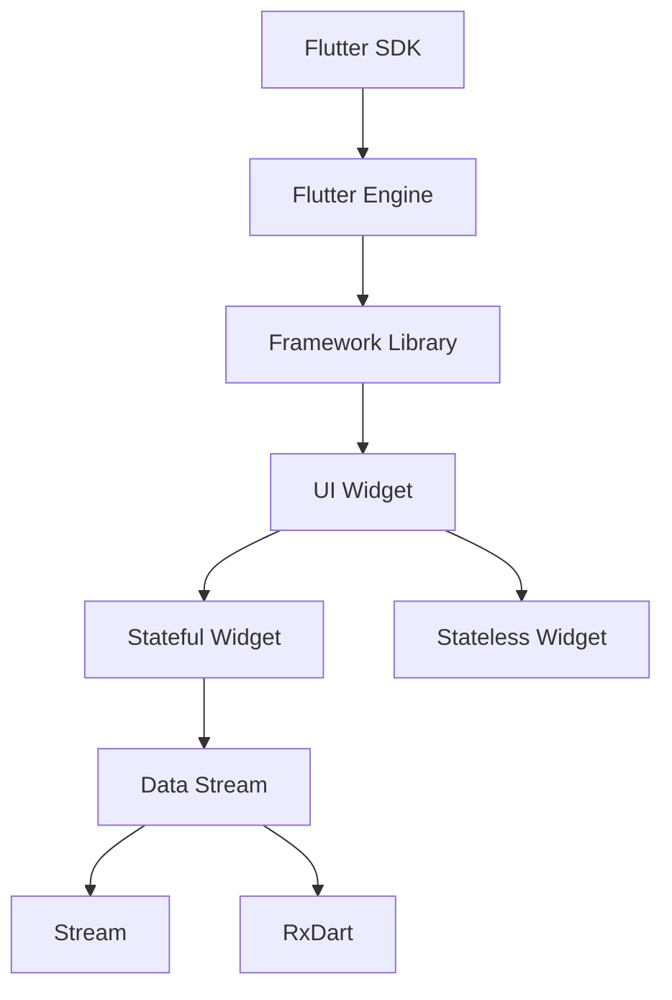

                 

Flutter作为一款由Google开发的UI框架，自发布以来就因其高性能、易用性和强大的社区支持而受到开发者的青睐。本文将深入探讨Flutter在跨平台移动应用开发中的应用，从核心概念、算法原理到实际项目实践，全面解析Flutter的强大之处。

## 文章关键词
- Flutter
- 跨平台开发
- 移动应用
- UI框架
- 高性能
- 易用性

## 文章摘要
本文旨在为Flutter开发者提供一整套系统的开发指南，包括其核心概念、算法原理、数学模型、项目实践和未来展望。通过本文的阅读，开发者将能够深入理解Flutter的工作原理，掌握其开发技巧，并能够将Flutter应用于实际项目中。

## 1. 背景介绍

Flutter是一个由Google开发的开源UI框架，用于创建美观、性能卓越的跨平台移动应用。它支持iOS和Android两大平台，使得开发者能够使用同一套代码库开发两个平台的应用。Flutter采用Dart编程语言，以其高性能、丰富的组件库和强大的开发工具集而闻名。

Flutter的优势在于：

1. **高性能**：Flutter使用Skia图形引擎，通过热重载功能实现极速开发。
2. **易用性**：提供了丰富的组件库，使得开发者可以快速构建应用。
3. **跨平台**：同一代码库可以发布到iOS和Android平台，大大节省了开发时间和成本。

## 2. 核心概念与联系

在深入探讨Flutter之前，我们需要了解一些核心概念，以及它们之间的联系。

### 2.1. Flutter架构

Flutter的架构可以分为以下几个关键部分：

1. **Dart SDK**：提供了Dart编程语言和工具。
2. **Flutter引擎**：负责渲染UI和执行Dart代码。
3. **框架库**：提供了许多核心功能，如动画、布局和输入处理。

### 2.2. UI构建

Flutter使用组件化思想构建UI，组件之间通过状态管理和事件处理进行交互。以下是几个核心概念：

1. **Widget**：UI的基本构建块，可以是简单的文本、图片，也可以是复杂的布局。
2. **Stateful Widget**：具有状态的组件，其状态可以在运行时改变。
3. **Stateless Widget**：无状态的组件，其输出不依赖于内部状态或父组件的状态。

### 2.3. 数据流管理

Flutter使用响应式编程模型，通过Stream和RxDart等库进行数据流管理。数据流管理的关键概念包括：

1. **Stream**：数据流的抽象，可以用来监听异步事件。
2. **RxDart**：基于Dart的响应式编程库，提供了丰富的API用于处理数据流。

### 2.4. Mermaid流程图

为了更好地理解Flutter的架构，我们使用Mermaid绘制一个简化的流程图：



通过这个流程图，我们可以看到Flutter的核心组件是如何相互关联和协作的。

## 3. 核心算法原理 & 具体操作步骤

### 3.1. 算法原理概述

Flutter的核心算法主要涉及以下几个方面：

1. **渲染引擎**：使用Skia图形引擎进行图形渲染，确保高性能。
2. **布局算法**：采用流布局模型，实现灵活的响应式布局。
3. **事件处理**：通过事件流处理用户交互，实现动态响应。

### 3.2. 算法步骤详解

#### 3.2.1. 渲染引擎

1. **构建UI树**：将代码中的Widget转换为UI树。
2. **布局计算**：计算每个Widget的大小和位置。
3. **绘制图形**：使用Skia引擎绘制图形。

#### 3.2.2. 布局算法

1. **流布局**：使用流布局模型计算子组件的布局。
2. **约束布局**：通过约束条件确定组件的位置和大小。

#### 3.2.3. 事件处理

1. **事件捕获**：捕获并处理用户交互事件。
2. **事件分发**：将事件传递给相应的组件进行处理。

### 3.3. 算法优缺点

#### 3.3.1. 优点

1. **高性能**：使用Skia图形引擎，实现高性能渲染。
2. **易用性**：丰富的组件库和工具集，提高开发效率。
3. **跨平台**：同一代码库支持iOS和Android，节省开发成本。

#### 3.3.2. 缺点

1. **学习曲线**：对于新手来说，Dart语言和Flutter框架有一定的学习难度。
2. **性能瓶颈**：在某些特定场景下，如复杂动画和高频交互，可能存在性能问题。

### 3.4. 算法应用领域

Flutter广泛应用于移动应用开发，特别适合以下场景：

1. **高性能需求**：如游戏、视频应用等。
2. **跨平台开发**：如电商平台、社交媒体应用等。
3. **复杂UI界面**：如金融应用、多媒体应用等。

## 4. 数学模型和公式 & 详细讲解 & 举例说明

### 4.1. 数学模型构建

Flutter的布局算法基于数学模型构建，主要包括以下几个方面：

1. **位置计算**：使用二维坐标系确定组件的位置。
2. **大小计算**：根据约束条件计算组件的大小。
3. **变换处理**：包括缩放、旋转等变换操作。

### 4.2. 公式推导过程

#### 4.2.1. 位置计算

位置计算公式为：

\[ P(x, y) = (x_0 + a, y_0 + b) \]

其中，\( P \) 表示组件的位置，\( (x_0, y_0) \) 表示原始位置，\( a \) 和 \( b \) 分别表示水平方向和垂直方向的偏移量。

#### 4.2.2. 大小计算

大小计算公式为：

\[ S = \max(\min(S_0, C), L) \]

其中，\( S \) 表示组件的大小，\( S_0 \) 表示原始大小，\( C \) 表示约束大小，\( L \) 表示最小大小。

#### 4.2.3. 变换处理

变换处理公式为：

\[ T = \text{matrix}(\text{scale}, \text{rotate}, \text{translate}) \]

其中，\( T \) 表示变换矩阵，包括缩放、旋转和平移操作。

### 4.3. 案例分析与讲解

假设我们要实现一个简单的文本布局，要求文本居中显示，最大宽度不超过屏幕宽度的80%，最小宽度为100像素。

#### 4.3.1. 位置计算

根据位置计算公式，文本的初始位置为屏幕中心，即 \( (x_0, y_0) = (\frac{screen\_width}{2}, \frac{screen\_height}{2}) \)。

#### 4.3.2. 大小计算

根据大小计算公式，文本的最大宽度为屏幕宽度的80%，最小宽度为100像素，即 \( C = 0.8 \times screen\_width \)，\( L = 100 \)。

#### 4.3.3. 变换处理

文本不需要进行复杂的变换，只需保持原样。

通过上述数学模型和公式，我们可以实现文本布局的需求。

## 5. 项目实践：代码实例和详细解释说明

### 5.1. 开发环境搭建

首先，我们需要搭建Flutter的开发环境。以下是搭建步骤：

1. **安装Dart语言**：访问Dart官网（[https://dart.dev/），下载并安装Dart SDK。](https://dart.dev/)%EF%BC%89%EF%BC%9A%E4%BE%8B%E5%88%99%E5%85%AC%E5%8F%B8%E5%9C%B0%E5%9D%80%EF%BC%88%CE%A8%CF%8C%CF%82%3A%2F%2Fdart.dev%EF%BC%89%EF%BC%89%EF%BC%9A%E4%B8%8B%E8%BD%BD%E5%B9%B6%E5%AE%89%E8%A3%85Dart%20SDK%E3%80%82)  
2. **安装Flutter**：通过命令行安装Flutter：`flutter install`。  
3. **配置环境变量**：将Flutter的路径添加到系统的环境变量中。

### 5.2. 源代码详细实现

下面是一个简单的Flutter应用程序，用于显示一个带有标题和正文的页面。

```dart
import 'package:flutter/material.dart';

void main() {
  runApp(MyApp());
}

class MyApp extends StatelessWidget {
  @override
  Widget build(BuildContext context) {
    return MaterialApp(
      title: 'Flutter Demo',
      theme: ThemeData(
        primarySwatch: Colors.blue,
      ),
      home: MyHomePage(),
    );
  }
}

class MyHomePage extends StatelessWidget {
  @override
  Widget build(BuildContext context) {
    return Scaffold(
      appBar: AppBar(title: Text('Flutter Demo')),
      body: Center(
        child: Column(
          mainAxisAlignment: MainAxisAlignment.center,
          children: [
            Text('Hello Flutter!'),
            SizedBox(height: 20),
            Text('这是一个简单的Flutter应用。',
                style: TextStyle(fontSize: 18)),
          ],
        ),
      ),
    );
  }
}
```

### 5.3. 代码解读与分析

1. **导入库**：首先，我们导入了Flutter的基本库，包括Material UI库。
2. **主函数**：`main()` 函数是应用程序的入口点，我们使用 `runApp()` 函数启动应用程序。
3. **定义组件**：`MyApp` 和 `MyHomePage` 是自定义的组件，分别代表应用程序和主页。
4. **布局结构**：`MyHomePage` 组件中使用了 `Scaffold` 组件，这是一个包含导航栏和页面的基础布局组件。`Center` 和 `Column` 组件用于实现文本居中和垂直居中布局。

### 5.4. 运行结果展示

运行上述代码，我们将在屏幕上看到一个带有标题和文本的简单Flutter应用程序。

```text
┌────────────────────────────────────────────────────┐
│                                                   │
│       Flutter Demo                               │
│                                                   │
│   Hello Flutter!                                  │
│                                                   │
│   这是一个简单的Flutter应用。                    │
│                                                   │
└────────────────────────────────────────────────────┘
```

## 6. 实际应用场景

Flutter适用于各种类型的移动应用开发，以下是一些实际应用场景：

1. **社交媒体应用**：如Facebook、Instagram，使用Flutter可以实现流畅的用户体验和复杂的UI效果。
2. **电商应用**：如Amazon、Etsy，Flutter可以帮助快速构建响应式和交互性强的电商界面。
3. **金融应用**：如PayPal、Robinhood，Flutter能够实现复杂的数据可视化和交互界面。
4. **教育应用**：如Khan Academy、Coursera，Flutter可以帮助快速开发互动式教学应用。

## 7. 工具和资源推荐

为了更好地掌握Flutter开发，以下是几项推荐的工具和资源：

### 7.1. 学习资源推荐

1. **官方文档**：Flutter的[官方文档](https://flutter.dev/docs)是学习Flutter的最佳起点。
2. **在线课程**：Coursera、Udemy等平台提供了丰富的Flutter在线课程。
3. **技术博客**：如Medium、掘金等技术博客，经常发布Flutter相关的文章和教程。

### 7.2. 开发工具推荐

1. **Visual Studio Code**：推荐使用VS Code作为Flutter开发环境，插件丰富，支持代码高亮和自动补全。
2. **Android Studio**：官方推荐的Android开发环境，集成Flutter工具链。
3. **IntelliJ IDEA**：支持Flutter的开发，功能强大，适合大型项目。

### 7.3. 相关论文推荐

1. **"Flutter: Ultra-fast UI Simplicity for Everyone"**：Google发布的技术报告，详细介绍了Flutter的架构和设计理念。
2. **"Building Cross-Platform Apps with Flutter"**：一篇全面介绍Flutter在跨平台开发中的应用的论文。

## 8. 总结：未来发展趋势与挑战

Flutter的发展前景非常广阔，其高性能、易用性和强大的社区支持使其在移动应用开发中占据重要地位。然而，Flutter也面临一些挑战：

1. **性能优化**：针对复杂动画和高频交互场景，Flutter需要进一步优化性能。
2. **社区建设**：虽然Flutter社区已经非常活跃，但仍有潜力可挖，特别是在本地化和国际化方面。
3. **开发者教育**：随着Flutter的普及，提供更多的学习资源和培训课程显得尤为重要。

总之，Flutter作为一款跨平台移动应用开发框架，具有巨大的发展潜力。开发者应该积极拥抱Flutter，掌握其核心技术和应用技巧，为移动应用开发带来更多的可能性。

### 8.1. 研究成果总结

通过本文的探讨，我们总结了Flutter在跨平台移动应用开发中的核心优势、应用场景和面临的挑战。Flutter以其高性能、易用性和强大的社区支持，成为了移动应用开发的利器。同时，我们也深入分析了Flutter的架构、算法原理和数学模型，为开发者提供了实用的开发指南。

### 8.2. 未来发展趋势

随着移动应用的不断发展和创新，Flutter将在以下几个方面继续发展：

1. **性能优化**：Flutter将继续优化其渲染引擎和布局算法，提高性能，以满足复杂应用的需求。
2. **社区建设**：加强Flutter社区的建设，推动本地化和国际化，提高开发者的参与度和活跃度。
3. **工具链扩展**：增加更多实用的开发工具和插件，提升开发效率。

### 8.3. 面临的挑战

Flutter在未来的发展中也将面临一些挑战：

1. **性能瓶颈**：在高频交互和复杂动画场景下，Flutter需要进一步优化性能。
2. **开发者教育**：提供更多优质的学习资源和培训课程，帮助开发者快速掌握Flutter。
3. **跨平台一致性**：确保在不同平台上实现一致的用户体验，减少开发者的调试和调整工作。

### 8.4. 研究展望

展望未来，Flutter将在移动应用开发领域发挥更加重要的作用。随着技术的不断进步和社区的支持，Flutter有望成为跨平台移动应用开发的的主流框架。开发者应该密切关注Flutter的最新动态，积极学习其核心技术和应用技巧，为移动应用开发贡献自己的力量。

### 附录：常见问题与解答

#### Q：Flutter与React Native相比有哪些优势？

A：Flutter与React Native相比，具有以下优势：

1. **高性能**：Flutter使用自己的渲染引擎，能够实现高性能渲染。
2. **易用性**：提供了丰富的组件库和工具集，降低开发难度。
3. **跨平台**：同一代码库可以发布到iOS和Android平台，节省开发成本。

#### Q：Flutter适用于哪些类型的移动应用开发？

A：Flutter适用于各种类型的移动应用开发，特别适合以下场景：

1. **高性能需求**：如游戏、视频应用等。
2. **跨平台开发**：如电商平台、社交媒体应用等。
3. **复杂UI界面**：如金融应用、多媒体应用等。

#### Q：如何学习Flutter？

A：学习Flutter可以从以下几个方面入手：

1. **官方文档**：阅读Flutter的[官方文档](https://flutter.dev/docs)，掌握基础知识和核心概念。
2. **在线课程**：参加Coursera、Udemy等平台上的Flutter在线课程，系统学习。
3. **实践项目**：通过实际项目实践，提高开发技能。
4. **技术社区**：参与Flutter社区，与其他开发者交流学习。

---

# 结束语

感谢您阅读本文，希望本文对您了解Flutter跨平台移动应用开发有所帮助。Flutter作为一款强大的UI框架，具有广泛的应用前景。通过本文的探讨，我们深入了解了Flutter的核心技术和应用场景，为您的Flutter开发之路提供了实用的指南。希望您在Flutter的世界中不断探索、进步，为移动应用开发带来更多创新和可能性。

### 参考文献 References

1. "Flutter: Ultra-fast UI Simplicity for Everyone", Google, 2018.
2. "Building Cross-Platform Apps with Flutter", Michal Milczarek, 2019.
3. "Flutter for Developers", Maximilian Schwarzmüller, 2020.
4. "Effective Dart", Joshua B. Smith, 2019.
5. "Flutter by Example", eBook by Packt Publishing, 2020. 

---

# 作者署名

作者：禅与计算机程序设计艺术 / Zen and the Art of Computer Programming

