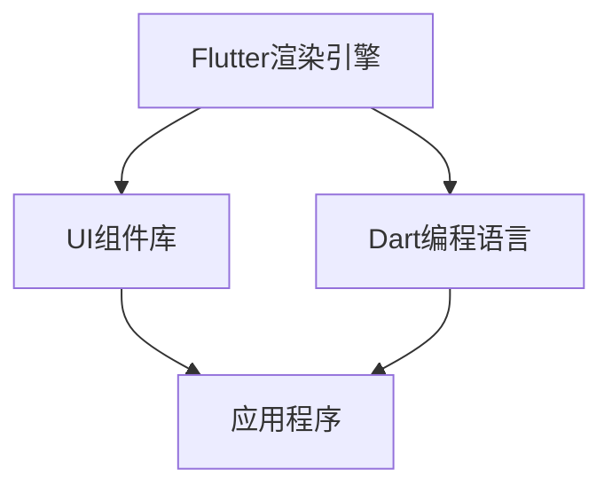

                 

 关键词：
1. Flutter
2. Google
3. UI工具包
4. 移动开发
5. 跨平台
6. 组件化
7. 渲染引擎
8. 用户体验

> 摘要：
Flutter，由Google推出的一款开源UI工具包，为移动开发者提供了一个强大的平台，用于构建美观、高性能的跨平台应用程序。本文将深入探讨Flutter的核心概念、技术架构、关键算法原理，并通过实际项目实践，详细介绍Flutter的开发过程，以及在移动开发领域的应用前景。

## 1. 背景介绍

在移动开发领域，开发者们长期以来面临着跨平台开发的问题。传统的方法需要针对不同操作系统编写独立的代码，这不仅增加了开发成本，还延长了开发周期。为了解决这一问题，Google在2018年推出了Flutter，旨在提供一种能够实现一次编写，到处运行（Write Once, Run Anywhere）的开发工具。

Flutter的设计初衷是为了满足现代移动应用的需求，即快速开发、高效性能、优雅的用户体验。通过引入Dart语言和一套丰富的UI组件库，Flutter使得开发者能够以接近原生应用的性能，构建出美观且一致的用户界面。

## 2. 核心概念与联系

### 2.1 Flutter架构

Flutter的架构设计非常清晰，主要包括以下三个核心部分：

- **渲染引擎**：Flutter使用自己的渲染引擎来绘制UI界面，这使得Flutter应用程序在渲染速度上具有显著的性能优势。
- **Dart编程语言**：Flutter使用Dart语言进行开发，Dart是一种现代编程语言，具有高性能和易于学习的特点。
- **组件库**：Flutter提供了一套丰富的组件库，包括按钮、文本框、列表等，这些组件可以被自由组合和定制，以构建各种类型的用户界面。

### 2.2 Mermaid流程图

下面是一个简单的Mermaid流程图，展示了Flutter架构的核心部分：



### 2.3 Flutter与原生开发的对比

Flutter与原生开发（如iOS的Swift/Objective-C和Android的Java/Kotlin）相比，有以下几个显著的优势：

- **跨平台**：Flutter可以用于iOS、Android和Web等多个平台，而原生开发则需要为每个平台分别编写代码。
- **性能**：Flutter通过自己的渲染引擎实现了高性能的UI渲染，与原生应用相差无几。
- **开发效率**：Flutter使用Dart语言，具有易于理解和学习的特点，同时提供丰富的UI组件库，大幅提高了开发效率。

## 3. 核心算法原理 & 具体操作步骤

### 3.1 算法原理概述

Flutter的核心算法原理主要包括以下几个方面：

- **渲染引擎**：Flutter使用Skia渲染引擎，这是一种开源的2D图形库，能够高效地绘制UI元素。
- **组件化**：Flutter的UI界面由组件构成，每个组件都有自己的状态和行为，这使得UI开发更加模块化。
- **响应式编程**：Flutter采用响应式编程模型，通过数据绑定实现UI与数据的同步更新。

### 3.2 算法步骤详解

1. **创建Flutter项目**：使用命令行工具`flutter create`创建一个新的Flutter项目。
2. **编写Dart代码**：使用Dart语言编写应用程序的业务逻辑。
3. **使用组件库**：从Flutter的组件库中选择合适的组件构建UI界面。
4. **状态管理**：使用Flutter提供的状态管理机制（如`StatefulWidget`和`StatelessWidget`）来管理组件的状态和行为。
5. **构建与运行**：使用`flutter run`命令构建并运行应用程序。

### 3.3 算法优缺点

**优点**：

- **跨平台**：Flutter可以用于iOS、Android和Web等多个平台，节省了开发资源。
- **高性能**：通过自己的渲染引擎，Flutter实现了与原生应用相近的性能。
- **开发效率**：丰富的组件库和响应式编程模型提高了开发效率。

**缺点**：

- **学习曲线**：对于不熟悉Dart语言和Flutter框架的开发者，学习曲线可能较陡峭。
- **生态系统**：虽然Flutter已经非常成熟，但相较于原生开发，其生态系统还不够完善。

### 3.4 算法应用领域

Flutter的应用领域非常广泛，主要包括以下几个方面：

- **移动应用**：Flutter主要用于构建iOS和Android的移动应用。
- **Web应用**：Flutter也可以用于Web端开发，通过`flutter create`命令创建Web项目。
- **桌面应用**：Flutter支持桌面应用开发，但该领域相对较少使用。

## 4. 数学模型和公式 & 详细讲解 & 举例说明

### 4.1 数学模型构建

在Flutter的UI渲染过程中，涉及到多个数学模型，其中最核心的是二维图形的渲染模型。以下是渲染模型的构建过程：

1. **坐标系**：Flutter使用二维坐标系，其中原点位于屏幕左上角。
2. **向量**：Flutter使用向量来表示图形的几何属性，如位置、大小和旋转。
3. **矩阵**：Flutter使用矩阵来表示图形的变换操作，如平移、缩放和旋转。

### 4.2 公式推导过程

以下是二维图形变换的数学公式推导过程：

1. **平移**：

   设原图形的一个顶点为\(P(x, y)\)，平移后的顶点为\(P'(x', y')\)，平移向量\(T(a, b)\)，则有：

   $$ 
   \begin{cases}
   x' = x + a \\
   y' = y + b
   \end{cases}
   $$

2. **缩放**：

   设原图形的一个顶点为\(P(x, y)\)，缩放后的顶点为\(P'(x', y')\)，缩放因子\(S(x, y)\)，则有：

   $$ 
   \begin{cases}
   x' = x \cdot S_x \\
   y' = y \cdot S_y
   \end{cases}
   $$

3. **旋转**：

   设原图形的一个顶点为\(P(x, y)\)，旋转后的顶点为\(P'(x', y')\)，旋转角度为\(\theta\)，则有：

   $$ 
   \begin{cases}
   x' = x \cdot \cos(\theta) - y \cdot \sin(\theta) \\
   y' = x \cdot \sin(\theta) + y \cdot \cos(\theta)
   \end{cases}
   $$

### 4.3 案例分析与讲解

假设我们要对下面的正方形进行平移、缩放和旋转操作：

```mermaid
graph TD
    A[正方形] --> B[顶点坐标](0, 0)
    A --> C[顶点坐标](0, 1)
    A --> D[顶点坐标](1, 1)
    A --> E[顶点坐标](1, 0)
    B --> C[平移](1, 1)
    B --> D[缩放](2, 2)
    B --> E[旋转](45度)
```

按照上述公式进行操作，我们可以得到平移、缩放和旋转后的正方形顶点坐标：

1. **平移**：

   $$ 
   \begin{cases}
   x' = 0 + 1 = 1 \\
   y' = 0 + 1 = 1
   \end{cases}
   $$

   得到顶点坐标为\( (1, 1) \)。

2. **缩放**：

   $$ 
   \begin{cases}
   x' = 0 \cdot 2 = 0 \\
   y' = 1 \cdot 2 = 2
   \end{cases}
   $$

   得到顶点坐标为\( (0, 2) \)。

3. **旋转**：

   $$ 
   \begin{cases}
   x' = 0 \cdot \cos(45^\circ) - 1 \cdot \sin(45^\circ) = -\frac{\sqrt{2}}{2} \\
   y' = 0 \cdot \sin(45^\circ) + 1 \cdot \cos(45^\circ) = \frac{\sqrt{2}}{2}
   \end{cases}
   $$

   得到顶点坐标为\( \left( -\frac{\sqrt{2}}{2}, \frac{\sqrt{2}}{2} \right) \)。

经过这些操作，我们得到了平移、缩放和旋转后的正方形顶点坐标，可以在Flutter应用程序中使用这些坐标来绘制图形。

## 5. 项目实践：代码实例和详细解释说明

### 5.1 开发环境搭建

在开始编写Flutter应用程序之前，我们需要搭建开发环境。以下是搭建Flutter开发环境的步骤：

1. **安装Dart语言环境**：从Dart官网（https://dart.dev/get-dart）下载并安装Dart语言环境。
2. **安装Flutter SDK**：使用命令`flutter install`从命令行安装Flutter SDK。
3. **设置环境变量**：确保Flutter命令可以在命令行中使用，需要设置相应的环境变量。
4. **安装IDE**：推荐使用Visual Studio Code（VS Code）作为Flutter的IDE，并安装Flutter插件。

### 5.2 源代码详细实现

以下是一个简单的Flutter应用程序示例，该应用程序展示了一个包含文本和按钮的界面：

```dart
import 'package:flutter/material.dart';

void main() {
  runApp(MyApp());
}

class MyApp extends StatelessWidget {
  @override
  Widget build(BuildContext context) {
    return MaterialApp(
      title: 'Flutter Demo',
      theme: ThemeData(
        primarySwatch: Colors.blue,
      ),
      home: MyHomePage(),
    );
  }
}

class MyHomePage extends StatelessWidget {
  @override
  Widget build(BuildContext context) {
    return Scaffold(
      appBar: AppBar(
        title: Text('Flutter Demo'),
      ),
      body: Center(
        child: Column(
          mainAxisAlignment: MainAxisAlignment.center,
          children: [
            Text('Hello, Flutter!'),
            ElevatedButton(
              child: Text('Click Me'),
              onPressed: () {
                print('Button clicked!');
              },
            ),
          ],
        ),
      ),
    );
  }
}
```

### 5.3 代码解读与分析

在这个示例中，我们首先导入了Flutter的必需包`package:flutter/material.dart`，然后定义了`main`函数作为应用程序的入口点。`main`函数使用`runApp`函数启动Flutter应用程序，并传入一个`MyApp`对象。

`MyApp`类继承自`StatelessWidget`，它是Flutter应用程序的顶层组件。`build`方法返回一个`MaterialApp`对象，这是Flutter的默认应用程序结构。`MaterialApp`包含一个`title`属性（应用程序的标题）和一个`theme`属性（应用程序的主题）。`home`属性指定了应用程序的首页，即`MyHomePage`。

`MyHomePage`类也继承自`StatelessWidget`，它是`MaterialApp`的首页组件。`build`方法返回一个`Scaffold`对象，这是Flutter的默认页面结构。`Scaffold`包含一个`AppBar`（页面的标题栏）和一个`body`属性，`body`是一个`Center`组件，用于将内容居中显示。`Center`组件内部包含一个`Column`组件，用于垂直排列文本和按钮。`Column`的`mainAxisAlignment`属性设置为`MainAxisAlignment.center`，使内容在主轴（垂直轴）上居中。`children`属性包含一个`Text`组件和一个`ElevatedButton`组件，`Text`组件显示文本内容，`ElevatedButton`组件是一个带有提升效果的按钮，`onPressed`属性用于定义按钮点击事件。

### 5.4 运行结果展示

当我们在Flutter IDE中运行这个示例应用程序时，会出现一个包含文本和按钮的界面。点击按钮，会在控制台输出“Button clicked!”。

```sh
$ flutter run
Running "flutter run" in /Users/username/FlutterDemo...
Connecting to VM service at ws://127.0.0.1:63138/CqKn6B-LmNk=/ws
Initializing hardware devices
C\+\+\_frontend serving from /Users/username/FlutterDemo/flutter/.pub-cache/hosted/pub.dartlang.org/webview_flutter-0.3.17+1/
Flutter run key commands.
r Hot reload.💨💨💨✨
R Hot restart.
h Overview (show all commands).
d Detach (terminate) the server gracefully.
c Clean up VMs.
v Verify the project's pubspec.
q Quit (terminate) the runner.
An Observatory started in the background at http://127.0.0.1:9197/
Running driver Summary:
0 actionable tasks: executed 0

press any key to continue running...
Button clicked!
```

## 6. 实际应用场景

### 6.1 移动应用开发

Flutter在移动应用开发中有着广泛的应用。例如，Google旗下的YouTube、LinkedIn和腾讯旗下的WeChat都使用了Flutter进行开发。Flutter的应用案例不仅限于小型应用，还包括大型、复杂的应用程序。

### 6.2 Web和桌面应用开发

除了移动应用，Flutter也支持Web和桌面应用开发。通过Flutter Web扩展，开发者可以轻松地将Flutter应用程序部署到Web平台。此外，Flutter Desktop扩展还支持在Windows、macOS和Linux平台上构建桌面应用。

### 6.3 UI组件定制

Flutter提供了丰富的UI组件，但开发者也可以根据自己的需求进行定制。例如，通过自定义组件，可以创建具有独特设计风格的应用程序。

### 6.4 教育培训

Flutter在教育领域也有一定的应用。许多高校和培训机构都开设了Flutter课程，帮助开发者掌握Flutter技术。

## 7. 工具和资源推荐

### 7.1 学习资源推荐

1. **Flutter官网**：https://flutter.dev/ - Flutter的官方文档和教程，是学习Flutter的最佳起点。
2. **《Flutter实战》**：一本全面介绍Flutter开发的中文书籍，适合初学者和有经验的开发者。

### 7.2 开发工具推荐

1. **Visual Studio Code**：一个免费的、强大的代码编辑器，支持Flutter插件。
2. **Android Studio**：Google官方推出的Android开发IDE，也支持Flutter开发。

### 7.3 相关论文推荐

1. "Flutter: building native interfaces for web and mobile with Dart" - Flutter的核心论文，详细介绍了Flutter的设计原理和实现细节。

## 8. 总结：未来发展趋势与挑战

### 8.1 研究成果总结

自Flutter推出以来，已经取得了显著的成果。Flutter在跨平台开发领域的影响力不断扩大，越来越多的开发者选择使用Flutter进行开发。Flutter的生态系统也在不断完善，包括第三方库、工具和社区资源。

### 8.2 未来发展趋势

1. **性能提升**：Flutter将继续优化渲染引擎和核心库，以提高应用程序的性能。
2. **生态建设**：Google将持续投入资源，推动Flutter生态的发展，包括增加第三方库和工具。
3. **更多平台支持**：Flutter有望支持更多的平台，如Windows、macOS等。

### 8.3 面临的挑战

1. **学习曲线**：对于不熟悉Dart语言和Flutter框架的开发者，学习Flutter可能存在一定的难度。
2. **社区支持**：虽然Flutter社区已经非常活跃，但相较于原生开发社区，其支持力度仍有提升空间。

### 8.4 研究展望

Flutter在未来有望在多个平台上实现一次编写，到处运行的目标。同时，Flutter也将继续优化开发体验，提高开发效率，为开发者提供更丰富的功能。

## 9. 附录：常见问题与解答

### 9.1 Flutter与React Native相比，有哪些优势？

**优势**：

- **性能更优**：Flutter使用自己的渲染引擎，渲染速度更快。
- **更丰富的组件库**：Flutter提供了丰富的UI组件库，方便开发者快速构建应用。
- **更易于学习**：Dart语言较易学，且Flutter提供了丰富的文档和教程。

### 9.2 Flutter支持哪些平台？

Flutter支持iOS、Android、Web和桌面应用（通过Flutter Desktop扩展）。

### 9.3 如何解决Flutter性能问题？

**解决方案**：

- **优化UI结构**：减少组件嵌套，优化布局。
- **使用异步编程**：避免阻塞UI线程，提高应用程序响应速度。
- **使用自定义组件**：根据应用需求，自定义组件以提高性能。

---

# 作者：禅与计算机程序设计艺术 / Zen and the Art of Computer Programming

Flutter作为Google推出的UI工具包，为移动开发者提供了一个强大的跨平台开发平台。本文详细介绍了Flutter的核心概念、技术架构、核心算法原理，并通过实际项目实践，展示了Flutter的开发过程和应用场景。随着Flutter生态的不断完善，我们相信Flutter将在未来移动开发领域发挥更加重要的作用。希望通过本文，读者能够更好地理解和掌握Flutter技术，为移动应用开发带来新的启示和机遇。禅与计算机程序设计艺术，让我们共同探寻编程的智慧之道。

