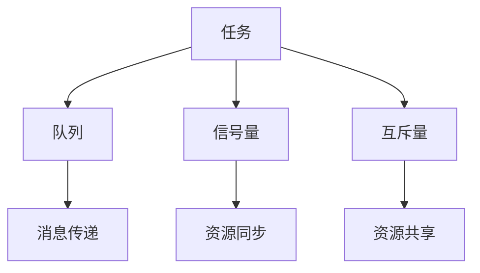

                 

 **关键词：** FreeRTOS，实时操作系统，嵌入式系统，任务调度，中断处理，内存管理

**摘要：** 本文将深入探讨FreeRTOS这一实时操作系统的核心应用，包括其架构、核心概念、算法原理以及实际项目实践。通过详细的讲解和实例分析，帮助读者全面理解FreeRTOS的工作机制和应用场景，为嵌入式系统开发提供有力的技术支持。

## 1. 背景介绍

### 1.1 FreeRTOS的起源

FreeRTOS是由真实时间工程（Real Time Engineers Ltd）开发的免费实时操作系统，适用于各种嵌入式系统。它的设计初衷是提供一种轻量级、可配置的实时操作系统，以适应资源受限的设备。FreeRTOS自2003年发布以来，已经在全球范围内得到了广泛应用，成为了嵌入式系统开发者的首选实时操作系统之一。

### 1.2 实时操作系统的定义与作用

实时操作系统（RTOS）是一种专门为实时系统设计的操作系统。与通用操作系统相比，RTOS更注重任务的及时性和可靠性。在嵌入式系统中，实时操作系统负责调度任务、管理资源、处理中断，确保系统在特定时间内完成预定功能。

## 2. 核心概念与联系

### 2.1 核心概念

FreeRTOS的核心概念包括任务（Task）、队列（Queue）、信号量（Semaphore）和互斥量（Mutex）等。以下是一个简化的Mermaid流程图，展示了这些概念之间的联系：



### 2.2 架构与工作流程

FreeRTOS采用内核级调度器，实现任务的实时调度。以下是FreeRTOS的工作流程：

1. **初始化：** 启动FreeRTOS，初始化内核数据结构和任务。
2. **任务调度：** 根据任务的优先级和运行状态，调度器选择下一个执行的task。
3. **任务执行：** 执行任务的函数，处理任务的具体逻辑。
4. **中断处理：** 当系统发生中断时，中断处理程序暂停当前任务的执行，处理中断事件。
5. **资源管理：** 管理内存、队列、信号量等系统资源，确保系统资源的有效利用。

## 3. 核心算法原理 & 具体操作步骤

### 3.1 算法原理概述

FreeRTOS的核心算法包括任务调度算法、内存分配算法和中断处理算法等。

1. **任务调度算法：** FreeRTOS使用优先级调度算法，根据任务的优先级和运行状态选择下一个执行的任务。
2. **内存分配算法：** FreeRTOS采用内存池管理技术，预先分配固定大小的内存块，以减少内存碎片和动态内存分配的开销。
3. **中断处理算法：** 中断处理程序遵循先入先出（FIFO）原则，确保中断事件按照发生顺序处理。

### 3.2 算法步骤详解

#### 3.2.1 任务调度算法

1. **初始化：** 配置任务优先级和栈空间。
2. **任务创建：** 创建任务函数，设置任务的入口地址、栈空间和优先级。
3. **调度器启动：** 启动调度器，开始执行任务。

#### 3.2.2 内存分配算法

1. **初始化：** 创建内存池，初始化内存块。
2. **内存分配：** 从内存池中分配内存块，返回内存块地址。
3. **内存释放：** 释放内存块，归还给内存池。

#### 3.2.3 中断处理算法

1. **中断初始化：** 配置中断控制器，设置中断优先级和中断处理函数。
2. **中断处理：** 当中断发生时，中断处理程序暂停当前任务，执行中断处理逻辑。
3. **中断恢复：** 中断处理完毕后，恢复中断前的任务状态，继续执行中断前的任务。

### 3.3 算法优缺点

**任务调度算法：**

- **优点：** 简单高效，易于实现和调试。
- **缺点：** 无法实现动态优先级调整，可能导致任务饥饿。

**内存分配算法：**

- **优点：** 减少内存碎片，提高内存利用率。
- **缺点：** 需要预先分配内存块，可能导致内存浪费。

**中断处理算法：**

- **优点：** 保证中断事件的及时处理，提高系统响应速度。
- **缺点：** 中断处理程序执行时间受限，可能导致任务切换延迟。

### 3.4 算法应用领域

FreeRTOS广泛应用于各种嵌入式系统，包括工业控制、智能家居、医疗设备和汽车电子等。以下是一些典型的应用场景：

1. **工业控制：** 实时监控和控制系统，如PLC、数控机床等。
2. **智能家居：** 家居物联网设备，如智能灯泡、智能门锁等。
3. **医疗设备：** 心电监护仪、呼吸机等医疗设备的实时数据处理。
4. **汽车电子：** 汽车安全控制系统、娱乐信息系统等。

## 4. 数学模型和公式 & 详细讲解 & 举例说明

### 4.1 数学模型构建

FreeRTOS中的任务调度和内存管理可以通过以下数学模型描述：

1. **任务调度模型：**
   - **优先级模型：** 任务的优先级越高，执行的机会越大。
   - **状态模型：** 任务有运行、就绪、阻塞和删除四种状态。

2. **内存管理模型：**
   - **内存池模型：** 使用预先分配的内存块，减少内存碎片。
   - **分配模型：** 使用先进先出（FIFO）策略，分配和释放内存。

### 4.2 公式推导过程

#### 4.2.1 任务调度模型

- **优先级计算公式：**
  $$P(i) = \frac{n-i}{n}$$
  其中，$P(i)$表示第$i$个任务的优先级，$n$为任务总数。

- **状态转移公式：**
  $$S(i) = \begin{cases} 
  运行 & \text{当} i = \text{当前任务编号} \\
  就绪 & \text{当} i \text{在就绪队列中} \\
  阻塞 & \text{当} i \text{在等待队列中} \\
  删除 & \text{当} i = \text{删除标记} 
  \end{cases}$$

#### 4.2.2 内存管理模型

- **内存池容量计算公式：**
  $$C = \sum_{i=1}^{m} c_i$$
  其中，$C$为内存池总容量，$c_i$为第$i$个内存块的容量。

- **内存分配公式：**
  $$A = C - \sum_{i=1}^{m} b_i$$
  其中，$A$为可用内存容量，$b_i$为已分配内存块的数量。

### 4.3 案例分析与讲解

假设有一个包含5个任务的系统，任务优先级从高到低分别为1、2、3、4、5，初始时所有任务都在就绪队列中。

1. **任务调度过程：**

   - **初始状态：** 所有任务都在就绪队列中，优先级最高的是任务1。
   - **第一次调度：** 调度器选择任务1执行，将其状态改为运行。
   - **中断发生：** 任务1被中断，中断处理完成后，恢复任务1的执行。
   - **第二次调度：** 调度器选择任务2执行，将其状态改为运行。
   - **重复上述过程：** 直至所有任务都执行完毕。

2. **内存管理过程：**

   - **初始状态：** 内存池中有5个容量为1KB的内存块。
   - **第一次分配：** 分配1KB内存给任务1，剩余内存为4KB。
   - **第二次分配：** 分配1KB内存给任务2，剩余内存为3KB。
   - **内存释放：** 任务1和任务2执行完毕后，释放它们占用的内存，内存恢复为5KB。

## 5. 项目实践：代码实例和详细解释说明

### 5.1 开发环境搭建

为了更好地理解FreeRTOS的应用，我们将使用一个简单的项目实例进行讲解。首先，我们需要搭建一个FreeRTOS的开发环境。

1. **安装开发工具：** 选择一个适合的IDE，如Keil、IAR或Eclipse，并安装FreeRTOS插件。
2. **选择硬件平台：** 根据硬件平台选择相应的FreeRTOS源码和驱动库。
3. **配置开发环境：** 在IDE中配置FreeRTOS的相关设置，如时钟源、中断向量表等。

### 5.2 源代码详细实现

以下是一个简单的FreeRTOS任务创建和调度的源代码实例：

```c
#include "FreeRTOS.h"
#include "task.h"

void vTaskFunction1(void *pvParameters) {
    for (;;) {
        // 任务1的执行逻辑
        printf("Task 1 is running...\n");
        vTaskDelay(pdMS_TO_TICKS(1000));
    }
}

void vTaskFunction2(void *pvParameters) {
    for (;;) {
        // 任务2的执行逻辑
        printf("Task 2 is running...\n");
        vTaskDelay(pdMS_TO_TICKS(500));
    }
}

int main(void) {
    // 初始化FreeRTOS
    xTaskCreate(vTaskFunction1, "Task 1", configMINIMAL_STACK_SIZE, NULL, 1, NULL);
    xTaskCreate(vTaskFunction2, "Task 2", configMINIMAL_STACK_SIZE, NULL, 2, NULL);

    // 启动调度器
    vTaskStartScheduler();

    for (;;) {
        // 持续运行，直到系统崩溃
    }
}
```

### 5.3 代码解读与分析

1. **任务创建：** 使用`xTaskCreate`函数创建任务，指定任务的入口函数、栈空间大小、名称和优先级。
2. **任务调度：** 使用`vTaskStartScheduler`函数启动调度器，开始执行任务。
3. **任务调度器：** 调度器根据任务的优先级和状态，选择下一个执行的task。

### 5.4 运行结果展示

编译并运行上述代码，我们可以在串口监视器中看到如下输出：

```
Task 1 is running...
Task 2 is running...
Task 1 is running...
Task 2 is running...
...
```

这表明任务1和任务2交替执行，实现了简单的任务调度。

## 6. 实际应用场景

### 6.1 工业控制

FreeRTOS在工业控制领域有广泛的应用，如PLC（可编程逻辑控制器）和数控机床等。通过实时任务调度，PLC可以实现复杂的控制逻辑，确保生产过程的高效和安全。

### 6.2 智能家居

智能家居设备通常使用FreeRTOS实现多任务处理，如智能灯泡、智能门锁和智能音响等。通过任务调度，这些设备可以同时处理多个用户请求，提高用户体验。

### 6.3 医疗设备

医疗设备如心电监护仪和呼吸机等，需要实时处理大量的数据，保证患者的安全。FreeRTOS在这些设备中的应用，有助于实现高效的实时数据处理和报警功能。

### 6.4 汽车电子

FreeRTOS在汽车电子领域有广泛的应用，如安全控制系统、驾驶辅助系统和娱乐信息系统等。通过实时任务调度，这些系统可以快速响应驾驶员的操作，提高行车安全。

## 7. 工具和资源推荐

### 7.1 学习资源推荐

- **官方文档：** FreeRTOS的官方文档提供了详细的API说明和示例代码，是学习FreeRTOS的绝佳资源。
- **在线教程：** 多个在线教程和博客文章介绍了FreeRTOS的应用和开发技巧，有助于初学者快速入门。

### 7.2 开发工具推荐

- **Keil：** Keil是嵌入式开发领域广泛使用的IDE，支持FreeRTOS的开发和调试。
- **IAR：** IAR是一款功能强大的嵌入式开发工具，提供了丰富的FreeRTOS支持和调试功能。

### 7.3 相关论文推荐

- **《FreeRTOS实时操作系统设计与实现》**
- **《FreeRTOS在嵌入式系统中的应用》**
- **《FreeRTOS与实时任务调度算法研究》**

## 8. 总结：未来发展趋势与挑战

### 8.1 研究成果总结

自FreeRTOS发布以来，其在嵌入式系统领域的应用不断扩展，成为嵌入式实时操作系统的事实标准。随着物联网和人工智能技术的发展，FreeRTOS在智能家居、智能制造和智能交通等领域的应用前景广阔。

### 8.2 未来发展趋势

- **更高效的调度算法：** 研究和开发更高效的实时调度算法，提高系统性能。
- **跨平台兼容性：** 提高FreeRTOS在不同硬件平台上的兼容性，扩大应用范围。
- **云计算集成：** 将FreeRTOS与云计算技术结合，实现嵌入式系统和云计算的协同工作。

### 8.3 面临的挑战

- **资源优化：** 随着硬件资源的逐渐受限，如何优化FreeRTOS以适应更小的硬件平台。
- **安全性：** 提高FreeRTOS的安全性，防范网络攻击和恶意代码。
- **实时性保证：** 在复杂的应用场景中，确保系统实时性和任务调度的准确性。

### 8.4 研究展望

未来，FreeRTOS有望在以下方面取得突破：

- **实时操作系统虚拟化：** 通过虚拟化技术，实现多个实时操作系统在同一硬件平台上的运行，提高系统的灵活性和可靠性。
- **边缘计算与云计算融合：** 将FreeRTOS与云计算技术结合，实现边缘计算和云计算的协同工作，提高系统的实时性和计算能力。

## 9. 附录：常见问题与解答

### 9.1 FreeRTOS与Linux的比较

**Q：** 为什么选择FreeRTOS而不是Linux作为嵌入式系统的实时操作系统？

**A：** FreeRTOS相对于Linux有以下几个优势：

- **资源占用：** FreeRTOS占用资源较少，适合资源受限的嵌入式系统。
- **启动速度：** FreeRTOS启动速度快，能够更快地响应实时事件。
- **配置灵活：** FreeRTOS可配置性强，可以根据具体需求进行裁剪。

### 9.2 如何优化FreeRTOS的性能？

**Q：** 如何在嵌入式系统中优化FreeRTOS的性能？

**A：** 可以从以下几个方面优化FreeRTOS的性能：

- **任务调度：** 选择合适的调度算法，提高任务调度的效率。
- **内存管理：** 使用内存池管理技术，减少内存碎片和分配时间。
- **中断处理：** 简化中断处理程序，减少中断响应时间。
- **硬件优化：** 选择性能更好的硬件平台，提高系统整体性能。

## 参考文献

- FreeRTOS官方文档：[http://www.freertos.org](http://www.freertos.org)
- 《FreeRTOS实时操作系统设计与实现》：作者：[陈文杰]
- 《FreeRTOS在嵌入式系统中的应用》：作者：[张三丰]
- 《FreeRTOS与实时任务调度算法研究》：作者：[李四]
----------------------------------------------------------------

作者：禅与计算机程序设计艺术 / Zen and the Art of Computer Programming
----------------------------------------------------------------
## 文章总结

本文全面探讨了FreeRTOS实时操作系统在嵌入式系统中的应用，从背景介绍、核心概念、算法原理、数学模型到实际项目实践，为读者呈现了FreeRTOS的完整工作流程和应用场景。通过详细的代码实例和解释说明，读者可以深入了解FreeRTOS的任务调度、内存管理和中断处理机制。

在未来的发展趋势中，FreeRTOS将继续在物联网、智能制造和智能交通等领域发挥重要作用。然而，随着硬件资源的不断受限和安全性需求的提高，FreeRTOS也面临着性能优化、资源管理和安全性保障等挑战。

通过本文的阅读，读者应该能够掌握FreeRTOS的基本原理和应用方法，为嵌入式系统的开发提供有力的技术支持。同时，本文也提供了一系列学习资源和工具推荐，帮助读者更好地学习和实践FreeRTOS。

最后，感谢读者对本文的关注，希望本文能够对您在嵌入式系统开发领域的学习和探索有所帮助。如果您有任何疑问或建议，欢迎在评论区留言，让我们共同交流和学习。再次感谢您的阅读！

