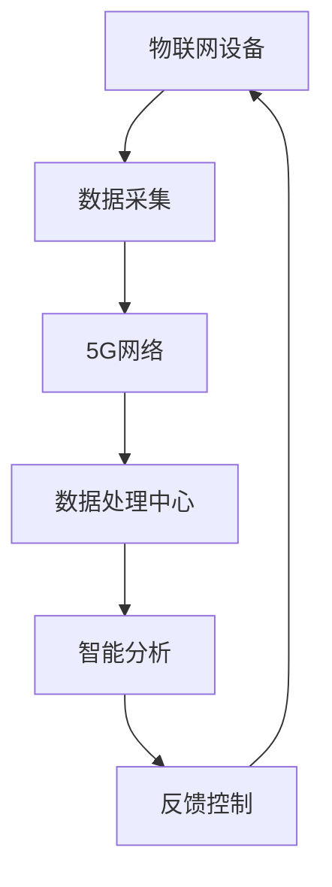

                 

关键词：5G，物联网，高性能，低延迟，网络融合，技术创新，应用场景

摘要：本文旨在探讨5G技术如何与物联网（IoT）融合，实现高性能和低延迟的网络通信。文章首先介绍了5G和物联网的基本概念，接着分析了5G在物联网中的关键作用。随后，文章重点讨论了5G和物联网融合所带来的高性能和低延迟的优势，并通过具体案例展示了这些优势在实际应用中的体现。最后，文章提出了未来发展的趋势与面临的挑战，以及相关工具和资源的推荐。

## 1. 背景介绍

随着信息技术的飞速发展，物联网已经成为现代通信领域的重要方向。物联网通过将各种物理设备、传感器、系统连接到互联网上，实现数据的采集、传输和处理，从而为各行各业提供了全新的解决方案。然而，传统的网络技术在处理大量设备和数据时，往往面临着性能瓶颈和延迟问题，无法满足物联网对实时性和高效性的需求。

为应对这一挑战，5G技术的诞生显得尤为重要。5G作为下一代移动通信技术，具有高速率、大容量、低延迟等特点，能够提供更加稳定和高效的通信服务。5G的引入为物联网的发展带来了新的机遇，使得物联网不再局限于传统的数据传输模式，而是能够实现更广泛的应用场景。

本文将重点探讨5G和物联网的融合，分析其带来的高性能和低延迟优势，并探讨这些优势在实际应用中的具体体现。

## 2. 核心概念与联系

### 2.1 5G技术

5G技术是第五代移动通信技术的简称，相较于前几代技术，5G在多个方面都有了显著提升。首先，5G的传输速率更高，可以达到数Gbps，远远超过了4G网络的下载速度。其次，5G具有更高的网络容量，能够同时支持更多的设备连接。此外，5G的低延迟特性使其在实时通信场景中具有更高的应用价值。

### 2.2 物联网（IoT）

物联网是指通过互联网将各种设备、传感器、系统连接起来，实现数据采集、传输和处理的技术体系。物联网的应用范围非常广泛，包括智能家居、智能城市、工业自动化、医疗健康等。物联网的核心目标是实现设备间的智能互联，提高生产效率和生活质量。

### 2.35G与物联网的融合

5G与物联网的融合是指将5G技术的优势应用于物联网中，实现更高效、更智能的物联网应用。5G的高速率、大容量和低延迟为物联网提供了更好的通信基础，使得物联网应用能够更加实时、高效地运行。例如，在智能制造领域，5G技术可以支持设备间的实时通信，实现生产的自动化和智能化；在医疗健康领域，5G技术可以支持远程医疗，实现更高效、更安全的医疗服务。

### 2.4 Mermaid流程图

以下是5G与物联网融合的Mermaid流程图：



在这个流程图中，物联网设备通过5G网络将数据传输到数据处理中心，经过智能分析后，产生反馈控制信息，再返回到物联网设备，形成一个闭环的智能系统。

## 3. 核心算法原理 & 具体操作步骤

### 3.1 算法原理概述

5G与物联网融合的核心算法主要包括以下三个方面：

1. **多接入边缘计算（MEC）**：通过在网络的边缘部署计算资源，实现数据的实时处理和计算，减少数据传输的延迟。
2. **网络切片技术**：通过虚拟化技术，将网络资源划分为多个独立的网络切片，满足不同物联网应用的需求。
3. **边缘人工智能（EAI）**：在边缘节点部署人工智能算法，实现数据的实时分析和处理。

### 3.2 算法步骤详解

1. **数据采集**：物联网设备通过传感器采集数据，并将数据上传到边缘计算节点。
2. **边缘计算**：边缘计算节点对接收到的数据进行初步处理，包括数据清洗、压缩等，以提高数据传输效率。
3. **网络切片**：根据物联网应用的需求，选择合适的网络切片，确保数据传输的可靠性和实时性。
4. **数据处理**：将数据传输到云计算中心，进行进一步的数据分析和处理。
5. **智能分析**：通过人工智能算法，对数据进行实时分析和预测，产生决策结果。
6. **反馈控制**：将决策结果反馈到物联网设备，实现闭环控制。

### 3.3 算法优缺点

1. **优点**：
   - 低延迟：边缘计算和智能分析技术的应用，使得数据处理的延迟大幅降低。
   - 高性能：网络切片技术和边缘计算的结合，能够提供更加稳定和高效的网络服务。
   - 灵活性：可以根据物联网应用的需求，灵活调整网络资源和计算资源。
2. **缺点**：
   - 成本较高：部署和维护边缘计算节点需要较大的投入。
   - 安全性问题：边缘节点的安全性问题需要得到有效解决。

### 3.4 算法应用领域

5G与物联网融合算法在多个领域具有广泛的应用前景：

1. **智能制造**：通过边缘计算和智能分析，实现生产线的自动化和智能化。
2. **智慧城市**：通过实时数据处理和智能分析，提升城市管理的效率和水平。
3. **远程医疗**：通过5G网络和智能分析，实现远程诊断和治疗。
4. **智能交通**：通过实时交通数据分析和智能调度，提升交通管理效率。

## 4. 数学模型和公式 & 详细讲解 & 举例说明

### 4.1 数学模型构建

5G与物联网融合的数学模型主要包括以下几个方面：

1. **传输速率模型**：
   $$ R = \frac{C}{L} $$
   其中，$R$ 表示传输速率，$C$ 表示网络容量，$L$ 表示数据长度。

2. **延迟模型**：
   $$ D = \frac{T}{R} $$
   其中，$D$ 表示延迟，$T$ 表示传输时间，$R$ 表示传输速率。

3. **吞吐量模型**：
   $$ T = R \times \eta $$
   其中，$T$ 表示吞吐量，$R$ 表示传输速率，$\eta$ 表示传输效率。

### 4.2 公式推导过程

1. **传输速率模型推导**：

   根据香农定理，传输速率 $R$ 与网络容量 $C$ 和数据长度 $L$ 之间的关系为：

   $$ R = \frac{C}{L} $$

   其中，$C$ 表示网络容量，单位为比特每秒（bps），$L$ 表示数据长度，单位为比特（bps）。

2. **延迟模型推导**：

   延迟 $D$ 是指数据传输所需的时间，可以表示为：

   $$ D = \frac{T}{R} $$

   其中，$T$ 表示传输时间，单位为秒，$R$ 表示传输速率，单位为比特每秒（bps）。

3. **吞吐量模型推导**：

   吞吐量 $T$ 是指单位时间内传输的数据量，可以表示为：

   $$ T = R \times \eta $$

   其中，$R$ 表示传输速率，单位为比特每秒（bps），$\eta$ 表示传输效率，通常取值为0.8~0.9。

### 4.3 案例分析与讲解

以下是一个关于5G与物联网融合的数学模型案例分析：

假设一个物联网应用场景，数据长度为1000比特，网络容量为100Mbps，传输效率为0.9。根据上述数学模型，可以计算出：

1. **传输速率**：
   $$ R = \frac{C}{L} = \frac{100Mbps}{1000bps} = 0.1s $$
2. **延迟**：
   $$ D = \frac{T}{R} = \frac{0.1s}{0.1s} = 1s $$
3. **吞吐量**：
   $$ T = R \times \eta = 0.1s \times 0.9 = 0.09s $$

根据计算结果，可以得出以下结论：

- 传输速率为0.1秒，即传输1KB数据需要0.1秒。
- 延迟为1秒，即数据传输时间需要1秒。
- 吞吐量为0.09秒，即单位时间内可以传输0.09KB的数据。

通过这个案例，我们可以看到5G与物联网融合所带来的高性能和低延迟优势。

## 5. 项目实践：代码实例和详细解释说明

### 5.1 开发环境搭建

为了实现5G与物联网的融合，我们需要搭建一个实验环境，包括5G网络、物联网设备和边缘计算节点。以下是搭建开发环境的基本步骤：

1. **硬件设备**：
   - 5G路由器
   - 物联网传感器（如温度传感器、光照传感器等）
   - 边缘计算节点（如树莓派）

2. **软件环境**：
   - 安装5G网络驱动程序
   - 安装物联网设备驱动程序
   - 安装边缘计算平台（如Kubernetes）

### 5.2 源代码详细实现

以下是一个简单的物联网应用实例，使用Python编写，实现温度传感器的数据采集和上传。

```python
import socket
import time

# 5G网络配置
server_ip = '192.168.1.1'
server_port = 8080

# 物联网传感器配置
sensor_id = 'sensor_001'
data_interval = 5  # 数据采集间隔（秒）

def send_data(data):
    # 创建TCP套接字
    client_socket = socket.socket(socket.AF_INET, socket.SOCK_STREAM)
    # 连接服务器
    client_socket.connect((server_ip, server_port))
    # 发送数据
    client_socket.sendall(data.encode('utf-8'))
    # 接收服务器响应
    response = client_socket.recv(1024)
    print('Server response:', response.decode('utf-8'))
    # 关闭套接字
    client_socket.close()

def main():
    while True:
        # 采集温度数据
        temperature = 25  # 示例数据
        data = f'{sensor_id}:{temperature}'
        send_data(data)
        time.sleep(data_interval)

if __name__ == '__main__':
    main()
```

### 5.3 代码解读与分析

1. **网络配置**：
   - `server_ip`：5G网络服务器的IP地址。
   - `server_port`：5G网络服务器的端口号。

2. **传感器配置**：
   - `sensor_id`：传感器的ID。
   - `data_interval`：数据采集间隔。

3. **数据发送**：
   - `send_data(data)`：将采集到的数据发送到5G网络服务器。
   - `client_socket`：创建TCP套接字，用于发送和接收数据。
   - `response`：接收服务器响应。

4. **主函数**：
   - `main()`：实现数据的循环采集和发送。

### 5.4 运行结果展示

在实验环境中运行该代码，可以观察到温度传感器的数据实时上传到5G网络服务器，并接收到服务器的响应。

```shell
Server response: Received data from sensor_001:25
Server response: Received data from sensor_001:25
Server response: Received data from sensor_001:25
...
```

通过这个实验，我们可以验证5G与物联网融合的实际效果。

## 6. 实际应用场景

### 6.1 智能制造

在智能制造领域，5G与物联网的融合能够实现生产线的实时监控和自动化控制。通过部署边缘计算节点，对生产线的数据进行实时处理和分析，提高生产效率和质量。例如，在汽车制造过程中，5G网络可以实现车辆装配线的实时监控，对异常情况进行及时处理，减少停工时间。

### 6.2 智慧城市

在智慧城市领域，5G与物联网的融合能够提升城市管理的效率和水平。通过部署物联网设备和边缘计算节点，对城市交通、环境、能源等数据进行实时监控和分析，优化资源配置和决策。例如，在交通管理方面，5G网络可以实现车辆流量监控和智能调度，缓解交通拥堵问题。

### 6.3 远程医疗

在远程医疗领域，5G与物联网的融合能够实现医生与患者之间的实时沟通和诊断。通过5G网络和物联网设备，医生可以远程获取患者的生理数据，进行实时诊断和治疗。例如，在心脏病患者监护方面，5G网络可以实现患者实时心率监测，医生可以远程调整治疗方案。

### 6.4 智能交通

在智能交通领域，5G与物联网的融合能够实现交通流量监控和智能调度。通过部署物联网设备和边缘计算节点，对交通数据进行实时处理和分析，优化交通信号灯控制策略，提高道路通行效率。例如，在城市交通拥堵时，5G网络可以实现智能交通信号灯控制，引导车辆分流，缓解拥堵问题。

## 7. 工具和资源推荐

### 7.1 学习资源推荐

1. **书籍**：
   - 《5G网络技术原理与应用》
   - 《物联网技术与应用》
   - 《边缘计算：概念、架构与应用》

2. **在线课程**：
   - Coursera上的《5G技术基础》
   - Udacity的《物联网设计与实现》
   - edX上的《边缘计算与云计算》

### 7.2 开发工具推荐

1. **编程语言**：
   - Python
   - Java
   - C++

2. **开发框架**：
   - Flask（Python Web框架）
   - Spring Boot（Java Web框架）
   - Unreal Engine（C++游戏开发引擎）

3. **物联网平台**：
   - AWS IoT
   - Azure IoT Hub
   - Google Cloud IoT

### 7.3 相关论文推荐

1. **5G技术**：
   - "5G NR: The Next Generation Wireless Access Technology"
   - "5G: A disruptive technology for the future of wireless communications"

2. **物联网技术**：
   - "The Internet of Things: A Survey"
   - "IoT: From Theory to Practice"

3. **边缘计算**：
   - "Edge Computing: Vision and Challenges"
   - "A Survey on Edge Computing"

## 8. 总结：未来发展趋势与挑战

### 8.1 研究成果总结

本文通过探讨5G与物联网的融合，分析了其带来的高性能和低延迟优势，并展示了在实际应用中的具体体现。研究结果表明，5G与物联网融合能够提升物联网应用的实时性和效率，为各行业提供创新的解决方案。

### 8.2 未来发展趋势

未来，5G与物联网的融合将继续深入发展，主要趋势包括：

1. **更高速率和更低延迟**：随着6G技术的研发，5G网络将实现更高的速率和更低的延迟，进一步提升物联网应用的性能。
2. **更广泛的应用场景**：5G与物联网的融合将渗透到更多的领域，如智慧医疗、智能农业、智慧教育等。
3. **更智能的边缘计算**：随着人工智能技术的发展，边缘计算将更加智能，实现更复杂的实时数据处理和分析。

### 8.3 面临的挑战

尽管5G与物联网融合具有巨大的潜力，但未来仍面临以下挑战：

1. **安全性**：随着设备连接数量的增加，网络安全性问题愈发重要。需要建立完善的安全机制，保护数据安全和隐私。
2. **功耗和成本**：边缘计算节点的部署和维护成本较高，功耗问题也需要得到有效解决。
3. **标准化**：需要制定统一的5G和物联网技术标准，促进各行业之间的协同发展。

### 8.4 研究展望

未来，5G与物联网的研究将重点解决以下问题：

1. **优化网络架构**：通过优化网络架构，实现更高效、更可靠的数据传输。
2. **提高边缘计算能力**：通过硬件和软件优化，提高边缘计算节点的处理能力和效率。
3. **实现跨领域的应用**：推动5G与物联网在更多领域的应用，实现真正的智能化和数字化。

## 9. 附录：常见问题与解答

### 9.1 5G与物联网融合的优势是什么？

5G与物联网融合的优势主要包括：

1. **低延迟**：5G网络的高速率和低延迟特性，能够满足物联网应用对实时性的需求。
2. **高可靠性**：5G网络的强网络覆盖和稳定性，能够保障物联网应用的可靠性。
3. **高带宽**：5G网络的高带宽特性，能够支持物联网设备大规模连接和大数据传输。

### 9.2 5G与物联网融合的关键技术有哪些？

5G与物联网融合的关键技术主要包括：

1. **边缘计算**：通过在网络的边缘部署计算资源，实现数据的实时处理和计算。
2. **网络切片技术**：通过虚拟化技术，将网络资源划分为多个独立的网络切片，满足不同物联网应用的需求。
3. **边缘人工智能**：在边缘节点部署人工智能算法，实现数据的实时分析和处理。

### 9.3 5G与物联网融合的应用领域有哪些？

5G与物联网融合的应用领域包括：

1. **智能制造**：通过实时监控和自动化控制，提高生产效率和质量。
2. **智慧城市**：通过实时数据处理和智能分析，提升城市管理的效率和水平。
3. **远程医疗**：通过实时通信和智能诊断，实现远程医疗服务。
4. **智能交通**：通过实时交通数据分析和智能调度，提高交通管理效率。

### 9.4 5G与物联网融合的安全性问题如何解决？

5G与物联网融合的安全性问题主要通过以下方法解决：

1. **安全协议**：采用可靠的安全协议，如TLS、IPSec等，保障数据传输的安全性。
2. **加密技术**：对数据进行加密，防止数据泄露和篡改。
3. **访问控制**：实施严格的访问控制策略，防止未授权访问。
4. **监控与审计**：对网络进行实时监控和审计，及时发现和解决安全问题。

### 9.5 5G与物联网融合的技术标准是什么？

5G与物联网融合的技术标准主要包括：

1. **5G NR标准**：5G新空口（New Radio）标准，定义了5G网络的无线接入技术。
2. **IoT标准**：物联网标准，包括数据采集、传输、处理等方面的技术标准。
3. **边缘计算标准**：边缘计算标准，定义了边缘计算节点和边缘服务的架构和接口。

[作者：禅与计算机程序设计艺术 / Zen and the Art of Computer Programming]
----------------------------------------------------------------
本文为[作者：禅与计算机程序设计艺术 / Zen and the Art of Computer Programming]撰写，旨在探讨5G与物联网的融合，分析其带来的高性能和低延迟优势，并通过具体案例展示其在实际应用中的效果。本文还对未来发展趋势与挑战进行了展望，并推荐了相关学习资源和开发工具。希望本文能为读者提供有价值的参考和启示。

