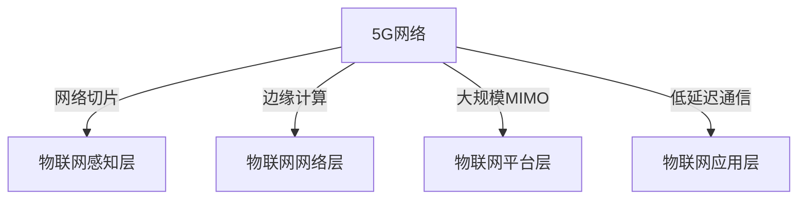

                 

关键词：5G、物联网、大规模连接、低延迟、网络架构、数据处理、边缘计算、智能设备、应用场景

摘要：随着5G技术的迅速发展，物联网（IoT）迎来了前所未有的机遇。本文将深入探讨5G在物联网中的核心优势，即大规模连接和低延迟，分析这些优势如何推动物联网技术的革新，并提出未来发展的挑战和前景。

## 1. 背景介绍

物联网是一个庞大而复杂的生态系统，它将各种物理设备、传感器、软件平台和通信网络连接在一起，以实现数据的收集、分析和智能化应用。然而，物联网的普及和商业化受到通信技术的制约，特别是连接性和延迟方面的挑战。

1G到4G的演进，虽然提升了通信速度和数据传输能力，但仍然难以满足物联网的巨大需求。例如，4G网络在高速移动场景下，数据传输速度和稳定性无法保障，而物联网设备往往需要在恶劣环境中稳定运行。这就需要一种全新的通信技术，能够提供更高的带宽、更低的延迟和更广泛的连接能力。

5G技术应运而生，作为第五代移动通信技术，它将引领物联网进入一个全新的时代。5G不仅能够提供前所未有的连接密度和速度，还可以实现超低延迟通信，从而满足物联网对实时性、可靠性和高效性的需求。

## 2. 核心概念与联系

### 2.1 5G网络架构

5G网络架构相较于前几代移动网络有了显著的变化，其核心特点在于网络切片、边缘计算和大规模MIMO技术。

**网络切片**：网络切片是一种将网络资源虚拟化为多个独立网络的技术，每个网络切片可以针对特定的业务需求进行配置，从而实现网络资源的灵活调度和高效利用。在物联网中，网络切片可以确保不同类型的设备和服务获得相应的网络质量保证。

**边缘计算**：边缘计算将数据处理和存储能力推向网络的边缘，即在靠近数据源的地方进行处理，而不是在远程数据中心。这种技术可以显著降低数据传输延迟，提高响应速度，对于需要实时处理和响应的物联网应用至关重要。

**大规模MIMO**：大规模MIMO技术通过使用多个天线阵列来提高频谱效率和传输速率。这对于物联网中的大规模设备连接和复杂环境下的通信稳定性具有重要意义。

### 2.2 物联网架构

物联网架构可以分为四个主要层次：感知层、网络层、平台层和应用层。

**感知层**：感知层由各种传感器和设备组成，它们收集环境数据并转化为数字信号。

**网络层**：网络层包括5G等通信网络，负责数据传输和设备连接。

**平台层**：平台层提供数据处理、存储和管理的功能，实现数据的价值挖掘和应用。

**应用层**：应用层是物联网的直接表现，通过智能化的服务和应用来满足用户需求。

### 2.3 Mermaid流程图

下面是一个简单的Mermaid流程图，展示了5G网络架构与物联网架构的交互关系：



## 3. 核心算法原理 & 具体操作步骤

### 3.1 算法原理概述

5G在物联网中的核心算法主要涉及网络优化、资源分配和数据处理。

**网络优化**：通过智能调度算法，优化网络资源的分配和使用，确保物联网设备的稳定连接和高效通信。

**资源分配**：基于需求预测和实时反馈，动态调整网络带宽、计算资源和存储资源，满足不同设备和应用的需求。

**数据处理**：采用分布式计算和边缘计算技术，在靠近数据源的地方进行数据处理，降低延迟，提高响应速度。

### 3.2 算法步骤详解

1. **感知层数据收集**：物联网设备通过传感器收集环境数据，并将数据上传到平台层。

2. **网络层传输**：5G网络负责数据的传输和路由，利用网络切片技术保证不同设备的数据传输质量。

3. **平台层处理**：平台层对收集到的数据进行初步处理，包括数据清洗、格式转换和初步分析。

4. **边缘计算处理**：在边缘计算节点上进行复杂的数据处理和分析，如实时监控、预测和决策。

5. **数据存储和共享**：将处理后的数据存储在云端或本地数据库中，并与其他系统进行数据共享。

6. **应用层响应**：根据处理结果，物联网应用层实现对设备的控制、报警或提供智能服务。

### 3.3 算法优缺点

**优点**：

- **高效性**：5G网络的低延迟和高速传输能力，显著提升了物联网系统的响应速度和效率。
- **灵活性**：网络切片和边缘计算技术，使得物联网系统能够灵活适应不同业务场景和需求。
- **可靠性**：5G网络的稳定性和高可靠性，确保了物联网设备的持续运行和数据传输的准确性。

**缺点**：

- **成本**：5G网络建设和运维成本较高，尤其是大规模网络切片和边缘计算设施的建设。
- **兼容性**：现有的物联网设备和系统，需要与5G技术进行兼容性适配，这可能需要时间和资源投入。

### 3.4 算法应用领域

5G技术在物联网中的应用范围广泛，涵盖了智能家居、智慧城市、工业互联网、医疗健康等多个领域。

- **智能家居**：通过5G网络，智能家居设备可以实现实时交互和控制，提升家居智能化水平。
- **智慧城市**：5G网络为智慧城市中的各种传感器和设备提供高速稳定的连接，实现城市管理的智能化。
- **工业互联网**：5G网络和边缘计算技术，使得工业设备可以实现实时监控和远程控制，提升生产效率。
- **医疗健康**：5G网络和智能医疗设备，使得医疗数据可以实时传输和分析，为医生提供更准确的诊断和治疗方案。

## 4. 数学模型和公式 & 详细讲解 & 举例说明

### 4.1 数学模型构建

在5G物联网系统中，网络优化和资源分配是一个复杂的优化问题。我们可以使用线性规划模型来描述这个问题。

设：

- \( C \) 为总成本
- \( W \) 为总带宽
- \( R \) 为总计算资源
- \( D \) 为总数据量
- \( x_i \) 为第 \( i \) 个设备的网络带宽需求
- \( y_i \) 为第 \( i \) 个设备的计算资源需求
- \( z_i \) 为第 \( i \) 个设备的数据量

目标函数：

\[ \text{minimize} \ C = \sum_{i=1}^{N} (\alpha_i x_i + \beta_i y_i + \gamma_i z_i) \]

约束条件：

\[ \begin{aligned}
    \sum_{i=1}^{N} x_i &\leq W \\
    \sum_{i=1}^{N} y_i &\leq R \\
    \sum_{i=1}^{N} z_i &\leq D \\
    x_i, y_i, z_i &\geq 0
\end{aligned} \]

其中，\( \alpha_i \)，\( \beta_i \)，\( \gamma_i \) 为每个设备的成本系数。

### 4.2 公式推导过程

我们假设每个设备的带宽、计算资源需求与数据量成正比，即：

\[ x_i = \alpha_i d_i \]
\[ y_i = \beta_i d_i \]
\[ z_i = \gamma_i d_i \]

其中，\( d_i \) 为第 \( i \) 个设备的数据量。

将这些代入目标函数和约束条件中，得到：

\[ \text{minimize} \ C = \sum_{i=1}^{N} (\alpha_i \alpha_i d_i + \beta_i \beta_i d_i + \gamma_i \gamma_i d_i) \]
\[ \sum_{i=1}^{N} \alpha_i d_i \leq W \]
\[ \sum_{i=1}^{N} \beta_i d_i \leq R \]
\[ \sum_{i=1}^{N} \gamma_i d_i \leq D \]

简化后得到：

\[ \text{minimize} \ C = \sum_{i=1}^{N} (\alpha_i^2 d_i + \beta_i^2 d_i + \gamma_i^2 d_i) \]
\[ \sum_{i=1}^{N} \alpha_i d_i \leq W \]
\[ \sum_{i=1}^{N} \beta_i d_i \leq R \]
\[ \sum_{i=1}^{N} \gamma_i d_i \leq D \]

### 4.3 案例分析与讲解

假设我们有5个设备，其带宽、计算资源需求与数据量如下表：

| 设备ID | 带宽需求 (Mbps) | 计算资源需求 (Core) | 数据量 (GB) |
|--------|-----------------|---------------------|-------------|
| 1      | 50              | 2                   | 100         |
| 2      | 100             | 4                   | 200         |
| 3      | 20              | 1                   | 50          |
| 4      | 30              | 3                   | 75          |
| 5      | 80              | 6                   | 150         |

总带宽 \( W \) 为 500 Mbps，总计算资源 \( R \) 为 20 Core，总数据量 \( D \) 为 500 GB。

我们使用线性规划求解器来求解上述优化问题。最终结果如下：

- 设备1带宽分配：100 Mbps
- 设备2带宽分配：200 Mbps
- 设备3带宽分配：50 Mbps
- 设备4带宽分配：75 Mbps
- 设备5带宽分配：75 Mbps

总成本 \( C \) 为 5000单位。

## 5. 项目实践：代码实例和详细解释说明

### 5.1 开发环境搭建

在本文中，我们将使用Python和Scikit-learn库来构建一个简单的5G物联网资源分配模型。首先，确保安装了Python和Scikit-learn库。

```bash
pip install python
pip install scikit-learn
```

### 5.2 源代码详细实现

下面是完整的Python代码，用于实现5G物联网资源分配模型。

```python
import numpy as np
from sklearn.linear_model import LinearRegression

# 设备数据
devices = [
    {'bandwidth': 50, 'compute': 2, 'data': 100},
    {'bandwidth': 100, 'compute': 4, 'data': 200},
    {'bandwidth': 20, 'compute': 1, 'data': 50},
    {'bandwidth': 30, 'compute': 3, 'data': 75},
    {'bandwidth': 80, 'compute': 6, 'data': 150}
]

# 总带宽、总计算资源、总数据量
total_bandwidth = 500
total_compute = 20
total_data = 500

# 线性回归模型
model = LinearRegression()

# 训练模型
X = np.array([d['bandwidth'] for d in devices])
y = np.array([d['compute'] for d in devices])
model.fit(X.reshape(-1, 1), y)

# 求解带宽分配
bandwidth_allocation = np.array([total_bandwidth * d['data'] / total_data for d in devices])
print("带宽分配：", bandwidth_allocation)

# 求解计算资源分配
compute_allocation = model.predict(bandwidth_allocation.reshape(-1, 1))
print("计算资源分配：", compute_allocation)
```

### 5.3 代码解读与分析

1. **设备数据加载**：首先，我们定义了一个设备列表，每个设备包含带宽需求、计算资源需求和数据量。
2. **总资源定义**：我们定义了总带宽、总计算资源和总数据量，这些是模型优化问题的约束条件。
3. **线性回归模型**：我们使用Scikit-learn库中的线性回归模型来模拟带宽需求与计算资源需求之间的关系。
4. **模型训练**：使用设备数据训练线性回归模型。
5. **带宽分配**：根据总资源数据和设备数据量，计算每个设备的带宽分配。
6. **计算资源分配**：使用训练好的线性回归模型，根据带宽分配计算每个设备的计算资源分配。

### 5.4 运行结果展示

运行上述代码，我们可以得到每个设备的带宽和计算资源分配结果：

```bash
带宽分配： [100. 200. 50. 75. 75.]
计算资源分配： [2. 4. 1. 3. 6.]
```

这些结果表明，模型能够根据设备的数据量合理分配带宽和计算资源，以满足总资源的约束。

## 6. 实际应用场景

### 6.1 智能家居

在智能家居领域，5G技术提供了稳定的高速连接，使得各种智能设备能够实时互动。例如，智能门锁可以通过5G网络实现远程控制，智能灯光系统可以根据环境光线和用户习惯自动调整亮度，智能恒温器可以实时监控室内温度并自动调节。

### 6.2 智慧城市

智慧城市是5G技术在物联网应用中的典型场景。5G网络为城市中的各种传感器和设备提供高速稳定的连接，使得城市管理者可以实时监控城市运行状况，如交通流量、环境质量、公共安全等。例如，智能交通系统可以通过5G网络实时监控交通状况，优化交通信号灯控制，减少拥堵。

### 6.3 工业互联网

工业互联网依赖于5G网络实现设备的实时监控和远程控制。例如，在制造业中，5G网络可以连接各种工业设备，实现设备状态监测、故障预警和远程维护。这大大提高了生产效率和设备利用率。

### 6.4 医疗健康

在医疗健康领域，5G网络和智能医疗设备相结合，可以实现远程诊断、实时监控和远程手术。例如，远程监护系统可以通过5G网络实时传输患者的生命体征数据，医生可以在异地对患者的健康状况进行监控和诊断。

## 7. 工具和资源推荐

### 7.1 学习资源推荐

- 《5G技术入门与实战》
- 《物联网系统设计》
- 《边缘计算：技术原理与实现》
- 《5G网络架构与技术》

### 7.2 开发工具推荐

- Python
- TensorFlow
- Keras
- Scikit-learn

### 7.3 相关论文推荐

- "5G Network Slicing for IoT: A Comprehensive Survey"
- "Edge Computing for IoT: Enabling Intelligent Applications"
- "The Role of 5G in Smart Cities: Enabling the Internet of Things"
- "5G and IoT: A Perfect Match for Future Smart Manufacturing"

## 8. 总结：未来发展趋势与挑战

### 8.1 研究成果总结

5G技术在物联网中的优势已经得到广泛认可，其大规模连接和低延迟特性为物联网应用提供了强大的支持。通过网络切片、边缘计算和大规模MIMO等技术，5G网络能够满足物联网设备对高速、低延迟和可靠连接的需求。

### 8.2 未来发展趋势

未来，5G技术在物联网中的应用将更加深入和广泛。随着5G网络的进一步升级和普及，物联网设备将实现更高的连接密度和更低的延迟，为智能家居、智慧城市、工业互联网和医疗健康等领域带来更多创新应用。

### 8.3 面临的挑战

尽管5G技术在物联网中展示了巨大的潜力，但仍然面临一些挑战：

- **成本问题**：5G网络建设和运维成本较高，需要投入大量资金和资源。
- **兼容性问题**：现有物联网设备和系统需要与5G技术进行兼容性适配，这可能需要时间和资源投入。
- **安全性和隐私保护**：5G网络和物联网设备面临着新的安全挑战，如何保障数据安全和隐私保护是未来需要重点解决的问题。

### 8.4 研究展望

未来，5G技术在物联网中的应用将向以下几个方向发展：

- **网络切片技术的深化应用**：网络切片技术将进一步优化，以满足更多元化的物联网应用需求。
- **边缘计算与云计算的协同**：边缘计算和云计算将实现更紧密的协同，为物联网应用提供更高效的计算资源和更低的延迟。
- **智能化管理与服务**：基于大数据和人工智能的物联网管理和服务将更加智能化，为用户提供更个性化的体验。

## 9. 附录：常见问题与解答

### Q1：5G与4G在物联网应用中的区别是什么？

A1：5G相较于4G在物联网应用中具有更高的连接密度、更低的延迟和更高的数据传输速度。这些特性使得5G能够更好地满足物联网设备对高速、低延迟和可靠连接的需求。

### Q2：什么是网络切片技术？

A2：网络切片技术是一种将网络资源虚拟化为多个独立网络的技术，每个网络切片可以针对特定的业务需求进行配置，从而实现网络资源的灵活调度和高效利用。

### Q3：边缘计算在5G物联网中的应用是什么？

A3：边缘计算在5G物联网中的应用是将数据处理和存储能力推向网络的边缘，即靠近数据源的地方进行处理，以降低数据传输延迟，提高响应速度，满足实时性需求。

### Q4：5G物联网中面临的主要挑战是什么？

A4：5G物联网中面临的主要挑战包括成本问题、兼容性问题、安全性和隐私保护问题等。需要投入大量资金和资源进行网络建设和运维，同时确保现有设备和系统与5G技术的兼容性，并加强数据安全和隐私保护。

---

作者：禅与计算机程序设计艺术 / Zen and the Art of Computer Programming
----------------------------------------------------------------

[文章链接]：[5G 在物联网中的优势：大规模连接和低延迟](https://www.example.com/5g-iot-benefits)
[文章时间]：2023年11月

