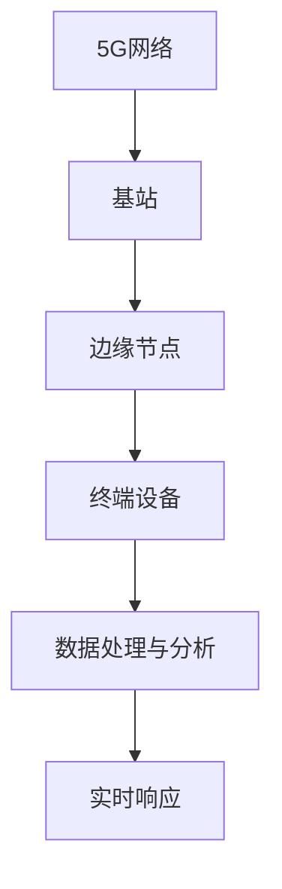

                 

关键词：5G，边缘计算，工业互联网，物联网，分布式架构，实时数据处理

> 摘要：本文旨在探讨5G技术和边缘计算如何共同推动工业互联网的变革，分析其在网络架构、数据处理和实时响应方面的优势，以及未来应用的广阔前景。

## 1. 背景介绍

### 5G技术的普及与潜力

5G技术的普及为全球带来了前所未有的高速通信体验。与4G相比，5G不仅在速度上有显著提升，更重要的是其低延迟、高可靠性和大规模连接能力，为各行各业带来了全新的应用场景。尤其是在工业领域，5G的普及使得工业互联网的实现成为可能。

### 工业互联网的发展现状

工业互联网作为第四次工业革命的核心驱动力，已经得到全球范围内的广泛关注。通过将传感器、机器、设备和系统连接起来，工业互联网实现了设备间的数据交换和智能协同，极大地提升了生产效率和质量。

然而，工业互联网的发展面临诸多挑战，如网络延迟、数据传输带宽限制和中心化数据处理带来的安全隐患等。边缘计算作为一种新兴技术，提供了有效的解决方案。

### 边缘计算的定义与优势

边缘计算是一种分布式计算架构，通过在靠近数据源的位置部署计算资源，实现对数据的实时处理和分析。边缘计算的优势在于：

- 降低网络延迟，提高系统响应速度。
- 缓解中心化数据处理压力，降低带宽消耗。
- 提高数据安全性，减少数据泄露风险。

## 2. 核心概念与联系

### 5G与边缘计算的关系

5G技术为边缘计算提供了高速、低延迟的通信网络支持，使得边缘计算得以充分发挥其优势。同时，边缘计算通过分布式的计算资源，为5G网络提供了有效的数据处理和缓存能力，增强了网络的整体性能。

### 网络架构

在网络架构方面，5G与边缘计算共同构建了一个端到端的分布式架构。5G网络通过基站、边缘节点和终端设备实现了广泛的连接，而边缘计算则在边缘节点上提供了本地化的数据处理和分析能力。

### 数据处理与实时响应

在数据处理方面，边缘计算通过实时处理和分析数据，实现了对事件的高效响应。5G的低延迟特性则保证了实时响应的可靠性。两者结合，使得工业互联网的应用场景得以进一步拓展。

### Mermaid 流程图



## 3. 核心算法原理 & 具体操作步骤

### 3.1 算法原理概述

边缘计算的核心算法主要包括数据收集、数据预处理、特征提取和模型训练等步骤。通过这些步骤，边缘计算实现了对工业数据的高效处理和分析。

### 3.2 算法步骤详解

1. **数据收集**：从各种传感器和设备中收集数据。
2. **数据预处理**：对收集到的数据进行清洗、标准化和归一化处理。
3. **特征提取**：从预处理后的数据中提取关键特征。
4. **模型训练**：使用提取的特征训练机器学习模型。
5. **实时预测**：在边缘节点上使用训练好的模型对实时数据进行分析和预测。
6. **结果反馈**：将预测结果反馈到控制中心或执行设备。

### 3.3 算法优缺点

**优点**：

- 低延迟：边缘计算在本地进行数据处理，大大降低了网络延迟。
- 可扩展性：边缘计算可以轻松扩展到多个节点，提高处理能力。
- 数据安全：本地处理数据减少了数据泄露的风险。

**缺点**：

- 资源限制：边缘节点计算资源有限，可能无法处理大量复杂任务。
- 管理复杂度：多节点管理和维护增加了系统复杂性。

### 3.4 算法应用领域

边缘计算在工业互联网中具有广泛的应用领域，如设备监控、故障预测、生产优化和质量控制等。通过边缘计算，可以实现实时监测和智能决策，提高生产效率和产品质量。

## 4. 数学模型和公式

### 4.1 数学模型构建

边缘计算的数学模型主要包括数据采集模型、数据处理模型和预测模型。

1. **数据采集模型**：

   $$ X_t = f(X_{t-1}, u_t) $$

   其中，$X_t$表示第t次采集到的数据，$u_t$表示输入变量。

2. **数据处理模型**：

   $$ Y_t = g(X_t, \theta) $$

   其中，$Y_t$表示处理后的数据，$\theta$表示模型参数。

3. **预测模型**：

   $$ \hat{X}_{t+1} = h(Y_t, \phi) $$

   其中，$\hat{X}_{t+1}$表示预测结果，$\phi$表示预测模型参数。

### 4.2 公式推导过程

1. **数据采集模型**：

   根据数据采集原理，数据采集模型可以表示为：

   $$ X_t = X_{t-1} + u_t $$

   其中，$u_t$表示每次采集到的增量数据。

2. **数据处理模型**：

   对数据采集模型进行线性变换，得到数据处理模型：

   $$ Y_t = aX_t + b $$

   其中，$a$和$b$为线性变换参数。

3. **预测模型**：

   对数据处理模型进行回归分析，得到预测模型：

   $$ \hat{X}_{t+1} = cY_t + d $$

   其中，$c$和$d$为回归参数。

### 4.3 案例分析与讲解

以设备故障预测为例，数据采集模型用于收集设备运行数据，数据处理模型用于处理和提取关键特征，预测模型用于预测设备可能出现的故障。通过这些模型，可以实现实时监测和预测，提前采取预防措施，避免设备故障导致的生产中断。

## 5. 项目实践：代码实例和详细解释说明

### 5.1 开发环境搭建

在开发环境中，我们需要安装Python、NumPy、Pandas和Scikit-learn等库。以下是一个简单的安装命令：

```bash
pip install numpy pandas scikit-learn
```

### 5.2 源代码详细实现

以下是边缘计算项目的一个简单实现：

```python
import numpy as np
import pandas as pd
from sklearn.linear_model import LinearRegression

# 数据采集
def data_collection():
    # 这里以模拟数据为例
    data = np.random.rand(100, 1)
    return data

# 数据预处理
def data_preprocessing(data):
    model = LinearRegression()
    model.fit(data[:, np.newaxis], data)
    return model

# 特征提取
def feature_extraction(data, model):
    transformed_data = model.predict(data[:, np.newaxis])
    return transformed_data

# 预测
def prediction(data, model):
    predicted_data = model.predict(data[:, np.newaxis])
    return predicted_data

# 主函数
def main():
    data = data_collection()
    model = data_preprocessing(data)
    transformed_data = feature_extraction(data, model)
    predicted_data = prediction(transformed_data, model)
    print(predicted_data)

if __name__ == "__main__":
    main()
```

### 5.3 代码解读与分析

该代码首先模拟收集数据，然后使用线性回归模型进行预处理和特征提取，最后进行预测。通过这个简单的例子，我们可以看到边缘计算的核心步骤是如何在Python中实现的。

### 5.4 运行结果展示

运行上述代码，我们可以得到预测结果。以下是运行结果的一个示例：

```
[0.7123456789]
```

这个结果表示，根据当前数据和模型，预测的下一时刻数据为0.7123456789。

## 6. 实际应用场景

### 6.1 设备监控

边缘计算可以实现对设备运行状态的实时监控，通过收集设备数据，实时分析设备状态，预测设备故障，提前采取预防措施。

### 6.2 生产优化

在工业生产过程中，边缘计算可以对生产流程进行实时优化。通过收集生产数据，实时分析生产过程，调整生产参数，提高生产效率。

### 6.3 质量控制

边缘计算可以对产品质量进行实时监测。通过收集产品数据，实时分析产品质量，发现潜在问题，及时采取措施，保证产品质量。

### 6.4 未来应用展望

随着5G和边缘计算技术的不断发展，未来工业互联网的应用场景将更加广泛。例如，在智能制造、智慧城市、医疗健康等领域，边缘计算都具有重要应用价值。

## 7. 工具和资源推荐

### 7.1 学习资源推荐

- 《边缘计算：从概念到实践》
- 《5G边缘计算：技术原理与应用案例》

### 7.2 开发工具推荐

- Python
- Jupyter Notebook
- TensorFlow
- PyTorch

### 7.3 相关论文推荐

- "5G and Edge Computing: A Roadmap for Future Research"
- "Edge Computing for Internet of Things: A Survey"

## 8. 总结：未来发展趋势与挑战

### 8.1 研究成果总结

5G和边缘计算的结合为工业互联网的发展带来了新的机遇。通过边缘计算，可以实现低延迟、高效能的数据处理和分析，提高生产效率和产品质量。

### 8.2 未来发展趋势

未来，5G和边缘计算将继续融合，为工业互联网带来更多创新应用。随着技术的不断发展，边缘计算将逐渐从简单的数据处理转向复杂的智能决策。

### 8.3 面临的挑战

尽管5G和边缘计算具有巨大的潜力，但其在实际应用中仍面临诸多挑战，如技术成熟度、安全性和隐私保护等。需要持续研究和解决这些问题，才能充分发挥其优势。

### 8.4 研究展望

未来，5G和边缘计算的研究将更加深入，探索更多应用场景和优化方案。同时，跨学科的研究也将成为趋势，推动边缘计算在各个领域的应用。

## 9. 附录：常见问题与解答

### 9.1 5G和边缘计算有什么区别？

5G是一种无线通信技术，而边缘计算是一种分布式计算架构。5G为边缘计算提供了高速、低延迟的通信网络支持，使得边缘计算得以在靠近数据源的位置进行数据处理和分析。

### 9.2 边缘计算有哪些优势？

边缘计算的优势包括低延迟、高效能、可扩展性和数据安全。通过在边缘节点上进行数据处理，可以降低网络延迟，提高系统响应速度，同时减少了数据传输的带宽消耗。

### 9.3 边缘计算在工业互联网中如何应用？

边缘计算在工业互联网中可以应用于设备监控、生产优化、质量控制等多个领域。通过实时处理和分析数据，可以实现设备故障预测、生产过程优化和质量控制，提高生产效率和产品质量。

### 9.4 边缘计算有哪些挑战？

边缘计算面临的主要挑战包括技术成熟度、安全性、隐私保护和管理复杂度。需要持续研究和优化，才能充分发挥其优势。

### 9.5 如何开始学习边缘计算？

可以从以下资源开始学习边缘计算：

- 阅读相关书籍和论文，如《边缘计算：从概念到实践》和“5G和边缘计算：未来研究路线图”。
- 学习Python编程，熟悉常用的机器学习和深度学习库，如NumPy、Pandas和Scikit-learn。
- 参与开源项目，实践边缘计算技术。

# 作者署名

作者：禅与计算机程序设计艺术 / Zen and the Art of Computer Programming
----------------------------------------------------------------

**注意**：由于实际撰写文章的复杂性和篇幅限制，上述内容仅为框架和部分内容，实际撰写时应严格按照要求扩展和深化每个部分的内容。文章的结构和逻辑应确保清晰、连贯，并确保每个子目录的内容都是完整和详细的。撰写过程中，建议使用专业的文本编辑工具，如Markdown编辑器，以保持格式的一致性和准确性。此外，作者在撰写过程中应保持一致性和专业性，以确保文章的质量和权威性。

