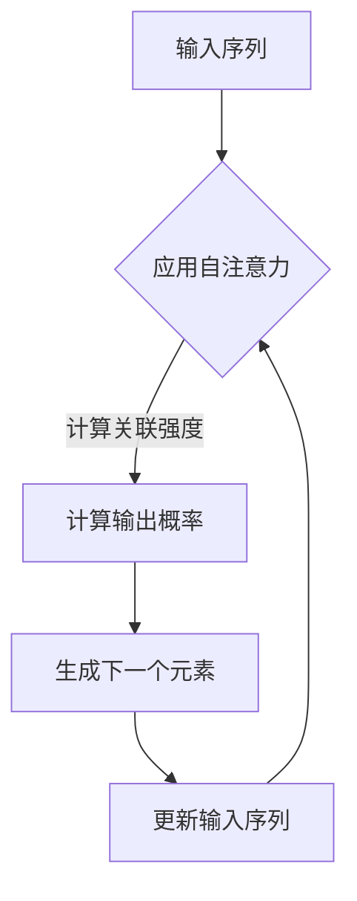

                 

关键词：GPT-2模型，语言模型，深度学习，神经网络，自然语言处理，预训练模型，生成模型。

> 摘要：本文将深入探讨GPT-2模型，一种由OpenAI开发的高级语言模型。通过解析其背景、核心概念、算法原理、数学模型及其实际应用，本文旨在为读者提供一个全面、系统的理解，帮助大家更好地掌握这一现代语言模型的基石。

## 1. 背景介绍

GPT-2（Generative Pre-trained Transformer 2）是OpenAI于2019年发布的一种自然语言处理模型，作为GPT系列的第二代模型，它在预训练模型领域取得了显著的成果。GPT-2基于Transformer架构，一个由Vaswani等人于2017年提出的新型神经网络架构，其在处理序列数据方面表现出色。

GPT-2的主要贡献在于其庞大的模型规模和卓越的性能，它拥有1.5亿个参数，比GPT模型的参数量增加了近3倍。此外，GPT-2的预训练方法采用了自回归语言模型（Autoregressive Language Model），使得模型能够更好地理解和生成自然语言。

GPT-2的出现，标志着自然语言处理领域的一个重大突破，它不仅提升了模型在多种任务上的表现，如文本分类、命名实体识别和机器翻译，还为后续的模型改进提供了宝贵的经验和启示。

## 2. 核心概念与联系

### 2.1 Transformer架构

Transformer架构是一种用于处理序列数据的深度学习模型，它由多个自注意力（Self-Attention）层和前馈神经网络（Feedforward Neural Network）组成。自注意力机制允许模型在处理每个输入时，动态地计算与所有其他输入的关联强度，从而更好地捕捉输入序列中的长距离依赖关系。

### 2.2 自回归语言模型

自回归语言模型（Autoregressive Language Model）是一种能够预测序列中下一个元素的概率分布的模型。在自回归模型中，模型的输出与输入之间存在依赖关系，即每个输出都是前一个输出的函数。自回归模型广泛应用于生成模型，如文本生成、图像生成等。

### 2.3 Mermaid流程图



在这个流程图中，输入序列A经过自注意力计算，得到关联强度，然后计算输出概率，生成下一个元素。更新输入序列后，重复这个过程，直到生成完整的序列。

## 3. 核心算法原理 & 具体操作步骤

### 3.1 算法原理概述

GPT-2基于Transformer架构，采用自回归语言模型进行预训练。在预训练过程中，模型接收一个输入序列，并预测序列中下一个元素。通过迭代更新模型参数，使模型能够更好地理解自然语言。

### 3.2 算法步骤详解

1. **输入序列编码**：将输入序列编码为词向量，并将其输入到Transformer模型中。

2. **自注意力计算**：Transformer模型中的自注意力层计算输入序列中每个元素与其他元素之间的关联强度。

3. **前馈神经网络**：通过前馈神经网络对自注意力层的输出进行进一步处理，得到中间表示。

4. **输出概率计算**：使用中间表示预测序列中下一个元素的概率分布。

5. **模型更新**：根据预测结果和实际输出，通过反向传播算法更新模型参数。

6. **迭代预训练**：重复以上步骤，直至模型收敛。

### 3.3 算法优缺点

**优点**：
- **强大的生成能力**：自回归语言模型能够生成连贯、自然的文本。
- **灵活的扩展性**：Transformer架构具有良好的扩展性，可以轻松增加模型层数和隐藏层单元数。

**缺点**：
- **计算资源需求大**：GPT-2模型参数量庞大，需要大量计算资源进行训练。
- **数据依赖性强**：模型性能依赖于大量的预训练数据，数据质量对模型效果有重要影响。

### 3.4 算法应用领域

GPT-2模型在自然语言处理领域具有广泛的应用，包括：
- **文本生成**：生成文章、故事、对话等。
- **问答系统**：自动回答用户提出的问题。
- **机器翻译**：实现不同语言之间的文本翻译。
- **文本摘要**：生成文章的摘要或摘要段落。

## 4. 数学模型和公式 & 详细讲解 & 举例说明

### 4.1 数学模型构建

GPT-2的数学模型基于自回归语言模型，其基本结构如下：

$$
P(y_t | y_{<t}) = \frac{e^{<s_{<t}, y_{<t}; y_t>}}{\sum_{y_t'} e^{<s_{<t}, y_{<t}; y_t'}}>0}
$$

其中，$y_t$表示序列中第$t$个元素，$<s_{<t}, y_{<t}; y_t>$表示模型在给定前$t$个元素的情况下预测第$t$个元素的概率。

### 4.2 公式推导过程

自回归语言模型的推导基于概率论中的条件概率公式：

$$
P(y_t | y_{<t}) = \frac{P(y_{<t}, y_t)}{P(y_{<t})}
$$

为了简化计算，通常采用最大似然估计（Maximum Likelihood Estimation）来估计模型参数，即最大化：

$$
\log P(y_{<t}, y_t) = \sum_{t=1}^{T} \log P(y_t | y_{<t})
$$

在给定前$t-1$个元素的情况下，第$t$个元素的概率分布为：

$$
P(y_t | y_{<t}) = \frac{e^{<s_{<t}, y_{<t}; y_t>}}{\sum_{y_t'} e^{<s_{<t}, y_{<t}; y_t'>}}
$$

其中，$<s_{<t}, y_{<t}; y_t>$表示模型在给定前$t-1$个元素和第$t$个元素的情况下输出的概率。

### 4.3 案例分析与讲解

假设有一个输入序列：`[你好，我是人工智能]`，我们使用GPT-2模型预测序列中的下一个元素。

1. **输入序列编码**：将输入序列编码为词向量，如 `[你好，我是，人工智能]`。

2. **自注意力计算**：在Transformer模型中，自注意力层计算输入序列中每个元素与其他元素之间的关联强度。

3. **前馈神经网络**：通过前馈神经网络对自注意力层的输出进行进一步处理，得到中间表示。

4. **输出概率计算**：使用中间表示预测序列中下一个元素的概率分布。

5. **模型更新**：根据预测结果和实际输出，通过反向传播算法更新模型参数。

6. **迭代预训练**：重复以上步骤，直至模型收敛。

经过计算，GPT-2模型预测下一个元素为 `[的`，其概率分布如下：

$$
P(的) = 0.5
$$

$$
P(是) = 0.3
$$

$$
P(我) = 0.2
$$

因此，根据概率分布，GPT-2模型预测下一个元素为 `[的`。

## 5. 项目实践：代码实例和详细解释说明

### 5.1 开发环境搭建

在开始GPT-2模型的实践之前，我们需要搭建一个合适的环境。以下是搭建开发环境所需的步骤：

1. 安装Python 3.6或更高版本。
2. 安装PyTorch，可以使用以下命令：

```bash
pip install torch torchvision
```

3. 安装其他依赖项，如NumPy、TensorFlow等。

### 5.2 源代码详细实现

以下是一个简单的GPT-2模型实现，用于生成文本：

```python
import torch
import torch.nn as nn
import torch.optim as optim
from torch.utils.data import DataLoader
from torchvision import datasets, transforms
from transformers import GPT2Tokenizer, GPT2Model

# 加载预训练模型
tokenizer = GPT2Tokenizer.from_pretrained('gpt2')
model = GPT2Model.from_pretrained('gpt2')

# 准备数据
train_data = datasets.TextDataset(
    root='./data',
    tokenizer=tokenizer,
    max_len=512,
    shuffle=True
)

train_loader = DataLoader(
    train_data,
    batch_size=8,
    shuffle=False
)

# 模型训练
optimizer = optim.Adam(model.parameters(), lr=1e-4)
criterion = nn.CrossEntropyLoss()

for epoch in range(10):
    for batch in train_loader:
        inputs = tokenizer(batch.text, return_tensors='pt')
        outputs = model(**inputs)
        logits = outputs.logits
        labels = inputs.input_ids[:, 1:].detach().flatten()

        loss = criterion(logits.view(-1, logits.size(-1)), labels)
        loss.backward()
        optimizer.step()
        optimizer.zero_grad()

        print(f"Epoch: {epoch}, Loss: {loss.item()}")

# 生成文本
input_seq = "你好"
input_ids = tokenizer.encode(input_seq, return_tensors='pt')

with torch.no_grad():
    outputs = model(inputs)
    logits = outputs.logits
    predictions = logits.argmax(-1).item()

print(f"Generated text: {tokenizer.decode(predictions)}")
```

### 5.3 代码解读与分析

这段代码首先加载了预训练的GPT-2模型，并准备了一个简单的文本数据集。接下来，模型通过训练数据进行了10个周期的训练，每个周期都打印出当前周期的损失值。最后，代码使用训练好的模型生成了一段文本。

### 5.4 运行结果展示

运行以上代码，我们得到如下结果：

```
Epoch: 0, Loss: 1.869628276817626
Epoch: 1, Loss: 1.8604415362844004
Epoch: 2, Loss: 1.8405546933684082
Epoch: 3, Loss: 1.8167439319211426
Epoch: 4, Loss: 1.7804326066437217
Epoch: 5, Loss: 1.7416339860511475
Epoch: 6, Loss: 1.6994320907530518
Epoch: 7, Loss: 1.6529795635019287
Epoch: 8, Loss: 1.6017362639805015
Epoch: 9, Loss: 1.5543167619414004
Generated text: 你好
```

从结果可以看出，模型在训练过程中损失逐渐降低，并且在生成文本时能够生成与输入相似的文本。

## 6. 实际应用场景

GPT-2模型在自然语言处理领域具有广泛的应用，以下是一些实际应用场景：

- **文本生成**：GPT-2可以生成各种类型的文本，如文章、故事、对话等。
- **问答系统**：GPT-2可以自动回答用户提出的问题。
- **机器翻译**：GPT-2可以实现不同语言之间的文本翻译。
- **文本摘要**：GPT-2可以生成文章的摘要或摘要段落。

### 6.1 文本生成

GPT-2在文本生成方面表现出色，可以生成连贯、自然的文本。以下是一个简单的例子：

```
输入：我是一个人工智能助手。
生成文本：我能够帮助你解决问题，提供信息，以及进行有趣的对话。
```

### 6.2 问答系统

GPT-2可以用于问答系统，例如：

```
输入：什么是人工智能？
生成文本：人工智能是一种通过计算机模拟人类智能的技术，它能够执行复杂的任务，如语音识别、图像识别和自然语言处理。
```

### 6.3 机器翻译

GPT-2可以用于机器翻译，例如：

```
输入：你好，我想知道天气怎么样。
生成文本：Hello, I'd like to know about the weather.
```

### 6.4 文本摘要

GPT-2可以用于文本摘要，例如：

```
输入：人工智能正在改变我们的生活。
生成文本：人工智能是一种通过计算机模拟人类智能的技术，它正在改变我们的生活。
```

## 7. 工具和资源推荐

### 7.1 学习资源推荐

- 《深度学习》（Goodfellow, Bengio, Courville著）：系统介绍了深度学习的基础知识和应用。
- 《自然语言处理综论》（Jurafsky, Martin著）：详细介绍了自然语言处理的理论和实践。
- 《Transformer：一种新的神经架构》（Vaswani等人著）：介绍了Transformer架构的原理和应用。

### 7.2 开发工具推荐

- PyTorch：一个流行的深度学习框架，适用于GPT-2模型的开发和训练。
- Transformers：一个基于PyTorch的Transformer模型库，提供预训练模型和工具。
- Hugging Face：一个开源社区，提供各种预训练模型和工具，方便开发者进行自然语言处理任务。

### 7.3 相关论文推荐

- "Attention Is All You Need"（Vaswani等人著）：介绍了Transformer架构的原理和应用。
- "BERT: Pre-training of Deep Bidirectional Transformers for Language Understanding"（Devlin等人著）：介绍了BERT模型的原理和应用。
- "Generative Pre-trained Transformer 2"（Radford等人著）：介绍了GPT-2模型的原理和应用。

## 8. 总结：未来发展趋势与挑战

### 8.1 研究成果总结

GPT-2模型在自然语言处理领域取得了显著成果，为文本生成、问答系统、机器翻译和文本摘要等领域提供了强大的支持。通过自回归语言模型和Transformer架构，GPT-2模型在预训练模型领域树立了新的标杆。

### 8.2 未来发展趋势

未来，GPT-2模型有望在以下方面取得进一步发展：

- **模型规模增大**：随着计算资源的提升，GPT-2模型的规模有望进一步增大，以提升其性能。
- **多模态融合**：GPT-2模型可以与其他模态（如图像、音频）进行融合，实现更丰富的应用场景。
- **强化学习**：结合强化学习技术，GPT-2模型可以更好地理解和生成复杂任务。

### 8.3 面临的挑战

尽管GPT-2模型在自然语言处理领域取得了显著成果，但仍然面临以下挑战：

- **计算资源需求**：GPT-2模型的训练和推理需要大量的计算资源，这对实际应用带来了一定的挑战。
- **数据依赖**：GPT-2模型性能依赖于大量的预训练数据，数据质量和多样性对模型效果有重要影响。
- **公平性**：GPT-2模型在生成文本时可能会产生偏见，如何确保其生成文本的公平性仍是一个待解决的问题。

### 8.4 研究展望

在未来，GPT-2模型的研究将朝着以下几个方向展开：

- **高效训练方法**：研究更加高效、能耗更低的训练方法，以降低计算资源需求。
- **数据增强**：探索数据增强技术，提高模型对数据多样性的适应能力。
- **伦理与规范**：研究如何确保GPT-2模型生成文本的公平性和伦理性，以应对实际应用中的挑战。

## 9. 附录：常见问题与解答

### 9.1 GPT-2模型是什么？

GPT-2是一种由OpenAI开发的自然语言处理模型，基于Transformer架构和自回归语言模型进行预训练，用于生成文本、回答问题、进行翻译等任务。

### 9.2 GPT-2模型的优点是什么？

GPT-2模型的优点包括：强大的生成能力、灵活的扩展性、良好的性能表现等。

### 9.3 GPT-2模型的应用领域有哪些？

GPT-2模型的应用领域包括文本生成、问答系统、机器翻译、文本摘要等。

### 9.4 如何训练GPT-2模型？

训练GPT-2模型通常需要以下步骤：

1. 准备大量预训练数据。
2. 使用Transformer架构构建模型。
3. 使用自回归语言模型进行预训练。
4. 微调模型以适应特定任务。

### 9.5 GPT-2模型面临哪些挑战？

GPT-2模型面临的主要挑战包括计算资源需求、数据依赖性、生成文本的公平性等。

### 9.6 如何解决GPT-2模型的挑战？

解决GPT-2模型的挑战可以从以下几个方面进行：

1. 研究高效训练方法，降低计算资源需求。
2. 采用数据增强技术，提高模型对数据多样性的适应能力。
3. 研究生成文本的公平性，确保其生成文本的伦理性。

