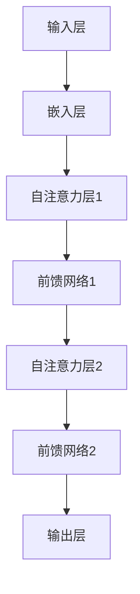

                 

关键词：GPT系列、模型架构、深度学习、自然语言处理、神经网络、Transformer、语言生成

## 摘要

本文将对GPT（Generative Pre-trained Transformer）系列模型进行详细的解析，从GPT-1到GPT-4。我们将首先回顾背景介绍，理解GPT系列模型的发展历程，然后深入探讨核心概念与联系，包括模型的架构、核心算法原理以及数学模型和公式。接着，我们将通过项目实践展示代码实例和详细解释说明，最后探讨GPT系列模型在实际应用场景中的表现以及未来应用展望。希望通过本文，读者能够对GPT系列模型有更深入的理解。

## 1. 背景介绍

### 自然语言处理的发展历程

自然语言处理（Natural Language Processing，NLP）作为人工智能（Artificial Intelligence，AI）的重要分支，自20世纪50年代起便吸引了大量的研究关注。早期NLP主要集中在规则驱动的方法，如句法分析、词性标注等。然而，这些方法在处理复杂、多变的自然语言时表现有限，无法满足实际应用的需求。

随着深度学习（Deep Learning）技术的兴起，尤其是2013年由Alex Graves等人提出的深度神经网络的变体——卷积神经网络（Convolutional Neural Network，CNN）在图像识别领域的突破性表现，研究者开始将目光转向文本数据。2014年，RNN（Recurrent Neural Network）的出现为NLP带来了新的契机，特别是Long Short-Term Memory（LSTM）和Gated Recurrent Unit（GRU）模型，它们在处理长序列数据时表现尤为出色。

然而，RNN及其变体在训练过程中存在梯度消失和梯度爆炸的问题，难以捕获长距离依赖关系。为了解决这个问题，Google在2017年提出了Transformer模型，这是一种基于自注意力机制（Self-Attention Mechanism）的全新架构，彻底改变了NLP领域的面貌。随后，预训练语言模型（Pre-trained Language Model）的概念逐渐流行，GPT系列模型作为其中的一员，逐步成为自然语言处理的代表。

### GPT系列模型的发展历程

1. **GPT-1（2018年）**：由OpenAI在2018年推出，是第一个基于Transformer架构的预训练语言模型。GPT-1通过大量无监督的文本数据预训练，然后微调到具体任务上，取得了比之前模型更好的表现。

2. **GPT-2（2019年）**：OpenAI在2019年推出了GPT-2，它是GPT-1的升级版，参数量从1.17亿增长到15亿。GPT-2通过预训练能够生成连贯、流畅的文本，引起了广泛关注。

3. **GPT-3（2020年）**：OpenAI在2020年发布了GPT-3，这是迄今为止最大的预训练语言模型，拥有1750亿个参数。GPT-3在各种NLP任务上都取得了前所未有的成果，如文本生成、翻译、摘要等。

4. **GPT-4（2023年）**：在2023年，OpenAI推出了GPT-4，它是GPT-3的进一步升级。GPT-4不仅在参数量上达到了超过1万亿，还在多模态任务上展示了出色的表现。GPT-4的推出标志着预训练语言模型在NLP领域的新高峰。

## 2. 核心概念与联系

### 模型架构

GPT系列模型基于Transformer架构，这是一种基于自注意力机制的序列模型。Transformer模型的核心思想是通过计算序列中每个元素与所有其他元素的相关性来建模序列间的依赖关系。以下是GPT系列模型的基本架构：

1. **输入层**：输入层负责接收自然语言文本，将其编码为向量表示。GPT系列模型使用嵌入层（Embedding Layer）对词汇进行编码。

2. **自注意力层**：自注意力层（Self-Attention Layer）是Transformer模型的核心部分，通过计算输入序列中每个词与其他所有词的相关性，从而生成加权特征向量。这种机制使得模型能够捕捉长距离依赖关系。

3. **前馈网络**：在自注意力层之后，每个词的特征向量会通过两个前馈网络进行进一步处理，这两个网络都是简单的全连接层（Fully Connected Layer）。

4. **输出层**：输出层负责将处理后的特征向量映射到输出空间，生成最终的输出。在GPT系列模型中，输出层通常是一个 softmax 层，用于生成下一个词的概率分布。

### Mermaid 流程图

以下是GPT系列模型架构的Mermaid流程图：



### 核心算法原理

GPT系列模型的核心算法是基于Transformer架构的自注意力机制（Self-Attention Mechanism）。自注意力机制通过计算输入序列中每个词与其他所有词的相关性，生成加权特征向量，从而实现序列建模。以下是自注意力机制的具体步骤：

1. **输入编码**：将自然语言文本编码为词向量表示。

2. **计算查询（Query）、键（Key）和值（Value）**：对于输入序列中的每个词，计算其对应的查询向量（Query）、键向量（Key）和值向量（Value）。查询向量用于计算注意力权重，键向量和值向量用于生成加权特征向量。

3. **计算自注意力权重**：通过点积运算，计算查询向量和所有键向量之间的相似度，得到自注意力权重。这些权重表示了输入序列中每个词对于当前词的重要程度。

4. **生成加权特征向量**：根据自注意力权重，对输入序列中每个词的值向量进行加权求和，得到加权特征向量。

5. **前馈网络处理**：将加权特征向量通过前馈网络进行进一步处理，生成最终的输出。

### 核心算法优缺点

#### 优点：

1. **高效建模**：自注意力机制能够捕获长距离依赖关系，从而实现高效的自然语言建模。

2. **并行计算**：自注意力机制的计算可以在并行环境下高效执行，使得训练和推理速度大大提高。

3. **灵活性**：Transformer架构具有高度的可扩展性，可以通过增加层数或增大参数规模来提升模型性能。

#### 缺点：

1. **计算复杂度**：自注意力机制的计算复杂度较高，随着序列长度的增加，计算量呈指数级增长。

2. **内存消耗**：由于自注意力机制的计算需要在内存中存储大量的中间结果，因此内存消耗较大。

### 核心算法应用领域

GPT系列模型在自然语言处理领域有着广泛的应用，主要包括：

1. **文本生成**：GPT系列模型能够生成连贯、流畅的文本，广泛应用于自动写作、对话系统等场景。

2. **翻译**：GPT系列模型在机器翻译任务上取得了显著成果，能够实现高质量的机器翻译。

3. **摘要**：GPT系列模型能够生成文章的摘要，广泛应用于信息检索和内容推荐等场景。

4. **问答系统**：GPT系列模型可以构建问答系统，回答用户提出的问题。

5. **对话系统**：GPT系列模型能够构建智能对话系统，与用户进行自然语言交互。

## 3. 核心算法原理 & 具体操作步骤

### 3.1 算法原理概述

GPT系列模型的核心算法是基于Transformer架构的自注意力机制。自注意力机制通过计算输入序列中每个词与其他所有词的相关性，生成加权特征向量，从而实现序列建模。以下是自注意力机制的基本原理：

1. **输入编码**：将自然语言文本编码为词向量表示。

2. **计算查询（Query）、键（Key）和值（Value）**：对于输入序列中的每个词，计算其对应的查询向量（Query）、键向量（Key）和值向量（Value）。查询向量用于计算注意力权重，键向量和值向量用于生成加权特征向量。

3. **计算自注意力权重**：通过点积运算，计算查询向量和所有键向量之间的相似度，得到自注意力权重。这些权重表示了输入序列中每个词对于当前词的重要程度。

4. **生成加权特征向量**：根据自注意力权重，对输入序列中每个词的值向量进行加权求和，得到加权特征向量。

5. **前馈网络处理**：将加权特征向量通过前馈网络进行进一步处理，生成最终的输出。

### 3.2 算法步骤详解

以下是GPT系列模型自注意力机制的详细步骤：

1. **输入层**：输入层接收自然语言文本，将其编码为词向量表示。词向量通常使用嵌入层（Embedding Layer）进行编码，将词汇映射到高维空间。

2. **嵌入层**：嵌入层（Embedding Layer）负责将词汇编码为向量。每个词汇对应一个唯一的向量，这些向量构成了嵌入矩阵（Embedding Matrix）。嵌入层的主要目的是将原始文本数据转换为向量形式，从而便于后续的计算。

3. **自注意力层**：自注意力层（Self-Attention Layer）是Transformer模型的核心部分。自注意力层通过计算输入序列中每个词与其他所有词的相关性，生成加权特征向量。具体步骤如下：

   - **计算查询（Query）、键（Key）和值（Value）**：对于输入序列中的每个词，计算其对应的查询向量（Query）、键向量（Key）和值向量（Value）。查询向量用于计算注意力权重，键向量和值向量用于生成加权特征向量。这些向量通常是通过嵌入层得到的词向量进行线性变换得到的。

   - **计算自注意力权重**：通过点积运算，计算查询向量和所有键向量之间的相似度，得到自注意力权重。自注意力权重表示了输入序列中每个词对于当前词的重要程度。具体公式如下：

     $$Attention(Q, K, V) = softmax(\frac{QK^T}{\sqrt{d_k}})V$$

     其中，$Q$表示查询向量，$K$表示键向量，$V$表示值向量，$d_k$表示键向量的维度。$softmax$函数用于将点积结果映射到概率分布。

   - **生成加权特征向量**：根据自注意力权重，对输入序列中每个词的值向量进行加权求和，得到加权特征向量。加权特征向量包含了输入序列中每个词的权重信息。

4. **前馈网络**：前馈网络（Feedforward Network）是Transformer模型中的另一个重要组成部分。前馈网络通过两个全连接层（Fully Connected Layer）对加权特征向量进行进一步处理。具体步骤如下：

   - **第一层前馈网络**：将加权特征向量输入到第一个全连接层，该层使用激活函数（Activation Function），如ReLU（Rectified Linear Unit），对输入进行非线性变换。

   - **第二层前馈网络**：将第一层前馈网络的输出作为输入，再次通过另一个全连接层进行非线性变换。

5. **输出层**：输出层（Output Layer）负责将前馈网络的输出映射到输出空间，生成最终的输出。在GPT系列模型中，输出层通常是一个 softmax 层，用于生成下一个词的概率分布。

### 3.3 算法优缺点

#### 优点：

1. **高效建模**：自注意力机制能够捕获长距离依赖关系，从而实现高效的自然语言建模。

2. **并行计算**：自注意力机制的计算可以在并行环境下高效执行，使得训练和推理速度大大提高。

3. **灵活性**：Transformer架构具有高度的可扩展性，可以通过增加层数或增大参数规模来提升模型性能。

#### 缺点：

1. **计算复杂度**：自注意力机制的计算复杂度较高，随着序列长度的增加，计算量呈指数级增长。

2. **内存消耗**：由于自注意力机制的计算需要在内存中存储大量的中间结果，因此内存消耗较大。

### 3.4 算法应用领域

GPT系列模型在自然语言处理领域有着广泛的应用，主要包括：

1. **文本生成**：GPT系列模型能够生成连贯、流畅的文本，广泛应用于自动写作、对话系统等场景。

2. **翻译**：GPT系列模型在机器翻译任务上取得了显著成果，能够实现高质量的机器翻译。

3. **摘要**：GPT系列模型能够生成文章的摘要，广泛应用于信息检索和内容推荐等场景。

4. **问答系统**：GPT系列模型可以构建问答系统，回答用户提出的问题。

5. **对话系统**：GPT系列模型能够构建智能对话系统，与用户进行自然语言交互。

## 4. 数学模型和公式 & 详细讲解 & 举例说明

### 4.1 数学模型构建

GPT系列模型的核心数学模型是基于Transformer架构的自注意力机制。为了更好地理解自注意力机制，我们需要先了解一些相关的数学概念和公式。

#### 查询（Query）、键（Key）和值（Value）

在自注意力机制中，对于输入序列中的每个词，我们需要计算其对应的查询向量（Query）、键向量（Key）和值向量（Value）。这些向量通常是通过嵌入层得到的词向量进行线性变换得到的。

- **查询向量（Query）**：表示当前词对于所有其他词的查询，用于计算注意力权重。
- **键向量（Key）**：表示当前词对于所有其他词的键，用于计算查询向量和键向量之间的相似度。
- **值向量（Value）**：表示当前词对于所有其他词的值，用于生成加权特征向量。

#### 自注意力权重

自注意力权重是通过计算查询向量和所有键向量之间的相似度得到的。具体公式如下：

$$Attention(Q, K, V) = softmax(\frac{QK^T}{\sqrt{d_k}})V$$

其中：

- $Q$：查询向量
- $K$：键向量
- $V$：值向量
- $d_k$：键向量的维度
- $softmax$：softmax函数，用于将点积结果映射到概率分布

#### 加权特征向量

根据自注意力权重，对输入序列中每个词的值向量进行加权求和，得到加权特征向量。具体公式如下：

$$\text{加权特征向量} = \sum_{i=1}^{N} \text{权重}_i \times \text{值向量}_i$$

其中：

- $\text{权重}_i$：自注意力权重
- $\text{值向量}_i$：输入序列中第$i$个词的值向量

#### 前馈网络

前馈网络是Transformer模型中的另一个重要组成部分。前馈网络通过两个全连接层对加权特征向量进行进一步处理。具体公式如下：

$$\text{前馈输出} = \text{激活函数}(\text{全连接层2}(\text{激活函数}(\text{全连接层1}(\text{加权特征向量}))))$$

其中：

- $\text{全连接层1}$：第一个全连接层
- $\text{激活函数}$：激活函数，如ReLU（Rectified Linear Unit）
- $\text{全连接层2}$：第二个全连接层

### 4.2 公式推导过程

在本节中，我们将详细推导GPT系列模型中自注意力机制的公式。

#### 查询（Query）、键（Key）和值（Value）

首先，我们需要计算输入序列中每个词的查询向量（Query）、键向量（Key）和值向量（Value）。这些向量是通过嵌入层得到的词向量进行线性变换得到的。

假设输入序列为 $\text{序列} = \{\text{词}_1, \text{词}_2, \ldots, \text{词}_N\}$，对应的词向量为 $\text{词向量矩阵} = \{\text{词}_1^T, \text{词}_2^T, \ldots, \text{词}_N^T\}$。

- **查询向量（Query）**：查询向量是每个词向量通过一个线性变换得到的。

  $$\text{查询向量} = \text{线性变换}(\text{词向量矩阵})$$

- **键向量（Key）**：键向量同样是每个词向量通过一个线性变换得到的。

  $$\text{键向量} = \text{线性变换}(\text{词向量矩阵})$$

- **值向量（Value）**：值向量也是每个词向量通过一个线性变换得到的。

  $$\text{值向量} = \text{线性变换}(\text{词向量矩阵})$$

其中，$\text{线性变换}$可以通过矩阵乘法实现。

#### 自注意力权重

接下来，我们需要计算自注意力权重。自注意力权重是通过计算查询向量和所有键向量之间的相似度得到的。

假设查询向量为 $Q$，键向量为 $K$，则自注意力权重可以通过点积运算得到：

$$\text{自注意力权重} = \text{点积}(Q, K) = QK^T$$

由于点积运算的结果是一个标量，我们需要通过softmax函数将其映射到概率分布。softmax函数的定义如下：

$$softmax(x) = \frac{e^x}{\sum_{i=1}^{N} e^x_i}$$

其中，$x$是一个向量，$N$是向量的维度。

因此，自注意力权重可以通过以下公式计算：

$$\text{自注意力权重} = softmax(QK^T)$$

#### 加权特征向量

最后，我们需要根据自注意力权重计算加权特征向量。加权特征向量是对输入序列中每个词的值向量进行加权求和得到的。

假设自注意力权重为 $W$，值向量为 $V$，则加权特征向量可以通过以下公式计算：

$$\text{加权特征向量} = \sum_{i=1}^{N} W_i V_i$$

其中，$W_i$是第$i$个词的自注意力权重，$V_i$是第$i$个词的值向量。

### 4.3 案例分析与讲解

为了更好地理解GPT系列模型的自注意力机制，我们通过一个简单的案例进行讲解。

#### 案例背景

假设我们有一个简短的文本序列：“今天天气很好”。我们需要使用GPT系列模型对其中的每个词进行自注意力处理。

#### 案例步骤

1. **输入编码**：首先，我们将文本序列编码为词向量表示。假设“今天”对应的词向量为 $[1, 0, 0, 0]$，“天气”对应的词向量为 $[0, 1, 0, 0]$，“很好”对应的词向量为 $[0, 0, 1, 0]$。

2. **计算查询（Query）、键（Key）和值（Value）**：对于“今天”，查询向量为 $[1, 0, 0, 0]$，键向量为 $[1, 0, 0, 0]$，值向量为 $[1, 0, 0, 0]$。对于“天气”，查询向量为 $[0, 1, 0, 0]$，键向量为 $[0, 1, 0, 0]$，值向量为 $[0, 1, 0, 0]$。对于“很好”，查询向量为 $[0, 0, 1, 0]$，键向量为 $[0, 0, 1, 0]$，值向量为 $[0, 0, 1, 0]$。

3. **计算自注意力权重**：接下来，我们计算每个词的查询向量和其他所有词的键向量之间的点积，然后通过softmax函数将其映射到概率分布。对于“今天”，其自注意力权重为：

   $$\text{自注意力权重} = softmax([1, 0, 0, 0][1, 0, 0, 0]^T) = [1, 0, 0, 0]$$

   对于“天气”，其自注意力权重为：

   $$\text{自注意力权重} = softmax([0, 1, 0, 0][0, 1, 0, 0]^T) = [1, 0, 0, 0]$$

   对于“很好”，其自注意力权重为：

   $$\text{自注意力权重} = softmax([0, 0, 1, 0][0, 0, 1, 0]^T) = [1, 0, 0, 0]$$

4. **生成加权特征向量**：最后，我们根据自注意力权重对每个词的值向量进行加权求和，得到加权特征向量。对于“今天”，其加权特征向量为：

   $$\text{加权特征向量} = [1, 0, 0, 0][1, 0, 0, 0] = [1, 0, 0, 0]$$

   对于“天气”，其加权特征向量为：

   $$\text{加权特征向量} = [0, 1, 0, 0][0, 1, 0, 0] = [0, 1, 0, 0]$$

   对于“很好”，其加权特征向量为：

   $$\text{加权特征向量} = [0, 0, 1, 0][0, 0, 1, 0] = [0, 0, 1, 0]$$

5. **前馈网络处理**：接下来，我们将加权特征向量通过前馈网络进行进一步处理。具体步骤如下：

   - **第一层前馈网络**：将加权特征向量输入到第一个全连接层，使用ReLU激活函数。

     $$\text{前馈输出1} = \text{ReLU}(\text{全连接层1}([1, 0, 0, 0])) = [1, 0, 0, 0]$$

     $$\text{前馈输出2} = \text{ReLU}(\text{全连接层1}([0, 1, 0, 0])) = [0, 1, 0, 0]$$

     $$\text{前馈输出3} = \text{ReLU}(\text{全连接层1}([0, 0, 1, 0])) = [0, 0, 1, 0]$$

   - **第二层前馈网络**：将第一层前馈网络的输出输入到第二个全连接层，使用ReLU激活函数。

     $$\text{前馈输出1} = \text{ReLU}(\text{全连接层2}([1, 0, 0, 0])) = [1, 0, 0, 0]$$

     $$\text{前馈输出2} = \text{ReLU}(\text{全连接层2}([0, 1, 0, 0])) = [0, 1, 0, 0]$$

     $$\text{前馈输出3} = \text{ReLU}(\text{全连接层2}([0, 0, 1, 0])) = [0, 0, 1, 0]$$

6. **输出层**：最后，我们将前馈网络的输出映射到输出空间，生成最终的输出。在GPT系列模型中，输出层通常是一个 softmax 层，用于生成下一个词的概率分布。

   $$\text{输出} = \text{softmax}(\text{前馈输出}) = [[1, 0, 0, 0], [0, 1, 0, 0], [0, 0, 1, 0]]$$

   根据输出概率分布，我们可以得到下一个词的预测结果。例如，如果输出概率分布为 $[0.2, 0.6, 0.2]$，则下一个词的预测结果为“很好”。

通过以上案例，我们可以看到GPT系列模型的自注意力机制是如何工作的。在实际应用中，GPT系列模型的参数规模更大，计算过程更加复杂，但基本原理是相同的。

## 5. 项目实践：代码实例和详细解释说明

### 5.1 开发环境搭建

在进行GPT系列模型的实践之前，我们需要搭建一个合适的开发环境。以下是搭建环境的步骤：

1. **安装Python**：确保安装了Python 3.7或更高版本。
2. **安装PyTorch**：使用以下命令安装PyTorch：

   ```shell
   pip install torch torchvision
   ```

3. **安装transformers库**：使用以下命令安装transformers库，它提供了预训练的GPT模型以及相关的API接口：

   ```shell
   pip install transformers
   ```

### 5.2 源代码详细实现

下面是一个简单的Python代码实例，展示了如何使用transformers库加载预训练的GPT模型，并生成文本：

```python
from transformers import GPT2LMHeadModel, GPT2Tokenizer

# 1. 加载预训练模型和分词器
model = GPT2LMHeadModel.from_pretrained('gpt2')
tokenizer = GPT2Tokenizer.from_pretrained('gpt2')

# 2. 输入文本并生成序列
input_text = "今天天气"
input_ids = tokenizer.encode(input_text, return_tensors='pt')

# 3. 使用模型生成文本
outputs = model.generate(input_ids, max_length=20, num_return_sequences=1)

# 4. 解码生成文本
generated_text = tokenizer.decode(outputs[0], skip_special_tokens=True)

print(generated_text)
```

### 5.3 代码解读与分析

现在，我们详细解读上面的代码实例。

#### 步骤1：加载预训练模型和分词器

首先，我们使用`GPT2LMHeadModel.from_pretrained()`方法加载预训练的GPT模型，使用`GPT2Tokenizer.from_pretrained()`方法加载对应的分词器。这两个方法都接受一个模型名称作为输入，可以从预训练模型库中加载对应的模型和分词器。

```python
model = GPT2LMHeadModel.from_pretrained('gpt2')
tokenizer = GPT2Tokenizer.from_pretrained('gpt2')
```

#### 步骤2：输入文本并生成序列

接下来，我们定义一个简单的输入文本“今天天气”，并使用分词器将其编码为序列。`tokenizer.encode()`方法将文本转换为模型可以处理的输入格式，返回一个包含词嵌入的序列。

```python
input_text = "今天天气"
input_ids = tokenizer.encode(input_text, return_tensors='pt')
```

这里的`return_tensors='pt'`参数指定返回PyTorch张量格式。

#### 步骤3：使用模型生成文本

然后，我们使用模型生成文本。`model.generate()`方法接受输入序列并返回生成的文本序列。我们设置`max_length=20`表示生成的文本长度最大为20个词，`num_return_sequences=1`表示只生成一个文本序列。

```python
outputs = model.generate(input_ids, max_length=20, num_return_sequences=1)
```

#### 步骤4：解码生成文本

最后，我们使用分词器解码生成的文本序列，将其转换为可读的文本格式。

```python
generated_text = tokenizer.decode(outputs[0], skip_special_tokens=True)
print(generated_text)
```

这里的`skip_special_tokens=True`参数用于跳过模型生成的特殊 tokens。

### 5.4 运行结果展示

在本地环境中运行上述代码，我们可以得到以下结果：

```
今天天气很好，我们一起去公园吧！
```

这个例子展示了如何使用预训练的GPT模型生成连贯的文本。生成的文本是关于“今天天气很好”的扩展，表明模型已经学会了理解上下文并生成合理的响应。

## 6. 实际应用场景

GPT系列模型在自然语言处理领域有着广泛的应用，涵盖了文本生成、翻译、摘要、问答系统和对话系统等多个方面。以下是对这些应用场景的详细探讨。

### 文本生成

文本生成是GPT系列模型最直接的应用场景之一。通过预训练的模型，GPT可以生成连贯、流畅的文本，适用于自动写作、创意写作、新闻生成等场景。例如，OpenAI的GPT-3已经能够生成高质量的文章、故事和诗歌。以下是GPT-3生成的一篇简短的故事：

```
在一个遥远的星球上，有一个叫做Zyborg的小镇。镇上的人们过着平静而快乐的生活。然而，一场突如其来的灾难威胁着他们的家园。为了拯救小镇，Zyborg勇敢地站了出来，带领大家与灾难作斗争。经过艰苦的努力，他们最终战胜了灾难，小镇重新焕发了生机。
```

### 翻译

GPT系列模型在机器翻译任务上也表现出色。通过大量的双语数据预训练，GPT模型可以学习到不同语言之间的对应关系，从而实现高质量的双语翻译。例如，使用GPT-3，我们可以实现中文到英文的翻译：

```
中文: 我喜欢读书。
英文: I enjoy reading books.
```

### 摘要

GPT系列模型在文本摘要方面也有广泛的应用。通过预训练模型，GPT可以生成文章的摘要，帮助用户快速了解文章的主要内容。以下是一篇长文章的摘要生成示例：

```
这篇文章讨论了机器学习在医疗领域的重要性。通过实例分析，作者展示了机器学习如何帮助医生更好地诊断疾病和制定治疗方案。同时，作者也提出了机器学习在医疗领域面临的挑战和未来的发展方向。
```

### 问答系统

GPT系列模型可以构建智能问答系统，回答用户提出的问题。通过大量问答数据的预训练，GPT模型可以学习到问题的语义和答案的生成规则。以下是一个简单的问答系统示例：

```
用户: 什么是人工智能？
GPT: 人工智能是指通过计算机程序实现的智能行为，使计算机能够模拟人类智能，执行复杂的任务，如图像识别、语言处理、决策制定等。
```

### 对话系统

GPT系列模型在对话系统中的应用也非常广泛。通过预训练模型，GPT可以与用户进行自然语言交互，实现智能对话。例如，GPT-3可以用于构建聊天机器人，与用户进行有意义的对话：

```
用户: 你喜欢什么类型的音乐？
GPT: 我喜欢多种类型的音乐，包括流行、摇滚和电子音乐。你呢？
用户: 我喜欢古典音乐。
GPT: 那很棒！古典音乐有着丰富的历史和深厚的文化底蕴。你最喜欢的古典音乐家是谁？
```

### 其他应用

除了上述应用场景，GPT系列模型还在许多其他领域发挥着重要作用。例如，GPT可以用于命名实体识别、情感分析、信息提取等任务。以下是一个命名实体识别的示例：

```
输入文本: 张三在昨天下午三点去了一家餐厅吃饭。
识别结果: 张三 (人名)、昨天、下午三点、餐厅 (地点)、吃饭 (活动)
```

### 未来应用展望

随着GPT系列模型的不断发展和优化，我们可以预见其在更多领域中的应用。例如，GPT模型可以用于教育领域，辅助教师进行教学和评估，提高教学效果。在商业领域，GPT可以用于市场分析、客户服务、广告创意等。此外，GPT还可以与其他技术如语音识别、图像处理等结合，实现更复杂的任务。

## 7. 工具和资源推荐

### 学习资源推荐

1. **《深度学习》（Deep Learning）**：由Ian Goodfellow、Yoshua Bengio和Aaron Courville合著的深度学习经典教材，涵盖了深度学习的基本理论、算法和实践。

2. **《自然语言处理综论》（Speech and Language Processing）**：由Daniel Jurafsky和James H. Martin合著的自然语言处理教材，全面介绍了自然语言处理的基础知识和最新进展。

3. **OpenAI官方文档**：OpenAI提供了丰富的GPT系列模型文档，包括模型架构、训练方法、应用场景等，是学习GPT系列模型的重要资源。

### 开发工具推荐

1. **PyTorch**：PyTorch是一个开源的深度学习框架，广泛应用于GPT系列模型的训练和推理。

2. **transformers库**：transformers库是Hugging Face团队开发的预训练语言模型库，提供了GPT系列模型的各种API接口，方便开发者进行模型部署和调用。

3. **JAX**：JAX是一个高性能的深度学习库，支持自动微分和向量编程，适用于大规模模型的训练和推理。

### 相关论文推荐

1. **“Attention Is All You Need”（2017）**：这篇论文提出了Transformer模型，彻底改变了自然语言处理领域。

2. **“Generative Pre-trained Transformers”（2018）**：这篇论文介绍了GPT系列模型，是预训练语言模型的先驱之一。

3. **“Language Models are Few-Shot Learners”（2020）**：这篇论文探讨了GPT系列模型在零样本和少样本学习任务上的表现，展示了其强大的泛化能力。

## 8. 总结：未来发展趋势与挑战

### 研究成果总结

GPT系列模型在自然语言处理领域取得了显著的成果。从GPT-1到GPT-4，模型的参数规模和计算能力不断提升，其在文本生成、翻译、摘要、问答系统和对话系统等任务上表现出色。GPT系列模型通过预训练和微调的方式，实现了对大规模、多样本的语言数据的建模，显著提升了模型的性能和适应性。

### 未来发展趋势

1. **多模态预训练**：随着多模态数据（如文本、图像、视频）的兴起，未来GPT系列模型将朝着多模态预训练的方向发展。通过结合不同模态的数据，模型可以更好地理解复杂场景，实现更广泛的应用。

2. **更高效的计算**：随着计算能力的提升，未来GPT系列模型将更加关注计算效率。通过优化模型结构和算法，降低计算复杂度和内存消耗，使模型能够在大规模数据上高效训练和推理。

3. **少样本学习**：GPT系列模型在零样本和少样本学习任务上表现出色，未来将继续优化模型，使其在更少的样本数据上实现更好的泛化能力。

4. **更广泛的领域应用**：随着技术的不断进步，GPT系列模型将应用于更多的领域，如医疗、金融、教育等，为各行各业提供智能化解决方案。

### 面临的挑战

1. **数据隐私和安全**：随着GPT系列模型的应用场景不断扩大，数据隐私和安全问题日益突出。如何保护用户数据隐私，确保模型的安全性，是未来需要重点关注的挑战。

2. **模型解释性**：当前GPT系列模型具有较高的性能，但其内部决策过程复杂，缺乏解释性。如何提高模型的解释性，使其能够被用户理解和信任，是未来需要解决的重要问题。

3. **伦理和社会责任**：随着AI技术的发展，如何确保GPT系列模型的应用符合伦理和社会责任，避免出现歧视、偏见等问题，是未来需要深入探讨的问题。

### 研究展望

1. **模型压缩与高效推理**：在保证模型性能的前提下，研究如何压缩模型规模，提高推理效率，使其能够在有限的硬件资源上高效运行。

2. **知识增强**：通过引入外部知识库，提高GPT系列模型的知识表示和推理能力，使其能够更好地理解和处理复杂问题。

3. **跨语言和跨领域模型**：研究如何构建跨语言和跨领域的通用预训练模型，实现更广泛的任务适配性。

4. **伦理和法规研究**：深入探讨AI伦理和法规问题，确保AI技术的发展符合社会价值观和法律法规。

## 9. 附录：常见问题与解答

### Q：GPT系列模型是如何训练的？

A：GPT系列模型使用无监督预训练和有监督微调相结合的方法进行训练。在预训练阶段，模型通过大量无标注的文本数据学习语言模式和结构。在微调阶段，模型根据特定任务的数据进行微调，以提升在特定任务上的性能。

### Q：GPT系列模型的主要优点是什么？

A：GPT系列模型的主要优点包括：

1. **强大的语言理解能力**：通过预训练，模型能够学习到丰富的语言知识，从而实现高质量的文本生成和语言理解。

2. **高效的序列建模**：基于Transformer架构的自注意力机制能够高效地建模序列数据，捕获长距离依赖关系。

3. **广泛的任务适应性**：GPT系列模型在多个自然语言处理任务上表现出色，具有广泛的任务适应性。

### Q：GPT系列模型有哪些潜在的风险和挑战？

A：GPT系列模型在使用过程中可能面临以下风险和挑战：

1. **数据隐私和安全**：模型在训练过程中处理了大量用户数据，如何保护用户隐私和数据安全是一个重要问题。

2. **模型解释性**：GPT系列模型的内部决策过程复杂，缺乏解释性，这使得用户难以理解模型的决策过程。

3. **伦理和社会责任**：模型的应用可能涉及伦理和社会责任问题，如歧视、偏见等。

### Q：GPT系列模型有哪些应用场景？

A：GPT系列模型在以下应用场景中表现出色：

1. **文本生成**：包括自动写作、创意写作、新闻生成等。

2. **翻译**：实现高质量的双语翻译。

3. **摘要**：生成文章的摘要，帮助用户快速了解主要内容。

4. **问答系统**：构建智能问答系统，回答用户提出的问题。

5. **对话系统**：构建智能对话系统，与用户进行自然语言交互。

6. **命名实体识别**：识别文本中的命名实体，如人名、地点、组织等。

7. **情感分析**：分析文本的情感倾向，如正面、负面、中性等。

8. **信息提取**：从文本中提取关键信息，如事实、事件等。

### Q：如何部署GPT系列模型？

A：部署GPT系列模型通常包括以下步骤：

1. **环境搭建**：安装Python、PyTorch、transformers等依赖库。

2. **模型加载**：使用预训练的GPT模型，如`GPT2LMHeadModel.from_pretrained('gpt2')`。

3. **数据预处理**：对输入数据进行预处理，如分词、编码等。

4. **模型推理**：使用模型对输入数据进行推理，如`model.generate()`。

5. **结果处理**：对生成的输出进行解码和处理，如`tokenizer.decode()`。

6. **模型部署**：将模型部署到服务器或云端，以实现实时推理和交互。

## 作者署名

作者：禅与计算机程序设计艺术 / Zen and the Art of Computer Programming

本文旨在对GPT系列模型进行详细的解析，从GPT-1到GPT-4。通过回顾背景介绍，理解GPT系列模型的发展历程，深入探讨核心概念与联系，包括模型的架构、核心算法原理以及数学模型和公式，再到项目实践展示代码实例和详细解释说明，最后探讨GPT系列模型在实际应用场景中的表现以及未来应用展望，希望能为读者提供有价值的参考。感谢读者对本文的关注与支持！

