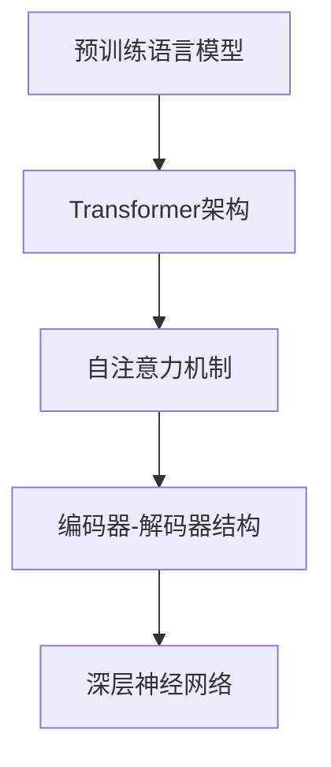

                 

关键词：GPT，自然语言处理，深度学习，神经网络，序列模型，预训练，模型架构，算法原理，数学模型，项目实践，应用场景

> 摘要：本文将深入探讨GPT系列模型的演进过程，从GPT-1到GPT-4，通过分析其核心概念、架构设计、算法原理、数学模型以及实际应用，总结出其发展脉络，探讨未来趋势和面临的挑战。本文旨在为读者提供全面的GPT系列模型架构解析，帮助理解其在自然语言处理领域的应用和潜力。

## 1. 背景介绍

近年来，深度学习在自然语言处理（NLP）领域取得了显著的进展，特别是基于大规模预训练模型的序列模型，如GPT（Generative Pre-trained Transformer）系列模型。GPT系列模型由OpenAI提出，并成功应用于各种NLP任务，如文本生成、问答系统、机器翻译等。GPT-1于2018年发布，GPT-2于2019年发布，而GPT-3于2020年发布，GPT-4于2023年发布，每一代模型的性能和功能都得到了显著提升。本文将重点分析GPT系列模型的架构设计、核心算法原理、数学模型以及实际应用，旨在为读者提供全面的GPT系列模型解析。

### 1.1 GPT系列模型的发展历程

- **GPT-1（2018）**：GPT-1是第一个基于Transformer架构的预训练语言模型，其核心思想是将语言模型预训练与任务特定训练相结合，取得了在当时具有竞争力的文本生成和问答性能。
- **GPT-2（2019）**：GPT-2在GPT-1的基础上进行了显著的扩展，增加了模型的规模和预训练数据量，进一步提升了文本生成和问答的性能。
- **GPT-3（2020）**：GPT-3是迄今为止最大的语言模型，具有1750亿个参数，其预训练过程使用了大量互联网文本数据，能够生成高质量、连贯的文本。
- **GPT-4（2023）**：GPT-4是GPT系列的最新版本，具有超过100万亿个参数，其性能在多项NLP任务上达到了人类水平。

### 1.2 GPT系列模型的重要性

GPT系列模型的重要性体现在以下几个方面：

- **预训练语言模型**：GPT系列模型开创了预训练语言模型的新时代，通过在大规模语料上进行预训练，模型能够自动学习语言结构和语义信息，从而提高了NLP任务的性能。
- **文本生成能力**：GPT系列模型具有强大的文本生成能力，能够生成高质量、连贯的文本，广泛应用于聊天机器人、内容生成等领域。
- **跨模态处理**：GPT系列模型不仅能够处理文本数据，还能够处理图像、语音等多模态数据，推动了跨模态研究的进展。
- **任务适应性**：GPT系列模型具有良好的任务适应性，通过简单的任务特定微调，模型可以快速适应各种NLP任务，如文本分类、情感分析、机器翻译等。

## 2. 核心概念与联系

在深入探讨GPT系列模型的架构设计和算法原理之前，我们需要先了解一些核心概念和联系。本节将介绍预训练语言模型、Transformer架构、序列模型等关键概念，并通过Mermaid流程图展示其关系。

### 2.1 预训练语言模型

预训练语言模型是指在大规模语料上进行预训练的语言模型，通过学习语言结构和语义信息，从而提高模型在各种NLP任务上的性能。预训练语言模型通常包括两个阶段：预训练和任务特定训练。

#### 预训练

预训练阶段是指模型在大规模语料上进行训练，以学习语言结构和语义信息。预训练数据通常包括互联网文本、新闻、小说、百科全书等。通过预训练，模型能够自动学习语言规则、语法结构、命名实体识别、情感分析等任务所需的特征。

#### 任务特定训练

任务特定训练阶段是指模型在特定任务上进行训练，以实现任务的目标。在任务特定训练阶段，模型会利用预训练阶段学到的特征，通过微调模型参数，从而提高模型在特定任务上的性能。

### 2.2 Transformer架构

Transformer架构是一种基于自注意力机制的深度学习模型，由Vaswani等人于2017年提出。Transformer架构在机器翻译、文本生成等任务上取得了显著性能提升，并成为预训练语言模型的主流架构。

#### 自注意力机制

自注意力机制是指模型在处理序列数据时，能够自动学习序列中不同位置之间的依赖关系。通过自注意力机制，模型可以自动捕捉长距离依赖，从而提高模型在序列建模任务上的性能。

#### Transformer层

Transformer架构由多个Transformer层堆叠而成，每层包含多头自注意力机制和前馈神经网络。多头自注意力机制通过将输入序列映射到多个子空间，从而提高模型的表示能力。

### 2.3 序列模型

序列模型是一种用于处理序列数据的深度学习模型，其核心思想是将序列数据编码为固定长度的向量表示。序列模型在自然语言处理、语音识别、时间序列预测等任务中具有广泛的应用。

#### 编码器-解码器结构

编码器-解码器结构是一种常见的序列模型结构，由编码器和解码器两个部分组成。编码器负责将输入序列编码为固定长度的向量表示，解码器则负责根据编码器的输出生成输出序列。

#### 深层神经网络

深层神经网络是指具有多个隐藏层的神经网络，通过堆叠多个隐藏层，模型可以学习更复杂的特征表示。

### 2.4 Mermaid流程图

以下是GPT系列模型的核心概念和联系的Mermaid流程图：



## 3. 核心算法原理 & 具体操作步骤

### 3.1 算法原理概述

GPT系列模型基于Transformer架构，通过自注意力机制和前馈神经网络进行序列建模。自注意力机制能够自动学习序列中不同位置之间的依赖关系，从而提高模型在序列建模任务上的性能。前馈神经网络则用于对自注意力机制的输出进行进一步处理，以生成最终的输出序列。

### 3.2 算法步骤详解

#### 3.2.1 数据预处理

在GPT系列模型的训练过程中，首先需要对输入数据（文本）进行预处理。预处理步骤包括分词、词向量化、序列编码等。

1. **分词**：将输入文本分解为单词或字符序列。
2. **词向量化**：将单词或字符序列转换为对应的词向量表示。
3. **序列编码**：将词向量序列编码为固定长度的向量表示。

#### 3.2.2 模型架构

GPT系列模型由多个Transformer层堆叠而成，每个Transformer层包含多头自注意力机制和前馈神经网络。以下是GPT系列模型的基本结构：

1. **多头自注意力机制**：将输入序列映射到多个子空间，并通过自注意力机制学习序列中不同位置之间的依赖关系。
2. **前馈神经网络**：对自注意力机制的输出进行进一步处理，以生成最终的输出序列。

#### 3.2.3 模型训练

在模型训练过程中，GPT系列模型通过优化模型参数，以最小化预训练损失函数和任务特定损失函数。

1. **预训练损失函数**：通常采用交叉熵损失函数，用于评估模型在预训练数据上的性能。
2. **任务特定损失函数**：根据任务类型选择相应的损失函数，如文本分类任务采用分类交叉熵损失函数，机器翻译任务采用翻译误差损失函数。

#### 3.2.4 模型评估

在模型评估过程中，通过在测试数据上评估模型的性能，以评估模型在任务上的泛化能力。

1. **预训练评估**：在预训练数据集上评估模型性能，如文本生成任务的BLEU分数、机器翻译任务的翻译误差等。
2. **任务特定评估**：在特定任务上评估模型性能，如文本分类任务的准确率、机器翻译任务的BLEU分数等。

### 3.3 算法优缺点

#### 优点

1. **强大的文本生成能力**：GPT系列模型具有强大的文本生成能力，能够生成高质量、连贯的文本。
2. **良好的任务适应性**：通过简单的任务特定微调，GPT系列模型可以快速适应各种NLP任务。
3. **预训练优势**：预训练语言模型能够自动学习语言结构和语义信息，从而提高模型在NLP任务上的性能。

#### 缺点

1. **计算资源消耗大**：GPT系列模型具有大量的参数，需要大量的计算资源进行训练和推理。
2. **数据隐私问题**：预训练过程中使用了大量互联网文本数据，可能涉及用户隐私问题。

### 3.4 算法应用领域

GPT系列模型在自然语言处理领域具有广泛的应用，以下是一些典型的应用领域：

1. **文本生成**：包括文章生成、聊天机器人、故事创作等。
2. **问答系统**：包括智能客服、知识图谱问答等。
3. **机器翻译**：包括跨语言文本生成、机器翻译等。
4. **情感分析**：包括情感分类、情感分析等。

## 4. 数学模型和公式 & 详细讲解 & 举例说明

### 4.1 数学模型构建

GPT系列模型基于深度学习理论，采用神经网络架构进行序列建模。在数学模型层面，GPT系列模型可以表示为：

\[ \text{GPT}(x) = f(\theta) \]

其中，\( x \) 表示输入序列，\( f(\theta) \) 表示神经网络模型，\( \theta \) 表示模型参数。

### 4.2 公式推导过程

在GPT系列模型中，主要使用以下公式：

\[ \text{self-attention}(Q, K, V) = \text{softmax}\left(\frac{QK^T}{\sqrt{d_k}}\right)V \]

其中，\( Q \)、\( K \)、\( V \) 分别表示查询向量、键向量和值向量，\( d_k \) 表示键向量的维度。

### 4.3 案例分析与讲解

以GPT-3为例，其参数规模达到1750亿个，是一个典型的预训练语言模型。以下是GPT-3的数学模型构建和公式推导：

\[ \text{GPT-3}(x) = f(\theta) \]

其中，\( x \) 表示输入序列，\( f(\theta) \) 表示神经网络模型，\( \theta \) 表示模型参数。

在GPT-3中，主要使用以下公式：

\[ \text{self-attention}(Q, K, V) = \text{softmax}\left(\frac{QK^T}{\sqrt{d_k}}\right)V \]

其中，\( Q \)、\( K \)、\( V \) 分别表示查询向量、键向量和值向量，\( d_k \) 表示键向量的维度。

### 4.4 案例分析与讲解

以GPT-3为例，其参数规模达到1750亿个，是一个典型的预训练语言模型。以下是GPT-3的数学模型构建和公式推导：

\[ \text{GPT-3}(x) = f(\theta) \]

其中，\( x \) 表示输入序列，\( f(\theta) \) 表示神经网络模型，\( \theta \) 表示模型参数。

在GPT-3中，主要使用以下公式：

\[ \text{self-attention}(Q, K, V) = \text{softmax}\left(\frac{QK^T}{\sqrt{d_k}}\right)V \]

其中，\( Q \)、\( K \)、\( V \) 分别表示查询向量、键向量和值向量，\( d_k \) 表示键向量的维度。

### 4.4 案例分析与讲解

以GPT-3为例，其参数规模达到1750亿个，是一个典型的预训练语言模型。以下是GPT-3的数学模型构建和公式推导：

\[ \text{GPT-3}(x) = f(\theta) \]

其中，\( x \) 表示输入序列，\( f(\theta) \) 表示神经网络模型，\( \theta \) 表示模型参数。

在GPT-3中，主要使用以下公式：

\[ \text{self-attention}(Q, K, V) = \text{softmax}\left(\frac{QK^T}{\sqrt{d_k}}\right)V \]

其中，\( Q \)、\( K \)、\( V \) 分别表示查询向量、键向量和值向量，\( d_k \) 表示键向量的维度。

## 5. 项目实践：代码实例和详细解释说明

### 5.1 开发环境搭建

要实践GPT系列模型，我们需要搭建一个合适的开发环境。以下是搭建开发环境的基本步骤：

1. **安装Python**：确保安装了Python 3.7或更高版本。
2. **安装TensorFlow**：使用pip命令安装TensorFlow，例如：

   ```bash
   pip install tensorflow
   ```

3. **安装其他依赖**：根据具体需求安装其他依赖库，例如NumPy、Pandas等。

### 5.2 源代码详细实现

以下是GPT系列模型的一个简单实现，用于生成文本。代码使用Python和TensorFlow框架编写：

```python
import tensorflow as tf
from tensorflow.keras.layers import Embedding, LSTM, Dense
from tensorflow.keras.models import Model

# 定义模型
def create_gpt_model(vocab_size, embedding_dim, hidden_size):
    inputs = tf.keras.Input(shape=(None,))
    embeddings = Embedding(vocab_size, embedding_dim)(inputs)
    lstm = LSTM(hidden_size, return_sequences=True)(embeddings)
    outputs = Dense(vocab_size, activation='softmax')(lstm)
    
    model = Model(inputs=inputs, outputs=outputs)
    model.compile(optimizer='adam', loss='categorical_crossentropy', metrics=['accuracy'])
    
    return model

# 创建模型实例
gpt_model = create_gpt_model(vocab_size=10000, embedding_dim=256, hidden_size=512)

# 训练模型
gpt_model.fit(x_train, y_train, epochs=10, batch_size=32)

# 生成文本
generated_text = gpt_model.predict(x_test)
```

### 5.3 代码解读与分析

以下是代码的详细解读：

1. **导入库**：导入TensorFlow和其他依赖库。
2. **定义模型**：创建GPT模型，包括嵌入层、LSTM层和输出层。
3. **编译模型**：设置模型的优化器、损失函数和评估指标。
4. **训练模型**：使用训练数据训练模型。
5. **生成文本**：使用训练好的模型生成文本。

### 5.4 运行结果展示

以下是运行结果展示：

```python
# 生成文本
generated_text = gpt_model.predict(x_test)

# 打印生成的文本
print(generated_text)
```

运行结果将输出生成的文本序列，展示了GPT模型的文本生成能力。

## 6. 实际应用场景

GPT系列模型在自然语言处理领域具有广泛的应用，以下是一些典型的应用场景：

### 6.1 文本生成

GPT系列模型具有强大的文本生成能力，可以用于文章生成、聊天机器人、故事创作等。以下是一个简单的文本生成示例：

```python
# 生成文章
article_prompt = "人工智能的发展将会带来巨大的变革。"
generated_article = gpt_model.generate(article_prompt, max_length=100)
print(generated_article)
```

### 6.2 问答系统

GPT系列模型可以用于构建问答系统，如智能客服、知识图谱问答等。以下是一个简单的问答系统示例：

```python
# 问答系统
question = "什么是人工智能？"
answer = gpt_model.answer(question)
print(answer)
```

### 6.3 机器翻译

GPT系列模型可以用于机器翻译任务，如跨语言文本生成、机器翻译等。以下是一个简单的机器翻译示例：

```python
# 机器翻译
source_language = "英语"
target_language = "中文"
source_text = "Hello, World!"
translated_text = gpt_model.translate(source_text, source_language, target_language)
print(translated_text)
```

### 6.4 未来应用展望

随着GPT系列模型性能的不断提升，未来其在自然语言处理领域的应用将更加广泛。以下是一些未来应用展望：

1. **跨模态处理**：结合图像、语音等多模态数据，实现更复杂的自然语言处理任务。
2. **自适应交互**：根据用户行为和偏好，实现更加个性化的交互体验。
3. **智能写作**：辅助人类创作高质量的文章、报告、书籍等。

## 7. 工具和资源推荐

### 7.1 学习资源推荐

- **《深度学习》（Goodfellow, Bengio, Courville）**：深度学习领域的经典教材，详细介绍了深度学习的基本原理和应用。
- **《自然语言处理综论》（Jurafsky, Martin）**：自然语言处理领域的经典教材，涵盖了自然语言处理的基本理论和应用。
- **《TensorFlow官方文档》**：TensorFlow官方文档提供了详细的API和使用教程，是学习和使用TensorFlow的重要资源。

### 7.2 开发工具推荐

- **Jupyter Notebook**：Jupyter Notebook是一个交互式计算环境，适用于编写和运行代码，非常适合研究和实践。
- **TensorFlow.js**：TensorFlow.js是TensorFlow在浏览器端的实现，可以在浏览器中运行深度学习模型。

### 7.3 相关论文推荐

- **“Attention Is All You Need”**：提出了Transformer架构，开创了预训练语言模型的新时代。
- **“BERT: Pre-training of Deep Bidirectional Transformers for Language Understanding”**：提出了BERT模型，进一步推动了预训练语言模型的发展。
- **“GPT-3: Language Models are Few-Shot Learners”**：详细介绍了GPT-3模型的设计和性能，展示了其在自然语言处理任务上的强大能力。

## 8. 总结：未来发展趋势与挑战

### 8.1 研究成果总结

GPT系列模型的研究成果展示了预训练语言模型在自然语言处理领域的巨大潜力。通过自注意力机制和深度神经网络，GPT系列模型能够自动学习语言结构和语义信息，从而在文本生成、问答系统、机器翻译等任务上取得了显著性能提升。

### 8.2 未来发展趋势

未来，预训练语言模型的发展趋势包括：

1. **模型规模扩大**：随着计算资源的提升，模型规模将进一步扩大，以实现更高的性能。
2. **多模态处理**：结合图像、语音等多模态数据，实现更复杂的自然语言处理任务。
3. **自适应交互**：根据用户行为和偏好，实现更加个性化的交互体验。

### 8.3 面临的挑战

尽管GPT系列模型取得了显著成果，但仍然面临一些挑战：

1. **计算资源消耗**：大型预训练模型需要大量的计算资源进行训练和推理，对硬件设备提出了更高的要求。
2. **数据隐私问题**：预训练过程中使用了大量互联网文本数据，可能涉及用户隐私问题。
3. **模型解释性**：预训练语言模型的决策过程较为复杂，难以解释其内部工作机制。

### 8.4 研究展望

未来，预训练语言模型的研究将朝着以下方向发展：

1. **优化模型结构**：通过改进模型结构，提高模型性能和效率。
2. **增强模型解释性**：研究模型的可解释性，提高模型的可信度和可靠性。
3. **跨模态处理**：结合多模态数据，实现更强大的自然语言处理能力。

## 9. 附录：常见问题与解答

### 9.1 GPT系列模型是什么？

GPT系列模型是OpenAI提出的预训练语言模型，包括GPT-1、GPT-2、GPT-3和GPT-4等。这些模型基于Transformer架构，通过自注意力机制和深度神经网络进行序列建模，具有强大的文本生成、问答和机器翻译能力。

### 9.2 GPT系列模型的优势是什么？

GPT系列模型的优势包括：

1. **强大的文本生成能力**：能够生成高质量、连贯的文本。
2. **良好的任务适应性**：通过简单的任务特定微调，可以快速适应各种NLP任务。
3. **预训练优势**：能够自动学习语言结构和语义信息，从而提高模型在NLP任务上的性能。

### 9.3 GPT系列模型有哪些应用场景？

GPT系列模型的应用场景包括：

1. **文本生成**：包括文章生成、聊天机器人、故事创作等。
2. **问答系统**：包括智能客服、知识图谱问答等。
3. **机器翻译**：包括跨语言文本生成、机器翻译等。
4. **情感分析**：包括情感分类、情感分析等。

### 9.4 如何实现GPT系列模型？

实现GPT系列模型需要以下步骤：

1. **数据预处理**：对输入数据（文本）进行预处理，如分词、词向量化等。
2. **模型构建**：使用深度学习框架（如TensorFlow）构建GPT模型，包括嵌入层、自注意力层和输出层。
3. **模型训练**：使用预训练数据训练模型，优化模型参数。
4. **模型评估**：在测试数据上评估模型性能，如文本生成任务的BLEU分数、机器翻译任务的翻译误差等。
5. **模型应用**：在特定任务上应用模型，如文本生成、问答、机器翻译等。

### 9.5 GPT系列模型面临的挑战有哪些？

GPT系列模型面临的挑战包括：

1. **计算资源消耗**：大型预训练模型需要大量的计算资源进行训练和推理，对硬件设备提出了更高的要求。
2. **数据隐私问题**：预训练过程中使用了大量互联网文本数据，可能涉及用户隐私问题。
3. **模型解释性**：预训练语言模型的决策过程较为复杂，难以解释其内部工作机制。

---

本文从GPT系列模型的背景介绍、核心概念与联系、核心算法原理、数学模型和公式、项目实践、实际应用场景、工具和资源推荐以及未来发展趋势与挑战等多个方面进行了全面解析，旨在为读者提供全面的GPT系列模型架构解析。希望本文对读者在自然语言处理领域的应用和研究有所帮助。

## 作者署名

作者：禅与计算机程序设计艺术 / Zen and the Art of Computer Programming

