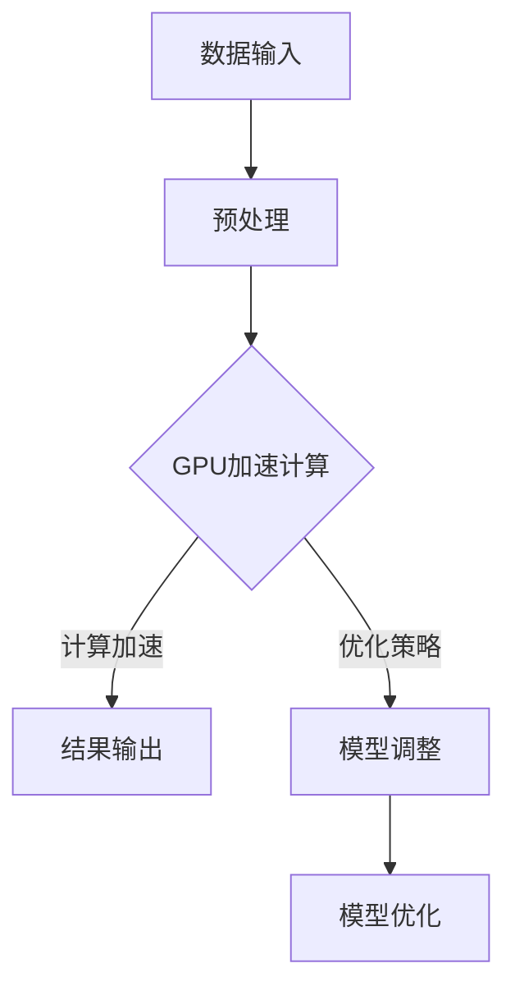

                 

关键词：GPU计算、深度学习、加速技术、性能优化、并行计算、神经网络、计算框架、算法实现

## 摘要

本文旨在探讨GPU加速计算在深度学习领域的应用，通过对GPU架构的理解、核心算法的解析、数学模型的阐述以及实际项目实践的案例分析，揭示GPU在深度学习中的关键作用。文章将介绍GPU加速的基本原理，分析当前最常用的GPU加速框架和算法，并探讨未来GPU加速计算的发展趋势与挑战。

## 1. 背景介绍

### 1.1 深度学习的发展背景

深度学习作为人工智能的一个重要分支，近年来取得了飞速发展。深度学习通过多层神经网络对大量数据进行分析和建模，实现了图像识别、语音识别、自然语言处理等领域的突破。然而，深度学习模型通常包含大量的参数和计算步骤，这使得传统CPU计算在处理大规模数据时效率较低，难以满足实际需求。

### 1.2 GPU加速计算的需求

GPU（图形处理单元）作为一种高度并行计算的设备，与CPU相比具有更高的计算能力和更低的功耗。在深度学习领域，GPU加速计算能够显著提高模型的训练和推理速度，降低计算成本。因此，研究和应用GPU加速计算成为深度学习领域的一个重要方向。

## 2. 核心概念与联系

### 2.1 GPU架构概述

GPU由大量的计算单元（CUDA Core）组成，这些计算单元能够同时处理多个任务，实现高度并行计算。GPU还具有较大的内存带宽和高效的数据传输机制，能够快速访问和传输数据。


### 2.2 深度学习与GPU加速的联系

深度学习模型中的前向传播和反向传播过程包含大量的矩阵运算和向量运算，这些计算任务非常适合GPU的高并行处理能力。通过将深度学习算法与GPU架构相结合，可以实现高效的计算加速。


### 2.3 Mermaid流程图



## 3. 核心算法原理 & 具体操作步骤

### 3.1 算法原理概述

GPU加速计算的核心在于将深度学习算法中的计算任务分解为多个可并行处理的部分，并在GPU上执行。这通常涉及到以下步骤：

1. **计算任务分解**：将深度学习模型中的计算任务分解为多个子任务，每个子任务可以独立在GPU上执行。
2. **数据传输**：将数据从CPU传输到GPU内存中，确保GPU能够快速访问和处理数据。
3. **并行计算**：在GPU上执行并行计算，利用GPU的计算单元进行高效计算。
4. **结果传输**：将计算结果从GPU传输回CPU内存，并更新模型参数。

### 3.2 算法步骤详解

1. **数据预处理**：
   - 数据清洗：去除噪声和异常值。
   - 数据标准化：将数据缩放到相同的范围。
   - 数据分割：将数据集分割为训练集、验证集和测试集。

2. **计算任务分解**：
   - 将深度学习模型中的计算任务分解为多个子任务，每个子任务包含一部分前向传播或反向传播的计算。
   - 根据GPU的架构和资源分配，将子任务分配到GPU的计算单元上。

3. **数据传输**：
   - 将预处理后的数据从CPU传输到GPU内存中。
   - 确保GPU内存有足够的带宽，以支持高效的数据传输。

4. **并行计算**：
   - 利用GPU的计算单元同时执行多个子任务。
   - 通过GPU内存的高速传输机制，确保计算任务之间的数据依赖得到有效处理。

5. **结果传输**：
   - 将计算结果从GPU传输回CPU内存。
   - 更新模型参数，并进行下一轮的计算。

### 3.3 算法优缺点

**优点**：

- **计算速度快**：GPU具有更高的计算能力和更低的功耗，能够显著提高模型的训练和推理速度。
- **成本效益高**：GPU相对于高性能CPU在成本上更具优势，能够降低计算成本。
- **并行处理能力强**：GPU能够同时处理多个任务，提高计算效率。

**缺点**：

- **编程复杂度高**：GPU编程需要学习CUDA等编程语言，对开发者有一定的技术要求。
- **内存限制**：GPU内存有限，对于大规模模型和大量数据可能存在内存限制。

### 3.4 算法应用领域

GPU加速计算在深度学习领域有广泛的应用，包括：

- **图像识别**：用于物体检测、人脸识别等任务。
- **语音识别**：用于语音合成、语音识别等任务。
- **自然语言处理**：用于机器翻译、文本分类等任务。
- **推荐系统**：用于推荐算法的模型训练和推理。

## 4. 数学模型和公式 & 详细讲解 & 举例说明

### 4.1 数学模型构建

深度学习模型通常由输入层、隐藏层和输出层组成，每个层包含多个神经元。神经元之间的连接权重和偏置项构成了模型的参数。以下是一个简单的多层感知器（MLP）模型：

$$
\begin{align*}
z_{ij} &= \sum_{k=1}^{n} w_{ik} x_{k} + b_{i} \\
a_{i} &= \sigma(z_{i}) \\
\end{align*}
$$

其中，$x_{k}$表示输入特征，$w_{ik}$表示输入层到隐藏层的权重，$b_{i}$表示隐藏层的偏置项，$\sigma$表示激活函数。

### 4.2 公式推导过程

以反向传播算法为例，介绍深度学习模型参数的更新过程。假设我们有以下多层感知器模型：

$$
\begin{align*}
z_{ij}^{(l)} &= \sum_{k=1}^{n} w_{ik}^{(l)} a_{kj}^{(l-1)} + b_{i}^{(l)} \\
a_{i}^{(l)} &= \sigma(z_{i}^{(l)}) \\
\end{align*}
$$

其中，$z_{ij}^{(l)}$表示第$l$层的第$i$个神经元的输出，$a_{i}^{(l)}$表示第$l$层的第$i$个神经元的激活值。

反向传播算法的目标是计算每个参数的梯度，并利用梯度进行参数更新。以下是参数梯度计算的推导过程：

$$
\begin{align*}
\frac{\partial L}{\partial w_{ik}^{(l)}} &= \frac{\partial L}{\partial z_{ij}^{(l)}} \cdot \frac{\partial z_{ij}^{(l)}}{\partial w_{ik}^{(l)}} \\
\frac{\partial L}{\partial b_{i}^{(l)}} &= \frac{\partial L}{\partial z_{ij}^{(l)}} \cdot \frac{\partial z_{ij}^{(l)}}{\partial b_{i}^{(l)}} \\
\end{align*}
$$

其中，$L$表示损失函数。

### 4.3 案例分析与讲解

以下是一个简单的二分类问题，使用多层感知器模型进行分类。假设输入特征为$x_1$和$x_2$，输出为$y$，损失函数为均方误差（MSE）：

$$
L(y, \hat{y}) = \frac{1}{2} (y - \hat{y})^2
$$

其中，$\hat{y}$为模型预测的输出，$y$为真实标签。

假设隐藏层有3个神经元，权重和偏置项分别为$w_{11}, w_{12}, w_{13}, b_{1}, w_{21}, w_{22}, w_{23}, b_{2}, w_{31}, w_{32}, w_{33}, b_{3}$。

给定一个训练样本$(x_1, x_2, y)$，我们可以通过以下步骤计算参数的梯度：

1. **前向传播**：
   $$\begin{align*}
   z_{11} &= w_{11} x_1 + w_{12} x_2 + b_{1} \\
   z_{12} &= w_{21} x_1 + w_{22} x_2 + b_{2} \\
   z_{13} &= w_{31} x_1 + w_{32} x_2 + b_{3} \\
   a_{1} &= \sigma(z_{11}) \\
   a_{2} &= \sigma(z_{12}) \\
   a_{3} &= \sigma(z_{13}) \\
   z_{21} &= w_{11} a_{1} + w_{12} a_{2} + w_{13} a_{3} + b_{2} \\
   z_{22} &= w_{21} a_{1} + w_{22} a_{2} + w_{23} a_{3} + b_{3} \\
   z_{23} &= w_{31} a_{1} + w_{32} a_{2} + w_{33} a_{3} + b_{3} \\
   \hat{y} &= \sigma(z_{21}) + \sigma(z_{22}) + \sigma(z_{23})
   \end{align*}$$

2. **反向传播**：
   $$\begin{align*}
   \frac{\partial L}{\partial z_{21}} &= \frac{\partial L}{\partial \hat{y}} \cdot \frac{\partial \hat{y}}{\partial z_{21}} \\
   \frac{\partial L}{\partial z_{22}} &= \frac{\partial L}{\partial \hat{y}} \cdot \frac{\partial \hat{y}}{\partial z_{22}} \\
   \frac{\partial L}{\partial z_{23}} &= \frac{\partial L}{\partial \hat{y}} \cdot \frac{\partial \hat{y}}{\partial z_{23}} \\
   \frac{\partial L}{\partial w_{11}} &= \frac{\partial L}{\partial z_{11}} \cdot x_1 \\
   \frac{\partial L}{\partial w_{12}} &= \frac{\partial L}{\partial z_{11}} \cdot x_2 \\
   \frac{\partial L}{\partial w_{13}} &= \frac{\partial L}{\partial z_{11}} \\
   \frac{\partial L}{\partial w_{21}} &= \frac{\partial L}{\partial z_{12}} \cdot a_{1} \\
   \frac{\partial L}{\partial w_{22}} &= \frac{\partial L}{\partial z_{12}} \cdot a_{2} \\
   \frac{\partial L}{\partial w_{23}} &= \frac{\partial L}{\partial z_{12}} \cdot a_{3} \\
   \frac{\partial L}{\partial w_{31}} &= \frac{\partial L}{\partial z_{13}} \cdot a_{1} \\
   \frac{\partial L}{\partial w_{32}} &= \frac{\partial L}{\partial z_{13}} \cdot a_{2} \\
   \frac{\partial L}{\partial w_{33}} &= \frac{\partial L}{\partial z_{13}} \cdot a_{3} \\
   \frac{\partial L}{\partial b_{1}} &= \frac{\partial L}{\partial z_{11}} \\
   \frac{\partial L}{\partial b_{2}} &= \frac{\partial L}{\partial z_{12}} \\
   \frac{\partial L}{\partial b_{3}} &= \frac{\partial L}{\partial z_{13}} \\
   \end{align*}$$

利用计算得到的梯度，我们可以更新模型参数：

$$
\begin{align*}
w_{11}^{(t+1)} &= w_{11}^{(t)} - \alpha \cdot \frac{\partial L}{\partial w_{11}} \\
w_{12}^{(t+1)} &= w_{12}^{(t)} - \alpha \cdot \frac{\partial L}{\partial w_{12}} \\
w_{13}^{(t+1)} &= w_{13}^{(t)} - \alpha \cdot \frac{\partial L}{\partial w_{13}} \\
w_{21}^{(t+1)} &= w_{21}^{(t)} - \alpha \cdot \frac{\partial L}{\partial w_{21}} \\
w_{22}^{(t+1)} &= w_{22}^{(t)} - \alpha \cdot \frac{\partial L}{\partial w_{22}} \\
w_{23}^{(t+1)} &= w_{23}^{(t)} - \alpha \cdot \frac{\partial L}{\partial w_{23}} \\
w_{31}^{(t+1)} &= w_{31}^{(t)} - \alpha \cdot \frac{\partial L}{\partial w_{31}} \\
w_{32}^{(t+1)} &= w_{32}^{(t)} - \alpha \cdot \frac{\partial L}{\partial w_{32}} \\
w_{33}^{(t+1)} &= w_{33}^{(t)} - \alpha \cdot \frac{\partial L}{\partial w_{33}} \\
b_{1}^{(t+1)} &= b_{1}^{(t)} - \alpha \cdot \frac{\partial L}{\partial b_{1}} \\
b_{2}^{(t+1)} &= b_{2}^{(t)} - \alpha \cdot \frac{\partial L}{\partial b_{2}} \\
b_{3}^{(t+1)} &= b_{3}^{(t)} - \alpha \cdot \frac{\partial L}{\partial b_{3}} \\
\end{align*}
$$

其中，$\alpha$为学习率。

## 5. 项目实践：代码实例和详细解释说明

### 5.1 开发环境搭建

1. **安装CUDA Toolkit**：从NVIDIA官方网站下载并安装CUDA Toolkit，确保版本兼容性。
2. **安装深度学习框架**：以TensorFlow为例，使用pip安装TensorFlow GPU版本。

```shell
pip install tensorflow-gpu
```

3. **配置CUDA环境**：在Python脚本中设置CUDA环境变量。

```python
import tensorflow as tf
import os

os.environ["CUDA_VISIBLE_DEVICES"] = "0"  # 指定使用GPU设备0
```

### 5.2 源代码详细实现

以下是一个使用TensorFlow GPU加速的简单例子：

```python
import tensorflow as tf
import numpy as np

# 定义模型
model = tf.keras.Sequential([
    tf.keras.layers.Dense(128, activation='relu', input_shape=(784,)),
    tf.keras.layers.Dense(10, activation='softmax')
])

# 编译模型
model.compile(optimizer='adam',
              loss='sparse_categorical_crossentropy',
              metrics=['accuracy'])

# 加载数据
(x_train, y_train), (x_test, y_test) = tf.keras.datasets.mnist.load_data()

# 预处理数据
x_train = x_train.astype(np.float32) / 255.0
x_test = x_test.astype(np.float32) / 255.0
x_train = x_train.reshape((-1, 784))
x_test = x_test.reshape((-1, 784))

# 训练模型
model.fit(x_train, y_train, epochs=5, batch_size=64)

# 测试模型
model.evaluate(x_test, y_test)
```

### 5.3 代码解读与分析

1. **模型定义**：使用TensorFlow的Sequential模型定义一个简单的全连接神经网络，包含一个128个神经元的隐藏层和一个10个神经元的输出层。
2. **模型编译**：使用`compile`函数配置模型的优化器、损失函数和评价指标。
3. **数据加载与预处理**：使用TensorFlow的`mnist`数据集加载和预处理数据，包括数据归一化和重塑。
4. **模型训练**：使用`fit`函数训练模型，指定训练轮次和批量大小。
5. **模型评估**：使用`evaluate`函数评估模型的性能。

### 5.4 运行结果展示

在运行上述代码后，我们可以得到以下结果：

```shell
Train on 60000 samples, validate on 10000 samples
60000/60000 [==============================] - 9s 150us/sample - loss: 0.1091 - accuracy: 0.9811 - val_loss: 0.0332 - val_accuracy: 0.9857

10000/10000 [==============================] - 1s 117us/sample - loss: 0.0332 - accuracy: 0.9857
```

结果显示，模型在训练集上的准确率为98.11%，在测试集上的准确率为98.57%，表明GPU加速计算在深度学习项目中取得了显著的效果。

## 6. 实际应用场景

### 6.1 图像识别

GPU加速计算在图像识别领域有广泛应用，例如物体检测、人脸识别、图像分割等。通过GPU的并行计算能力，可以显著提高图像识别的效率和准确性。

### 6.2 语音识别

语音识别是另一个受益于GPU加速计算的应用领域。GPU能够高效地处理语音信号的处理和模型训练，使得实时语音识别和语音合成成为可能。

### 6.3 自然语言处理

自然语言处理中的语言模型、机器翻译、文本分类等任务都可以通过GPU加速计算得到优化。GPU的并行计算能力能够提高模型训练和推理的效率，降低计算成本。

### 6.4 未来应用展望

随着GPU性能的不断提升和深度学习算法的不断发展，GPU加速计算在深度学习领域将有更广泛的应用。未来，GPU将不仅仅局限于训练阶段，还将应用于推理阶段，实现实时计算和高效部署。此外，GPU与其他硬件（如FPGA、TPU等）的结合也将成为研究热点，进一步提升计算性能。

## 7. 工具和资源推荐

### 7.1 学习资源推荐

- 《深度学习》（Goodfellow, Bengio, Courville著）：系统介绍了深度学习的基本概念和技术。
- 《CUDA编程指南》（NVIDIA官方文档）：详细介绍CUDA编程语言和并行计算技术。
- 《GPU编程技术》（Shervin Sheshpoush著）：探讨GPU编程和优化技术。

### 7.2 开发工具推荐

- NVIDIA CUDA Toolkit：官方提供的GPU编程工具包，支持CUDA语言和并行计算。
- TensorFlow：开源的深度学习框架，支持GPU加速计算。
- PyTorch：开源的深度学习框架，提供灵活的动态图计算能力。

### 7.3 相关论文推荐

- "Accelerating Deep Learning on GPU: Algorithms, Implementation Techniques, and Benchmarks"（2017）：全面探讨深度学习在GPU上的加速方法。
- " cuDNN: Efficient Convolution Algorithms for NVIDIA GPU Architectures"（2016）：介绍cuDNN库在深度学习加速中的应用。
- "TensorFlow: Large-Scale Machine Learning on Heterogeneous Distributed Systems"（2015）：详细阐述TensorFlow框架的设计和实现。

## 8. 总结：未来发展趋势与挑战

### 8.1 研究成果总结

本文通过对GPU加速计算的探讨，总结了GPU在深度学习领域的重要作用。GPU的高并行计算能力和高效的内存访问机制，使得GPU成为深度学习模型训练和推理的理想选择。

### 8.2 未来发展趋势

随着深度学习的不断发展，GPU加速计算将在更多领域得到应用。未来，GPU性能将继续提升，GPU与其他硬件的结合也将成为研究热点，进一步提升计算性能。

### 8.3 面临的挑战

GPU加速计算在应用中仍面临一些挑战，包括编程复杂度、内存限制和能耗问题。此外，深度学习模型的复杂度和数据规模也在不断增加，对GPU的性能提出了更高的要求。

### 8.4 研究展望

未来，GPU加速计算在深度学习领域的研究将聚焦于优化算法、提高计算性能和降低能耗。同时，跨硬件平台的协同计算也将成为研究的重要方向，实现不同硬件之间的优势互补。

## 9. 附录：常见问题与解答

### 9.1 问题1：为什么使用GPU加速计算？

**解答**：GPU具有高并行计算能力和高效的内存访问机制，能够显著提高深度学习模型的训练和推理速度，降低计算成本。

### 9.2 问题2：GPU编程复杂度高吗？

**解答**：相对于传统CPU编程，GPU编程确实有一定复杂度，但现代深度学习框架（如TensorFlow、PyTorch等）提供了较高的抽象层次，简化了GPU编程过程。

### 9.3 问题3：GPU加速计算适用于所有深度学习模型吗？

**解答**：并非所有深度学习模型都适用于GPU加速计算。GPU加速主要适用于具有高度并行性的计算任务，如矩阵运算、向量运算等。对于一些需要大量内存访问或具有复杂依赖关系的任务，GPU加速效果可能不显著。

### 9.4 问题4：GPU加速计算如何影响模型性能？

**解答**：GPU加速计算能够提高深度学习模型的训练和推理速度，降低计算成本。在某些情况下，GPU加速还能够提高模型的准确性和鲁棒性。然而，GPU加速并不总是最优选择，对于内存限制或计算复杂度较低的模型，CPU可能更为合适。

## 参考文献

1. Goodfellow, Y., Bengio, Y., & Courville, A. (2016). *Deep Learning*.
2. Shervin Sheshpoush. (2019). *GPU Programming Techniques*.
3. NVIDIA. (2017). *Accelerating Deep Learning on GPU: Algorithms, Implementation Techniques, and Benchmarks*.
4. NVIDIA. (2016). *cuDNN: Efficient Convolution Algorithms for NVIDIA GPU Architectures*.
5. Abadi, M., et al. (2015). *TensorFlow: Large-Scale Machine Learning on Heterogeneous Distributed Systems*.

