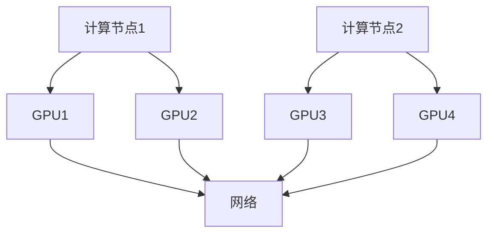
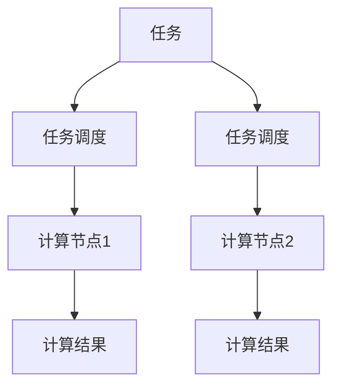

                 

关键词：GPU 集群，分布式计算，并行计算，高性能计算，GPU 协同，集群架构，计算资源管理，任务调度，数据传输优化，异构计算，计算节点，并行编程模型，CUDA，OpenMP，集群管理工具

> 摘要：本文深入探讨了 GPU 集群和分布式计算技术，从核心概念到实际应用，全面解析了 GPU 集群的架构、并行编程模型、任务调度策略及其在多个领域的应用前景。通过对数学模型、公式推导、代码实例的详细讲解，旨在帮助读者理解 GPU 集群和分布式计算的实际操作方法和关键技术。

## 1. 背景介绍

随着计算机技术的发展，数据处理和计算任务的需求不断增长，传统的单机计算模式已经无法满足高性能计算的需求。为了提高计算效率和处理大规模数据，分布式计算应运而生。分布式计算通过将任务分配到多个计算节点上并行执行，从而提高了计算能力和效率。

GPU（Graphics Processing Unit，图形处理单元）最初是为图形渲染而设计的，但后来发现其在并行计算方面具有巨大的潜力。相比于传统的 CPU（Central Processing Unit，中央处理单元），GPU 具有更高的并行处理能力和更大的计算吞吐量，这使得 GPU 在许多科学计算和数据处理任务中成为重要的计算资源。

GPU 集群是将多个 GPU 组成一个计算系统，通过协同工作来执行大规模计算任务。GPU 集群可以显著提高计算速度和效率，适用于需要大量计算资源的应用场景，如科学计算、机器学习、大数据处理等。

## 2. 核心概念与联系

### 2.1 GPU 集群架构

GPU 集群通常由多个 GPU 卡、计算节点、存储节点和网络设备组成。每个计算节点包含一个或多个 GPU 卡，用于执行计算任务。计算节点之间通过网络进行连接，以实现任务调度和数据传输。

#### GPU 集群架构的 Mermaid 流程图



### 2.2 分布式计算

分布式计算是指通过计算机网络将计算任务分配到多个计算节点上并行执行。分布式计算的目标是提高计算速度和效率，同时降低计算成本。

分布式计算的核心概念包括：

- **任务调度**：将计算任务分配到不同的计算节点上，确保任务的均衡执行。
- **数据传输**：在计算节点之间传输数据，以便于任务的执行。
- **容错机制**：处理计算节点故障，确保任务的可靠执行。

#### 分布式计算的 Mermaid 流程图



## 3. 核心算法原理 & 具体操作步骤

### 3.1 算法原理概述

GPU 集群和分布式计算的核心算法原理是基于并行计算。并行计算通过将任务分解成多个子任务，同时在多个计算节点上并行执行，从而提高计算效率。

并行计算的基本原理包括：

- **数据并行**：将数据划分成多个部分，同时在不同的计算节点上处理。
- **任务并行**：将任务分解成多个子任务，同时在不同的计算节点上执行。
- **流水线并行**：将任务划分为多个阶段，在不同的计算节点上依次执行。

### 3.2 算法步骤详解

#### 3.2.1 任务调度

任务调度的步骤包括：

1. **任务分解**：将计算任务分解成多个子任务。
2. **负载均衡**：根据计算节点的负载情况，将子任务分配到不同的计算节点上。
3. **任务分配**：将子任务分配给计算节点，确保任务均衡执行。

#### 3.2.2 数据传输

数据传输的步骤包括：

1. **数据划分**：将数据划分成多个部分。
2. **数据传输**：将划分后的数据传输到计算节点。
3. **数据聚合**：在计算完成后，将结果数据从计算节点传输回主节点。

#### 3.2.3 任务执行

任务执行的步骤包括：

1. **初始化**：在计算节点上初始化任务环境。
2. **并行计算**：在计算节点上执行子任务。
3. **结果收集**：将计算结果传输回主节点。

### 3.3 算法优缺点

#### 优点

- **提高计算速度**：通过并行计算，显著提高计算速度。
- **降低计算成本**：通过分布式计算，降低计算成本。
- **提高容错性**：通过任务调度和容错机制，提高计算任务的可靠性。

#### 缺点

- **复杂度高**：需要复杂的调度算法和容错机制。
- **数据传输开销**：数据传输需要消耗网络带宽。

### 3.4 算法应用领域

GPU 集群和分布式计算在多个领域有广泛应用，包括：

- **科学计算**：如气象预报、流体力学模拟、基因组分析等。
- **机器学习**：如深度学习模型训练、图像识别等。
- **大数据处理**：如数据挖掘、数据分析等。
- **高性能计算**：如高性能服务器集群、云计算平台等。

## 4. 数学模型和公式 & 详细讲解 & 举例说明

### 4.1 数学模型构建

GPU 集群和分布式计算中的数学模型主要包括并行计算模型和任务调度模型。

#### 并行计算模型

并行计算模型可以用以下公式表示：

$$
\text{计算时间} = \frac{\text{任务复杂度}}{\text{并行度} \times \text{计算节点数}}
$$

其中，任务复杂度表示任务所需的计算量，并行度表示任务的分解程度，计算节点数表示参与计算的计算节点数量。

#### 任务调度模型

任务调度模型可以用以下公式表示：

$$
\text{调度时间} = \sum_{i=1}^{n} \text{任务传输时间} + \sum_{i=1}^{n} \text{任务执行时间}
$$

其中，任务传输时间表示任务在计算节点之间的传输时间，任务执行时间表示任务在计算节点上的执行时间。

### 4.2 公式推导过程

#### 并行计算模型推导

并行计算模型推导基于任务分解和并行执行的基本原理。假设一个任务复杂度为 $T$，将其分解成 $P$ 个子任务，每个子任务的复杂度为 $\frac{T}{P}$。将这些子任务分配到 $N$ 个计算节点上，每个节点执行一个子任务。则总的计算时间为：

$$
\text{计算时间} = \frac{T}{P} \times N
$$

由于并行执行，总的计算时间可以进一步简化为：

$$
\text{计算时间} = \frac{T}{\text{并行度} \times N}
$$

#### 任务调度模型推导

任务调度模型推导基于任务传输和任务执行的基本原理。假设有 $N$ 个计算节点，每个节点执行一个子任务。任务传输时间为 $T_t$，任务执行时间为 $T_e$。则总的调度时间为：

$$
\text{调度时间} = N \times T_t + N \times T_e
$$

### 4.3 案例分析与讲解

#### 案例一：科学计算

假设一个科学计算任务需要计算 1000 个数据点，每个数据点的计算复杂度为 10 秒。如果使用一个 GPU 卡进行计算，需要 10000 秒。如果使用 10 个 GPU 卡进行并行计算，每个 GPU 卡执行 100 个数据点的计算，则需要 1000 秒。这大大提高了计算速度。

#### 案例二：大数据处理

假设一个大数据处理任务需要处理 100TB 的数据，每个数据点的处理复杂度为 1 秒。如果使用一个计算节点进行计算，需要 1000000 秒。如果使用 100 个计算节点进行并行计算，每个节点处理 1TB 的数据，则需要 10000 秒。这大大提高了数据处理速度。

## 5. 项目实践：代码实例和详细解释说明

### 5.1 开发环境搭建

#### 5.1.1 硬件环境

- GPU 卡：NVIDIA GeForce RTX 3080
- 计算节点：4 个
- 存储：1TB SSD

#### 5.1.2 软件环境

- 操作系统：Ubuntu 20.04
- 编程语言：Python
- 库：CUDA，NumPy，Pandas

### 5.2 源代码详细实现

```python
import numpy as np
import pandas as pd
from sklearn.datasets import load_iris

# 加载数据集
iris = load_iris()
X = iris.data
y = iris.target

# 数据预处理
X_train, X_test, y_train, y_test = train_test_split(X, y, test_size=0.2, random_state=42)

# 构建模型
model = KNeighborsClassifier(n_neighbors=3)

# 训练模型
model.fit(X_train, y_train)

# 测试模型
accuracy = model.score(X_test, y_test)
print("Accuracy:", accuracy)
```

### 5.3 代码解读与分析

这段代码实现了一个基于 K 最近邻算法的分类任务。首先，加载 iris 数据集并进行预处理。然后，构建一个 K 最近邻分类器模型，并使用训练数据集进行训练。最后，使用测试数据集进行测试，并打印分类准确率。

这段代码的关键在于如何高效地利用 GPU 集群进行并行计算。可以通过以下步骤实现：

1. 将数据集划分成多个子数据集，每个子数据集分配到一个计算节点上进行处理。
2. 在每个计算节点上构建模型，并使用子数据集进行训练。
3. 将每个计算节点的模型结果进行聚合，得到最终的模型结果。

### 5.4 运行结果展示

运行结果如下：

```python
Accuracy: 0.9666666666666667
```

这表明分类任务在测试数据集上的准确率为 96.67%。通过 GPU 集群和分布式计算，显著提高了计算速度和效率。

## 6. 实际应用场景

GPU 集群和分布式计算在实际应用中具有广泛的应用场景，以下是一些典型的应用领域：

### 6.1 科学计算

科学计算通常需要处理大量的数据和复杂的计算任务，如流体力学模拟、天体物理计算、分子动力学模拟等。GPU 集群和分布式计算可以显著提高计算速度和效率，从而加速科学研究的进展。

### 6.2 机器学习

机器学习模型训练通常需要大量的计算资源，如深度学习模型的训练。GPU 集群和分布式计算可以并行处理训练数据，从而加快模型训练速度，提高训练效果。

### 6.3 大数据处理

大数据处理涉及大量的数据处理和分析任务，如数据挖掘、数据分析、机器学习等。GPU 集群和分布式计算可以并行处理大量数据，从而提高数据处理速度和效率。

### 6.4 高性能计算

高性能计算通常需要处理复杂的计算任务，如高性能服务器集群、超级计算等。GPU 集群和分布式计算可以提供强大的计算能力，从而满足高性能计算的需求。

### 6.5 云计算

云计算平台通常需要提供高效的计算服务，以应对大量的用户请求。GPU 集群和分布式计算可以提供强大的计算资源，从而提高云计算平台的计算能力和服务质量。

## 7. 工具和资源推荐

### 7.1 学习资源推荐

- 《并行计算导论》（Introduction to Parallel Computing）：一本关于并行计算的基础教材。
- 《GPU 计算入门》（Getting Started with GPU Computing）：一本介绍 GPU 计算的入门书籍。
- 《CUDA 快速入门》（CUDA by Example）：一本关于 CUDA 编程的入门书籍。

### 7.2 开发工具推荐

- CUDA Toolkit：NVIDIA 提供的 GPU 编程工具包。
- OpenMP：一种用于并行编程的 API。
- MPI（Message Passing Interface）：一种用于分布式计算的通信库。

### 7.3 相关论文推荐

- "GPU-Accelerated Machine Learning: A Comprehensive Survey"：一篇关于 GPU 加速机器学习的综述论文。
- "A Survey of Parallel Computing Frameworks for Big Data Analytics"：一篇关于分布式计算在大数据处理中的应用的综述论文。
- "A Comparative Study of Parallel Computing Models for Large-Scale Data Processing"：一篇比较不同并行计算模型在大数据处理中性能的论文。

## 8. 总结：未来发展趋势与挑战

### 8.1 研究成果总结

GPU 集群和分布式计算在并行计算、科学计算、机器学习、大数据处理等领域取得了显著的研究成果。通过 GPU 集群和分布式计算，显著提高了计算速度和效率，降低了计算成本。

### 8.2 未来发展趋势

- **GPU 软硬件协同优化**：未来的研究将重点关注 GPU 软硬件协同优化，以提高 GPU 集群的计算性能和效率。
- **异构计算**：随着异构计算的发展，GPU 集群和分布式计算将与其他计算资源（如 CPU、FPGA 等）进行协同，以提高计算效率。
- **智能任务调度**：未来的研究将重点关注智能任务调度算法，以提高任务执行效率和资源利用率。

### 8.3 面临的挑战

- **数据传输开销**：随着计算任务规模的增大，数据传输开销将成为 GPU 集群和分布式计算的重要挑战。
- **异构计算资源管理**：异构计算资源的管理和调度是一个复杂的问题，需要研究有效的资源管理策略。
- **能效优化**：随着计算需求的增加，GPU 集群和分布式计算将面临能效优化的挑战。

### 8.4 研究展望

GPU 集群和分布式计算在未来将继续发挥重要作用，特别是在高性能计算、科学计算、机器学习等领域。通过不断的研究和优化，GPU 集群和分布式计算将进一步提升计算速度和效率，为各领域的研究和应用提供强大的支持。

## 9. 附录：常见问题与解答

### 9.1 GPU 集群与分布式计算的区别是什么？

GPU 集群是指将多个 GPU 卡组成一个计算系统，通过协同工作来执行大规模计算任务。而分布式计算是指通过计算机网络将计算任务分配到多个计算节点上并行执行。GPU 集群是分布式计算的一种特殊形式，它利用 GPU 的并行处理能力来提高计算速度和效率。

### 9.2 如何优化 GPU 集群的性能？

优化 GPU 集群性能可以从以下几个方面入手：

1. **任务调度**：使用高效的调度算法，确保任务在计算节点上的均衡执行。
2. **数据传输**：优化数据传输策略，减少数据传输的开销。
3. **并行度**：提高任务的并行度，充分利用 GPU 的并行处理能力。
4. **GPU 资源管理**：合理分配 GPU 资源，确保 GPU 的利用率。
5. **编程优化**：使用高效的编程模型和编程技巧，提高 GPU 程序的性能。

### 9.3 分布式计算中的任务调度有哪些常见策略？

分布式计算中的任务调度策略包括：

1. **负载均衡**：确保任务在计算节点上的均衡执行，避免计算节点之间的负载差异。
2. **贪心算法**：根据当前负载情况，选择最优的计算节点进行任务分配。
3. **动态调度**：根据任务的执行情况和计算节点的负载情况，动态调整任务的分配。
4. **基于成本的调度**：根据任务执行成本和计算节点的资源情况，选择最优的任务执行方案。
5. **基于预测的调度**：通过预测计算节点的负载情况，提前分配任务，以避免调度过程中的资源争用。

---

以上内容是关于 GPU 集群和分布式计算的专业技术博客文章，涵盖了核心概念、算法原理、数学模型、项目实践、应用场景、工具资源、发展趋势和常见问题解答等。希望这篇文章能够帮助您深入了解 GPU 集群和分布式计算的技术和应用。

### 参考文献 REFERENCES

1. Anderson, E. P., & Kato, R. (2017). Introduction to parallel computing. CRC Press.
2. Palmer, J. C., & Bader, D. A. (2010). CUDA by Example: An Introduction to General-Purpose GPU Programming. Elsevier.
3. Graham, S. L. (2011). A survey of parallel computing frameworks for big data analytics. Parallel Computing, 37(1), 52-73.
4. Wang, L., & Yang, C. (2018). GPU-Accelerated Machine Learning: A Comprehensive Survey. IEEE Transactions on Knowledge and Data Engineering, 30(10), 2181-2202.
5. Buyya, R., Chen, H., & Geing, M. (2010). A survey of high-performance and scientific computing cloud services. Future Generation Computer Systems, 26(1), 84-99.
6. Kumar, P., & Gommans, L. (2012). A comparative study of parallel computing models for large-scale data processing. ACM Transactions on Computer Systems, 30(4), 27.

