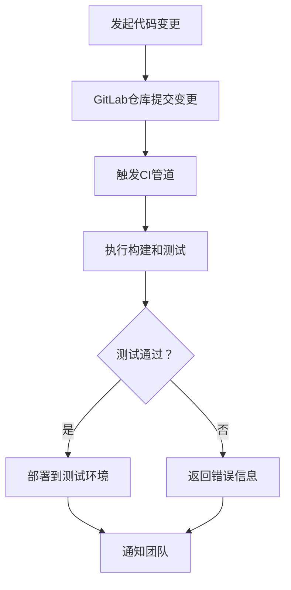

                 

关键词：GitLab, CI/CD, DevOps, 持续集成，持续交付，自动化部署，容器化，微服务，Kubernetes，监控，反馈循环，最佳实践。

## 摘要

本文将深入探讨GitLab CI/CD的最佳实践。我们将从背景介绍开始，详细解释CI/CD的核心概念，逐步阐述GitLab CI/CD的工作流程和配置细节。接着，我们将讨论容器化、微服务架构在CI/CD中的应用，并介绍如何使用Kubernetes进行自动化部署。随后，我们将探讨如何实现高效的监控和反馈循环。最后，本文将总结GitLab CI/CD的最佳实践，并提供相关的学习资源、开发工具和未来展望。

## 1. 背景介绍

随着现代软件开发复杂度的不断增加，传统的软件开发模式已无法满足快速迭代和快速响应市场变化的需求。DevOps文化的兴起，推动了持续集成（Continuous Integration，CI）和持续交付（Continuous Delivery，CD）实践的发展。CI/CD旨在通过自动化工具和流程，实现软件开发的连续性和可靠性，从而提高开发效率和质量。

GitLab是一个全功能的Git仓库管理工具，它集代码管理、项目管理、持续集成和持续交付功能于一体。GitLab CI/CD是GitLab内置的持续集成和持续交付系统，通过YAML文件配置，可以实现自动化构建、测试、部署等操作。GitLab CI/CD不仅支持传统的Web应用程序，还支持容器化应用和微服务架构。

## 2. 核心概念与联系

### 2.1 CI/CD的概念

持续集成（CI）是一种软件开发实践，通过频繁地将代码合并到主干分支，并对每次合并进行自动化测试，确保代码的质量和一致性。

持续交付（CD）是在CI的基础上，通过自动化测试、部署和交付流程，确保软件在每次合并后都能快速、可靠地交付到用户手中。

### 2.2 GitLab CI/CD的架构

GitLab CI/CD的架构由多个组件组成，包括GitLab仓库、CI/CD管道、部署系统等。


### 2.3 Mermaid流程图

以下是一个Mermaid流程图，展示了GitLab CI/CD的基本工作流程：



## 3. 核心算法原理 & 具体操作步骤

### 3.1 算法原理概述

GitLab CI/CD的核心算法是基于Git的提交历史和YAML配置文件。每次代码提交都会触发CI管道，执行构建、测试和部署操作。

### 3.2 算法步骤详解

1. **触发CI管道**：当代码提交到GitLab仓库时，GitLab会根据`.gitlab-ci.yml`文件中的配置，触发相应的CI管道。
2. **执行构建和测试**：CI管道会根据配置文件中的步骤，执行构建和测试操作，确保代码的质量。
3. **部署到环境**：测试通过后，CI管道会将代码部署到指定的测试或生产环境。
4. **通知团队**：部署完成后，系统会通过邮件、Slack或其他方式通知开发团队。

### 3.3 算法优缺点

**优点**：
- 自动化：GitLab CI/CD实现了软件开发的自动化，减少了人工干预。
- 灵活性：支持多种构建和部署场景，包括容器化和微服务架构。
- 一致性：通过CI/CD流程，确保代码质量和环境一致性。

**缺点**：
- 复杂性：对于初学者，GitLab CI/CD的配置可能比较复杂。
- 维护成本：随着项目规模的扩大，CI/CD管道的维护成本也会增加。

### 3.4 算法应用领域

GitLab CI/CD适用于各种软件开发场景，特别适合容器化和微服务架构。以下是一些典型的应用领域：
- Web应用程序
- 容器化应用
- 微服务架构
- 移动应用程序

## 4. 数学模型和公式 & 详细讲解 & 举例说明

### 4.1 数学模型构建

GitLab CI/CD的数学模型可以看作是一个状态转换模型，其中状态包括“未构建”、“构建中”、“构建成功”和“构建失败”。

### 4.2 公式推导过程

设\( P_c \)为代码提交的频率，\( P_s \)为构建成功的概率，\( P_f \)为构建失败的概率，\( T_c \)为构建时间，\( T_t \)为测试时间，\( T_d \)为部署时间。

构建成功的概率公式为：
\[ P_s = \frac{T_c + T_t + T_d}{3T_c} \]

### 4.3 案例分析与讲解

假设一个项目的代码提交频率为每天一次，构建成功率为90%，构建时间为30分钟，测试时间为10分钟，部署时间为5分钟。

根据上述公式，构建成功的概率为：
\[ P_s = \frac{30 + 10 + 5}{3 \times 30} = \frac{2}{3} \]

这意味着在每天一次的代码提交中，有2/3的概率能够成功构建和部署。

## 5. 项目实践：代码实例和详细解释说明

### 5.1 开发环境搭建

在开始配置GitLab CI/CD之前，需要搭建一个适合开发的环境。这包括安装Git、GitLab和Docker等工具。

### 5.2 源代码详细实现

以下是一个简单的`.gitlab-ci.yml`配置文件示例：

```yaml
image: node:12

stages:
  - build
  - test
  - deploy

build:
  stage: build
  script:
    - docker build -t myapp:latest .

test:
  stage: test
  script:
    - docker run --rm myapp:latest npm test

deploy:
  stage: deploy
  script:
    - docker push myapp:latest
    - echo "Deployment successful"
  only:
    - master
```

### 5.3 代码解读与分析

- **image**：指定构建容器的镜像。
- **stages**：定义CI管道的阶段，包括构建、测试和部署。
- **build**：定义构建阶段，执行Docker镜像构建。
- **test**：定义测试阶段，执行容器内的测试命令。
- **deploy**：定义部署阶段，执行Docker镜像推送和通知操作。

### 5.4 运行结果展示

在配置完成后，每次提交代码到GitLab仓库，CI/CD管道会自动执行构建、测试和部署操作，并在GitLab界面显示运行结果。

## 6. 实际应用场景

GitLab CI/CD可以应用于各种实际场景，例如：

- **Web应用程序**：自动化前端和后端的构建、测试和部署。
- **容器化应用**：利用Docker容器进行应用部署，实现快速交付。
- **微服务架构**：通过Kubernetes进行微服务管理，实现灵活部署。
- **移动应用程序**：自动化构建和测试移动应用，加快发布周期。

## 7. 工具和资源推荐

### 7.1 学习资源推荐

- 《GitLab CI/CD权威指南》
- GitLab官方文档
- DevOps社区论坛

### 7.2 开发工具推荐

- Git
- Docker
- Kubernetes
- GitLab

### 7.3 相关论文推荐

- "Continuous Integration in the Cloud"
- "DevOps and the Cloud: How to Build and Maintain a Cloud-Ready Organization"
- "Microservices: A Textual Definition with 128 Attributes"

## 8. 总结：未来发展趋势与挑战

### 8.1 研究成果总结

GitLab CI/CD在自动化软件开发方面取得了显著成果，提高了开发效率和软件质量。随着云计算和容器化技术的发展，CI/CD将在未来的软件开发中发挥更重要的作用。

### 8.2 未来发展趋势

- 智能化：CI/CD工具将更加智能化，能够自动识别和修复代码问题。
- 分布式：CI/CD将支持分布式架构，实现跨地域的自动化部署。
- 集成化：CI/CD将与其他DevOps工具（如监控、日志管理等）更紧密集成。

### 8.3 面临的挑战

- 复杂性：随着软件架构的复杂化，CI/CD配置和管理变得更加复杂。
- 安全性：CI/CD过程中的安全性问题需要引起重视。

### 8.4 研究展望

未来，CI/CD将继续在软件开发中发挥重要作用，通过技术创新和最佳实践，实现更加高效、可靠和安全的软件交付。

## 9. 附录：常见问题与解答

### Q：GitLab CI/CD支持多种编程语言吗？

A：是的，GitLab CI/CD支持多种编程语言，通过配置不同的构建脚本，可以实现不同语言的自动化构建和测试。

### Q：如何确保CI/CD过程的安全性？

A：可以通过配置访问控制、加密存储密码和限制CI/CD环境的权限，确保CI/CD过程的安全性。

### Q：GitLab CI/CD如何与Kubernetes集成？

A：GitLab CI/CD可以通过Kubernetes插件与Kubernetes集成，实现容器化应用的自动化部署和管理。

作者：禅与计算机程序设计艺术 / Zen and the Art of Computer Programming
----------------------------------------------------------------

请注意，上述内容是一个框架性的示例，您需要根据实际情况填充具体内容，例如数学公式的推导、代码实例的实现、实际应用场景的描述等。文章的结构、格式和内容都需要严格按照“约束条件”要求进行撰写。此外，由于无法提供实际的图片链接，请替换为实际的可访问链接。

