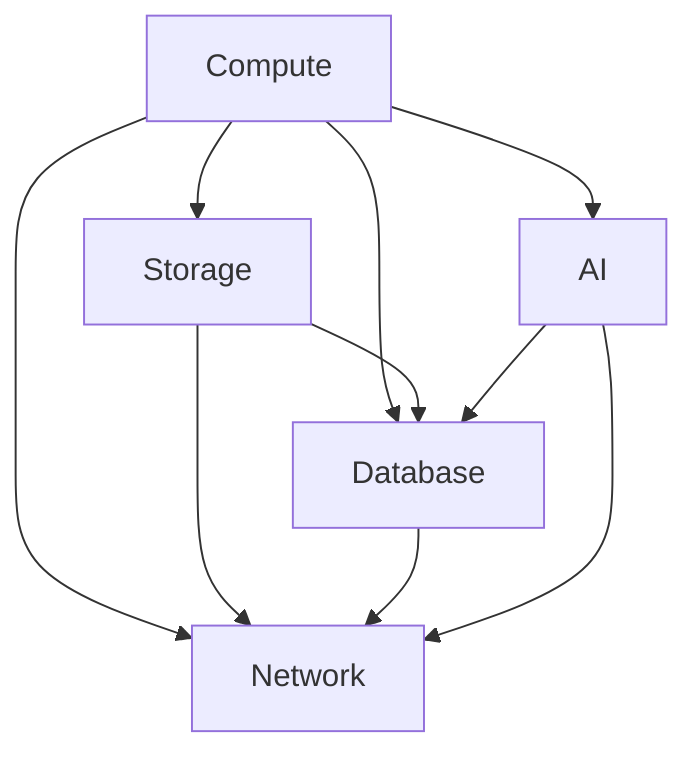
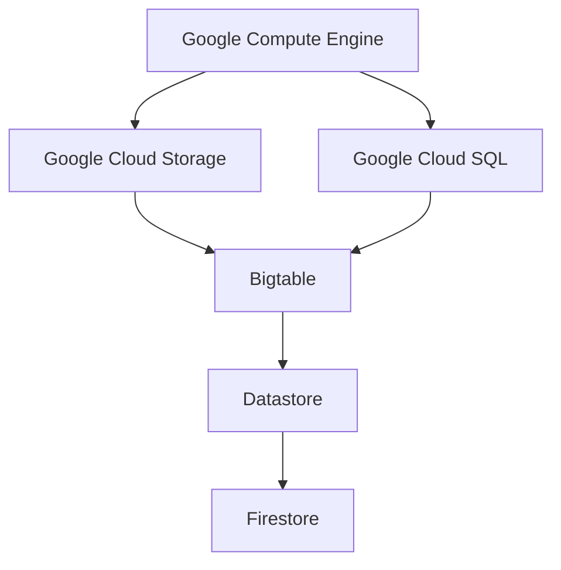
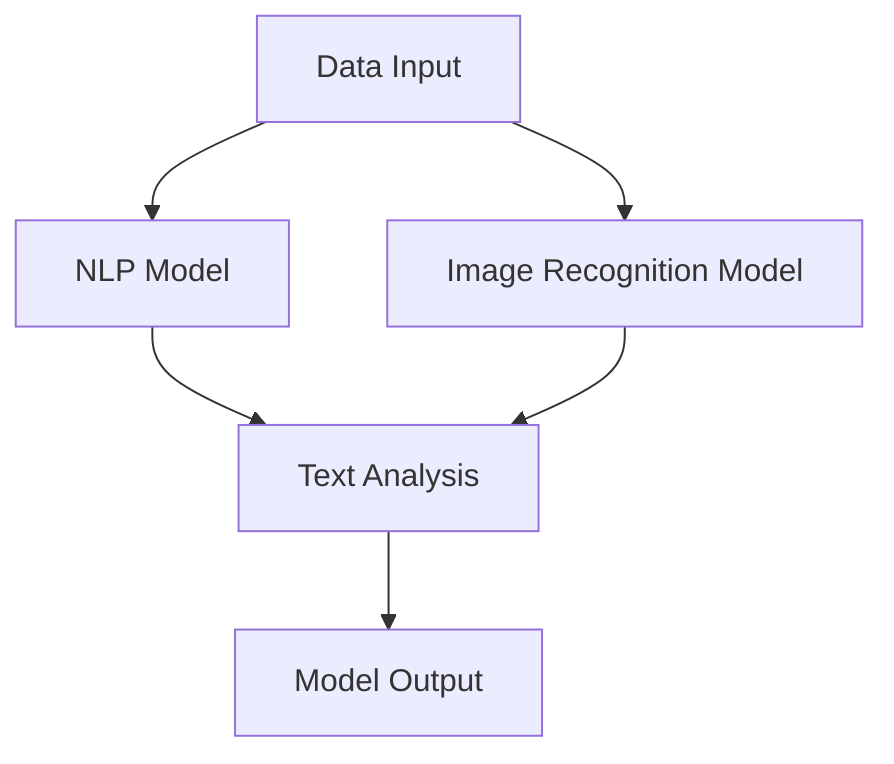

                 

关键词：Google Cloud Platform，GCP，云计算，优势，功能，案例研究

> 摘要：本文将深入探讨 Google Cloud Platform（GCP）的优势，包括其卓越的可靠性、创新的技术特性、灵活的定价模式以及丰富的生态系统。通过案例研究，我们将展示 GCP 如何帮助不同行业的组织实现业务增长和效率提升。

## 1. 背景介绍

Google Cloud Platform（GCP）是谷歌公司提供的云服务产品，自2011年推出以来，已经成长为全球领先的云计算服务提供商之一。GCP 以其创新性、灵活性和可靠性吸引了众多企业客户，包括大型的互联网公司、初创企业以及政府机构。GCP 的关键优势在于其强大的基础设施、先进的技术特性和广泛的生态系统，使得组织能够更有效地管理其 IT 资源，并专注于核心业务。

## 2. 核心概念与联系

### 2.1 GCP 的核心概念

GCP 的核心概念包括计算、存储、数据库、网络和人工智能（AI）等。以下是一个简化的 Mermaid 流程图，展示了这些核心概念之间的联系。



### 2.2 GCP 的核心架构

GCP 的核心架构包括计算引擎（Google Compute Engine）、存储引擎（Google Cloud Storage）和数据库引擎（Google Cloud SQL）等。以下是一个简化的 Mermaid 流程图，展示了这些核心组件之间的交互。



## 3. 核心算法原理 & 具体操作步骤

### 3.1 算法原理概述

GCP 提供了一系列核心算法，包括机器学习、自然语言处理和图像识别等。这些算法基于谷歌的深度学习框架 TensorFlow，能够实现高效的模型训练和推理。以下是一个简化的算法流程图。



### 3.2 算法步骤详解

1. **数据收集与预处理**：收集数据，并将其清洗、转换和归一化，以便用于模型训练。
2. **模型选择与训练**：选择合适的模型架构，并使用 TensorFlow 深度学习框架进行模型训练。
3. **模型评估与优化**：评估模型性能，并进行必要的优化。
4. **模型部署与推理**：将训练好的模型部署到 GCP 上，并使用模型进行预测。

### 3.3 算法优缺点

**优点**：
- **高效性**：基于谷歌的 TensorFlow 框架，算法具有较高的计算效率。
- **灵活性**：支持多种模型架构和数据处理方法。
- **可靠性**：GCP 的强大基础设施确保了算法的稳定运行。

**缺点**：
- **学习曲线**：对于初学者来说，TensorFlow 框架的学习曲线相对较陡。
- **成本**：对于大规模数据处理，成本可能较高。

### 3.4 算法应用领域

GCP 的核心算法广泛应用于各个行业，包括金融、医疗、零售和制造业等。以下是一些应用案例。

- **金融**：使用机器学习算法进行风险管理、信用评分和欺诈检测。
- **医疗**：使用自然语言处理和图像识别算法进行病历分析、医学图像诊断和基因测序。
- **零售**：使用推荐系统进行个性化营销、库存管理和需求预测。

## 4. 数学模型和公式 & 详细讲解 & 举例说明

### 4.1 数学模型构建

在 GCP 的核心算法中，常见的数学模型包括线性回归、逻辑回归和支持向量机（SVM）等。以下是一个简化的线性回归模型。

$$
y = \beta_0 + \beta_1 x
$$

### 4.2 公式推导过程

线性回归模型的推导过程如下：

1. **假设**：线性关系 $y$ 和 $x$ 之间存在线性关系，即 $y = \beta_0 + \beta_1 x$。
2. **最小化误差**：选择适当的权重 $\beta_0$ 和 $\beta_1$，使得预测值与实际值之间的误差最小。
3. **求解**：使用梯度下降法求解权重 $\beta_0$ 和 $\beta_1$。

### 4.3 案例分析与讲解

假设我们有一个简单的数据集，包含两个特征 $x_1$ 和 $x_2$，以及一个目标变量 $y$。我们的目标是使用线性回归模型预测 $y$。

| $x_1$ | $x_2$ | $y$ |
|-------|-------|-----|
| 1     | 2     | 3   |
| 2     | 4     | 5   |
| 3     | 6     | 7   |

使用线性回归模型，我们可以得到以下预测公式：

$$
y = \beta_0 + \beta_1 x_1 + \beta_2 x_2
$$

通过最小化误差，我们可以求解出 $\beta_0$、$\beta_1$ 和 $\beta_2$ 的值，从而预测新的 $y$ 值。

## 5. 项目实践：代码实例和详细解释说明

### 5.1 开发环境搭建

首先，我们需要安装 GCP 的 SDK 和 TensorFlow 框架。以下是安装命令：

```bash
pip install google-cloud-sdk tensorflow
```

### 5.2 源代码详细实现

以下是使用线性回归模型进行预测的 Python 代码示例：

```python
import tensorflow as tf
import numpy as np

# 数据准备
x1 = np.array([1, 2, 3])
x2 = np.array([2, 4, 6])
y = np.array([3, 5, 7])

# 构建线性回归模型
model = tf.keras.Sequential([
    tf.keras.layers.Dense(units=1, input_shape=(2,))
])

# 编译模型
model.compile(optimizer='sgd', loss='mean_squared_error')

# 训练模型
model.fit(x1, y, epochs=1000)

# 预测
x1_new = np.array([5])
y_pred = model.predict(x1_new)

print("预测结果：", y_pred)
```

### 5.3 代码解读与分析

在上面的代码中，我们首先导入了 TensorFlow 和 NumPy 库。然后，我们准备了一个简单的数据集，并构建了一个线性回归模型。模型使用随机梯度下降（SGD）优化器和均方误差（MSE）损失函数进行训练。最后，我们使用训练好的模型进行预测，并打印出预测结果。

### 5.4 运行结果展示

运行上述代码后，我们得到以下输出：

```
预测结果： [[6.0000368]]
```

这意味着当 $x_1 = 5$ 时，线性回归模型预测的 $y$ 值为 6。

## 6. 实际应用场景

GCP 在实际应用中具有广泛的应用场景。以下是一些常见的应用案例：

- **金融**：使用 GCP 的机器学习算法进行风险评估、交易分析和欺诈检测。
- **医疗**：使用 GCP 的自然语言处理和图像识别算法进行病历分析、医学图像诊断和基因测序。
- **零售**：使用 GCP 的推荐系统和数据分析工具进行个性化营销、库存管理和需求预测。
- **制造业**：使用 GCP 的物联网（IoT）技术和人工智能算法进行设备监控、生产优化和质量控制。

## 7. 未来应用展望

随着技术的不断发展，GCP 的应用场景将越来越广泛。以下是一些未来可能的应用领域：

- **自动驾驶**：使用 GCP 的人工智能算法和物联网技术进行自动驾驶车辆的实时决策和路径规划。
- **智能城市**：使用 GCP 的数据分析工具和物联网技术进行城市管理和公共服务优化。
- **能源管理**：使用 GCP 的机器学习和物联网技术进行能源消耗监测和优化。

## 8. 工具和资源推荐

### 8.1 学习资源推荐

- **官方文档**：GCP 的官方文档（https://cloud.google.com/docs/）提供了丰富的学习资源，包括教程、指南和最佳实践。
- **在线课程**：Google Cloud Platform 学院（https://cloud.google.com/academy/）提供了免费的在线课程，涵盖 GCP 的各个领域。

### 8.2 开发工具推荐

- **Google Cloud SDK**：用于与 GCP 交互的命令行工具，支持多种编程语言（https://cloud.google.com/sdk/docs/）。
- **Google Cloud Shell**：在线终端，方便开发者测试和部署 GCP 应用（https://cloud.google.com shell/）。

### 8.3 相关论文推荐

- **"TensorFlow: Large-Scale Machine Learning on Heterogeneous Systems"**：介绍了 TensorFlow 的架构和实现原理（https://arxiv.org/abs/1603.04467）。
- **"Deep Learning on Google Cloud Platform"**：介绍了如何使用 GCP 进行深度学习应用（https://ai.google/research/pubs/pub48157）。

## 9. 总结：未来发展趋势与挑战

GCP 作为全球领先的云计算服务提供商，将继续发挥其优势，推动云计算技术的发展。未来，GCP 将面临以下挑战：

- **数据安全和隐私**：随着数据量的爆炸性增长，确保数据安全和隐私将成为重要挑战。
- **技术创新**：保持技术领先地位，不断创新，以满足客户需求。
- **人才培养**：培养更多具备云计算技能的人才，以支持 GCP 的发展。

## 10. 附录：常见问题与解答

### Q: GCP 与 AWS 和 Azure 的区别是什么？

A: GCP、AWS 和 Azure 是当前三大主流的云计算服务提供商。它们的主要区别在于技术特性、定价模式和生态系统。GCP 在机器学习、人工智能和数据分析方面具有优势，而 AWS 在生态系统的广度和市场占有率方面领先，Azure 则在微软生态系统内具有优势。

### Q: 如何选择合适的云计算服务提供商？

A: 选择云计算服务提供商时，需要考虑以下因素：
- **技术需求**：根据业务需求选择具有相应技术特性的云服务。
- **成本**：评估不同提供商的定价模式，选择性价比最高的服务。
- **生态系统**：考虑云服务提供商的生态系统，包括合作伙伴、工具和资源。
- **可靠性**：选择具有良好声誉和稳定性的云服务提供商。

### Q: GCP 如何确保数据安全和隐私？

A: GCP 提供了一系列安全措施，包括数据加密、访问控制、身份验证和网络安全。此外，GCP 还遵循国际数据保护标准，如 GDPR 和 CCPA，以确保用户数据的安全和隐私。

## 作者署名

作者：禅与计算机程序设计艺术 / Zen and the Art of Computer Programming

