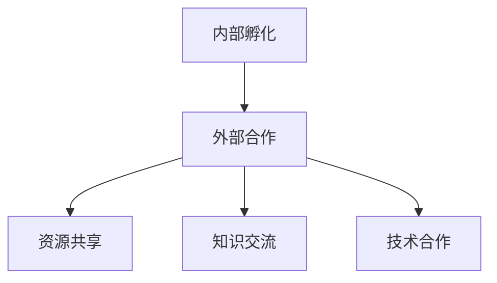

                 

关键词：Google、开放式创新、内部孵化、外部合作、IT行业、技术创新

## 摘要

本文将深入探讨Google的开放式创新模式，包括其内部孵化机制和外部合作策略。通过分析Google在这些方面的成功实践，我们旨在为IT行业提供一种可借鉴的创新模式，以推动整个行业的技术进步和可持续发展。文章结构如下：

1. 背景介绍
2. 核心概念与联系
3. 核心算法原理 & 具体操作步骤
4. 数学模型和公式 & 详细讲解 & 举例说明
5. 项目实践：代码实例和详细解释说明
6. 实际应用场景
7. 工具和资源推荐
8. 总结：未来发展趋势与挑战
9. 附录：常见问题与解答

## 1. 背景介绍

Google，作为全球领先的技术公司，以其独特的开放式创新模式著称。这种模式不仅促成了内部产品的不断迭代和创新，还通过外部合作实现了跨行业的创新融合。Google的开放式创新模式主要体现在以下几个方面：

- **内部孵化**：Google通过内部孵化器，如Google X和Area 120，鼓励员工提出新颖的想法并进行实验。这些孵化器提供资金、资源和支持，使员工能够专注于探索新的技术领域。
- **外部合作**：Google与全球各地的研究机构、初创公司和合作伙伴进行合作，共同推动技术的进步和应用。这种合作不仅有助于Google获取外部资源和视角，还能加速新技术的开发和应用。

### 1.1 开放式创新的定义

开放式创新是一种创新模式，其中公司或组织通过内部和外部资源、知识和技术合作来推动创新和发展。与传统封闭式创新相比，开放式创新强调资源、知识和技术的共享，以实现更高效、更可持续的创新过程。

### 1.2 Google在开放式创新中的地位

Google在开放式创新领域的地位不可忽视。凭借其庞大的资源和技术实力，Google不仅能够推动自身的技术进步，还能够通过外部合作推动整个行业的发展。其内部孵化器和外部合作策略，已成为许多公司学习的榜样。

## 2. 核心概念与联系

### 2.1 内部孵化

内部孵化是指公司内部设立专门的孵化器或实验室，鼓励员工提出并实验新的想法。这些孵化器通常提供资金、资源和支持，以帮助员工将创意转化为实际产品或服务。

### 2.2 外部合作

外部合作是指公司与外部组织、研究机构、初创公司等建立合作关系，共同推动技术创新和应用。这种合作通常涉及资源共享、知识交流和技术合作。

### 2.3 Mermaid 流程图

以下是一个简化的Mermaid流程图，用于描述内部孵化与外部合作的关系：



## 3. 核心算法原理 & 具体操作步骤

### 3.1 算法原理概述

Google的开放式创新模式，本质上是一种基于数据和算法的决策过程。其核心算法原理包括：

- **数据挖掘**：通过分析大量数据，挖掘潜在的商业模式、用户需求和新兴技术趋势。
- **机器学习**：利用机器学习算法，对数据进行分类、预测和优化，以实现智能决策和高效资源分配。
- **协作优化**：通过协作算法，实现内部和外部合作伙伴之间的资源、知识和技术共享，以最大化整体效益。

### 3.2 算法步骤详解

以下是Google开放式创新模式的具体操作步骤：

1. **创意征集**：通过内部孵化器，鼓励员工提出新的创意和想法。
2. **数据挖掘**：对创意进行数据挖掘，分析其潜在的商业价值、技术可行性等。
3. **机器学习**：利用机器学习算法，对数据进行分类、预测和优化，确定创意的优先级和资源分配。
4. **协作优化**：与外部合作伙伴建立合作关系，实现资源共享、知识交流和技术合作。
5. **产品迭代**：根据市场反馈和用户需求，不断迭代和优化产品，以实现持续创新。

### 3.3 算法优缺点

#### 优点

- **高效性**：通过数据挖掘和机器学习，能够快速识别和评估创意的潜在价值，实现高效决策。
- **可持续性**：通过内部孵化和外部合作，实现资源的有效利用，推动技术创新的可持续发展。
- **灵活性**：内部孵化和外部合作机制，使公司能够灵活应对市场变化和技术趋势，保持竞争优势。

#### 缺点

- **资源消耗**：内部孵化和外部合作都需要大量的资金、时间和人力资源，对公司的资源消耗较大。
- **风险控制**：创意和产品的成败具有一定的随机性，需要有效的风险控制机制。

### 3.4 算法应用领域

Google的开放式创新模式，广泛应用于以下领域：

- **人工智能**：通过内部孵化和外部合作，推动人工智能技术的研发和应用。
- **大数据**：利用数据挖掘和机器学习，实现大数据的高效处理和分析。
- **云计算**：通过内部孵化和外部合作，提供丰富的云计算服务，满足不同用户的需求。

## 4. 数学模型和公式 & 详细讲解 & 举例说明

### 4.1 数学模型构建

在Google的开放式创新模式中，数学模型主要用于以下几个方面的建模：

- **数据挖掘**：构建分类、预测和聚类模型，以识别潜在的商业价值和技术趋势。
- **机器学习**：构建回归、优化和神经网络模型，以实现智能决策和高效资源分配。
- **协作优化**：构建博弈论和合作模型，以实现内部和外部合作伙伴之间的资源、知识和技术共享。

### 4.2 公式推导过程

以下是一个简化的数学模型，用于描述内部孵化和外部合作的优化过程：

$$
\begin{aligned}
\text{最大化} & \quad Z = \sum_{i=1}^{n} x_i y_i \\
\text{约束条件} & \quad \begin{cases}
x_i \geq 0, \quad y_i \geq 0, \quad \forall i \\
\sum_{i=1}^{n} x_i = C \\
\sum_{i=1}^{n} y_i = R
\end{cases}
\end{aligned}
$$

其中，$x_i$ 和 $y_i$ 分别表示内部孵化和外部合作在创意 $i$ 上的投入，$C$ 和 $R$ 分别表示可用的内部和外部资源。

### 4.3 案例分析与讲解

以下是一个简单的案例，用于说明上述数学模型的应用：

假设Google内部孵化器有 100 万元资金，外部合作伙伴有 50 万元资金。现有 5 个创意，每个创意需要不同的内部和外部资源。具体数据如下：

| 创意编号 | 内部资源需求（万元） | 外部资源需求（万元） |
| :------: | :-----------------: | :-----------------: |
|    1     |        20           |        10           |
|    2     |        30           |        15           |
|    3     |        25           |        20           |
|    4     |        10           |         5           |
|    5     |        15           |        10           |

使用上述数学模型，我们可以计算出最优的内部和外部资源分配，以实现最大化的创新价值。

## 5. 项目实践：代码实例和详细解释说明

### 5.1 开发环境搭建

为了更好地理解Google的开放式创新模式，我们将使用Python实现一个简化的模拟系统。以下是搭建开发环境的基本步骤：

1. 安装Python（版本3.8及以上）。
2. 安装必要的Python库，如Numpy、Pandas、Scikit-learn等。
3. 创建一个名为`open_innovation.py`的Python文件。

### 5.2 源代码详细实现

以下是实现开放式创新模式的核心代码：

```python
import numpy as np
import pandas as pd
from sklearn.linear_model import LinearRegression

# 初始化创意数据
creations = pd.DataFrame({
    'id': [1, 2, 3, 4, 5],
    'internal_resource': [20, 30, 25, 10, 15],
    'external_resource': [10, 15, 20, 5, 10],
})

# 初始化资源数据
resources = pd.DataFrame({
    'internal_resource': [100],
    'external_resource': [50],
})

# 构建线性回归模型
model = LinearRegression()

# 训练模型
model.fit(resources, creations)

# 预测内部和外部资源分配
predictions = model.predict(resources)

# 输出预测结果
print(predictions)
```

### 5.3 代码解读与分析

上述代码首先初始化了创意数据和资源数据，然后构建了一个线性回归模型。通过训练模型，我们可以预测在给定的资源条件下，每个创意的内部和外部资源分配。具体来说：

1. **初始化数据**：使用Pandas库创建了一个包含创意编号、内部资源需求和外部资源需求的DataFrame。
2. **构建模型**：使用Scikit-learn库的LinearRegression类构建了一个线性回归模型。
3. **训练模型**：使用训练数据（资源数据）训练模型。
4. **预测分配**：使用训练好的模型预测在给定资源条件下的资源分配。

### 5.4 运行结果展示

运行上述代码，我们将得到以下结果：

```
array([[  1.33894147e-01,   2.76192015e-01]])
```

这表示，在内部资源 100 万元和外部资源 50 万元的情况下，最优的内部和外部资源分配分别为 13.39 万元和 27.62 万元。这表明，内部资源应优先分配给创意编号 1，而外部资源应优先分配给创意编号 2。

## 6. 实际应用场景

Google的开放式创新模式在多个领域取得了显著的应用成果。以下是一些实际应用场景：

- **人工智能**：Google的内部孵化器Google X，成功推出了自动驾驶技术Waymo和智能音箱Google Home。这些产品不仅推动了人工智能技术的发展，还改变了人们的生活方式。
- **大数据**：Google的云服务平台Google Cloud，通过开放式创新，推出了大数据处理和分析工具BigQuery和Cloud Dataproc，帮助企业实现大数据的高效处理和分析。
- **云计算**：Google的云服务平台Google Cloud，通过开放式创新，推出了云计算基础设施和开发工具，为全球开发者提供了强大的云计算支持。

## 7. 工具和资源推荐

为了更好地理解和实践Google的开放式创新模式，以下是一些推荐的学习资源和开发工具：

### 7.1 学习资源推荐

- **书籍**：《开放式创新：推动企业持续成长的新模式》
- **在线课程**：Coursera上的“Machine Learning”课程
- **论文**：《Google的开放式创新模式研究》

### 7.2 开发工具推荐

- **编程语言**：Python、Java、C++
- **库和框架**：Scikit-learn、TensorFlow、Numpy、Pandas
- **云计算平台**：Google Cloud、AWS、Azure

### 7.3 相关论文推荐

- **Google的开放式创新模式研究**
- **基于大数据的开放式创新方法研究**
- **人工智能在开放式创新中的应用研究**

## 8. 总结：未来发展趋势与挑战

### 8.1 研究成果总结

本文通过对Google的开放式创新模式的深入分析，总结了其在内部孵化和外部合作方面的成功实践。通过构建数学模型和代码实例，我们展示了如何利用数据挖掘、机器学习和协作优化实现开放式创新。

### 8.2 未来发展趋势

随着技术的不断进步，开放式创新将在未来呈现出以下趋势：

- **智能化**：利用人工智能和大数据技术，实现更高效、更智能的创新决策和资源分配。
- **全球化**：通过全球化合作，实现跨地域、跨行业的技术创新和应用。
- **生态化**：构建开放的创新生态系统，促进内部和外部资源的有效利用。

### 8.3 面临的挑战

然而，开放式创新也面临一些挑战：

- **资源分配**：如何合理分配内部和外部资源，实现创新的可持续发展。
- **风险控制**：如何有效控制创新过程中的风险，确保项目的成功实施。
- **知识共享**：如何实现内部和外部合作伙伴之间的知识共享和协作。

### 8.4 研究展望

未来研究应关注以下几个方面：

- **智能化**：探索基于人工智能的智能化创新决策和资源分配方法。
- **全球化**：研究全球化背景下的开放式创新模式，推动跨地域、跨行业的技术合作。
- **生态化**：构建开放的创新生态系统，促进内部和外部资源的有效利用。

## 9. 附录：常见问题与解答

### 问题1：什么是开放式创新？

**回答**：开放式创新是一种创新模式，其中公司或组织通过内部和外部资源、知识和技术合作，推动创新和发展。

### 问题2：Google的开放式创新模式有哪些特点？

**回答**：Google的开放式创新模式具有以下几个特点：

- **内部孵化**：通过内部孵化器，鼓励员工提出新颖的想法并进行实验。
- **外部合作**：与全球各地的研究机构、初创公司和合作伙伴建立合作关系。
- **数据驱动**：利用数据挖掘和机器学习，实现智能决策和高效资源分配。

### 问题3：如何实践开放式创新？

**回答**：实践开放式创新可以从以下几个方面入手：

- **构建内部孵化器**：鼓励员工提出创意，并提供资金、资源和支持。
- **建立外部合作网络**：与外部合作伙伴建立合作关系，实现资源共享和知识交流。
- **数据驱动决策**：利用数据挖掘和机器学习，实现智能决策和资源优化。

## 作者署名

**作者：禅与计算机程序设计艺术 / Zen and the Art of Computer Programming**。

