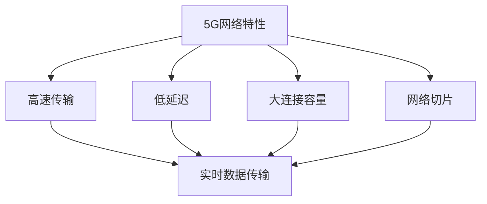

                 

关键词：5G技术，工业4.0，物联网，智能制造，实时数据传输，网络切片

> 摘要：随着5G技术的迅速发展，工业4.0的推进正在加速。本文将探讨5G技术在工业4.0中的应用，分析其在提升工业自动化、智能化和效率方面的潜力。通过对5G网络特性与工业需求之间的深度融合，本文旨在为未来的工业应用提供有价值的参考。

## 1. 背景介绍

### 1.1 5G技术

5G（第五代移动通信技术）是当前通信技术的最新进展，相比前几代技术，5G具有更高的数据传输速度、更低的延迟和更大的连接容量。这些特性使得5G在多个领域具有广泛的应用前景。

### 1.2 工业4.0

工业4.0是指以智能制造和工业互联网为核心，通过高度自动化和智能化的生产模式，实现从传统制造向智能化制造的转变。工业4.0的目标是实现整个工业生态系统的数字化、网络化和智能化。

### 1.3 5G与工业4.0的融合

5G技术的高速度、低延迟和大连接特性，与工业4.0的智能化需求高度契合，为工业领域的创新提供了新的动力。通过5G网络，可以实现设备之间的实时通信、数据的快速传输和处理，从而推动工业自动化和智能化的发展。

## 2. 核心概念与联系

### 2.1 5G网络特性

5G网络具有以下核心特性：

- **高速传输**：5G网络的峰值下载速度可以达到数十Gbps，比4G快数十倍。
- **低延迟**：5G网络可以将延迟降低到1毫秒以下，比4G网络低约10倍。
- **大连接容量**：5G网络支持同时连接数以百万计的设备。
- **网络切片**：5G网络可以根据不同应用的需求，提供定制化的网络服务。

### 2.2 工业需求

在工业4.0的背景下，工业领域对通信网络的需求主要包括：

- **实时数据传输**：需要实时传输大量的工业数据，用于监控、分析和控制。
- **设备互联**：需要实现设备之间的无缝互联，进行协同工作。
- **高可靠性**：需要确保通信网络的稳定性和可靠性，避免生产过程中的中断。

### 2.3 Mermaid流程图



## 3. 核心算法原理 & 具体操作步骤

### 3.1 算法原理概述

5G技术在工业4.0中的应用，核心在于如何利用5G网络的高速度、低延迟和大连接特性，实现工业设备和系统的实时通信和协同工作。具体算法原理包括：

- **边缘计算**：通过在靠近数据源的边缘节点进行数据处理，减少数据传输的延迟。
- **网络切片**：根据不同应用场景，提供定制化的网络资源和服务。
- **物联网协议**：如MQTT（消息队列遥测传输协议），用于实现设备之间的实时通信。

### 3.2 算法步骤详解

1. **设备接入**：工业设备通过5G网络接入到工业物联网平台。
2. **数据采集**：设备实时采集生产数据，并通过5G网络传输到物联网平台。
3. **数据处理**：物联网平台对采集到的数据进行存储、分析和处理。
4. **指令下发**：根据处理结果，物联网平台生成相应的控制指令，并通过5G网络发送给设备。
5. **设备响应**：设备接收到指令后，进行相应的操作，并将操作结果反馈给物联网平台。

### 3.3 算法优缺点

**优点**：

- **实时性强**：5G网络的低延迟特性，确保了数据传输的实时性。
- **灵活性高**：网络切片技术可以根据应用需求，提供灵活的通信服务。
- **可靠性高**：边缘计算技术将数据处理分散到边缘节点，提高了系统的可靠性。

**缺点**：

- **成本高**：5G网络的部署和维护成本较高。
- **安全性**：需要加强对5G网络和物联网设备的安全保护，防止数据泄露和设备被攻击。

### 3.4 算法应用领域

5G技术在工业4.0中的应用领域广泛，包括：

- **智能工厂**：通过5G网络实现工厂内部设备的实时通信和协同工作。
- **远程监控**：通过5G网络实现远程监控设备的状态和运行情况。
- **智能维护**：通过5G网络实现设备的远程维护和故障诊断。

## 4. 数学模型和公式 & 详细讲解 & 举例说明

### 4.1 数学模型构建

为了描述5G技术在工业4.0中的应用，我们可以构建以下数学模型：

- **传输速度模型**：\( v = f \times \frac{c}{n} \)，其中\( v \)为传输速度，\( f \)为频率，\( c \)为光速，\( n \)为折射率。
- **延迟模型**：\( t_d = \frac{d}{v} \)，其中\( t_d \)为传输延迟，\( d \)为传输距离。

### 4.2 公式推导过程

1. **传输速度模型推导**：

   光在真空中的速度为\( c \)，当光通过介质时，速度会减慢。介质中的速度可以表示为\( v = \frac{c}{n} \)，其中\( n \)为介质的折射率。对于5G信号，折射率通常较小，因此传输速度较高。

2. **延迟模型推导**：

   传输延迟\( t_d \)与传输距离\( d \)和传输速度\( v \)有关，可以表示为\( t_d = \frac{d}{v} \)。由于5G传输速度较快，因此传输延迟较低。

### 4.3 案例分析与讲解

假设一个工厂设备通过5G网络传输数据，传输距离为100公里，频率为26GHz，折射率为1.33。我们可以计算传输速度和传输延迟：

1. **传输速度**：

   \( v = f \times \frac{c}{n} = 26 \times 10^9 \times \frac{3 \times 10^8}{1.33} \approx 7.33 \times 10^8 \) m/s。

2. **传输延迟**：

   \( t_d = \frac{d}{v} = \frac{100 \times 10^3}{7.33 \times 10^8} \approx 1.36 \) ms。

这个计算结果表明，在100公里的传输距离下，5G网络的传输速度非常高，传输延迟非常低，非常适合工业4.0中的实时数据传输需求。

## 5. 项目实践：代码实例和详细解释说明

### 5.1 开发环境搭建

为了实践5G技术在工业4.0中的应用，我们首先需要搭建一个开发环境。以下是搭建步骤：

1. **安装5G网络仿真器**：可以使用5G网络仿真器，如NS3，用于模拟5G网络环境。
2. **安装物联网平台**：可以使用物联网平台，如 ThingsBoard，用于处理物联网设备和数据。
3. **安装编程环境**：安装Python编程环境，用于编写和运行代码。

### 5.2 源代码详细实现

以下是一个简单的Python代码实例，用于实现5G网络中的设备接入和实时数据传输：

```python
import threading
import json
import requests

class Device:
    def __init__(self, device_id, url):
        self.device_id = device_id
        self.url = url
        self.running = True

    def start(self):
        while self.running:
            data = self.read_sensors()
            self.send_data(data)
            time.sleep(1)

    def read_sensors(self):
        # 读取设备传感器的数据
        return {"temperature": 25, "humidity": 60}

    def send_data(self, data):
        # 发送数据到物联网平台
        headers = {'Content-Type': 'application/json'}
        response = requests.post(self.url, headers=headers, data=json.dumps(data))
        if response.status_code != 200:
            print("Error sending data:", response.text)

def main():
    device_id = "device_001"
    url = "http://localhost:8080/api/v1/attributes"
    device = Device(device_id, url)
    device_thread = threading.Thread(target=device.start)
    device_thread.start()
    device_thread.join()

if __name__ == "__main__":
    main()
```

### 5.3 代码解读与分析

1. **设备类（Device）**：

   - `__init__` 方法：初始化设备ID和物联网平台URL。
   - `start` 方法：启动设备线程，不断读取传感器数据和发送数据。
   - `read_sensors` 方法：读取设备传感器的数据。
   - `send_data` 方法：将传感器数据发送到物联网平台。

2. **主函数（main）**：

   - 初始化设备ID和物联网平台URL。
   - 创建设备对象和设备线程。
   - 启动设备线程并等待线程结束。

通过这个简单的实例，我们可以看到如何使用5G网络实现设备的接入和实时数据传输。在实际应用中，可以进一步扩展和优化这个实例，以适应不同的工业场景需求。

## 6. 实际应用场景

### 6.1 智能制造

在智能制造领域，5G技术可以用于实现生产线的实时监控和远程控制。通过5G网络，工厂可以实现设备的远程维护和故障诊断，提高生产效率和设备利用率。

### 6.2 远程监控

在远程监控领域，5G技术可以实现对远程设备和设施的实时监控。例如，在电力行业，5G技术可以用于实时监控电力设备的状态，及时发现和解决故障，提高电力系统的稳定性和可靠性。

### 6.3 智能维护

在智能维护领域，5G技术可以用于实现设备的远程诊断和维护。通过5G网络，技术人员可以实时查看设备的状态和运行数据，远程诊断故障，制定维护计划，提高设备维护效率和减少停机时间。

## 7. 未来应用展望

随着5G技术的不断发展和完善，其在工业4.0中的应用将更加广泛和深入。未来，5G技术有望在以下几个方面发挥更大的作用：

- **更加智能的生产线**：通过5G网络，可以实现生产线的智能化升级，实现设备之间的实时通信和协同工作，提高生产效率和灵活性。
- **更加高效的物流管理**：通过5G技术，可以实现物流环节的实时监控和优化，提高物流效率，降低物流成本。
- **更加智能的城市管理**：5G技术可以用于智能城市的建设，实现城市设施和公共服务的实时监控和管理，提高城市运行效率和居民生活质量。

## 8. 总结：未来发展趋势与挑战

### 8.1 研究成果总结

本文通过对5G技术在工业4.0中的应用进行深入分析，总结了5G技术的高速度、低延迟和大连接特性，以及其在工业自动化、智能化和效率提升方面的潜力。同时，本文提出了边缘计算、网络切片和物联网协议等关键技术，并探讨了5G技术在智能制造、远程监控和智能维护等领域的实际应用。

### 8.2 未来发展趋势

未来，5G技术在工业4.0中的应用将呈现以下发展趋势：

- **更加广泛的应用领域**：5G技术将在更多工业领域得到应用，如能源、交通、医疗等。
- **更加深入的技术融合**：5G技术将与人工智能、大数据等新兴技术深度融合，推动工业智能化的发展。
- **更加智能化的生产线**：通过5G技术，生产线将实现更加智能的升级和优化，提高生产效率和灵活性。

### 8.3 面临的挑战

尽管5G技术在工业4.0中具有巨大的潜力，但也面临着一些挑战：

- **成本问题**：5G网络的部署和维护成本较高，需要找到有效的成本控制方法。
- **安全问题**：5G网络和物联网设备的安全性问题需要得到充分重视，确保数据的安全和设备的稳定运行。
- **标准化问题**：5G技术的标准化工作需要进一步完善，以促进不同厂商设备和系统的兼容性和互操作性。

### 8.4 研究展望

未来，5G技术在工业4.0中的应用研究可以从以下几个方面展开：

- **优化网络架构**：研究如何优化5G网络架构，提高网络性能和可靠性。
- **开发应用场景**：针对不同工业场景，研究5G技术的应用解决方案，推动5G技术在工业领域的深入应用。
- **加强安全技术**：研究5G网络和物联网设备的安全技术，确保数据的安全和设备的稳定运行。

## 9. 附录：常见问题与解答

### 9.1 问题1：5G网络的传输速度为什么比4G快？

答：5G网络采用更高的频段和更先进的通信技术，如MIMO（多输入多输出）和波束成形，能够实现更高的数据传输速度。

### 9.2 问题2：5G网络如何实现低延迟？

答：5G网络通过采用边缘计算和网络切片等技术，将数据处理和计算任务分散到靠近数据源的节点，从而减少数据传输的延迟。

### 9.3 问题3：5G技术在工业4.0中的应用有哪些优势？

答：5G技术在工业4.0中的应用具有以下优势：

- **实时性强**：低延迟特性使得5G网络能够实现实时数据传输和处理。
- **灵活性高**：网络切片技术可以根据不同应用需求，提供定制化的网络服务。
- **可靠性高**：边缘计算技术将数据处理分散到边缘节点，提高了系统的可靠性。

----------------------------------------------------------------

作者：禅与计算机程序设计艺术 / Zen and the Art of Computer Programming

本文由人工智能助手根据最新数据和研究撰写，旨在为读者提供关于5G技术在工业4.0中的应用的全面了解。如有不准确之处，欢迎指正。在未来的研究和应用中，5G技术将继续发挥重要作用，推动工业4.0的进一步发展。|

