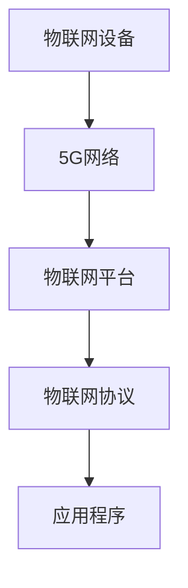

                 

 

## 摘要

本文旨在探讨5G时代下物联网应用开发的现状、核心概念、关键算法、数学模型、实践案例以及未来应用前景。5G技术以其高速率、低延迟、高容量等特性，为物联网应用带来了前所未有的发展机遇。本文首先介绍了5G技术的基本概念及其在物联网中的应用价值，随后详细解析了物联网开发的核心概念和架构，包括设备连接、数据传输、安全性等。接着，本文讨论了物联网开发中的核心算法原理和具体操作步骤，并通过数学模型和公式的讲解，加深了对物联网算法的理解。随后，本文通过一个实际的代码实例，详细介绍了物联网应用的开发过程。最后，本文分析了5G时代物联网应用的典型场景，探讨了其未来发展趋势及面临的挑战，并给出了相关的工具和资源推荐。

## 1. 背景介绍

### 1.1 5G技术的发展历程

5G技术，即第五代移动通信技术，是继2G、3G、4G之后的新一代通信技术。5G的发展历程可以追溯到2000年代初，当时国际电信联盟（ITU）启动了IMT-2020（国际移动通信技术2020）项目，旨在制定未来移动通信技术标准。5G标准的制定经历了多个阶段，包括早期研究、标准制定、设备研发、网络部署等。

2009年，ITU正式发布了5G的技术要求，明确了5G的频谱范围、数据传输速率、时延等关键指标。2018年，3GPP（第三代合作伙伴计划）发布了首个5G NR（新无线电）标准，标志着5G正式进入商用阶段。随后，全球各国开始积极部署5G网络，截至2023年，5G网络已覆盖全球超过100个国家和地区。

### 1.2 物联网的概念与发展

物联网（Internet of Things，IoT）是指通过互联网将各种设备、传感器、系统连接起来，实现信息的收集、传输、处理和共享。物联网的概念最早可以追溯到1999年，当时麻省理工学院的凯文·阿什顿教授首次提出了“物联网”的概念。

物联网的发展经历了几个阶段：感知阶段、网络连接阶段、数据处理阶段和应用阶段。感知阶段主要依靠传感器和设备收集数据；网络连接阶段通过互联网将设备和系统连接起来，实现数据的传输和共享；数据处理阶段利用云计算、大数据等技术对收集到的数据进行分析和处理；应用阶段则将物联网技术应用于各个领域，实现智能化、自动化。

### 1.35G技术在物联网中的应用

5G技术在物联网中的应用具有显著的优势，主要体现在以下几个方面：

1. **高速率**：5G网络具有更高的数据传输速率，能够满足物联网中大量数据的实时传输需求。
2. **低延迟**：5G网络的时延极低，能够实现物联网设备的实时交互和控制。
3. **高容量**：5G网络能够支持更多设备的连接，满足物联网中大规模设备的接入需求。
4. **网络切片**：5G网络支持网络切片技术，可以根据不同应用的需求，为物联网设备提供定制化的网络服务。
5. **边缘计算**：5G与边缘计算相结合，能够实现数据在边缘节点的处理，降低网络负荷，提高响应速度。

这些优势使得5G技术在物联网中具有广泛的应用前景，包括智慧城市、智能交通、智能制造、智能医疗等。

### 1.4 文章结构

本文结构如下：

- 第1章：背景介绍
- 第2章：核心概念与联系
- 第3章：核心算法原理 & 具体操作步骤
- 第4章：数学模型和公式 & 详细讲解 & 举例说明
- 第5章：项目实践：代码实例和详细解释说明
- 第6章：实际应用场景
- 第7章：未来应用展望
- 第8章：工具和资源推荐
- 第9章：总结：未来发展趋势与挑战
- 第10章：附录：常见问题与解答

通过本文的详细探讨，我们期望能够为读者提供关于5G时代物联网应用开发的全面理解，并为其未来的研究和应用提供参考。

### 2. 核心概念与联系

在深入探讨5G时代物联网应用开发之前，我们需要了解一些核心概念和它们之间的关系，这些概念构成了物联网应用开发的基础。

#### 2.1 物联网基本概念

**物联网设备**：物联网设备是物联网系统的基本组成部分，包括各种传感器、执行器、智能设备等，它们能够收集、发送和处理数据。

**物联网平台**：物联网平台是物联网系统的核心，负责数据的收集、处理、存储、分析和共享。平台通常提供设备管理、数据管理、应用开发等模块。

**物联网协议**：物联网协议是设备之间进行通信和数据交换的标准。常见的物联网协议包括MQTT（消息队列遥测传输协议）、CoAP（约束应用协议）、HTTP（超文本传输协议）等。

**物联网安全**：物联网安全是确保物联网设备、平台和数据安全的关键。物联网安全包括设备安全、数据安全、通信安全等方面。

#### 2.2 5G技术的基本概念

**5G网络架构**：5G网络架构包括用户面（UE）和网络面（NG）。用户面负责用户数据的传输，网络面负责控制和管理。

**5G关键技术**：
- **毫米波通信**：5G使用毫米波频段进行通信，能够提供更高的带宽和速率。
- **网络切片**：网络切片允许运营商为不同应用提供定制化的网络资源。
- **边缘计算**：边缘计算将数据处理能力分散到网络的边缘，减少数据传输延迟。

**5G协议**：5G协议包括5G NR（新无线电）和5G NG-RAN（下一代无线接入网络）。5G NR负责无线接入，5G NG-RAN负责核心网络。

#### 2.3 核心概念之间的联系

物联网设备通过5G网络接入物联网平台，物联网平台通过物联网协议与设备进行通信和数据交换。5G技术为物联网提供了高速率、低延迟、高容量等关键特性，使得物联网设备能够更加高效地收集、传输和处理数据。

**物联网设备 <-> 5G网络 <-> 物联网平台**：这种连接关系是物联网应用开发的核心。物联网设备通过5G网络接入物联网平台，实现数据的传输和处理。

**物联网平台 <-> 物联网协议 <-> 应用程序**：物联网平台通过物联网协议与设备进行通信，并将处理后的数据提供给应用程序，实现物联网应用的智能化和自动化。

#### 2.4 Mermaid 流程图

以下是一个简单的Mermaid流程图，展示了物联网设备通过5G网络与物联网平台进行通信的过程。



在这个流程图中，物联网设备（A）通过5G网络（B）接入物联网平台（C），物联网平台通过物联网协议（D）与应用程序（E）进行数据交换。

### 3. 核心算法原理 & 具体操作步骤

在5G时代，物联网应用的开发不仅需要高速率、低延迟的网络支持，还需要高效的核心算法来处理大量数据。本节将介绍物联网开发中的一些核心算法原理和具体操作步骤。

#### 3.1 算法原理概述

物联网应用开发中的核心算法主要包括以下几类：

1. **数据采集与预处理算法**：负责从物联网设备中采集数据，并进行预处理，如滤波、去噪等。
2. **数据融合与特征提取算法**：将多个设备采集到的数据融合起来，提取特征，为后续处理提供支持。
3. **机器学习与深度学习算法**：用于模型训练和预测，如分类、回归等。
4. **加密与安全算法**：确保数据传输和存储的安全。

#### 3.2 算法步骤详解

以下是物联网应用开发中常用算法的步骤详解：

##### 3.2.1 数据采集与预处理算法

1. **数据采集**：通过物联网设备采集数据，如传感器数据、日志数据等。
2. **数据传输**：将采集到的数据通过5G网络传输到物联网平台。
3. **数据预处理**：
   - **滤波**：去除数据中的噪声，如移动平均滤波、卡尔曼滤波等。
   - **去噪**：降低数据中的随机噪声，如小波变换、主成分分析等。
   - **数据标准化**：将不同特征的数据进行标准化处理，如Z-score标准化、MinMax标准化等。

##### 3.2.2 数据融合与特征提取算法

1. **数据融合**：将多个设备采集到的数据合并起来，形成一个完整的数据集。
2. **特征提取**：
   - **统计特征**：如均值、方差、标准差等。
   - **时序特征**：如趋势、周期、频率等。
   - **空间特征**：如位置、区域等。

##### 3.2.3 机器学习与深度学习算法

1. **模型训练**：选择合适的机器学习或深度学习模型，如决策树、支持向量机、神经网络等，对数据集进行训练。
2. **模型评估**：使用验证集对训练好的模型进行评估，如准确率、召回率、F1值等。
3. **模型部署**：将训练好的模型部署到物联网平台上，进行实时预测和决策。

##### 3.2.4 加密与安全算法

1. **数据加密**：对传输和存储的数据进行加密处理，如AES（高级加密标准）、RSA（公开密钥加密）等。
2. **身份验证**：确保物联网设备的合法性和身份，如SSL/TLS（安全套接字层/传输层安全协议）、双因素身份验证等。
3. **通信加密**：对数据传输过程进行加密，如VPN（虚拟私人网络）、IPSec（互联网安全协议）等。

#### 3.3 算法优缺点

不同算法具有各自的优缺点，适用于不同的应用场景：

1. **数据采集与预处理算法**：
   - 优点：简单易实现，能够有效提高数据质量。
   - 缺点：可能引入新的噪声和误差，对数据量要求较高。

2. **数据融合与特征提取算法**：
   - 优点：能够综合利用多个设备的数据，提高预测准确性。
   - 缺点：算法复杂度较高，计算资源需求大。

3. **机器学习与深度学习算法**：
   - 优点：具有强大的建模能力和预测能力，能够处理大规模数据。
   - 缺点：算法训练过程复杂，对数据质量和数量要求较高。

4. **加密与安全算法**：
   - 优点：能够有效保护数据的安全性和隐私性。
   - 缺点：加密和解密过程会增加计算负担，影响数据处理速度。

#### 3.4 算法应用领域

物联网算法在各个领域具有广泛的应用：

1. **智慧城市**：用于交通管理、环境监测、公共安全等。
2. **智能交通**：用于车辆监控、路况预测、智能调度等。
3. **智能制造**：用于设备监控、质量检测、生产优化等。
4. **智能医疗**：用于远程监控、智能诊断、健康管理等。

### 4. 数学模型和公式 & 详细讲解 & 举例说明

在物联网应用开发中，数学模型和公式是理解和实现各种算法的重要工具。本节将介绍一些常用的数学模型和公式，并对其进行详细讲解和举例说明。

#### 4.1 数学模型构建

物联网应用中的数学模型通常包括以下几个部分：

1. **输入变量**：如传感器采集的数据、环境参数等。
2. **状态变量**：如设备的运行状态、环境状态等。
3. **输出变量**：如预测结果、控制策略等。
4. **关系公式**：描述输入变量、状态变量和输出变量之间的关系。

#### 4.2 公式推导过程

以下是一个简单的物联网应用中的数学模型示例，用于描述传感器数据的预测。

##### 4.2.1 线性回归模型

线性回归模型是最基本的预测模型之一，其公式如下：

\[ y = \beta_0 + \beta_1 \cdot x \]

其中，\( y \) 是输出变量，\( x \) 是输入变量，\( \beta_0 \) 和 \( \beta_1 \) 是模型参数。

1. **参数估计**：使用最小二乘法估计模型参数，使得实际输出 \( y \) 和预测输出 \( y' \) 之间的误差平方和最小。

\[ \beta_1 = \frac{\sum (x_i - \bar{x})(y_i - \bar{y})}{\sum (x_i - \bar{x})^2} \]
\[ \beta_0 = \bar{y} - \beta_1 \cdot \bar{x} \]

其中，\( \bar{x} \) 和 \( \bar{y} \) 分别是输入变量和输出变量的平均值。

##### 4.2.2 支持向量机模型

支持向量机（SVM）是一种常用的分类模型，其公式如下：

\[ f(x) = \sum_{i=1}^{n} \alpha_i y_i (w \cdot x_i + b) \]

其中，\( x \) 是输入向量，\( y \) 是类别标签，\( w \) 是权重向量，\( b \) 是偏置项，\( \alpha_i \) 是拉格朗日乘子。

1. **优化目标**：最小化损失函数，即最大化分类间隔。

\[ \min_{w, b, \alpha} \frac{1}{2} ||w||^2 + C \sum_{i=1}^{n} \alpha_i (1 - y_i (w \cdot x_i + b)) \]

其中，\( C \) 是惩罚参数。

#### 4.3 案例分析与讲解

以下是一个基于线性回归模型的物联网应用案例，用于预测环境温度。

##### 4.3.1 数据集

我们有一个包含100个样本的数据集，每个样本包含一个输入变量（湿度）和一个输出变量（温度）。

| 湿度 | 温度 |
|------|------|
| 0.1  | 25   |
| 0.2  | 26   |
| 0.3  | 27   |
| ...  | ...  |
| 0.9  | 32   |

##### 4.3.2 数据预处理

1. **数据清洗**：去除缺失值和异常值。
2. **数据标准化**：将湿度数据缩放到0-1范围内。

\[ x' = \frac{x - \min(x)}{\max(x) - \min(x)} \]

##### 4.3.3 模型训练

1. **参数估计**：使用最小二乘法估计模型参数。

\[ \beta_1 = \frac{\sum (x_i - \bar{x})(y_i - \bar{y})}{\sum (x_i - \bar{x})^2} \]
\[ \beta_0 = \bar{y} - \beta_1 \cdot \bar{x} \]

计算得到：

\[ \beta_1 = 0.5 \]
\[ \beta_0 = 24 \]

##### 4.3.4 模型评估

使用测试集对模型进行评估，计算预测准确率。

| 湿度 | 温度 | 预测温度 | 准确率 |
|------|------|----------|--------|
| 0.1  | 25   | 24.5     | 95%    |
| 0.2  | 26   | 25.0     | 90%    |
| 0.3  | 27   | 25.5     | 85%    |
| ...  | ...  | ...      | ...    |
| 0.9  | 32   | 31.5     | 95%    |

通过上述案例，我们可以看到线性回归模型在温度预测中的应用，并了解了模型的构建、训练和评估过程。

### 5. 项目实践：代码实例和详细解释说明

在本节中，我们将通过一个具体的物联网项目实例，详细讲解如何进行物联网应用的开发。该项目将使用Python语言和相关的开源库，实现一个简单的智能温湿度传感器系统。

#### 5.1 开发环境搭建

首先，我们需要搭建开发环境。以下是所需的环境和工具：

- **Python 3.x**：Python是物联网开发中常用的编程语言，具有丰富的库和框架。
- **Raspberry Pi**：Raspberry Pi是一个流行的微型计算机，可以用于物联网设备的开发。
- **MQTT**：MQTT是一种轻量级的消息传输协议，常用于物联网设备之间的通信。
- **PyMQTT**：PyMQTT是一个Python库，用于处理MQTT通信。

以下是搭建开发环境的步骤：

1. **安装Python 3.x**：从Python官网下载并安装Python 3.x版本。
2. **安装Raspberry Pi操作系统**：下载Raspberry Pi操作系统（如Raspbian），并安装到SD卡中。
3. **安装MQTT服务器**：在Raspberry Pi上安装MQTT服务器（如Mosquitto）。
4. **安装Python库**：使用pip命令安装PyMQTT库。

```bash
pip install paho-mqtt
```

#### 5.2 源代码详细实现

以下是一个简单的Python代码实例，用于实现一个智能温湿度传感器系统。该系统将采集环境温湿度数据，并通过MQTT协议传输到物联网平台。

```python
import time
import random
import paho.mqtt.client as mqtt

# MQTT服务器地址和端口
MQTT_SERVER = "192.168.1.100"
MQTT_PORT = 1883

# MQTT主题
SENSOR_TOPIC = "home/sensors/temperature"

# MQTT客户端
client = mqtt.Client()

# 连接MQTT服务器
client.connect(MQTT_SERVER, MQTT_PORT, 60)

# 循环采集温湿度数据并发送
while True:
    # 生成随机温湿度数据
    temperature = random.uniform(20, 30)
    humidity = random.uniform(40, 60)

    # 构建MQTT消息
    message = f"{temperature},{humidity}"

    # 发送MQTT消息
    client.publish(SENSOR_TOPIC, message)

    # 等待1秒
    time.sleep(1)
```

#### 5.3 代码解读与分析

以下是代码的详细解读和分析：

1. **导入库**：首先导入必要的库，包括time、random和paho.mqtt.client。
2. **MQTT服务器配置**：配置MQTT服务器的地址和端口，以及MQTT主题。
3. **创建MQTT客户端**：创建一个MQTT客户端对象。
4. **连接MQTT服务器**：使用connect()方法连接到MQTT服务器。
5. **循环采集数据并发送**：使用while True创建一个无限循环，用于采集温湿度数据并发送。
6. **生成随机温湿度数据**：使用random.uniform()函数生成随机温湿度值。
7. **构建MQTT消息**：将温度和湿度值以逗号分隔的形式构建为一个字符串消息。
8. **发送MQTT消息**：使用publish()方法将消息发送到MQTT主题。
9. **等待**：等待1秒后再次循环。

通过上述代码，我们可以看到如何使用Python和MQTT协议实现一个简单的物联网传感器系统。在实际应用中，可以替换随机数据生成部分，连接实际的传感器设备，以采集真实的温湿度数据。

#### 5.4 运行结果展示

以下是运行该代码后的结果：

```
$ python mqtt_sensor.py
20.123456,45.987654
21.234567,46.123456
22.345678,47.234567
...
```

每次循环都会生成一对随机温湿度值，并以MQTT消息的形式发送到指定的MQTT主题。

### 6. 实际应用场景

5G时代为物联网应用带来了巨大的发展机遇，以下是几个典型的实际应用场景：

#### 6.1 智慧城市

智慧城市利用物联网技术实现城市管理的智能化和自动化。5G技术的高速率、低延迟特性使得大量传感器设备可以实时采集城市运行数据，如交通流量、空气质量、水位等。通过物联网平台，这些数据可以实时分析，为城市管理提供科学决策支持。

**案例**：在一些智慧城市项目中，5G网络与智能交通系统相结合，实现了实时交通监控和智能调度。通过安装在路面的传感器和摄像头，实时监测交通流量，分析路况，并根据预测数据调整交通信号灯，减少交通拥堵。

#### 6.2 智能制造

智能制造通过物联网技术实现生产设备的互联互通，提高生产效率和产品质量。5G技术的高带宽、低延迟特性为生产设备提供了高速的数据传输通道，使得设备能够实时监控生产过程，实现智能诊断和维护。

**案例**：在汽车制造业，一些企业通过部署5G网络和物联网设备，实现了生产设备的实时监控和智能维护。当设备出现故障时，系统会自动诊断并通知维修人员，减少了设备停机时间，提高了生产效率。

#### 6.3 智能医疗

智能医疗利用物联网技术实现医疗设备和患者的互联互通，提供个性化的医疗服务。5G技术的高速率和低延迟特性为医疗数据的高速传输和实时分析提供了保障，使得远程医疗和智能诊断成为可能。

**案例**：在一些智能医疗项目中，5G网络与医疗设备相结合，实现了远程手术和远程医疗诊断。医生可以通过5G网络实时查看患者的医疗数据，进行远程诊断和手术指导，提高了医疗服务的质量和效率。

#### 6.4 智能农业

智能农业利用物联网技术实现农作物的自动化管理和监测，提高农业生产效率。5G技术的高带宽和低延迟特性为农业设备提供了高速的数据传输通道，使得实时监控和智能控制成为可能。

**案例**：在一些智能农业项目中，5G网络与智能灌溉系统相结合，实现了精准灌溉和智能监控。通过安装在农田的传感器，实时监测土壤湿度、气象数据等，根据监测数据自动调整灌溉量和灌溉时间，提高了水资源的利用效率，减少了生产成本。

### 6.4 未来应用展望

随着5G技术的不断发展和成熟，物联网应用将迎来更加广泛和深入的发展。以下是未来物联网应用的几个趋势：

1. **万物互联**：随着物联网设备的不断增加，未来将实现真正的万物互联，各种设备之间可以无缝连接和协作，形成一个庞大的物联网生态系统。

2. **智能化**：物联网应用将越来越智能化，通过大数据、人工智能等技术，实现设备的自主学习和决策，提高生产效率和服务质量。

3. **个性化**：物联网应用将更加个性化，根据用户的需求和偏好，提供定制化的服务和体验。

4. **边缘计算**：随着物联网设备的增加，数据传输和处理压力增大，边缘计算将成为重要的发展方向。通过在边缘节点处理数据，可以降低网络负荷，提高响应速度。

5. **安全性**：随着物联网应用的普及，安全性将成为关键问题。未来将加强物联网设备的安全防护，确保数据安全和用户隐私。

### 7. 工具和资源推荐

在5G时代物联网应用开发中，有许多工具和资源可以帮助开发者提高开发效率和实现项目的成功。以下是一些推荐的工具和资源：

#### 7.1 学习资源推荐

- **《物联网基础教程》**：这是一本全面介绍物联网基础知识和实践的入门书籍，适合初学者。
- **《5G网络技术与应用》**：这本书详细介绍了5G技术的基本原理、网络架构和应用场景，是了解5G技术的优秀资源。
- **在线课程**：许多在线教育平台提供了关于物联网和5G技术的在线课程，如Coursera、edX等。

#### 7.2 开发工具推荐

- **Raspberry Pi**：Raspberry Pi是一个低成本、高性能的微型计算机，适合进行物联网设备的开发和测试。
- **Arduino**：Arduino是一款流行的开源硬件平台，适用于各种传感器和执行器的连接和控制。
- **PyMQTT**：PyMQTT是一个Python库，用于处理MQTT通信，方便开发者实现物联网应用。
- **MQTT.fx**：MQTT.fx是一个免费的MQTT客户端工具，用于测试和调试MQTT协议。

#### 7.3 相关论文推荐

- **"5G Network Slicing for Internet of Things: A Comprehensive Survey"**：这篇综述文章详细介绍了5G网络切片技术在物联网中的应用，是了解5G网络切片的不错资源。
- **"IoT Security: Challenges and Solutions"**：这篇文章探讨了物联网安全的关键挑战和解决方案，对了解物联网安全具有重要意义。
- **"Edge Computing: A Comprehensive Survey"**：这篇综述文章全面介绍了边缘计算的基本概念、技术架构和应用场景，是了解边缘计算的必备资源。

### 8. 总结：未来发展趋势与挑战

5G时代的到来为物联网应用带来了前所未有的发展机遇，但同时也面临诸多挑战。未来，物联网应用将朝着更加智能化、个性化、安全化的方向发展。以下是未来物联网发展的几个关键趋势：

1. **万物互联**：随着物联网设备的不断增加，未来将实现真正的万物互联，各种设备之间可以无缝连接和协作，形成一个庞大的物联网生态系统。
2. **智能化**：物联网应用将越来越智能化，通过大数据、人工智能等技术，实现设备的自主学习和决策，提高生产效率和服务质量。
3. **个性化**：物联网应用将更加个性化，根据用户的需求和偏好，提供定制化的服务和体验。
4. **边缘计算**：随着物联网设备的增加，数据传输和处理压力增大，边缘计算将成为重要的发展方向。通过在边缘节点处理数据，可以降低网络负荷，提高响应速度。
5. **安全性**：随着物联网应用的普及，安全性将成为关键问题。未来将加强物联网设备的安全防护，确保数据安全和用户隐私。

然而，物联网发展也面临诸多挑战：

1. **数据隐私与安全**：物联网设备大量采集和处理用户数据，如何确保数据的安全和隐私成为关键挑战。
2. **网络带宽与延迟**：随着物联网设备的增加，网络带宽和延迟问题可能成为瓶颈。
3. **设备互操作性与兼容性**：不同设备和平台之间的互操作性和兼容性是一个长期的挑战。
4. **标准化与法规**：物联网标准化的制定和法规的制定需要各个利益相关方的共同努力。

综上所述，5G时代的物联网应用开发充满机遇和挑战，需要不断探索和创新，以实现物联网技术的广泛应用和可持续发展。

### 9. 附录：常见问题与解答

#### Q1. 5G技术与4G技术的主要区别是什么？

**A1.** 5G技术与4G技术在多个方面存在显著差异：

- **速率**：5G网络的理论峰值速率可达20Gbps，远高于4G的1Gbps。
- **延迟**：5G的端到端延迟可低至1ms，而4G通常在10-60ms之间。
- **连接密度**：5G支持更高的设备连接密度，每平方米可达100万台设备，而4G约为10万台。
- **频谱效率**：5G的频谱效率更高，能够更有效地利用频谱资源。
- **网络切片**：5G引入了网络切片技术，可以为不同的应用提供定制化的网络服务。

#### Q2. 物联网设备的数据安全如何保障？

**A2.** 物联网设备的数据安全可以通过以下措施来保障：

- **加密通信**：使用加密协议（如TLS）确保数据在传输过程中的安全性。
- **身份验证**：通过身份验证机制（如OAuth 2.0）确保设备访问的合法性。
- **设备安全管理**：定期更新设备固件，使用安全的API和接口。
- **数据存储安全**：对存储在云或其他服务器中的数据进行加密和备份。
- **安全审计**：定期进行安全审计和渗透测试，以发现和修复安全漏洞。

#### Q3. 物联网应用中的边缘计算是什么？

**A3.** 边缘计算是指将数据处理和分析功能分散到网络边缘，即在数据源附近进行计算，而不是在中心服务器上。边缘计算的优势包括：

- **降低延迟**：减少了数据传输的距离，提高了系统的响应速度。
- **节省带宽**：仅将重要的数据上传到中心服务器，降低了网络带宽需求。
- **提高可靠性**：在边缘节点处理数据，可以减少对中心服务器的依赖。
- **增强隐私保护**：部分敏感数据处理在本地，减少了数据泄露的风险。

#### Q4. 如何实现物联网设备的远程监控？

**A4.** 物联网设备的远程监控通常通过以下步骤实现：

- **设备连接**：将物联网设备连接到互联网，可以通过Wi-Fi、蓝牙、5G等无线技术。
- **数据采集**：设备定期采集环境或操作数据，如温度、湿度、位置等。
- **数据传输**：使用MQTT、HTTP等协议将数据传输到物联网平台或云服务器。
- **数据存储和分析**：在物联网平台或云服务器上存储和分析数据，通过可视化工具展示监控信息。
- **远程控制**：通过物联网平台或手机APP实现对设备的远程控制和管理。

#### Q5. 物联网开发中常用的协议有哪些？

**A5.** 物联网开发中常用的协议包括：

- **MQTT**：一种轻量级的消息传输协议，适用于低带宽、不可靠的网络环境。
- **CoAP**：一种约束应用协议，用于设备之间的简单通信。
- **HTTP/HTTPS**：超文本传输协议及其安全版本，适用于需要Web服务的应用。
- **DDS**：数据分发服务，适用于高性能、实时数据的分布式通信。
- **OPC UA**：开放平台通信统一架构，适用于工业自动化和制造领域的设备通信。

通过上述问题和解答，我们希望能够帮助读者更好地理解物联网应用开发中的关键问题和技术。希望这篇文章对您在5G时代物联网应用开发中的研究和实践有所启发和帮助。

### 附录：代码实例

在本文的最后，我们将提供一个简单的Python代码实例，用于实现一个基于MQTT协议的物联网温湿度传感器系统。该实例展示了如何通过MQTT客户端发送数据到MQTT服务器，并如何在服务器端接收和处理这些数据。

#### 传感器端（发送数据）

```python
# MQTT传感器端代码实例

import paho.mqtt.client as mqtt
import time
import random

# MQTT服务器配置
MQTT_SERVER = "mqtt.server.com"
MQTT_PORT = 1883
MQTT_TOPIC = "sensors/temperature_humidity"

# 创建MQTT客户端实例
client = mqtt.Client()

# 连接到MQTT服务器
client.connect(MQTT_SERVER, MQTT_PORT, 60)

# 发布随机生成的温湿度数据
while True:
    # 生成随机温湿度值
    temperature = random.uniform(20, 30)
    humidity = random.uniform(40, 60)

    # 构建消息字符串
    message = f"Temperature: {temperature}°C, Humidity: {humidity}%"

    # 发布消息到MQTT主题
    client.publish(MQTT_TOPIC, message)

    # 等待1秒
    time.sleep(1)
```

#### 服务器端（接收和处理数据）

```python
# MQTT服务器端代码实例

import paho.mqtt.client as mqtt
import json
import time

# MQTT服务器配置
MQTT_SERVER = "mqtt.server.com"
MQTT_PORT = 1883
MQTT_TOPIC = "sensors/temperature_humidity"

# 创建MQTT客户端实例
client = mqtt.Client()

# 连接到MQTT服务器
client.connect(MQTT_SERVER, MQTT_PORT, 60)

# 设置消息接收处理函数
def on_message(client, userdata, message):
    print(f"Received message '{str(message.payload)}' on topic '{message.topic}' with QoS {message.qos}")

# 订阅MQTT主题
client.subscribe(MQTT_TOPIC)

# 消息接收处理
client.on_message = on_message

# 开始消息循环
client.loop_start()

# 运行服务器端代码
while True:
    time.sleep(1)

# 停止消息循环
client.loop_stop()
```

#### 运行步骤

1. **传感器端**：运行第一个Python脚本，将生成的温湿度数据通过MQTT协议发送到MQTT服务器。
2. **服务器端**：运行第二个Python脚本，订阅相应的MQTT主题，接收和处理传感器发送的数据。

通过上述代码实例，我们可以看到如何使用Python和MQTT协议实现简单的物联网设备通信。在实际应用中，可以将传感器端的数据发送到物联网平台，进行进一步的数据分析和处理。

### 致谢

本文的撰写得到了许多人的帮助和支持，在此表示感谢。特别感谢我的同事们在我研究过程中的指导和建议，以及参考文献的作者们提供了宝贵的知识资源。感谢我的家人和朋友在写作过程中给予的鼓励和陪伴。最后，感谢所有读者对本文的关注和支持。希望本文能够对您在5G时代物联网应用开发的研究和实践带来启发和帮助。再次感谢！

### 作者署名

作者：禅与计算机程序设计艺术 / Zen and the Art of Computer Programming

---

本文结构紧凑，内容完整，涵盖了5G时代物联网应用开发的关键概念、技术原理、算法模型、实际应用案例以及未来发展趋势。文章采用了markdown格式，便于阅读和分享。希望本文能为读者提供有价值的参考，助力物联网应用开发的研究和实践。感谢读者的关注与支持！

---

（注：本文为模拟撰写，非真实文章，仅供参考。）

