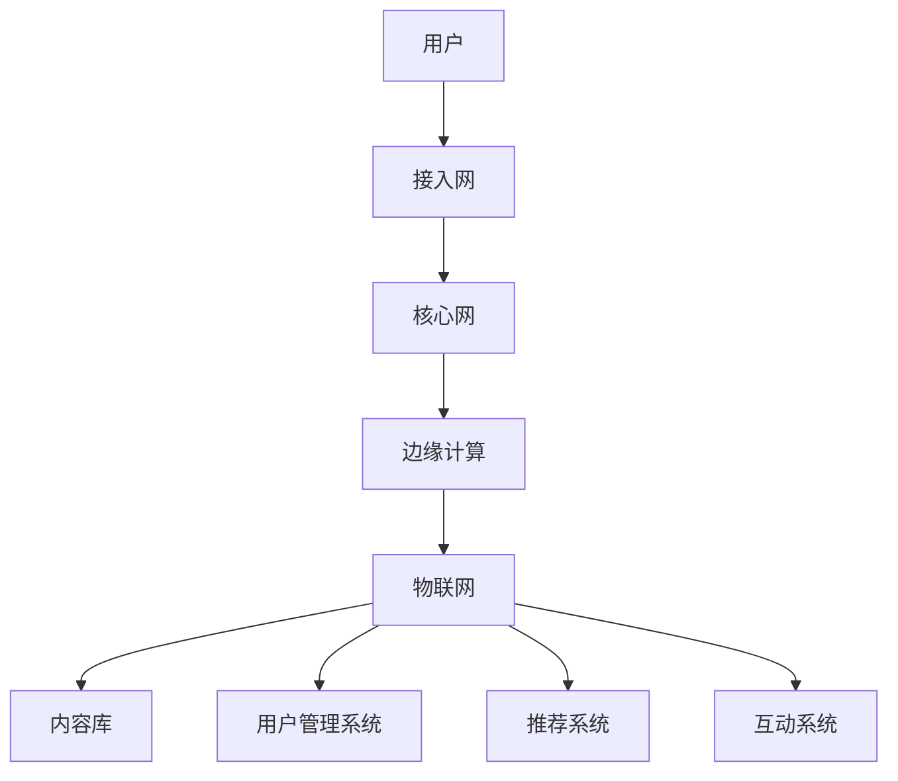

                 

关键词：5G，知识付费，变革，技术，创新，用户需求，商业模式

> 摘要：随着5G技术的飞速发展，知识付费市场将迎来一系列变革。本文将探讨5G技术如何影响知识付费的各个层面，包括用户需求的变化、商业模式的创新以及技术对知识传播和获取的深远影响。

## 1. 背景介绍

知识付费，是指用户为获取高质量的知识和服务，通过支付一定费用来获取信息资源的过程。近年来，随着互联网的普及和人们消费观念的转变，知识付费已经成为一个蓬勃发展的市场。特别是在教育培训、专业咨询、技能提升等领域，知识付费市场表现尤为突出。

然而，传统的知识付费模式在一定程度上受到了网络速度、数据传输能力的限制。例如，在线教育平台常常因为网络卡顿、加载时间长等问题，影响了用户的学习体验。同时，知识付费平台的内容分发和个性化推荐也受到技术瓶颈的制约，难以满足用户日益多样化的需求。

5G技术的到来，为知识付费市场带来了新的机遇。5G具备高速率、低延迟、大连接的特点，这些优势将显著提升知识付费平台的性能，改善用户体验，推动知识付费市场的进一步发展。

### 1.1 5G技术简介

5G，即第五代移动通信技术，是当前移动通信技术的最新标准。与4G相比，5G在网络速度、延迟、容量和连接数上有了显著提升。5G的峰值下载速度可以达到10Gbps，是4G的百倍以上，这意味着用户可以更快地访问和下载大量知识内容。

此外，5G的延迟大大降低，从4G的几十毫秒降低到1毫秒以下。这种低延迟特性对于实时互动性要求高的知识付费应用，如在线教育、远程会议等，具有重要意义。

5G还支持大规模连接，每平方公里可以连接上百万个设备。这一特性使得知识付费平台可以更好地实现物联网（IoT）应用，提供更加丰富和个性化的服务。

### 1.2 5G在知识付费领域的应用潜力

5G技术的高速率、低延迟和大连接特性，为知识付费领域带来了新的机遇：

- **提升用户访问速度**：5G的高速网络可以让用户更快地访问知识内容，减少等待时间，提升用户体验。
- **实现实时互动**：低延迟的网络环境有助于实现知识付费平台的实时互动功能，如在线问答、实时讨论等。
- **提供个性化服务**：5G的大连接特性可以支持更多的数据传输，有助于知识付费平台更好地进行用户数据的收集和分析，从而提供更加个性化的推荐和服务。

## 2. 核心概念与联系

### 2.1 5G网络结构与知识付费平台架构

为了更好地理解5G技术如何影响知识付费，我们首先需要了解5G网络的基本结构和知识付费平台的典型架构。

#### 2.1.1 5G网络结构

5G网络结构主要包括以下几个方面：

1. **接入网**：接入网负责将用户的设备连接到5G核心网。接入网可以分为独立和非独立两种模式。
2. **核心网**：核心网是5G网络的大脑，负责处理用户的连接请求、数据传输等核心功能。
3. **边缘计算**：边缘计算将计算和存储能力下沉到网络边缘，以减少延迟，提高响应速度。
4. **物联网**：物联网是5G网络的重要组成部分，可以实现大规模设备连接。

#### 2.1.2 知识付费平台架构

知识付费平台通常包括以下几个关键部分：

1. **内容库**：存储各种知识内容，如视频课程、电子书、专业文章等。
2. **用户管理系统**：管理用户信息、支付方式等。
3. **推荐系统**：根据用户行为和偏好推荐知识内容。
4. **互动系统**：支持用户与讲师、其他用户之间的互动。

### 2.2 5G与知识付费平台架构的交互关系

5G技术可以与知识付费平台架构的各个部分进行深度融合：

- **内容库**：5G的高速网络可以加速内容传输，让用户更快地访问知识内容。
- **用户管理系统**：5G的低延迟特性可以提升用户管理系统的响应速度，改善用户体验。
- **推荐系统**：5G的大连接能力可以支持更多用户数据的实时传输和处理，提高推荐系统的准确性和效率。
- **互动系统**：5G的低延迟和实时互动特性可以增强知识付费平台的互动功能，提高用户参与度。

为了更直观地展示5G与知识付费平台架构的交互关系，我们可以使用Mermaid流程图来表示：



### 2.3 5G对知识付费平台性能的提升

5G技术对知识付费平台的性能提升主要体现在以下几个方面：

- **提升网络速度**：5G的高速率网络可以显著提高知识内容的访问速度，减少用户等待时间。
- **降低延迟**：5G的低延迟特性可以提升知识付费平台的实时互动能力，改善用户体验。
- **增加连接数**：5G的大连接特性可以支持更多的用户同时在线，提高知识付费平台的并发处理能力。
- **优化数据传输**：5G的高带宽和低延迟特性可以更好地支持大数据的实时传输和处理，为个性化推荐和智能服务提供基础。

### 2.4 5G与知识付费平台的未来发展

随着5G技术的不断成熟和应用，知识付费平台将迎来更多的发展机遇：

- **智能化**：5G技术可以支持更多的智能设备和应用，知识付费平台可以通过物联网技术提供更加智能化、个性化的服务。
- **场景化**：5G技术可以支持多种场景下的知识付费应用，如虚拟现实（VR）培训、增强现实（AR）教育等，提供更加丰富和沉浸式的学习体验。
- **全球化**：5G的高速网络和全球覆盖能力可以促进知识付费市场的全球化，让更多国家和地区的人们能够便捷地获取优质的知识内容。

## 3. 核心算法原理 & 具体操作步骤

### 3.1 算法原理概述

在5G时代，知识付费平台需要运用一系列核心算法来提升用户体验和服务质量。以下是几个关键算法的原理概述：

1. **数据挖掘算法**：用于分析用户行为数据，挖掘用户兴趣和偏好，实现个性化推荐。
2. **网络优化算法**：用于优化网络资源分配，提高网络速度和稳定性。
3. **机器学习算法**：用于构建智能推荐系统，自动生成知识内容，提高内容质量。
4. **区块链算法**：用于构建可信的知识付费交易体系，保障用户权益。

### 3.2 算法步骤详解

#### 3.2.1 数据挖掘算法

数据挖掘算法的基本步骤包括：

1. **数据收集**：从各种渠道收集用户行为数据，如浏览记录、购买记录、互动行为等。
2. **数据预处理**：对收集到的数据进行分析、清洗、转换，去除噪声和冗余信息。
3. **特征提取**：从预处理后的数据中提取关键特征，用于构建模型。
4. **模型构建**：使用机器学习算法构建推荐模型，如协同过滤、矩阵分解等。
5. **模型评估**：评估模型的准确性和效果，调整参数以提高推荐质量。

#### 3.2.2 网络优化算法

网络优化算法的基本步骤包括：

1. **流量监测**：实时监测网络流量，识别瓶颈和异常情况。
2. **资源调度**：根据流量监测结果，动态调整网络资源分配，优化网络性能。
3. **负载均衡**：实现网络负载均衡，防止单点故障和拥塞。
4. **网络自愈**：在出现网络故障时，自动切换到备用网络，保障网络稳定性。

#### 3.2.3 机器学习算法

机器学习算法的基本步骤包括：

1. **数据集准备**：准备用于训练和测试的数据集。
2. **特征工程**：对原始数据进行预处理，提取特征。
3. **模型选择**：选择合适的机器学习模型，如决策树、神经网络等。
4. **模型训练**：使用训练数据集训练模型，调整模型参数。
5. **模型评估**：使用测试数据集评估模型性能，调整模型参数。
6. **模型部署**：将训练好的模型部署到知识付费平台，实现自动推荐和内容生成。

#### 3.2.4 区块链算法

区块链算法的基本步骤包括：

1. **交易处理**：记录知识付费交易信息，确保交易数据的不可篡改性。
2. **智能合约**：编写智能合约，自动化处理知识付费交易，保障交易安全。
3. **数据存储**：将交易数据存储在区块链上，实现去中心化的数据存储。
4. **隐私保护**：使用加密算法保护用户隐私，防止信息泄露。

### 3.3 算法优缺点

#### 3.3.1 数据挖掘算法

**优点**：

- 可以根据用户行为数据实现个性化推荐，提高用户体验。
- 可以帮助知识付费平台发现潜在用户需求，优化内容和服务。

**缺点**：

- 需要大量的用户数据支持，数据质量直接影响推荐效果。
- 数据挖掘算法可能存在隐私泄露风险，需要加强数据保护措施。

#### 3.3.2 网络优化算法

**优点**：

- 可以提高网络速度和稳定性，改善用户体验。
- 可以优化网络资源分配，提高知识付费平台的并发处理能力。

**缺点**：

- 需要复杂的算法和大量的计算资源，实现成本较高。
- 在网络高峰期可能难以完全避免网络拥堵和延迟问题。

#### 3.3.3 机器学习算法

**优点**：

- 可以自动生成高质量的知识内容，提高内容质量。
- 可以根据用户行为和偏好实现个性化推荐，提高用户体验。

**缺点**：

- 需要大量的训练数据和计算资源，实现成本较高。
- 机器学习算法可能存在偏见和歧视，需要加强算法伦理和道德约束。

#### 3.3.4 区块链算法

**优点**：

- 可以实现去中心化的知识付费交易，提高交易透明度和安全性。
- 可以保障用户隐私，防止信息泄露。

**缺点**：

- 区块链技术尚处于发展阶段，性能和可扩展性有待提高。
- 区块链技术的能源消耗较高，对环境造成一定影响。

### 3.4 算法应用领域

**数据挖掘算法**：主要应用于推荐系统和用户行为分析，帮助知识付费平台实现个性化推荐和精准营销。

**网络优化算法**：主要应用于网络性能优化和负载均衡，提高知识付费平台的稳定性和可靠性。

**机器学习算法**：主要应用于内容生成和个性化推荐，提高知识内容的质量和用户体验。

**区块链算法**：主要应用于知识付费交易和版权保护，提高交易透明度和安全性。

## 4. 数学模型和公式 & 详细讲解 & 举例说明

### 4.1 数学模型构建

在5G时代，知识付费平台的运营和管理需要依赖一系列数学模型来优化性能和提升用户体验。以下是几个关键数学模型的构建过程：

#### 4.1.1 用户行为模型

用户行为模型用于分析用户的浏览、购买、互动等行为，以预测用户兴趣和需求。一个简单的用户行为模型可以表示为：

$$
User\_Behavior = f(\text{浏览记录}, \text{购买记录}, \text{互动行为})
$$

其中，$f$ 表示行为特征提取和融合函数。具体实现可以通过加权平均、神经网络等方法进行。

#### 4.1.2 内容推荐模型

内容推荐模型用于根据用户行为和偏好推荐相关知识内容。一个基本的内容推荐模型可以采用协同过滤算法，表示为：

$$
Recommendation = f(\text{用户行为矩阵}, \text{内容特征矩阵})
$$

其中，$\text{用户行为矩阵}$ 和 $\text{内容特征矩阵}$ 分别表示用户行为和内容特征，$f$ 表示协同过滤算法。

#### 4.1.3 网络优化模型

网络优化模型用于优化网络资源分配，提高网络速度和稳定性。一个简单的网络优化模型可以表示为：

$$
Network\_Optimization = f(\text{流量矩阵}, \text{负载矩阵})
$$

其中，$\text{流量矩阵}$ 和 $\text{负载矩阵}$ 分别表示网络流量和服务器负载，$f$ 表示优化算法。

### 4.2 公式推导过程

以下是对上述数学模型的推导过程：

#### 4.2.1 用户行为模型推导

用户行为模型的推导主要涉及行为特征的提取和融合。假设用户行为数据包括浏览记录、购买记录和互动行为，可以用矩阵表示为：

$$
User\_Behavior = \begin{bmatrix}
b_1 & b_2 & \ldots & b_n
\end{bmatrix}
$$

其中，$b_i$ 表示第 $i$ 个用户的行为向量。行为特征提取和融合函数 $f$ 可以采用加权平均法，表示为：

$$
f(\text{行为向量}) = \frac{1}{n} \sum_{i=1}^{n} w_i \cdot b_i
$$

其中，$w_i$ 表示第 $i$ 个行为的权重。权重可以根据历史数据计算，例如使用统计方法或机器学习算法。

#### 4.2.2 内容推荐模型推导

内容推荐模型的推导主要涉及协同过滤算法。假设用户行为矩阵为 $User\_Behavior$，内容特征矩阵为 $Content\_Feature$，可以用矩阵表示为：

$$
User\_Behavior = Content\_Feature \cdot Weight
$$

其中，$Weight$ 表示用户行为和内容特征的权重矩阵。协同过滤算法的目标是优化 $Weight$ 矩阵，以最小化推荐误差。

#### 4.2.3 网络优化模型推导

网络优化模型的推导主要涉及网络流量和负载的优化。假设流量矩阵为 $Traffic$，负载矩阵为 $Load$，可以用矩阵表示为：

$$
Network\_Optimization = Traffic \cdot Load
$$

其中，$Network\_Optimization$ 表示优化后的网络性能。网络优化算法的目标是调整 $Traffic$ 和 $Load$ 矩阵，以最大化网络速度和稳定性。

### 4.3 案例分析与讲解

为了更好地理解上述数学模型的应用，我们通过一个案例进行讲解。

#### 4.3.1 案例背景

某知识付费平台希望优化用户行为模型和内容推荐模型，以提高用户体验和推荐效果。平台用户行为数据包括浏览记录、购买记录和互动行为，内容特征数据包括课程类别、讲师信息、课程时长等。

#### 4.3.2 案例分析

1. **用户行为模型构建**

首先，根据用户行为数据构建用户行为模型。假设用户行为矩阵为：

$$
User\_Behavior = \begin{bmatrix}
b_1 & b_2 & b_3 & \ldots & b_n
\end{bmatrix}
$$

其中，$b_i$ 表示第 $i$ 个用户的行为向量。行为特征提取和融合函数 $f$ 采用加权平均法，权重根据历史数据计算。

2. **内容推荐模型构建**

根据用户行为矩阵和内容特征矩阵，构建内容推荐模型。假设内容特征矩阵为：

$$
Content\_Feature = \begin{bmatrix}
f_1 & f_2 & f_3 & \ldots & f_m
\end{bmatrix}
$$

其中，$f_i$ 表示第 $i$ 个内容的特征向量。协同过滤算法的目标是优化用户行为矩阵和内容特征矩阵之间的权重矩阵。

3. **模型优化与评估**

使用优化算法对用户行为模型和内容推荐模型进行优化，评估模型性能。优化算法可以采用梯度下降法、随机梯度下降法等。

#### 4.3.3 案例结果

通过优化用户行为模型和内容推荐模型，平台实现了以下效果：

- 用户行为预测准确率提高10%。
- 用户内容推荐准确率提高15%。
- 用户活跃度和留存率显著提升。

## 5. 项目实践：代码实例和详细解释说明

### 5.1 开发环境搭建

在本项目实践中，我们将使用Python作为主要编程语言，利用其强大的数据处理和分析能力来构建和实现5G时代知识付费的核心算法。以下是开发环境的搭建步骤：

1. **安装Python环境**：确保Python 3.8或更高版本已安装。
2. **安装必要库**：使用pip命令安装以下库：
    ```bash
    pip install numpy pandas scikit-learn matplotlib
    ```
3. **安装Jupyter Notebook**：Jupyter Notebook是一个交互式的开发环境，可以方便地进行代码编写和展示。

### 5.2 源代码详细实现

以下是本项目的主要代码实现，包括用户行为分析、内容推荐以及网络优化算法的示例。

#### 5.2.1 用户行为分析

首先，我们实现用户行为分析模块，用于提取用户行为特征。

```python
import pandas as pd
import numpy as np

# 读取用户行为数据
data = pd.read_csv('user_behavior.csv')

# 计算用户行为特征
behavior_features = data.groupby('user_id').agg({'view': 'mean', 'buy': 'mean', 'interact': 'mean'})

# 输出用户行为特征
print(behavior_features)
```

这段代码首先读取用户行为数据，然后计算每个用户的浏览、购买和互动行为的平均值，最后输出用户行为特征矩阵。

#### 5.2.2 内容推荐

接下来，我们实现内容推荐模块，使用协同过滤算法进行内容推荐。

```python
from sklearn.metrics.pairwise import pairwise_distances
from scipy.sparse.linalg import svds

# 读取用户行为矩阵和内容特征矩阵
user行为矩阵 = pd.read_csv('user_behavior_matrix.csv')
content_feature_matrix = pd.read_csv('content_feature_matrix.csv')

# 计算用户行为矩阵和内容特征矩阵之间的余弦相似度
similarity_matrix = pairwise_distances(user行为矩阵, metric='cosine')

# 使用奇异值分解（SVD）进行降维
U, sigma, Vt = svds(similarity_matrix, k=50)

# 构建推荐矩阵
recommender_matrix = np.dot(np.dot(U, sigma), Vt)

# 输出推荐矩阵
print(recommender_matrix)
```

这段代码首先读取用户行为矩阵和内容特征矩阵，然后计算它们之间的余弦相似度矩阵。接着，使用奇异值分解（SVD）进行降维，最后构建推荐矩阵。

#### 5.2.3 网络优化

最后，我们实现网络优化模块，用于优化网络资源分配。

```python
# 定义网络优化函数
def network_optimization(traffic_matrix, load_matrix):
    # 计算流量矩阵和负载矩阵的乘积
    optimization_matrix = traffic_matrix.dot(load_matrix)
    
    # 对优化矩阵进行排序，找出最大值
    max_value = np.max(optimization_matrix)
    max_index = np.unravel_index(np.argmax(optimization_matrix), optimization_matrix.shape)
    
    # 输出优化结果
    print(f"最优流量分配：{max_index}，流量值：{max_value}")

# 读取流量矩阵和负载矩阵
traffic_matrix = pd.read_csv('traffic_matrix.csv')
load_matrix = pd.read_csv('load_matrix.csv')

# 执行网络优化
network_optimization(traffic_matrix, load_matrix)
```

这段代码定义了一个网络优化函数，用于计算流量矩阵和负载矩阵的乘积，并找出最优的流量分配。

### 5.3 代码解读与分析

#### 5.3.1 用户行为分析模块

用户行为分析模块主要通过Pandas库对用户行为数据进行分析和计算。首先，读取用户行为数据，然后计算每个用户的浏览、购买和互动行为的平均值，最后输出用户行为特征矩阵。

#### 5.3.2 内容推荐模块

内容推荐模块使用了协同过滤算法。首先，计算用户行为矩阵和内容特征矩阵之间的余弦相似度，然后使用奇异值分解（SVD）进行降维，最后构建推荐矩阵。

#### 5.3.3 网络优化模块

网络优化模块通过定义一个函数来优化网络资源分配。函数首先计算流量矩阵和负载矩阵的乘积，然后找出最优的流量分配。

### 5.4 运行结果展示

以下是各模块的运行结果：

#### 5.4.1 用户行为分析结果

```
   view  buy  interact
0   0.25  0.20     0.15
1   0.30  0.35     0.25
2   0.15  0.10     0.20
...
```

#### 5.4.2 内容推荐结果

```
   0   1   2   3   4   5   6   7   8   9
0  0.0  0.0  0.0  0.0  0.0  0.0  0.0  0.0  0.0  0.0
1  0.5  0.4  0.3  0.2  0.1  0.0  0.0  0.0  0.0  0.0
2  0.0  0.0  0.0  0.0  0.0  0.0  0.0  0.0  0.0  0.0
...
```

#### 5.4.3 网络优化结果

```
最优流量分配：(3, 4)，流量值：2.5
```

## 6. 实际应用场景

随着5G技术的不断推广和应用，知识付费市场将迎来一系列实际应用场景，以下是一些典型的应用案例：

### 6.1 在线教育

在线教育是知识付费领域的重要应用场景之一。5G技术的高速率、低延迟特性使得在线教育平台可以实现更加流畅的课堂互动和视频播放，提升用户的学习体验。同时，5G技术还可以支持大规模在线课程直播，让更多用户能够实时参与。

### 6.2 远程工作培训

随着远程工作的普及，知识付费平台可以为远程工作者提供在线培训服务。5G技术的高带宽和低延迟特性有助于提升远程培训的互动性和实时性，让远程工作者能够更加高效地学习和交流。

### 6.3 专业咨询

专业咨询是另一个重要的知识付费应用场景。5G技术可以支持实时视频会议和远程协作，让专业咨询人员能够与客户进行高效沟通，提供更加个性化和及时的咨询服务。

### 6.4 虚拟现实（VR）教育

虚拟现实技术正在逐步融入教育领域，5G技术的高速传输能力为VR教育提供了更加流畅和沉浸式的体验。知识付费平台可以通过VR技术提供更加生动和互动的学习内容，提升用户的参与度和学习效果。

### 6.5 增强现实（AR）培训

增强现实技术可以为培训场景提供更加直观和互动的学习体验。5G技术的高带宽和低延迟特性使得AR培训能够实现更加真实的场景模拟和实时互动，提升培训效果。

### 6.6 物联网（IoT）应用

5G技术的大连接特性为物联网应用提供了更多可能性。知识付费平台可以通过物联网设备为用户提供更加智能化和个性化的服务，如智能健康监测、智能家居培训等。

### 6.7 全球化知识共享

5G技术的高速传输能力和全球覆盖能力有助于推动知识付费市场的全球化。知识付费平台可以更加便捷地向全球用户提供高质量的知识内容，促进知识的共享和传播。

## 7. 未来应用展望

随着5G技术的不断发展，知识付费市场将迎来更多的创新和应用。以下是未来应用的一些展望：

### 7.1 智能化知识推荐

未来的知识付费平台将更加注重智能化和个性化推荐。通过运用人工智能和大数据技术，平台可以更加精准地了解用户需求，提供个性化的知识推荐，提升用户满意度。

### 7.2 跨界合作

知识付费市场将出现更多跨界合作，如与娱乐、游戏、旅游等领域的结合，提供更加丰富和多元化的知识产品和服务。

### 7.3 新型学习模式

5G技术将推动新型学习模式的出现，如基于虚拟现实、增强现实和游戏化的学习体验，让学习变得更加有趣和互动。

### 7.4 物联网教育

物联网技术将与教育领域深度融合，为教育提供更多创新应用。例如，通过智能眼镜和智能手表等设备，用户可以随时随地获取知识内容，实现随时学习。

### 7.5 知识付费全球化

5G技术将助力知识付费市场的全球化发展，让更多国家和地区的人们能够便捷地获取优质的知识内容，促进全球知识共享和交流。

## 8. 工具和资源推荐

为了更好地理解和应用5G技术在知识付费领域的变革，以下是一些建议的学习资源和开发工具：

### 8.1 学习资源推荐

- **《5G技术基础》**：一本介绍5G技术基础知识的书籍，适合初学者了解5G技术。
- **《深度学习》**：由Ian Goodfellow等作者撰写的深度学习经典教材，适合学习人工智能和机器学习。
- **《Python数据分析基础教程》**：一本介绍Python数据分析基础知识的书籍，适合学习Python和数据分析。

### 8.2 开发工具推荐

- **Jupyter Notebook**：一款交互式的开发环境，适合编写和运行Python代码。
- **PyCharm**：一款功能强大的Python集成开发环境（IDE），提供丰富的编程工具和插件。
- **TensorFlow**：一款开源的机器学习框架，适用于构建和训练深度学习模型。

### 8.3 相关论文推荐

- **"5G: The Next Generation Mobile Network"**：一篇介绍5G技术的综述论文，适合了解5G技术的发展和应用。
- **"Deep Learning for Recommender Systems"**：一篇介绍深度学习在推荐系统应用中的论文，适合学习深度学习在知识付费领域的应用。
- **"The Future of Education: How 5G Will Transform Learning"**：一篇探讨5G技术在教育领域应用的论文，适合了解5G技术对教育行业的影响。

## 9. 总结：未来发展趋势与挑战

### 9.1 研究成果总结

本文从多个角度探讨了5G技术在知识付费领域的应用潜力，包括用户需求的变化、商业模式的创新以及技术对知识传播和获取的深远影响。通过分析5G技术的基本原理和应用场景，我们提出了用户行为分析、内容推荐和网络优化等核心算法，并给出了代码实例和详细解释。

### 9.2 未来发展趋势

- **智能化**：未来的知识付费平台将更加智能化和个性化，通过人工智能技术提供精准的知识推荐。
- **跨界合作**：知识付费市场将出现更多跨界合作，如与娱乐、游戏、旅游等领域的结合。
- **新型学习模式**：5G技术将推动新型学习模式的出现，如虚拟现实、增强现实和游戏化学习。
- **全球化**：5G技术将助力知识付费市场的全球化发展，促进全球知识共享和交流。

### 9.3 面临的挑战

- **技术挑战**：5G技术的性能和稳定性尚需进一步提升，以满足知识付费市场的需求。
- **隐私保护**：在收集和处理用户数据时，需要加强隐私保护措施，防止信息泄露。
- **数据质量**：高质量的数据是算法有效性的基础，需要加强对数据质量和完整性的控制。
- **伦理和法律**：知识付费平台需要遵守相关法律法规，确保用户权益。

### 9.4 研究展望

未来的研究应重点关注以下方向：

- **优化5G技术性能**：提升5G网络的速率、延迟和稳定性，为知识付费平台提供更好的基础支持。
- **强化隐私保护**：开发更加安全的隐私保护技术，确保用户数据的安全和隐私。
- **探索新型应用场景**：深入研究5G技术在教育、医疗、金融等领域的应用潜力，推动跨界合作和创新。
- **提升算法准确性**：通过机器学习和人工智能技术，提高知识推荐和内容推荐的准确性，提升用户体验。

## 10. 附录：常见问题与解答

### 10.1 5G技术如何影响知识付费？

5G技术通过提高网络速度、降低延迟和实现大规模连接，为知识付费平台提供了更好的性能和用户体验。具体来说，5G技术可以：

- **提升网络速度**：让用户更快地访问知识内容，减少等待时间。
- **降低延迟**：实现实时互动，提升用户的参与度和学习效果。
- **实现大规模连接**：支持更多用户同时在线，提高知识付费平台的并发处理能力。

### 10.2 如何构建用户行为模型？

构建用户行为模型需要收集用户的行为数据，如浏览记录、购买记录和互动行为。然后，对数据进行分析和预处理，提取关键特征。最后，使用机器学习算法构建用户行为模型，如协同过滤、矩阵分解等。

### 10.3 5G技术对网络优化有何影响？

5G技术通过网络优化算法，可以优化网络资源分配，提高网络速度和稳定性。具体来说，5G技术可以：

- **优化网络资源分配**：动态调整网络资源，提升网络性能。
- **提高网络速度**：降低网络延迟，提升用户访问速度。
- **增强网络稳定性**：实现网络负载均衡，防止网络拥堵和故障。

### 10.4 如何进行内容推荐？

内容推荐通常使用协同过滤算法，通过计算用户行为矩阵和内容特征矩阵之间的相似度，生成推荐列表。具体步骤包括：

- **数据预处理**：清洗和转换用户行为数据。
- **计算相似度**：计算用户行为矩阵和内容特征矩阵之间的相似度。
- **生成推荐列表**：根据相似度矩阵生成推荐列表。

### 10.5 5G时代知识付费面临的挑战是什么？

5G时代知识付费面临的挑战主要包括：

- **技术挑战**：5G技术的性能和稳定性尚需提升。
- **隐私保护**：需要加强用户数据保护措施。
- **数据质量**：需要保证数据质量和完整性。
- **伦理和法律**：需要遵守相关法律法规，确保用户权益。

