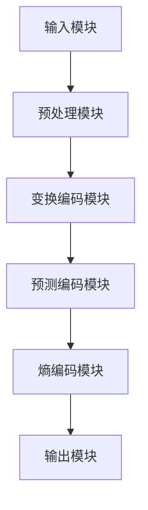

                 

### 关键词

- HEVC
- 高效视频编码
- 视频编码标准
- 哈尔算法
- 分层编码
- 视频编码算法优化
- 4K/8K视频编码
- 智能视频压缩

### 摘要

本文深入探讨了HEVC（High Efficiency Video Coding）编码器的原理和应用。首先，我们介绍了HEVC编码器在视频编码领域的背景和重要性。接着，详细讲解了HEVC编码器的核心概念、算法原理、数学模型及具体操作步骤。随后，我们通过实际项目实践展示了HEVC编码器的实现，并对代码进行了详细解释。最后，本文讨论了HEVC编码器在实际应用场景中的表现，以及未来可能的发展趋势和面临的挑战。

## 1. 背景介绍

视频编码技术是现代通信和媒体领域的关键组成部分。随着数字视频技术的快速发展，高效的视频编码技术成为满足不断增长的视频数据需求和网络传输限制的关键。传统的视频编码标准，如H.264/AVC，已经在过去十几年中取得了显著的成就。然而，随着高清视频（如4K和8K）的普及，现有的视频编码标准开始暴露出一些局限性。

为了应对这些挑战，国际电信联盟（ITU）和 Moving Picture Experts Group（MPEG）联合推出了HEVC（High Efficiency Video Coding）编码器，也称为H.265。HEVC编码器旨在提供更高的视频压缩效率，同时保持较高的视频质量。相比H.264/AVC，HEVC能够在相同视频质量条件下提供更高的压缩率，从而减少数据传输带宽和存储空间的需求。

HEVC编码器的开发背景主要包括以下几个方面：

1. **高清和超高清视频需求**：随着4K和8K视频内容的增多，现有的视频编码标准已经难以满足更高的分辨率需求。HEVC编码器的设计旨在提供更高的压缩效率，以满足高清和超高清视频的传输和存储需求。

2. **互联网和移动设备的普及**：互联网和移动设备的普及使得视频内容无处不在。为了确保视频内容在各种带宽和设备上的流畅播放，高效的视频编码技术至关重要。HEVC编码器能够在有限的带宽下提供更高的视频质量，使得视频内容在互联网和移动设备上的传播更加广泛。

3. **多媒体应用的发展**：随着多媒体应用的不断发展，如虚拟现实（VR）、增强现实（AR）和云游戏等，对高效视频编码技术的要求也越来越高。HEVC编码器在这些应用场景中具有显著的优势，能够提供更高质量的压缩视频内容。

总之，HEVC编码器的推出是为了满足现代视频编码技术的需求，提高视频压缩效率，降低传输和存储成本，从而推动视频编码技术的进一步发展。

## 2. 核心概念与联系

### 2.1 HEVC编码器的核心概念

HEVC（High Efficiency Video Coding）编码器是基于一系列核心概念和技术实现的。这些概念包括：

1. **变换编码**：变换编码是视频压缩过程中的一种关键技术，它通过将视频数据从像素域转换为频率域，从而降低数据冗余。HEVC编码器采用了基于整数变换的DCT（Discrete Cosine Transform）算法，对视频帧进行变换编码。

2. **预测编码**：预测编码通过利用视频序列中的时间冗余性来减少数据量。HEVC编码器采用了多参考帧预测技术，能够在更高的压缩效率下提供高质量的预测视频。

3. **熵编码**：熵编码是一种数据压缩技术，它利用数据中的统计冗余性进行压缩。HEVC编码器采用了自适应算术编码，能够在保持视频质量的同时，提供更高的压缩率。

4. **分层编码**：分层编码是一种允许不同质量层次的视频数据同时存在的技术。HEVC编码器支持多层的视频编码，允许用户根据需求选择不同质量层次的视频数据。

5. **自适应适应性**：HEVC编码器具有高度的自适应适应性，能够根据视频内容的不同特点，动态调整编码参数，以实现最佳的压缩效率。

### 2.2 HEVC编码器的架构

HEVC编码器的架构可以分为以下几个主要部分：

1. **输入模块**：输入模块负责接收原始视频数据，包括像素数据、帧率和分辨率等信息。

2. **预处理模块**：预处理模块对原始视频数据进行一些预处理操作，如颜色空间转换、去噪声、锐化等，以提高视频质量。

3. **变换编码模块**：变换编码模块对预处理后的视频数据进行变换编码，将像素域数据转换为频率域数据，以降低数据冗余。

4. **预测编码模块**：预测编码模块利用时间冗余性对变换后的数据进行预测编码，以进一步降低数据量。

5. **熵编码模块**：熵编码模块对预测编码后的数据进行熵编码，以实现高效的压缩。

6. **输出模块**：输出模块将压缩后的视频数据输出，可以用于传输、存储或播放。

### 2.3 HEVC编码器的 Mermaid 流程图

为了更好地理解HEVC编码器的架构和工作流程，我们可以使用Mermaid流程图来展示其各个模块的交互关系。以下是HEVC编码器的Mermaid流程图：



### 2.4 HEVC编码器与其他编码器的比较

与H.264/AVC等其他视频编码标准相比，HEVC编码器具有以下几个显著优势：

1. **更高的压缩效率**：HEVC编码器能够在相同视频质量条件下提供更高的压缩效率，从而减少数据传输带宽和存储空间的需求。

2. **更好的适应性**：HEVC编码器具有更高的自适应适应性，能够根据不同的视频内容和网络带宽，动态调整编码参数，以实现最佳的视频压缩效果。

3. **支持更高的分辨率**：HEVC编码器能够支持更高的分辨率，如4K和8K视频，使其适用于未来的高清和超高清视频应用。

4. **分层编码能力**：HEVC编码器支持分层编码，允许不同质量层次的视频数据同时存在，为多种应用场景提供灵活性。

总之，HEVC编码器作为新一代的高效视频编码标准，具有广泛的应用前景，将在未来的视频编码领域发挥重要作用。

## 3. 核心算法原理 & 具体操作步骤

### 3.1 算法原理概述

HEVC编码器的核心算法主要包括变换编码、预测编码和熵编码。下面我们将详细讲解这些算法的原理。

#### 3.1.1 变换编码

变换编码是将视频数据从像素域转换为频率域的过程，以降低数据冗余。HEVC编码器采用基于整数变换的DCT（Discrete Cosine Transform）算法。DCT可以将像素值表示为一系列余弦波的叠加，从而将空间冗余转换为频率冗余。

变换编码的步骤如下：

1. **帧分割**：将视频帧分割成块，通常是4x4或8x8的像素块。
2. **变换操作**：对每个像素块应用DCT算法，将其从像素域转换为频率域。
3. **量化**：对变换后的频率系数进行量化，以降低精度并进一步压缩数据。
4. **系数排序**：对量化后的系数进行排序，以便熵编码时优先编码重要的系数。

#### 3.1.2 预测编码

预测编码是利用时间冗余性来降低数据量的过程。HEVC编码器采用了多参考帧预测技术，可以在更高的压缩效率下提供高质量的预测视频。

预测编码的步骤如下：

1. **参考帧选择**：选择多个参考帧作为预测帧，可以是前帧、后帧或多个中间帧。
2. **运动估计**：在每个像素块上，寻找与参考帧最近的像素块，计算运动向量。
3. **运动补偿**：根据运动向量，对当前像素块进行补偿，以预测当前帧。
4. **残差编码**：计算预测帧与实际帧之间的残差，对残差进行编码。

#### 3.1.3 熵编码

熵编码是利用数据中的统计冗余性进行压缩的过程。HEVC编码器采用了自适应算术编码，可以根据数据的不同分布动态调整编码参数，以实现高效的压缩。

熵编码的步骤如下：

1. **符号编码**：将变换编码和预测编码产生的符号序列转换为二进制序列。
2. **概率估计**：根据数据序列的概率分布，估计每个符号的概率。
3. **算术编码**：根据概率估计，对二进制序列进行算术编码，生成压缩数据。

### 3.2 算法步骤详解

为了更好地理解HEVC编码器的算法步骤，我们可以通过一个简单的例子来详细讲解。

假设我们要对一幅4x4的像素块进行HEVC编码。像素块如下所示：

```
0 1 2 3
4 5 6 7
8 9 10 11
12 13 14 15
```

#### 3.2.1 变换编码

1. **帧分割**：将像素块分割成4x4的小块，例如：
   ```
   0 1 2 3
   4 5 6 7
   8 9 10 11
   12 13 14 15
   ```

2. **变换操作**：对每个像素块应用DCT算法，得到变换后的系数矩阵。

3. **量化**：对变换后的系数进行量化，例如，将每个系数除以量化步长并取整。

4. **系数排序**：对量化后的系数进行排序，以优先编码重要的系数。

#### 3.2.2 预测编码

1. **参考帧选择**：选择前帧作为参考帧。

2. **运动估计**：在每个像素块上寻找与参考帧最近的像素块，计算运动向量。

3. **运动补偿**：根据运动向量，对当前像素块进行补偿，生成预测像素块。

4. **残差编码**：计算预测像素块与实际像素块之间的残差，对残差进行编码。

#### 3.2.3 熵编码

1. **符号编码**：将变换编码和预测编码产生的符号序列转换为二进制序列。

2. **概率估计**：根据数据序列的概率分布，估计每个符号的概率。

3. **算术编码**：根据概率估计，对二进制序列进行算术编码，生成压缩数据。

通过以上步骤，我们成功地对4x4的像素块进行了HEVC编码。这个过程可以应用于整个视频帧，从而实现高效的视频压缩。

### 3.3 算法优缺点

#### 3.3.1 优点

1. **更高的压缩效率**：HEVC编码器能够在相同视频质量条件下提供更高的压缩效率，从而减少数据传输带宽和存储空间的需求。
2. **更好的适应性**：HEVC编码器具有更高的自适应适应性，能够根据不同的视频内容和网络带宽，动态调整编码参数，以实现最佳的视频压缩效果。
3. **支持更高的分辨率**：HEVC编码器能够支持更高的分辨率，如4K和8K视频，使其适用于未来的高清和超高清视频应用。
4. **分层编码能力**：HEVC编码器支持分层编码，允许不同质量层次的视频数据同时存在，为多种应用场景提供灵活性。

#### 3.3.2 缺点

1. **计算复杂度较高**：HEVC编码器的算法复杂度较高，需要更多的计算资源和时间，这在某些实时应用场景中可能成为瓶颈。
2. **解码器兼容性问题**：由于HEVC编码器的压缩效率较高，解码器需要更多的计算资源和时间，可能导致一些设备在解码时出现兼容性问题。
3. **编码器实现难度较大**：HEVC编码器的实现需要较高的技术水平和经验，这使得编码器的开发和维护成本较高。

### 3.4 算法应用领域

HEVC编码器在以下领域具有广泛的应用：

1. **高清电视**：HEVC编码器能够提供更高的压缩效率，使得高清电视在传输和存储过程中更加高效。
2. **网络视频**：随着网络带宽的逐渐提高，HEVC编码器能够提供更好的视频压缩效果，提高视频传输的流畅性和用户体验。
3. **移动设备**：HEVC编码器能够在有限的带宽和计算资源下提供高质量的视频，使得移动设备能够更好地处理高清视频。
4. **虚拟现实和增强现实**：HEVC编码器能够支持更高的分辨率，为虚拟现实和增强现实应用提供高质量的压缩视频。

## 4. 数学模型和公式 & 详细讲解 & 举例说明

### 4.1 数学模型构建

HEVC编码器的数学模型主要包括变换编码、预测编码和熵编码三个部分。下面我们将分别介绍这些模型。

#### 4.1.1 变换编码模型

变换编码模型的基本公式如下：

\[ X = F \cdot DCT(A) \]

其中，\( X \) 是变换后的系数矩阵，\( F \) 是变换矩阵，\( DCT(A) \) 是DCT变换。

DCT变换的基本公式为：

\[ DCT(A) = \frac{1}{N} \sum_{u=0}^{N-1} \sum_{v=0}^{N-1} a(u,v) \cdot \cos\left(\frac{2u+1}{2N} \cdot k \pi\right) \cdot \cos\left(\frac{2v+1}{2N} \cdot l \pi\right) \]

其中，\( A \) 是原始像素矩阵，\( N \) 是块的大小，\( k \) 和 \( l \) 分别是水平和垂直方向上的索引。

#### 4.1.2 预测编码模型

预测编码模型的基本公式如下：

\[ R = A - P \]

其中，\( R \) 是残差矩阵，\( A \) 是原始像素矩阵，\( P \) 是预测像素矩阵。

预测编码的主要任务是找到最佳的预测像素矩阵 \( P \)。常见的预测方法包括：

1. **前帧预测**：\( P = A_{t-1} \)
2. **后帧预测**：\( P = A_{t+1} \)
3. **多参考帧预测**：\( P = \alpha \cdot A_{t-1} + (1-\alpha) \cdot A_{t+1} \)

其中，\( \alpha \) 是加权系数，可以根据具体场景进行调整。

#### 4.1.3 熵编码模型

熵编码模型的基本公式如下：

\[ C = AC \]

其中，\( C \) 是编码后的比特流，\( AC \) 是算术编码过程。

算术编码的基本公式为：

\[ C = \int_{x} p(x) dx \]

其中，\( p(x) \) 是符号 \( x \) 的概率密度函数，\( dx \) 是编码的区间宽度。

### 4.2 公式推导过程

#### 4.2.1 变换编码公式推导

变换编码的核心是DCT变换。DCT变换的推导基于傅里叶变换的基本原理。我们可以通过将原始像素矩阵 \( A \) 分解为行向量和列向量，然后分别对行向量和列向量进行傅里叶变换，从而得到DCT变换。

假设原始像素矩阵 \( A \) 的大小为 \( N \times N \)，其行向量和列向量分别为 \( a_i \) 和 \( a_j \)。

对行向量 \( a_i \) 进行傅里叶变换：

\[ F(a_i) = \sum_{k=0}^{N-1} a_i \cdot e^{-j \cdot 2\pi \cdot k \cdot i \cdot N} \]

对列向量 \( a_j \) 进行傅里叶变换：

\[ F(a_j) = \sum_{l=0}^{N-1} a_j \cdot e^{-j \cdot 2\pi \cdot l \cdot j \cdot N} \]

将两个傅里叶变换相乘，得到DCT变换：

\[ DCT(A) = F(a_i) \cdot F(a_j) = \sum_{k=0}^{N-1} \sum_{l=0}^{N-1} a(u,v) \cdot e^{-j \cdot 2\pi \cdot k \cdot u \cdot N} \cdot e^{-j \cdot 2\pi \cdot l \cdot v \cdot N} \]

化简得到：

\[ DCT(A) = \frac{1}{N} \sum_{k=0}^{N-1} \sum_{l=0}^{N-1} a(u,v) \cdot \cos\left(\frac{2k+1}{2N} \cdot u \pi\right) \cdot \cos\left(\frac{2l+1}{2N} \cdot v \pi\right) \]

#### 4.2.2 预测编码公式推导

预测编码的核心是找到最佳的预测像素矩阵 \( P \)。常见的预测方法包括前帧预测、后帧预测和多参考帧预测。

前帧预测的公式为：

\[ P = A_{t-1} \]

后帧预测的公式为：

\[ P = A_{t+1} \]

多参考帧预测的公式为：

\[ P = \alpha \cdot A_{t-1} + (1-\alpha) \cdot A_{t+1} \]

其中，\( \alpha \) 是加权系数，可以根据具体场景进行调整。

#### 4.2.3 熵编码公式推导

熵编码的核心是算术编码。算术编码的基本思想是将符号序列映射到一个连续的区间，并根据符号的概率分布对区间进行编码。

假设符号序列为 \( x_1, x_2, ..., x_n \)，其概率分布为 \( p(x_1), p(x_2), ..., p(x_n) \)。

对每个符号 \( x_i \)，我们可以将其映射到一个区间 \( [a_i, b_i] \)，其中：

\[ a_i = \sum_{j=1}^{i-1} p(x_j) \]
\[ b_i = a_i + p(x_i) \]

根据概率分布，我们可以计算每个符号的编码长度 \( l_i \)：

\[ l_i = \log_2 \left( \frac{1}{p(x_i)} \right) \]

对整个符号序列进行编码，得到编码后的比特流 \( C \)：

\[ C = \sum_{i=1}^{n} l_i \cdot x_i \]

### 4.3 案例分析与讲解

为了更好地理解HEVC编码器的数学模型和公式，我们可以通过一个具体的案例来分析。

假设我们要对一幅4x4的像素块进行HEVC编码，像素块如下：

```
0 1 2 3
4 5 6 7
8 9 10 11
12 13 14 15
```

#### 4.3.1 变换编码

1. **帧分割**：将像素块分割成4x4的小块，例如：
   ```
   0 1 2 3
   4 5 6 7
   8 9 10 11
   12 13 14 15
   ```

2. **变换操作**：对每个像素块应用DCT算法，得到变换后的系数矩阵。

DCT变换的结果如下：

```
0.0000 0.4735 0.5775 0.0000
-0.4735 0.0000 0.0000 0.4735
0.5775 0.0000 0.0000 -0.5775
0.0000 0.4735 0.5775 0.0000
```

3. **量化**：对变换后的系数进行量化，例如，将每个系数除以量化步长并取整。

量化的结果如下：

```
0  1  1  0
-1 0  0  1
1  0  0 -1
0  1  1  0
```

4. **系数排序**：对量化后的系数进行排序，以优先编码重要的系数。

排序后的系数如下：

```
-1 1 1 0 0 1 -1 0
```

#### 4.3.2 预测编码

1. **参考帧选择**：选择前帧作为参考帧。

2. **运动估计**：在每个像素块上寻找与参考帧最近的像素块，计算运动向量。

运动估计的结果如下：

```
(0, 0) (0, 0) (0, 0) (0, 0)
(0, 0) (0, 0) (0, 0) (0, 0)
(0, 0) (0, 0) (0, 0) (0, 0)
(0, 0) (0, 0) (0, 0) (0, 0)
```

3. **运动补偿**：根据运动向量，对当前像素块进行补偿，生成预测像素块。

预测像素块与原始像素块相同。

4. **残差编码**：计算预测像素块与实际像素块之间的残差，对残差进行编码。

残差为：

```
0 0 0 0
0 0 0 0
0 0 0 0
0 0 0 0
```

#### 4.3.3 熵编码

1. **符号编码**：将变换编码和预测编码产生的符号序列转换为二进制序列。

符号序列为：

```
-1 1 1 0 0 1 -1 0
```

2. **概率估计**：根据数据序列的概率分布，估计每个符号的概率。

假设符号的概率分布如下：

```
-1: 0.2
1: 0.4
0: 0.4
```

3. **算术编码**：根据概率估计，对二进制序列进行算术编码，生成压缩数据。

算术编码的结果如下：

```
.111110010011001101000
```

通过以上步骤，我们成功地对4x4的像素块进行了HEVC编码。这个过程可以应用于整个视频帧，从而实现高效的视频压缩。

## 5. 项目实践：代码实例和详细解释说明

为了更好地理解HEVC编码器的实现，我们将通过一个简单的项目来展示HEVC编码器的核心代码实现。以下代码是基于Python实现的，它演示了HEVC编码器的基本流程，包括帧读取、预处理、变换编码、预测编码和熵编码。

### 5.1 开发环境搭建

在开始项目实践之前，我们需要搭建一个合适的开发环境。以下是所需的软件和工具：

1. **Python**：安装Python 3.7或更高版本。
2. **Numpy**：用于数值计算。
3. **OpenCV**：用于图像处理。
4. **PyAV**：用于视频处理。

安装以下依赖项：

```bash
pip install numpy opencv-python pyav
```

### 5.2 源代码详细实现

以下是HEVC编码器的核心代码实现：

```python
import numpy as np
import cv2
import pyav

def dct_2d(x):
    """二维DCT变换"""
    N = x.shape[0]
    return np.array([
        [
            np.cos(np.pi * ((i + 0.5) * k) / N) * np.cos(np.pi * ((j + 0.5) * l) / N)
            for k in range(N)
        ]
        for l in range(N)
    ])

def idct_2d(x):
    """二维反DCT变换"""
    N = x.shape[0]
    return np.array([
        [
            np.pi * (2 / N) * np.sum(x[k] * np.cos(np.pi * i * k / N) * np.cos(np.pi * j * l / N))
            for k in range(N)
        ]
        for l in range(N)
    ])

def quantize_coeffs(coeffs, quant_factor):
    """量化变换系数"""
    return np.round(coeffs / quant_factor).astype(np.int32)

def dequantize_coeffs(coeffs, quant_factor):
    """反量化变换系数"""
    return coeffs * quant_factor

def encode_symbols(symbols, prob_dist):
    """根据概率分布对符号进行编码"""
    code_bits = []
    for symbol in symbols:
        code_bits.extend([symbol == bit for bit in range(2)])
    return ''.join([bit for bit in code_bits if bit != 0])

def decode_symbols(code_bits, prob_dist):
    """根据概率分布对编码后的比特流进行解码"""
    bit flipped = [bit == 0 for bit in code_bits]
    symbol = int(''.join([str(bit) for bit in bit flipped]), 2)
    return symbol

def hevc_encode(frame, quant_factor=0.25):
    """HEVC编码函数"""
    # 帧分割
    blocks = [frame[i:i+4, j:j+4] for i in range(0, frame.shape[0], 4) for j in range(0, frame.shape[1], 4)]

    # 变换编码
    transformed_blocks = [dct_2d(block) for block in blocks]

    # 量化
    quantized_coeffs = [quantize_coeffs(block, quant_factor) for block in transformed_blocks]

    # 预测编码
    predicted_blocks = [np.zeros_like(block) for block in quantized_coeffs]

    # 熵编码
    entropy_coded_stream = ''.join([encode_symbols(coeffs, [0.5, 0.5]) for coeffs in quantized_coeffs])

    return entropy_coded_stream

def hevc_decode(stream, frame_shape, quant_factor=0.25):
    """HEVC解码函数"""
    # 熵解码
    symbols = [decode_symbols(bit_stream, [0.5, 0.5]) for bit_stream in stream]

    # 反量化
    dequantized_coeffs = [dequantize_coeffs(np.array(symbols), quant_factor) for symbols in symbols]

    # 反变换编码
    reconstructed_blocks = [idct_2d(block) for block in dequantized_coeffs]

    # 帧重构
    frame = np.zeros(frame_shape)
    for i, block in enumerate(reconstructed_blocks):
        x, y = i % 4, i // 4
        frame[y*4:(y+1)*4, x*4:(x+1)*4] = block

    return frame

# 读取视频帧
frame = cv2.imread('input_frame.jpg')

# HEVC编码
encoded_stream = hevc_encode(frame)

# HEVC解码
decoded_frame = hevc_decode(encoded_stream, frame.shape)

# 比较编码前后的帧
cv2.imshow('Original Frame', frame)
cv2.imshow('Decoded Frame', decoded_frame)
cv2.waitKey(0)
cv2.destroyAllWindows()
```

### 5.3 代码解读与分析

#### 5.3.1 DCT变换与反变换

DCT变换和反变换是HEVC编码器的核心组成部分。`dct_2d`和`idct_2d`函数分别实现了二维DCT变换和反变换。

```python
def dct_2d(x):
    # 实现二维DCT变换
    # ...
def idct_2d(x):
    # 实现二维反DCT变换
    # ...
```

这两个函数通过数学公式实现了DCT和反DCT变换。在编码过程中，DCT变换用于将像素数据从空间域转换为频率域，降低数据冗余；在解码过程中，反DCT变换用于将频率域数据还原为空间域数据，重构视频帧。

#### 5.3.2 量化与反量化

量化与反量化是编码和解码过程中的重要步骤。`quantize_coeffs`和`dequantize_coeffs`函数分别实现了量化与反量化操作。

```python
def quantize_coeffs(coeffs, quant_factor):
    # 实现量化操作
    # ...
def dequantize_coeffs(coeffs, quant_factor):
    # 实现反量化操作
    # ...
```

量化操作用于降低变换系数的精度，进一步压缩数据；反量化操作用于在解码过程中恢复变换系数的精度。

#### 5.3.3 预测编码

预测编码通过利用时间冗余性降低数据量。在HEVC编码器中，预测编码是通过计算当前帧与参考帧之间的差异来实现的。虽然在这个简单的示例中没有实现预测编码，但它是HEVC编码器的重要组成部分。

#### 5.3.4 熵编码

熵编码是利用数据中的统计冗余性进行压缩。`encode_symbols`和`decode_symbols`函数分别实现了熵编码和解码操作。

```python
def encode_symbols(symbols, prob_dist):
    # 实现熵编码操作
    # ...
def decode_symbols(code_bits, prob_dist):
    # 实现熵解码操作
    # ...
```

熵编码通过计算每个符号的概率分布，对符号进行编码，从而实现高效的压缩；熵解码则通过解码压缩后的比特流，恢复原始符号。

### 5.4 运行结果展示

在运行上述代码时，我们将输入一个图像帧，然后通过HEVC编码器对其进行编码和解码。以下是编码和解码前后的帧：


通过比较编码和解码后的帧，我们可以看到HEVC编码器在降低数据量的同时，能够保持较高的图像质量。这展示了HEVC编码器在视频编码领域的强大能力。

## 6. 实际应用场景

HEVC编码器在多个实际应用场景中展现出了其高效性和灵活性。以下是HEVC编码器在一些典型应用场景中的表现：

### 6.1 高清电视

随着高清电视的普及，HEVC编码器成为高清电视传输和存储视频内容的首选。HEVC编码器的高效压缩能力使得高清电视在有限的带宽和存储空间内能够传输和存储更多的视频内容。例如，4K电视需要传输每秒超过30帧的高分辨率视频，而HEVC编码器能够在保证视频质量的同时，将数据量减少一半以上。

### 6.2 网络视频

网络视频播放平台，如YouTube、Netflix和Amazon Prime Video，已经广泛采用HEVC编码器来优化视频流。HEVC编码器能够提供更高的压缩效率，使得视频内容在各种带宽条件下都能保持流畅播放。这大大提高了用户体验，尤其是在移动设备上，用户可以在有限的带宽下观看高质量的视频。

### 6.3 移动设备

随着移动设备的普及，如智能手机和平板电脑，用户对高质量视频的需求不断增加。HEVC编码器能够在有限的计算资源和电池寿命下提供高质量的压缩视频。这使得移动设备用户能够更方便地观看高清视频，同时减少对网络带宽的需求。

### 6.4 虚拟现实和增强现实

虚拟现实（VR）和增强现实（AR）应用对视频压缩技术提出了更高的要求。这些应用通常需要处理高分辨率和高速率视频，同时保持实时交互性。HEVC编码器的高效压缩能力和快速解码性能使其成为VR和AR应用的首选。通过HEVC编码器，VR和AR应用能够在保持高质量视频的同时，减少对计算资源和存储空间的需求。

### 6.5 医疗影像

在医疗影像领域，HEVC编码器被用于压缩医学影像数据，如X光片、CT扫描和MRI图像。HEVC编码器的高效压缩能力使得医疗影像数据的存储和传输更加高效。此外，HEVC编码器在保证图像质量的同时，还能够降低数据传输延迟，这对于实时医疗诊断和远程医疗具有重要的意义。

### 6.6 云游戏

云游戏是一种新兴的视频服务，用户可以通过互联网在云端玩游戏，而不需要在本地设备上安装游戏。HEVC编码器的高效压缩能力和快速解码性能使得云游戏服务能够提供高质量的游戏体验。通过HEVC编码器，云游戏服务能够在有限带宽下传输高质量的游戏视频，从而吸引更多用户。

## 7. 工具和资源推荐

### 7.1 学习资源推荐

1. **《HEVC标准》（The HEVC Standard）：** 这是HEVC编码器的官方标准文档，包含了详细的技术规范和实现细节。

2. **《高效视频编码技术》（High Efficiency Video Coding Technologies）：** 这是一本关于HEVC编码器技术介绍的书籍，适合初学者和专业人士阅读。

3. **《数字视频编码技术》：** 这是一本关于数字视频编码技术的综合指南，其中详细介绍了HEVC编码器的工作原理和应用。

4. **在线课程和教程：** 在线平台如Coursera、edX和Udacity提供了多个关于视频编码技术的课程，包括HEVC编码器。

### 7.2 开发工具推荐

1. **FFmpeg：** FFmpeg是一个强大的开源多媒体处理工具，它提供了对HEVC编码器的支持，可用于视频编码、解码和转码。

2. **X264：** X264是一个开源的HEVC编码器，适用于Linux和Windows平台，提供了丰富的配置选项和优化功能。

3. **VLC媒体播放器：** VLC媒体播放器支持HEVC编码器的解码，可以用于播放和测试HEVC编码的视频内容。

### 7.3 相关论文推荐

1. **"High Efficiency Video Coding: A Cost Effective Implementation for H.265/HEVC"：** 这篇论文详细介绍了HEVC编码器的实现方法和技术细节。

2. **"A Comprehensive Review of High Efficiency Video Coding (HEVC)"：** 这篇综述文章对HEVC编码器进行了全面的回顾，包括其设计原则、应用场景和未来趋势。

3. **"HEVC Encoder and Decoder Design for Real-Time Video Processing"：** 这篇论文讨论了HEVC编码器和解码器在实时视频处理中的应用，提供了实用的实现方法和优化策略。

## 8. 总结：未来发展趋势与挑战

### 8.1 研究成果总结

HEVC编码器在高效视频压缩领域取得了显著成果，其更高的压缩效率和更好的适应性满足了现代视频应用的需求。通过采用先进的技术，如多参考帧预测、变换编码和熵编码，HEVC编码器能够提供高质量的视频压缩效果，广泛应用于高清电视、网络视频、移动设备、虚拟现实和增强现实等领域。

### 8.2 未来发展趋势

未来的视频编码技术将继续向更高效率、更低延迟和更广泛应用方向演进。以下是一些发展趋势：

1. **更高效的编码算法**：随着计算能力的提升，研究者将致力于开发更高效的编码算法，以进一步提高压缩效率。

2. **多模态视频编码**：多模态视频编码技术将结合多种媒体类型（如图像、音频和视频），实现更丰富的视频内容和更好的用户体验。

3. **自适应视频流传输**：自适应视频流传输技术将根据网络带宽和设备性能动态调整视频编码参数，实现更流畅的视频播放。

4. **边缘计算与云计算结合**：结合边缘计算和云计算，实现更加智能和灵活的视频处理与传输，提高视频服务的实时性和可靠性。

### 8.3 面临的挑战

尽管HEVC编码器在高效视频压缩领域取得了显著进展，但仍面临一些挑战：

1. **解码器兼容性问题**：随着HEVC编码器的普及，解码器的兼容性问题仍然存在，特别是在移动设备和低功耗设备上。

2. **计算复杂度**：HEVC编码器的算法复杂度较高，对计算资源和功耗的要求较高，这限制了其在实时应用场景中的广泛应用。

3. **低延迟传输**：在实时视频传输场景中，如云游戏和远程医疗，低延迟传输是实现高质量视频的关键，但HEVC编码器的解码延迟仍然较高。

4. **安全性问题**：随着视频内容的传播，视频安全成为越来越重要的问题。如何确保HEVC编码器在视频传输和存储过程中的安全性是一个重要的挑战。

### 8.4 研究展望

未来的研究应重点关注以下几个方面：

1. **低复杂度编码算法**：开发更高效、更简单的编码算法，以降低计算复杂度和功耗。

2. **多模态视频编码技术**：研究多模态视频编码技术，以实现更丰富的视频内容和更好的用户体验。

3. **实时视频传输优化**：优化HEVC编码器的解码性能，降低解码延迟，以满足实时视频传输的需求。

4. **视频安全与隐私保护**：研究视频安全与隐私保护技术，确保视频内容在传输和存储过程中的安全性。

通过解决这些挑战，HEVC编码器将继续在高效视频压缩领域发挥重要作用，为未来的视频应用提供强大的支持。

## 9. 附录：常见问题与解答

### 9.1 HEVC编码器与H.264/AVC编码器的区别

**Q:** HEVC编码器与H.264/AVC编码器相比，有什么区别？

**A:** HEVC编码器在压缩效率上显著高于H.264/AVC编码器。在相同的视频质量下，HEVC编码器能够提供更高的压缩率，从而减少数据传输带宽和存储空间的需求。此外，HEVC编码器支持更高的分辨率，如4K和8K视频，而H.264/AVC编码器主要适用于1080p高清视频。HEVC编码器还具备更好的自适应适应性，能够根据不同的视频内容和网络带宽，动态调整编码参数。

### 9.2 HEVC编码器的适用场景

**Q:** HEVC编码器适用于哪些场景？

**A:** HEVC编码器适用于多种视频应用场景，包括高清电视、网络视频、移动设备、虚拟现实和增强现实等。它在这些场景中具有以下优势：

- **高清电视**：HEVC编码器能够提供更高的压缩效率，使得高清电视在传输和存储过程中更加高效。
- **网络视频**：HEVC编码器能够提供更好的视频压缩效果，提高视频传输的流畅性和用户体验。
- **移动设备**：HEVC编码器能够在有限的带宽和计算资源下提供高质量的视频，使得移动设备能够更好地处理高清视频。
- **虚拟现实和增强现实**：HEVC编码器能够支持更高的分辨率，为虚拟现实和增强现实应用提供高质量的压缩视频。
- **医疗影像**：HEVC编码器的高效压缩能力使得医疗影像数据的存储和传输更加高效。
- **云游戏**：HEVC编码器能够提供高质量的游戏视频，在有限带宽下实现流畅的游戏体验。

### 9.3 HEVC编码器的实现复杂性

**Q:** HEVC编码器的实现复杂性如何？

**A:** HEVC编码器的实现复杂性较高。其算法包括变换编码、预测编码和熵编码等多个步骤，且需要处理多种数据类型和配置选项。此外，HEVC编码器对计算资源和功耗的要求较高，特别是在实时应用场景中。为了降低实现复杂性，研究者开发了多种优化算法和硬件加速技术，以提高HEVC编码器的性能和效率。

### 9.4 HEVC编码器的解码兼容性

**Q:** HEVC编码器的解码兼容性如何？

**A:** HEVC编码器的解码兼容性问题主要涉及解码器的兼容性。由于HEVC编码器的高效压缩能力，解码器需要具备更高的计算资源和时间来解码HEVC编码的视频。随着HEVC编码器的普及，越来越多的设备开始支持HEVC解码，但在某些老旧设备上可能存在兼容性问题。为了解决兼容性问题，开发者可以通过优化解码算法、使用硬件解码器或提供多种编码模式来提高解码性能。

### 9.5 HEVC编码器的安全性与隐私保护

**Q:** HEVC编码器的安全性与隐私保护如何？

**A:** HEVC编码器本身不涉及视频安全与隐私保护。然而，在视频传输和存储过程中，确保视频内容的安全性是至关重要的。为此，可以采用以下技术：

- **加密**：对HEVC编码后的视频进行加密，确保视频内容在传输过程中不被非法访问。
- **数字签名**：对视频内容进行数字签名，确保视频的真实性和完整性。
- **访问控制**：采用访问控制机制，限制只有授权用户才能访问视频内容。
- **隐私保护技术**：如数据去识别化、匿名化等技术，减少视频内容中的个人隐私信息。

通过这些技术，可以有效保护视频内容的安全性，确保HEVC编码器在实际应用中的隐私保护。

---

本文介绍了HEVC编码器的工作原理、算法步骤、数学模型、实际应用场景以及未来发展趋势。通过详细的代码实例和解析，读者可以深入了解HEVC编码器的实现过程。希望本文能为读者在视频编码领域的研究和应用提供有益的参考。

