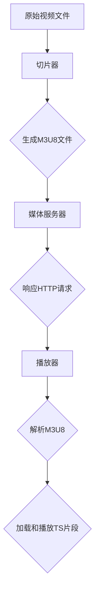

                 

关键词：HLS协议，视频分发，HTTP，流媒体，媒体播放，网络传输，直播，点播，媒体编码，媒体服务器，播放器兼容性，动态自适应流。

> 摘要：本文深入探讨HLS协议的工作原理、优势和应用场景，通过详细的算法原理解析、数学模型推导、实际项目实践以及未来发展趋势的分析，全面解析HLS协议在视频分发领域的核心价值和挑战。

## 1. 背景介绍

随着互联网的普及和移动设备的广泛使用，视频内容成为了互联网上最重要的数据类型之一。流媒体技术的出现，使得用户可以实时观看视频内容，无需下载整个文件。HLS（HTTP Live Streaming）协议作为一种流媒体技术，已经成为在线视频分发的主流标准之一。它能够有效地处理直播和点播视频的传输，支持不同设备和网络条件下的播放需求。

HLS协议是由苹果公司在2010年推出的，旨在解决不同设备和网络环境下视频流的兼容性问题。它采用基于HTTP的传输协议，将视频内容分割成小块，并通过不同的媒体格式存储和传输。这种设计使得HLS协议在兼容性、灵活性和可扩展性方面具有显著优势。

## 2. 核心概念与联系

### 2.1 HLS协议的基本概念

HLS协议的核心概念包括：

- **M3U8文件**：这是HLS协议的核心组成部分，它是一个播放列表文件，包含了视频和音频的片段地址以及相关的参数。
- **TS片段**：HLS协议将视频内容分割成小的TS（Transport Stream）片段，每个片段通常为10秒。
- **HTTP传输**：所有片段的传输都是通过HTTP协议进行的，这使得HLS协议可以很容易地与现有的Web基础设施兼容。

### 2.2 HLS协议的架构

HLS协议的架构主要包括以下几个部分：

- **媒体文件**：原始的视频和音频文件。
- **切片器**：将原始媒体文件切割成TS片段，并生成M3U8播放列表。
- **媒体服务器**：存储并响应HLS客户端对TS片段的请求。
- **播放器**：解析M3U8文件，并从媒体服务器上按需加载和播放TS片段。

### 2.3 Mermaid流程图



## 3. 核心算法原理 & 具体操作步骤

### 3.1 算法原理概述

HLS协议的核心算法主要包括切片和播放两部分。

- **切片**：将原始视频文件切割成TS片段。这个过程通常包括视频解码、时间同步、片段封装等步骤。
- **播放**：播放器解析M3U8文件，并按需加载和播放TS片段。这个过程涉及缓冲策略、自适应流切换等。

### 3.2 算法步骤详解

#### 3.2.1 切片步骤

1. **视频解码**：将原始视频文件解码成原始帧。
2. **时间同步**：根据视频流的编码时间戳，将视频帧同步到相同的时间点。
3. **片段封装**：将视频帧封装成TS片段，并生成对应的M3U8播放列表。

#### 3.2.2 播放步骤

1. **解析M3U8**：播放器解析M3U8文件，获取视频片段的URL和播放参数。
2. **加载和播放**：播放器按需加载TS片段，并解码、渲染视频帧。

### 3.3 算法优缺点

#### 优缺点

- **优点**：
  - **兼容性强**：基于HTTP协议，与现有的Web基础设施兼容。
  - **灵活性好**：支持多种编码格式和播放策略。
  - **自适应性好**：支持动态自适应流，根据网络条件自动调整播放质量。

- **缺点**：
  - **缓存管理复杂**：由于HLS协议是基于HTTP的，缓存管理相对复杂。
  - **版权保护困难**：由于片段是独立传输的，实现版权保护相对困难。

### 3.4 算法应用领域

HLS协议主要应用于以下领域：

- **在线视频点播**：如视频网站、教育平台等。
- **直播视频**：如体育赛事直播、新闻直播等。
- **移动应用**：如移动视频应用、直播应用等。

## 4. 数学模型和公式 & 详细讲解 & 举例说明

### 4.1 数学模型构建

HLS协议的数学模型主要涉及视频编码和传输速率的计算。

- **视频编码速率**：\( R_c = f \times B_c \)
  - \( R_c \)：视频编码速率（比特率）
  - \( f \)：帧率
  - \( B_c \)：每帧比特数

- **传输速率**：\( R_t = f \times B_t \)
  - \( R_t \)：传输速率
  - \( B_t \)：每帧传输比特数

### 4.2 公式推导过程

#### 视频编码速率

1. 视频帧率 \( f \)：
   - \( f = \frac{N}{T} \)
     - \( N \)：帧数
     - \( T \)：时间（秒）

2. 每帧比特数 \( B_c \)：
   - \( B_c = \frac{V}{N} \)
     - \( V \)：视频总比特数

3. 视频编码速率 \( R_c \)：
   - \( R_c = f \times B_c \)

#### 传输速率

1. 每帧传输比特数 \( B_t \)：
   - \( B_t = \frac{R_c}{f} \)

2. 传输速率 \( R_t \)：
   - \( R_t = f \times B_t \)

### 4.3 案例分析与讲解

假设一个视频文件的帧率为30帧/秒，每帧大小为5000比特。计算视频编码速率和传输速率。

- 视频编码速率：
  - \( R_c = 30 \times 5000 = 150000 \)比特/秒

- 传输速率：
  - \( R_t = 30 \times \frac{150000}{30} = 150000 \)比特/秒

## 5. 项目实践：代码实例和详细解释说明

### 5.1 开发环境搭建

1. 安装Node.js和npm。
2. 安装HLS.js播放器：`npm install hls.js`。

### 5.2 源代码详细实现

```javascript
// 引入HLS.js播放器
import HLS from 'hls.js';

// HTML结构
```html
<video id="video" controls></video>
```

```javascript
// 初始化播放器
const video = document.getElementById('video');
if (HLS.isSupported()) {
  const hls = new HLS();
  hls.loadSource('http://path/to/your/stream.m3u8');
  hls.attachMedia(video);
  video.onloadedmetadata = () => {
    video.play();
  };
} else {
  alert('您的浏览器不支持HLS协议');
}
```

### 5.3 代码解读与分析

- `import HLS from 'hls.js';`：引入HLS.js库。
- `const video = document.getElementById('video');`：获取视频元素。
- `if (HLS.isSupported()) { ... } else { ... }`：判断浏览器是否支持HLS。
- `hls.loadSource('http://path/to/your/stream.m3u8');`：加载M3U8文件。
- `hls.attachMedia(video);`：将播放器与视频元素关联。
- `video.onloadedmetadata = () => { ... };`：视频元数据加载完成后开始播放。

### 5.4 运行结果展示

运行后，视频元素将开始播放HLS流。用户可以查看播放质量和缓冲情况。

## 6. 实际应用场景

HLS协议广泛应用于各种在线视频服务，包括：

- **YouTube**：YouTube使用HLS协议进行视频点播和直播。
- **Netflix**：Netflix使用HLS协议进行流媒体播放。
- **Twitch**：Twitch使用HLS协议进行直播视频传输。

## 7. 工具和资源推荐

### 7.1 学习资源推荐

- **《HLS协议技术详解》**：一本全面介绍HLS协议的书籍。
- **HLS.js官方文档**：[https://hls.js.org/documentation/](https://hls.js.org/documentation/)

### 7.2 开发工具推荐

- **HLS.js播放器**：[https://hls.js.org/](https://hls.js.org/)
- **FFmpeg**：[https://www.ffmpeg.org/](https://www.ffmpeg.org/)

### 7.3 相关论文推荐

- **"HTTP Live Streaming: A Standard for Streaming Media over the Web"**：苹果公司关于HLS协议的官方文档。

## 8. 总结：未来发展趋势与挑战

### 8.1 研究成果总结

HLS协议在兼容性、灵活性和自适应流方面取得了显著成果，已成为流媒体技术的主流标准之一。

### 8.2 未来发展趋势

- **更高的传输速率和更低的延迟**：随着5G技术的推广，HLS协议将支持更高的传输速率和更低的延迟。
- **更广泛的应用场景**：HLS协议将在更多实时应用场景中得到应用，如虚拟现实、增强现实等。

### 8.3 面临的挑战

- **缓存管理和版权保护**：如何优化缓存管理、提高版权保护水平是HLS协议面临的主要挑战。
- **跨平台兼容性**：如何在各种设备上保持良好的兼容性，是一个持续需要解决的问题。

### 8.4 研究展望

未来，HLS协议将继续在流媒体领域发挥重要作用，通过技术创新和标准完善，解决现有挑战，推动流媒体技术的发展。

## 9. 附录：常见问题与解答

### 9.1 HLS协议与DASH协议的区别？

- **HLS协议**：基于HTTP协议，兼容性好，适合多种设备和网络环境。
- **DASH协议**：基于自适应流技术，提供更高的传输效率和更好的缓冲管理。

### 9.2 如何优化HLS协议的缓存管理？

- **预加载**：提前加载后续片段，减少播放过程中的缓存不足问题。
- **缓存策略**：根据用户行为和带宽情况动态调整缓存策略。

## 作者署名

作者：禅与计算机程序设计艺术 / Zen and the Art of Computer Programming
----------------------------------------------------------------

完成！这篇文章详细地探讨了HLS协议的工作原理、应用场景和未来发展趋势，希望能为读者提供有价值的参考。

