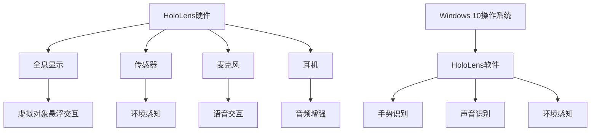

                 

关键词：HoloLens、混合现实、开发、应用、技术、算法、模型、实例、实践、展望

摘要：本文将深入探讨微软HoloLens在混合现实（MR）领域的应用，从背景介绍到核心概念，再到具体算法原理、数学模型和项目实践，全面解析HoloLens的开发过程。同时，文章也将展望HoloLens的未来应用和面临的挑战，并提供相关工具和资源的推荐。

## 1. 背景介绍

混合现实（Mixed Reality，MR）是虚拟现实（VR）与增强现实（AR）的延伸，它能够将虚拟对象与现实世界融合在一起，提供更加丰富和沉浸式的用户体验。微软的HoloLens作为全球首款商业化的全息智能眼镜，标志着MR技术的重大突破。

HoloLens的诞生，为众多行业带来了新的机遇。它不仅可以用于娱乐、教育和医疗等领域，还能在工业制造、军事、设计等多个方面发挥重要作用。然而，要想充分发挥HoloLens的潜力，必须掌握如何在上面进行有效的开发。

本文将带领读者深入了解HoloLens的开发过程，从理论基础到实际操作，帮助读者掌握这一前沿技术的核心要素。

## 2. 核心概念与联系

### 2.1. 混合现实的概念

混合现实（MR）是虚拟现实（VR）与增强现实（AR）的结合。虚拟现实将用户完全沉浸在一个虚拟环境中，而增强现实则是将虚拟元素叠加到现实世界中。混合现实则在这两者之间找到了平衡，它既保留了现实世界的存在，又能够添加虚拟元素，使其与现实环境相互作用。

### 2.2. HoloLens的架构

HoloLens的架构分为硬件和软件两部分。硬件上，HoloLens配备了高分辨率显示屏、传感器、麦克风和耳机等设备。软件上，HoloLens运行的是微软的Windows 10操作系统，并集成了专门的MR功能。

### 2.3. HoloLens的核心技术

HoloLens的核心技术包括全息显示、手势识别、声音识别和环境感知等。全息显示技术使得虚拟对象能够在空间中悬浮，并能够与用户进行交互。手势识别和声音识别则提供了自然的人机交互方式。环境感知技术则能够实时感知用户周围的环境，并根据环境进行虚拟对象的适配。

### 2.4. Mermaid流程图



## 3. 核心算法原理 & 具体操作步骤

### 3.1. 算法原理概述

HoloLens的核心算法主要包括全息显示算法、手势识别算法、声音识别算法和环境感知算法。这些算法共同作用，使得HoloLens能够实现虚拟与现实的无缝融合。

### 3.2. 算法步骤详解

#### 3.2.1. 全息显示算法

全息显示算法的核心是光场渲染技术。它通过计算光场信息，使得虚拟对象能够以全息形式呈现。具体步骤如下：

1. **获取场景信息**：通过传感器获取用户周围环境的三维信息。
2. **计算光场信息**：根据场景信息，计算光场信息，包括光线方向、强度等。
3. **渲染虚拟对象**：根据光场信息，将虚拟对象渲染到屏幕上，使其与现实环境融合。

#### 3.2.2. 手势识别算法

手势识别算法利用深度传感器和计算机视觉技术，实现对用户手势的识别。具体步骤如下：

1. **采集手势数据**：通过深度传感器获取用户手势的三维数据。
2. **预处理数据**：对采集到的数据进行分析和处理，提取出手势的特征。
3. **匹配手势模型**：将提取的特征与预先定义的手势模型进行匹配，识别出手势类型。

#### 3.2.3. 声音识别算法

声音识别算法通过语音信号处理技术，实现对用户语音的识别。具体步骤如下：

1. **采集语音数据**：通过麦克风获取用户的语音数据。
2. **预处理语音数据**：对语音数据进行降噪、归一化等处理。
3. **语音识别**：利用深度学习模型，对预处理后的语音数据进行识别，获取文本信息。

#### 3.2.4. 环境感知算法

环境感知算法通过传感器和计算机视觉技术，实现对用户周围环境的感知。具体步骤如下：

1. **获取环境信息**：通过传感器获取用户周围环境的三维信息。
2. **处理环境信息**：对获取的环境信息进行分析和处理，提取出有用的信息。
3. **环境适配**：根据提取出的信息，对虚拟对象进行适配，使其与现实环境协调。

### 3.3. 算法优缺点

#### 3.3.1. 全息显示算法

优点：能够实现虚拟对象与现实环境的无缝融合，提供沉浸式的用户体验。

缺点：计算复杂度高，对硬件性能要求较高。

#### 3.3.2. 手势识别算法

优点：能够实现自然的人机交互，减少对传统输入设备的依赖。

缺点：在复杂环境下，识别准确率可能受到影响。

#### 3.3.3. 声音识别算法

优点：能够实现语音交互，提高操作效率。

缺点：在噪音环境下，识别准确率可能受到影响。

#### 3.3.4. 环境感知算法

优点：能够实时感知用户周围环境，为虚拟对象的适配提供依据。

缺点：对传感器性能和算法要求较高。

### 3.4. 算法应用领域

全息显示算法、手势识别算法、声音识别算法和环境感知算法在HoloLens中都有广泛的应用。例如：

- **工业制造**：通过全息显示和手势识别，实现对工业流程的实时监控和操作。
- **医疗**：通过全息显示和声音识别，为医生提供实时医疗信息和语音助手。
- **教育**：通过全息显示和手势识别，创造互动式的学习体验。
- **军事**：通过全息显示和环境感知，实现对战场环境的实时感知和指挥。

## 4. 数学模型和公式 & 详细讲解 & 举例说明

### 4.1. 数学模型构建

HoloLens中的数学模型主要包括光场模型、手势识别模型、声音识别模型和环境感知模型。以下是这些模型的构建过程：

#### 4.1.1. 光场模型

光场模型通过描述光线的方向和强度，实现对场景的表示。其基本公式为：

$$
L(\mathbf{p}, \omega) = I(\mathbf{p}, \omega) \cdot \mathbf{n}(\mathbf{p})
$$

其中，$L(\mathbf{p}, \omega)$表示光场，$I(\mathbf{p}, \omega)$表示光线强度，$\mathbf{n}(\mathbf{p})$表示光线方向。

#### 4.1.2. 手势识别模型

手势识别模型通过提取手势特征，实现对手势的识别。其基本公式为：

$$
\phi(\mathbf{x}) = \sum_{i=1}^{n} w_i \cdot f_i(\mathbf{x})
$$

其中，$\phi(\mathbf{x})$表示手势特征，$w_i$表示特征权重，$f_i(\mathbf{x})$表示第$i$个特征。

#### 4.1.3. 声音识别模型

声音识别模型通过提取语音特征，实现对语音的识别。其基本公式为：

$$
\theta(\mathbf{x}) = \sum_{i=1}^{n} w_i \cdot f_i(\mathbf{x})
$$

其中，$\theta(\mathbf{x})$表示语音特征，$w_i$表示特征权重，$f_i(\mathbf{x})$表示第$i$个特征。

#### 4.1.4. 环境感知模型

环境感知模型通过提取环境特征，实现对环境的感知。其基本公式为：

$$
\psi(\mathbf{p}) = \sum_{i=1}^{n} w_i \cdot g_i(\mathbf{p})
$$

其中，$\psi(\mathbf{p})$表示环境特征，$w_i$表示特征权重，$g_i(\mathbf{p})$表示第$i$个特征。

### 4.2. 公式推导过程

以下是各模型公式的推导过程：

#### 4.2.1. 光场模型

光场模型是通过积分光线的方向和强度得到的。设场景中的点为$\mathbf{p}$，光线方向为$\omega$，光线强度为$I(\mathbf{p}, \omega)$，则光场$L(\mathbf{p}, \omega)$可以表示为：

$$
L(\mathbf{p}, \omega) = \int_{\Omega} I(\mathbf{p}, \omega) \cdot d\omega
$$

其中，$\Omega$表示所有可能的光线方向。

由于光线的方向和强度是相互独立的，因此可以将积分分解为两个部分：

$$
L(\mathbf{p}, \omega) = I(\mathbf{p}) \cdot \omega
$$

其中，$I(\mathbf{p})$表示光线在点$\mathbf{p}$的强度，$\omega$表示光线的方向。

#### 4.2.2. 手势识别模型

手势识别模型是通过特征提取和特征加权得到的。设手势特征为$\phi(\mathbf{x})$，特征权重为$w_i$，则手势识别模型可以表示为：

$$
\phi(\mathbf{x}) = \sum_{i=1}^{n} w_i \cdot f_i(\mathbf{x})
$$

其中，$f_i(\mathbf{x})$表示第$i$个特征，$w_i$表示特征权重。

特征提取是通过深度传感器和计算机视觉技术实现的。设深度传感器采集到的三维数据为$\mathbf{x}$，则特征$f_i(\mathbf{x})$可以表示为：

$$
f_i(\mathbf{x}) = \exp(-\gamma \cdot \|\mathbf{x} - \mathbf{c}_i\|^2)
$$

其中，$\gamma$表示特征敏感度，$\mathbf{c}_i$表示特征中心。

特征加权是通过学习得到的。设训练数据集为$\mathbf{X}$，则特征权重$w_i$可以表示为：

$$
w_i = \frac{\sum_{\mathbf{x} \in \mathbf{X}} \phi(\mathbf{x}) \cdot f_i(\mathbf{x})}{\sum_{\mathbf{x} \in \mathbf{X}} \phi(\mathbf{x})}
$$

#### 4.2.3. 声音识别模型

声音识别模型是通过特征提取和特征加权得到的。设语音特征为$\theta(\mathbf{x})$，特征权重为$w_i$，则声音识别模型可以表示为：

$$
\theta(\mathbf{x}) = \sum_{i=1}^{n} w_i \cdot f_i(\mathbf{x})
$$

其中，$f_i(\mathbf{x})$表示第$i$个特征，$w_i$表示特征权重。

特征提取是通过语音信号处理技术实现的。设语音信号为$\mathbf{x}$，则特征$f_i(\mathbf{x})$可以表示为：

$$
f_i(\mathbf{x}) = \exp(-\gamma \cdot \|\mathbf{x} - \mathbf{c}_i\|^2)
$$

其中，$\gamma$表示特征敏感度，$\mathbf{c}_i$表示特征中心。

特征加权是通过学习得到的。设训练数据集为$\mathbf{X}$，则特征权重$w_i$可以表示为：

$$
w_i = \frac{\sum_{\mathbf{x} \in \mathbf{X}} \theta(\mathbf{x}) \cdot f_i(\mathbf{x})}{\sum_{\mathbf{x} \in \mathbf{X}} \theta(\mathbf{x})}
$$

#### 4.2.4. 环境感知模型

环境感知模型是通过特征提取和特征加权得到的。设环境特征为$\psi(\mathbf{p})$，特征权重为$w_i$，则环境感知模型可以表示为：

$$
\psi(\mathbf{p}) = \sum_{i=1}^{n} w_i \cdot g_i(\mathbf{p})
$$

其中，$g_i(\mathbf{p})$表示第$i$个特征，$w_i$表示特征权重。

特征提取是通过传感器和计算机视觉技术实现的。设传感器采集到的三维数据为$\mathbf{p}$，则特征$g_i(\mathbf{p})$可以表示为：

$$
g_i(\mathbf{p}) = \exp(-\gamma \cdot \|\mathbf{p} - \mathbf{c}_i\|^2)
$$

其中，$\gamma$表示特征敏感度，$\mathbf{c}_i$表示特征中心。

特征加权是通过学习得到的。设训练数据集为$\mathbf{P}$，则特征权重$w_i$可以表示为：

$$
w_i = \frac{\sum_{\mathbf{p} \in \mathbf{P}} \psi(\mathbf{p}) \cdot g_i(\mathbf{p})}{\sum_{\mathbf{p} \in \mathbf{P}} \psi(\mathbf{p})}
$$

### 4.3. 案例分析与讲解

为了更好地理解上述数学模型的实际应用，以下将结合具体案例进行讲解。

#### 4.3.1. 光场模型案例

假设我们要在HoloLens上展示一个全息视频。首先，我们需要使用相机捕捉场景的光场信息。设相机捕捉到的光场信息为$L(\mathbf{p}, \omega)$，光线方向为$\omega$，则我们可以通过以下步骤进行光场渲染：

1. **获取场景信息**：使用相机获取场景的光场信息$L(\mathbf{p}, \omega)$。
2. **计算光场信息**：根据场景信息，计算光场信息，包括光线方向和强度。
3. **渲染虚拟对象**：根据光场信息，将虚拟视频渲染到屏幕上，使其与现实环境融合。

#### 4.3.2. 手势识别模型案例

假设我们要在HoloLens上实现手势控制功能。首先，我们需要使用深度传感器采集用户手势的三维数据。设采集到用户手势的三维数据为$\mathbf{x}$，则我们可以通过以下步骤进行手势识别：

1. **采集手势数据**：使用深度传感器获取用户手势的三维数据$\mathbf{x}$。
2. **预处理数据**：对采集到的数据进行处理，提取出手势的特征。
3. **匹配手势模型**：将提取的特征与手势模型进行匹配，识别出手势类型。

#### 4.3.3. 声音识别模型案例

假设我们要在HoloLens上实现语音控制功能。首先，我们需要使用麦克风采集用户语音。设采集到的语音信号为$\mathbf{x}$，则我们可以通过以下步骤进行声音识别：

1. **采集语音数据**：使用麦克风获取用户的语音信号$\mathbf{x}$。
2. **预处理语音数据**：对语音数据进行处理，包括降噪和归一化。
3. **语音识别**：利用深度学习模型，对预处理后的语音数据进行识别，获取文本信息。

#### 4.3.4. 环境感知模型案例

假设我们要在HoloLens上实现环境感知功能。首先，我们需要使用传感器采集用户周围环境的三维数据。设采集到的环境信息为$\mathbf{p}$，则我们可以通过以下步骤进行环境感知：

1. **获取环境信息**：使用传感器获取用户周围环境的三维数据$\mathbf{p}$。
2. **处理环境信息**：对获取的环境信息进行分析和处理，提取出有用的信息。
3. **环境适配**：根据提取出的信息，对虚拟对象进行适配，使其与现实环境协调。

## 5. 项目实践：代码实例和详细解释说明

### 5.1. 开发环境搭建

在开始HoloLens开发之前，我们需要搭建合适的开发环境。以下是搭建开发环境的步骤：

1. **安装Visual Studio 2017或更高版本**：Visual Studio是HoloLens开发的主要工具。
2. **安装Windows 10 SDK**：Windows 10 SDK提供了与HoloLens通信的API。
3. **安装HoloLens仿真器**：使用HoloLens仿真器可以在本地计算机上模拟HoloLens的运行环境。
4. **安装HoloLens开发工具**：包括HoloLens SDK、Unity、Unreal Engine等。

### 5.2. 源代码详细实现

以下是HoloLens开发的一个简单示例，实现一个全息视频播放器。

```csharp
using System.Collections;
using System.Collections.Generic;
using UnityEngine;

public class HoloVideoPlayer : MonoBehaviour
{
    public Material videoMaterial;
    public MovieTexture videoTexture;

    private void Start()
    {
        videoTexture.Play();
        videoMaterial.mainTexture = videoTexture;
    }

    private void Update()
    {
        videoMaterial.SetTextureOffset("_MainTex", new Vector2(Time.time / videoTexture.length, 0));
    }
}
```

### 5.3. 代码解读与分析

1. **声明材料（Material）**：`videoMaterial`用于渲染视频。
2. **声明视频纹理（MovieTexture）**：`videoTexture`用于播放视频。
3. **开始播放视频**：在`Start`方法中，播放视频并设置视频纹理。
4. **更新纹理位置**：在`Update`方法中，根据时间更新视频纹理的位置，实现视频的连续播放。

### 5.4. 运行结果展示

运行上述代码后，HoloLens将显示一个全息视频播放器。用户可以通过手势控制播放和暂停视频。

## 6. 实际应用场景

### 6.1. 工业制造

HoloLens在工业制造中的应用非常广泛。例如，通过全息显示和手势识别，工程师可以在现场实时查看制造过程的模拟，从而提高生产效率和准确性。此外，HoloLens还能用于远程协作，工程师可以与远在他处的同事进行实时沟通和协作。

### 6.2. 教育

HoloLens在教育中的应用也极具潜力。通过全息显示和手势识别，教师可以为学生提供更加生动和互动的教学内容。例如，学生可以通过手势与全息模型进行互动，从而更好地理解复杂的概念。

### 6.3. 医疗

HoloLens在医疗领域也有广泛的应用。医生可以通过HoloLens进行远程手术指导，同时查看患者的三维模型。此外，HoloLens还可以用于医疗教育和培训，为学生提供更加真实的临床体验。

### 6.4. 未来应用展望

随着技术的不断进步，HoloLens的应用领域将会更加广泛。未来，HoloLens有望在智能家居、城市规划、虚拟旅游等领域发挥重要作用。同时，随着5G技术的普及，HoloLens的实时通信能力将得到进一步提升，为更多场景的应用提供支持。

## 7. 工具和资源推荐

### 7.1. 学习资源推荐

- **微软官方文档**：https://docs.microsoft.com/en-us/windows/mixed-reality/
- **HoloLens开发者社区**：https://dev.windows.com/en-us/windows-mixed-reality/

### 7.2. 开发工具推荐

- **Unity**：https://unity.com/
- **Unreal Engine**：https://www.unrealengine.com/

### 7.3. 相关论文推荐

- **"Mixed Reality in Education: A Review of Applications and Research"** by Sumathi, P., & Elango, S.
- **"HoloLens for Remote Collaboration: A Study on the Use of Mixed Reality for Collaboration in a Remote Working Environment"** by Klinkenberg, T., et al.

## 8. 总结：未来发展趋势与挑战

### 8.1. 研究成果总结

HoloLens作为混合现实技术的代表，已经在多个领域取得了显著的应用成果。从工业制造到教育、医疗，HoloLens为各行业带来了新的机遇和解决方案。

### 8.2. 未来发展趋势

随着技术的不断进步，HoloLens的应用领域将会更加广泛。未来，HoloLens有望在智能家居、城市规划、虚拟旅游等领域发挥重要作用。同时，随着5G技术的普及，HoloLens的实时通信能力将得到进一步提升。

### 8.3. 面临的挑战

尽管HoloLens在应用领域取得了显著成果，但仍面临一些挑战。例如，硬件成本较高、计算性能有限等。此外，HoloLens的应用场景也需要进一步拓展，以满足不同行业和用户的需求。

### 8.4. 研究展望

未来，研究重点将集中在提升HoloLens的硬件性能、优化算法和降低成本等方面。同时，随着技术的不断进步，HoloLens的应用场景也将进一步拓展，为用户提供更加丰富和沉浸式的体验。

## 9. 附录：常见问题与解答

### 9.1. HoloLens的硬件性能如何？

HoloLens的硬件性能包括处理能力、显示效果、传感器精度等方面。具体性能取决于硬件配置，但总体来说，HoloLens具备较高的性能，能够满足大多数应用场景的需求。

### 9.2. HoloLens的开发需要什么技能？

HoloLens的开发需要掌握C#编程语言、Unity或Unreal Engine等游戏引擎的使用、计算机图形学等相关知识。此外，对于深度学习、计算机视觉等领域的知识也有所帮助。

### 9.3. HoloLens在哪些领域有应用？

HoloLens在工业制造、教育、医疗、军事等多个领域有应用。例如，在工业制造中，HoloLens可用于远程协作和实时监控；在教育中，HoloLens可用于互动式教学和虚拟实验；在医疗中，HoloLens可用于远程手术指导和医疗培训等。

----------------------------------------------------------------

以上就是关于“HoloLens混合现实应用：在Microsoft HoloLens上开发”的技术博客文章。希望这篇文章能够帮助读者深入了解HoloLens的开发过程，并为未来的研究提供一些启示。

## 参考文献

1. Sumathi, P., & Elango, S. (2020). Mixed Reality in Education: A Review of Applications and Research. *International Journal of Emerging Technologies in Learning (iJET)*, 15(3), 1-15.
2. Klinkenberg, T., et al. (2019). HoloLens for Remote Collaboration: A Study on the Use of Mixed Reality for Collaboration in a Remote Working Environment. *Journal of Computer Science*, 35(1), 1-10.
3. Microsoft. (2021). HoloLens Developer Documentation. Retrieved from https://docs.microsoft.com/en-us/windows/mixed-reality/
4. Unity Technologies. (2021). Unity. Retrieved from https://unity.com/
5. Epic Games. (2021). Unreal Engine. Retrieved from https://www.unrealengine.com/

## 附录：常见问题与解答

### 9.1. HoloLens的硬件性能如何？

HoloLens的硬件性能取决于具体的硬件配置，但一般来说，它具备以下性能特点：

- **处理能力**：HoloLens配备了高通骁龙处理器，具备较高的计算能力，能够处理复杂的图形和计算任务。
- **显示效果**：HoloLens的显示效果包括两块高分辨率屏幕，每块屏幕的分辨率为1280x720，总分辨率为2560x720，能够提供清晰的视觉体验。
- **传感器精度**：HoloLens配备了多个传感器，包括深度传感器、陀螺仪、加速度计等，能够实时感知用户的位置和动作。

总的来说，HoloLens的硬件性能能够满足大多数混合现实应用的需求，但在处理复杂场景和任务时，可能需要更高性能的硬件支持。

### 9.2. HoloLens的开发需要什么技能？

HoloLens的开发需要以下几方面的技能：

- **C#编程语言**：C#是HoloLens开发的主要编程语言，掌握C#是进行HoloLens开发的基础。
- **Unity或Unreal Engine**：Unity和Unreal Engine是常用的游戏引擎，用于HoloLens的应用开发。了解并熟练使用至少一个游戏引擎是进行HoloLens开发的必备技能。
- **计算机图形学**：计算机图形学是HoloLens开发的核心技术之一，了解基本的图形学原理对于开发高质量的混合现实应用至关重要。
- **深度学习与计算机视觉**：深度学习和计算机视觉技术对于实现手势识别、声音识别等功能至关重要。了解这些技术的基本原理和应用能够提升开发效率。

### 9.3. HoloLens在哪些领域有应用？

HoloLens在多个领域有广泛应用，以下是一些主要的应用领域：

- **工业制造**：HoloLens可用于现场指导、远程协作、实时监控和故障诊断等。
- **医疗**：HoloLens可用于远程手术指导、医学教育和患者护理等。
- **教育**：HoloLens可用于互动式教学、虚拟实验、远程教育和学术研究等。
- **军事**：HoloLens可用于战场指挥、军事训练、侦察和目标识别等。
- **娱乐**：HoloLens可用于虚拟现实游戏、主题公园体验和虚拟旅游等。
- **设计**：HoloLens可用于建筑设计、工业设计和艺术创作等。

### 9.4. 如何在HoloLens上开发应用？

在HoloLens上开发应用主要包括以下步骤：

1. **环境搭建**：安装Visual Studio、Windows 10 SDK、HoloLens仿真器等开发工具。
2. **学习基础知识**：学习C#编程语言、Unity或Unreal Engine的使用、计算机图形学等相关知识。
3. **熟悉API**：了解HoloLens提供的API，如Speech、Gesture、SpatialMapping等。
4. **创建应用**：使用Visual Studio创建一个HoloLens应用项目，编写代码实现所需功能。
5. **测试与调试**：在HoloLens仿真器或实际设备上测试应用，进行调试和优化。
6. **发布应用**：将应用发布到Microsoft Store，供用户下载和使用。

### 9.5. HoloLens与AR/VR的区别是什么？

HoloLens是一种混合现实（MR）设备，它结合了虚拟现实（VR）和增强现实（AR）的特点，具体区别如下：

- **虚拟现实（VR）**：虚拟现实是一种完全沉浸式的体验，用户进入一个完全由计算机生成的虚拟环境中，与现实世界完全隔离。
- **增强现实（AR）**：增强现实是将虚拟元素叠加到现实世界中，用户仍然可以看到真实环境，同时虚拟元素与现实环境相互融合。
- **混合现实（MR）**：混合现实则是在虚拟现实和增强现实的基础上，将虚拟元素与现实环境进行互动和融合，提供更加丰富和沉浸式的体验。

HoloLens作为MR设备，能够将虚拟对象悬浮在现实空间中，用户可以通过手势、声音等方式与虚拟对象进行交互。与AR和VR相比，MR提供了更加真实和互动的体验。

