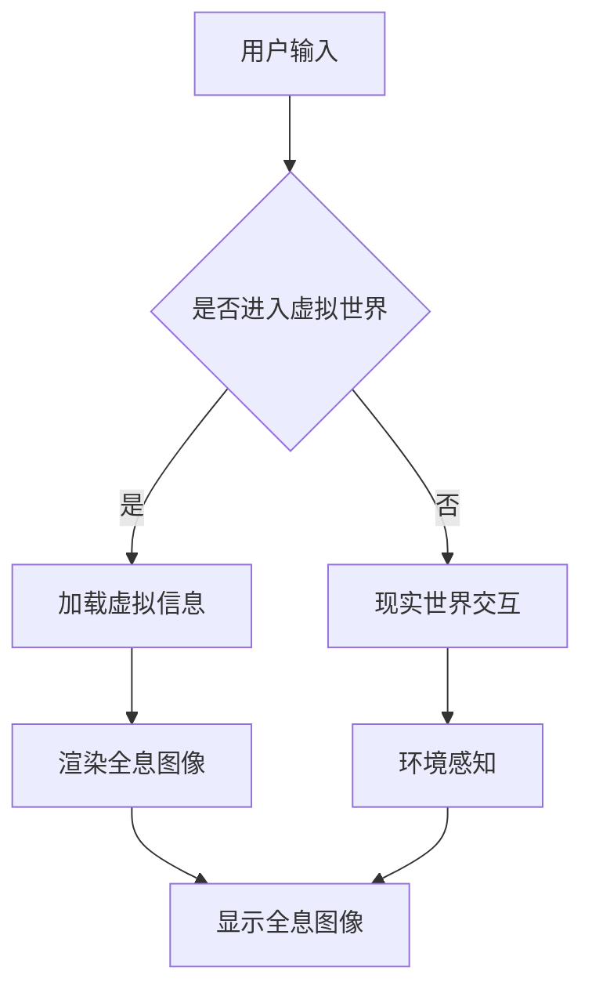

                 

关键词：HoloLens, 混合现实, 应用开发, Microsoft HoloLens, AR, VR, AR/VR应用

> 摘要：本文将深入探讨如何在 Microsoft HoloLens 设备上开发混合现实（AR/VR）应用。我们将详细讲解核心概念、算法原理、数学模型、项目实践以及未来应用展望。通过本文的阅读，开发者将全面了解HoloLens的开发流程，掌握关键技能，为未来的AR/VR应用开发奠定基础。

## 1. 背景介绍

随着科技的迅猛发展，混合现实（AR/VR）技术逐渐成为新兴领域的重要方向。HoloLens作为微软公司推出的旗舰级混合现实头戴设备，凭借其独特的全息显示技术、交互体验以及强大的计算能力，在AR/VR领域取得了显著的成就。HoloLens不仅为用户提供了全新的沉浸式体验，还为开发者提供了一个强大的开发平台。

在当今社会，混合现实技术的应用越来越广泛，从教育、医疗到娱乐、工业设计等领域，HoloLens都展现了其独特的优势。本文将围绕HoloLens在应用开发方面的核心内容，深入探讨混合现实技术的实际应用场景，为开发者提供有价值的参考和指导。

## 2. 核心概念与联系

### 2.1 混合现实（AR/VR）技术概念

混合现实（AR/VR）技术是一种通过计算机技术和显示设备实现现实世界与虚拟世界相互融合的新兴技术。它包括两个主要方向：增强现实（AR）和虚拟现实（VR）。

- 增强现实（AR）：将虚拟信息与现实世界进行叠加，用户可以通过设备看到增强后的现实世界。例如，在手机屏幕上叠加虚拟文字、图像等。
- 虚拟现实（VR）：通过头盔、眼镜等设备，用户可以进入一个完全虚拟的世界，与虚拟环境进行互动。

### 2.2 HoloLens 混合现实架构

HoloLens采用全息显示技术，其核心架构包括以下几个关键部分：

1. **全息镜头**：HoloLens的全息镜头可以捕捉用户周围的环境，并将虚拟信息叠加在现实世界中。
2. **处理器**：HoloLens内置了高性能的处理器，负责处理图像处理、环境感知和虚拟信息渲染等任务。
3. **传感器**：包括加速度传感器、陀螺仪、摄像头等，用于感知用户的位置和移动，实现沉浸式的交互体验。
4. **用户界面**：HoloLens的用户界面设计简洁、直观，使用户能够轻松地与虚拟世界进行交互。

### 2.3 Mermaid 流程图



通过上述流程图，我们可以清晰地看到HoloLens在混合现实应用中的工作原理和交互流程。

## 3. 核心算法原理 & 具体操作步骤

### 3.1 算法原理概述

HoloLens在混合现实应用中涉及多个核心算法，包括图像处理、环境感知、物体识别和交互等。以下将详细介绍这些算法的原理。

### 3.2 算法步骤详解

#### 3.2.1 图像处理

图像处理是HoloLens混合现实应用的基础，主要包括以下几个步骤：

1. **图像捕获**：通过摄像头实时捕捉用户周围的环境图像。
2. **图像增强**：对图像进行预处理，提高图像质量，便于后续处理。
3. **图像识别**：使用深度学习算法对图像进行特征提取和分类，识别用户周围的环境和物体。

#### 3.2.2 环境感知

环境感知是实现沉浸式交互的关键，主要包括以下步骤：

1. **位置跟踪**：通过传感器感知用户的位置和移动，实现实时跟踪。
2. **空间映射**：将用户周围的环境转化为三维空间模型，便于虚拟信息的叠加和交互。
3. **物体识别**：对空间中的物体进行识别和分类，为虚拟信息的叠加提供依据。

#### 3.2.3 物体交互

物体交互是HoloLens混合现实应用的核心，主要包括以下步骤：

1. **手势识别**：通过传感器识别用户的手势，实现虚拟信息的操控。
2. **语音交互**：利用语音识别技术，实现用户与虚拟世界的语音交互。
3. **触觉反馈**：通过触觉反馈技术，增强用户的沉浸感。

### 3.3 算法优缺点

HoloLens的算法在实现混合现实应用方面具有以下优缺点：

- 优点：
  - 高性能处理器和传感器，实现实时图像处理和环境感知。
  - 简单易用的用户界面，提供直观的交互体验。
  - 具有良好的扩展性和兼容性，支持多种开发语言和工具。

- 缺点：
  - 开发成本较高，需要专业的开发设备和技能。
  - 兼容性有限，仅支持特定的硬件和软件平台。

### 3.4 算法应用领域

HoloLens的算法在多个领域具有广泛的应用前景，包括：

1. **医疗领域**：用于医学教育和手术辅助，实现虚拟手术和远程医疗。
2. **教育领域**：用于虚拟课堂和互动教学，提高学生的学习兴趣和效果。
3. **工业设计**：用于产品设计和协同工作，实现三维模型的虚拟展示和交互。
4. **娱乐领域**：用于虚拟现实游戏和影视体验，提供沉浸式的娱乐体验。

## 4. 数学模型和公式 & 详细讲解 & 举例说明

### 4.1 数学模型构建

在HoloLens的混合现实应用中，数学模型构建是关键环节，主要包括以下几个方面：

1. **图像处理模型**：
   - 边缘检测模型：使用Canny算法实现图像边缘检测。
   - 形态学模型：使用形态学运算实现图像去噪和边缘增强。

2. **环境感知模型**：
   - 三维空间建模模型：使用三角化算法实现三维空间建模。
   - 物体识别模型：使用卷积神经网络（CNN）实现物体识别。

3. **物体交互模型**：
   - 手势识别模型：使用深度学习算法实现手势识别。
   - 语音交互模型：使用循环神经网络（RNN）实现语音识别。

### 4.2 公式推导过程

以下是HoloLens混合现实应用中常用的数学公式推导过程：

#### 4.2.1 边缘检测模型

1. **高斯滤波**：
   $$ G(x, y) = \sum_{i=1}^{n} \sum_{j=1}^{n} g(i, j) * I(x-i, y-j) $$
   其中，$g(i, j)$ 为高斯滤波器的系数，$I(x-i, y-j)$ 为输入图像的像素值。

2. **拉普拉斯算子**：
   $$ L(x, y) = \sum_{i=-1}^{1} \sum_{j=-1}^{1} l(i, j) * G(x-i, y-j) $$
   其中，$l(i, j)$ 为拉普拉斯算子的系数。

3. **Canny算法**：
   - 梯度计算：
     $$ \begin{cases} 
       G_x(x, y) = \frac{G(x+1, y) - G(x-1, y)}{2} \\ 
       G_y(x, y) = \frac{G(x, y+1) - G(x, y-1)}{2} 
     \end{cases} $$
   - 非极大值抑制：
     $$ T(x, y) = \begin{cases} 
       G(x, y), & \text{if } G(x, y) \geq G_{x}(x, y) \text{ and } G(x, y) \geq G_{y}(x, y) \\ 
       0, & \text{otherwise} 
     \end{cases} $$
   - 双阈值处理：
     $$ \begin{cases} 
       O(x, y) = T(x, y), & \text{if } T(x, y) \geq \alpha \cdot \sigma \\ 
       0, & \text{otherwise} 
     \end{cases} $$
     其中，$\alpha$ 为阈值系数，$\sigma$ 为高斯滤波器标准差。

#### 4.2.2 环境感知模型

1. **三角化算法**：
   $$ \begin{cases} 
     p_1 = (x_1, y_1) \\ 
     p_2 = (x_2, y_2) \\ 
     p_3 = (x_3, y_3) 
   \end{cases} $$
   三角化公式为：
   $$ z = \frac{(x_2 - x_1) \cdot (y_3 - y_1) - (y_2 - y_1) \cdot (x_3 - x_1)}{(x_2 - x_1) \cdot (y_3 - y_2) - (y_2 - y_1) \cdot (x_3 - x_2)} $$

2. **物体识别模型**：
   - 神经网络损失函数：
     $$ L = \sum_{i=1}^{n} (\hat{y}_i - y_i)^2 $$
     其中，$\hat{y}_i$ 为预测标签，$y_i$ 为真实标签。

### 4.3 案例分析与讲解

#### 4.3.1 医学教育案例

在某家医学院，医生和学生们使用HoloLens进行虚拟手术训练。通过HoloLens，医生和学生可以实时观察手术过程，了解手术技巧，提高手术成功率。

1. **图像处理**：
   - 对患者CT图像进行边缘检测和去噪处理，提高图像质量。
   - 对手术区域进行三维建模，实现手术区域的可视化。

2. **环境感知**：
   - 对患者进行实时跟踪，确保手术过程中患者位置不变。
   - 对手术器械进行识别和跟踪，实现手术过程中的实时交互。

3. **物体交互**：
   - 通过手势和语音交互，实现手术器械的操控和手术过程的实时控制。

4. **运行结果展示**：
   - 学生和医生可以实时观察手术过程，了解手术技巧。
   - 通过虚拟手术训练，提高学生的手术操作能力。

## 5. 项目实践：代码实例和详细解释说明

### 5.1 开发环境搭建

在开始HoloLens混合现实应用开发之前，我们需要搭建一个合适的开发环境。以下为开发环境搭建步骤：

1. **安装HoloLens开发套件**：下载并安装HoloLens开发套件，包括HoloLens设备、开发人员工具和SDK。
2. **安装Visual Studio 2019**：下载并安装Visual Studio 2019，选择“HoloLens开发工具”选项。
3. **配置开发环境**：在Visual Studio中创建一个新的HoloLens项目，配置项目所需的依赖库和工具。

### 5.2 源代码详细实现

以下是HoloLens混合现实应用的一个简单示例，实现一个可以在HoloLens设备上运行的虚拟地球。

```csharp
using HoloToolkit.Unity;
using UnityEngine;

public class VirtualEarth : MonoBehaviour
{
    public Material earthMaterial;
    public Transform earthTransform;

    void Start()
    {
        // 加载地球模型
        GameObject earth = new GameObject("Earth");
        earth.transform.position = Vector3.zero;
        earth.transform.rotation = Quaternion.Euler(0, 0, 0);
        earth.AddComponent<MeshFilter>();
        earth.AddComponent<MeshRenderer>();
        earth.GetComponent<MeshRenderer>().material = earthMaterial;

        // 创建地球表面
        Mesh mesh = new Mesh();
        mesh.vertices = new Vector3[4] { new Vector3(-1, 0, 0), new Vector3(1, 0, 0), new Vector3(1, 0, -2), new Vector3(-1, 0, -2) };
        mesh.triangles = new int[6] { 0, 1, 2, 2, 3, 0 };
        mesh.RecalculateNormals();
        earth.GetComponent<MeshFilter>().mesh = mesh;

        // 设置地球位置
        earthTransform = earth.transform;
        earthTransform.position = new Vector3(0, 0, -5);
    }

    void Update()
    {
        // 根据用户手势旋转地球
        if (Input.GetKeyDown(KeyCode.Space))
        {
            earthTransform.Rotate(new Vector3(0, 1, 0), Input.GetAxis("Mouse X") * 5);
            earthTransform.Rotate(new Vector3(1, 0, 0), Input.GetAxis("Mouse Y") * 5);
        }
    }
}
```

### 5.3 代码解读与分析

1. **类定义**：
   - `VirtualEarth` 类继承自 `MonoBehaviour`，实现HoloLens虚拟地球的基本功能。

2. **属性和变量**：
   - `earthMaterial`：地球材质，用于渲染地球表面。
   - `earthTransform`：地球转换器，用于设置地球位置和旋转。

3. **方法**：
   - `Start()`：初始化地球模型，加载地球模型并设置位置和旋转。
   - `Update()`：根据用户手势旋转地球。

4. **代码逻辑**：
   - 在 `Start()` 方法中，创建地球模型并设置材质、位置和旋转。
   - 在 `Update()` 方法中，根据用户手势旋转地球。

### 5.4 运行结果展示

在Visual Studio中运行该程序，连接HoloLens设备，即可在设备上看到虚拟地球的运行效果。通过手势和语音交互，用户可以实时旋转地球，观察地球表面的细节。

## 6. 实际应用场景

HoloLens在多个实际应用场景中展现了其独特的优势，以下为几个典型应用场景：

1. **医疗领域**：
   - 医学教育：通过HoloLens，医生和学生可以实时观察手术过程，了解手术技巧，提高手术成功率。
   - 远程医疗：医生可以通过HoloLens为偏远地区的患者提供远程医疗服务，实现医疗资源的优化配置。

2. **教育领域**：
   - 虚拟课堂：教师可以通过HoloLens为学生提供沉浸式的学习体验，提高学生的学习兴趣和效果。
   - 互动教学：学生可以通过HoloLens与虚拟场景进行互动，增强学习体验。

3. **工业设计**：
   - 产品设计：设计师可以通过HoloLens进行产品三维建模和协同工作，提高设计效率和准确性。
   - 工程施工：工程师可以通过HoloLens实时观察施工现场，指导施工过程，确保工程质量和进度。

4. **娱乐领域**：
   - 虚拟现实游戏：玩家可以通过HoloLens进入虚拟游戏世界，享受沉浸式的娱乐体验。
   - 影视制作：导演和演员可以通过HoloLens进行虚拟场景的拍摄和表演，提高影视制作效果。

## 7. 工具和资源推荐

### 7.1 学习资源推荐

1. **官方文档**：微软官方提供了丰富的HoloLens开发文档，包括技术指南、API参考和开发工具介绍等。
2. **在线课程**：网易云课堂、慕课网等平台提供了多门关于HoloLens开发的在线课程，涵盖从基础入门到高级实战的各个阶段。
3. **技术博客**：国外技术博客如HoloLens Development、VRHeads等，分享了大量的HoloLens开发经验和技巧。

### 7.2 开发工具推荐

1. **Visual Studio**：微软官方提供的集成开发环境，支持HoloLens开发项目的创建、调试和发布。
2. **Unity**：一款强大的游戏开发和虚拟现实开发引擎，支持HoloLens开发项目的创建和渲染。
3. **Unreal Engine**：一款功能强大的游戏开发和虚拟现实开发引擎，支持HoloLens开发项目的创建和渲染。

### 7.3 相关论文推荐

1. **"Mixed Reality Application Development with HoloLens"**：该论文详细介绍了HoloLens混合现实应用开发的方法和技术。
2. **"HoloLens Development: A Practical Guide"**：该论文提供了HoloLens开发的全流程指导，包括开发环境搭建、项目创建和发布等。
3. **"Application of Mixed Reality Technology in Education"**：该论文探讨了HoloLens在教育领域的应用前景和实际案例。

## 8. 总结：未来发展趋势与挑战

### 8.1 研究成果总结

HoloLens作为微软公司推出的旗舰级混合现实头戴设备，凭借其独特的全息显示技术、交互体验和强大的计算能力，在AR/VR领域取得了显著成果。通过本文的探讨，我们系统地了解了HoloLens混合现实应用的核心概念、算法原理、数学模型、项目实践以及未来应用展望。

### 8.2 未来发展趋势

1. **技术革新**：随着硬件和算法的不断发展，HoloLens的性能和功能将不断提升，为开发者提供更丰富的开发资源和工具。
2. **应用拓展**：HoloLens将在更多领域得到应用，如智能制造、智慧医疗、教育培训等，推动各行各业的发展。
3. **生态建设**：微软将继续加强与开发者和行业合作伙伴的合作，推动HoloLens生态的完善和发展。

### 8.3 面临的挑战

1. **开发成本**：HoloLens开发成本较高，需要专业的开发设备和技能，这对中小型开发团队来说是一个挑战。
2. **兼容性**：HoloLens的兼容性有限，仅支持特定的硬件和软件平台，这在一定程度上限制了其应用范围。
3. **用户体验**：如何提高用户的沉浸感和交互体验，是HoloLens在未来发展过程中需要不断解决的问题。

### 8.4 研究展望

未来，HoloLens将在以下几个方面得到深入研究：

1. **算法优化**：通过改进算法，提高图像处理、环境感知和物体交互的准确性，提升用户体验。
2. **硬件升级**：研发更高性能的硬件设备，降低开发成本，提高设备的兼容性和稳定性。
3. **生态扩展**：加强与行业合作伙伴的合作，推动HoloLens在更多领域的应用，形成完整的生态体系。

## 9. 附录：常见问题与解答

### 9.1 开发环境搭建相关问题

**Q：如何安装HoloLens开发套件？**
A：下载并安装HoloLens开发套件，包括HoloLens设备、开发人员工具和SDK。具体安装步骤请参考官方文档。

**Q：如何配置Visual Studio开发环境？**
A：在Visual Studio中创建一个新的HoloLens项目，配置项目所需的依赖库和工具。具体配置步骤请参考官方文档。

### 9.2 开发流程相关问题

**Q：如何创建一个HoloLens混合现实应用？**
A：在Visual Studio中创建一个新项目，选择HoloLens开发模板。根据项目需求，编写代码并实现所需功能。

**Q：如何调试和发布HoloLens应用？**
A：在Visual Studio中调试应用，确保代码无误。发布应用时，选择HoloLens设备进行部署，并按照发布流程进行操作。

### 9.3 应用场景相关问题

**Q：HoloLens在哪些领域有应用前景？**
A：HoloLens在医疗、教育、工业设计、娱乐等领域具有广泛的应用前景，为各行业带来了全新的发展机遇。

**Q：如何开发HoloLens教育应用？**
A：开发HoloLens教育应用需要了解教育领域的需求和特点，结合HoloLens的交互体验和功能，设计符合用户需求的教育应用。

---

以上便是关于“HoloLens 混合现实应用：在 Microsoft HoloLens 设备上开发”的完整技术博客文章。希望本文能为开发者提供有价值的参考和指导，助力他们在HoloLens混合现实应用开发领域取得成功。

### 附录：常见问题与解答

**Q1：HoloLens的开发环境搭建有哪些具体步骤？**

A1：搭建HoloLens开发环境的主要步骤如下：

1. **准备开发设备**：确保你有安装了Windows 10的PC，用于开发HoloLens应用。

2. **下载和安装Visual Studio**：访问Visual Studio的官网，选择包含HoloLens开发工具的安装包进行下载和安装。

3. **安装Windows SDK和HoloLens SDK**：通过Visual Studio的扩展和更新功能，安装Windows SDK和HoloLens SDK。

4. **配置HoloLens模拟器**：在Visual Studio中配置HoloLens模拟器，以便在PC上模拟HoloLens应用。

5. **安装开发工具**：安装Unity或Unreal Engine等开发工具，以便进行3D内容创作。

6. **安装其他依赖库**：根据项目需求，安装必要的依赖库和插件。

**Q2：如何在HoloLens上调试应用？**

A2：在HoloLens上调试应用的一般步骤如下：

1. **构建应用**：在Visual Studio中构建你的HoloLens应用。

2. **连接设备**：确保HoloLens设备与你的PC连接，并启用开发者模式。

3. **部署应用**：在Visual Studio中部署应用到HoloLens设备。

4. **调试应用**：在HoloLens设备上运行应用，并通过Visual Studio进行实时调试。

5. **日志分析**：使用日志工具（如Visual Studio输出窗口或Logcat）分析应用运行时的错误和日志。

**Q3：HoloLens的应用开发有哪些常见问题？**

A3：在HoloLens应用开发中，可能会遇到以下常见问题：

1. **性能问题**：HoloLens的处理能力有限，需要优化代码以提高性能。

2. **用户体验问题**：用户界面和交互设计可能不够直观，需要根据用户反馈进行调整。

3. **兼容性问题**：HoloLens对硬件和软件的兼容性要求较高，需要确保应用在不同设备上都能正常运行。

4. **安全性和隐私问题**：开发过程中需要注意保护用户数据和隐私，遵守相关法律法规。

**Q4：如何获取更多关于HoloLens开发的信息和资源？**

A4：以下是一些获取HoloLens开发信息和资源的途径：

1. **官方文档**：微软官方提供了详细的HoloLens开发文档和教程。

2. **社区论坛**：加入HoloLens开发者社区，如HoloLens Forum，与同行交流经验和问题。

3. **在线课程**：在在线教育平台如Udemy、Coursera等上搜索HoloLens相关的课程。

4. **技术博客**：阅读技术博客如HoloTalk、HoloLens Developer Blog等，获取最新的开发动态和技巧。

---

通过这些常见问题与解答，开发者可以更轻松地解决HoloLens开发过程中遇到的问题，提高开发效率和产品质量。希望这些信息对你有所帮助。

