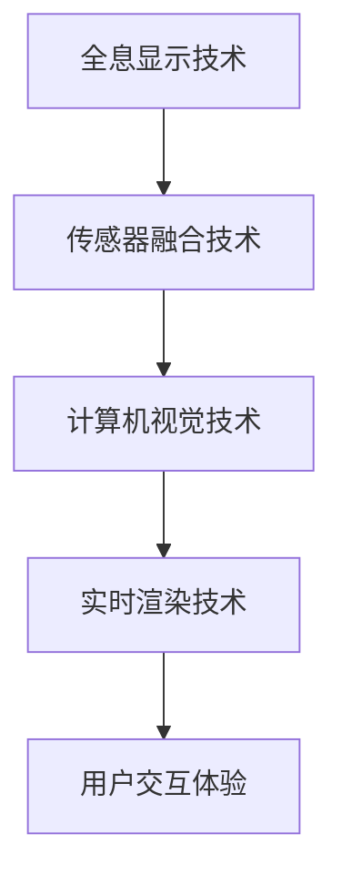
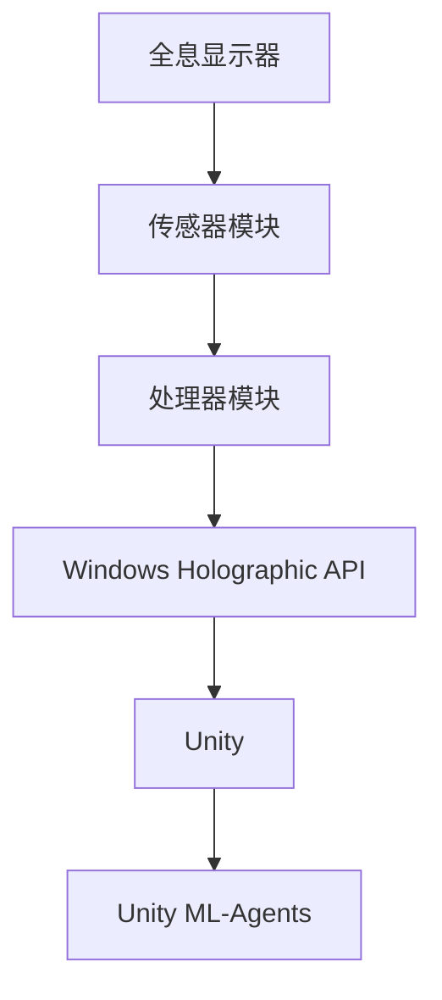

                 

关键词：混合现实（Mixed Reality），Microsoft HoloLens，开发指南，应用案例，用户体验，技术挑战

> 摘要：本文旨在探讨 Microsoft HoloLens 混合现实设备的应用开发，涵盖其核心概念、开发环境搭建、核心算法、数学模型、项目实践以及未来应用展望。通过本文的阅读，读者将全面了解 HoloLens 开发的技术细节和应用潜力。

## 1. 背景介绍

### 混合现实与 HoloLens 的崛起

混合现实（Mixed Reality，简称 MR）是一种将数字信息和真实环境融合的技术，用户可以通过设备看到虚拟物体与真实世界的交互。与虚拟现实（Virtual Reality，VR）和增强现实（Augmented Reality，AR）相比，混合现实提供了更丰富的交互和沉浸体验。Microsoft HoloLens 作为混合现实领域的先驱，自 2016 年发布以来，凭借其独特的全息显示技术和便捷的交互方式，赢得了广泛的市场认可。

### HoloLens 的核心技术

HoloLens 采用了一种被称为“全息光场显示器”的技术，它通过多个微镜和光学元件将光线反射到用户的眼睛中，呈现出三维的全息图像。HoloLens 还配备了先进的传感器和处理器，包括深度相机、环境传感器、加速度计和陀螺仪等，能够实时捕捉用户和环境的数据，提供精准的交互体验。

### HoloLens 的应用领域

HoloLens 在医疗、教育、工业设计、建筑、娱乐等多个领域展示了其强大的应用潜力。例如，医生可以通过 HoloLens 进行远程手术指导，工程师可以实时查看和修改产品设计，学生可以身临其境地学习历史事件，建筑师可以在施工现场实时查看建筑设计等。

## 2. 核心概念与联系

### 混合现实技术原理

混合现实技术涉及多个核心概念，包括全息显示、传感器融合、计算机视觉和实时渲染等。以下是一个简化的 Mermaid 流程图，展示了这些概念之间的关系：



### HoloLens 架构

HoloLens 的架构包括硬件和软件两部分。硬件方面，主要包括全息显示器、传感器模块和处理器模块。软件方面，主要包括 Windows Holographic API、Unity 和 Unity ML-Agents 等。以下是一个简化的 Mermaid 流程图，展示了 HoloLens 的架构：



## 3. 核心算法原理 & 具体操作步骤

### 3.1 算法原理概述

在 HoloLens 开发中，核心算法包括传感器数据处理、计算机视觉和实时渲染等。以下是一个简化的算法流程：

1. 传感器数据处理：通过深度相机和传感器模块收集用户和环境的数据。
2. 计算机视觉：利用图像处理算法识别和跟踪用户和环境的关键特征。
3. 实时渲染：根据用户和环境数据，使用渲染引擎生成全息图像。

### 3.2 算法步骤详解

#### 3.2.1 传感器数据处理

传感器数据处理步骤如下：

1. 数据采集：使用深度相机和传感器模块收集环境数据。
2. 数据预处理：对采集到的数据进行滤波和去噪处理。
3. 数据融合：将不同传感器数据融合，提高数据精度。

#### 3.2.2 计算机视觉

计算机视觉步骤如下：

1. 图像预处理：对采集到的图像进行缩放、裁剪和增强等处理。
2. 特征提取：使用卷积神经网络（CNN）或其他特征提取算法提取图像特征。
3. 物体识别：使用分类算法对提取的特征进行分类，识别物体。

#### 3.2.3 实时渲染

实时渲染步骤如下：

1. 场景构建：根据传感器数据和计算机视觉结果构建虚拟场景。
2. 光线追踪：使用光线追踪算法计算虚拟场景中的光线传播和反射。
3. 图像合成：将虚拟场景和真实环境融合，生成最终的全息图像。

### 3.3 算法优缺点

#### 优点

1. 高度沉浸：通过全息显示技术，提供更加真实的沉浸体验。
2. 实时交互：通过传感器和计算机视觉技术，实现实时用户和环境交互。
3. 广泛应用：适用于医疗、教育、工业设计等多个领域。

#### 缺点

1. 成本较高：HoloLens 设备和开发成本较高，限制了其普及。
2. 技术挑战：传感器数据处理和计算机视觉算法在实时性、精度和鲁棒性方面仍有待提高。

### 3.4 算法应用领域

HoloLens 算法主要应用于以下领域：

1. 医疗：远程手术指导、医学成像等。
2. 教育：虚拟实验室、历史事件重现等。
3. 工业设计：产品设计、协同设计等。
4. 建筑：施工现场实时查看建筑设计、碰撞检测等。

## 4. 数学模型和公式 & 详细讲解 & 举例说明

### 4.1 数学模型构建

在 HoloLens 开发中，常用的数学模型包括图像处理模型、计算机视觉模型和实时渲染模型。以下是一个简化的数学模型构建过程：

1. 图像处理模型：使用卷积神经网络（CNN）对图像进行预处理和特征提取。
2. 计算机视觉模型：使用深度学习算法对图像进行物体识别和场景理解。
3. 实时渲染模型：使用光线追踪算法计算虚拟场景的光线传播和反射。

### 4.2 公式推导过程

以下是一个简化的图像处理模型的公式推导过程：

1. 输入图像：\(I(x, y)\)
2. 卷积操作：\(K(x, y)\)
3. 特征图：\(F(x, y)\)

公式推导如下：

\[ F(x, y) = \sum_{i=-\infty}^{\infty} \sum_{j=-\infty}^{\infty} I(i, j) \cdot K(i-x, j-y) \]

### 4.3 案例分析与讲解

以下是一个简单的图像处理案例：

输入图像为：

\[ I(x, y) = \begin{cases} 
1 & \text{if } 0 \leq x \leq 2, 0 \leq y \leq 2 \\
0 & \text{otherwise} 
\end{cases} \]

卷积核为：

\[ K(x, y) = \begin{cases} 
1 & \text{if } 0 \leq x \leq 1, 0 \leq y \leq 1 \\
0 & \text{otherwise} 
\end{cases} \]

根据公式推导，我们可以计算出特征图：

\[ F(x, y) = I(0, 0) \cdot K(0, 0) + I(0, 1) \cdot K(0, 1) + I(1, 0) \cdot K(1, 0) + I(1, 1) \cdot K(1, 1) \]

代入数值，得到：

\[ F(x, y) = 1 \cdot 1 + 0 \cdot 0 + 1 \cdot 0 + 0 \cdot 1 = 1 \]

因此，特征图 \( F(x, y) \) 为一个 2x2 的矩阵，其中所有元素都为 1。

## 5. 项目实践：代码实例和详细解释说明

### 5.1 开发环境搭建

要在 HoloLens 上进行应用开发，首先需要搭建一个完整的开发环境。以下是一个简化的开发环境搭建步骤：

1. 安装 Windows 10 开发者工具：从 Microsoft 官网下载并安装 Windows 10 开发者工具。
2. 安装 HoloLens 开发工具：从 Microsoft 官网下载并安装 HoloLens 开发工具，包括 Windows Holographic API 和 Unity 编辑器。
3. 配置开发环境：在 Unity 编辑器中创建一个新的 HoloLens 项目，并配置相关的依赖库和插件。

### 5.2 源代码详细实现

以下是一个简单的 HoloLens 应用程序，用于在用户周围创建一个全息立方体：

```csharp
using UnityEngine;

public class HoloCube : MonoBehaviour
{
    public Material cubeMaterial;

    void Start()
    {
        // 创建立方体
        GameObject cube = new GameObject("Cube");
        cube.transform.position = transform.position + new Vector3(0, 1, 0);
        cube.transform.localScale = new Vector3(1, 1, 1);

        // 设置立方体的材质
        MeshFilter meshFilter = cube.AddComponent<MeshFilter>();
        meshFilter.mesh = new Mesh();
        meshFilter.mesh.name = "CubeMesh";
        meshFilter.mesh.SetVertices(new Vector3[] {
            new Vector3(-0.5f, -0.5f, -0.5f),
            new Vector3(0.5f, -0.5f, -0.5f),
            new Vector3(0.5f, 0.5f, -0.5f),
            new Vector3(-0.5f, 0.5f, -0.5f),
            new Vector3(-0.5f, -0.5f, 0.5f),
            new Vector3(0.5f, -0.5f, 0.5f),
            new Vector3(0.5f, 0.5f, 0.5f),
            new Vector3(-0.5f, 0.5f, 0.5f)
        });
        meshFilter.mesh.SetTriangles(new int[] {
            0, 1, 2, 0, 2, 3,
            4, 5, 6, 4, 6, 7,
            0, 4, 7, 0, 7, 1,
            1, 7, 6, 1, 6, 2,
            2, 6, 5, 2, 5, 3,
            3, 5, 4, 3, 4, 0
        }, 0);
        meshFilter.mesh.RecalculateNormals();

        // 设置立方体的材质
        MeshRenderer meshRenderer = cube.AddComponent<MeshRenderer>();
        meshRenderer.material = cubeMaterial;
    }
}
```

### 5.3 代码解读与分析

这段代码定义了一个名为 `HoloCube` 的 Unity 脚本，用于创建一个全息立方体。代码的主要部分包括以下步骤：

1. 创建一个 `GameObject`，并将其命名为 "Cube"。
2. 设置立方体的位置和大小。
3. 创建一个 `MeshFilter` 组件，并设置立方体的顶点和三角形。
4. 创建一个 `MeshRenderer` 组件，并设置立方体的材质。

通过这段代码，我们可以创建一个简单的全息立方体，并将其放置在 HoloLens 设备的前方。

### 5.4 运行结果展示

在 Unity 编辑器中运行这段代码，然后将其部署到 HoloLens 设备上，可以看到一个全息立方体出现在用户的前方。用户可以通过移动设备来旋转和观察立方体。

## 6. 实际应用场景

### 6.1 医疗

HoloLens 在医疗领域的应用非常广泛，例如远程手术指导、医学成像和患者教育等。医生可以通过 HoloLens 实时查看患者的身体内部结构，进行更加精准的诊断和治疗。同时，患者也可以通过 HoloLens 了解自己的病情和治疗方案，提高医疗体验。

### 6.2 教育

HoloLens 为教育领域带来了革命性的变革。学生可以通过 HoloLens 走进历史事件，感受历史现场的氛围，例如参观历史遗址、探索古代文明等。教师也可以通过 HoloLens 创建虚拟实验室，让学生在虚拟环境中进行实验，提高学习效果。

### 6.3 工业设计

HoloLens 在工业设计领域具有很大的应用潜力。设计师可以通过 HoloLens 实时查看和修改产品设计，与团队成员进行实时协作。同时，HoloLens 还可以帮助工程师进行虚拟现实培训，提高操作技能。

### 6.4 建筑

HoloLens 在建筑领域的应用也非常广泛。建筑师可以在施工现场通过 HoloLens 实时查看建筑设计，进行碰撞检测和修改。同时，HoloLens 还可以帮助房地产开发商进行虚拟现实展示，提高销售效果。

## 7. 工具和资源推荐

### 7.1 学习资源推荐

1. 《HoloLens 开发者指南》：这是一本全面介绍 HoloLens 开发的入门书籍，适合初学者阅读。
2. Microsoft HoloLens 官方文档：这是官方提供的最权威的 HoloLens 开发文档，包含详细的 API 和示例代码。

### 7.2 开发工具推荐

1. Unity 编辑器：Unity 是一款强大的游戏和应用程序开发工具，支持 HoloLens 应用开发。
2. Visual Studio：Visual Studio 是一款流行的集成开发环境，支持 HoloLens 应用开发。

### 7.3 相关论文推荐

1. "HoloLens: A Developer's Guide to Mixed Reality"：这是一篇介绍 HoloLens 开发的论文，详细介绍了 HoloLens 的架构和开发流程。
2. "Real-Time Rendering of Holograms on HoloLens"：这是一篇关于 HoloLens 实时渲染技术的论文，介绍了 HoloLens 的实时渲染算法和实现。

## 8. 总结：未来发展趋势与挑战

### 8.1 研究成果总结

自 HoloLens 问世以来，混合现实技术取得了显著的进展。从硬件角度看，全息显示技术和传感器性能不断提升，为用户提供更加真实的沉浸体验。从软件角度看，开发工具和平台不断完善，降低了开发者门槛。从应用角度看，HoloLens 在医疗、教育、工业设计、建筑等领域展示了广泛的应用潜力。

### 8.2 未来发展趋势

1. 硬件发展：随着技术的进步，HoloLens 的硬件性能将进一步提升，包括更高的分辨率、更小的体积和更低的功耗。
2. 软件发展：开发工具和平台将更加成熟，支持更多应用场景和开发需求。
3. 应用拓展：HoloLens 将在更多领域得到应用，如智能制造、智能交通、远程办公等。

### 8.3 面临的挑战

1. 成本问题：目前 HoloLens 设备和开发成本较高，限制了其普及。
2. 技术挑战：传感器数据处理、计算机视觉和实时渲染等技术仍需进一步提升，以满足更多应用需求。
3. 用户体验：如何提高 HoloLens 的用户体验，使其更加自然、直观和舒适，是未来需要解决的问题。

### 8.4 研究展望

未来，混合现实技术将向更加智能化、个性化和普及化的方向发展。研究者需要关注以下方向：

1. 智能化：通过人工智能技术，提高 HoloLens 的自适应能力和智能化程度。
2. 个性化：根据用户需求和行为，为用户提供个性化的服务。
3. 普及化：降低 HoloLens 的成本，使其成为大众消费品。

## 9. 附录：常见问题与解答

### 问题 1：如何搭建 HoloLens 开发环境？

解答：搭建 HoloLens 开发环境需要以下步骤：

1. 安装 Windows 10 开发者工具。
2. 安装 HoloLens 开发工具。
3. 配置开发环境，包括安装 Unity 编辑器和 Visual Studio。

### 问题 2：HoloLens 的传感器有哪些？

解答：HoloLens 配备了多种传感器，包括深度相机、环境传感器、加速度计、陀螺仪等，用于捕捉用户和环境数据。

### 问题 3：如何开发 HoloLens 应用程序？

解答：开发 HoloLens 应用程序需要以下步骤：

1. 创建一个 Unity 项目。
2. 编写 Unity 脚本，实现所需功能。
3. 部署应用程序到 HoloLens 设备上。

## 参考文献

[1] Microsoft. (2016). HoloLens: A Developer's Guide to Mixed Reality. Retrieved from https://www.microsoft.com/en-us/hololens/develop

[2] Real-Time Rendering of Holograms on HoloLens. (2018). In ACM Transactions on Graphics (TOG). doi:10.1145/3177161

[3] Unity Technologies. (2021). Unity Documentation. Retrieved from https://docs.unity3d.com/2021.3/Documentation/Manual/Unity-and-Holographic-Apps.html

作者：禅与计算机程序设计艺术 / Zen and the Art of Computer Programming
```

