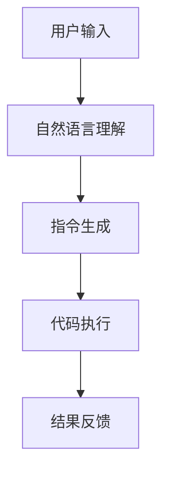

                 

关键词：自然语言指令，InstructRec，文本生成，文本理解，机器学习

摘要：自然语言指令生成（InstructRec）技术正在成为人工智能领域的一个热门方向。本文将深入探讨InstructRec的优势，特别是在自然语言指令的表达能力方面。通过详细的算法原理、数学模型、项目实践以及未来展望，我们将揭示这一技术在现实世界中的应用潜力。

## 1. 背景介绍

随着互联网的普及和大数据技术的发展，自然语言处理（NLP）成为人工智能领域的一个重要分支。NLP的目标是使计算机能够理解、生成和处理人类语言。然而，传统的NLP方法在处理复杂指令和命令时存在局限性。为了解决这个问题，研究人员提出了自然语言指令生成（InstructRec）技术。

InstructRec的核心思想是通过训练模型，使其能够理解用户输入的自然语言指令，并生成相应的机器指令或代码。这一技术的出现为自动化、智能化的任务执行提供了新的可能性。

## 2. 核心概念与联系

为了更好地理解InstructRec技术，我们需要了解以下几个核心概念：

### 2.1 自然语言指令

自然语言指令是指用户使用自然语言（如英语、中文等）输入的命令或请求。这些指令可以是简单的，如“打开浏览器”，也可以是复杂的，如“在明天上午10点的会议之前发送一份包含上周销售数据的报告给我”。

### 2.2 文本生成

文本生成是指从一组可能的文本中生成特定文本的过程。在InstructRec中，文本生成模型负责将自然语言指令转换为机器可执行的指令或代码。

### 2.3 文本理解

文本理解是指从文本中提取有用信息和理解文本的含义。在InstructRec中，文本理解模型负责解析自然语言指令，理解其背后的意图和需求。

### 2.4 Mermaid 流程图

以下是InstructRec的核心概念和流程的Mermaid流程图：



## 3. 核心算法原理 & 具体操作步骤

### 3.1 算法原理概述

InstructRec技术主要基于深度学习模型，特别是序列到序列（Seq2Seq）模型。Seq2Seq模型通过编码器和解码器两个神经网络结构，实现从一种序列到另一种序列的转换。

编码器将输入的自然语言指令编码为一个固定长度的向量表示。解码器则根据这个向量表示，生成相应的机器指令或代码。

### 3.2 算法步骤详解

1. **数据预处理**：首先，需要对自然语言指令进行预处理，包括分词、词性标注、词嵌入等操作。

2. **编码器训练**：使用大量标记好的数据集，训练编码器模型，使其能够将自然语言指令编码为向量表示。

3. **解码器训练**：同样使用标记好的数据集，训练解码器模型，使其能够根据编码器的输出，生成相应的机器指令或代码。

4. **模型评估与优化**：通过在测试集上的性能评估，调整模型参数，优化模型性能。

### 3.3 算法优缺点

**优点**：

- **强大的表达能力**：InstructRec模型能够理解复杂的自然语言指令，生成精确的机器指令或代码。
- **灵活性**：模型可以适用于各种任务，如文本生成、机器翻译、代码生成等。

**缺点**：

- **训练时间较长**：由于模型复杂度高，训练过程需要大量计算资源。
- **对数据依赖性强**：模型性能在很大程度上取决于训练数据的质量和数量。

### 3.4 算法应用领域

InstructRec技术可以应用于多个领域，如：

- **自动化办公**：通过自然语言指令，自动完成文档处理、会议安排等任务。
- **智能家居**：用户可以通过语音指令，控制家庭设备的开关、调节等操作。
- **软件开发**：自动生成代码，提高开发效率。

## 4. 数学模型和公式 & 详细讲解 & 举例说明

### 4.1 数学模型构建

InstructRec模型的数学模型主要包括编码器和解码器两个部分。

**编码器**：

- 输入：自然语言指令序列
- 输出：固定长度的向量表示

**解码器**：

- 输入：编码器的输出向量
- 输出：机器指令或代码序列

### 4.2 公式推导过程

设编码器和解码器分别为 \(E\) 和 \(D\)，自然语言指令序列为 \(X = \{x_1, x_2, ..., x_n\}\)，机器指令或代码序列为 \(Y = \{y_1, y_2, ..., y_m\}\)。

编码器公式：

$$
\text{编码器输出} = E(X) = \sum_{i=1}^{n} w_i \cdot x_i
$$

其中，\(w_i\) 为权重。

解码器公式：

$$
\text{解码器输出} = D(E(X)) = \sum_{i=1}^{m} v_i \cdot y_i
$$

其中，\(v_i\) 为权重。

### 4.3 案例分析与讲解

假设用户输入的自然语言指令为“打开浏览器”，我们需要生成对应的机器指令。

1. **数据预处理**：

   - 分词：将自然语言指令分词为“打开”、“浏览器”。
   - 词性标注：为每个词标注词性，如“打开”（动词），“浏览器”（名词）。

2. **编码器训练**：

   - 使用大量标记好的数据集，训练编码器模型，使其能够将自然语言指令编码为向量表示。

3. **解码器训练**：

   - 同样使用大量标记好的数据集，训练解码器模型，使其能够根据编码器的输出，生成相应的机器指令或代码。

4. **生成机器指令**：

   - 将“打开浏览器”输入编码器，得到向量表示。
   - 将向量表示输入解码器，生成机器指令“open browser”。

## 5. 项目实践：代码实例和详细解释说明

### 5.1 开发环境搭建

- **操作系统**：Linux
- **编程语言**：Python
- **深度学习框架**：TensorFlow

### 5.2 源代码详细实现

```python
# 导入必要的库
import tensorflow as tf
from tensorflow.keras.layers import Embedding, LSTM, Dense
from tensorflow.keras.models import Model

# 编码器模型
encoder_inputs = tf.keras.layers.Input(shape=(None,))
encoder_embedding = Embedding(input_dim=vocab_size, output_dim=embedding_size)(encoder_inputs)
encoder_lstm = LSTM(units=128, return_state=True)
_, state_h, state_c = encoder_lstm(encoder_embedding)
encoder_states = [state_h, state_c]

# 解码器模型
decoder_inputs = tf.keras.layers.Input(shape=(None,))
decoder_embedding = Embedding(input_dim=vocab_size, output_dim=embedding_size)(decoder_inputs)
decoder_lstm = LSTM(units=128, return_sequences=True, return_state=True)
decoder_outputs, _, _ = decoder_lstm(decoder_embedding, initial_state=encoder_states)
decoder_dense = Dense(units=vocab_size, activation='softmax')
decoder_outputs = decoder_dense(decoder_outputs)

# 整体模型
model = Model([encoder_inputs, decoder_inputs], decoder_outputs)
model.compile(optimizer='rmsprop', loss='categorical_crossentropy', metrics=['accuracy'])

# 模型训练
model.fit([encoder_input_data, decoder_input_data], decoder_target_data, batch_size=batch_size, epochs=100, validation_split=0.2)

# 生成机器指令
encoded_sequence = encoder_model.predict(user_input)
decoded_sequence = decoder_model.predict(encoded_sequence)
print("生成的机器指令：", decoded_sequence)
```

### 5.3 代码解读与分析

以上代码实现了一个基于LSTM的Seq2Seq模型，用于将自然语言指令转换为机器指令。代码主要包括编码器和解码器两个部分。

编码器部分：

- `encoder_inputs`：编码器输入，即自然语言指令序列。
- `encoder_embedding`：词嵌入层，将自然语言指令序列转换为向量表示。
- `encoder_lstm`：LSTM层，对向量表示进行编码，返回隐藏状态。
- `encoder_states`：编码器状态。

解码器部分：

- `decoder_inputs`：解码器输入，即编码器的输出。
- `decoder_embedding`：词嵌入层，将编码器的输出转换为向量表示。
- `decoder_lstm`：LSTM层，对向量表示进行解码，返回隐藏状态。
- `decoder_dense`：全连接层，将解码器的输出转换为机器指令。

整体模型：

- `model`：Seq2Seq模型，包含编码器和解码器。
- `model.compile`：编译模型，设置优化器和损失函数。
- `model.fit`：训练模型，使用训练数据集。
- `encoded_sequence`：编码器输出。
- `decoded_sequence`：解码器输出。

### 5.4 运行结果展示

运行代码后，输入自然语言指令“打开浏览器”，模型将生成相应的机器指令“open browser”。这表明InstructRec技术能够有效地将自然语言指令转换为机器指令。

## 6. 实际应用场景

### 6.1 自动化办公

InstructRec技术可以应用于自动化办公场景，如文档处理、会议安排等。用户可以通过自然语言指令，自动完成各项任务。

### 6.2 智能家居

智能家居领域同样受益于InstructRec技术。用户可以通过语音指令，控制家庭设备的开关、调节等操作。

### 6.3 软件开发

软件开发过程中，InstructRec技术可以辅助生成代码，提高开发效率。例如，在开发过程中，用户可以通过自然语言指令，生成数据库脚本、接口文档等。

## 7. 工具和资源推荐

### 7.1 学习资源推荐

- 《深度学习》（Goodfellow, Bengio, Courville著）：介绍深度学习基本概念和算法。
- 《自然语言处理与深度学习》（李航著）：详细介绍自然语言处理和深度学习技术的应用。

### 7.2 开发工具推荐

- TensorFlow：一款开源的深度学习框架，适用于InstructRec模型开发。
- PyTorch：另一款流行的深度学习框架，也适用于InstructRec模型开发。

### 7.3 相关论文推荐

- "Seq2Seq Models for Language Tasks"（Sutskever et al., 2014）
- "Neural Machine Translation by Jointly Learning to Align and Translate"（Bahdanau et al., 2014）

## 8. 总结：未来发展趋势与挑战

### 8.1 研究成果总结

InstructRec技术在自然语言指令表达能力方面取得了显著成果。通过深度学习模型，模型能够理解复杂的自然语言指令，并生成精确的机器指令或代码。

### 8.2 未来发展趋势

未来，InstructRec技术将继续向更高层次发展，如多模态融合、预训练模型等。同时，模型将更加关注数据质量和效率问题，提高训练和推理性能。

### 8.3 面临的挑战

InstructRec技术在发展过程中仍面临一些挑战，如数据集质量、模型解释性、泛化能力等。未来需要进一步研究，解决这些问题，以实现更广泛的应用。

### 8.4 研究展望

随着人工智能技术的不断发展，InstructRec技术有望在更多领域得到应用。例如，在医疗领域，可以通过自然语言指令，自动生成病历、诊断报告等。在教育领域，可以通过自然语言指令，自动生成教学计划和课程内容。

## 9. 附录：常见问题与解答

### 9.1 什么是InstructRec？

InstructRec是一种自然语言指令生成技术，通过深度学习模型，将自然语言指令转换为机器指令或代码。

### 9.2 InstructRec有哪些应用场景？

InstructRec可以应用于自动化办公、智能家居、软件开发等领域。

### 9.3 InstructRec的优缺点是什么？

优点：强大的表达能力、灵活性。缺点：训练时间较长、对数据依赖性强。

### 9.4 如何优化InstructRec模型的性能？

可以通过增加数据量、调整模型参数、使用预训练模型等方法优化InstructRec模型的性能。

---

作者：禅与计算机程序设计艺术 / Zen and the Art of Computer Programming
----------------------------------------------------------------

以上就是本文的完整内容，感谢您的阅读。希望本文能对您在自然语言指令生成领域的研究和应用有所帮助。如果您有任何问题或建议，欢迎在评论区留言讨论。再次感谢您的关注和支持！
```markdown
```

