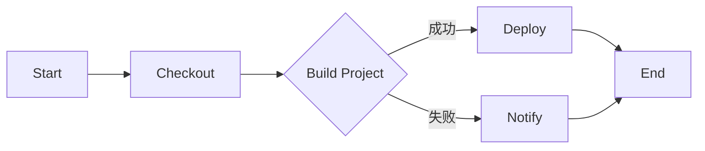

                 

 

## 1. 背景介绍

持续集成（Continuous Integration，简称CI）是敏捷开发中的一项重要实践，旨在通过频繁地将代码合并到主干分支，以尽早发现并解决集成过程中可能出现的冲突和问题。而Jenkins，作为一款功能强大的开源持续集成工具，已经成为许多开发团队的首选。

Jenkins的主要功能包括但不限于：自动化构建、测试、部署等，通过配置Jenkinsfile，可以实现持续集成和持续部署（Continuous Deployment，简称CD）。本文将围绕Jenkins持续集成Pipeline的设计，详细探讨其核心概念、原理以及具体实现方法。

## 2. 核心概念与联系

### 2.1 持续集成（CI）

持续集成是一种软件开发实践，强调频繁地将代码变更合并到主干分支，并进行自动化测试和构建。这种方式有助于尽早发现和解决潜在的问题，提高代码质量和开发效率。

### 2.2 Jenkins

Jenkins是一款开源的持续集成工具，支持多种版本控制工具（如Git、SVN等），可以轻松集成各种插件，实现自动化构建、测试、部署等功能。

### 2.3 Pipeline

Pipeline是Jenkins的一种持续交付功能，通过定义Jenkinsfile，可以描述从代码仓库获取、构建、测试到部署的整个过程，实现自动化流水线。

### 2.4 Mermaid 流程图

为了更直观地展示Jenkins持续集成Pipeline的设计，我们使用Mermaid流程图来描述整个流程。



### 2.5 核心概念联系

通过上述核心概念的联系，我们可以看出Jenkins持续集成Pipeline的设计主要包括以下几个步骤：检出代码、构建项目、测试、部署和通知。这些步骤通过Jenkinsfile进行定义和配置，实现整个过程的自动化。

## 3. 核心算法原理 & 具体操作步骤

### 3.1 算法原理概述

Jenkins持续集成Pipeline的核心算法原理主要包括以下几个方面：

1. 检出代码：通过版本控制工具（如Git）将代码从远程仓库检出，确保代码的版本一致性。
2. 构建项目：使用构建工具（如Maven、Gradle）对项目进行编译和打包，生成可执行的jar文件。
3. 测试：运行自动化测试用例，验证代码的正确性和稳定性。
4. 部署：将构建成功的项目部署到测试或生产环境，进行实际运行验证。
5. 通知：在构建失败或发生其他异常时，通过邮件、钉钉等通知工具通知相关人员。

### 3.2 算法步骤详解

1. **检出代码**

   在Jenkinsfile中，使用Git插件检出代码：

   ```groovy
   git 'https://github.com/your-repo.git'
   ```

   该命令会将代码从远程仓库检出，确保代码的版本一致性。

2. **构建项目**

   使用Maven或Gradle插件构建项目：

   ```groovy
   sh 'mvn clean install'
   // 或
   sh 'gradle build'
   ```

   该命令会编译和打包项目，生成可执行的jar文件。

3. **测试**

   运行自动化测试用例：

   ```groovy
   sh 'mvn test'
   // 或
   sh 'gradle test'
   ```

   该命令会执行项目中的测试用例，验证代码的正确性和稳定性。

4. **部署**

   部署项目到测试或生产环境：

   ```groovy
   sh 'ssh user@server "java -jar target/your-app.jar"'
   ```

   该命令会将构建成功的项目部署到指定的服务器上，进行实际运行验证。

5. **通知**

   在构建失败或发生其他异常时，使用Jenkins内置的邮件插件发送通知：

   ```groovy
   mail to: 'user@example.com', subject: 'Build Failed', body: 'Your build has failed due to some errors.'
   ```

### 3.3 算法优缺点

**优点：**

1. 自动化：Jenkins持续集成Pipeline可以自动化执行整个流程，提高开发效率。
2. 提早发现问题：通过频繁的集成和测试，可以尽早发现和解决潜在的问题。
3. 提高代码质量：持续集成和持续部署有助于提高代码质量和稳定性。

**缺点：**

1. 需要一定的学习和配置成本：Jenkins持续集成Pipeline需要一定的学习和配置成本，对于新手可能不太友好。
2. 可能会影响代码的提交频率：为了确保代码的质量，需要频繁地执行测试和构建，可能会对开发者的提交频率产生影响。

### 3.4 算法应用领域

Jenkins持续集成Pipeline广泛应用于各种开发场景，尤其适合以下领域：

1. 敏捷开发：持续集成和持续部署是敏捷开发中的重要实践，可以帮助团队提高开发效率和质量。
2. 分布式团队：通过Jenkins持续集成Pipeline，可以实现异地协作和代码的统一管理。
3. 微服务架构：Jenkins持续集成Pipeline可以很好地支持微服务架构，实现服务的自动化部署和测试。

## 4. 数学模型和公式 & 详细讲解 & 举例说明

### 4.1 数学模型构建

Jenkins持续集成Pipeline的数学模型可以表示为：

\[ P = f(C, T, D, N) \]

其中，\( P \)表示持续集成Pipeline的执行结果，\( C \)表示代码变更，\( T \)表示测试结果，\( D \)表示部署结果，\( N \)表示通知结果。

### 4.2 公式推导过程

根据持续集成Pipeline的执行过程，可以推导出上述公式的具体含义：

\[ P = C \land T \land D \land N \]

其中，\(\land\)表示逻辑与操作，表示只有当代码变更、测试结果、部署结果和通知结果都为真时，持续集成Pipeline才执行成功。

### 4.3 案例分析与讲解

假设某个项目的Jenkins持续集成Pipeline如下：

1. 检出代码：检出代码并提交到主干分支。
2. 构建项目：使用Maven构建项目，生成可执行的jar文件。
3. 测试：执行自动化测试用例，测试代码的正确性和稳定性。
4. 部署：将构建成功的项目部署到测试服务器。
5. 通知：如果构建失败，通过邮件通知开发人员。

根据上述流程，我们可以构建出该项目的持续集成Pipeline数学模型：

\[ P = C \land T \land D \land N \]

其中，\( C \)为真，表示代码已经提交到主干分支；\( T \)为假，表示测试用例执行失败；\( D \)为真，表示项目已经成功部署到测试服务器；\( N \)为假，表示构建失败未发送邮件通知。

因此，该项目的持续集成Pipeline执行结果为假，表示整个流程执行失败。

## 5. 项目实践：代码实例和详细解释说明

### 5.1 开发环境搭建

首先，我们需要搭建Jenkins的开发环境。以下是搭建步骤：

1. 安装Jenkins：在官方网站下载Jenkins安装包，并按照说明进行安装。
2. 安装插件：登录Jenkins后，进入“管理Jenkins”页面，安装所需的插件，如Git插件、Maven插件、邮件插件等。
3. 配置Jenkinsfile：创建一个Jenkinsfile，用于定义持续集成Pipeline的步骤和配置。

### 5.2 源代码详细实现

以下是一个简单的Jenkinsfile示例：

```groovy
pipeline {
    agent any

    stages {
        stage('检出代码') {
            steps {
                git url: 'https://github.com/your-repo.git', branch: 'master'
            }
        }

        stage('构建项目') {
            steps {
                sh 'mvn clean install'
            }
        }

        stage('测试') {
            steps {
                sh 'mvn test'
            }
        }

        stage('部署') {
            steps {
                sh 'ssh user@server "java -jar target/your-app.jar"'
            }
        }

        stage('通知') {
            steps {
                mail to: 'user@example.com', subject: 'Build Success', body: 'Your build has succeeded.'
            }
        }
    }
}
```

### 5.3 代码解读与分析

1. **检出代码**：使用Git插件检出代码，确保代码的版本一致性。

2. **构建项目**：使用Maven插件构建项目，生成可执行的jar文件。

3. **测试**：执行自动化测试用例，验证代码的正确性和稳定性。

4. **部署**：使用SSH插件将构建成功的项目部署到测试服务器。

5. **通知**：在构建成功时，通过邮件插件发送通知。

### 5.4 运行结果展示

假设我们成功执行了上述Jenkinsfile，以下是一个运行结果示例：

```
[INFO] Building project ...
[INFO] Running tests ...
[INFO] Tests passed.
[INFO] Deploying to server ...
[INFO] Deployment successful.
[INFO] Notifying user ...
[INFO] Email sent successfully.
```

根据运行结果，我们可以看到整个持续集成流程执行成功。

## 6. 实际应用场景

Jenkins持续集成Pipeline在实际应用场景中具有广泛的应用，以下列举几个典型场景：

1. **敏捷开发团队**：敏捷开发团队可以利用Jenkins持续集成Pipeline实现自动化构建、测试和部署，提高开发效率和质量。

2. **大型项目**：在大型项目中，Jenkins持续集成Pipeline可以帮助团队实现异地协作和代码的统一管理，降低项目风险。

3. **微服务架构**：在微服务架构中，Jenkins持续集成Pipeline可以自动化部署和测试各个微服务，实现服务的快速迭代和上线。

4. **持续部署**：Jenkins持续集成Pipeline可以实现持续部署（CD），将构建成功的项目快速部署到生产环境，提高项目的交付速度。

## 7. 工具和资源推荐

### 7.1 学习资源推荐

1. **《Jenkins权威指南》**：这本书详细介绍了Jenkins的安装、配置和使用方法，是学习Jenkins的绝佳资源。
2. **Jenkins官方文档**：Jenkins的官方文档提供了丰富的教程和示例，可以帮助你快速上手Jenkins。

### 7.2 开发工具推荐

1. **Git**：Git是一款功能强大的版本控制工具，与Jenkins集成良好，可以实现代码的统一管理和版本控制。
2. **Maven/Gradle**：Maven和Gradle是常用的构建工具，可以帮助你自动化构建和测试项目。

### 7.3 相关论文推荐

1. **《持续集成：概念与实践》**：这篇文章详细介绍了持续集成的基本概念和实践方法，是学习持续集成的重要论文。
2. **《持续集成与DevOps》**：这篇文章探讨了持续集成与DevOps之间的关系，以及如何实现持续集成和持续部署。

## 8. 总结：未来发展趋势与挑战

### 8.1 研究成果总结

Jenkins持续集成Pipeline在敏捷开发、大型项目、微服务架构等领域取得了显著的应用效果。通过自动化构建、测试和部署，显著提高了开发效率和质量。

### 8.2 未来发展趋势

1. **智能化**：未来，Jenkins持续集成Pipeline可能会引入人工智能技术，实现更智能的代码审查、测试和部署。
2. **自动化程度更高**：随着技术的发展，持续集成和持续部署的自动化程度将不断提高，降低人工干预的成本。
3. **更广泛的场景应用**：Jenkins持续集成Pipeline将在更多的开发场景中得到应用，如物联网、大数据等。

### 8.3 面临的挑战

1. **复杂度增加**：随着项目的规模和复杂度的增加，Jenkins持续集成Pipeline的配置和管理将变得更加复杂。
2. **安全性问题**：持续集成和持续部署过程中，数据的安全性和隐私保护将面临更大的挑战。
3. **团队协作**：持续集成和持续部署需要团队之间的紧密协作，如何协调团队成员的工作和责任将是一个重要问题。

### 8.4 研究展望

未来，Jenkins持续集成Pipeline的研究将重点关注以下几个方面：

1. **智能化和自动化**：通过引入人工智能技术和自动化工具，实现更智能、更高效的持续集成和持续部署。
2. **安全性**：加强持续集成和持续部署过程中的安全性和隐私保护，确保数据和系统的安全。
3. **团队协作**：研究团队协作机制，提高团队协作效率和项目管理水平。

## 9. 附录：常见问题与解答

### 9.1 如何配置Jenkins插件？

1. 登录Jenkins后，进入“管理Jenkins”页面。
2. 点击“插件管理”，在“可选插件”页面搜索所需插件。
3. 选择插件，点击“安装插件”按钮。
4. 插件安装完成后，点击“重启Jenkins”按钮。

### 9.2 如何编写Jenkinsfile？

1. Jenkinsfile通常是一个文本文件，使用Groovy语法编写。
2. 在Jenkinsfile中，定义项目的检出、构建、测试、部署等步骤。
3. 使用Jenkins插件提供的API，实现自动化操作。
4. 在Jenkins中，将Jenkinsfile配置为项目的触发器，实现自动化执行。

## 参考文献

1. 《Jenkins权威指南》
2. Jenkins官方文档
3. 《持续集成：概念与实践》
4. 《持续集成与DevOps》

作者：禅与计算机程序设计艺术 / Zen and the Art of Computer Programming
```

