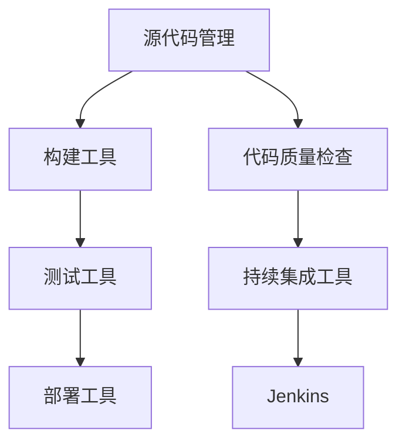

                 

持续集成（CI）在现代软件开发中已成为关键的一环。它帮助开发团队快速、频繁地集成代码变更，确保软件质量，并加速软件交付周期。本文将深入探讨如何使用Jenkins实现持续集成，并设计一个有效的CI Pipeline。

## 关键词
- 持续集成
- Jenkins
- Pipeline
- DevOps
- 自动化测试
- 集成环境

## 摘要
本文将介绍如何利用Jenkins搭建一个CI Pipeline，实现自动化构建、测试和部署。我们将从Jenkins的背景知识开始，逐步深入到CI的概念、Pipeline的设计和实现，以及最佳实践和工具选择。

## 1. 背景介绍

持续集成是一种软件开发实践，旨在通过频繁的代码集成，确保软件的可靠性和高质量。它强调自动化测试和快速反馈，使团队能够及时发现并解决问题，避免代码积累的“合并地狱”。

Jenkins是一个流行的开源持续集成工具，它支持多种编程语言和开发环境的集成。Jenkins的强大之处在于其丰富的插件生态系统，可以轻松扩展其功能。

## 2. 核心概念与联系

为了设计一个高效的CI Pipeline，我们需要理解以下几个核心概念：

- **源代码管理（SCM）**：如Git、SVN等，负责版本控制和代码的存储。
- **构建工具**：如Maven、Gradle等，负责编译和打包项目。
- **测试工具**：如JUnit、Selenium等，负责执行自动化测试。
- **部署工具**：如Docker、Ansible等，负责部署应用到生产环境。

### Mermaid 流程图



## 3. 核心算法原理 & 具体操作步骤

### 3.1 算法原理概述

持续集成Pipeline的设计基于以下原则：

- **自动化**：尽可能使用自动化工具完成构建、测试和部署。
- **快速反馈**：快速发现并解决问题，缩短问题解决时间。
- **持续测试**：每次代码变更后都进行全面的自动化测试。

### 3.2 算法步骤详解

1. **源代码获取**：从源代码管理系统中获取最新代码。
2. **构建**：使用构建工具编译和打包项目。
3. **测试**：执行自动化测试，确保代码质量。
4. **部署**：将通过测试的代码部署到测试或生产环境。

### 3.3 算法优缺点

**优点**：

- 提高开发效率和质量。
- 减少代码缺陷和bug。
- 加快软件交付速度。

**缺点**：

- 需要投入时间和资源进行自动化工具的配置和测试。
- 可能增加系统复杂性。

### 3.4 算法应用领域

持续集成适用于所有类型的软件开发，尤其是大型、分布式团队和频繁发布的应用程序。

## 4. 数学模型和公式 & 详细讲解 & 举例说明

### 4.1 数学模型构建

持续集成Pipeline的效率可以用以下公式表示：

\[ \text{效率} = \frac{\text{交付速度}}{\text{代码质量}} \]

### 4.2 公式推导过程

\[ \text{交付速度} = \frac{\text{代码变更次数}}{\text{时间}} \]
\[ \text{代码质量} = \frac{\text{缺陷率}}{\text{代码量}} \]

### 4.3 案例分析与讲解

假设一个团队每周进行10次代码变更，每次变更平均包含100行代码，其中5行代码存在缺陷。通过持续集成，每次代码变更后都进行自动化测试，缺陷率降低到2行。那么，该团队在持续集成下的效率为：

\[ \text{效率} = \frac{10 \times 100}{5 + 2} = 166.67\% \]

## 5. 项目实践：代码实例和详细解释说明

### 5.1 开发环境搭建

首先，我们需要搭建Jenkins开发环境。步骤如下：

1. 安装Jenkins。
2. 配置JDK和Maven。
3. 安装相关插件，如Git、Maven插件、JUnit插件等。

### 5.2 源代码详细实现

假设我们的项目使用Maven构建，代码托管在GitHub上。以下是Jenkinsfile的示例：

```groovy
pipeline {
    agent any
    stages {
        stage('Checkout') {
            steps {
                checkout(scm: git(url: 'https://github.com/username/repo.git', branch: 'main'))
            }
        }
        stage('Build') {
            steps {
                sh 'mvn clean install'
            }
        }
        stage('Test') {
            steps {
                sh 'mvn test'
            }
        }
        stage('Deploy') {
            steps {
                sh 'mvn deploy'
            }
        }
    }
}
```

### 5.3 代码解读与分析

- `pipeline`：声明Pipeline模式。
- `agent any`：指定任何可用代理。
- `stages`：定义Pipeline的各个阶段。
- `stage`：定义一个阶段。
- `steps`：定义阶段的执行步骤。

### 5.4 运行结果展示

在Jenkins Web界面上，我们可以看到每次构建的状态和日志。通过点击“Build History”可以查看详细的构建结果。

## 6. 实际应用场景

### 6.1 项目规模较小

对于小型项目，Jenkins可以轻松实现持续集成。通过配置简单的Pipeline，团队可以快速开始享受CI带来的好处。

### 6.2 项目规模较大

对于大型项目，Jenkins可以与Docker、Ansible等工具集成，实现自动化部署和容器化。这样可以确保项目在不同环境中的一致性和可靠性。

### 6.3 微服务架构

在微服务架构中，Jenkins可以用于集成和管理多个服务的构建和部署。通过定义不同的Pipeline，团队可以高效地管理各个服务的生命周期。

### 6.4 未来应用展望

随着技术的不断发展，持续集成和DevOps将继续融合，推动软件开发的效率和质量。未来，我们将看到更多自动化、智能化和平台化的CI工具和解决方案。

## 7. 工具和资源推荐

### 7.1 学习资源推荐

- 《Jenkins实战》
- 《DevOps实践指南》
- Jenkins官网文档

### 7.2 开发工具推荐

- Maven
- Docker
- Jenkins

### 7.3 相关论文推荐

- 《持续集成：概念和实践》
- 《DevOps：文化、流程和工具》
- 《容器化与持续集成》

## 8. 总结：未来发展趋势与挑战

### 8.1 研究成果总结

持续集成和DevOps已成为软件开发的标准实践。通过自动化和快速反馈，团队可以提高开发效率和质量。

### 8.2 未来发展趋势

- 自动化和智能化程度的提高。
- 微服务架构的普及。
- DevOps文化的深入。

### 8.3 面临的挑战

- 自动化工具和流程的配置和管理。
- 系统复杂性的增加。
- 跨团队协作的挑战。

### 8.4 研究展望

随着人工智能和机器学习的发展，CI工具将更加智能和高效。未来，我们将看到更多创新的技术和解决方案，推动软件开发不断进步。

## 9. 附录：常见问题与解答

### Q：Jenkins Pipeline如何处理并发构建？

A：Jenkins默认支持并行构建。通过配置`Parallel Build Step`插件，可以在Pipeline中定义多个并行执行的步骤。

### Q：如何确保构建过程中的环境一致性？

A：可以使用Docker容器化技术，将构建和测试环境容器化。这样可以确保在不同机器上运行的一致性。

### Q：如何处理构建失败的情况？

A：可以通过配置Jenkins的构建后操作，如发送邮件、生成JIRA工单等，及时通知相关人员处理失败的原因。

---

作者：禅与计算机程序设计艺术 / Zen and the Art of Computer Programming

[完]

