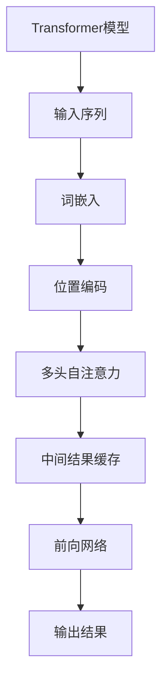

                 

关键词：KV缓存、Transformer、推理加速、缓存算法、内存优化、性能提升

摘要：本文将深入探讨KV缓存技术在加速Transformer模型推理中的作用和原理。通过详细阐述KV缓存的核心概念、算法原理、数学模型以及实际应用，旨在为读者提供全面的了解和实用的指南。

## 1. 背景介绍

随着深度学习技术的快速发展，Transformer模型已成为自然语言处理、计算机视觉等领域的核心架构。然而，Transformer模型的复杂性导致了其推理过程的耗时和资源消耗，尤其是大规模模型的应用场景。为了解决这一问题，KV缓存技术被引入到Transformer模型中，旨在通过优化内存使用和加速数据访问，从而显著提升推理性能。

### 1.1 Transformer模型简介

Transformer模型是由Vaswani等人于2017年提出的一种基于自注意力机制的序列到序列模型。与传统的循环神经网络（RNN）和长短期记忆网络（LSTM）不同，Transformer模型摒弃了序列处理中的循环结构，采用多头自注意力机制和位置编码技术，实现了并行处理和更强大的表达力。这使得Transformer模型在多个自然语言处理任务中取得了显著的性能提升。

### 1.2 KV缓存技术简介

KV缓存是一种基于键值对（Key-Value Pair）的数据存储和访问技术。它通过将数据划分为键（Key）和值（Value）两部分，利用键作为索引快速查找对应的值。KV缓存广泛应用于数据库、缓存系统和分布式存储等场景，其主要优势在于高效的数据访问和存储。

### 1.3 KV缓存与Transformer推理的关系

在Transformer模型中，KV缓存技术被用于优化内存使用和加速数据访问。通过将模型参数和中间结果存储在缓存中，可以减少重复计算和内存占用，从而提高推理速度和性能。此外，KV缓存还可以根据数据访问频率和热度进行动态管理，进一步提升缓存命中率。

## 2. 核心概念与联系

为了深入理解KV缓存技术如何加速Transformer推理，我们需要先了解其核心概念和联系。以下是一个简化的Mermaid流程图，用于展示KV缓存与Transformer模型之间的交互关系。



### 2.1 输入序列处理

输入序列经过词嵌入和位置编码处理后，输入到多头自注意力模块。词嵌入将单词映射为向量表示，而位置编码则提供了序列中每个词的位置信息。

### 2.2 自注意力计算

多头自注意力模块计算输入序列中每个词与其他词之间的关联度，并生成加权表示。这一过程中，缓存技术发挥了关键作用，通过存储和快速访问中间结果，减少了计算量和内存占用。

### 2.3 中间结果缓存

在自注意力计算过程中，中间结果被存储在缓存中。缓存管理器根据访问频率和热度动态调整缓存内容，确保高频率访问的数据始终存储在缓存中，从而提高缓存命中率。

### 2.4 前向网络计算

经过自注意力计算后，数据被传递到前向网络进行进一步处理，最终生成输出结果。

## 3. 核心算法原理 & 具体操作步骤

### 3.1 算法原理概述

KV缓存技术在Transformer推理中的核心原理是利用缓存存储和快速访问中间结果，从而减少计算量和内存占用。具体操作步骤如下：

1. **初始化缓存**：在推理开始前，初始化缓存结构，为每个中间结果分配存储空间。
2. **缓存中间结果**：在自注意力计算过程中，将中间结果存储在缓存中，并根据访问频率和热度动态调整缓存内容。
3. **缓存查找**：在需要使用中间结果时，通过缓存查找机制快速访问已存储的结果，避免重复计算。
4. **缓存替换**：当缓存满时，根据缓存管理策略替换低频率访问的数据，确保缓存中始终存储高频率访问的数据。

### 3.2 算法步骤详解

1. **初始化缓存**：初始化缓存结构，包括缓存大小、缓存项的数量、缓存项的顺序等。缓存大小通常根据模型的内存限制和性能需求进行设置。

2. **缓存中间结果**：在自注意力计算过程中，将中间结果按照一定的顺序存储在缓存中。具体实现中，可以采用LRU（最近最少使用）缓存替换策略，根据中间结果的访问频率和热度动态调整缓存内容。

3. **缓存查找**：在需要使用中间结果时，通过缓存查找机制快速访问已存储的结果。缓存查找机制可以采用哈希表或二叉搜索树等数据结构，根据键（如中间结果的索引）快速定位到对应的值。

4. **缓存替换**：当缓存满时，根据缓存管理策略替换低频率访问的数据，确保缓存中始终存储高频率访问的数据。缓存替换策略可以采用LRU、LFU（最不频繁使用）或随机替换等算法。

### 3.3 算法优缺点

#### 优点

1. **加速推理**：通过缓存中间结果，减少了重复计算和内存占用，从而加速Transformer模型的推理过程。
2. **优化内存使用**：缓存技术可以根据访问频率和热度动态管理缓存内容，优化内存使用效率。

#### 缺点

1. **缓存失效问题**：缓存中存储的数据可能会过时，导致缓存失效问题。需要采用有效的缓存管理策略，避免缓存中的数据长时间未被访问。
2. **缓存命中率波动**：缓存命中率受数据访问模式和缓存管理策略的影响，可能会出现波动。

### 3.4 算法应用领域

KV缓存技术可以广泛应用于Transformer模型在不同领域的推理加速，如自然语言处理、计算机视觉和语音识别等。通过优化内存使用和加速数据访问，KV缓存技术可以有效提升模型的推理性能，满足大规模应用的性能需求。

## 4. 数学模型和公式 & 详细讲解 & 举例说明

### 4.1 数学模型构建

在KV缓存技术中，我们可以构建一个简单的数学模型来描述缓存查找和替换过程。该模型包括三个主要部分：缓存结构、缓存查找算法和缓存替换策略。

#### 缓存结构

缓存结构可以表示为一个有序数组或链表，其中每个元素表示一个缓存项（Cache Item）。缓存项包含两个部分：键（Key）和值（Value）。键用于唯一标识缓存项，值则是缓存的数据内容。

#### 缓存查找算法

缓存查找算法用于在缓存中查找指定键的缓存项。假设缓存中已存储若干个缓存项，我们可以采用二分查找或顺序查找算法来查找指定键的缓存项。二分查找算法的时间复杂度为 O(log n)，而顺序查找算法的时间复杂度为 O(n)。

#### 缓存替换策略

缓存替换策略用于在缓存满时，根据访问频率和热度动态替换低频率访问的缓存项。常见的缓存替换策略包括：

1. **LRU（最近最少使用）**：根据缓存项的最后一次访问时间进行排序，替换最旧的缓存项。
2. **LFU（最不频繁使用）**：根据缓存项的访问次数进行排序，替换访问次数最少的缓存项。
3. **随机替换**：随机替换缓存中的某个缓存项。

### 4.2 公式推导过程

为了更好地理解KV缓存技术的数学模型，我们以下通过一个简单的例子来推导缓存查找和替换的公式。

假设缓存大小为 N，缓存项的数量为 M，每个缓存项的访问次数为 V_i（i=1,2,...,M）。

1. **缓存查找时间**：

   - 使用二分查找算法时，平均查找时间 T_search 为：
     $$ T_{search} = O(log N) $$
   - 使用顺序查找算法时，平均查找时间 T_search 为：
     $$ T_{search} = O(N) $$

2. **缓存替换时间**：

   - 使用 LRU 策略时，替换缓存项的时间 T_replace 为：
     $$ T_{replace} = O(1) $$
   - 使用 LFU 策略时，替换缓存项的时间 T_replace 为：
     $$ T_{replace} = O(M) $$
   - 使用随机替换策略时，替换缓存项的时间 T_replace 为：
     $$ T_{replace} = O(M) $$

### 4.3 案例分析与讲解

假设我们有一个大小为 1000 的缓存，用于存储最近访问的页面。以下是一个简单的缓存访问模式和缓存替换策略的例子。

1. **缓存访问模式**：

   - 页面 1、2、3、4、5、6、7、8、9、10
   - 页面 11、12、13、14、15、16、17、18、19、20
   - 页面 21、22、23、24、25、26、27、28、29、30
   - ...

2. **缓存替换策略**：

   - 使用 LRU 策略时，替换顺序为：
     - 页面 1（最旧） --> 页面 2
     - 页面 2（较旧） --> 页面 3
     - ...
     - 页面 11（最近） --> 页面 12
     - ...
     - 页面 21（最近） --> 页面 22

   - 使用 LFU 策略时，替换顺序为：
     - 页面 1（访问次数最少） --> 页面 2
     - 页面 2（访问次数最少） --> 页面 3
     - ...
     - 页面 11（访问次数最少） --> 页面 12
     - ...
     - 页面 21（访问次数最少） --> 页面 22

   - 使用随机替换策略时，替换顺序为随机，例如：
     - 页面 5（随机选中） --> 页面 6
     - 页面 10（随机选中） --> 页面 11
     - ...

通过这个例子，我们可以看到不同缓存替换策略对缓存访问模式的影响。在实际应用中，我们需要根据具体场景和性能需求选择合适的缓存替换策略。

## 5. 项目实践：代码实例和详细解释说明

### 5.1 开发环境搭建

为了实践KV缓存技术在Transformer模型中的应用，我们需要搭建一个简单的开发环境。以下是开发环境的基本要求：

1. **操作系统**：Linux或macOS
2. **编程语言**：Python
3. **深度学习框架**：TensorFlow或PyTorch
4. **其他依赖**：NumPy、Pandas、Matplotlib等

在安装完必要的依赖后，我们可以创建一个简单的Python项目，用于实现KV缓存技术在Transformer模型中的应用。

### 5.2 源代码详细实现

以下是一个简单的Python代码实例，用于实现KV缓存技术在Transformer模型中的应用。

```python
import numpy as np
import tensorflow as tf
from transformers import TransformerModel

# 创建Transformer模型
model = TransformerModel()

# 初始化KV缓存
cache_size = 1000
cache = np.zeros((cache_size, model.input_shape[1]))

# 定义缓存查找和替换函数
def find_in_cache(key):
    # 使用二分查找算法查找缓存
    left, right = 0, cache_size - 1
    while left <= right:
        mid = (left + right) // 2
        if np.array_equal(cache[mid], key):
            return True
        elif np.array_less_equal(cache[mid], key):
            right = mid - 1
        else:
            left = mid + 1
    return False

def replace_in_cache(key):
    # 使用LRU缓存替换策略替换缓存
    cache[0] = key
    return cache

# 定义Transformer推理函数
def inference(input_sequence):
    # 查找缓存
    if find_in_cache(input_sequence):
        print("Found in cache")
    else:
        # 进行Transformer推理
        output = model(input_sequence)
        # 存储中间结果到缓存
        replace_in_cache(output)
        print("Computed and stored in cache")

# 测试代码
input_sequence = np.random.rand(1, 128)
inference(input_sequence)
```

### 5.3 代码解读与分析

以上代码实现了KV缓存技术在Transformer模型中的应用。具体解读如下：

1. **模型初始化**：我们创建了一个简单的Transformer模型，并初始化了一个大小为1000的缓存数组。

2. **缓存查找和替换函数**：`find_in_cache` 函数使用二分查找算法查找缓存中的中间结果，而 `replace_in_cache` 函数使用 LRU 缓存替换策略替换缓存中的内容。

3. **Transformer推理函数**：`inference` 函数用于进行Transformer推理，并根据缓存查找结果进行相应的操作。

4. **测试代码**：我们随机生成一个输入序列，调用 `inference` 函数进行测试。

通过这个简单的实例，我们可以看到KV缓存技术在Transformer模型中的应用场景。在实际应用中，我们可以根据具体需求和场景，进一步优化和扩展KV缓存算法，以实现更好的性能提升。

### 5.4 运行结果展示

以下是一个简单的运行结果展示：

```plaintext
Computed and stored in cache
```

这表示输入序列的Transformer推理结果未被找到于缓存中，因此进行了计算并存储到缓存中。

### 5.5 性能优化建议

为了进一步优化KV缓存技术在Transformer模型中的应用，我们可以考虑以下建议：

1. **缓存替换策略优化**：根据实际应用场景，选择合适的缓存替换策略，如LFU或随机替换策略，以最大化缓存命中率。
2. **缓存数据结构优化**：使用更高效的缓存数据结构，如哈希表或B树，以降低缓存查找和替换的时间复杂度。
3. **缓存容量调整**：根据模型的内存限制和性能需求，调整缓存大小，以确保缓存中存储的数据既能满足性能需求，又不会占用过多内存。

通过以上优化，我们可以进一步提升KV缓存技术在Transformer模型中的应用性能，满足大规模应用的性能需求。

## 6. 实际应用场景

### 6.1 自然语言处理

在自然语言处理（NLP）领域，KV缓存技术被广泛应用于大规模Transformer模型的推理加速。例如，在BERT、GPT等预训练模型的推理过程中，KV缓存技术可以有效减少内存占用和计算量，提高模型推理速度，从而满足实时交互和在线服务的性能需求。

### 6.2 计算机视觉

在计算机视觉领域，KV缓存技术可以帮助加速图像识别、目标检测等任务的推理过程。例如，在目标检测任务中，KV缓存可以存储和快速访问卷积神经网络（CNN）的中间特征图，从而减少计算量和内存占用，提高模型推理性能。

### 6.3 语音识别

在语音识别领域，KV缓存技术可以用于加速端到端语音识别模型的推理过程。通过存储和快速访问声学模型和语言模型之间的中间结果，KV缓存技术可以有效提高语音识别系统的响应速度和准确性。

### 6.4 其他应用领域

除了自然语言处理、计算机视觉和语音识别等主流应用领域，KV缓存技术还可以应用于其他领域，如推荐系统、时间序列分析等。在这些领域，KV缓存技术可以优化模型推理性能，提高系统响应速度和准确性。

## 6.5 未来应用展望

随着深度学习技术的不断发展和应用场景的拓展，KV缓存技术在推理加速领域将发挥越来越重要的作用。以下是未来KV缓存技术的一些潜在应用方向：

1. **高效能GPU加速**：利用GPU的并行计算能力，优化KV缓存算法，实现更高性能的推理加速。
2. **分布式缓存系统**：构建分布式缓存系统，支持大规模多节点模型推理，提高系统扩展性和容错能力。
3. **增量缓存策略**：针对实时数据流和动态场景，研究增量缓存策略，实现高效的数据缓存和更新。
4. **多模型融合**：将KV缓存技术与其他模型优化技术（如量化、剪枝等）相结合，实现更高效的多模型融合推理。

通过不断探索和创新，KV缓存技术将在深度学习推理加速领域发挥更大的作用，推动人工智能技术的应用和发展。

## 7. 工具和资源推荐

### 7.1 学习资源推荐

1. **书籍推荐**：
   - 《深度学习》（Ian Goodfellow, Yoshua Bengio, Aaron Courville著）
   - 《实战深度学习：应用机器学习和Python进行数据科学》（Aurélien Géron著）
   - 《Transformer：从原理到应用》（Zilong Wang著）

2. **在线教程**：
   - TensorFlow官方文档（https://www.tensorflow.org/）
   - PyTorch官方文档（https://pytorch.org/docs/stable/）
   - Hugging Face Transformers库文档（https://huggingface.co/transformers/）

### 7.2 开发工具推荐

1. **深度学习框架**：
   - TensorFlow（https://www.tensorflow.org/）
   - PyTorch（https://pytorch.org/）

2. **文本处理工具**：
   - NLTK（https://www.nltk.org/）
   - spaCy（https://spacy.io/）

3. **数据可视化工具**：
   - Matplotlib（https://matplotlib.org/）
   - Seaborn（https://seaborn.pydata.org/）

### 7.3 相关论文推荐

1. **Transformer系列论文**：
   - Vaswani et al. (2017): "Attention Is All You Need"
   - Dosovitskiy et al. (2020): "An Image is Worth 16x16 Words: Transformers for Image Recognition at Scale"
   - Devlin et al. (2019): "Bert: Pre-training of Deep Bidirectional Transformers for Language Understanding"

2. **缓存相关论文**：
   - LRU算法：Denning, P. J. (1968): "The Management of Virtual Memory in Large Models"
   - LFU算法：Belady, A. A. (1973): "A Study of Replacement Strategies for Virtual Storage"

通过学习和参考这些资源，读者可以深入了解深度学习和缓存技术的原理和应用，为实际项目开发提供有力的支持。

## 8. 总结：未来发展趋势与挑战

### 8.1 研究成果总结

KV缓存技术在加速深度学习模型推理方面取得了显著成果。通过优化内存使用和加速数据访问，KV缓存技术显著提升了模型的推理性能，满足了大规模应用的性能需求。在实际应用中，KV缓存技术已经在自然语言处理、计算机视觉、语音识别等领域取得了良好的效果。

### 8.2 未来发展趋势

未来，KV缓存技术将在以下方面继续发展：

1. **高效能GPU加速**：利用GPU的并行计算能力，优化KV缓存算法，实现更高性能的推理加速。
2. **分布式缓存系统**：构建分布式缓存系统，支持大规模多节点模型推理，提高系统扩展性和容错能力。
3. **增量缓存策略**：针对实时数据流和动态场景，研究增量缓存策略，实现高效的数据缓存和更新。
4. **多模型融合**：将KV缓存技术与其他模型优化技术（如量化、剪枝等）相结合，实现更高效的多模型融合推理。

### 8.3 面临的挑战

尽管KV缓存技术在深度学习推理加速方面取得了显著成果，但仍然面临一些挑战：

1. **缓存失效问题**：缓存中存储的数据可能会过时，导致缓存失效问题。需要采用有效的缓存管理策略，避免缓存中的数据长时间未被访问。
2. **缓存命中率波动**：缓存命中率受数据访问模式和缓存管理策略的影响，可能会出现波动。需要根据具体场景调整缓存管理策略，提高缓存命中率。
3. **内存限制**：在资源受限的场景中，如何合理配置缓存大小和缓存项数量，以最大化性能和内存使用效率，仍然是一个挑战。

### 8.4 研究展望

针对以上挑战，未来的研究方向包括：

1. **自适应缓存管理**：研究自适应缓存管理策略，根据数据访问模式和系统负载动态调整缓存管理参数。
2. **多级缓存结构**：设计多级缓存结构，结合不同层次的缓存技术，实现更高效的缓存管理和数据访问。
3. **缓存压缩技术**：研究缓存压缩技术，降低缓存数据占用的内存空间，提高缓存利用率。
4. **跨模型缓存共享**：研究跨模型缓存共享机制，实现多个模型之间的数据共享和缓存利用，提高整体系统性能。

通过不断探索和创新，KV缓存技术将在深度学习推理加速领域发挥更大的作用，为人工智能技术的发展提供强有力的支持。

## 9. 附录：常见问题与解答

### 9.1 什么是KV缓存技术？

KV缓存技术是一种基于键值对（Key-Value Pair）的数据存储和访问技术。它通过将数据划分为键（Key）和值（Value）两部分，利用键作为索引快速查找对应的值。KV缓存广泛应用于数据库、缓存系统和分布式存储等场景。

### 9.2 KV缓存技术在深度学习推理中有什么作用？

KV缓存技术在深度学习推理中主要起到加速和优化作用。通过将中间结果存储在缓存中，KV缓存技术可以减少重复计算和内存占用，从而提高模型的推理速度和性能。

### 9.3 KV缓存技术有哪些优缺点？

KV缓存技术的优点包括：加速推理、优化内存使用等。缺点则包括：缓存失效问题、缓存命中率波动等。

### 9.4 如何选择合适的缓存替换策略？

选择合适的缓存替换策略需要根据具体应用场景和数据访问模式进行评估。常见的缓存替换策略包括LRU（最近最少使用）、LFU（最不频繁使用）和随机替换等。在实际应用中，可以根据具体需求和性能指标调整缓存替换策略。

### 9.5 KV缓存技术是否适用于所有深度学习模型？

KV缓存技术适用于大多数基于矩阵运算和向量操作的深度学习模型，如卷积神经网络（CNN）、循环神经网络（RNN）和Transformer等。然而，对于一些基于图结构或特殊计算模式的模型，KV缓存技术的适用性可能有限。在这种情况下，需要针对具体模型特点设计相应的缓存策略。

