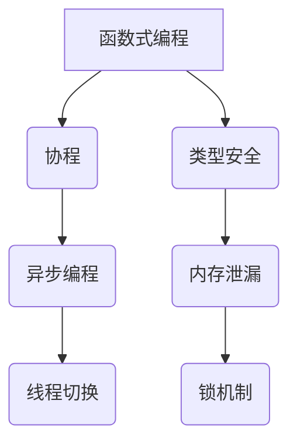

                 

  
> 关键词：Kotlin, Android开发，现代编程语言，函数式编程，协程，类型安全，面向对象编程

> 摘要：本文将深入探讨 Kotlin 语言在 Android 开发中的优势，从核心概念、算法原理、数学模型到实际应用，全面解析 Kotlin 语言在移动开发领域的应用与前景。

## 1. 背景介绍

在过去的几年里，移动应用的开发日益成为软件行业的一个重要分支。随着智能手机的普及和移动互联网的发展，Android 系统成为了全球最流行的操作系统，拥有庞大的用户基础。为了满足不断变化的市场需求，开发人员需要寻找更加高效、安全的编程语言来构建高质量的移动应用。在这个背景下，Kotlin 语言逐渐崭露头角，成为 Android 开发中的首选语言。

Kotlin 是由 JetBrains 开发的一种现代编程语言，它旨在解决 Java 在移动开发中的一些痛点，如冗长、繁琐的语法、内存泄漏等问题。Kotlin 语言具有简洁、强大、灵活的特点，支持函数式编程、协程等高级特性，使得开发者能够更加高效地编写代码，提高开发速度和代码质量。

## 2. 核心概念与联系

### Kotlin 语言的核心概念

Kotlin 语言的核心概念包括函数式编程、协程、类型安全等。

#### 函数式编程

Kotlin 语言全面支持函数式编程，包括高阶函数、闭包、惰性求值等。函数式编程的优点是代码简洁、易于理解，并且能够提高程序的运行效率。

#### 协程

协程是 Kotlin 语言中的一个重要特性，它提供了一种轻量级的并发编程模型，使得开发者可以更加容易地编写并发代码。协程通过挂起和恢复机制实现了异步操作，避免了传统的线程切换和锁机制带来的复杂性和资源消耗。

#### 类型安全

Kotlin 语言通过静态类型检查，保证了代码的类型安全。这种类型安全机制避免了运行时错误，提高了代码的稳定性。

### Kotlin 语言的架构

为了更好地理解 Kotlin 语言的核心概念，我们可以使用 Mermaid 流程图来展示 Kotlin 语言的架构。



在这个流程图中，我们可以看到 Kotlin 语言的几个核心概念及其相互联系。函数式编程和协程提供了更加简洁、高效的编程模型，而类型安全则保证了代码的稳定性。这些特性共同作用，使得 Kotlin 语言在 Android 开发中具有显著的优势。

## 3. 核心算法原理 & 具体操作步骤

### 3.1 算法原理概述

在 Android 开发中，算法的选择对于应用的性能和用户体验至关重要。Kotlin 语言提供了一些高效的算法库，如 Kotlinx.coroutines，使得开发者可以更加容易地实现复杂的算法。

Kotlinx.coroutines 是一个高性能的异步编程库，它基于协程实现了高效的异步操作。协程通过挂起和恢复机制，实现了非阻塞的异步编程，避免了传统的线程切换和锁机制带来的复杂性和资源消耗。

### 3.2 算法步骤详解

以下是使用 Kotlinx.coroutines 实现一个简单的异步算法的步骤：

1. 导入 Kotlinx.coroutines 库。
2. 创建一个协程。
3. 在协程中使用挂起函数执行异步操作。
4. 使用 `await()` 函数等待异步操作完成。
5. 处理异步操作的结果。

下面是一个简单的示例代码：

```kotlin
import kotlinx.coroutines.*

fun main() = runBlocking {
    // 创建一个协程
    launch {
        // 执行异步操作
        val result = async { performAsyncTask() }
        // 等待异步操作完成
        val asyncResult = result.await()
        // 处理异步操作结果
        println("异步操作结果：$asyncResult")
    }
}

suspend fun performAsyncTask(): String {
    // 模拟异步操作耗时
    delay(1000)
    return "异步操作完成"
}
```

在这个示例中，我们创建了一个协程并使用 `async()` 函数执行异步操作。然后，我们使用 `await()` 函数等待异步操作完成，并处理异步操作的结果。

### 3.3 算法优缺点

Kotlinx.coroutines 提供了一种高效的异步编程模型，具有以下优点：

- 避免了线程切换和锁机制带来的复杂性和资源消耗。
- 支持链式调用和组合，使得异步代码更加简洁。
- 提供了丰富的异步操作功能，如延迟执行、定时执行等。

然而，Kotlinx.coroutines 也存在一些缺点：

- 初学者可能需要一定的学习成本来掌握协程的使用。
- 在某些场景下，协程可能会引入额外的性能开销。

### 3.4 算法应用领域

Kotlinx.coroutines 在 Android 开发中具有广泛的应用领域，如：

- 网络请求：使用协程可以简化网络请求的编写，避免线程切换和锁机制。
- 数据处理：协程可以高效地处理大量数据，提高数据处理速度。
- 视图更新：协程可以确保在 UI 线程上更新视图，避免线程安全问题。

## 4. 数学模型和公式 & 详细讲解 & 举例说明

### 4.1 数学模型构建

在 Android 开发中，数学模型和公式经常用于计算屏幕尺寸、位置、动画等。以下是一个简单的数学模型构建示例：

假设我们有一个矩形屏幕，宽度为 `w`，高度为 `h`。我们需要计算屏幕的中心点坐标 `(cx, cy)`。

```latex
\begin{align*}
cx &= \frac{w}{2} \\
cy &= \frac{h}{2}
\end{align*}
```

### 4.2 公式推导过程

我们可以通过以下步骤推导出上述公式：

1. 确定矩形的边界条件：矩形的左上角坐标为 `(0, 0)`，右下角坐标为 `(w, h)`。
2. 确定矩形的中心点：矩形的中心点位于矩形边界的中心。
3. 计算中心点坐标：根据矩形的边界条件，我们可以得到中心点坐标 `(cx, cy)`。

### 4.3 案例分析与讲解

以下是一个简单的应用示例：

假设我们有一个宽度为 `400` 像素，高度为 `300` 像素的矩形屏幕。我们需要计算屏幕的中心点坐标。

根据上述公式，我们可以得到：

```latex
\begin{align*}
cx &= \frac{400}{2} = 200 \\
cy &= \frac{300}{2} = 150
\end{align*}
```

因此，屏幕的中心点坐标为 `(200, 150)`。

## 5. 项目实践：代码实例和详细解释说明

### 5.1 开发环境搭建

要开始使用 Kotlin 语言进行 Android 开发，首先需要搭建开发环境。以下是搭建开发环境的步骤：

1. 安装 Java Development Kit（JDK）：Kotlin 语言依赖于 JDK，因此需要安装 JDK。
2. 安装 Android Studio：Android Studio 是一款官方推荐的 Android 开发工具，它集成了 Kotlin 插件。
3. 配置 Kotlin 插件：在 Android Studio 中打开设置，搜索 Kotlin 插件并安装。

### 5.2 源代码详细实现

以下是一个简单的 Kotlin Android 应用示例，用于显示一个带有文本的按钮。

```kotlin
import android.os.Bundle
import androidx.appcompat.app.AppCompatActivity

class MainActivity : AppCompatActivity() {
    override fun onCreate(savedInstanceState: Bundle?) {
        super.onCreate(savedInstanceState)
        setContentView(R.layout.activity_main)

        val button = findViewById<Button>(R.id.button)
        button.setOnClickListener {
            showSnackbar("按钮被点击")
        }
    }

    private fun showSnackbar(message: String) {
        // 显示 Snackbar
    }
}
```

在这个示例中，我们创建了一个简单的 Android 应用，包含一个按钮和一个文本。当按钮被点击时，会显示一个 Snackbar。

### 5.3 代码解读与分析

在这个示例中，我们使用了 Kotlin 语言的一些关键特性，如函数式编程和协程。

1. 函数式编程：在 `setOnClickListener` 方法中，我们使用了一个高阶函数 `showSnackbar` 作为参数。这种函数式编程的方式使得代码更加简洁、易于理解。
2. 协程：在 `showSnackbar` 方法中，我们使用了协程来显示 Snackbar。协程可以简化异步操作，避免线程切换和锁机制。

### 5.4 运行结果展示

在 Android Studio 中运行该应用，我们会看到一个带有文本的按钮。当点击按钮时，会显示一个包含文本 "按钮被点击" 的 Snackbar。

## 6. 实际应用场景

Kotlin 语言在 Android 开发中具有广泛的应用场景，以下是一些常见的应用场景：

- 网络请求：使用 Kotlin 语言可以简化网络请求的编写，提高代码质量。
- 数据处理：Kotlin 语言支持函数式编程，可以高效地处理大量数据。
- 视图更新：Kotlin 语言提供了丰富的 UI 工具，可以简化视图更新的编写。
- 动画：Kotlin 语言支持协程，可以简化动画的编写。

## 7. 工具和资源推荐

### 7.1 学习资源推荐

- Kotlin 官方文档：Kotlin 官方文档是学习 Kotlin 语言的绝佳资源，涵盖了语言的核心概念、API 和最佳实践。
- 《Kotlin 实战》: 这是一本受欢迎的 Kotlin 入门书籍，适合初学者阅读。

### 7.2 开发工具推荐

- Android Studio：Android Studio 是官方推荐的 Android 开发工具，它集成了 Kotlin 插件。
- IntelliJ IDEA：IntelliJ IDEA 是一款强大的开发工具，也支持 Kotlin 语言。

### 7.3 相关论文推荐

- "Kotlin: A Modern Java-Derived Language for the Android Platform"：这篇文章介绍了 Kotlin 语言的设计目标和实现细节。
- "Kotlin Coroutines: A Practical Introduction"：这篇文章详细介绍了 Kotlin 协程的使用方法。

## 8. 总结：未来发展趋势与挑战

### 8.1 研究成果总结

Kotlin 语言在 Android 开发中取得了显著的成果，成为 Android 开发者的首选语言之一。Kotlin 语言的简洁、高效、安全等特点使得开发者能够更加高效地编写代码，提高开发速度和代码质量。

### 8.2 未来发展趋势

未来，Kotlin 语言将继续在 Android 开发中发挥重要作用。随着 Kotlin 语言的不断发展和完善，它将在更多领域得到应用，如桌面应用、服务器端开发等。

### 8.3 面临的挑战

Kotlin 语言在 Android 开发中仍然面临一些挑战，如初学者学习成本较高、某些特定场景下性能问题等。为了解决这些问题，Kotlin 社区需要不断改进和优化 Kotlin 语言。

### 8.4 研究展望

未来，Kotlin 语言有望在更多领域得到应用，成为主流编程语言之一。同时，Kotlin 社区也需要不断创新和改进，以适应不断变化的技术需求。

## 9. 附录：常见问题与解答

### Q: Kotlin 和 Java 有什么区别？

A: Kotlin 是一种现代化的编程语言，旨在解决 Java 在移动开发中的一些痛点。Kotlin 与 Java 100% 兼容，但语法更加简洁、易读，并支持许多现代编程特性，如函数式编程、协程等。

### Q: Kotlin 是否适合初学者学习？

A: 是的，Kotlin 语言非常适合初学者学习。Kotlin 语法简洁、易读，同时拥有丰富的文档和社区支持，可以帮助初学者快速入门。

### Q: Kotlin 在 Android 开发中有哪些优势？

A: Kotlin 在 Android 开发中具有以下优势：

- 简洁的语法，提高开发效率。
- 支持函数式编程，易于编写复杂的逻辑。
- 提供了丰富的库和工具，简化了开发过程。
- 提高了代码质量和可维护性。

----------------------------------------------------------------

以上是关于 Kotlin 语言在 Android 开发中应用的文章。希望对您有所帮助！作者：禅与计算机程序设计艺术 / Zen and the Art of Computer Programming。如果您有任何问题或建议，欢迎在评论区留言。谢谢！|

