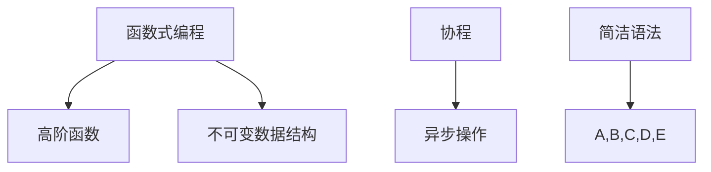

                 

关键词：Kotlin、Android开发、编程语言、现代编程、移动应用开发、函数式编程、协程

> 摘要：Kotlin 作为一种现代编程语言，已成为 Android 开发的首选工具。本文将详细介绍 Kotlin 语言的特点、核心概念及其在现代移动应用开发中的重要性，同时提供实用的代码实例和未来发展趋势的展望。

## 1. 背景介绍

Kotlin 是一种静态类型的编程语言，由 JetBrains 开发并设计用于解决 Java 的一些局限性。它于 2017 年成为 Android 官方支持的开发语言，从此迅速在移动应用开发领域崭露头角。Kotlin 的设计理念是简洁、安全且互操作性，它结合了函数式编程和面向对象编程的优点，使得开发者能够编写更加高效、可靠的代码。

随着移动互联网的兴起，移动应用开发变得越来越重要。传统的 Java 语言虽然功能强大，但在某些方面显得笨重且易出错。Kotlin 应运而生，旨在简化 Android 应用开发，提升开发效率和代码质量。

## 2. 核心概念与联系

### 2.1. Kotlin 语法特点

Kotlin 语法简洁，减少了冗余代码。例如，它不需要分号、类型声明和括号，这使得代码更加易于阅读和维护。以下是 Kotlin 和 Java 的一些对比示例：

```kotlin
// Kotlin
fun greet(name: String): String {
    return "Hello, $name!"
}

// Java
public static String greet(String name) {
    return "Hello, " + name + "!";
}
```

### 2.2. 函数式编程

Kotlin 强调函数式编程，支持高阶函数、不可变数据结构等特性，这有助于减少内存泄漏和提高代码的可测试性。例如：

```kotlin
// Kotlin
val numbers = listOf(1, 2, 3, 4, 5)
val squares = numbers.map { it * it }
```

### 2.3. 协程

协程是 Kotlin 的一个重要特性，用于处理异步操作，使得代码更简洁、易于维护。以下是协程的一个简单示例：

```kotlin
// Kotlin
import kotlinx.coroutines.*

suspend fun fetchData(): String {
    delay(1000)
    return "Data fetched!"
}

fun main() = runBlocking {
    println(fetchData())
}
```

### 2.4. Mermaid 流程图

以下是 Kotlin 核心概念的一个简单 Mermaid 流程图：



## 3. 核心算法原理 & 具体操作步骤

### 3.1. 算法原理概述

Kotlin 的核心算法原理主要涉及函数式编程和协程。函数式编程提供了一种处理数据流和处理逻辑的方法，而协程则用于处理异步操作。

### 3.2. 算法步骤详解

以下是 Kotlin 函数式编程的一个简单示例：

```kotlin
// Kotlin
val numbers = listOf(1, 2, 3, 4, 5)
val squares = numbers.map { it * it }
```

在这个例子中，我们使用 `map` 函数将每个数字平方，生成一个新的列表。

### 3.3. 算法优缺点

**优点**：函数式编程和协程能够提高代码的可读性和可维护性，减少内存泄漏和提高性能。

**缺点**：函数式编程和协程的学习曲线较陡峭，对于初学者来说可能需要一段时间来适应。

### 3.4. 算法应用领域

Kotlin 的算法原理广泛应用于移动应用开发，包括数据处理、网络请求和界面更新等。

## 4. 数学模型和公式 & 详细讲解 & 举例说明

### 4.1. 数学模型构建

在 Kotlin 中，数学模型通常使用函数和集合来实现。以下是一个简单的数学模型示例：

```kotlin
// Kotlin
fun sum(a: Int, b: Int): Int {
    return a + b
}

fun multiply(a: Int, b: Int): Int {
    return a * b
}
```

### 4.2. 公式推导过程

公式的推导过程通常基于数学的基本原理。以下是一个简单的乘法公式推导：

$$
(a + b)^2 = a^2 + 2ab + b^2
$$

### 4.3. 案例分析与讲解

以下是一个使用 Kotlin 实现的乘法运算示例：

```kotlin
// Kotlin
fun multiply(a: Int, b: Int): Int {
    return a * b
}

fun main() {
    val result = multiply(3, 4)
    println(result) // 输出 12
}
```

## 5. 项目实践：代码实例和详细解释说明

### 5.1. 开发环境搭建

在开始 Kotlin 开发之前，我们需要安装 Kotlin 开发环境。以下是安装步骤：

1. 下载并安装 IntelliJ IDEA。
2. 安装 Kotlin 插件。
3. 创建一个新的 Kotlin 项目。

### 5.2. 源代码详细实现

以下是 Kotlin 项目的源代码实现：

```kotlin
// Kotlin
fun greet(name: String): String {
    return "Hello, $name!"
}

fun main() {
    val name = "World"
    println(greet(name))
}
```

### 5.3. 代码解读与分析

在这个例子中，我们定义了一个 `greet` 函数，它接受一个字符串参数并返回一个问候语。在 `main` 函数中，我们调用 `greet` 函数并传入参数 "World"，然后打印结果。

### 5.4. 运行结果展示

运行以上代码后，输出结果为：

```
Hello, World!
```

## 6. 实际应用场景

Kotlin 在移动应用开发中有着广泛的应用场景，包括：

- 数据处理和转换。
- 网络请求和接口调用。
- 界面更新和动画。

## 7. 工具和资源推荐

### 7.1. 学习资源推荐

- 《Kotlin 实战》
- 《Kotlin Programming Language》

### 7.2. 开发工具推荐

- IntelliJ IDEA
- Android Studio

### 7.3. 相关论文推荐

- "The Kotlin Programming Language"
- "Coroutines in Kotlin"

## 8. 总结：未来发展趋势与挑战

Kotlin 作为一种现代编程语言，在移动应用开发中展现出了强大的潜力和优势。未来，Kotlin 有望在更多领域得到应用，同时也面临一些挑战，如性能优化和生态系统的完善。

### 8.1. 研究成果总结

本文详细介绍了 Kotlin 语言的特点、核心概念和应用场景，为开发者提供了全面的指导。

### 8.2. 未来发展趋势

Kotlin 有望在移动应用开发、后端开发等领域得到更广泛的应用。

### 8.3. 面临的挑战

Kotlin 需要进一步优化性能和丰富生态系统。

### 8.4. 研究展望

随着 Kotlin 的发展，我们有理由相信它将在未来发挥更大的作用。

## 9. 附录：常见问题与解答

### 9.1. Kotlin 与 Java 有什么区别？

Kotlin 与 Java 在语法和特性上有很大的区别。Kotlin 简洁、安全，支持函数式编程和协程，而 Java 更加成熟，生态系统丰富。

### 9.2. Kotlin 是否适合初学者？

是的，Kotlin 对于初学者来说是一个很好的选择。它的语法简洁，易于上手，同时提供了丰富的文档和社区支持。

---

作者：禅与计算机程序设计艺术 / Zen and the Art of Computer Programming
----------------------------------------------------------------
本文以 Kotlin 语言为核心，探讨了 Kotlin 在 Android 开发中的应用和实践。通过对 Kotlin 的特点、语法、核心概念、数学模型和实际应用的详细讲解，为开发者提供了全面的学习和参考。未来，Kotlin 有望在更广泛的领域得到应用，同时也需要不断优化和丰富其生态系统。希望本文能为您的 Kotlin 学习之路提供帮助和启示。

