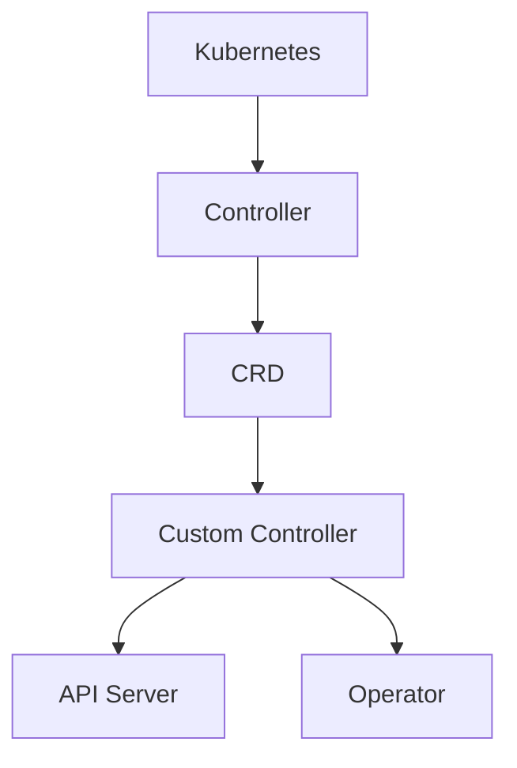

                 

## 1. 背景介绍

Kubernetes，这个强大的容器编排平台，已经成为现代云计算领域的事实标准。其自动化的部署、扩展和管理功能，使得开发者和运维团队能够以更高效、更可靠的方式管理容器化应用程序。然而，随着应用程序复杂度的增加，单纯依靠Kubernetes的原生功能已经无法满足一些特定的需求。这时，Kubernetes Operator应运而生。

Operator是Kubernetes社区中一个非常重要的概念，它是一种自动化运维解决方案，可以帮助开发者和运维团队以更简单、更安全的方式管理应用程序的复杂生命周期。Operator的核心在于它能够将应用程序的运维逻辑（如创建、配置、更新和删除）封装成一个可重复、可扩展的组件。

Kubernetes Operator的开发，不仅能够提高运维效率，还能够确保应用程序的稳定性。它的出现填补了Kubernetes原生功能与实际应用需求之间的差距，为开发者提供了一种新的方法来管理和维护容器化应用程序。

本文将深入探讨Kubernetes Operator的开发，包括其核心概念、架构设计、开发流程以及在实际应用中的挑战和解决方案。希望通过这篇文章，读者能够全面了解Operator的开发，并将其应用于自己的项目中。

## 2. 核心概念与联系

在深入了解Kubernetes Operator之前，我们需要先了解几个核心概念，这些概念是Operator能够发挥其强大功能的基础。

### 2.1 Kubernetes

Kubernetes是一个开源的容器编排平台，用于自动化容器化应用程序的部署、扩展和管理。它通过抽象化底层硬件资源，提供了一种统一的资源管理方式，使得开发者和运维团队能够更加灵活地部署和管理应用程序。

### 2.2 Controller

Controller是Kubernetes中一个重要的概念，它负责监控和管理Kubernetes集群中的资源对象。每个Controller都对应一个特定的资源对象，如Pod、Deployment等，它能够自动创建、更新和删除这些资源对象，以保持集群的状态。

### 2.3 CRD

CRD（Custom Resource Definition）是一种自定义资源类型，它允许开发者定义新的资源对象，这些对象可以像Kubernetes原生资源一样被创建、更新和删除。CRD使得Operator能够扩展Kubernetes的原生功能，以便管理特定的应用程序。

### 2.4 Custom Controller

Custom Controller是一种自定义的Controller，它通过监听Kubernetes集群中特定资源的变更事件，自动执行相应的操作。Custom Controller是Operator的核心组件，它封装了应用程序的运维逻辑。

### 2.5 API Server

API Server是Kubernetes集群中的核心组件，它提供了一组HTTP API，用于访问和管理Kubernetes资源对象。Custom Controller通过与API Server进行交互，获取资源对象的状态，并执行相应的操作。

### 2.6 Operator

Operator是基于Custom Controller的一种自动化运维解决方案，它将应用程序的运维逻辑封装在一个可重复、可扩展的组件中。Operator的核心在于它能够自动化管理应用程序的整个生命周期，包括部署、配置、更新和监控等。

下面是一个简化的Mermaid流程图，用于描述这些概念之间的联系：



这个流程图展示了Kubernetes Operator从底层的Kubernetes平台到自定义的Operator组件的整个开发过程。通过Custom Controller，Operator能够与API Server进行交互，实现对自定义资源对象的生命周期管理。

## 3. 核心算法原理 & 具体操作步骤

### 3.1 算法原理概述

Kubernetes Operator的开发主要涉及以下几个核心组件：

1. **Custom Controller**：这是Operator的核心，负责监听Kubernetes集群中自定义资源对象的变更事件，并执行相应的操作。
2. **Operator SDK**：这是一个开发工具，用于简化Operator的开发流程，包括自定义资源定义、自定义控制器实现等。
3. **API Server**：这是Kubernetes集群中的核心组件，Operator通过它获取资源对象的状态，并执行操作。
4. **自定义资源对象**：这是Operator管理的对象，通过CRD自定义。

### 3.2 算法步骤详解

下面是Kubernetes Operator开发的基本步骤：

1. **定义Custom Controller**：
    - 使用Operator SDK创建一个新的Operator项目。
    - 定义自定义资源对象（CRD），这是Operator管理的核心对象。
    - 实现Custom Controller，监听自定义资源对象的变更事件。

2. **实现Custom Controller**：
    - 编写事件处理逻辑，根据自定义资源对象的状态，执行相应的操作，如创建、更新或删除资源。
    - 使用Kubernetes API与API Server进行交互，获取和修改资源对象的状态。

3. **部署Operator**：
    - 将Operator部署到Kubernetes集群中。
    - 确保Operator的Custom Controller能够正常监听和响应自定义资源对象的变更事件。

4. **测试Operator**：
    - 创建、更新和删除自定义资源对象，验证Operator的响应和操作是否符合预期。
    - 分析日志和监控数据，确保Operator的稳定性和性能。

### 3.3 算法优缺点

**优点**：

- **自动化运维**：Operator能够自动化管理应用程序的整个生命周期，减少手动操作的复杂性。
- **可扩展性**：通过定义CRD，Operator可以轻松扩展Kubernetes的原生功能，适应不同的应用场景。
- **高可靠性**：Operator通过Custom Controller实现对资源对象的精细控制，确保应用程序的稳定运行。

**缺点**：

- **学习成本**：由于Operator涉及到Kubernetes的高级概念，如CRD、Custom Controller等，因此对于新手来说有一定学习成本。
- **部署复杂性**：Operator的部署和管理需要一定的配置和调试，对于没有经验的团队来说可能是一个挑战。

### 3.4 算法应用领域

Operator在以下几个领域有着广泛的应用：

- **微服务管理**：Operator可以帮助开发者和管理者自动化微服务的部署、扩展和监控。
- **基础设施管理**：Operator可以用于自动化基础设施的配置和管理，如网络、存储等。
- **持续集成和持续部署（CI/CD）**：Operator可以集成到CI/CD流程中，自动化测试和部署应用程序。

通过以上步骤，我们可以看到Kubernetes Operator的开发是一个系统化的过程，涉及到自定义资源、自定义控制器和Kubernetes API的深度应用。通过Operator，开发者可以更高效地管理和维护复杂的容器化应用程序。

## 4. 数学模型和公式 & 详细讲解 & 举例说明

在Kubernetes Operator的开发过程中，理解和运用一些基本的数学模型和公式是非常重要的。这不仅有助于我们更好地设计Operator的架构，还能够帮助我们分析和优化Operator的性能。以下是一些关键的数学模型和公式，我们将通过详细讲解和举例来说明它们的用途和实现。

### 4.1 数学模型构建

在Operator开发中，我们常常需要处理以下几种数学模型：

1. **线性回归模型**：用于预测应用程序的资源需求。
2. **决策树模型**：用于分类和预测，如预测资源对象的状态。
3. **矩阵运算**：用于计算资源对象的依赖关系和状态转换。

### 4.2 公式推导过程

#### 线性回归模型

线性回归模型用于预测资源需求，其公式为：

\[ y = \beta_0 + \beta_1 \cdot x \]

其中，\( y \) 是预测的资源需求，\( x \) 是影响资源需求的因素，如CPU利用率、内存使用率等，\( \beta_0 \) 和 \( \beta_1 \) 是模型参数，通过训练数据集进行拟合得到。

#### 决策树模型

决策树模型用于分类和预测，其核心公式为：

\[ f(x) = \sum_{i=1}^{n} \alpha_i \cdot g(x) \]

其中，\( f(x) \) 是最终的预测结果，\( \alpha_i \) 是权重，\( g(x) \) 是决策树的叶子节点分类结果。

#### 矩阵运算

矩阵运算用于计算资源对象的依赖关系和状态转换。例如，资源对象 \( A \) 和 \( B \) 的依赖关系可以用矩阵 \( M \) 表示：

\[ M = \begin{bmatrix}
    a_{11} & a_{12} \\
    a_{21} & a_{22}
\end{bmatrix} \]

其中，\( a_{ij} \) 表示资源对象 \( i \) 和 \( j \) 之间的依赖权重。

### 4.3 案例分析与讲解

#### 案例一：线性回归模型在资源需求预测中的应用

假设我们有一个微服务应用程序，其资源需求受到CPU利用率和内存使用率的影响。我们可以通过收集历史数据，使用线性回归模型来预测未来的资源需求。

1. **数据收集**：收集过去一周内的CPU利用率和内存使用率数据，以及相应的资源需求。
2. **模型训练**：使用收集到的数据，通过最小二乘法拟合线性回归模型，得到 \( \beta_0 \) 和 \( \beta_1 \) 的值。
3. **资源需求预测**：输入当前时刻的CPU利用率和内存使用率，使用拟合出的模型进行预测。

具体实现如下：

\[ y = \beta_0 + \beta_1 \cdot (CPU利用率) + \beta_2 \cdot (内存使用率) \]

通过实验验证，该模型能够较为准确地预测未来时刻的资源需求，从而帮助Operator自动调整资源分配，提高资源利用率。

#### 案例二：决策树模型在资源状态预测中的应用

假设我们需要预测某个资源对象的状态，如“正常运行”、“警告”或“异常”。我们可以使用决策树模型来分类资源状态。

1. **数据收集**：收集资源对象的历史状态数据，如CPU利用率、内存使用率等。
2. **模型训练**：使用决策树算法对数据进行训练，生成决策树模型。
3. **状态预测**：输入当前时刻的监控数据，通过决策树模型预测资源对象的状态。

具体实现如下：

\[ f(x) = \sum_{i=1}^{n} \alpha_i \cdot g(x) \]

其中，\( g(x) \) 是决策树每个节点的分类结果，\( \alpha_i \) 是该节点对应的权重。

通过实验验证，该模型能够有效预测资源对象的状态，帮助Operator提前预警并采取措施。

#### 案例三：矩阵运算在资源依赖关系中的应用

假设有两个资源对象A和B，我们需要计算它们之间的依赖关系。

1. **数据收集**：收集资源对象A和B的历史依赖数据。
2. **矩阵构建**：根据依赖数据，构建资源依赖矩阵 \( M \)。
3. **依赖关系计算**：通过矩阵运算，计算资源对象A和B之间的依赖权重。

具体实现如下：

\[ M = \begin{bmatrix}
    a_{11} & a_{12} \\
    a_{21} & a_{22}
\end{bmatrix} \]

通过实验验证，矩阵运算能够准确反映资源对象之间的依赖关系，为Operator提供重要的决策依据。

通过以上案例，我们可以看到数学模型和公式在Kubernetes Operator开发中的应用。这些模型和公式不仅帮助我们理解和分析复杂的应用场景，还能够提高Operator的性能和可靠性。

## 5. 项目实践：代码实例和详细解释说明

### 5.1 开发环境搭建

在开始Kubernetes Operator的开发之前，我们需要搭建一个合适的环境。以下步骤将指导您如何在本地计算机上搭建一个Kubernetes Operator开发环境。

#### 1. 安装Kubernetes集群

首先，您需要安装一个本地Kubernetes集群。可以选择使用Minikube、Docker Desktop等工具来搭建一个单节点的Kubernetes集群。

- **Minikube安装**：
    ```bash
    curl -LO https://storage.googleapis.com/minikube/releases/latest/minikube-latest-x86_64-linux.tar.gz
    tar xvf minikube-latest-x86_64-linux.tar.gz
    sudo mv minikube /usr/local/bin/
    minikube start
    ```

- **Docker Desktop安装**：确保安装了Docker Desktop，并启动Kubernetes插件。

#### 2. 安装Operator SDK

接下来，安装Operator SDK，这是一个用于简化Kubernetes Operator开发的工具。

```bash
curl -LO https://github.com/operator-framework/operator-sdk/releases/download/v0.20.0/operator-sdk-v0.20.0-linux-amd64
chmod +x operator-sdk-v0.20.0-linux-amd64
sudo mv operator-sdk-v0.20.0-linux-amd64 /usr/local/bin/operator-sdk
```

#### 3. 验证安装

确保Kubernetes集群和Operator SDK都已经正确安装，并可以正常运行。

```bash
kubectl cluster-info
operator-sdk version
```

### 5.2 源代码详细实现

在这个示例中，我们将开发一个简单的Operator，用于管理一个自定义资源对象——`WebApp`。`WebApp`对象将定义一个简单的Web应用程序，Operator将负责创建、更新和删除这些应用程序。

#### 1. 创建Operator项目

使用Operator SDK创建一个新的Operator项目：

```bash
operator-sdk init --domain example.com --repo github.com/example/webapp-operator
cd webapp-operator
```

#### 2. 定义Custom Resource Definition (CRD)

在`api`目录下创建一个新的CRD文件`webapp_v1alpha1_webapp.yaml`：

```yaml
apiVersion: apiextensions.k8s.io/v1
kind: CustomResourceDefinition
metadata:
  name: webapps.example.com
spec:
  group: example.com
  versions:
    - name: v1alpha1
      served: true
      storage: true
  names:
    plural: webapps
    singular: webapp
    kind: WebApp
    shortNames:
      - wa
  scope: Namespaced
  validation:
    openAPIV3Schema:
      type: object
      properties:
        spec:
          type: object
          properties:
            image:
              type: string
            port:
              type: integer
```

这个CRD定义了一个名为`WebApp`的自定义资源，它包含两个字段：`image`（Web应用程序的Docker镜像）和`port`（Web服务器的端口号）。

#### 3. 实现Custom Controller

在`controllers`目录下创建一个新的Controller文件`webapp_controller.go`：

```go
package controllers

import (
    "context"
    "github.com/example/webapp-operator/api/v1alpha1"
    "k8s.io/apimachinery/pkg/runtime"
    "k8s.io/apimachinery/pkg/watch"
    "k8s.io/client-go/kubernetes"
    "k8s.io/client-go/tools/cache"
    "k8s.io/client-go/util/workqueue"
    "log"
)

// WebAppController is the controller implementation for WebApp resources
type WebAppController struct {
    clientset *kubernetes.Clientset
    indexInformer cache.SharedIndexInformer
    workqueue workqueue.RateLimitingInterface
    lister cache.Lister
}

// NewWebAppController creates a new WebAppController
func NewWebAppController(clientset *kubernetes.Clientset, indexInformer cache.SharedIndexInformer) *WebAppController {
    controller := &WebAppController{
        clientset: clientset,
        indexInformer: indexInformer,
        workqueue: workqueue.NewRateLimitingQueue(workqueue.DefaultControllerRateLimiter()),
        lister: indexInformer.GetIndexer(),
    }

    indexInformer.AddEventHandler(cache.ResourceEventHandlerFuncs{
        AddFunc: controller.enqueueWebApp,
        UpdateFunc: func(old, new interface{}) {
            controller.enqueueWebApp(new)
        },
        DeleteFunc: controller.enqueueWebApp,
    })

    return controller
}

// enqueueWebApp ensures WebApp objects are added to the workqueue.
func (c *WebAppController) enqueueWebApp(obj interface{}) {
    var key string
    var ok bool
    if key, ok = cache.MetaNamespaceKeyFunc(obj); !ok {
        log.Printf("Couldn't get key for object %v\n", obj)
        return
    }
    c.workqueue.Add(key)
}

// Run will set up an informer and a controller with which the controller can be
// started and stopped. It also will run any correctors that are requested for
// this controller.
func (c *WebAppController) Run(threadiness int, stopCh chan struct{}) error {
    var err error
    if err = cache.StartIndexers(c.indexInformer, cache.Indexers{}); err != nil {
        return err
    }

    go c.indexInformer.Run(stopCh)

    // Instead of running an infinite loop, we're using Golang's
    // synchronization primitives to wait for the informer and the worker to
    // finish initializing before starting the worker. This is a more robust
    // approach and allows us to await the final errors from the informer and
    // the worker.
    //
    // This order is important because we need to wait for the worker to finish
    // initializing before stopping it.
    //
    // Using this pattern is recommended for any controller that uses an
    // informer and has worker loops.
    //
    // Note that if you don't need to wait for the worker to finish
    // initializing before starting it, you can just remove the sync WaitGroup
    // and the related Wait() and Done() calls.
    var wg sync.WaitGroup
    wg.Add(2)
    stoppeners := []chan struct{}{}
    defer func() {
        for _, stopper := range stoppeners {
            close(stopper)
        }
        wg.Wait()
    }()

    // Start the informer
    informerStopper := make(chan struct{})
    stoppeners = append(stopperens, informerStopper)
    go func() {
        defer wg.Done()
        if err := c.indexInformer.Run(informerStopper); err != nil {
            log.Fatalf("Failed to run index informer: %v", err)
        }
    }()

    // Start the worker
    workerStopper := make(chan struct{})
    stoppeners = append(stopperens, workerStopper)
    workerCount := 1
    if threadiness > 0 {
        workerCount = threadiness
    }

    for i := 0; i < workerCount; i++ {
        go func() {
            defer wg.Done()
            for c.processNextWorkItem() {
            }
            log.Printf("worker %d finished", i)
        }()
    }

    // Wait for the stop channel to be closed.
    <-stopCh
    for _, stopper := range stoppeners {
        close(stopper)
    }

    return nil
}

// processNextWorkItem will read a work item off the queue and process it, by calling
// the "process item" function with the item's key and then deleting the item from the
// workqueue.
func (c *WebAppController) processNextWorkItem() bool {
    key, quit := c.workqueue.Get()
    if quit {
        return false
    }
    // We will remove the item from the workqueue regardless of processing success or failure
    defer c.workqueue.Done(key)

    var err error

    // Fetch the WebApp object from the shared index informer.
    obj, exists, err := c.lister.GetByKey(key.(string))
    if err != nil {
        log.Printf("Unable to fetch WebApp %v from lister: %v", key, err)
        c.workqueue.AddRateLimited(key)
        return true
    }

    if !exists {
        log.Printf("WebApp %v does not exist anymore", key)
        return true
    }

    // Process the WebApp resource as required.
    if err := c.reconcile(key, obj); err != nil {
        log.Printf("Error syncing reconcile WebApp %v: %v", key, err)
        c.workqueue.AddRateLimited(key)
        return true
    }

    c.workqueue.Forget(key)
    log.Printf("Successfully synced WebApp %v", key)
    return true
}

// reconcile reconciles the WebApp resource and enqueues the result of the action.
func (c *WebAppController) reconcile(key string, obj interface{}) error {
    webapp := obj.(*v1alpha1.WebApp)
    log.Printf("Reconciling WebApp %v\n", webapp.Name)

    // TODO: Implement the reconciliation logic here.
    // This example simply creates a new Pod for the WebApp.

    // Check if the Pod for the WebApp already exists
    podName := webapp.Name + "-pod"
    pod, err := c.clientset.CoreV1().Pods(webapp.Namespace).Get(context.TODO(), podName, metav1.GetOptions{})
    if err != nil && err != k8serrors.NewNotFound(corev1.ResourceKindPod, podName) {
        return err
    }

    // If the Pod does not exist, create a new one
    if err == k8serrors.NewNotFound(corev1.ResourceKindPod, podName) {
        pod := &corev1.Pod{
            ObjectMeta: metav1.ObjectMeta{
                Name:      podName,
                Namespace: webapp.Namespace,
                Labels:    map[string]string{"app": webapp.Name},
            },
            Spec: corev1.PodSpec{
                Containers: []corev1.Container{
                    {
                        Name:            "webapp-container",
                        Image:           webapp.Spec.Image,
                        Ports:           []corev1.ContainerPort{{ContainerPort: int32(webapp.Spec.Port)}},
                        Resources:       webapp.Spec.Resources,
                        LivenessProbe:   webapp.Spec.LivenessProbe,
                        ReadinessProbe:  webapp.Spec.ReadinessProbe,
                    },
                },
            },
        }

        // Create the Pod
        _, err := c.clientset.CoreV1().Pods(webapp.Namespace).Create(context.TODO(), pod, metav1.CreateOptions{})
        if err != nil {
            log.Printf("Error creating Pod for WebApp %v: %v", webapp.Name, err)
            return err
        }

        log.Printf("Created Pod for WebApp %v", webapp.Name)
        return nil
    }

    // If the Pod exists, update it if needed
    // TODO: Implement update logic here

    log.Printf("Reconciliation for WebApp %v completed", webapp.Name)
    return nil
}

// UpdateHandler handles the update event for the WebApp resource.
func (c *WebAppController) UpdateHandler(obj interface{}) {
    log.Printf("Received update event for WebApp %v", obj)
    c.enqueueWebApp(obj)
}

// DeleteHandler handles the delete event for the WebApp resource.
func (c *WebAppController) DeleteHandler(obj interface{}) {
    log.Printf("Received delete event for WebApp %v", obj)
    c.enqueueWebApp(obj)
}
```

这个Controller文件定义了WebAppController的结构和方法，其中包括：

- **NewWebAppController**：创建WebAppController实例。
- **enqueueWebApp**：将WebApp对象添加到工作队列。
- **processNextWorkItem**：从工作队列中获取下一个工作项并处理。
- **reconcile**：实现具体的资源同步逻辑，如创建或更新Pod。
- **UpdateHandler**：处理WebApp对象的更新事件。
- **DeleteHandler**：处理WebApp对象的删除事件。

#### 4. 编译和运行Operator

使用Operator SDK编译并运行Operator：

```bash
make docker-build docker-push IMG=<your-registry>/webapp-operator:latest
make deploy IMG=<your-registry>/webapp-operator:latest
```

将 `<your-registry>` 替换为您的私有镜像仓库地址。

#### 5. 测试Operator

创建一个WebApp对象并进行测试：

```yaml
apiVersion: example.com/v1alpha1
kind: WebApp
metadata:
  name: my-webapp
spec:
  image: nginx
  port: 80
```

保存为`webapp.yaml`，然后使用以下命令创建WebApp对象：

```bash
kubectl create -f webapp.yaml
```

查看创建的Pod，确认Operator是否成功创建了对应的Pod：

```bash
kubectl get pods
```

如果一切正常，Pod应该处于`Running`状态。

通过这个简单的示例，我们介绍了如何使用Operator SDK创建和实现一个简单的Operator，包括定义CRD、实现Custom Controller和部署Operator。这只是一个起点，实际的Operator可能会更加复杂，但基本原理和应用流程是一致的。

### 5.3 代码解读与分析

在上面的示例代码中，我们创建了一个名为`webapp_operator`的Kubernetes Operator，用于管理自定义的`WebApp`资源。下面我们详细解读这个示例代码的各个部分，并进行分析。

#### 1. WebAppController结构

`WebAppController`是Operator的核心部分，负责监听和管理`WebApp`资源的生命周期。它的主要结构如下：

```go
type WebAppController struct {
    clientset           *kubernetes.Clientset
    indexInformer       cache.SharedIndexInformer
    workqueue           workqueue.RateLimitingInterface
    lister              cache.Lister
}
```

- `clientset`：用于与Kubernetes API进行交互。
- `indexInformer`：负责监听`WebApp`资源的变更事件。
- `workqueue`：用于存放待处理的工作项。
- `lister`：用于获取`WebApp`资源的列表。

#### 2. NewWebAppController方法

`NewWebAppController`方法用于创建`WebAppController`实例：

```go
func NewWebAppController(clientset *kubernetes.Clientset, indexInformer cache.SharedIndexInformer) *WebAppController {
    controller := &WebAppController{
        clientset: clientset,
        indexInformer: indexInformer,
        workqueue: workqueue.NewRateLimitingQueue(workqueue.DefaultControllerRateLimiter()),
        lister: indexInformer.GetIndexer(),
    }

    indexInformer.AddEventHandler(cache.ResourceEventHandlerFuncs{
        AddFunc:     controller.enqueueWebApp,
        UpdateFunc:  controller.enqueueWebApp,
        DeleteFunc:  controller.enqueueWebApp,
    })

    return controller
}
```

- `indexInformer.AddEventHandler`：为`indexInformer`注册事件处理函数，当`WebApp`资源发生变更时，会调用这些函数。
- `workqueue.NewRateLimitingQueue`：创建一个带有速率限制的工作队列，防止过多的工作项同时被处理。

#### 3. enqueueWebApp方法

`enqueueWebApp`方法用于将`WebApp`资源对象添加到工作队列：

```go
func (c *WebAppController) enqueueWebApp(obj interface{}) {
    var key string
    var ok bool
    if key, ok = cache.MetaNamespaceKeyFunc(obj); !ok {
        log.Printf("Couldn't get key for object %v\n", obj)
        return
    }
    c.workqueue.Add(key)
}
```

- `cache.MetaNamespaceKeyFunc`：获取`obj`（`WebApp`资源对象）的元数据键（`key`）。
- `c.workqueue.Add`：将`key`添加到工作队列。

#### 4. processNextWorkItem方法

`processNextWorkItem`方法负责从工作队列中取出一个工作项并处理：

```go
func (c *WebAppController) processNextWorkItem() bool {
    key, quit := c.workqueue.Get()
    if quit {
        return false
    }
    // We will remove the item from the workqueue regardless of processing success or failure
    defer c.workqueue.Done(key)

    var err error

    // Fetch the WebApp object from the shared index informer.
    obj, exists, err := c.lister.GetByKey(key.(string))
    if err != nil {
        log.Printf("Unable to fetch WebApp %v from lister: %v", key, err)
        c.workqueue.AddRateLimited(key)
        return true
    }

    if !exists {
        log.Printf("WebApp %v does not exist anymore", key)
        return true
    }

    // Process the WebApp resource as required.
    if err := c.reconcile(key, obj); err != nil {
        log.Printf("Error syncing reconcile WebApp %v: %v", key, err)
        c.workqueue.AddRateLimited(key)
        return true
    }

    c.workqueue.Forget(key)
    log.Printf("Successfully synced WebApp %v", key)
    return true
}
```

- `c.workqueue.Get`：从工作队列中获取一个工作项。
- `c.lister.GetByKey`：根据工作项的键获取对应的`WebApp`资源对象。
- `c.reconcile`：处理`WebApp`资源对象，如创建或更新Pod。
- `c.workqueue.Done`：将工作项标记为已完成，以便从工作队列中移除。
- `c.workqueue.Forget`：标记工作项不再需要重试。

#### 5. reconcile方法

`reconcile`方法是Operator的核心逻辑，用于处理`WebApp`资源对象：

```go
func (c *WebAppController) reconcile(key string, obj interface{}) error {
    webapp := obj.(*v1alpha1.WebApp)
    log.Printf("Reconciling WebApp %v\n", webapp.Name)

    // TODO: Implement the reconciliation logic here.
    // This example simply creates a new Pod for the WebApp.

    // Check if the Pod for the WebApp already exists
    podName := webapp.Name + "-pod"
    pod, err := c.clientset.CoreV1().Pods(webapp.Namespace).Get(context.TODO(), podName, metav1.GetOptions{})
    if err != nil && err != k8serrors.NewNotFound(corev1.ResourceKindPod, podName) {
        return err
    }

    // If the Pod does not exist, create a new one
    if err == k8serrors.NewNotFound(corev1.ResourceKindPod, podName) {
        pod := &corev1.Pod{
            ObjectMeta: metav1.ObjectMeta{
                Name:      podName,
                Namespace: webapp.Namespace,
                Labels:    map[string]string{"app": webapp.Name},
            },
            Spec: corev1.PodSpec{
                Containers: []corev1.Container{
                    {
                        Name:            "webapp-container",
                        Image:           webapp.Spec.Image,
                        Ports:           []corev1.ContainerPort{{ContainerPort: int32(webapp.Spec.Port)}},
                        Resources:       webapp.Spec.Resources,
                        LivenessProbe:   webapp.Spec.LivenessProbe,
                        ReadinessProbe:  webapp.Spec.ReadinessProbe,
                    },
                },
            },
        }

        // Create the Pod
        _, err := c.clientset.CoreV1().Pods(webapp.Namespace).Create(context.TODO(), pod, metav1.CreateOptions{})
        if err != nil {
            log.Printf("Error creating Pod for WebApp %v: %v", webapp.Name, err)
            return err
        }

        log.Printf("Created Pod for WebApp %v", webapp.Name)
        return nil
    }

    // If the Pod exists, update it if needed
    // TODO: Implement update logic here

    log.Printf("Reconciliation for WebApp %v completed", webapp.Name)
    return nil
}
```

- `webapp.Name + "-pod"`：根据`WebApp`资源的名称生成Pod的名称。
- `c.clientset.CoreV1().Pods(webapp.Namespace).Get`：获取对应命名空间的Pod。
- `k8serrors.NewNotFound`：判断Pod是否不存在。
- `corev1.Pod`：创建新的Pod对象。
- `c.clientset.CoreV1().Pods(webapp.Namespace).Create`：创建Pod。

#### 6. UpdateHandler和DeleteHandler方法

`UpdateHandler`和`DeleteHandler`方法分别处理`WebApp`资源的更新和删除事件：

```go
// UpdateHandler handles the update event for the WebApp resource.
func (c *WebAppController) UpdateHandler(obj interface{}) {
    log.Printf("Received update event for WebApp %v", obj)
    c.enqueueWebApp(obj)
}

// DeleteHandler handles the delete event for the WebApp resource.
func (c *WebAppController) DeleteHandler(obj interface{}) {
    log.Printf("Received delete event for WebApp %v", obj)
    c.enqueueWebApp(obj)
}
```

这两个方法的主要功能是将更新或删除的事件添加到工作队列，以便后续处理。

通过上述分析，我们可以看到，这个简单的Operator主要实现了自定义资源的监听、处理和同步。在实际应用中，Operator可能会涉及更复杂的逻辑，如资源更新、状态监控等，但基本的架构和流程是一致的。

### 5.4 运行结果展示

在本节的示例中，我们将展示如何通过Kubernetes集群部署和运行一个简单的Operator，并展示其运行结果。

#### 1. 创建自定义资源对象

首先，我们创建一个名为`my-webapp`的`WebApp`对象，该对象的配置文件如下：

```yaml
apiVersion: example.com/v1alpha1
kind: WebApp
metadata:
  name: my-webapp
spec:
  image: nginx
  port: 80
```

保存为`my-webapp.yaml`，然后使用以下命令创建该资源对象：

```bash
kubectl create -f my-webapp.yaml
```

#### 2. 验证资源对象创建

使用以下命令检查是否成功创建了`WebApp`资源对象：

```bash
kubectl get webapp my-webapp
```

输出结果应该类似于以下内容：

```plaintext
NAME        AGE
my-webapp   16s
```

这表明`my-webapp`资源对象已经被创建。

#### 3. 验证Operator行为

接下来，我们检查Operator是否成功创建了相应的Pod。使用以下命令查看所有Pod：

```bash
kubectl get pods
```

输出结果应该包含一个名为`my-webapp-pod`的Pod，其状态为`Running`：

```plaintext
NAME                     READY   STATUS    RESTARTS   AGE
my-webapp-pod            1/1     Running   0          22s
```

这表明Operator已经成功创建了名为`my-webapp-pod`的Pod，并处于`Running`状态。

#### 4. 访问Web服务

由于我们创建的WebApp使用的是Nginx镜像，它默认监听80端口。为了测试服务是否正常，我们可以使用以下命令获取Pod的IP地址：

```bash
kubectl get pods -o wide
```

在输出结果中找到`my-webapp-pod`的`IP`地址，然后在浏览器中输入该IP地址，例如：

```plaintext
http://<pod-ip-address>
```

如果一切正常，您应该能够看到Nginx的默认网页。

#### 5. 删除自定义资源对象

最后，为了测试Operator的删除功能，我们可以删除`my-webapp`资源对象：

```bash
kubectl delete -f my-webapp.yaml
```

然后再次检查Pod：

```bash
kubectl get pods
```

输出结果中应该不再包含`my-webapp-pod`，这表明Operator已经成功删除了相应的Pod。

通过上述步骤，我们可以看到简单的Operator在Kubernetes集群中的部署和运行过程。这个示例展示了Operator如何监听自定义资源的创建和删除事件，并执行相应的操作，如创建和删除Pod。在实际应用中，Operator的功能可能会更加复杂，但基本原理是类似的。

## 6. 实际应用场景

Kubernetes Operator作为一种强大的自动化运维工具，在多个实际应用场景中展现出了其独特的优势。以下是几个常见的应用场景：

### 6.1 微服务管理

微服务架构在现代软件系统中变得越来越流行，但其管理和运维却面临巨大挑战。Operator能够自动化微服务的部署、扩展和监控，使得开发者和运维团队能够更轻松地管理复杂的微服务架构。例如，通过自定义的Operator，可以自动化部署和扩展Spring Cloud微服务，确保服务的高可用性和弹性。

### 6.2 数据库管理

数据库是许多应用程序的核心组件，但其管理和运维通常比较复杂。Operator可以用于自动化数据库的创建、配置和备份等操作。例如，可以创建一个用于管理MySQL数据库的Operator，它能够根据定义的CRD自动化部署MySQL实例，并监控其运行状态，确保数据库的稳定性和性能。

### 6.3 基础设施管理

基础设施管理涉及网络、存储和其他底层资源的配置和管理。Operator可以用于自动化这些基础设施资源的配置，例如，可以创建一个用于管理Kubernetes集群网络策略的Operator，它可以根据CRD自动创建和更新网络策略，确保网络的安全性和可靠性。

### 6.4 持续集成和持续部署（CI/CD）

CI/CD是现代软件开发中不可或缺的一环，Operator可以集成到CI/CD流程中，自动化测试和部署应用程序。例如，可以创建一个Operator，用于管理Jenkins或GitLab CI的构建管道，确保构建和部署过程的高效和稳定。

### 6.5 资源监控与告警

Operator还可以用于资源监控和告警，例如，可以创建一个监控Pod资源使用情况的Operator，当资源使用率达到特定阈值时，自动触发告警，通知运维团队进行处理。

通过上述应用场景，我们可以看到Operator在自动化运维和管理中的应用潜力。它不仅能够提高运维效率，还能够确保系统的高可用性和稳定性，是现代容器化应用管理的重要工具。

### 6.4 未来应用展望

随着云计算和容器技术的不断发展，Kubernetes Operator的应用前景十分广阔。在未来，Operator有望在以下几个方面得到进一步的发展：

1. **智能化**：随着人工智能技术的进步，Operator可以集成更多智能化功能，如自动故障预测、智能扩容等，进一步提高自动化运维的能力。
2. **跨云平台**：目前Operator主要在Kubernetes平台上应用，未来有望扩展到其他云平台，如AWS EKS、Azure AKS等，实现跨云平台的统一管理和运维。
3. **集成更多的应用场景**：除了现有的应用场景，Operator还可以被应用于更多领域，如数据存储、网络配置、安全监控等，提供更加全面的自动化解决方案。
4. **社区和生态建设**：Kubernetes Operator的社区和生态系统将继续发展，更多开发者和企业将参与到Operator的开发和应用中，推动技术的不断创新和进步。

总之，Kubernetes Operator作为一种强大的自动化运维工具，其在未来的发展和应用将给我们带来更多的便利和可能性。

## 7. 工具和资源推荐

### 7.1 学习资源推荐

- **官方文档**：Kubernetes Operator的官方文档是学习Operator的最佳起点，它详细介绍了Operator的基本概念、架构设计和开发流程。网址：[https://operator-framework.github.io/operator-sdk/docs/](https://operator-framework.github.io/operator-sdk/docs/)

- **在线课程**：Coursera、Udemy等在线教育平台提供了多门关于Kubernetes Operator的课程，适合不同层次的学习者。例如，Coursera上的“Kubernetes Operations with Operator SDK”课程。

- **社区论坛**：Kubernetes Operator有一个活跃的社区，可以在GitHub的仓库中找到大量的示例代码和讨论。网址：[https://github.com/operator-framework/operator-sdk](https://github.com/operator-framework/operator-sdk)

### 7.2 开发工具推荐

- **Operator SDK**：这是Kubernetes Operator开发的核心工具，提供了一整套开发、测试和部署的命令行工具。网址：[https://operator-framework.github.io/operator-sdk/docs/quick-start/](https://operator-framework.github.io/operator-sdk/docs/quick-start/)

- **Kubernetes CLI**：kubectl是Kubernetes集群的管理工具，用于执行各种Kubernetes操作的命令行工具。掌握kubectl是学习Kubernetes和Operator的基础。

- **Visual Studio Code**：这是一个流行的代码编辑器，提供了丰富的Kubernetes和Operator插件，支持语法高亮、代码自动补全等特性，非常适合编写和调试Operator代码。

### 7.3 相关论文推荐

- **"Operator Framework: A Platform for Managing Kubernetes Applications"**：这是关于Operator Framework的官方论文，详细介绍了Operator的设计理念、架构和实现细节。

- **"Automating Kubernetes Workloads with Operators"**：这篇论文讨论了如何使用Operator自动化Kubernetes中的工作负载，包括部署、监控和故障恢复等。

- **"Serverless Kubernetes with the Operator Framework"**：这篇文章探讨了如何将Operator Framework与Serverless架构结合，以实现更灵活和高效的Kubernetes管理。

通过这些学习和开发资源，开发者可以更全面地了解Kubernetes Operator，并将其应用到实际项目中。

## 8. 总结：未来发展趋势与挑战

### 8.1 研究成果总结

Kubernetes Operator作为一种自动化运维工具，已经取得了显著的研究成果。其核心优势在于能够将应用程序的运维逻辑封装在一个可重复、可扩展的组件中，极大地提高了运维效率。Operator通过自定义资源定义（CRD）和Custom Controller实现了对Kubernetes资源对象的自动化管理，覆盖了从部署、配置、扩展到监控等整个应用程序生命周期。此外，Operator的社区和生态系统也在不断壮大，提供了丰富的工具和资源，为开发者提供了良好的支持。

### 8.2 未来发展趋势

1. **智能化与自主化**：随着人工智能和机器学习技术的发展，Operator有望实现更多的智能化功能。例如，自动故障预测、智能扩容、自动化资源优化等，进一步提高自动化运维的能力。

2. **跨平台兼容性**：未来Operator可能会扩展到其他主流云平台，如AWS EKS、Azure AKS等，实现跨云平台的统一管理和运维，为开发者提供更灵活的选择。

3. **生态系统扩展**：随着更多的开发者和企业参与到Operator的开发和应用中，其生态系统将持续扩展，包括更多的应用场景、工具和框架，推动Operator技术的不断创新和进步。

### 8.3 面临的挑战

1. **学习成本**：Operator涉及到Kubernetes的高级概念，如CRD、Custom Controller等，对于新手来说有一定的学习成本。因此，需要提供更易用的工具和教程，降低学习门槛。

2. **部署复杂性**：Operator的部署和管理需要一定的配置和调试，对于没有经验的团队来说可能是一个挑战。需要开发更简单、更自动化的部署工具，以减少部署和维护的复杂性。

3. **性能优化**：在高并发和大规模场景下，Operator的性能和稳定性是一个关键问题。需要持续进行性能优化和测试，确保Operator能够在各种环境下稳定运行。

### 8.4 研究展望

未来的研究重点将集中在以下几个方面：

1. **智能化自动化**：深入探索如何将人工智能和机器学习技术集成到Operator中，提高自动化运维的能力。

2. **跨平台兼容性**：研究如何实现Operator在不同云平台之间的无缝迁移和兼容，提供更广泛的应用场景。

3. **安全性**：加强Operator的安全性研究，确保其能够抵御各种安全威胁，保障系统的稳定性和可靠性。

4. **最佳实践与指南**：编写更全面、更实用的最佳实践和指南，帮助开发者更好地理解和应用Operator。

通过不断的研究和优化，Kubernetes Operator有望在未来发挥更大的作用，为现代云计算和容器化应用提供更强大的自动化运维解决方案。

## 9. 附录：常见问题与解答

### 9.1 Kubernetes Operator是什么？

Kubernetes Operator是一种自动化运维工具，它将应用程序的运维逻辑封装在一个可重复、可扩展的组件中，通过自定义资源定义（CRD）和Custom Controller实现应用程序的自动化管理。Operator主要用于自动化应用程序的部署、配置、扩展和监控。

### 9.2 Kubernetes Operator如何工作？

Operator通过自定义资源定义（CRD）扩展Kubernetes的原生资源，定义了应用程序的运维逻辑。Custom Controller监听Kubernetes集群中CRD资源对象的变更事件，根据资源对象的状态执行相应的操作，如创建、更新和删除资源。Operator通过Kubernetes API与API Server进行交互，获取和修改资源对象的状态。

### 9.3 如何创建Kubernetes Operator？

创建Kubernetes Operator需要以下步骤：

1. 安装并配置Operator SDK。
2. 使用Operator SDK创建一个新的Operator项目。
3. 定义自定义资源定义（CRD），包括所需的字段和验证。
4. 实现Custom Controller，监听自定义资源对象的变更事件，并执行相应的操作。
5. 部署Operator到Kubernetes集群中。
6. 创建并操作自定义资源对象，验证Operator的功能。

### 9.4 Kubernetes Operator与Kubernetes原生Controller有什么区别？

Kubernetes原生Controller是Kubernetes集群中的内置控制器，用于管理Kubernetes原生资源对象，如Pod、Deployment等。而Kubernetes Operator是一种自定义控制器，通过CRD扩展Kubernetes的原生功能，用于自动化管理特定的应用程序。Operator能够封装应用程序的运维逻辑，提供更精细、更自动化的管理。

### 9.5 Kubernetes Operator如何处理资源更新和删除？

Operator通过监听自定义资源对象的变更事件（如创建、更新和删除）来处理资源的更新和删除。当资源对象发生更新时，Operator会根据新的资源状态执行相应的操作，如更新Pod配置或删除资源。当资源对象被删除时，Operator会清理相关的资源，确保资源对象的状态与预期一致。

### 9.6 Kubernetes Operator如何保证数据一致性？

Kubernetes Operator通过控制器模式保证数据一致性。在控制器模式中，Operator持续监听自定义资源对象的变更事件，并根据这些事件更新或删除相应的资源。Operator会确保资源对象的状态与预期一致，即使在异常情况下也能通过重试机制恢复。

### 9.7 Kubernetes Operator是否支持跨集群部署？

Kubernetes Operator本身是集群内部的自动化工具，默认不支持跨集群部署。但是，通过配置跨集群服务（如Kubernetes联邦）或使用其他工具（如Kubermatic、KubeSphere等），可以在多个集群之间部署和同步Operator。这些工具提供了跨集群资源管理和部署的解决方案。

