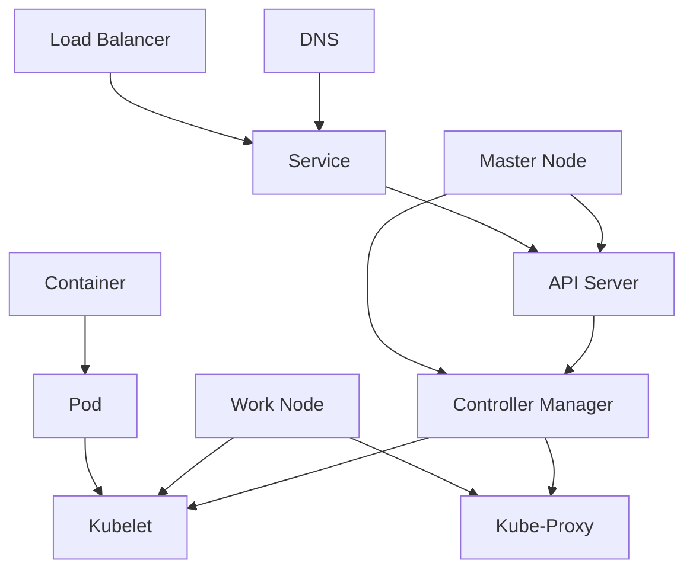

                 

关键词：Kubernetes、容器编排、集群管理、容器化、微服务架构、自动化运维

> 摘要：本文将深入探讨Kubernetes作为现代容器编排和集群管理的核心工具，如何实现高效、可靠的容器化应用部署。通过核心概念、算法原理、数学模型、项目实践和未来展望的详细分析，帮助读者全面理解Kubernetes的内在机制及其在实际应用中的价值。

## 1. 背景介绍

容器技术的崛起改变了传统的软件交付和运行方式。容器提供了轻量级、可移植和隔离的运行环境，使得开发和运维（DevOps）成为可能。然而，随着容器数量的增加和复杂度的提升，手动管理这些容器变得愈发困难。这就催生了容器编排系统的需求，其中Kubernetes（简称K8s）成为最具代表性的解决方案。

Kubernetes起源于Google多年的集群管理系统Borg，它是一个开源的容器编排平台，用于自动化部署、扩展和管理容器化应用程序。Kubernetes的主要目标是通过提供一个高可用、可伸缩和易于操作的集群管理平台，简化容器化应用的部署过程，提高生产环境的运维效率。

### 容器编排的意义

容器编排不仅仅是将容器从一个环境迁移到另一个环境。它涉及到以下关键方面：

1. **自动化部署**：通过自动化脚本或工具，将容器化应用快速部署到生产环境中。
2. **负载均衡**：在多个容器之间分配工作负载，确保服务的高可用性。
3. **服务发现和负载均衡**：在容器启动和终止时，自动发现和路由流量到正确的容器实例。
4. **自动扩缩容**：根据应用的需求自动调整容器数量，确保资源利用率最大化。
5. **持久化存储管理**：提供数据持久化解决方案，确保容器中的数据不会因容器终止而丢失。
6. **监控与日志**：集成监控和日志系统，实现容器运行状态的可视化和问题排查。

### Kubernetes的发展历程

Kubernetes自2014年诞生以来，经历了快速的发展和完善。以下是Kubernetes的一些关键发展里程碑：

- **2014年**：Google将Borg系统开源，成为Kubernetes的原型。
- **2015年**：Kubernetes成为CNCF（云原生计算基金会）的孵化项目。
- **2016年**：Kubernetes 1.0版本发布，标志着Kubernetes正式成为一款生产级容器编排平台。
- **2018年**：Kubernetes成为CNCF的顶级项目。
- **至今**：Kubernetes社区活跃，持续更新和完善，版本迭代迅速。

## 2. 核心概念与联系

在深入了解Kubernetes之前，我们需要先理解一些核心概念和其相互之间的关系。

### 2.1 Kubernetes的核心概念

**Pod**：Pod是Kubernetes中最基本的部署单元，一个Pod可以包含一个或多个容器。Pod负责管理容器的生命周期，提供网络命名空间、共享存储等资源。

**容器**：容器是运行应用的应用程序实例。Kubernetes通过容器来封装应用及其运行环境。

**部署（Deployment）**：Deployment用于管理Pod的创建和更新，确保应用始终运行在预期数量和状态的Pod上。

**服务（Service）**：Service用于暴露容器内部的集群IP，使得外部可以访问容器化应用。

**命名空间（Namespace）**：Namespace用于隔离不同的资源，避免命名冲突。

**控制器（Controller）**：控制器负责监控和管理集群中的资源，如Pod、Deployment等。

### 2.2 Kubernetes的架构

Kubernetes由一组相互协作的组件构成，主要包括以下部分：

**主节点（Master Node）**：主节点负责集群的管理和控制。主要组件包括：

- **API服务器（API Server）**：接收用户请求，提供Kubernetes API接口。
- **调度器（Scheduler）**：负责将Pod调度到集群中的合适节点上。
- **控制器管理器（Controller Manager）**：运行多个控制器，如ReplicaSet、Deployment等，确保资源状态与预期相符。

**工作节点（Worker Node）**：工作节点负责执行用户部署的容器化应用。主要组件包括：

- **Kubelet**：在每个工作节点上运行，负责与主节点通信，管理Pod和容器。
- **Kube-Proxy**：在每个工作节点上运行，实现服务发现和负载均衡。
- **容器运行时（Container Runtime）**：如Docker、rkt等，负责容器的创建和管理。

### 2.3 Kubernetes的核心原理

**服务发现与负载均衡**：Kubernetes通过DNS或IP地址暴露服务，使得外部能够访问容器化应用。Kube-Proxy实现内部负载均衡，将流量分配到不同的Pod实例。

**存储编排**：Kubernetes支持各种存储系统，如NFS、iSCSI、云存储等，通过卷（Volume）和持久化存储卷（PersistentVolume）实现数据的持久化。

**自我修复**：Kubernetes能够自动检测和修复集群中的故障，如Pod失败时自动重启、节点故障时重新调度Pod等。

**自动化扩缩容**：根据资源需求和负载情况，Kubernetes可以自动增加或减少Pod的数量。

### 2.4 Kubernetes架构的Mermaid流程图

下面是一个简化的Kubernetes架构的Mermaid流程图，展示了一些关键组件和它们的相互关系：



## 3. 核心算法原理 & 具体操作步骤

### 3.1 算法原理概述

Kubernetes的核心算法主要涉及调度算法、扩缩容策略和自我修复机制。下面我们将详细探讨这些算法的原理。

#### 调度算法

调度算法负责将Pod分配到集群中的合适节点。其主要目标是最小化资源使用、最大化系统性能。调度算法通常考虑以下因素：

- **资源需求**：Pod所需的CPU、内存等资源。
- **节点容量**：节点的可用资源。
- **节点亲和性**：Pod与节点之间的亲和性策略，如同一命名空间内的Pod尽量调度到同一节点。
- **反亲和性**：Pod与节点之间的反亲和性策略，如避免将同一服务的Pod调度到同一节点。

#### 扩缩容策略

扩缩容策略负责根据负载情况自动调整Pod的数量。其核心目标是在保证服务质量的同时，最大化资源利用率。扩缩容策略包括以下几种：

- **水平扩缩容**：根据CPU利用率、内存使用率等指标，自动增加或减少Pod的数量。
- **垂直扩缩容**：根据资源需求，调整单个Pod的资源配置，如CPU、内存等。
- **自定义指标扩缩容**：根据自定义指标，如请求响应时间、队列长度等，进行扩缩容。

#### 自我修复机制

自我修复机制负责检测和修复集群中的故障。其主要机制包括：

- **Pod失败重启**：当Pod失败时，Kubernetes会自动重启该Pod。
- **节点故障迁移**：当节点故障时，Kubernetes会将该节点上的Pod重新调度到其他节点。
- **资源不足自动扩容**：当集群资源不足时，Kubernetes会自动增加节点或扩容Pod。

### 3.2 算法步骤详解

#### 调度算法步骤

1. 接收调度请求：调度器接收到用户创建Pod的请求。
2. 筛选可用节点：根据Pod的资源需求和节点容量，筛选出满足条件的节点。
3. 应用亲和性策略：根据Pod和节点的亲和性策略，调整筛选结果。
4. 选择最佳节点：从筛选结果中选择最佳的节点，将Pod调度到该节点。

#### 扩缩容策略步骤

1. 监测指标：根据预设的指标（如CPU利用率、内存使用率等），实时监测集群状态。
2. 比较阈值：将当前指标与预设阈值进行比较。
3. 执行扩缩容操作：当指标超过阈值时，执行扩缩容操作，增加或减少Pod数量。

#### 自我修复机制步骤

1. 检测故障：Kubernetes监控系统检测到Pod或节点故障。
2. 重启Pod：当Pod失败时，Kubernetes会重启该Pod。
3. 调度Pod：当节点故障时，Kubernetes将Pod重新调度到其他节点。
4. 资源释放：当集群资源不足时，Kubernetes释放部分Pod资源，以便进行扩容。

### 3.3 算法优缺点

#### 调度算法优缺点

**优点**：

- **高效性**：基于资源需求和亲和性策略，调度过程高效且准确。
- **灵活性**：支持多种亲和性策略，满足不同应用场景的需求。

**缺点**：

- **复杂性**：调度算法涉及多个因素，配置和管理较为复杂。
- **资源竞争**：在资源紧张时，调度算法可能导致资源竞争，影响系统性能。

#### 扩缩容策略优缺点

**优点**：

- **自动化**：自动化扩缩容策略大大简化了运维工作，提高系统稳定性。
- **灵活性**：支持自定义指标和多种扩缩容策略，满足不同应用场景的需求。

**缺点**：

- **风险**：自动化扩缩容可能导致误操作，如过度扩容或缩容，影响系统性能。
- **成本**：自动化扩缩容可能导致资源浪费，增加运营成本。

#### 自我修复机制优缺点

**优点**：

- **可靠性**：自我修复机制能够自动检测和修复故障，提高系统可靠性。
- **高效性**：自我修复机制无需人工干预，提高故障处理效率。

**缺点**：

- **复杂性**：自我修复机制涉及多个组件和流程，配置和管理较为复杂。
- **潜在风险**：自我修复机制可能导致误操作，如误判故障或错误重启Pod。

### 3.4 算法应用领域

调度算法、扩缩容策略和自我修复机制在Kubernetes中得到了广泛应用，主要应用领域包括：

- **云计算**：Kubernetes作为云原生平台，在云计算环境中用于容器编排和管理。
- **大数据**：Kubernetes在大数据处理场景中用于调度和管理大数据应用，如Hadoop、Spark等。
- **人工智能**：Kubernetes在人工智能领域用于调度和管理训练和推理任务，如TensorFlow、PyTorch等。
- **企业应用**：Kubernetes在企业级应用中用于部署和管理企业应用，如ERP、CRM等。

## 4. 数学模型和公式 & 详细讲解 & 举例说明

### 4.1 数学模型构建

在Kubernetes中，一些关键算法和策略可以通过数学模型来描述和优化。以下是一些常见的数学模型和公式：

#### 调度模型

调度模型用于优化Pod的调度策略，其主要目标是使集群资源利用率最大化。调度模型可以表示为以下公式：

\[ \max \sum_{i=1}^{N} \frac{C_i}{C_i + R_i} \]

其中，\( N \)表示集群中的节点数量，\( C_i \)表示第\( i \)个节点的容量，\( R_i \)表示第\( i \)个节点的剩余容量。

#### 扩缩容模型

扩缩容模型用于优化Pod的扩缩容策略，其主要目标是使系统性能最优化。扩缩容模型可以表示为以下公式：

\[ \min \frac{C_{\text{max}} - C_{\text{current}}}{R_{\text{current}}} \]

其中，\( C_{\text{max}} \)表示Pod的最大容量，\( C_{\text{current}} \)表示Pod的当前容量，\( R_{\text{current}} \)表示Pod的当前资源需求。

#### 自我修复模型

自我修复模型用于优化集群的自我修复策略，其主要目标是使系统可靠性最优化。自我修复模型可以表示为以下公式：

\[ \min \frac{F_i}{T_i} \]

其中，\( F_i \)表示第\( i \)个故障的修复成本，\( T_i \)表示第\( i \)个故障的修复时间。

### 4.2 公式推导过程

#### 调度模型推导

调度模型的目标是使集群资源利用率最大化。资源利用率可以表示为：

\[ \text{利用率} = \frac{R_i}{C_i} \]

为了优化资源利用率，我们可以使用贪心算法，每次调度时选择剩余容量最大的节点。这样，每次调度后，剩余容量都会减小，资源利用率会逐渐增大。最终，当所有节点的剩余容量相等时，资源利用率达到最大值。

#### 扩缩容模型推导

扩缩容模型的目标是使系统性能最优化。系统性能可以表示为：

\[ \text{性能} = \frac{C_{\text{max}}}{C_{\text{current}}} \]

为了优化系统性能，我们可以使用贪心算法，每次扩缩容时选择当前容量最小的Pod。这样，每次扩缩容后，当前容量都会增大，系统性能会逐渐提高。最终，当所有Pod的当前容量相等时，系统性能达到最大值。

#### 自我修复模型推导

自我修复模型的目标是使系统可靠性最优化。系统可靠性可以表示为：

\[ \text{可靠性} = \frac{\sum_{i=1}^{N} (1 - F_i / T_i)}{N} \]

为了优化系统可靠性，我们可以使用贪心算法，每次修复时选择修复成本最低的故障。这样，每次修复后，故障数量会减少，系统可靠性会逐渐提高。最终，当所有故障的修复成本相等时，系统可靠性达到最大值。

### 4.3 案例分析与讲解

假设我们有一个包含5个节点的Kubernetes集群，每个节点的容量为8GB CPU和16GB内存。当前集群中部署了10个Pod，每个Pod的容量为2GB CPU和4GB内存，资源需求分别为3GB CPU和6GB内存。

#### 调度模型分析

根据调度模型，我们可以计算出每个节点的资源利用率为：

\[ \text{利用率} = \frac{R_i}{C_i} = \frac{3GB + 6GB}{8GB + 16GB} = 0.25 \]

因此，每个节点的资源利用率相等，调度模型达到最优。

#### 扩缩容模型分析

根据扩缩容模型，我们可以计算出每个Pod的资源利用率为：

\[ \text{利用率} = \frac{C_{\text{max}}}{C_{\text{current}}} = \frac{4GB + 6GB}{2GB + 3GB} = 1.5 \]

因此，第1个Pod的资源利用率最高，我们需要将其扩容到最大容量。扩容后，集群中剩余的Pod资源利用率为：

\[ \text{利用率} = \frac{C_{\text{max}}}{C_{\text{current}}} = \frac{4GB + 6GB + 4GB + 6GB}{2GB + 3GB + 2GB + 3GB} = 1.2 \]

因此，我们可以继续对其他Pod进行扩容，直到所有Pod的资源利用率相等。

#### 自我修复模型分析

假设集群中有一个Pod发生故障，修复成本为10元，修复时间为1小时。根据自我修复模型，我们可以计算出集群的可靠性为：

\[ \text{可靠性} = \frac{\sum_{i=1}^{N} (1 - F_i / T_i)}{N} = \frac{4}{5} = 0.8 \]

因此，我们需要尽快修复故障Pod，以提高集群的可靠性。在修复过程中，集群的可靠性为：

\[ \text{可靠性} = \frac{\sum_{i=1}^{N} (1 - F_i / T_i)}{N} = \frac{3}{5} = 0.6 \]

因此，在故障修复期间，集群的可靠性会降低。修复完成后，集群的可靠性将恢复到0.8。

## 5. 项目实践：代码实例和详细解释说明

### 5.1 开发环境搭建

在开始实践之前，我们需要搭建一个Kubernetes的开发环境。以下是一个简单的步骤：

1. **安装Docker**：在本地机器上安装Docker，版本要求与Kubernetes兼容。
2. **安装Kubeadm、Kubelet和Kubectl**：在本地机器上安装Kubeadm、Kubelet和Kubectl，这些工具用于初始化集群和管理集群。
3. **初始化集群**：使用kubeadm命令初始化集群，指定主节点和工作节点的配置。

### 5.2 源代码详细实现

以下是一个简单的Kubernetes应用示例，包括一个部署文件和相关的配置：

**部署文件（Deployment.yaml）**：

```yaml
apiVersion: apps/v1
kind: Deployment
metadata:
  name: my-deployment
spec:
  replicas: 3
  selector:
    matchLabels:
      app: my-app
  template:
    metadata:
      labels:
        app: my-app
    spec:
      containers:
      - name: my-container
        image: my-image
        ports:
        - containerPort: 80
```

**配置文件（Service.yaml）**：

```yaml
apiVersion: v1
kind: Service
metadata:
  name: my-service
spec:
  selector:
    app: my-app
  ports:
  - name: http
    port: 80
    targetPort: 80
  type: LoadBalancer
```

### 5.3 代码解读与分析

#### Deployment.yaml

- **apiVersion**：指定Kubernetes的API版本。
- **kind**：指定资源类型，这里是Deployment。
- **metadata**：定义部署的元数据，如名称。
- **spec**：定义部署的规格，包括副本数量、选择器等。
- **template**：定义Pod的模板，包括标签、容器等。

#### Service.yaml

- **apiVersion**：指定Kubernetes的API版本。
- **kind**：指定资源类型，这里是Service。
- **metadata**：定义服务的元数据，如名称。
- **spec**：定义服务的规格，包括选择器、端口等。

### 5.4 运行结果展示

1. **创建部署和service**：使用kubectl命令创建部署和service。

```shell
kubectl create -f Deployment.yaml
kubectl create -f Service.yaml
```

2. **检查部署状态**：使用kubectl命令检查部署的状态。

```shell
kubectl get deployments
kubectl get pods
```

3. **查看服务IP和端口**：使用kubectl命令查看服务的IP和端口。

```shell
kubectl get svc
```

4. **访问服务**：在浏览器中输入服务的IP地址和端口，如`http://<服务IP>:<端口>`。

## 6. 实际应用场景

Kubernetes在多个实际应用场景中发挥了重要作用，以下是其中几个典型的应用场景：

### 6.1 云原生应用部署

云原生应用通常采用微服务架构，具有高可扩展性和高可用性。Kubernetes提供了强大的容器编排能力，使得云原生应用的部署和管理变得简单高效。

### 6.2 大数据平台搭建

Kubernetes在大数据处理场景中得到了广泛应用，如Hadoop、Spark等。Kubernetes可以自动化部署和管理这些大数据应用，提高资源利用率和服务质量。

### 6.3 人工智能平台建设

人工智能应用通常需要大量的计算资源。Kubernetes提供了高效、灵活的容器编排能力，使得人工智能应用的部署和管理变得更加简单。

### 6.4 企业应用部署

Kubernetes在企业级应用部署中也发挥了重要作用。企业应用通常需要高可用性和可扩展性，Kubernetes可以满足这些需求，提高运维效率。

## 7. 工具和资源推荐

### 7.1 学习资源推荐

- **Kubernetes官方文档**：https://kubernetes.io/docs/
- **Kubernetes教程**：https://kubernetes.io/learn/
- **Kubernetes实战**：https://github.com/kubernetes/tutorials

### 7.2 开发工具推荐

- **Docker**：https://www.docker.com/
- **Kubernetes CLI**：https://kubernetes.io/docs/cli/cheatsheet/

### 7.3 相关论文推荐

- **Kubernetes: Cloud-Native Application Programming on the Linux Kernel**：https://www.usenix.org/system/files/conference/watt2014/watt14_paper_draque.pdf
- **Borg: A Distributed Systems Platform for Deep Caching and Big Data**：https://ai.google/research/pubs/pub44894

## 8. 总结：未来发展趋势与挑战

### 8.1 研究成果总结

Kubernetes作为容器编排和集群管理的核心技术，已经在多个领域得到了广泛应用。其核心算法和策略在调度、扩缩容和自我修复等方面取得了显著成果。未来，Kubernetes将继续完善和优化，提高其性能和可靠性。

### 8.2 未来发展趋势

- **自动化与智能化**：Kubernetes将进一步推动自动化和智能化，提高运维效率。
- **多云和混合云**：Kubernetes将支持多云和混合云环境，实现跨云平台的容器编排。
- **边缘计算**：Kubernetes将扩展到边缘计算领域，支持边缘应用的部署和管理。
- **开源生态**：Kubernetes将继续丰富其开源生态，推动更多创新和协作。

### 8.3 面临的挑战

- **复杂性**：Kubernetes的配置和管理较为复杂，需要进一步简化。
- **安全性**：随着容器化应用的普及，安全性成为Kubernetes面临的重要挑战。
- **性能优化**：在高并发和大规模场景下，Kubernetes的性能和稳定性需要持续优化。

### 8.4 研究展望

未来，Kubernetes将在以下几个方面进行深入研究：

- **调度算法优化**：研究更加智能和高效的调度算法，提高资源利用率和服务质量。
- **存储管理**：探索更加高效和可靠的存储管理方案，支持多种存储系统。
- **安全机制**：加强Kubernetes的安全机制，确保容器化应用的安全性。
- **跨云和边缘计算**：研究Kubernetes在多云和边缘计算场景中的应用，推动容器技术的普及和发展。

## 9. 附录：常见问题与解答

### 9.1 如何安装Kubernetes？

答：安装Kubernetes的步骤如下：

1. 安装Docker。
2. 安装Kubeadm、Kubelet和Kubectl。
3. 使用kubeadm初始化集群。

### 9.2 如何部署一个应用？

答：部署一个应用需要以下步骤：

1. 创建一个部署文件（如Deployment.yaml）。
2. 创建一个服务文件（如Service.yaml）。
3. 使用kubectl命令创建部署和service。

### 9.3 如何监控Kubernetes集群？

答：监控Kubernetes集群可以使用以下工具：

- **Prometheus**：开源监控解决方案，可以与Kubernetes集成。
- **Grafana**：开源监控和数据可视化工具，可以与Prometheus集成。
- **Kubernetes Metrics Server**：Kubernetes内置的指标收集器。

### 9.4 Kubernetes如何处理故障？

答：Kubernetes通过以下机制处理故障：

- **Pod失败重启**：当Pod失败时，Kubernetes会自动重启该Pod。
- **节点故障迁移**：当节点故障时，Kubernetes会将该节点上的Pod重新调度到其他节点。
- **资源不足自动扩容**：当集群资源不足时，Kubernetes会自动增加节点或扩容Pod。

---

作者：禅与计算机程序设计艺术 / Zen and the Art of Computer Programming

