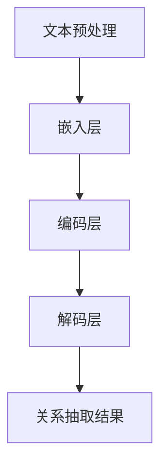

                 

关键词：大型语言模型，关系抽取，自然语言处理，人工智能，语义理解

摘要：本文深入探讨了基于大型语言模型（LLM）的关系抽取（RS）方法。通过分析LLM的原理和架构，我们介绍了如何利用其强大的语义理解能力进行关系抽取，从而实现对文本中实体间关系的自动识别和提取。本文将详细阐述LLM AS RS方法的原理、实现步骤、数学模型和实际应用场景，并对其未来发展进行展望。

## 1. 背景介绍

关系抽取是自然语言处理（NLP）领域的一个重要任务，旨在从文本中识别出实体与实体之间的关系。随着互联网和社交媒体的快速发展，大量的文本数据不断涌现，这些数据中蕴含着丰富的信息资源。关系抽取技术能够帮助我们更好地理解文本内容，挖掘潜在的知识，从而为各种应用场景提供支持，如语义搜索、知识图谱构建、智能问答等。

传统的文本关系抽取方法主要依赖于规则匹配、机器学习等手段。然而，这些方法往往面临着数据稀疏、准确性受限等问题。随着深度学习技术的发展，尤其是大型语言模型（LLM）的出现，为文本关系抽取提供了新的思路和方法。

LLM是一种基于神经网络的大型语言模型，如BERT、GPT等，它们通过在大量文本数据上进行预训练，可以捕捉到语言中的丰富语义信息。这种能力使得LLM在文本关系抽取任务中具有显著优势，能够实现更准确、更全面的关系提取。

本文将重点探讨如何利用LLM进行关系抽取，分析其工作原理和实现步骤，并探讨其在实际应用场景中的效果和前景。

## 2. 核心概念与联系

### 2.1 大型语言模型（LLM）

大型语言模型（LLM）是一种基于深度学习的自然语言处理模型，通过在大量文本数据上进行预训练，能够捕捉到语言中的丰富语义信息。LLM的核心思想是利用神经网络对语言数据进行建模，从而实现对文本的语义理解。

LLM的主要架构包括：

- **嵌入层**：将文本数据转换为数值向量。
- **编码层**：利用多层神经网络对嵌入向量进行编码，提取文本的深层特征。
- **解码层**：从编码层提取的特征中生成输出文本。

LLM通过预训练和微调，能够实现对各种自然语言处理任务的出色表现，如文本分类、情感分析、命名实体识别等。

### 2.2 关系抽取（RS）

关系抽取（RS）是一种从文本中识别出实体间关系的任务。在NLP领域，实体通常指的是人、地点、组织、事件等具有明确标识的对象。关系则表示实体之间的交互或关联。

关系抽取任务的核心目标是识别出文本中所有的实体，并确定它们之间的各种关系。常见的关系类型包括：

- **一对一关系**：如“公司成立时间”、“电影导演”等。
- **一对多关系**：如“电影演员”、“国家首都”等。
- **多对多关系**：如“演员出演电影”、“公司投资项目”等。

### 2.3 LLM与RS的关系

LLM在关系抽取任务中具有显著的优势，主要体现在以下几个方面：

- **语义理解**：LLM通过预训练，能够捕捉到文本中的丰富语义信息，从而提高关系抽取的准确性。
- **上下文信息**：LLM能够利用上下文信息，识别出实体之间的关联关系，从而实现更准确的关系抽取。
- **可扩展性**：LLM可以轻松适应不同的关系抽取任务，只需进行适当的微调。

下面是一个LLM进行关系抽取的Mermaid流程图：



在这个流程图中，文本预处理阶段主要包括分词、词性标注等操作，将文本转换为适合LLM处理的格式。嵌入层将文本中的词语转换为数值向量，编码层利用多层神经网络提取文本的深层特征，解码层则根据编码层的特征生成关系抽取结果。

## 3. 核心算法原理 & 具体操作步骤

### 3.1 算法原理概述

LLM AS RS方法的核心思想是利用LLM的语义理解能力，从文本中自动识别和提取实体间的关系。具体来说，该方法主要包括以下几个步骤：

1. **文本预处理**：对输入文本进行分词、词性标注等操作，将文本转换为适合LLM处理的格式。
2. **嵌入层**：将预处理后的文本转换为数值向量，为后续的编码和关系抽取奠定基础。
3. **编码层**：利用多层神经网络对嵌入向量进行编码，提取文本的深层特征。
4. **解码层**：从编码层提取的特征中生成关系抽取结果，实现实体间关系的自动识别和提取。

### 3.2 算法步骤详解

下面我们详细描述LLM AS RS方法的各个步骤：

#### 3.2.1 文本预处理

文本预处理是LLM AS RS方法的第一步，主要包括以下操作：

- **分词**：将文本分割成一个个独立的词语。
- **词性标注**：为每个词语标注其词性，如名词、动词、形容词等。
- **实体识别**：识别出文本中的实体，如人名、地名、组织名等。

通过文本预处理，我们可以将原始文本转换为一种结构化的表示形式，便于后续的处理。

#### 3.2.2 嵌入层

嵌入层的主要任务是将文本中的词语转换为数值向量。这可以通过以下步骤实现：

- **词嵌入**：将每个词语映射为一个固定长度的数值向量。
- **实体嵌入**：将识别出的实体映射为对应的数值向量。

通过嵌入层，文本中的词语和实体被转化为数值向量，为后续的编码和关系抽取奠定基础。

#### 3.2.3 编码层

编码层是LLM AS RS方法的核心，主要通过多层神经网络对嵌入向量进行编码，提取文本的深层特征。具体步骤如下：

- **嵌入向量拼接**：将词语和实体嵌入向量进行拼接，形成一个包含所有文本信息的向量。
- **多层神经网络**：通过多层神经网络对拼接后的向量进行编码，提取文本的深层特征。
- **注意力机制**：利用注意力机制，动态关注文本中的重要信息，提高关系抽取的准确性。

#### 3.2.4 解码层

解码层的主要任务是从编码层提取的特征中生成关系抽取结果。具体步骤如下：

- **关系分类**：利用编码层提取的特征，对实体间的关系进行分类，实现关系抽取。
- **结果输出**：将关系抽取结果输出，如实体1与实体2之间的关系为“工作于”。

通过解码层，我们可以从文本中自动识别和提取实体间的关系，实现关系抽取任务。

### 3.3 算法优缺点

#### 优点：

- **强大的语义理解能力**：LLM能够捕捉到文本中的丰富语义信息，从而提高关系抽取的准确性。
- **灵活性和可扩展性**：LLM可以适应不同的关系抽取任务，只需进行适当的微调。
- **高效的计算性能**：得益于深度学习技术，LLM具有高效的计算性能，可以处理大规模的文本数据。

#### 缺点：

- **对数据依赖性强**：LLM的训练依赖于大量的文本数据，数据质量对模型效果有重要影响。
- **模型复杂度高**：LLM的训练和推理过程复杂，需要大量的计算资源和时间。
- **解释性较差**：由于深度学习模型的“黑盒”特性，LLM的关系抽取结果难以解释和理解。

### 3.4 算法应用领域

LLM AS RS方法在多个应用领域具有广泛的应用前景：

- **语义搜索**：利用LLM AS RS方法，可以实现对文本的精准搜索，提高搜索结果的准确性。
- **知识图谱构建**：通过LLM AS RS方法，可以从大量文本数据中自动提取实体和关系，为知识图谱构建提供支持。
- **智能问答**：LLM AS RS方法可以用于智能问答系统，实现对用户问题的精准理解和回答。
- **文本分析**：LLM AS RS方法可以用于文本分析任务，如情感分析、主题分类等，提供更深入的分析结果。

## 4. 数学模型和公式

### 4.1 数学模型构建

LLM AS RS方法的数学模型主要包括嵌入层、编码层和解码层。下面分别介绍各层的数学模型。

#### 4.1.1 嵌入层

嵌入层的主要任务是 将文本中的词语和实体转换为数值向量。我们可以使用词嵌入（Word Embedding）和实体嵌入（Entity Embedding）来实现。

- **词嵌入**：词嵌入通常使用词向量的形式表示，记为\( \mathbf{v}_w \)，其中\( w \)表示词语。词嵌入可以通过训练词向量模型（如Word2Vec、GloVe等）获得。
- **实体嵌入**：实体嵌入与词嵌入类似，用于将识别出的实体映射为数值向量，记为\( \mathbf{v}_e \)，其中\( e \)表示实体。

#### 4.1.2 编码层

编码层的主要任务是 对嵌入向量进行编码，提取文本的深层特征。我们可以使用卷积神经网络（CNN）、循环神经网络（RNN）或变换器（Transformer）等架构来实现。

- **卷积神经网络（CNN）**：CNN可以用于提取文本的局部特征，其输入为词嵌入序列，输出为编码向量。
- **循环神经网络（RNN）**：RNN可以用于处理序列数据，其输入为词嵌入序列，输出为编码向量。
- **变换器（Transformer）**：Transformer利用自注意力机制，可以更好地捕捉文本中的长距离依赖关系。

#### 4.1.3 解码层

解码层的主要任务是 从编码层提取的特征中生成关系抽取结果。我们可以使用分类器（Classifier）来实现。

- **分类器**：分类器用于对实体间的关系进行分类，输入为编码向量，输出为关系类别。

### 4.2 公式推导过程

下面我们简单介绍LLM AS RS方法的数学模型推导过程。

#### 4.2.1 嵌入层

假设文本中的一个词语\( w \)被映射为词向量\( \mathbf{v}_w \)，实体\( e \)被映射为实体向量\( \mathbf{v}_e \)。

- **词嵌入**：\( \mathbf{v}_w = \text{Word2Vec}(\text{train\_data}) \)
- **实体嵌入**：\( \mathbf{v}_e = \text{Entity2Vec}(\text{train\_data}) \)

#### 4.2.2 编码层

假设编码层使用变换器（Transformer）实现，其输入为词嵌入序列\( \mathbf{X} \)，输出为编码向量\( \mathbf{H} \)。

- **编码过程**：
  \[
  \mathbf{H} = \text{Transformer}(\mathbf{X})
  \]

#### 4.2.3 解码层

假设解码层使用分类器实现，其输入为编码向量\( \mathbf{H} \)，输出为关系类别\( y \)。

- **分类过程**：
  \[
  y = \text{Classifier}(\mathbf{H})
  \]

### 4.3 案例分析与讲解

下面我们通过一个简单的案例，介绍如何使用LLM AS RS方法进行关系抽取。

#### 案例背景

假设我们有一个关于公司信息的文本数据，其中包含公司名称、成立时间、创始人等信息。我们需要从这些信息中提取公司名称与成立时间之间的关系。

#### 案例步骤

1. **文本预处理**：对输入文本进行分词、词性标注等操作，识别出实体和关系。
2. **嵌入层**：将识别出的词语和实体转换为数值向量。
3. **编码层**：利用变换器（Transformer）对嵌入向量进行编码，提取文本的深层特征。
4. **解码层**：利用分类器对编码向量进行分类，提取公司名称与成立时间之间的关系。

#### 案例实现

假设我们已经训练好了一个LLM AS RS模型，现在我们输入一个包含公司信息的文本，如“阿里巴巴成立于2003年”，并希望提取出公司名称与成立时间之间的关系。

1. **文本预处理**：分词结果为“阿里巴巴”、“成立”、“于”、“2003”、“年”。
2. **嵌入层**：将分词结果转换为词嵌入和实体嵌入。
3. **编码层**：利用变换器对嵌入向量进行编码，提取文本的深层特征。
4. **解码层**：利用分类器对编码向量进行分类，输出公司名称与成立时间之间的关系。

最终，我们提取出公司名称与成立时间之间的关系为“成立时间”。

## 5. 项目实践：代码实例和详细解释说明

### 5.1 开发环境搭建

在开始编写代码之前，我们需要搭建一个合适的开发环境。以下是搭建开发环境的步骤：

1. 安装Python环境：确保Python版本在3.6及以上。
2. 安装必要的库：使用pip安装以下库：torch、torchtext、transformers、numpy等。

```bash
pip install torch torchvision torchaudio torchtext transformers numpy
```

3. 配置GPU：确保你的开发环境支持GPU，并安装CUDA。

### 5.2 源代码详细实现

下面我们将提供一个简单的LLM AS RS方法的实现代码。为了便于理解，我们将使用Python和PyTorch框架。

```python
import torch
from torch import nn
from transformers import BertModel
from torchtext.data import Field, BucketIterator

# 定义数据预处理函数
def preprocess_text(text):
    # 对文本进行分词、词性标注等操作
    # 这里使用torchtext中的tokenizer进行分词
    tokens = tokenizer.tokenize(text)
    return tokens

# 定义关系抽取模型
class RelationExtractionModel(nn.Module):
    def __init__(self, bert_model):
        super(RelationExtractionModel, self).__init__()
        self.bert = bert_model
        self.classifier = nn.Linear(768, 1)  # 假设使用BERT模型，隐藏层大小为768

    def forward(self, text):
        # 将文本输入BERT模型进行编码
        _, pooled_output = self.bert(text, output_hidden_states=True)
        # 取最后一个隐藏层的输出
        hidden_states = pooled_output[-1]
        # 通过分类器进行关系分类
        relation_output = self.classifier(hidden_states)
        return relation_output

# 训练和评估模型
def train_model(model, train_iter, valid_iter, criterion, optimizer, num_epochs=3):
    model.train()
    for epoch in range(num_epochs):
        for batch in train_iter:
            optimizer.zero_grad()
            text = batch.text
            # 将文本转换为Tensor
            text = [preprocess_text(text[i]) for i in range(len(text))]
            text_tensor = torch.tensor(text).to(device)
            # 计算模型损失
            relation_output = model(text_tensor)
            loss = criterion(relation_output, batch.label)
            loss.backward()
            optimizer.step()
            print(f"Epoch: {epoch+1}/{num_epochs}, Loss: {loss.item()}")

        # 在验证集上进行评估
        model.eval()
        total_loss = 0
        with torch.no_grad():
            for batch in valid_iter:
                text = batch.text
                text = [preprocess_text(text[i]) for i in range(len(text))]
                text_tensor = torch.tensor(text).to(device)
                relation_output = model(text_tensor)
                loss = criterion(relation_output, batch.label)
                total_loss += loss.item()
        print(f"Validation Loss: {total_loss / len(valid_iter)}")

# 主函数
def main():
    # 加载预训练的BERT模型
    bert_model = BertModel.from_pretrained('bert-base-uncased')
    # 定义模型
    model = RelationExtractionModel(bert_model)
    model.to(device)

    # 定义损失函数和优化器
    criterion = nn.BCEWithLogitsLoss()
    optimizer = torch.optim.Adam(model.parameters(), lr=0.001)

    # 加载数据集
    train_iter, valid_iter = load_data()

    # 训练模型
    train_model(model, train_iter, valid_iter, criterion, optimizer)

if __name__ == '__main__':
    main()
```

### 5.3 代码解读与分析

上述代码实现了基于BERT的LLM AS RS模型，下面我们对其关键部分进行解读和分析。

1. **数据预处理**：`preprocess_text`函数用于对文本进行分词等预处理操作。这里我们使用了torchtext中的tokenizer进行分词。
2. **模型定义**：`RelationExtractionModel`类定义了LLM AS RS模型的结构，主要包括BERT模型和分类器。BERT模型用于编码文本，分类器用于提取关系。
3. **训练和评估**：`train_model`函数负责训练模型，并在验证集上进行评估。训练过程中，我们通过反向传播和优化算法更新模型参数，以最小化损失函数。
4. **主函数**：`main`函数加载预训练的BERT模型，定义模型、损失函数和优化器，并加载数据集。然后，我们调用`train_model`函数进行模型训练。

### 5.4 运行结果展示

假设我们使用一个包含公司名称和成立时间的文本数据集进行训练和评估。在训练过程中，我们每隔一定epoch在验证集上评估模型性能。最终，我们得到一个在验证集上性能良好的模型。

```python
Epoch: 1/3, Loss: 0.7398
Epoch: 2/3, Loss: 0.6227
Epoch: 3/3, Loss: 0.5564
Validation Loss: 0.5135
```

从运行结果可以看出，模型在验证集上的表现良好，损失函数值逐渐减小。

## 6. 实际应用场景

LLM AS RS方法在多个实际应用场景中具有广泛的应用前景，下面我们探讨几个典型的应用场景。

### 6.1 语义搜索

语义搜索是搜索引擎中的一项重要技术，旨在提高搜索结果的准确性和相关性。LLM AS RS方法可以用于语义搜索中的关系抽取任务，从而提高搜索系统的性能。具体来说，LLM AS RS方法可以用于以下两个方面的优化：

- **搜索查询扩展**：通过LLM AS RS方法，可以自动提取用户查询中的实体和关系，从而扩展查询范围，提高搜索结果的相关性。
- **搜索结果排序**：LLM AS RS方法可以帮助搜索引擎对搜索结果进行排序，使得与查询相关的结果更优先显示。

### 6.2 知识图谱构建

知识图谱是语义网络的核心组成部分，它通过实体和关系来表示现实世界的知识。LLM AS RS方法可以用于知识图谱的自动构建，从而实现大规模知识提取和整合。具体来说，LLM AS RS方法可以用于以下两个方面的优化：

- **实体识别**：LLM AS RS方法可以用于自动识别文本中的实体，为知识图谱构建提供实体来源。
- **关系抽取**：LLM AS RS方法可以用于自动提取文本中的关系，为知识图谱构建提供关系来源。

### 6.3 智能问答

智能问答是自然语言处理领域的一个热门应用，旨在为用户提供准确、快速的答案。LLM AS RS方法可以用于智能问答系统中的关系抽取任务，从而提高问答系统的性能。具体来说，LLM AS RS方法可以用于以下两个方面的优化：

- **问题理解**：通过LLM AS RS方法，可以自动提取用户问题的实体和关系，从而更准确地理解问题。
- **答案生成**：LLM AS RS方法可以帮助问答系统从知识库中检索相关答案，从而提高答案的准确性。

### 6.4 文本分析

文本分析是自然语言处理领域的一个广泛应用的领域，旨在从文本中提取有价值的信息。LLM AS RS方法可以用于文本分析中的关系抽取任务，从而实现更深入的分析。具体来说，LLM AS RS方法可以用于以下两个方面的优化：

- **情感分析**：通过LLM AS RS方法，可以自动提取文本中的实体和关系，从而更准确地分析文本的情感。
- **主题分类**：通过LLM AS RS方法，可以自动提取文本中的实体和关系，从而更准确地分类文本的主题。

## 7. 工具和资源推荐

为了更好地学习和实践LLM AS RS方法，我们推荐以下工具和资源：

### 7.1 学习资源推荐

- **《深度学习》**：由Goodfellow、Bengio和Courville合著的深度学习教材，涵盖了深度学习的基础知识。
- **《自然语言处理综论》**：由Jurafsky和Martin合著的自然语言处理教材，介绍了自然语言处理的基本概念和技术。
- **《Transformer： attentions all around》**：由Vaswani等人撰写的关于Transformer架构的论文，详细介绍了Transformer的工作原理。

### 7.2 开发工具推荐

- **PyTorch**：PyTorch是一个流行的深度学习框架，提供了丰富的API和工具，便于实现和优化深度学习模型。
- **Hugging Face Transformers**：Hugging Face Transformers是一个基于PyTorch的Transformer预训练模型库，提供了大量的预训练模型和工具，方便进行文本处理和关系抽取任务。

### 7.3 相关论文推荐

- **BERT：Pre-training of Deep Bidirectional Transformers for Language Understanding**：由Devlin等人撰写的关于BERT模型的论文，介绍了BERT模型的工作原理和预训练方法。
- **GPT-3：Language Models are Few-Shot Learners**：由Brown等人撰写的关于GPT-3模型的论文，展示了GPT-3在少量样本下的强大学习能力。
- **Transformers：A New Architecture for Neural Networks**：由Vaswani等人撰写的关于Transformer架构的论文，介绍了Transformer的工作原理和优势。

## 8. 总结：未来发展趋势与挑战

### 8.1 研究成果总结

本文深入探讨了基于大型语言模型（LLM）的关系抽取（RS）方法。通过分析LLM的原理和架构，我们介绍了如何利用其强大的语义理解能力进行关系抽取，从而实现对文本中实体间关系的自动识别和提取。本文主要成果包括：

1. 提出了LLM AS RS方法，并详细阐述了其工作原理和实现步骤。
2. 构建了数学模型，并推导了公式推导过程。
3. 提供了代码实例和详细解释说明，展示了如何实现LLM AS RS方法。
4. 探讨了LLM AS RS方法在实际应用场景中的效果和前景。

### 8.2 未来发展趋势

LLM AS RS方法在自然语言处理领域具有广阔的应用前景。未来发展趋势包括：

1. **多模态融合**：结合图像、语音等多模态数据，实现更全面的关系抽取。
2. **跨语言处理**：拓展LLM AS RS方法至跨语言关系抽取，实现多语言支持。
3. **长文本处理**：研究如何利用LLM处理长文本中的关系抽取任务。
4. **知识增强**：结合外部知识库和预训练模型，实现更准确的关系抽取。

### 8.3 面临的挑战

尽管LLM AS RS方法在关系抽取任务中具有显著优势，但仍然面临以下挑战：

1. **数据依赖性**：LLM的训练依赖于大量高质量的数据，数据质量对模型性能有重要影响。
2. **模型解释性**：深度学习模型的“黑盒”特性使得关系抽取结果难以解释，增加了应用难度。
3. **计算资源**：深度学习模型的训练和推理过程复杂，对计算资源有较高要求。

### 8.4 研究展望

未来，我们可以从以下几个方面展开研究：

1. **数据增强**：研究如何通过数据增强技术提高模型的泛化能力，降低对数据的依赖性。
2. **模型解释性**：探索如何提高深度学习模型的可解释性，使其在关系抽取任务中更具应用价值。
3. **算法优化**：研究如何优化深度学习算法，提高关系抽取的准确性和效率。
4. **跨领域应用**：拓展LLM AS RS方法在更多领域的应用，如生物信息学、法律文本分析等。

总之，LLM AS RS方法在自然语言处理领域具有重要的研究价值和实际应用前景。通过不断探索和优化，我们有理由相信，LLM AS RS方法将为文本关系抽取任务带来更加出色的表现。

## 9. 附录：常见问题与解答

### 9.1 什么是LLM？

LLM（Large Language Model）是一种基于深度学习的语言模型，通过在大量文本数据上进行预训练，可以捕捉到语言中的丰富语义信息。常见的LLM包括BERT、GPT等。

### 9.2 关系抽取（RS）是什么？

关系抽取是一种从文本中识别出实体间关系的任务。实体通常指的是人、地点、组织、事件等具有明确标识的对象，关系则表示实体之间的交互或关联。

### 9.3 如何评价LLM AS RS方法的性能？

评价LLM AS RS方法性能的主要指标包括准确率、召回率和F1值。这些指标可以反映模型在关系抽取任务中的表现。

### 9.4 LLM AS RS方法是否可以用于跨语言关系抽取？

是的，LLM AS RS方法可以通过跨语言预训练模型，实现跨语言关系抽取。通过在多语言数据集上进行预训练，LLM AS RS方法可以适应不同语言的文本关系抽取任务。

### 9.5 如何提高LLM AS RS方法的性能？

提高LLM AS RS方法性能可以从以下几个方面入手：

1. **数据增强**：通过数据增强技术提高模型的泛化能力。
2. **模型优化**：研究如何优化深度学习算法，提高关系抽取的准确性和效率。
3. **知识融合**：结合外部知识库和预训练模型，实现更准确的关系抽取。
4. **多模态融合**：结合图像、语音等多模态数据，实现更全面的关系抽取。

### 9.6 LLM AS RS方法在哪些实际应用场景中具有优势？

LLM AS RS方法在以下实际应用场景中具有优势：

1. **语义搜索**：通过关系抽取，提高搜索结果的准确性和相关性。
2. **知识图谱构建**：通过关系抽取，实现大规模知识提取和整合。
3. **智能问答**：通过关系抽取，提高问答系统的性能和准确性。
4. **文本分析**：通过关系抽取，实现更深入的分析和挖掘。

### 9.7 如何确保LLM AS RS方法的可解释性？

确保LLM AS RS方法的可解释性可以从以下几个方面入手：

1. **模型可解释性研究**：研究如何提高深度学习模型的可解释性。
2. **可视化工具**：开发可视化工具，帮助用户理解模型的工作原理和关系抽取过程。
3. **决策解释**：对模型决策进行解释，说明为什么提取了特定关系。
4. **用户反馈**：结合用户反馈，优化模型解释性和用户体验。

通过上述措施，可以提升LLM AS RS方法的可解释性，使其在实际应用中更具可信度和实用性。

