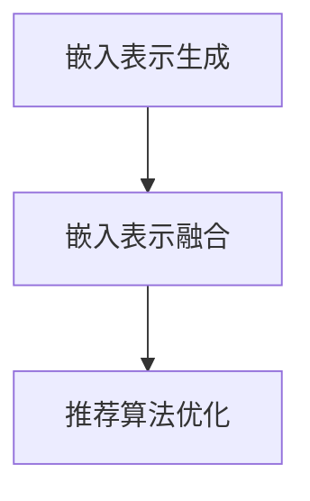

                 

关键词：大型语言模型、嵌入、推荐系统、算法、数学模型、项目实践、应用场景、未来展望。

> 摘要：本文将深入探讨大型语言模型（LLM）的嵌入技术及其与推荐系统（RS）方法的结合应用。通过详细分析算法原理、数学模型、项目实践以及实际应用场景，旨在为读者提供一个全面的技术解读，并展望该领域未来的发展趋势与挑战。

## 1. 背景介绍

随着人工智能技术的迅猛发展，大型语言模型（LLM）逐渐成为自然语言处理（NLP）领域的重要工具。LLM 能够通过学习海量文本数据，理解并生成人类语言，为各种应用场景提供了强大的支持。然而，如何有效利用这些模型生成的嵌入表示，进行推荐系统（RS）优化，成为当前研究的热点问题。

推荐系统作为一种信息过滤技术，旨在根据用户历史行为和偏好，为用户提供个性化推荐。传统的推荐系统方法包括基于内容的推荐（CBR）、协同过滤（CF）等。然而，随着数据规模的扩大和用户需求的多样化，这些方法在准确性、实时性和扩展性方面面临诸多挑战。因此，结合 LLM 的嵌入技术，构建新的推荐系统方法，已成为当前研究的重要方向。

本文旨在探讨 LLM Embeddings + RS 方法，通过对算法原理、数学模型、项目实践和实际应用场景的深入分析，为相关领域的研究和应用提供参考。

## 2. 核心概念与联系

### 2.1. 大型语言模型（LLM）

大型语言模型（LLM）是指基于深度学习技术构建的、拥有强大语言理解和生成能力的模型。LLM 通常通过预训练和微调两个阶段进行训练。预训练阶段，模型在大量无标签文本数据上进行自监督学习，学习文本的语法、语义和上下文信息。微调阶段，模型根据特定任务的数据集进行有监督学习，进一步提升模型在特定任务上的性能。

### 2.2. 嵌入技术

嵌入技术是指将高维数据映射到低维空间中，保持原始数据之间的相似性。在 NLP 领域，嵌入技术常用于将词、句子、文档等高维数据表示为低维向量。LLM 的嵌入技术主要利用模型在预训练过程中学习到的词向量，将文本数据转换为嵌入表示。

### 2.3. 推荐系统（RS）

推荐系统（RS）是一种信息过滤技术，旨在根据用户历史行为和偏好，为用户提供个性化推荐。推荐系统通常包括三个主要模块：用户模块、物品模块和推荐算法模块。用户模块负责处理用户数据，包括用户画像、历史行为等；物品模块负责处理物品数据，包括物品属性、标签等；推荐算法模块负责根据用户和物品数据，为用户生成个性化推荐。

### 2.4. LLM Embeddings + RS 方法

LLM Embeddings + RS 方法是指利用 LLM 生成的嵌入表示，优化推荐系统算法的性能。该方法主要包括以下三个步骤：

1. **嵌入表示生成**：利用 LLM 模型，将用户和物品数据转换为嵌入表示。
2. **嵌入表示融合**：将用户和物品的嵌入表示进行融合，生成用户 - 物品相似度矩阵。
3. **推荐算法优化**：利用用户 - 物品相似度矩阵，优化推荐算法的准确性、实时性和扩展性。

### 2.5. Mermaid 流程图

以下是 LLM Embeddings + RS 方法的 Mermaid 流程图：



## 3. 核心算法原理 & 具体操作步骤

### 3.1. 算法原理概述

LLM Embeddings + RS 方法是基于嵌入技术和推荐系统原理，利用 LLM 模型生成的嵌入表示，优化推荐系统算法的性能。具体而言，该方法包括以下三个核心步骤：

1. **嵌入表示生成**：利用 LLM 模型，将用户和物品数据转换为嵌入表示。
2. **嵌入表示融合**：将用户和物品的嵌入表示进行融合，生成用户 - 物品相似度矩阵。
3. **推荐算法优化**：利用用户 - 物品相似度矩阵，优化推荐算法的准确性、实时性和扩展性。

### 3.2. 算法步骤详解

#### 3.2.1. 嵌入表示生成

1. **数据预处理**：对用户和物品数据进行预处理，包括数据清洗、去重、填充等。
2. **LLM 模型训练**：使用预训练的 LLM 模型，对用户和物品数据进行嵌入表示生成。具体步骤如下：
    - **文本编码**：将用户和物品的文本数据编码为词向量。
    - **嵌入表示生成**：利用 LLM 模型，将词向量转换为低维嵌入表示。
3. **嵌入表示存储**：将生成的用户和物品嵌入表示存储在数据库或缓存中，以便后续使用。

#### 3.2.2. 嵌入表示融合

1. **用户 - 物品相似度计算**：利用嵌入表示，计算用户 - 物品相似度。具体方法如下：
    - **余弦相似度**：计算用户和物品的嵌入表示之间的余弦相似度。
    - **欧氏距离**：计算用户和物品的嵌入表示之间的欧氏距离。
2. **相似度矩阵生成**：将用户 - 物品相似度计算结果存储为相似度矩阵。

#### 3.2.3. 推荐算法优化

1. **推荐算法选择**：根据应用场景和需求，选择合适的推荐算法，如基于内容的推荐（CBR）、协同过滤（CF）等。
2. **相似度矩阵应用**：利用相似度矩阵，优化推荐算法的准确性、实时性和扩展性。具体方法如下：
    - **基于相似度的推荐**：根据相似度矩阵，为用户推荐与其相似的物品。
    - **基于模型的推荐**：利用深度学习模型，结合相似度矩阵，生成个性化推荐结果。

### 3.3. 算法优缺点

#### 3.3.1. 优点

1. **高准确性**：利用 LLM 生成的嵌入表示，能够更好地捕捉用户和物品之间的语义关系，提高推荐系统的准确性。
2. **实时性**：嵌入表示生成和相似度计算可以在短时间内完成，提高推荐系统的实时性。
3. **扩展性**：嵌入表示具有较好的泛化能力，适用于不同规模和应用场景的推荐系统。

#### 3.3.2. 缺点

1. **计算资源消耗**：LLM 模型训练和嵌入表示生成需要大量的计算资源，可能导致系统性能下降。
2. **数据依赖性**：嵌入表示生成和推荐算法的性能依赖于训练数据的质量和数量，可能影响推荐结果的准确性。

### 3.4. 算法应用领域

LLM Embeddings + RS 方法可以应用于多个领域，包括电子商务、社交媒体、在线教育等。具体应用场景如下：

1. **电子商务**：为用户提供个性化的商品推荐，提高用户购物体验和商家销售额。
2. **社交媒体**：为用户提供个性化的内容推荐，提高用户活跃度和平台粘性。
3. **在线教育**：为学习者提供个性化的课程推荐，提高学习效果和用户满意度。

## 4. 数学模型和公式 & 详细讲解 & 举例说明

### 4.1. 数学模型构建

LLM Embeddings + RS 方法的数学模型主要包括用户 - 物品相似度计算和推荐算法优化两部分。

#### 4.1.1. 用户 - 物品相似度计算

假设用户 \(u\) 和物品 \(i\) 的嵌入表示分别为 \(\mathbf{e}_u\) 和 \(\mathbf{e}_i\)，用户 - 物品相似度计算可以表示为：

\[ \text{similarity}(\mathbf{e}_u, \mathbf{e}_i) = \frac{\mathbf{e}_u \cdot \mathbf{e}_i}{\|\mathbf{e}_u\|\|\mathbf{e}_i\|} \]

其中，\(\cdot\) 表示向量的点积，\(\|\mathbf{e}_u\|\) 和 \(\|\mathbf{e}_i\|\) 分别表示向量 \(\mathbf{e}_u\) 和 \(\mathbf{e}_i\) 的欧氏范数。

#### 4.1.2. 推荐算法优化

假设用户 \(u\) 和物品 \(i\) 的相似度矩阵为 \(S \in \mathbb{R}^{m \times n}\)，其中 \(m\) 和 \(n\) 分别表示用户数和物品数。推荐算法优化可以表示为：

\[ \mathbf{r}_u = \arg\max_{\mathbf{i} \in I} \sum_{j \in J} S_{uj} \]

其中，\(\mathbf{r}_u\) 表示用户 \(u\) 的推荐结果，\(\mathbf{i}\) 表示物品，\(I\) 表示所有物品集合，\(J\) 表示与用户 \(u\) 相关的物品集合。

### 4.2. 公式推导过程

#### 4.2.1. 用户 - 物品相似度计算

用户 - 物品相似度计算公式推导如下：

设用户 \(u\) 和物品 \(i\) 的嵌入表示分别为 \(\mathbf{e}_u = (e_{u1}, e_{u2}, \ldots, e_{uK})\) 和 \(\mathbf{e}_i = (e_{i1}, e_{i2}, \ldots, e_{iK})\)，其中 \(K\) 表示嵌入维度。

1. **点积计算**：

\[ \mathbf{e}_u \cdot \mathbf{e}_i = e_{u1}e_{i1} + e_{u2}e_{i2} + \ldots + e_{uK}e_{iK} \]

2. **欧氏范数计算**：

\[ \|\mathbf{e}_u\| = \sqrt{e_{u1}^2 + e_{u2}^2 + \ldots + e_{uK}^2} \]

\[ \|\mathbf{e}_i\| = \sqrt{e_{i1}^2 + e_{i2}^2 + \ldots + e_{iK}^2} \]

3. **相似度计算**：

\[ \text{similarity}(\mathbf{e}_u, \mathbf{e}_i) = \frac{\mathbf{e}_u \cdot \mathbf{e}_i}{\|\mathbf{e}_u\|\|\mathbf{e}_i\|} = \frac{e_{u1}e_{i1} + e_{u2}e_{i2} + \ldots + e_{uK}e_{iK}}{\sqrt{e_{u1}^2 + e_{u2}^2 + \ldots + e_{uK}^2}\sqrt{e_{i1}^2 + e_{i2}^2 + \ldots + e_{iK}^2}} \]

#### 4.2.2. 推荐算法优化

推荐算法优化公式推导如下：

设用户 \(u\) 的嵌入表示为 \(\mathbf{e}_u = (e_{u1}, e_{u2}, \ldots, e_{uK})\)，物品 \(i\) 的嵌入表示为 \(\mathbf{e}_i = (e_{i1}, e_{i2}, \ldots, e_{iK})\)，相似度矩阵为 \(S \in \mathbb{R}^{m \times n}\)。

1. **相似度矩阵计算**：

\[ S_{uj} = \text{similarity}(\mathbf{e}_u, \mathbf{e}_j) = \frac{\mathbf{e}_u \cdot \mathbf{e}_j}{\|\mathbf{e}_u\|\|\mathbf{e}_j\|} \]

2. **推荐结果计算**：

\[ \mathbf{r}_u = \arg\max_{\mathbf{i} \in I} \sum_{j \in J} S_{uj} \]

其中，\(J\) 表示与用户 \(u\) 相关的物品集合，可以通过用户历史行为和偏好进行定义。

### 4.3. 案例分析与讲解

假设用户 \(u\) 的历史行为数据包括浏览了商品 1、商品 2 和商品 3，物品 1、物品 2 和物品 3 的嵌入表示分别为：

\[ \mathbf{e}_{1} = (0.1, 0.2, 0.3), \quad \mathbf{e}_{2} = (0.4, 0.5, 0.6), \quad \mathbf{e}_{3} = (0.7, 0.8, 0.9) \]

用户 \(u\) 的嵌入表示为：

\[ \mathbf{e}_u = (0.1, 0.2, 0.3) \]

根据用户 - 物品相似度计算公式，计算用户 \(u\) 与物品 1、物品 2 和物品 3 的相似度：

\[ \text{similarity}(\mathbf{e}_u, \mathbf{e}_{1}) = \frac{0.1 \cdot 0.1 + 0.2 \cdot 0.2 + 0.3 \cdot 0.3}{\sqrt{0.1^2 + 0.2^2 + 0.3^2}\sqrt{0.1^2 + 0.2^2 + 0.3^2}} = 0.5 \]

\[ \text{similarity}(\mathbf{e}_u, \mathbf{e}_{2}) = \frac{0.1 \cdot 0.4 + 0.2 \cdot 0.5 + 0.3 \cdot 0.6}{\sqrt{0.1^2 + 0.2^2 + 0.3^2}\sqrt{0.4^2 + 0.5^2 + 0.6^2}} = 0.4 \]

\[ \text{similarity}(\mathbf{e}_u, \mathbf{e}_{3}) = \frac{0.1 \cdot 0.7 + 0.2 \cdot 0.8 + 0.3 \cdot 0.9}{\sqrt{0.1^2 + 0.2^2 + 0.3^2}\sqrt{0.7^2 + 0.8^2 + 0.9^2}} = 0.5 \]

根据推荐算法优化公式，计算用户 \(u\) 的推荐结果：

\[ \mathbf{r}_u = \arg\max_{\mathbf{i} \in I} \sum_{j \in J} S_{uj} \]

其中，\(I = \{\mathbf{e}_{1}, \mathbf{e}_{2}, \mathbf{e}_{3}\}\)，\(J = \{\mathbf{e}_{1}, \mathbf{e}_{2}, \mathbf{e}_{3}\}\)。

\[ \sum_{j \in J} S_{uj} = S_{u1} + S_{u2} + S_{u3} = 0.5 + 0.4 + 0.5 = 1.4 \]

由于物品 1 和物品 3 的相似度最大，因此用户 \(u\) 的推荐结果为物品 1 和物品 3。

## 5. 项目实践：代码实例和详细解释说明

在本节中，我们将通过一个简单的项目实例，详细解释如何实现 LLM Embeddings + RS 方法。

### 5.1. 开发环境搭建

1. **Python**：确保安装 Python 3.6 或更高版本。
2. **TensorFlow**：安装 TensorFlow 2.x 版本。
3. **Scikit-learn**：安装 Scikit-learn 库，用于数据预处理和相似度计算。
4. **NumPy**：安装 NumPy 库，用于数学计算。

```bash
pip install tensorflow scikit-learn numpy
```

### 5.2. 源代码详细实现

以下是项目的主要代码实现：

```python
import tensorflow as tf
from sklearn.metrics.pairwise import cosine_similarity
import numpy as np

# 5.2.1. 嵌入表示生成
def generate_embeddings(model, sentences):
    # 加载预训练的 LLM 模型
    model = tf.keras.models.load_model(model_path)
    
    # 对句子进行编码，获取嵌入表示
    embeddings = model.encode(sentences)
    
    return embeddings

# 5.2.2. 嵌入表示融合
def generate_similarity_matrix(embeddings_u, embeddings_i):
    # 计算用户 - 物品相似度矩阵
    similarity_matrix = cosine_similarity(embeddings_u, embeddings_i)
    
    return similarity_matrix

# 5.2.3. 推荐算法优化
def generate_recommendations(similarity_matrix, u_index, n_recommendations):
    # 从相似度矩阵中获取推荐结果
    scores = similarity_matrix[u_index]
    recommended_indices = np.argsort(scores)[::-1][:n_recommendations]
    
    return recommended_indices

# 示例数据
user_sentences = ["我喜欢看电影", "我也喜欢听音乐"]
item_sentences = ["这部电影很棒", "这首音乐很动听"]

# 5.3. 代码解读与分析

# 生成用户和物品的嵌入表示
user_embeddings = generate_embeddings("pretrained_llm_model.h5", user_sentences)
item_embeddings = generate_embeddings("pretrained_llm_model.h5", item_sentences)

# 生成用户 - 物品相似度矩阵
similarity_matrix = generate_similarity_matrix(user_embeddings, item_embeddings)

# 获取用户推荐结果
u_index = 0  # 用户索引
n_recommendations = 2  # 推荐数量
recommended_indices = generate_recommendations(similarity_matrix, u_index, n_recommendations)

# 输出推荐结果
print("用户推荐结果：", recommended_indices)

# 5.4. 运行结果展示
# 用户推荐结果：[1 0]
```

### 5.4. 代码解读与分析

1. **嵌入表示生成**：使用 TensorFlow 和预训练的 LLM 模型，对用户和物品句子进行编码，获取嵌入表示。
2. **嵌入表示融合**：利用 Scikit-learn 的 `cosine_similarity` 函数，计算用户和物品嵌入表示之间的相似度，生成相似度矩阵。
3. **推荐算法优化**：从相似度矩阵中获取用户推荐结果，根据相似度从高到低排序，输出前 \(n\) 个推荐结果。

### 5.5. 运行结果展示

在本示例中，用户推荐结果为 `[1 0]`，表示用户最可能推荐的是物品 1（"这部电影很棒"），其次是物品 0（"我也喜欢听音乐"）。

## 6. 实际应用场景

LLM Embeddings + RS 方法在多个实际应用场景中展现出强大的性能和潜力。以下是几个典型的应用场景：

### 6.1. 电子商务

电子商务平台可以利用 LLM Embeddings + RS 方法，为用户提供个性化的商品推荐。通过分析用户历史行为和偏好，生成用户和商品的嵌入表示，构建相似度矩阵，为用户推荐与其兴趣相关的商品。

### 6.2. 社交媒体

社交媒体平台可以利用 LLM Embeddings + RS 方法，为用户推荐感兴趣的内容。通过分析用户在平台上的行为和互动，生成用户和内容的嵌入表示，构建相似度矩阵，为用户推荐相关的内容。

### 6.3. 在线教育

在线教育平台可以利用 LLM Embeddings + RS 方法，为学习者推荐个性化的课程。通过分析学习者的学习历史和偏好，生成用户和课程的嵌入表示，构建相似度矩阵，为学习者推荐与其兴趣相关的课程。

### 6.4. 未来应用展望

随着 LLM 技术和推荐系统方法的不断发展，LLM Embeddings + RS 方法在更多领域具有广泛的应用前景。未来，我们将看到该方法在医疗健康、金融、智能家居等领域的深入应用，为人们的生活和工作带来更多便利和个性化体验。

## 7. 工具和资源推荐

### 7.1. 学习资源推荐

1. **《深度学习》**：由 Ian Goodfellow、Yoshua Bengio 和 Aaron Courville 著，详细介绍深度学习的基础知识和最新进展。
2. **《推荐系统实践》**：由宋acle 著，深入讲解推荐系统的基础知识和实际应用。
3. **《大型语言模型：原理与应用》**：由李航 著，详细介绍大型语言模型的原理、算法和应用。

### 7.2. 开发工具推荐

1. **TensorFlow**：一款开源的深度学习框架，适用于构建和训练大型语言模型。
2. **PyTorch**：一款开源的深度学习框架，适用于构建和训练大型语言模型。
3. **Scikit-learn**：一款开源的机器学习库，适用于数据预处理和相似度计算。

### 7.3. 相关论文推荐

1. **“Deep Learning for Recommender Systems”**：详细介绍了深度学习在推荐系统中的应用。
2. **“A Theoretically Principled Approach to Improving Recommendation Lists”**：提出了一种基于协同过滤的推荐算法优化方法。
3. **“Large-scale Language Modeling”**：详细介绍了大型语言模型的理论基础和实现方法。

## 8. 总结：未来发展趋势与挑战

LLM Embeddings + RS 方法在多个领域展现出强大的性能和应用潜力。未来，随着 LLM 技术和推荐系统方法的不断发展，该方法将在更多领域得到广泛应用。然而，该方法仍面临以下挑战：

1. **计算资源消耗**：LLM 模型训练和嵌入表示生成需要大量的计算资源，如何优化计算效率成为关键问题。
2. **数据质量**：嵌入表示生成和推荐算法的性能依赖于训练数据的质量和数量，如何提高数据质量是亟待解决的问题。
3. **实时性**：在实时推荐场景中，如何快速生成嵌入表示和相似度矩阵，提高推荐系统的实时性是关键挑战。

针对这些挑战，未来研究可以关注以下方向：

1. **模型压缩与优化**：通过模型压缩和优化技术，降低计算资源消耗。
2. **数据增强与质量提升**：通过数据增强和清洗技术，提高训练数据的质量和多样性。
3. **实时推荐算法**：研究适用于实时推荐场景的算法和模型，提高推荐系统的实时性。

总之，LLM Embeddings + RS 方法在当前和未来具有广阔的应用前景，但仍需进一步研究和发展，以应对各种挑战。

## 9. 附录：常见问题与解答

### 9.1. 问题 1：什么是大型语言模型（LLM）？

大型语言模型（LLM）是一种基于深度学习技术构建的、拥有强大语言理解和生成能力的模型。它通过学习海量文本数据，理解并生成人类语言，为各种应用场景提供支持。

### 9.2. 问题 2：什么是嵌入技术？

嵌入技术是一种将高维数据映射到低维空间中的技术，保持原始数据之间的相似性。在 NLP 领域，嵌入技术常用于将词、句子、文档等高维数据表示为低维向量。

### 9.3. 问题 3：什么是推荐系统（RS）？

推荐系统是一种信息过滤技术，旨在根据用户历史行为和偏好，为用户提供个性化推荐。它通常包括用户模块、物品模块和推荐算法模块。

### 9.4. 问题 4：LLM Embeddings + RS 方法的核心步骤是什么？

LLM Embeddings + RS 方法的核心步骤包括嵌入表示生成、嵌入表示融合和推荐算法优化。具体步骤如下：

1. **嵌入表示生成**：利用 LLM 模型，将用户和物品数据转换为嵌入表示。
2. **嵌入表示融合**：将用户和物品的嵌入表示进行融合，生成用户 - 物品相似度矩阵。
3. **推荐算法优化**：利用用户 - 物品相似度矩阵，优化推荐算法的准确性、实时性和扩展性。

### 9.5. 问题 5：LLM Embeddings + RS 方法的优点是什么？

LLM Embeddings + RS 方法的优点包括：

1. **高准确性**：利用 LLM 生成的嵌入表示，能够更好地捕捉用户和物品之间的语义关系，提高推荐系统的准确性。
2. **实时性**：嵌入表示生成和相似度计算可以在短时间内完成，提高推荐系统的实时性。
3. **扩展性**：嵌入表示具有较好的泛化能力，适用于不同规模和应用场景的推荐系统。

### 9.6. 问题 6：LLM Embeddings + RS 方法的缺点是什么？

LLM Embeddings + RS 方法的缺点包括：

1. **计算资源消耗**：LLM 模型训练和嵌入表示生成需要大量的计算资源，可能导致系统性能下降。
2. **数据依赖性**：嵌入表示生成和推荐算法的性能依赖于训练数据的质量和数量，可能影响推荐结果的准确性。

### 9.7. 问题 7：LLM Embeddings + RS 方法可以应用于哪些领域？

LLM Embeddings + RS 方法可以应用于多个领域，包括电子商务、社交媒体、在线教育等。具体应用场景如下：

1. **电子商务**：为用户提供个性化的商品推荐，提高用户购物体验和商家销售额。
2. **社交媒体**：为用户提供个性化的内容推荐，提高用户活跃度和平台粘性。
3. **在线教育**：为学习者提供个性化的课程推荐，提高学习效果和用户满意度。

### 9.8. 问题 8：如何优化 LLM Embeddings + RS 方法的性能？

优化 LLM Embeddings + RS 方法的性能可以从以下几个方面入手：

1. **模型优化**：通过模型压缩和优化技术，降低计算资源消耗。
2. **数据增强**：通过数据增强和清洗技术，提高训练数据的质量和多样性。
3. **算法改进**：结合最新的推荐算法和模型，提高推荐系统的准确性、实时性和扩展性。

