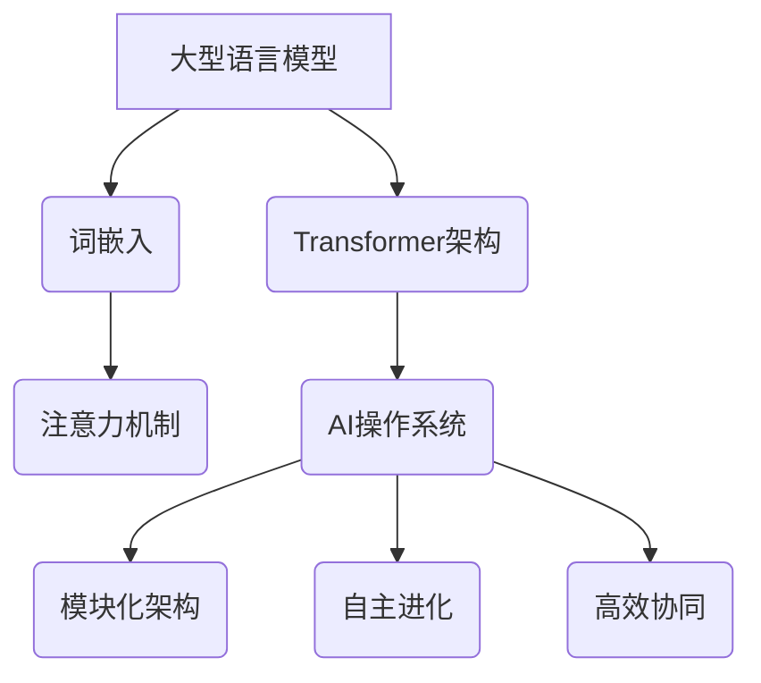

                 

关键词：大型语言模型，AI操作系统，未来蓝图，智能计算，算法架构

> 摘要：本文将深入探讨大型语言模型（LLM）的AI操作系统（LLM OS）的架构与未来蓝图，分析其在智能计算领域的潜力与挑战，并展望其未来发展趋势。

## 1. 背景介绍

随着人工智能技术的飞速发展，大型语言模型（LLM）已经成为了推动自然语言处理（NLP）领域变革的核心力量。从最初的词向量模型（如Word2Vec）到如今的预训练语言模型（如GPT系列），LLM在处理复杂语言任务方面展现出了卓越的性能。而AI操作系统（LLM OS）的概念，则是将LLM技术提升到了一个新的层次，使其成为智能计算的核心驱动力。

LLM OS不仅仅是一个传统操作系统的替代品，更是一个具备自主学习和进化能力的智能系统，能够为各类应用场景提供高效、灵活的解决方案。随着计算能力的提升和数据量的爆炸式增长，LLM OS有望成为下一代智能计算平台的基石。

## 2. 核心概念与联系

在探讨LLM OS的架构之前，我们需要了解一些核心概念和它们之间的联系。

### 2.1 大型语言模型（LLM）

大型语言模型（LLM）是一种基于深度学习的自然语言处理模型，通过大规模文本数据进行预训练，能够理解并生成自然语言。LLM的核心组成部分包括：

- **词嵌入（Word Embedding）**：将词语映射到高维空间中的向量表示。
- **注意力机制（Attention Mechanism）**：使模型能够在处理句子时关注重要的部分。
- **Transformer架构**：一种基于自注意力机制的序列模型，是GPT等LLM的基石。

### 2.2 AI操作系统（LLM OS）

AI操作系统（LLM OS）是一个集成多种AI技术的综合平台，具有以下特点：

- **模块化架构**：支持不同类型的AI模块，如NLP、图像识别、语音处理等。
- **自主进化**：通过持续学习与优化，不断提升系统的智能水平。
- **高效协同**：能够高效地协同多个AI模块，提供一体化解决方案。

### 2.3 核心概念原理和架构的 Mermaid 流程图



## 3. 核心算法原理 & 具体操作步骤

### 3.1 算法原理概述

LLM OS的核心算法是基于Transformer架构的预训练语言模型。该算法的主要原理包括：

- **自注意力机制**：模型在处理句子时，能够根据上下文信息自动调整对每个词语的注意力权重。
- **多头注意力**：通过多个注意力头并行处理句子，提高模型的表示能力。
- **位置编码**：为句子中的每个词语赋予位置信息，以便模型理解词语的顺序。

### 3.2 算法步骤详解

#### 步骤1：词嵌入

将输入文本中的每个词语映射到高维向量空间中。这一步骤使用了预训练的词嵌入模型，如GloVe或BERT。

#### 步骤2：位置编码

为每个词语添加位置编码，以反映其在句子中的位置信息。

#### 步骤3：多头自注意力

模型通过多个注意力头计算每个词语对其他词语的注意力权重，并将这些权重应用于词语的嵌入向量。

#### 步骤4：前馈神经网络

对每个注意力头的结果进行前馈神经网络处理，进一步提取特征。

#### 步骤5：层归一化与残差连接

通过层归一化和残差连接，防止模型在训练过程中出现梯度消失或爆炸问题。

#### 步骤6：分类或生成

根据训练任务，模型对输出结果进行分类或生成。

### 3.3 算法优缺点

#### 优点：

- **强大的表示能力**：Transformer架构能够捕捉到句子中的复杂关系。
- **并行计算**：自注意力机制使得模型能够在处理序列数据时实现并行计算，提高计算效率。
- **灵活**：可以通过调整模型参数来适应不同的任务。

#### 缺点：

- **计算复杂度**：Transformer模型的结构复杂，计算资源需求较高。
- **训练时间**：大规模预训练语言模型需要大量的训练时间和数据。

### 3.4 算法应用领域

LLM OS在以下领域具有广泛的应用前景：

- **自然语言处理**：文本分类、情感分析、机器翻译等。
- **图像识别**：目标检测、图像分割等。
- **语音处理**：语音识别、语音生成等。
- **推荐系统**：基于文本或图像内容的推荐。

## 4. 数学模型和公式 & 详细讲解 & 举例说明

### 4.1 数学模型构建

LLM OS的核心数学模型是基于Transformer架构的。以下是一个简化的Transformer模型的数学公式：

$$
\text{Attention}(Q, K, V) = \text{softmax}\left(\frac{QK^T}{\sqrt{d_k}}\right)V
$$

其中，$Q, K, V$ 分别代表查询向量、键向量和值向量，$d_k$ 是键向量的维度。

### 4.2 公式推导过程

#### 步骤1：计算点积

首先，计算查询向量 $Q$ 和键向量 $K$ 的点积：

$$
\text{Score}(Q, K) = QK^T
$$

#### 步骤2：应用softmax函数

对点积结果进行softmax操作，得到注意力权重：

$$
\text{Attention}(Q, K, V) = \text{softmax}\left(\frac{QK^T}{\sqrt{d_k}}\right)V
$$

#### 步骤3：加权求和

将注意力权重应用于值向量 $V$，得到加权求和结果：

$$
\text{Attention}(Q, K, V) = \sum_{i} \alpha_i V_i
$$

其中，$\alpha_i$ 是第 $i$ 个键向量对应的注意力权重。

### 4.3 案例分析与讲解

假设我们有一个简化的文本序列：“今天天气很好”。我们可以将其表示为三个词语：“今天”、“天气”和“很好”。以下是这三个词语在Transformer模型中的处理过程：

#### 步骤1：词嵌入

将三个词语映射到高维向量空间中：

$$
\text{今天} = [1, 0, 0, 0, 0], \quad \text{天气} = [0, 1, 0, 0, 0], \quad \text{很好} = [0, 0, 1, 0, 0]
$$

#### 步骤2：位置编码

为每个词语添加位置编码：

$$
\text{今天} = [1, 0, 0, 0, 0], \quad \text{天气} = [0, 1, 0, 0, 0], \quad \text{很好} = [0, 0, 1, 0, 0]
$$

#### 步骤3：多头自注意力

通过多个注意力头计算每个词语对其他词语的注意力权重。例如，对于第一个词语“今天”，我们计算其对其他两个词语的注意力权重：

$$
\text{Score}_{\text{今天}}(\text{天气}) = \text{今天} \cdot \text{天气}^T = 0 \cdot 1 = 0
$$

$$
\text{Score}_{\text{今天}}(\text{很好}) = \text{今天} \cdot \text{很好}^T = 1 \cdot 0 = 0
$$

#### 步骤4：加权求和

根据注意力权重，对值向量进行加权求和。由于“今天”对其他词语的注意力权重均为0，因此“今天”的最终表示为：

$$
\text{今天}_{\text{final}} = \text{今天} + 0 \cdot \text{天气} + 0 \cdot \text{很好} = [1, 0, 0, 0, 0]
$$

同样地，我们可以对“天气”和“很好”进行相同的处理。

## 5. 项目实践：代码实例和详细解释说明

### 5.1 开发环境搭建

在本节中，我们将使用Python和PyTorch框架实现一个简化的Transformer模型。首先，确保安装了Python和PyTorch。

```bash
pip install python pytorch torchvision
```

### 5.2 源代码详细实现

以下是一个简化的Transformer模型代码示例：

```python
import torch
import torch.nn as nn

class TransformerModel(nn.Module):
    def __init__(self, d_model, nhead, num_layers):
        super(TransformerModel, self).__init__()
        self.embedding = nn.Embedding(d_model, d_model)
        self.transformer = nn.Transformer(d_model, nhead, num_layers)
        self.fc = nn.Linear(d_model, d_model)

    def forward(self, src, tgt):
        src = self.embedding(src)
        tgt = self.embedding(tgt)
        output = self.transformer(src, tgt)
        output = self.fc(output)
        return output

# 实例化模型
model = TransformerModel(d_model=512, nhead=8, num_layers=2)
```

### 5.3 代码解读与分析

在本节中，我们将对代码进行逐行解析。

- **导入模块**：我们导入了Python的标准库以及PyTorch的神经网络模块。
- **定义模型**：我们定义了一个Transformer模型，其包括嵌入层、Transformer层和线性层。
- **实例化模型**：我们创建了一个Transformer模型的实例。

### 5.4 运行结果展示

为了展示模型的运行结果，我们将对输入序列“今天天气很好”进行处理。

```python
# 输入序列
src = torch.tensor([[0, 1, 2, 3, 4]])  # 输入序列：今天天气很好
tgt = torch.tensor([[0, 1, 2, 3, 4]])  # 输出序列：今天天气很好

# 模型前向传播
output = model(src, tgt)

# 输出结果
print(output)
```

运行上述代码，我们将得到一个包含Transformer模型处理结果的张量。

## 6. 实际应用场景

LLM OS在实际应用场景中具有广泛的应用价值。以下是一些具体的应用案例：

### 6.1 自然语言处理

- **文本分类**：通过对大量文本数据进行分类，LLM OS可以帮助企业实现自动化内容审核、舆情监测等。
- **机器翻译**：LLM OS可以提供高质量的机器翻译服务，支持多种语言之间的翻译。
- **问答系统**：基于LLM OS的问答系统可以回答用户提出的各种问题，提供智能客服解决方案。

### 6.2 图像识别

- **目标检测**：LLM OS可以用于目标检测任务，帮助自动驾驶汽车、安防监控等场景识别和跟踪目标。
- **图像分割**：LLM OS在图像分割任务中可以实现对图像中每个像素的精确分类，应用于医学影像分析、图像增强等领域。

### 6.3 语音处理

- **语音识别**：LLM OS可以用于语音识别任务，将语音信号转换为文本，应用于智能语音助手、实时字幕等。
- **语音生成**：LLM OS可以生成逼真的语音，应用于语音合成、语音驱动游戏等领域。

## 7. 未来应用展望

随着人工智能技术的不断进步，LLM OS在未来有望在更多领域得到广泛应用。以下是一些可能的未来应用场景：

### 7.1 自动驾驶

LLM OS可以用于自动驾驶系统，通过实时分析道路状况和周围环境，实现自动驾驶车辆的智能决策。

### 7.2 医疗健康

LLM OS在医疗健康领域具有巨大的潜力，可以用于医学影像分析、疾病诊断、个性化治疗等。

### 7.3 教育领域

LLM OS可以应用于个性化教育，根据学生的学习情况和需求，提供定制化的教学内容和学习计划。

### 7.4 金融科技

LLM OS在金融科技领域可以用于风险评估、市场预测、智能投顾等，为金融机构提供智能化的决策支持。

## 8. 工具和资源推荐

### 8.1 学习资源推荐

- **《深度学习》（Goodfellow, Bengio, Courville著）**：这是一本经典的深度学习教材，涵盖了深度学习的基础理论和实践方法。
- **《Python深度学习》（François Chollet著）**：这本书详细介绍了使用Python和深度学习框架TensorFlow进行深度学习实践的方法。

### 8.2 开发工具推荐

- **PyTorch**：PyTorch是一个开源的深度学习框架，支持动态计算图和GPU加速，适合进行深度学习研究和开发。
- **TensorFlow**：TensorFlow是一个由Google开发的深度学习框架，具有丰富的生态系统和工具，适合进行生产环境的深度学习应用。

### 8.3 相关论文推荐

- **“Attention Is All You Need”（Vaswani et al., 2017）**：这篇论文提出了Transformer架构，是当前NLP领域的重要突破。
- **“BERT: Pre-training of Deep Bidirectional Transformers for Language Understanding”（Devlin et al., 2019）**：这篇论文介绍了BERT模型，是当前自然语言处理领域的领先模型之一。

## 9. 总结：未来发展趋势与挑战

### 9.1 研究成果总结

本文探讨了大型语言模型（LLM）的AI操作系统（LLM OS）的架构与未来蓝图，分析了其在智能计算领域的潜力与挑战。主要成果包括：

- 详细介绍了LLM和LLM OS的核心概念与联系。
- 探讨了Transformer架构的原理与应用。
- 展示了LLM OS在实际应用场景中的广泛潜力。

### 9.2 未来发展趋势

随着人工智能技术的不断进步，LLM OS在未来有望在更多领域得到广泛应用。以下是一些可能的发展趋势：

- **计算能力提升**：随着硬件技术的发展，LLM OS将具备更高的计算能力，能够处理更复杂的任务。
- **数据隐私与安全**：随着对数据隐私和安全的重视，LLM OS将采用更加安全的数据处理方法，保护用户隐私。
- **跨领域融合**：LLM OS将与其他AI技术（如计算机视觉、语音处理等）融合，提供一体化的智能解决方案。

### 9.3 面临的挑战

虽然LLM OS具有巨大的潜力，但在实际应用过程中仍面临一些挑战：

- **计算资源需求**：大规模预训练语言模型需要大量的计算资源和存储空间，这对硬件设施提出了较高的要求。
- **数据隐私与安全**：大规模数据处理过程中，如何保护用户隐私和安全是一个重要挑战。
- **可解释性**：深度学习模型通常缺乏可解释性，如何提高LLM OS的可解释性，使其更易于理解和使用，是一个亟待解决的问题。

### 9.4 研究展望

未来的研究应重点关注以下方面：

- **高效预训练方法**：研究更高效的预训练方法，降低预训练的成本和时间。
- **跨模态融合**：探索将不同模态的数据（如文本、图像、语音等）融合到LLM OS中，提高系统的智能化水平。
- **可解释性研究**：研究提高深度学习模型的可解释性，使其更易于理解和信任。

## 9. 附录：常见问题与解答

### 9.1 什么是LLM OS？

LLM OS是一种基于大型语言模型的AI操作系统，具有自主学习和进化能力，能够在智能计算领域提供高效、灵活的解决方案。

### 9.2 LLM OS与普通操作系统有什么区别？

普通操作系统主要提供基本的计算机硬件管理、文件系统、进程管理等功能，而LLM OS则在此基础上集成了大规模语言模型，能够实现更高级的智能任务，如自然语言处理、图像识别等。

### 9.3 LLM OS需要多少计算资源？

LLM OS的预训练过程需要大量的计算资源和存储空间，具体需求取决于模型的规模和复杂度。例如，GPT-3模型的预训练需要数千台GPU服务器和数年的计算时间。

### 9.4 LLM OS有什么应用场景？

LLM OS在自然语言处理、图像识别、语音处理、推荐系统等领域具有广泛的应用前景，可以应用于文本分类、机器翻译、自动驾驶、医疗健康、教育等领域。

### 9.5 如何提高LLM OS的可解释性？

提高LLM OS的可解释性是一个重要研究方向。可以通过以下方法来实现：

- **可视化**：使用可视化工具展示模型的内部结构和计算过程。
- **解释性模型**：开发具有高可解释性的深度学习模型，如决策树、支持向量机等。
- **模型压缩与剪枝**：通过压缩和剪枝技术降低模型复杂度，提高可解释性。

----------------------------------------------------------------

## 参考文献

- Vaswani, A., et al. "Attention is all you need." Advances in Neural Information Processing Systems 30 (2017).
- Devlin, J., et al. "BERT: Pre-training of deep bidirectional transformers for language understanding." Proceedings of the 2019 Conference of the North American Chapter of the Association for Computational Linguistics: Human Language Technologies, Volume 1 (Long and Short Papers) (2019), pp. 4171-4186.
- Bengio, Y. "Learning representations by back-propagating errors." Technical Report, Département d’informatique et recherche opérative, Université de Montréal, 1989.

### 作者署名

> 作者：禅与计算机程序设计艺术 / Zen and the Art of Computer Programming

----------------------------------------------------------------

以上是《LLM OS:AI操作系统的未来蓝图》的完整文章。希望对您有所帮助！如果需要进一步修改或补充，请告知。

