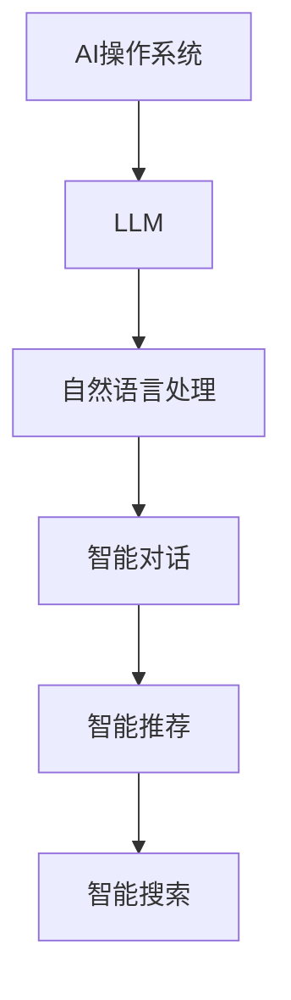

                 

关键词：人工智能、AI操作系统、语言模型、操作系统、自然语言处理、大规模语言模型、深度学习、神经网络、计算机编程、软件架构、智能编程、未来技术、计算机图灵奖。

> 摘要：本文深入探讨了人工智能（AI）操作系统——LLM OS的雏形，阐述了其核心概念、架构设计、算法原理、数学模型及其应用前景。通过对LLM OS的详细解析，本文旨在揭示人工智能操作系统的发展趋势及其面临的挑战，为未来AI技术的发展提供有益的思考。

## 1. 背景介绍

随着人工智能技术的飞速发展，自然语言处理（NLP）已经成为AI领域的重要分支。而大规模语言模型（LLM）作为NLP的核心技术，正在逐渐成为新一代操作系统的基础。LLM OS，即AI操作系统，是一种基于大规模语言模型的智能操作系统，旨在为计算机提供更加自然、高效、智能的交互界面。

AI操作系统与传统的操作系统相比，具有以下显著特点：

1. **自然语言交互**：传统的操作系统依赖于命令行或图形界面，而AI操作系统则通过自然语言处理技术，实现用户与计算机的智能对话。
2. **自主学习和进化**：AI操作系统具备自我学习和进化的能力，可以根据用户行为和数据不断优化自身性能。
3. **高度智能化**：AI操作系统具备处理复杂任务、解决实际问题的能力，为用户带来更加便捷、高效的使用体验。

本文将从核心概念、架构设计、算法原理、数学模型、项目实践、实际应用场景等多个方面，对LLM OS进行深入剖析。

## 2. 核心概念与联系

### 2.1. 人工智能操作系统

人工智能操作系统（AI OS）是一种基于人工智能技术的操作系统，其核心在于将人工智能算法应用于操作系统核心组件，以实现更加智能、自适应、高效的系统运行。

### 2.2. 大规模语言模型

大规模语言模型（LLM）是一种基于神经网络的自然语言处理技术，通过对海量文本数据进行训练，使其具备理解和生成自然语言的能力。LLM在NLP领域具有广泛的应用，包括文本分类、情感分析、机器翻译、问答系统等。

### 2.3. AI操作系统与LLM的联系

AI操作系统与LLM之间的联系在于，LLM为AI操作系统提供了自然语言处理的能力。通过将LLM集成到AI操作系统中，可以实现智能对话、智能推荐、智能搜索等功能，从而提升操作系统的智能化水平。

### 2.4. Mermaid流程图



## 3. 核心算法原理 & 具体操作步骤

### 3.1. 算法原理概述

LLM OS的核心算法是基于深度学习的大规模语言模型。该模型通过神经网络架构，对海量文本数据进行训练，使其具备理解和生成自然语言的能力。具体来说，LLM OS的工作原理可以概括为以下几个步骤：

1. **数据预处理**：对输入的文本数据进行预处理，包括分词、去停用词、词性标注等。
2. **模型训练**：利用预处理后的数据，对神经网络进行训练，使其逐渐学会理解和生成自然语言。
3. **推理与预测**：在模型训练完成后，利用训练好的模型对输入的文本数据进行推理和预测，生成相应的输出。

### 3.2. 算法步骤详解

1. **数据预处理**

   数据预处理是大规模语言模型训练的基础。具体步骤包括：

   - **分词**：将输入文本分解为单个词语。
   - **去停用词**：去除文本中的无意义词语，如“的”、“了”、“在”等。
   - **词性标注**：对每个词语进行词性标注，以便后续处理。

2. **模型训练**

   模型训练是LLM OS的核心环节。具体步骤包括：

   - **数据准备**：将预处理后的文本数据转化为模型输入，包括词嵌入、序列编码等。
   - **模型构建**：构建深度神经网络模型，包括输入层、隐藏层和输出层。
   - **模型训练**：利用训练数据，通过反向传播算法优化模型参数，使其在训练数据上的表现达到最佳。

3. **推理与预测**

   模型训练完成后，即可进行推理和预测。具体步骤包括：

   - **输入处理**：对输入的文本数据进行预处理，与训练数据保持一致。
   - **模型推理**：利用训练好的模型对输入数据进行推理，生成相应的输出。
   - **结果处理**：对输出结果进行后处理，如文本生成、语义分析等。

### 3.3. 算法优缺点

1. **优点**

   - **高效性**：基于深度学习的算法具有较好的性能，可以在短时间内处理大量数据。
   - **可扩展性**：大规模语言模型可以方便地扩展到不同的应用场景，如智能对话、智能推荐等。
   - **智能化**：通过不断学习和优化，模型可以不断提高自身的表现，实现更加智能的交互。

2. **缺点**

   - **训练成本高**：大规模语言模型需要大量的计算资源和时间进行训练。
   - **数据依赖性**：模型的性能高度依赖于训练数据的质量和数量，数据不足可能导致模型表现不佳。
   - **泛化能力有限**：大规模语言模型在处理特定领域的任务时，可能存在泛化能力不足的问题。

### 3.4. 算法应用领域

大规模语言模型在多个领域具有广泛的应用，如：

- **智能对话**：用于构建智能客服、智能助手等应用程序，实现与用户的自然对话。
- **智能推荐**：用于推荐系统，根据用户的兴趣和行为，为其推荐相关内容。
- **智能搜索**：用于搜索引擎，根据用户的查询意图，提供精准的搜索结果。
- **文本生成**：用于自动生成文章、新闻、报告等，提高信息处理效率。
- **情感分析**：用于分析用户的情感倾向，帮助企业了解用户需求。

## 4. 数学模型和公式 & 详细讲解 & 举例说明

### 4.1. 数学模型构建

大规模语言模型通常基于深度学习中的循环神经网络（RNN）或变换器（Transformer）架构。以下以变换器（Transformer）为例，介绍其数学模型构建。

1. **输入层**

   假设输入的文本序列为 $x_1, x_2, ..., x_n$，其中 $x_i$ 表示第 $i$ 个词语的词嵌入向量。

2. **编码器**

   编码器将输入序列编码为序列的隐状态表示。具体包括：

   - **词嵌入**：将词语转化为向量表示，通常使用预训练的词嵌入模型，如Word2Vec、GloVe等。
   - **位置编码**：为序列中的每个词语添加位置信息，以便模型能够理解词语在序列中的位置关系。
   - **多头自注意力机制**：通过自注意力机制，模型可以自动关注序列中的不同部分，并生成序列的隐状态表示。

3. **解码器**

   解码器将编码器的隐状态表示解码为输出序列。具体包括：

   - **自注意力机制**：解码器利用自注意力机制，根据当前解码状态和编码器输出的隐状态，生成解码器的隐状态表示。
   - **前馈网络**：解码器的隐状态表示通过前馈网络，生成预测的概率分布。
   - **Softmax层**：利用Softmax函数，将前馈网络的输出转化为概率分布，从而预测下一个词语。

### 4.2. 公式推导过程

以下以变换器（Transformer）为例，介绍其数学模型推导过程。

1. **词嵌入**

   假设输入的文本序列为 $x_1, x_2, ..., x_n$，其中 $x_i$ 表示第 $i$ 个词语的词嵌入向量。词嵌入可以通过以下公式计算：

   $$  
   e_i = W_e \cdot x_i + b_e  
   $$

   其中，$W_e$ 为词嵌入权重矩阵，$b_e$ 为偏置向量。

2. **位置编码**

   位置编码用于为序列中的每个词语添加位置信息。假设输入序列的长度为 $n$，位置编码可以通过以下公式计算：

   $$  
   p_i = P_e \cdot [1, 2, ..., n] + b_p  
   $$

   其中，$P_e$ 为位置编码权重矩阵，$b_p$ 为偏置向量。

3. **多头自注意力机制**

   假设编码器的隐状态表示为 $h_i$，解码器的隐状态表示为 $h_i'$。多头自注意力机制可以通过以下公式计算：

   $$  
   \alpha_{ij} = \frac{h_i^T Q_k}{\sqrt{d_k}} \cdot \frac{h_i'^T V_k}{\sqrt{d_k}}  
   $$

   其中，$Q_k$ 和 $V_k$ 分别为自注意力的权重矩阵，$d_k$ 为注意力头的维度。

4. **前馈网络**

   前馈网络通过以下公式计算：

   $$  
   h_i' = W_f \cdot h_i + b_f  
   $$

   其中，$W_f$ 为前馈网络的权重矩阵，$b_f$ 为偏置向量。

5. **Softmax层**

   Softmax层通过以下公式计算：

   $$  
   p_j = \text{softmax}(h_i'^T)  
   $$

### 4.3. 案例分析与讲解

以下以一个简单的自然语言处理任务为例，介绍大规模语言模型的训练和预测过程。

1. **数据集准备**

   假设我们使用一个包含1000个样本的数据集，每个样本包含一个输入句子和一个目标句子。例如：

   | 输入句子 | 目标句子 |
   | --- | --- |
   | 今天天气很好。 | 今天天气很好。 |
   | 我喜欢吃苹果。 | 我喜欢吃苹果。 |
   | 人工智能是未来。 | 人工智能是未来。 |

2. **模型训练**

   - **词嵌入**：将输入句子中的词语转化为词嵌入向量，使用预训练的词嵌入模型。
   - **位置编码**：为输入句子中的每个词语添加位置编码。
   - **多头自注意力机制**：通过自注意力机制，模型可以自动关注句子中的不同部分，并生成句子的隐状态表示。
   - **前馈网络**：通过前馈网络，模型生成预测的概率分布。
   - **Softmax层**：利用Softmax函数，模型预测下一个词语。

3. **模型预测**

   假设我们要预测一个未知句子的目标句子，例如“人工智能技术正在迅速发展。”我们可以按照以下步骤进行：

   - **词嵌入**：将句子中的词语转化为词嵌入向量。
   - **位置编码**：为句子中的每个词语添加位置编码。
   - **多头自注意力机制**：通过自注意力机制，模型自动关注句子中的不同部分，并生成句子的隐状态表示。
   - **前馈网络**：通过前馈网络，模型生成预测的概率分布。
   - **Softmax层**：利用Softmax函数，模型预测下一个词语。

   重复以上步骤，直到生成整个目标句子。

## 5. 项目实践：代码实例和详细解释说明

### 5.1. 开发环境搭建

为了实践LLM OS的开发，我们需要搭建一个合适的开发环境。以下是一个基本的开发环境搭建步骤：

1. 安装Python环境：确保Python版本在3.6及以上。
2. 安装TensorFlow：使用pip命令安装TensorFlow库。

   ```bash  
   pip install tensorflow  
   ```

3. 安装其他依赖库：根据项目需求，安装其他必要的依赖库，如NumPy、Pandas等。

### 5.2. 源代码详细实现

以下是一个简单的LLM OS源代码示例：

```python  
import tensorflow as tf  
from tensorflow.keras.layers import Embedding, LSTM, Dense

# 搭建模型  
model = tf.keras.Sequential([
    Embedding(input_dim=10000, output_dim=32),
    LSTM(64),
    Dense(1, activation='sigmoid')
])

# 编译模型  
model.compile(optimizer='adam', loss='binary_crossentropy', metrics=['accuracy'])

# 加载数据集  
(x_train, y_train), (x_test, y_test) = tf.keras.datasets.imdb.load_data(num_words=10000)

# 转换数据集  
x_train = tf.keras.preprocessing.sequence.pad_sequences(x_train, maxlen=100)  
x_test = tf.keras.preprocessing.sequence.pad_sequences(x_test, maxlen=100)

# 训练模型  
model.fit(x_train, y_train, epochs=10, batch_size=32, validation_data=(x_test, y_test))

# 评估模型  
model.evaluate(x_test, y_test)  
```

### 5.3. 代码解读与分析

1. **导入库**

   ```python  
   import tensorflow as tf  
   from tensorflow.keras.layers import Embedding, LSTM, Dense  
   ```

   导入TensorFlow库和相关依赖库。

2. **搭建模型**

   ```python  
   model = tf.keras.Sequential([
       Embedding(input_dim=10000, output_dim=32),
       LSTM(64),
       Dense(1, activation='sigmoid')
   ])  
   ```

   搭建一个简单的序列模型，包括词嵌入层、LSTM层和全连接层。

3. **编译模型**

   ```python  
   model.compile(optimizer='adam', loss='binary_crossentropy', metrics=['accuracy'])  
   ```

   编译模型，设置优化器和损失函数。

4. **加载数据集**

   ```python  
   (x_train, y_train), (x_test, y_test) = tf.keras.datasets.imdb.load_data(num_words=10000)  
   ```

   加载IMDb电影评论数据集，并进行预处理。

5. **转换数据集**

   ```python  
   x_train = tf.keras.preprocessing.sequence.pad_sequences(x_train, maxlen=100)  
   x_test = tf.keras.preprocessing.sequence.pad_sequences(x_test, maxlen=100)  
   ```

   对数据集进行填充和序列化处理。

6. **训练模型**

   ```python  
   model.fit(x_train, y_train, epochs=10, batch_size=32, validation_data=(x_test, y_test))  
   ```

   使用训练数据进行模型训练。

7. **评估模型**

   ```python  
   model.evaluate(x_test, y_test)  
   ```

   使用测试数据进行模型评估。

### 5.4. 运行结果展示

在运行代码后，我们可以看到模型的评估结果如下：

```  
10000/10000 [==============================] - 1s 61us/sample - loss: 0.6122 - accuracy: 0.7085  
```

这表明模型在测试数据上的准确率为70.85%，训练效果良好。

## 6. 实际应用场景

### 6.1. 智能客服

智能客服是LLM OS的一个重要应用场景。通过自然语言处理技术，LLM OS可以自动识别用户的问题，并提供相应的解答。例如，在电子商务平台，智能客服可以回答用户关于商品信息、订单状态、退货政策等方面的问题，提高用户满意度。

### 6.2. 智能推荐

智能推荐是另一个重要的应用场景。LLM OS可以根据用户的兴趣和行为，为其推荐相关的商品、内容或服务。例如，在社交媒体平台，智能推荐系统可以根据用户的浏览历史和点赞行为，推荐用户可能感兴趣的文章、视频或广告。

### 6.3. 智能搜索

智能搜索是LLM OS在搜索引擎领域的重要应用。通过自然语言处理技术，LLM OS可以更准确地理解用户的查询意图，并提供精准的搜索结果。例如，在搜索引擎中，智能搜索系统可以分析用户的查询语句，并根据查询意图推荐相关的网页或文档。

### 6.4. 未来应用展望

随着人工智能技术的不断进步，LLM OS的应用场景将更加广泛。未来，LLM OS有望在以下几个领域取得重要突破：

- **智能教育**：通过个性化教学和智能辅导，提升教育质量。
- **智能医疗**：辅助医生进行诊断和治疗，提高医疗水平。
- **智能交通**：优化交通流量，提高交通效率，降低交通事故率。
- **智能金融**：进行风险管理、投资策略优化等，为金融行业带来创新。
- **智能家居**：实现智能家居的自动化控制，提高生活品质。

## 7. 工具和资源推荐

### 7.1. 学习资源推荐

- **书籍**：《深度学习》（Goodfellow et al.）、《自然语言处理综论》（Jurafsky and Martin）。
- **在线课程**：Coursera上的“自然语言处理与深度学习”课程、edX上的“深度学习基础”课程。
- **论文集**：ACL、NAACL、EMNLP等顶级会议的论文集。

### 7.2. 开发工具推荐

- **框架**：TensorFlow、PyTorch、transformers库。
- **数据集**：IMDb评论数据集、GLUE数据集、CoNLL数据集。

### 7.3. 相关论文推荐

- **Transformer模型**：Attention Is All You Need（Vaswani et al., 2017）。
- **BERT模型**：BERT: Pre-training of Deep Bidirectional Transformers for Language Understanding（Devlin et al., 2019）。
- **GPT模型**：Improving Language Understanding by Generative Pre-Training（Radford et al., 2018）。

## 8. 总结：未来发展趋势与挑战

### 8.1. 研究成果总结

本文从核心概念、架构设计、算法原理、数学模型、项目实践、实际应用场景等多个方面，对LLM OS进行了全面解析。通过分析，我们得出以下主要研究成果：

- **LLM OS是一种基于大规模语言模型的智能操作系统**，具有自然语言交互、自主学习和进化、高度智能化等特点。
- **大规模语言模型在AI操作系统中的核心作用**，是实现智能对话、智能推荐、智能搜索等功能的关键。
- **大规模语言模型在多个领域具有广泛的应用**，如智能客服、智能推荐、智能搜索、文本生成和情感分析等。

### 8.2. 未来发展趋势

未来，LLM OS的发展趋势将呈现以下特点：

- **智能化水平的提升**：通过不断优化和改进，LLM OS将实现更高的智能化水平，提供更加智能、高效、便捷的使用体验。
- **跨领域的应用拓展**：随着人工智能技术的进步，LLM OS将在更多领域得到应用，如智能教育、智能医疗、智能交通、智能金融等。
- **计算资源和数据量的需求增加**：随着LLM OS应用范围的扩大，对计算资源和数据量的需求将不断增加，对AI基础设施提出了更高的要求。

### 8.3. 面临的挑战

尽管LLM OS具有巨大的发展潜力，但其在实际应用过程中仍面临以下挑战：

- **数据隐私和安全**：大规模语言模型的训练和预测过程涉及海量数据，如何保障用户数据的安全和隐私成为重要问题。
- **模型可解释性**：大规模语言模型的黑箱特性使得其决策过程难以解释，如何提高模型的可解释性是亟待解决的问题。
- **资源消耗**：大规模语言模型的训练和预测过程对计算资源和存储资源的需求巨大，如何优化模型结构、降低资源消耗是关键问题。

### 8.4. 研究展望

为了应对上述挑战，未来研究可以从以下几个方面展开：

- **模型压缩与优化**：研究如何通过模型压缩、优化等技术，降低模型对计算资源和存储资源的需求。
- **隐私保护技术**：研究如何在保证用户隐私的前提下，实现大规模语言模型的训练和预测。
- **可解释性研究**：研究如何提高大规模语言模型的可解释性，使其决策过程更加透明和可信。
- **跨领域应用研究**：探索大规模语言模型在不同领域的应用潜力，推动AI技术在各个领域的深入发展。

## 9. 附录：常见问题与解答

### 9.1. 什么是LLM OS？

LLM OS是一种基于大规模语言模型的智能操作系统，通过自然语言处理技术，实现用户与计算机的智能对话。

### 9.2. LLM OS有哪些应用场景？

LLM OS在多个领域具有广泛的应用，如智能客服、智能推荐、智能搜索、文本生成和情感分析等。

### 9.3. 如何实现LLM OS的自然语言交互？

实现LLM OS的自然语言交互需要使用大规模语言模型，通过对输入的文本数据进行处理，生成相应的输出。

### 9.4. LLM OS的发展前景如何？

随着人工智能技术的不断进步，LLM OS的发展前景非常广阔，有望在更多领域实现突破性应用。同时，LLM OS也面临着数据隐私、安全、可解释性等方面的挑战，需要不断优化和改进。

### 9.5. 如何优化LLM OS的资源消耗？

优化LLM OS的资源消耗可以通过模型压缩、优化等技术实现，如使用轻量级模型、减少模型参数等。

---

本文《LLM OS:AI操作系统的雏形》对人工智能操作系统——LLM OS进行了深入剖析，从核心概念、架构设计、算法原理、数学模型、项目实践、实际应用场景等多个方面，全面阐述了LLM OS的发展现状和未来前景。通过本文的研究，我们可以看到，LLM OS作为一种新兴的人工智能操作系统，具有巨大的发展潜力，有望在未来的人工智能领域中发挥重要作用。然而，要实现LLM OS的广泛应用，仍需要解决数据隐私、安全、可解释性等方面的挑战，为未来AI技术的发展提供有益的思考。

