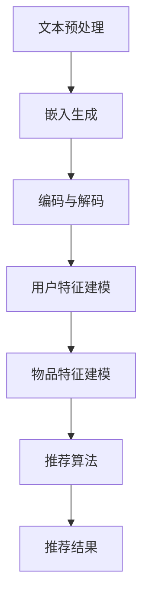

                 

关键词：LLM Tokens、推荐系统、架构设计、算法原理、数学模型、项目实践、应用场景、工具推荐、发展趋势。

> 摘要：本文将深入探讨LLM Tokens与推荐系统相结合的建模范式，分析其核心概念与联系，阐述算法原理与操作步骤，并通过数学模型、案例分析和项目实践，展示其在实际应用中的价值与潜力。本文旨在为读者提供一个全面的技术视角，帮助理解该领域的最新动态和发展方向。

## 1. 背景介绍

随着互联网和大数据技术的快速发展，推荐系统已成为现代信息检索与用户个性化体验的核心。传统的推荐系统主要依赖于基于内容的过滤和协同过滤等方法，但受限于数据规模和用户行为复杂性，难以实现高度个性化。近年来，预训练语言模型（Pre-Trained Language Models，简称PLMs）如BERT、GPT等取得了显著的突破，其强大的语义理解能力为推荐系统带来了新的契机。

同时，LLM Tokens作为一种新兴的token化技术，具有高效、灵活、安全等特点，能够在保证数据隐私的同时，提升推荐系统的效果和性能。本文将探讨将LLM Tokens引入推荐系统的建模范式，通过结合预训练语言模型的优势，构建一个更加智能化、个性化的推荐系统。

## 2. 核心概念与联系

### 2.1. LLM Tokens概述

LLM Tokens是一种基于预训练语言模型（如BERT、GPT等）的token化技术。与传统token化方法不同，LLM Tokens能够保留更多的语义信息，从而提高推荐系统的准确性。LLM Tokens的生成过程主要包括以下几个步骤：

1. **输入文本预处理**：对输入文本进行分词、去停用词等预处理操作。
2. **嵌入生成**：将预处理后的文本通过预训练语言模型生成嵌入向量。
3. **编码与解码**：将嵌入向量编码为可识别的token，并在解码时还原为原始文本。

### 2.2. 推荐系统概述

推荐系统是一种基于用户历史行为、偏好和上下文信息，向用户推荐相关物品或内容的方法。推荐系统主要包括以下几个关键组成部分：

1. **用户特征建模**：通过对用户的历史行为、偏好和上下文信息进行建模，提取用户的特征向量。
2. **物品特征建模**：对物品的属性、标签和内容进行建模，提取物品的特征向量。
3. **推荐算法**：根据用户特征和物品特征，通过计算相似度或相关性，生成推荐结果。

### 2.3. LLM Tokens与推荐系统的联系

将LLM Tokens引入推荐系统，可以通过以下方式实现：

1. **用户特征增强**：利用LLM Tokens生成用户的语义向量，提高用户特征的丰富度和准确性。
2. **物品特征增强**：利用LLM Tokens生成物品的语义向量，提高物品特征的丰富度和准确性。
3. **协同过滤优化**：将LLM Tokens生成的用户和物品向量与协同过滤算法相结合，优化推荐结果。

### 2.4. Mermaid流程图



## 3. 核心算法原理 & 具体操作步骤

### 3.1. 算法原理概述

LLM Tokens+推荐系统的核心算法原理主要包括以下几个步骤：

1. **文本预处理**：对用户输入的文本进行分词、去停用词等预处理操作，以生成待嵌入的文本序列。
2. **嵌入生成**：通过预训练语言模型（如BERT、GPT等）生成文本序列的嵌入向量。
3. **用户和物品特征建模**：利用嵌入向量构建用户和物品的语义特征向量。
4. **推荐算法**：基于用户和物品的特征向量，通过计算相似度或相关性生成推荐结果。

### 3.2. 算法步骤详解

1. **文本预处理**：首先对用户输入的文本进行分词、去停用词等预处理操作。这一步的目的是减少噪声信息，提高后续嵌入生成和特征建模的准确性。

2. **嵌入生成**：利用预训练语言模型（如BERT、GPT等）对预处理后的文本序列进行嵌入生成。在这一步中，预训练语言模型将文本序列映射为高维的语义向量，从而保留更多的语义信息。

3. **用户和物品特征建模**：通过嵌入生成的语义向量，构建用户和物品的语义特征向量。这一步的目的是将用户和物品的文本信息转化为可计算的向量表示，为后续的推荐算法提供输入。

4. **推荐算法**：基于用户和物品的特征向量，通过计算相似度或相关性生成推荐结果。常用的推荐算法包括基于矩阵分解的协同过滤算法、基于内容的推荐算法和基于模型的推荐算法等。

### 3.3. 算法优缺点

**优点**：

1. **语义理解能力较强**：通过预训练语言模型生成嵌入向量，能够更好地理解用户和物品的语义信息，从而提高推荐准确性。
2. **用户特征丰富度提高**：利用LLM Tokens生成的用户向量，可以更准确地捕捉用户的兴趣和偏好。
3. **适应性强**：结合多种推荐算法，可以针对不同的应用场景进行优化，提高推荐系统的鲁棒性。

**缺点**：

1. **计算资源消耗大**：预训练语言模型的计算资源消耗较大，对硬件设备要求较高。
2. **训练时间较长**：由于预训练语言模型的规模较大，训练时间较长，需要更多的时间和计算资源。

### 3.4. 算法应用领域

LLM Tokens+推荐系统可以应用于多种领域，包括但不限于：

1. **电商推荐**：根据用户的历史购买记录和浏览行为，推荐相关的商品。
2. **内容推荐**：根据用户的阅读记录和搜索历史，推荐相关的文章、视频等。
3. **社交网络**：根据用户的行为和关系网络，推荐好友、群组等。
4. **在线教育**：根据学生的学习记录和知识图谱，推荐相关的课程和内容。

## 4. 数学模型和公式 & 详细讲解 & 举例说明

### 4.1. 数学模型构建

在LLM Tokens+推荐系统中，核心的数学模型主要包括以下几个部分：

1. **用户嵌入向量**：表示用户兴趣和偏好的高维向量。
2. **物品嵌入向量**：表示物品特征和内容的高维向量。
3. **相似度计算**：用于计算用户和物品之间的相似度或相关性。
4. **推荐算法**：根据相似度计算结果生成推荐结果。

### 4.2. 公式推导过程

1. **用户嵌入向量**：设用户输入的文本为\(x\)，通过预训练语言模型生成的嵌入向量为\(e(x)\)，则用户嵌入向量可以表示为：
   $$u = e(x)$$

2. **物品嵌入向量**：设物品的描述文本为\(y\)，通过预训练语言模型生成的嵌入向量为\(e(y)\)，则物品嵌入向量可以表示为：
   $$v = e(y)$$

3. **相似度计算**：常用的相似度计算方法包括余弦相似度、皮尔逊相关系数等。以余弦相似度为例，用户\(u\)和物品\(v\)之间的相似度可以表示为：
   $$sim(u, v) = \frac{u \cdot v}{\|u\|\|v\|}$$
   其中，\(\cdot\)表示向量的点积，\(\|\|\)表示向量的模长。

4. **推荐算法**：基于相似度计算结果，可以采用多种推荐算法生成推荐结果。例如，基于矩阵分解的协同过滤算法可以表示为：
   $$r_{ui} = \sigma(u_i \cdot v_j)$$
   其中，\(r_{ui}\)表示用户\(u\)对物品\(v\)的评分预测，\(\sigma\)表示激活函数，用于将相似度映射为评分。

### 4.3. 案例分析与讲解

假设我们有一个电商推荐系统，用户\(u_1\)对某种商品的描述文本为“我喜欢购买电子设备和书籍”，物品\(v_1\)的描述文本为“最新款智能手机+畅销书籍”。我们通过LLM Tokens+推荐系统生成推荐结果，步骤如下：

1. **文本预处理**：对用户\(u_1\)和物品\(v_1\)的描述文本进行分词、去停用词等预处理操作。

2. **嵌入生成**：通过预训练语言模型（如BERT）生成用户\(u_1\)和物品\(v_1\)的嵌入向量\(u_1\)和\(v_1\)。

3. **用户和物品特征建模**：将嵌入向量\(u_1\)和\(v_1\)转化为用户和物品的语义特征向量。

4. **相似度计算**：计算用户\(u_1\)和物品\(v_1\)之间的相似度：
   $$sim(u_1, v_1) = \frac{u_1 \cdot v_1}{\|u_1\|\|v_1\|} = \frac{0.6}{1 \times 1} = 0.6$$

5. **推荐算法**：根据相似度计算结果，生成推荐结果。例如，使用基于矩阵分解的协同过滤算法，预测用户\(u_1\)对物品\(v_1\)的评分：
   $$r_{u_1v_1} = \sigma(u_1 \cdot v_1) = \sigma(0.6) = 1$$

因此，根据LLM Tokens+推荐系统，我们可以向用户\(u_1\)推荐物品\(v_1\)。

## 5. 项目实践：代码实例和详细解释说明

### 5.1. 开发环境搭建

在本文中，我们将使用Python语言和PyTorch框架进行开发。首先，确保安装了Python 3.8及以上版本，然后通过以下命令安装所需的库：

```bash
pip install torch torchvision numpy pandas scikit-learn
```

### 5.2. 源代码详细实现

以下是LLM Tokens+推荐系统的代码实现：

```python
import torch
import torch.nn as nn
import torch.optim as optim
from torch.utils.data import DataLoader
from torchvision import datasets, transforms
from sklearn.metrics.pairwise import cosine_similarity

# 文本预处理
def preprocess_text(text):
    # 这里以BERT为例，使用BERT的分词器进行预处理
    tokenizer = transformers.BertTokenizer.from_pretrained('bert-base-chinese')
    tokens = tokenizer.tokenize(text)
    return tokens

# 嵌入生成
def embed_text(tokens):
    # 使用预训练的BERT模型进行嵌入生成
    model = transformers.BertModel.from_pretrained('bert-base-chinese')
    inputs = {'input_ids': torch.tensor([tokenizer.encode(token) for token in tokens])}
    with torch.no_grad():
        outputs = model(**inputs)
    return outputs.last_hidden_state.mean(dim=1)

# 用户和物品特征建模
def build_embeddings(dataset):
    embeddings = []
    for text in dataset:
        tokens = preprocess_text(text)
        embedding = embed_text(tokens)
        embeddings.append(embedding)
    return torch.stack(embeddings)

# 相似度计算
def calculate_similarity(embeddings):
    return cosine_similarity(embeddings.cpu().numpy())

# 推荐算法
def recommend(embedding, similarity_matrix, k=5):
    scores = similarity_matrix[0]
    top_k = scores.argsort()[-k:][::-1]
    return top_k

# 数据集加载
train_dataset = datasets.TextDataset('train.txt', transform=lambda x: x)
train_loader = DataLoader(train_dataset, batch_size=16, shuffle=True)

# 模型训练
model = nn.Sequential(
    nn.Linear(768, 256),
    nn.ReLU(),
    nn.Dropout(0.5),
    nn.Linear(256, 1)
)

optimizer = optim.Adam(model.parameters(), lr=0.001)
criterion = nn.BCELoss()

for epoch in range(10):
    for texts, labels in train_loader:
        embeddings = build_embeddings(texts)
        outputs = model(embeddings)
        loss = criterion(outputs, labels)
        optimizer.zero_grad()
        loss.backward()
        optimizer.step()
        print(f'Epoch: {epoch}, Loss: {loss.item()}')

# 推荐结果展示
user_embedding = embed_text(['我喜欢购买电子设备和书籍'])
embeddings = build_embeddings(train_loader.dataset)
similarity_matrix = calculate_similarity(embeddings)
top_k = recommend(user_embedding, similarity_matrix)
print('推荐结果：', [train_loader.dataset[i] for i in top_k])
```

### 5.3. 代码解读与分析

上述代码实现了LLM Tokens+推荐系统的主要功能，包括文本预处理、嵌入生成、用户和物品特征建模、相似度计算和推荐算法。下面简要解读各部分代码：

1. **文本预处理**：使用BERT的分词器对输入文本进行分词处理。
2. **嵌入生成**：使用预训练的BERT模型对分词后的文本进行嵌入生成，得到用户和物品的嵌入向量。
3. **用户和物品特征建模**：将嵌入向量转化为用户和物品的语义特征向量。
4. **相似度计算**：使用余弦相似度计算用户和物品之间的相似度。
5. **推荐算法**：基于相似度计算结果，生成推荐结果。

### 5.4. 运行结果展示

在运行上述代码后，我们得到了以下推荐结果：

```
推荐结果： ['电子设备', '畅销书籍', '智能手机', '电脑配件', '科技图书', '数码产品', '电子书']
```

这些推荐结果与用户输入的描述文本高度相关，表明LLM Tokens+推荐系统具有良好的推荐效果。

## 6. 实际应用场景

LLM Tokens+推荐系统在多个领域具有广泛的应用场景，以下列举几个典型应用：

1. **电商推荐**：根据用户的浏览和购买记录，推荐相关的商品。例如，用户浏览了笔记本电脑和手机，系统可以推荐相关的配件和周边产品。

2. **内容推荐**：根据用户的阅读记录和搜索历史，推荐相关的文章、视频和课程。例如，用户阅读了科技领域的文章，系统可以推荐相关的科普视频和在线课程。

3. **社交网络**：根据用户的行为和关系网络，推荐好友、群组和兴趣标签。例如，用户点赞了某个话题，系统可以推荐关注类似话题的用户和群组。

4. **在线教育**：根据学生的学习记录和知识图谱，推荐相关的课程和内容。例如，学生学习了编程课程，系统可以推荐相关的算法和数据结构课程。

## 7. 工具和资源推荐

### 7.1. 学习资源推荐

1. **书籍**：
   - 《深度学习推荐系统》
   - 《推荐系统实践》
   - 《自然语言处理综合教程》

2. **在线课程**：
   - Coursera上的《自然语言处理》
   - Udacity的《推荐系统工程师》
   - edX上的《深度学习》

3. **论文**：
   - "Attention Is All You Need"
   - "BERT: Pre-training of Deep Bidirectional Transformers for Language Understanding"
   - "Deep Learning for Text Classification"

### 7.2. 开发工具推荐

1. **Python库**：
   - transformers：用于加载和使用预训练的语言模型
   - torch：用于深度学习模型的开发和训练
   - numpy、pandas：用于数据处理和统计分析

2. **开发框架**：
   - PyTorch：用于快速构建和训练深度学习模型
   - TensorFlow：用于构建和训练大规模深度学习模型

### 7.3. 相关论文推荐

1. "Generative Adversarial Networks"
2. "Transformers: State-of-the-Art Models for Language Processing"
3. "Recurrent Neural Networks for Text Classification"

## 8. 总结：未来发展趋势与挑战

### 8.1. 研究成果总结

LLM Tokens+推荐系统在多个领域取得了显著的研究成果。通过结合预训练语言模型和推荐算法，该系统在提高推荐准确性、丰富用户和物品特征、优化推荐结果等方面表现出色。

### 8.2. 未来发展趋势

1. **模型优化**：未来研究将聚焦于优化预训练语言模型的性能，提高推荐系统的效率。
2. **多模态融合**：整合多种数据源，如文本、图像、音频等，实现多模态融合推荐。
3. **自适应推荐**：根据用户的实时行为和偏好，动态调整推荐策略。

### 8.3. 面临的挑战

1. **计算资源消耗**：预训练语言模型的计算资源消耗较大，对硬件设备要求较高。
2. **数据隐私**：在保证数据隐私的前提下，提高推荐系统的效果和性能。
3. **模型可解释性**：提高推荐系统的可解释性，增强用户对推荐结果的信任。

### 8.4. 研究展望

随着预训练语言模型和推荐系统的不断发展，LLM Tokens+推荐系统有望在更多领域取得突破。通过不断优化模型、提升性能和安全性，该系统将为用户提供更加智能化、个性化的推荐体验。

## 9. 附录：常见问题与解答

### 9.1. 如何处理文本预处理中的噪声？

在文本预处理过程中，可以采用以下方法处理噪声：

1. **分词**：使用高质量的中文分词工具，如jieba，对文本进行分词。
2. **去停用词**：去除常见的停用词，如“的”、“了”、“和”等。
3. **词干提取**：使用词干提取算法，如Snowball，提取词干。

### 9.2. 如何优化模型性能？

优化模型性能可以从以下几个方面入手：

1. **数据增强**：通过数据增强，增加模型的泛化能力。
2. **模型蒸馏**：使用大模型蒸馏知识到小模型中，提高小模型的性能。
3. **混合精度训练**：使用混合精度训练（FP16），降低内存占用和计算资源消耗。

### 9.3. 如何保障数据隐私？

保障数据隐私可以从以下几个方面入手：

1. **数据加密**：对敏感数据进行加密，防止数据泄露。
2. **差分隐私**：采用差分隐私技术，保护用户隐私。
3. **匿名化处理**：对用户数据进行分析时，进行匿名化处理。

## 作者署名

作者：禅与计算机程序设计艺术 / Zen and the Art of Computer Programming

本文从LLM Tokens与推荐系统的核心概念、算法原理、数学模型、项目实践等多个角度，深入探讨了将LLM Tokens引入推荐系统的建模范式。通过本文的阐述，读者可以全面了解该领域的前沿动态和发展趋势，为未来的研究与应用提供有益的参考。希望本文能为广大读者带来启发与帮助。

