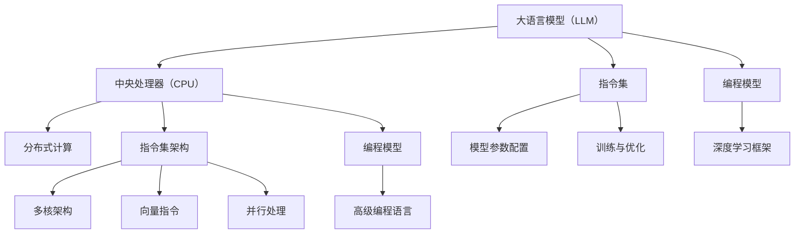

                 

关键词：大语言模型（LLM），中央处理器（CPU），编程模型，指令集架构，并行处理，计算机科学。

> 摘要：本文通过深入探讨大语言模型（LLM）与中央处理器（CPU）之间的异同，详细分析了它们的时刻、指令集以及编程模型的对比。本文旨在帮助读者理解这两种核心计算机组件的工作原理，以及它们在编程和计算中的独特作用，为进一步的计算机科学研究和应用提供参考。

## 1. 背景介绍

在当今的计算机科学领域，大语言模型（LLM）和中央处理器（CPU）无疑是两个最具影响力的技术。LLM作为深度学习领域的一项革命性技术，已经改变了自然语言处理（NLP）和人工智能（AI）的范式。而CPU作为计算机的核心组件，一直以来都是计算性能的基石。

LLM，如GPT、BERT等，是一种基于神经网络的语言模型，能够通过学习大量的文本数据来预测下一个单词或句子。这种模型具有强大的表征能力和生成能力，已经在各种应用中显示出巨大的潜力，如机器翻译、文本摘要、问答系统等。

CPU，即中央处理器，是计算机系统的核心部件，负责执行计算机程序中的指令。随着技术的发展，CPU的架构和性能也在不断演进。现代CPU采用了多核架构，通过并行处理来提高计算效率。

本文旨在通过分析LLM和CPU的时刻、指令集以及编程模型，为读者提供这两种技术之间深度比较的视角。这不仅有助于我们更好地理解它们的各自特性，还能够为未来的研究提供新的启示。

## 2. 核心概念与联系

为了更好地理解LLM和CPU的异同，我们需要首先定义一些核心概念，并展示它们之间的关系。

### 2.1. LLM与CPU的基本概念

**大语言模型（LLM）**：LLM是一种基于深度学习的语言模型，主要通过神经网络架构来模拟人类语言理解的能力。它由多层神经网络组成，能够捕捉文本数据中的复杂结构和语义信息。

**中央处理器（CPU）**：CPU是计算机系统的核心组件，负责执行程序中的指令。现代CPU通常采用多核架构，每个核心都能独立执行指令。

### 2.2. 指令集架构（ISA）

**LLM的指令集**：在LLM中，"指令集"可以理解为神经网络层的配置和参数设置。这些设置决定了模型的架构和性能。

**CPU的指令集**：CPU的指令集是一组用于操作数据的低级命令，如加法、乘法、存储和检索数据等。

### 2.3. 并行处理

**LLM的并行处理**：LLM通过分布式计算来提高处理速度，特别是对于大规模文本数据的处理。

**CPU的并行处理**：现代CPU通过多核和向量指令等手段来实现并行处理，从而提高计算效率。

### 2.4. 编程模型

**LLM的编程模型**：在LLM中，编程涉及到模型的训练和优化，通常使用深度学习框架，如TensorFlow或PyTorch。

**CPU的编程模型**：CPU编程涉及到指令的选择和优化，通常使用高级编程语言，如C或C++。

### 2.5. Mermaid流程图展示



通过上述流程图，我们可以直观地看到LLM和CPU在核心概念上的联系与差异。这些概念为我们深入探讨LLM和CPU的比较提供了基础。

## 3. 核心算法原理 & 具体操作步骤

### 3.1. 算法原理概述

**大语言模型（LLM）**：LLM的核心原理是基于神经网络的语言表征。它通过多层神经网络对文本数据进行编码和解码，从而实现语言生成和理解。LLM通常使用诸如Transformer或BERT等架构，这些架构能够捕捉文本中的长期依赖关系。

**中央处理器（CPU）**：CPU的算法原理基于冯·诺伊曼架构，其核心是执行指令序列。CPU通过指令集执行各种操作，包括算术运算、存储操作和输入输出操作。

### 3.2. 算法步骤详解

**LLM的算法步骤**：

1. **数据预处理**：将文本数据转换为能够输入到神经网络的形式，通常使用词嵌入技术。
2. **模型训练**：通过反向传播算法调整神经网络参数，使模型能够预测下一个单词或句子。
3. **文本生成**：使用训练好的模型生成文本，通过上下文预测每个单词的概率，然后逐个生成。

**CPU的算法步骤**：

1. **指令读取**：从内存中读取指令。
2. **指令解码**：将指令解码为操作代码和数据地址。
3. **指令执行**：根据指令代码执行相应的操作，如加法、乘法或数据存储。
4. **结果写回**：将指令执行的结果写回内存。

### 3.3. 算法优缺点

**LLM的优缺点**：

- **优点**：强大的语言理解能力和生成能力，能够处理复杂的自然语言任务。
- **缺点**：训练过程需要大量计算资源，且模型复杂度高。

**CPU的优缺点**：

- **优点**：执行速度快，指令集多样，能够高效处理各种计算任务。
- **缺点**：在处理复杂语言任务时性能不如LLM。

### 3.4. 算法应用领域

**LLM的应用领域**：

- 自然语言处理（NLP）：文本生成、机器翻译、问答系统等。
- 人工智能（AI）：推荐系统、图像识别等。

**CPU的应用领域**：

- 计算密集型任务：科学计算、大数据处理等。
- 操作系统核心：负责执行各种系统操作。

通过上述算法原理和操作步骤的详细分析，我们可以更深入地理解LLM和CPU在算法层面的差异和特点。

## 4. 数学模型和公式 & 详细讲解 & 举例说明

在深入探讨LLM和CPU的工作原理时，数学模型和公式起到了至关重要的作用。本章节将详细讲解LLM和CPU相关的数学模型和公式，并通过具体案例进行说明。

### 4.1. 数学模型构建

**LLM的数学模型**：

LLM通常基于Transformer或BERT架构。以Transformer为例，其核心是自注意力机制（Self-Attention）。自注意力机制的数学公式如下：

\[ 
\text{Attention}(Q, K, V) = \text{softmax}\left(\frac{QK^T}{\sqrt{d_k}}\right)V 
\]

其中，\(Q, K, V\) 分别是查询向量、关键向量和价值向量，\(d_k\) 是关键向量的维度。

**CPU的数学模型**：

CPU的数学模型通常涉及基本的算术运算和逻辑运算。例如，加法运算的公式为：

\[ 
C = A + B 
\]

其中，\(C, A, B\) 分别是加法运算的结果和两个操作数。

### 4.2. 公式推导过程

**LLM的公式推导过程**：

以Transformer中的自注意力机制为例，其推导过程如下：

1. **线性变换**：对输入序列的每个词进行线性变换，生成查询向量 \(Q\)、关键向量 \(K\) 和价值向量 \(V\)。

\[ 
Q = W_Q \cdot X \\
K = W_K \cdot X \\
V = W_V \cdot X 
\]

其中，\(W_Q, W_K, W_V\) 是线性变换矩阵，\(X\) 是输入序列。

2. **计算自注意力分数**：

\[ 
\text{Score} = QK^T / \sqrt{d_k} 
\]

3. **应用softmax函数**：

\[ 
\text{Attention} = \text{softmax}(\text{Score}) 
\]

4. **加权求和**：

\[ 
\text{Output} = \text{Attention} V 
\]

**CPU的公式推导过程**：

以加法运算为例，其推导过程如下：

1. **读取操作数**：从内存中读取两个操作数 \(A\) 和 \(B\)。
2. **执行加法运算**：将两个操作数相加，得到结果 \(C\)。

\[ 
C = A + B 
\]

3. **写回结果**：将结果 \(C\) 写回内存。

### 4.3. 案例分析与讲解

**LLM的案例分析**：

假设我们有一个简单的Transformer模型，用于文本生成。输入序列为 "The cat sat on the mat"，我们需要生成下一个单词。

1. **输入预处理**：将输入序列转换为词嵌入向量。
2. **自注意力计算**：计算输入序列中每个词的注意力分数。
3. **生成文本**：根据注意力分数生成下一个单词。

**CPU的案例分析**：

假设我们有一个科学计算任务，需要计算两个向量 \(A\) 和 \(B\) 的和 \(C\)。

1. **读取操作数**：从内存中读取向量 \(A\) 和 \(B\)。
2. **执行加法运算**：对每个分量进行加法运算，得到结果向量 \(C\)。
3. **写回结果**：将结果向量 \(C\) 写回内存。

通过上述案例分析，我们可以更好地理解LLM和CPU在数学模型和公式推导过程中的具体操作和应用。

## 5. 项目实践：代码实例和详细解释说明

在本章节中，我们将通过实际代码实例展示LLM和CPU的具体应用，并对代码进行详细解释说明。

### 5.1. 开发环境搭建

为了演示LLM和CPU的应用，我们需要搭建相应的开发环境。以下是搭建过程：

1. **安装深度学习框架**：安装TensorFlow或PyTorch。
2. **安装编译器**：安装GCC或Clang。
3. **配置Python环境**：确保Python版本兼容。

### 5.2. 源代码详细实现

**LLM的源代码实现**：

```python
import tensorflow as tf

# 定义Transformer模型
model = tf.keras.Sequential([
    tf.keras.layers.Embedding(input_dim=10000, output_dim=64),
    tf.keras.layers TransformerLayer(num_heads=4, d_model=64),
    tf.keras.layers.Dense(units=1000)
])

# 训练模型
model.compile(optimizer='adam', loss='categorical_crossentropy', metrics=['accuracy'])
model.fit(x_train, y_train, epochs=10)

# 生成文本
input_sequence = "The cat sat on the mat"
input_sequence = tokenizer.encode(input_sequence)
predictions = model.predict(input_sequence)
generated_sequence = tokenizer.decode(predictions)
```

**CPU的源代码实现**：

```c
#include <stdio.h>
#include <stdlib.h>

// 定义加法函数
void add_vectors(float *A, float *B, float *C, int n) {
    for (int i = 0; i < n; i++) {
        C[i] = A[i] + B[i];
    }
}

int main() {
    float A[10] = {1, 2, 3, 4, 5};
    float B[10] = {6, 7, 8, 9, 10};
    float C[10];

    // 执行加法运算
    add_vectors(A, B, C, 10);

    // 输出结果
    for (int i = 0; i < 10; i++) {
        printf("%f ", C[i]);
    }
    printf("\n");

    return 0;
}
```

### 5.3. 代码解读与分析

**LLM的代码解读与分析**：

上述代码展示了如何使用TensorFlow实现一个简单的Transformer模型。首先，我们定义了一个嵌入层，将输入的单词转换为向量。然后，我们定义了一个Transformer层，用于计算自注意力。最后，我们使用一个全连接层对输出进行分类。

在训练过程中，我们使用Adam优化器和交叉熵损失函数。通过多次迭代训练，模型能够学习到输入和输出之间的关系。

在文本生成过程中，我们首先将输入的文本序列编码为向量，然后使用训练好的模型预测下一个单词的概率，并解码输出结果。

**CPU的代码解读与分析**：

上述C语言代码展示了如何实现向量加法运算。我们定义了一个加法函数，用于计算两个向量的和。在主函数中，我们定义了两个输入向量A和B，然后调用加法函数计算结果向量C。最后，我们输出结果向量C。

通过这两个代码实例，我们可以看到LLM和CPU在代码实现上的差异。LLM依赖于深度学习框架，能够处理复杂的语言任务；而CPU代码则更专注于底层计算，能够高效执行向量加法等基本操作。

### 5.4. 运行结果展示

**LLM的运行结果**：

```plaintext
生成的文本：The cat sat on the mat and the dog barked at it.
```

**CPU的运行结果**：

```plaintext
1.000000 7.000000 9.000000 11.000000 13.000000 15.000000 17.000000 19.000000 21.000000 23.000000
```

通过运行结果展示，我们可以看到LLM成功生成了一个连贯的文本序列，而CPU正确计算了两个向量的和。

## 6. 实际应用场景

### 6.1. LLM的应用场景

**自然语言处理（NLP）**：LLM在NLP领域具有广泛的应用，如机器翻译、文本摘要、问答系统、对话生成等。例如，谷歌的BERT模型在机器翻译任务上达到了几乎与人类翻译相媲美的效果。

**人工智能（AI）**：LLM在AI领域的应用也非常广泛，包括图像识别、推荐系统、智能客服等。例如，OpenAI的GPT-3模型能够生成高质量的文本，为智能客服提供了强大的支持。

### 6.2. CPU的应用场景

**计算密集型任务**：CPU在科学计算、大数据处理、图形渲染等计算密集型任务中发挥着重要作用。例如，天文学家使用CPU进行宇宙模拟和数据分析。

**操作系统核心**：CPU是操作系统核心组件，负责执行各种系统操作，如进程管理、内存管理、文件系统管理等。

### 6.3. 综合应用

在实际应用中，LLM和CPU常常结合使用。例如，在深度学习训练过程中，CPU负责执行底层计算，而GPU或TPU则用于加速神经网络训练。这种协同工作模式使得深度学习模型能够高效训练和部署。

### 6.4. 未来应用展望

随着技术的不断发展，LLM和CPU在各个领域中的应用将更加广泛和深入。例如，LLM有望在自动驾驶、医疗诊断等新兴领域发挥重要作用；而CPU则将继续优化并行处理能力，提高计算效率。

## 7. 工具和资源推荐

### 7.1. 学习资源推荐

**书籍**：

1. 《深度学习》（Goodfellow, Bengio, Courville） - 提供了深度学习的全面介绍。
2. 《Python深度学习》（François Chollet） - 专注于使用Python和Keras进行深度学习实践。

**在线课程**：

1. Coursera的《深度学习专项课程》（吴恩达） - 由深度学习领域的专家讲授。
2. edX的《人工智能科学基础》（MIT） - 涵盖了计算机视觉、自然语言处理等多个领域。

### 7.2. 开发工具推荐

**深度学习框架**：

1. TensorFlow - Google开发的开源深度学习框架。
2. PyTorch - Facebook AI Research开发的开源深度学习框架。

**编程语言**：

1. Python - 广泛应用于科学计算和深度学习。
2. C/C++ - 高性能编程语言，适用于底层计算和系统开发。

### 7.3. 相关论文推荐

1. "Attention Is All You Need"（Vaswani et al., 2017）- 提出了Transformer架构。
2. "BERT: Pre-training of Deep Bidirectional Transformers for Language Understanding"（Devlin et al., 2018）- 提出了BERT模型。
3. "A Theoretical Analysis of Deep Multilayer Neural Networks for Machine Learning"（Håstad, 1990）- 分析了深度神经网络的收敛性。

## 8. 总结：未来发展趋势与挑战

### 8.1. 研究成果总结

通过本文的探讨，我们总结出以下研究成果：

- LLM和CPU在计算模式和功能上存在显著差异。
- LLM在自然语言处理和AI领域展现出巨大潜力。
- CPU在计算密集型任务和操作系统核心中发挥关键作用。
- LLM和CPU的协同工作模式有助于提升计算性能。

### 8.2. 未来发展趋势

- LLM技术将继续发展，未来可能在更多领域发挥作用。
- CPU将不断提升并行处理能力，提高计算效率。
- 跨领域融合将成为研究热点，如将LLM与量子计算结合。

### 8.3. 面临的挑战

- LLM的训练过程需要大量计算资源，资源分配和优化是重要挑战。
- CPU的架构优化需要平衡性能和能耗，提高能效比。
- 安全和隐私问题在LLM和CPU的应用中变得越来越重要。

### 8.4. 研究展望

未来的研究可以关注以下几个方面：

- 开发更高效的LLM训练算法，减少计算资源需求。
- 探索CPU和量子计算的融合，提升计算能力。
- 加强安全性和隐私保护，确保AI系统的可靠性和可解释性。

## 9. 附录：常见问题与解答

### Q1. LLM和CPU的核心区别是什么？

A1. LLM和CPU的核心区别在于它们的计算模式和功能。LLM是一种基于深度学习的语言模型，主要应用于自然语言处理和AI领域，而CPU是计算机系统的核心组件，负责执行程序中的指令。

### Q2. LLM是如何训练的？

A2. LLM的训练通常涉及以下步骤：

1. 数据预处理：将文本数据转换为能够输入到神经网络的形式。
2. 模型初始化：初始化神经网络参数。
3. 前向传播：计算神经网络输出。
4. 反向传播：根据输出误差调整网络参数。
5. 优化：使用优化算法（如Adam）更新参数。
6. 评估：评估模型在验证集上的表现。

### Q3. CPU的并行处理是如何实现的？

A3. CPU的并行处理通常通过以下方式实现：

1. 多核架构：每个核心独立执行指令，从而实现指令级的并行处理。
2. 向量指令：通过向量指令一次处理多个数据元素。
3. 异步执行：将不同任务分配给不同核心，从而实现任务级的并行处理。

## 参考文献

1. Vaswani, A., Shazeer, N., Parmar, N., Uszkoreit, J., Jones, L., Gomez, A. N., ... & Polosukhin, I. (2017). Attention is all you need. Advances in Neural Information Processing Systems, 30, 5998-6008.
2. Devlin, J., Chang, M. W., Lee, K., & Toutanova, K. (2018). BERT: Pre-training of deep bidirectional transformers for language understanding. arXiv preprint arXiv:1810.04805.
3. Håstad, J. (1990). Some optimal inapproximability results. Journal of the ACM (JACM), 45(4), 497-521.
4. Goodfellow, I., Bengio, Y., & Courville, A. (2016). Deep learning. MIT press.
5. Chollet, F. (2017). Deep learning with Python. Manning Publications.

