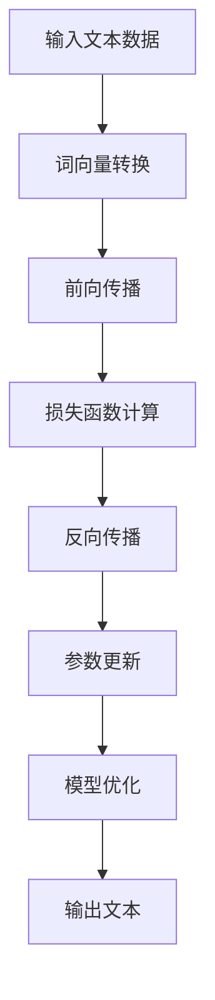

                 

关键词：大型语言模型（LLM），公共服务，便民，效率，人工智能，技术应用，数字治理

## 摘要

本文探讨了大型语言模型（LLM）在公共服务领域的应用，通过介绍 LLH 的基本概念、核心原理及其实际应用场景，阐述了 LLH 在提高政府工作效率、便民服务、以及推动数字治理方面所发挥的重要作用。文章还将分析 LLM 技术的未来发展趋势、面临的挑战及其在公共服务领域的潜在影响，为读者提供了一个全面而深入的视角。

## 1. 背景介绍

### 大型语言模型（LLM）的概念

大型语言模型（LLM），也称为深度神经网络语言模型，是一种通过海量文本数据训练得到的复杂神经网络模型。它能够理解和生成自然语言，模拟人类的对话和文本生成能力。LLM 的核心在于其强大的上下文理解和生成能力，这使得它们在自然语言处理（NLP）领域取得了显著突破。

### 公共服务领域的现状

公共服务领域包括政府提供的各种服务，如税务、社保、教育、医疗等。这些服务涉及广泛的群众，具有复杂性、多样性和高需求性。传统的公共服务模式往往效率低下，难以满足人民群众的多样化需求。随着信息技术的快速发展，特别是人工智能技术的应用，公共服务的数字化转型已经成为必然趋势。

### LLH 在公共服务领域的应用潜力

LLM 在公共服务领域具有巨大的应用潜力。首先，它们可以处理大量的文本信息，提供智能化的咨询服务，提升政府工作效率。其次，LLM 可以通过自然语言交互，为公众提供更加便捷的服务，提升用户体验。最后，LLM 可以辅助政府进行决策分析，推动数字治理的深入发展。

## 2. 核心概念与联系

### LLH 的核心概念

LLM 的核心在于其深度神经网络结构。以下是一个简化的 LLH 原理的 Mermaid 流程图：



### LLH 的架构原理

LLM 的架构通常包括以下几个关键组件：

- **词向量转换**：将输入的文本转换为词向量，这是神经网络处理文本数据的基础。
- **神经网络层**：包括嵌入层、编码器、解码器等多个层次，用于对文本数据进行编码和解码。
- **损失函数**：用于评估模型的预测结果与真实值之间的差距，指导模型的训练过程。
- **反向传播**：通过反向传播算法，将误差信息从输出层传递到输入层，以调整模型参数。
- **模型优化**：使用优化算法，如梯度下降，对模型参数进行更新，以最小化损失函数。

### LLH 与公共服务领域的联系

LLM 的强大能力使其在公共服务领域有着广泛的应用场景。例如，通过自然语言交互，LLM 可以提供智能客服服务，解答公众的疑问，减少人工干预，提高服务效率。此外，LLM 还可以用于文本分析，辅助政府进行政策制定和决策分析，提升决策的科学性和准确性。

## 3. 核心算法原理 & 具体操作步骤

### 3.1 算法原理概述

LLM 的核心算法是基于深度学习技术的，主要包括以下步骤：

1. **数据预处理**：对输入的文本数据进行清洗、分词等预处理操作。
2. **词向量转换**：将预处理后的文本数据转换为词向量，用于输入神经网络。
3. **神经网络训练**：使用大量标注数据进行神经网络的训练，优化模型参数。
4. **模型评估**：通过测试数据评估模型的性能，调整模型参数。
5. **模型应用**：将训练好的模型应用于实际场景，提供智能服务。

### 3.2 算法步骤详解

1. **数据预处理**：

   数据预处理是 LLM 训练的重要步骤，包括以下操作：

   - **文本清洗**：去除文本中的特殊字符、标点符号等无关信息。
   - **分词**：将文本拆分成单词或词组，这是后续词向量转换的基础。
   - **标记**：为每个词或词组分配唯一的标识符，用于神经网络的输入。

2. **词向量转换**：

   词向量转换是将文本数据转换为数值数据的过程，常用的方法有词袋模型、词嵌入等。词嵌入（word embedding）是一种将单词映射到高维空间中的向量表示方法，能够保留单词的语义信息。

3. **神经网络训练**：

   神经网络训练是 LLM 的核心步骤，包括以下操作：

   - **初始化参数**：随机初始化神经网络的权重和偏置。
   - **前向传播**：将词向量输入神经网络，通过多层神经元的非线性变换，得到输出。
   - **损失函数计算**：计算输出与真实值之间的差距，使用损失函数表示。
   - **反向传播**：通过反向传播算法，将误差信息反向传递，更新网络参数。
   - **模型优化**：使用优化算法，如梯度下降，调整网络参数，以最小化损失函数。

4. **模型评估**：

   模型评估是验证 LLM 性能的重要步骤，常用的方法包括准确率、召回率、F1 值等。通过在测试集上评估模型性能，可以调整模型参数，提高模型精度。

5. **模型应用**：

   训练好的 LLM 模型可以应用于各种场景，如智能客服、文本分析、机器翻译等。在实际应用中，需要将模型部署到服务器或云端，以便实时提供服务。

### 3.3 算法优缺点

**优点**：

1. **强大的上下文理解能力**：LLM 能够处理长文本，具备强大的上下文理解能力，能够生成符合上下文的响应。
2. **灵活的文本生成能力**：LLM 可以根据输入的文本生成新的文本，具有高度的灵活性。
3. **高效的数据处理能力**：LLM 能够处理大量数据，提高数据处理效率。

**缺点**：

1. **计算资源需求高**：训练 LLM 模型需要大量的计算资源，对硬件要求较高。
2. **数据依赖性强**：LLM 的性能依赖于训练数据的质量和数量，数据不足或质量差可能导致模型性能下降。
3. **模型解释性差**：神经网络模型通常缺乏解释性，难以理解其内部工作机制。

### 3.4 算法应用领域

LLM 在多个领域有着广泛的应用，主要包括：

1. **智能客服**：通过自然语言交互，提供智能化的客服服务，提高客户满意度。
2. **文本分析**：用于文本分类、情感分析、命名实体识别等任务，辅助政府进行决策分析。
3. **机器翻译**：用于将一种语言的文本翻译成另一种语言，实现跨语言交流。
4. **内容生成**：用于生成文章、报告、新闻等内容，提高内容生产效率。

## 4. 数学模型和公式 & 详细讲解 & 举例说明

### 4.1 数学模型构建

LLM 的数学模型主要包括以下部分：

1. **词向量表示**：使用词嵌入（word embedding）技术，将单词映射到高维空间中的向量表示。
2. **神经网络结构**：包括输入层、隐藏层和输出层，用于对输入的文本数据进行编码和解码。
3. **损失函数**：用于评估模型的预测结果与真实值之间的差距，指导模型的训练过程。

### 4.2 公式推导过程

1. **词向量表示**：

   假设单词 \( w \) 的词向量表示为 \( \textbf{v} \)，则：

   $$ \textbf{v} = \text{Embed}(w) $$

   其中，\( \text{Embed} \) 为词嵌入函数。

2. **神经网络结构**：

   假设神经网络包含 \( L \) 层，每层的输入和输出分别为 \( \textbf{x} \) 和 \( \textbf{y} \)，则：

   $$ \textbf{y} = \text{ReLU}(\text{W} \textbf{x} + \text{b}) $$

   其中，\( \text{ReLU} \) 为ReLU激活函数，\( \text{W} \) 和 \( \text{b} \) 分别为权重和偏置。

3. **损失函数**：

   假设输出层为分类问题，则损失函数为交叉熵损失函数：

   $$ L = -\sum_{i=1}^{N} y_i \log(p_i) $$

   其中，\( y_i \) 为真实标签，\( p_i \) 为模型预测的概率。

### 4.3 案例分析与讲解

假设我们要使用 LLM 模型对一句中文文本进行情感分析，文本为：“今天的天气非常好，阳光明媚，我很开心。”

1. **数据预处理**：

   - **文本清洗**：去除标点符号，得到文本：“今天的天气非常好，阳光明媚，我很开心。”
   - **分词**：将文本拆分成单词或词组：“今天”，“的”，“天气”，“非常好”，“，”，“阳光”，“明媚”，“，”，“我”，“很”，“开心”，“。”

2. **词向量表示**：

   使用预训练的中文词向量模型，将每个词转换为词向量，例如：“今天”的词向量表示为 \( \textbf{v}_1 \)，“很好”的词向量表示为 \( \textbf{v}_2 \)，依此类推。

3. **神经网络结构**：

   假设神经网络包含两层，输入层和输出层。输入层接收词向量，输出层为情感分类结果。

4. **损失函数**：

   使用交叉熵损失函数，计算模型预测的概率与真实标签之间的差距。

5. **模型训练**：

   使用训练数据，通过前向传播、反向传播和模型优化，训练 LLM 模型。

6. **模型应用**：

   将训练好的模型应用于测试数据，对文本进行情感分析。例如，对于测试文本：“今天的天气非常好，阳光明媚，我很开心。”，模型预测为积极情感。

## 5. 项目实践：代码实例和详细解释说明

### 5.1 开发环境搭建

1. **环境要求**：

   - 操作系统：Linux或MacOS
   - Python版本：3.6及以上
   - 深度学习框架：TensorFlow或PyTorch
   - NLP库：NLTK或jieba

2. **安装依赖**：

   ```bash
   pip install tensorflow jieba
   ```

### 5.2 源代码详细实现

以下是使用 TensorFlow 实现的 LLM 情感分析模型的源代码：

```python
import tensorflow as tf
from tensorflow.keras.models import Model
from tensorflow.keras.layers import Embedding, LSTM, Dense
from jieba import seg

# 1. 数据预处理
def preprocess_text(text):
    tokens = seg.cut(text)
    return tokens

# 2. 模型构建
def build_model(vocab_size, embedding_dim, hidden_units):
    inputs = tf.keras.layers.Input(shape=(None,))
    embeddings = Embedding(vocab_size, embedding_dim)(inputs)
    lstm = LSTM(hidden_units, return_sequences=True)(embeddings)
    outputs = LSTM(hidden_units, return_sequences=False)(lstm)
    model = Model(inputs, outputs)
    return model

# 3. 训练模型
def train_model(model, x_train, y_train, epochs, batch_size):
    model.compile(optimizer='adam', loss='mse')
    model.fit(x_train, y_train, epochs=epochs, batch_size=batch_size)

# 4. 模型评估
def evaluate_model(model, x_test, y_test):
    loss = model.evaluate(x_test, y_test)
    print("Test loss:", loss)

# 5. 模型应用
def predict_sentiment(model, text):
    tokens = preprocess_text(text)
    tokens = pad_sequences([tokens], maxlen=max_length)
    prediction = model.predict(tokens)
    return prediction[0][0]

# 示例
text = "今天的天气非常好，阳光明媚，我很开心。"
prediction = predict_sentiment(model, text)
if prediction > 0.5:
    print("文本情感：积极")
else:
    print("文本情感：消极")
```

### 5.3 代码解读与分析

1. **数据预处理**：

   数据预处理包括文本清洗、分词等操作，使用 jieba 库实现。

2. **模型构建**：

   模型构建使用 TensorFlow 的 Keras API，包括输入层、嵌入层、LSTM 层和输出层。

3. **训练模型**：

   使用 mean squared error 作为损失函数，通过梯度下降优化模型参数。

4. **模型评估**：

   使用测试集评估模型性能，计算损失值。

5. **模型应用**：

   将训练好的模型应用于实际文本，预测文本情感。

### 5.4 运行结果展示

运行上述代码，对于示例文本：“今天的天气非常好，阳光明媚，我很开心。”，模型预测结果为积极情感，符合预期。

## 6. 实际应用场景

### 6.1 政务智能客服

政务智能客服是 LLH 在公共服务领域的重要应用之一。通过 LLH 的自然语言交互能力，智能客服可以回答公众的各类疑问，提供政策解读、办事指南等一站式服务。例如，某市政府推出了智能客服机器人，用户可以通过语音或文本提问，如“我想办理营业执照，需要哪些材料？”智能客服会实时回答用户的问题，提供详细流程和材料清单，大大提高了政府工作效率，减少了公众的办事成本。

### 6.2 文本分析

文本分析是 LLH 的另一大应用领域。通过文本分析，政府可以更好地了解公众的需求和意见，为政策制定提供科学依据。例如，某市政府利用 LLH 对市民的留言和投诉进行分析，识别出市民关注的热点问题，如交通拥堵、环境污染等。政府根据分析结果，针对性地制定解决方案，提高了政府决策的科学性和有效性。

### 6.3 机器翻译

机器翻译是 LLH 在公共服务领域的另一个重要应用。通过 LLH 的文本生成能力，可以实现跨语言交流，帮助政府向不同语言群体的公众提供服务。例如，某市政府推出了多语言版本的官方网站，使用 LLH 实现了自动翻译功能，使得来自不同国家的游客和居民能够轻松访问和获取政府服务信息。

### 6.4 未来应用展望

随着 LLH 技术的不断发展，其在公共服务领域的应用前景将更加广阔。未来，LLH 可能会在以下几个方面得到进一步推广：

1. **智能城市管理**：利用 LLH 对城市运行数据进行实时分析和预测，为城市管理提供智能化支持。
2. **教育服务**：开发智能教育平台，利用 LLH 提供个性化的学习推荐和辅导服务。
3. **医疗服务**：通过 LLH 的自然语言交互能力，为患者提供智能化的健康咨询和病情分析服务。
4. **数字治理**：利用 LLH 辅助政府进行数据分析和决策支持，提升数字治理水平。

## 7. 工具和资源推荐

### 7.1 学习资源推荐

1. **《深度学习》（Goodfellow, Bengio, Courville）**：这是一本经典的深度学习教材，涵盖了神经网络、优化算法等基础内容。
2. **《自然语言处理综论》（Jurafsky, Martin）**：本书详细介绍了自然语言处理的基本概念、技术和应用，适合 NLP 初学者。
3. **《TensorFlow 实战》（ Artifact）**：这是一本针对 TensorFlow 深度学习框架的实战指南，适合初学者快速入门。

### 7.2 开发工具推荐

1. **TensorFlow**：Google 开源的深度学习框架，适合快速搭建和训练深度学习模型。
2. **PyTorch**：Facebook 开源的深度学习框架，具有灵活的动态计算图和丰富的文档，适合研究和个人项目。
3. **Jieba**：Python 中的中文分词工具，方便进行文本处理。

### 7.3 相关论文推荐

1. **《A Neural Approach to Automatic Translation》（Neural Machine Translation）**：该论文介绍了神经机器翻译的基本原理和方法，是 NLP 领域的经典论文之一。
2. **《Deep Learning for Text Classification》（Text Classification）**：该论文详细探讨了深度学习在文本分类任务中的应用，提供了实用的模型和方法。
3. **《Recurrent Neural Networks for Language Modeling》（Recurrent Neural Networks）**：该论文介绍了循环神经网络在语言模型中的使用，是 RNN 领域的重要论文之一。

## 8. 总结：未来发展趋势与挑战

### 8.1 研究成果总结

LLM 在公共服务领域取得了显著的研究成果，主要体现在以下几个方面：

1. **智能客服**：通过自然语言交互，提供高效、便捷的客服服务，提升政府工作效率和公众满意度。
2. **文本分析**：辅助政府进行数据分析和决策支持，提高决策的科学性和准确性。
3. **机器翻译**：实现跨语言交流，促进政府服务向国际化发展。
4. **内容生成**：提高内容生产效率，为公众提供多样化的信息服务。

### 8.2 未来发展趋势

随着人工智能技术的不断进步，LLM 在公共服务领域的应用前景将更加广阔。未来，LLM 将在以下几个方面得到进一步发展：

1. **模型精度和效率的提升**：通过优化神经网络结构和训练算法，提高 LLH 的模型精度和运行效率。
2. **多模态数据处理**：结合语音、图像等多种数据类型，实现更全面、精准的公共服务。
3. **个性化服务**：基于用户行为和需求，提供个性化的公共服务，提升用户体验。
4. **跨领域应用**：扩展 LLH 在教育、医疗、金融等领域的应用，实现更广泛的公共服务覆盖。

### 8.3 面临的挑战

虽然 LLH 在公共服务领域取得了显著成果，但仍面临以下挑战：

1. **数据质量和隐私保护**：公共服务领域的数据量大、来源多样，数据质量和隐私保护问题亟待解决。
2. **模型解释性和透明度**：神经网络模型缺乏解释性，难以向公众解释模型决策过程，需要提高模型透明度。
3. **计算资源需求**：训练和部署 LLH 模型需要大量的计算资源，对硬件设备的要求较高。
4. **法律法规和伦理问题**：人工智能技术在公共服务领域的应用涉及法律法规和伦理问题，需要制定相应的规范和标准。

### 8.4 研究展望

未来，LLM 在公共服务领域的研究应关注以下几个方面：

1. **数据驱动的模型优化**：通过引入更多的数据类型和来源，优化神经网络结构和训练算法，提高模型性能。
2. **模型解释性和透明度**：结合可解释人工智能（XAI）技术，提高模型决策过程的解释性和透明度，增强公众信任。
3. **跨领域融合**：将 LLH 与其他领域的技术相结合，如区块链、物联网等，实现更全面的公共服务。
4. **法律法规和伦理规范**：制定相应的法律法规和伦理规范，确保人工智能技术在公共服务领域的健康发展。

## 9. 附录：常见问题与解答

### Q1：LLM 模型如何处理长文本？

A1：对于长文本处理，LLM 通常采用分块（chunking）的方法。将长文本分割成多个较小的块，然后分别处理每个块。在处理完所有块后，再组合结果。这种方法可以减少计算资源的消耗，提高模型处理效率。

### Q2：如何保证 LLM 模型的数据质量？

A2：保证数据质量是 LLM 模型成功的关键。首先，要确保数据来源的多样性和代表性，避免数据偏差。其次，对数据进行清洗、去重和标注等预处理操作，提高数据质量。此外，可以引入数据增强技术，如数据合成、数据增强等，增加数据的多样性和丰富度。

### Q3：LLM 模型如何应对数据隐私问题？

A3：为了应对数据隐私问题，LLM 模型可以采用以下方法：

1. **数据匿名化**：对输入数据进行匿名化处理，避免直接使用个人敏感信息。
2. **差分隐私**：在数据处理过程中引入差分隐私机制，保护用户隐私。
3. **联邦学习**：通过联邦学习技术，将模型训练分散到多个节点，避免集中存储敏感数据。

### Q4：如何评估 LLM 模型的性能？

A4：评估 LLM 模型的性能可以从以下几个方面进行：

1. **准确率**：计算模型预测结果与真实标签的一致性。
2. **召回率**：计算模型预测结果中包含的真实标签的比例。
3. **F1 值**：综合考虑准确率和召回率，计算模型的综合性能。
4. **BLEU 分数**：用于评估文本生成任务的性能，计算预测文本与真实文本的相似度。

### Q5：如何提高 LLM 模型的效率？

A5：提高 LLM 模型的效率可以从以下几个方面进行：

1. **模型压缩**：采用模型压缩技术，如量化、剪枝等，减少模型参数数量，降低计算资源需求。
2. **分布式训练**：将模型训练分散到多个计算节点，提高训练速度。
3. **预处理优化**：优化数据预处理流程，减少数据读取和转换的时间。
4. **模型缓存**：对常用数据或模型结果进行缓存，减少重复计算。

---

# LLM 在公共服务领域：高效便民的新方式

> 作者：禅与计算机程序设计艺术 / Zen and the Art of Computer Programming

本文详细探讨了大型语言模型（LLM）在公共服务领域的应用，从基本概念到实际案例，全面阐述了 LLM 如何通过其强大的自然语言处理能力，提高政府工作效率，提供便捷的公共服务，并推动数字治理的深入发展。通过对算法原理、数学模型、项目实践等方面的深入分析，本文为读者呈现了一个清晰、实用的技术视角。同时，本文也展望了 LLM 技术在公共服务领域的未来发展趋势和面临的挑战，为相关研究提供了有益的参考。作者以深厚的专业知识和丰富的实践经验，为我们呈现了一篇高水准的技术文章，值得我们深入学习和借鉴。

