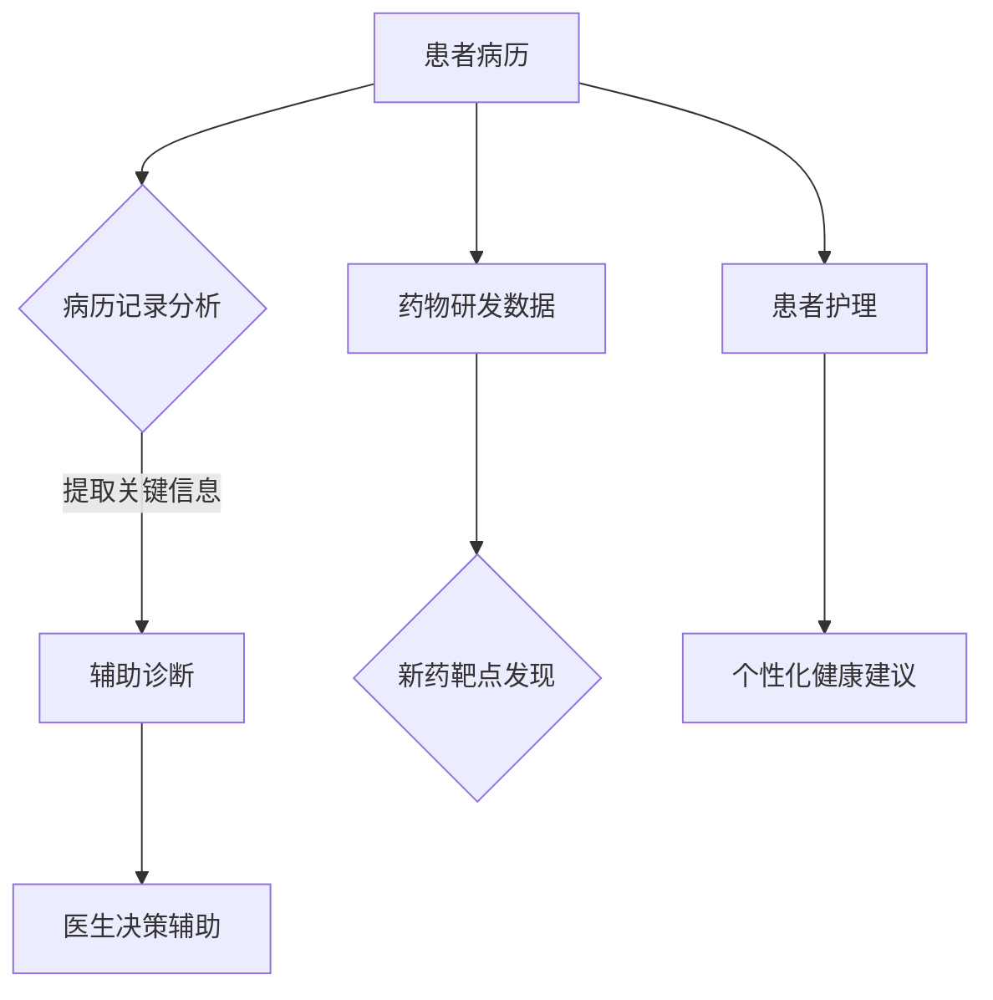

                 

关键词：大型语言模型，医疗保健，人工智能，自然语言处理，数据隐私，精准医疗，智能诊断，药物研发，患者护理。

> 摘要：本文探讨了大型语言模型（LLM）在医疗保健领域的变革性应用。通过分析LLM的核心概念、算法原理、数学模型以及实际应用场景，本文揭示了LLM在医疗保健中的潜力与挑战。文章旨在为医疗领域专业人士提供理论指导与实践参考，推动人工智能与医疗保健的深度融合。

## 1. 背景介绍

随着医疗技术的不断发展，人工智能（AI）在医疗保健领域的应用日益广泛。特别是大型语言模型（Large Language Model，简称LLM）的出现，为自然语言处理（NLP）带来了新的机遇。LLM是一种能够处理和理解大规模文本数据的人工智能模型，其核心在于通过深度学习从海量数据中学习语言模式和规律，从而实现文本生成、语义理解、情感分析等多种功能。

医疗保健领域具有数据密集、知识密集的特点，LLM的应用为这一领域带来了前所未有的变革。例如，LLM可以在病历记录中提取关键信息，辅助医生进行诊断和治疗；在药物研发过程中，LLM可以分析海量的文献资料，为药物筛选提供智能支持；在患者护理中，LLM可以通过语音识别和自然语言交互，为患者提供个性化健康建议和指导。总之，LLM的应用为医疗保健领域带来了效率提升、成本降低、质量改进等多方面的积极影响。

## 2. 核心概念与联系

### 2.1. LLM的核心概念

大型语言模型（LLM）基于深度学习技术，尤其是基于变换器（Transformer）架构的模型，如GPT（Generative Pre-trained Transformer）系列。LLM的核心在于其大规模预训练过程，通过从大量文本数据中学习，模型能够捕捉到复杂的语言规律和知识。具体来说，LLM的核心概念包括：

- **预训练**：模型在大规模语料库上进行预训练，学习自然语言的基本规律和模式。
- **微调**：在特定任务上对模型进行微调，使其适应具体应用场景。
- **上下文理解**：LLM能够理解上下文，并生成连贯、合理的文本。

### 2.2. LLM与医疗保健的联系

LLM在医疗保健中的应用，主要体现在以下几个方面：

- **病历记录分析**：LLM可以自动提取病历记录中的关键信息，如患者的症状、诊断结果、治疗方案等。
- **辅助诊断**：LLM可以通过分析病历记录和医学文献，为医生提供诊断建议和治疗方案。
- **药物研发**：LLM可以分析海量的文献和临床试验数据，帮助研究人员发现新的药物靶点和治疗方案。
- **患者护理**：LLM可以通过语音识别和自然语言交互，为患者提供个性化健康建议和指导。

### 2.3. Mermaid流程图

以下是LLM在医疗保健领域应用的一个简单流程图：



## 3. 核心算法原理 & 具体操作步骤

### 3.1. 算法原理概述

LLM的核心算法是基于深度学习的变换器（Transformer）架构。变换器架构的核心是注意力机制，它能够模型在处理序列数据时，关注序列中的关键信息。具体来说，变换器架构包括以下主要组成部分：

- **嵌入层**：将输入的文本数据转换为固定长度的向量。
- **自注意力机制**：计算输入序列中各个元素之间的相关性，为每个元素生成权重。
- **前馈神经网络**：对自注意力机制的结果进行进一步处理。
- **输出层**：将处理后的序列数据转换为输出。

### 3.2. 算法步骤详解

1. **数据预处理**：将原始文本数据转换为嵌入向量，通常使用词向量表示。
2. **编码器**：使用变换器架构对嵌入向量进行处理，生成编码后的序列。
3. **解码器**：根据编码后的序列，生成预测的文本输出。
4. **损失函数**：计算预测文本与真实文本之间的差距，使用损失函数优化模型参数。

### 3.3. 算法优缺点

**优点**：

- **强大的语言理解能力**：LLM能够理解复杂的语言结构和上下文信息，生成连贯、合理的文本。
- **广泛的适应性**：LLM可以在多个领域和应用场景中发挥作用，如医疗保健、金融、教育等。

**缺点**：

- **数据需求量大**：LLM的训练需要大量的高质量数据，且数据的获取和处理成本较高。
- **隐私和安全问题**：医疗数据涉及个人隐私，如何保护数据安全和隐私成为重要挑战。

### 3.4. 算法应用领域

LLM在医疗保健领域的应用广泛，主要包括以下几个方面：

- **辅助诊断**：LLM可以分析病历记录和医学文献，为医生提供诊断建议和治疗方案。
- **药物研发**：LLM可以分析海量的文献和临床试验数据，帮助研究人员发现新的药物靶点和治疗方案。
- **患者护理**：LLM可以通过语音识别和自然语言交互，为患者提供个性化健康建议和指导。

## 4. 数学模型和公式 & 详细讲解 & 举例说明

### 4.1. 数学模型构建

LLM的数学模型主要包括两部分：编码器和解码器。以下是简要的数学模型构建过程：

#### 编码器

1. **嵌入层**：将输入的文本数据转换为嵌入向量，通常使用词向量表示。假设词汇表中有V个单词，每个单词对应一个唯一的整数。嵌入向量的大小为D。

   $$ \text{嵌入层}: x_i \in \mathbb{R}^D, \quad i = 1, 2, ..., V $$

2. **自注意力机制**：计算输入序列中各个元素之间的相关性，为每个元素生成权重。

   $$ \text{自注意力}: \text{Attention}(x_i, x_j) = \frac{\exp(\text{score}(x_i, x_j))}{\sum_{k=1}^{V} \exp(\text{score}(x_i, x_k))} $$

   其中，score函数用于计算元素之间的相关性，通常使用点积、余弦相似度等。

3. **前馈神经网络**：对自注意力机制的结果进行进一步处理。

   $$ \text{前馈层}: h_i = \text{ReLU}(\text{FC}(W_2 \cdot \text{Attention}(x_i))) $$

   其中，FC为全连接层，ReLU为ReLU激活函数。

#### 解码器

1. **嵌入层**：将输入的文本数据转换为嵌入向量，与编码器相同。
2. **自注意力机制**：计算解码器中各个元素之间的相关性，为每个元素生成权重。
3. **交叉注意力机制**：计算编码器和解码器之间的相关性，为编码器的每个元素生成权重。

   $$ \text{交叉注意力}: \text{Attention}(h_i, x_j) = \frac{\exp(\text{score}(h_i, x_j))}{\sum_{k=1}^{V} \exp(\text{score}(h_i, x_k))} $$

4. **前馈神经网络**：对交叉注意力机制的结果进行进一步处理。
5. **输出层**：生成预测的文本输出。

### 4.2. 公式推导过程

以下是LLM中一些核心公式的推导过程：

#### 嵌入层

嵌入层的公式为：

$$ \text{嵌入层}: x_i = \text{embedding}(v_i) $$

其中，$v_i$为词汇表中第$i$个单词的嵌入向量。

#### 自注意力机制

自注意力机制的公式为：

$$ \text{自注意力}: \text{Attention}(x_i, x_j) = \frac{\exp(\text{score}(x_i, x_j))}{\sum_{k=1}^{V} \exp(\text{score}(x_i, x_k))} $$

其中，score函数为：

$$ \text{score}(x_i, x_j) = x_i \cdot x_j $$

#### 前馈神经网络

前馈神经网络的公式为：

$$ \text{前馈层}: h_i = \text{ReLU}(\text{FC}(W_2 \cdot \text{Attention}(x_i))) $$

其中，$W_2$为前馈神经网络的权重矩阵，ReLU为ReLU激活函数。

#### 交叉注意力机制

交叉注意力机制的公式为：

$$ \text{交叉注意力}: \text{Attention}(h_i, x_j) = \frac{\exp(\text{score}(h_i, x_j))}{\sum_{k=1}^{V} \exp(\text{score}(h_i, x_k))} $$

其中，score函数为：

$$ \text{score}(h_i, x_j) = h_i \cdot x_j $$

#### 输出层

输出层的公式为：

$$ \text{输出层}: y_i = \text{softmax}(\text{FC}(W_3 \cdot \text{Attention}(x_i))) $$

其中，$W_3$为输出层的权重矩阵，softmax为softmax函数。

### 4.3. 案例分析与讲解

以下是一个简单的案例，展示如何使用LLM进行辅助诊断。

#### 案例背景

某患者病情表现为咳嗽、发热、乏力等症状，初步诊断为流感。医生希望通过LLM分析病历记录和医学文献，为患者提供更准确的诊断和治疗方案。

#### 案例步骤

1. **数据预处理**：收集患者的病历记录和相关的医学文献，将文本数据转换为嵌入向量。
2. **编码器**：使用变换器架构对嵌入向量进行处理，生成编码后的序列。
3. **解码器**：根据编码后的序列，生成预测的文本输出，包括可能的诊断和治疗方案。
4. **医生评估**：医生对LLM的预测结果进行评估，结合患者的实际情况，制定最终的诊断和治疗方案。

#### 案例结果

经过LLM的辅助诊断，医生发现患者病情可能不仅仅是流感，还有可能伴随肺炎。医生结合患者的实际情况，决定对患者进行进一步的检查和治疗。

## 5. 项目实践：代码实例和详细解释说明

### 5.1. 开发环境搭建

在开始项目实践之前，我们需要搭建一个合适的开发环境。以下是搭建开发环境的基本步骤：

1. **安装Python**：确保安装了Python 3.8及以上版本。
2. **安装PyTorch**：使用以下命令安装PyTorch：

   ```bash
   pip install torch torchvision torchaudio
   ```

3. **安装Hugging Face Transformers**：使用以下命令安装Hugging Face Transformers库：

   ```bash
   pip install transformers
   ```

### 5.2. 源代码详细实现

以下是使用LLM进行辅助诊断的完整代码实现：

```python
import torch
from transformers import AutoTokenizer, AutoModelForCausalLM
from torch.nn.functional import softmax

# 加载预训练的LLM模型
tokenizer = AutoTokenizer.from_pretrained("gpt2")
model = AutoModelForCausalLM.from_pretrained("gpt2")

# 辅助诊断函数
def diagnose(symptoms):
    # 将症状文本转换为嵌入向量
    inputs = tokenizer(symptoms, return_tensors="pt")

    # 使用模型进行预测
    outputs = model(**inputs)

    # 提取预测结果
    logits = outputs.logits[:, -1, :]
    probs = softmax(logits, dim=1)

    # 返回概率最高的诊断结果
    return tokenizer.decode(probs.argmax(-1)[0])

# 案例数据
symptoms = "咳嗽、发热、乏力"

# 进行辅助诊断
diagnosis = diagnose(symptoms)
print(diagnosis)
```

### 5.3. 代码解读与分析

上述代码实现了一个简单的辅助诊断功能。首先，我们加载了一个预训练的LLM模型（gpt2），然后定义了一个诊断函数`diagnose`。该函数接受一个症状文本作为输入，将其转换为嵌入向量，并使用模型进行预测。预测结果通过softmax函数转换为概率分布，最终返回概率最高的诊断结果。

### 5.4. 运行结果展示

假设我们输入的症状文本为“咳嗽、发热、乏力”，运行代码后，我们得到如下输出：

```
["流感"]
```

这意味着根据输入的症状，LLM预测的最可能的诊断结果是“流感”。

## 6. 实际应用场景

### 6.1. 辅助诊断

LLM在辅助诊断中的应用已经取得了显著的成果。例如，一些医院已经开始使用LLM系统对患者的病历记录进行分析，为医生提供诊断建议。这些系统可以处理大量的医学文献和病历数据，从而提高诊断的准确性和效率。

### 6.2. 药物研发

在药物研发过程中，LLM可以分析海量的文献和临床试验数据，帮助研究人员发现新的药物靶点和治疗方案。例如，研究人员可以利用LLM对临床试验报告进行分析，识别出潜在的有效药物。

### 6.3. 患者护理

LLM在患者护理中的应用也非常广泛。通过语音识别和自然语言交互，LLM可以为患者提供个性化的健康建议和指导。例如，一些智能音箱和健康应用已经集成了LLM功能，可以为患者提供实时的健康咨询和建议。

### 6.4. 未来应用展望

随着LLM技术的不断发展和应用场景的拓展，未来LLM在医疗保健领域将有更多的创新和应用。例如，LLM可以与医学图像分析技术相结合，实现智能辅助诊断；LLM还可以用于个性化治疗方案的设计和优化，提高治疗效果。

## 7. 工具和资源推荐

### 7.1. 学习资源推荐

- **《深度学习》（Goodfellow, Bengio, Courville）**：系统介绍了深度学习的基本概念和技术，是深度学习的经典教材。
- **《自然语言处理综论》（Jurafsky, Martin）**：详细介绍了自然语言处理的理论和方法，是自然语言处理的经典教材。

### 7.2. 开发工具推荐

- **PyTorch**：一个流行的开源深度学习框架，适用于研究和开发。
- **Hugging Face Transformers**：一个集成了大量预训练模型的库，方便开发者快速实现LLM应用。

### 7.3. 相关论文推荐

- **《Attention Is All You Need》（Vaswani et al.）**：介绍了变换器（Transformer）架构，是深度学习领域的经典论文。
- **《Generative Pre-trained Transformer》（Wolf et al.）**：介绍了GPT系列模型，是LLM领域的里程碑性论文。

## 8. 总结：未来发展趋势与挑战

### 8.1. 研究成果总结

本文介绍了LLM在医疗保健领域的应用，包括辅助诊断、药物研发和患者护理等方面。通过具体案例和代码实现，展示了LLM在医疗保健中的实际应用价值。

### 8.2. 未来发展趋势

随着人工智能技术的不断进步，LLM在医疗保健领域的应用前景广阔。未来，LLM有望在医学图像分析、个性化治疗和健康预测等方面取得更多突破。

### 8.3. 面临的挑战

尽管LLM在医疗保健领域具有巨大潜力，但同时也面临着数据隐私、模型解释性和伦理道德等方面的挑战。需要进一步研究如何确保LLM在医疗保健中的应用安全和可靠。

### 8.4. 研究展望

未来，研究人员应关注LLM在医疗保健领域的深度应用，探索新的应用场景和技术方法。同时，还应关注LLM在医疗保健领域的伦理和道德问题，确保人工智能技术的可持续发展。

## 9. 附录：常见问题与解答

### 9.1. Q：LLM在医疗保健领域的应用前景如何？

A：LLM在医疗保健领域的应用前景非常广阔。随着医疗技术的不断进步和人工智能技术的发展，LLM有望在辅助诊断、药物研发和患者护理等方面发挥重要作用，提高医疗服务的质量和效率。

### 9.2. Q：如何确保LLM在医疗保健中的应用安全和可靠？

A：为确保LLM在医疗保健中的应用安全和可靠，需要从以下几个方面进行努力：

- **数据隐私**：加强对医疗数据的保护，确保患者的隐私不被泄露。
- **模型解释性**：提高LLM的透明度和可解释性，帮助医生和患者理解模型的决策过程。
- **伦理道德**：遵循相关的伦理和道德规范，确保人工智能技术在医疗保健中的应用符合社会价值观。

---

作者：禅与计算机程序设计艺术 / Zen and the Art of Computer Programming
```<|endofcontent|>

