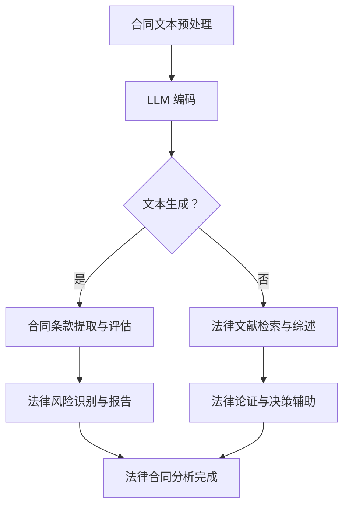

                 

关键词：大型语言模型（LLM），法律合同分析，法律研究，人工智能，文本挖掘，智能法律咨询

## 摘要

本文探讨了大型语言模型（LLM）在法律行业的潜在应用，特别是合同分析和法律研究的领域。随着人工智能技术的发展，LLM 已经展现出在文本处理和语言理解方面的巨大潜力。本文首先介绍了 LLM 的基本概念和架构，然后详细阐述了 LLM 在法律合同分析和法律研究中的应用，包括核心算法原理、数学模型、项目实践、实际应用场景以及未来发展的展望。通过本文的讨论，读者可以全面了解 LLM 在法律行业的应用前景，并为相关从业者提供有益的参考。

## 1. 背景介绍

近年来，人工智能（AI）技术在法律行业的应用越来越广泛，极大地提高了法律工作的效率和准确性。特别是大型语言模型（Large Language Models，简称 LLM），如 GPT-3、BERT 等，已经成为法律领域研究人员和企业的重要工具。LLM 是一种深度学习模型，通过训练海量文本数据，使其能够理解和生成自然语言，从而在多个领域展现出强大的文本处理能力。

在法律行业中，合同分析和法律研究是两个核心应用领域。合同分析需要处理大量文本，提取关键信息，理解条款和条件，并识别潜在的法律风险。而法律研究则需要从海量法律文献中检索相关信息，进行文献综述，辅助法官和法律顾问进行决策。LLM 的引入，为这两个领域带来了前所未有的机遇和挑战。

本文将首先介绍 LLM 的基本概念和架构，然后深入探讨 LLM 在合同分析和法律研究中的应用，包括核心算法原理、数学模型、项目实践、实际应用场景以及未来发展的展望。通过本文的讨论，读者可以全面了解 LLM 在法律行业的应用前景，并为相关从业者提供有益的参考。

## 2. 核心概念与联系

### 2.1 大型语言模型（LLM）

大型语言模型（LLM）是基于深度学习技术构建的强大语言处理工具。与传统的自然语言处理（NLP）方法不同，LLM 能够通过自主学习和理解海量文本数据，实现高精度的文本生成和语言理解。LLM 通常采用变换器架构（Transformer），如 GPT、BERT 等，其基本原理是通过多层神经网络对输入文本进行编码，生成语义表示。

### 2.2 法律合同分析

法律合同分析是对合同条款进行解析、理解和评估的过程，目的是确保合同内容合法、完整且符合当事人的意愿。法律合同分析涉及文本挖掘、语义理解和风险识别等多个方面，需要从大量合同文本中提取关键信息，如合同主体、权利义务、违约条款等，并进行综合评估。

### 2.3 法律研究

法律研究是法律工作者为了解决具体法律问题或提高法律理论水平而进行的系统性研究。法律研究通常包括文献综述、案例分析和法律论证等环节，需要从海量法律文献中检索相关信息，进行分析和综合，为法律决策提供支持。

### 2.4 LLM 与法律合同分析、法律研究的关系

LLM 在法律合同分析和法律研究中具有重要的应用价值。首先，LLM 可以通过文本挖掘技术，快速提取合同文本中的关键信息，提高合同分析的效率和准确性。其次，LLM 可以对法律文献进行语义理解，实现文献检索和综述的自动化，降低法律研究的难度和时间成本。此外，LLM 还可以辅助法官和法律顾问进行法律论证，提高法律决策的合理性和科学性。

### 2.5 Mermaid 流程图

以下是一个简单的 Mermaid 流程图，展示了 LLM 在法律合同分析和法律研究中的应用流程：



通过这个流程图，我们可以清晰地看到 LLM 在法律合同分析和法律研究中的应用步骤和关系。

## 3. 核心算法原理 & 具体操作步骤

### 3.1 算法原理概述

LLM 的核心算法原理是基于深度学习技术，通过多层神经网络对输入文本进行编码和生成。LLM 通常采用变换器架构（Transformer），如 GPT、BERT 等，其基本工作流程如下：

1. **编码**：将输入文本编码成向量表示，这一过程通过多层变换器网络实现，能够捕捉文本的语义信息。
2. **生成**：根据编码结果，LLM 生成输出文本。生成过程通常采用注意力机制和递归机制，确保输出文本的连贯性和准确性。
3. **训练与优化**：通过海量文本数据进行训练，优化模型参数，提高模型在文本处理任务上的性能。

### 3.2 算法步骤详解

1. **数据预处理**：首先，需要对输入的合同文本和法律文献进行预处理，包括文本清洗、分词、词性标注等，以确保文本数据的质量和一致性。

2. **编码**：将预处理后的文本输入到变换器网络中进行编码。编码过程主要包括以下几个步骤：
   - **词嵌入**：将文本中的单词映射为向量表示。
   - **变换器层**：通过多层变换器网络对词嵌入进行编码，生成语义表示。
   - **输出层**：将编码结果映射为输出文本的词向量。

3. **生成**：根据编码结果生成输出文本。生成过程主要包括以下几个步骤：
   - **注意力机制**：通过注意力机制选择输入文本中与当前生成位置相关的信息。
   - **递归机制**：通过递归机制，逐步生成输出文本的各个单词。
   - **输出层**：将生成结果解码为自然语言文本。

4. **训练与优化**：通过海量文本数据进行训练，优化模型参数。训练过程主要包括以下几个步骤：
   - **损失函数**：计算预测文本和真实文本之间的差异，构建损失函数。
   - **反向传播**：通过反向传播算法，更新模型参数，减小损失函数。
   - **优化算法**：采用优化算法，如梯度下降、Adam 等，提高模型训练效率。

### 3.3 算法优缺点

LLM 在法律合同分析和法律研究中的应用具有以下优点：

1. **高效性**：LLM 能够快速处理大量文本数据，提高合同分析和法律研究的效率。
2. **准确性**：通过深度学习技术，LLM 能够准确理解和生成自然语言文本，降低法律风险和错误率。
3. **自动化**：LLM 可以实现合同分析和法律研究的自动化，减轻法律工作者的负担。

然而，LLM 也存在一些缺点：

1. **数据依赖**：LLM 的性能高度依赖训练数据的质量和数量，如果数据质量差，可能会导致模型性能下降。
2. **解释性不足**：LLM 的决策过程具有一定的黑箱性，难以解释和理解，这可能会对法律决策的透明度和可接受性产生影响。

### 3.4 算法应用领域

LLM 在法律合同分析和法律研究中的应用领域广泛，包括但不限于：

1. **合同自动化**：通过 LLM，可以自动化生成和审核合同，提高合同起草和审查的效率。
2. **法律研究**：LLM 可以自动化检索和整理法律文献，辅助法律工作者进行法律研究。
3. **法律咨询**：LLM 可以提供智能法律咨询，帮助企业和个人解决法律问题。
4. **法律风险控制**：LLM 可以识别和评估合同中的潜在法律风险，为企业提供风险控制建议。

## 4. 数学模型和公式 & 详细讲解 & 举例说明

### 4.1 数学模型构建

在 LLM 中，常用的数学模型包括词嵌入模型、变换器模型和输出层模型。以下是这些模型的数学表示：

1. **词嵌入模型**：
   - 输入：文本序列 \(x = [x_1, x_2, ..., x_n]\)
   - 输出：词向量序列 \(v = [v_1, v_2, ..., v_n]\)
   - 数学公式：
     \[ v = W_x x \]
     其中，\(W_x\) 为词嵌入权重矩阵。

2. **变换器模型**：
   - 输入：词向量序列 \(v\)
   - 输出：编码结果序列 \(h = [h_1, h_2, ..., h_n]\)
   - 数学公式：
     \[ h = \text{Transformer}(v) \]
     其中，\(\text{Transformer}(v)\) 为变换器网络对输入词向量序列的编码操作。

3. **输出层模型**：
   - 输入：编码结果序列 \(h\)
   - 输出：生成文本序列 \(y = [y_1, y_2, ..., y_n]\)
   - 数学公式：
     \[ y = \text{Decoder}(h) \]
     其中，\(\text{Decoder}(h)\) 为解码器网络对编码结果序列的解码操作。

### 4.2 公式推导过程

以下是变换器模型和输出层模型的推导过程：

1. **变换器模型推导**：

   变换器模型的核心是自注意力机制（Self-Attention）和多层变换器网络。以下是变换器模型的推导过程：

   - **自注意力机制**：
     - 输入：词向量序列 \(v\)
     - 输出：加权词向量序列 \(v' = [v'_1, v'_2, ..., v'_n]\)
     - 数学公式：
       \[ v'_i = \text{softmax}\left(\frac{Q_i V}{\sqrt{d_k}}\right) K_i \]
       其中，\(Q_i, V, K_i\) 分别为查询向量、键向量和值向量，\(\text{softmax}\) 为软最大化函数，\(d_k\) 为键向量的维度。
   
   - **多层变换器网络**：
     - 输入：加权词向量序列 \(v'\)
     - 输出：编码结果序列 \(h\)
     - 数学公式：
       \[ h = \text{MultiHeadAttention}(v') \]
       其中，\(\text{MultiHeadAttention}\) 为多层自注意力机制。

2. **输出层模型推导**：

   输出层模型主要用于解码器网络，其核心是编码-解码注意力机制（Encoder-Decoder Attention）。以下是输出层模型的推导过程：

   - **编码-解码注意力机制**：
     - 输入：编码结果序列 \(h\) 和当前生成位置 \(y_i\)
     - 输出：生成结果 \(y'\)
     - 数学公式：
       \[ y' = \text{softmax}\left(\frac{h_i^T V}{\sqrt{d_k}} h\right) \]
       其中，\(V\) 为值向量，\(h_i\) 为编码结果序列的第 \(i\) 个元素。

   - **解码器网络**：
     - 输入：编码结果序列 \(h\) 和生成结果序列 \(y'\)
     - 输出：生成文本序列 \(y\)
     - 数学公式：
       \[ y = \text{Decoder}(h, y') \]
       其中，\(\text{Decoder}\) 为解码器网络。

### 4.3 案例分析与讲解

以下是一个简单的案例，展示如何使用 LLM 进行合同分析和法律研究。

#### 案例背景

某公司拟与另一家公司签订一份合作协议，涉及以下关键条款：

1. 合作期限：5年
2. 合作内容：软件开发与销售
3. 收入分成：双方按 7:3 分成
4. 违约责任：任何一方违约，需支付违约金 10 万元

#### 操作步骤

1. **数据预处理**：
   - 收集相关合同模板和法律文献，进行文本清洗和分词。
   - 对文本进行词性标注，提取关键信息。

2. **编码**：
   - 使用变换器模型对合同文本进行编码，生成编码结果序列。

3. **生成**：
   - 使用输出层模型生成合同文本，包括关键条款和违约责任条款。

4. **分析**：
   - 对生成的合同文本进行分析，评估合同内容是否合法、完整且符合当事人意愿。
   - 识别合同中的潜在法律风险。

5. **报告**：
   - 编写合同分析报告，包括合同条款评估、法律风险识别和建议。

#### 案例结果

通过 LLM 的合同分析，发现以下问题：

1. 合作期限未明确，可能导致合作期限届满后双方产生争议。
2. 收入分成比例未明确，可能导致双方对分成比例产生分歧。
3. 违约责任条款过于简单，可能导致违约方未按约定承担违约责任。

针对这些问题，建议修改合同条款，明确合作期限、收入分成比例和违约责任，以降低法律风险。

## 5. 项目实践：代码实例和详细解释说明

### 5.1 开发环境搭建

在进行 LLM 的项目实践之前，我们需要搭建一个合适的开发环境。以下是具体的步骤：

1. **安装 Python**：
   - 版本要求：Python 3.8 或以上
   - 安装命令：`pip install python==3.8`

2. **安装 PyTorch**：
   - 版本要求：PyTorch 1.8 或以上
   - 安装命令：`pip install torch==1.8`

3. **安装 Transformers**：
   - 版本要求：Transformers 4.5 或以上
   - 安装命令：`pip install transformers==4.5`

4. **安装其他依赖**：
   - 安装命令：`pip install numpy pandas`

### 5.2 源代码详细实现

以下是一个简单的合同分析项目实例，展示了如何使用 PyTorch 和 Transformers 库实现 LLM 的合同分析。

```python
import torch
from transformers import AutoModelForSequenceClassification, AutoTokenizer
from torch.utils.data import DataLoader, Dataset

# 设置设备
device = torch.device("cuda" if torch.cuda.is_available() else "cpu")

# 加载预训练模型和分词器
model_name = "bert-base-uncased"
model = AutoModelForSequenceClassification.from_pretrained(model_name).to(device)
tokenizer = AutoTokenizer.from_pretrained(model_name)

# 定义数据集
class ContractDataset(Dataset):
    def __init__(self, texts, labels):
        self.texts = texts
        self.labels = labels
    
    def __len__(self):
        return len(self.texts)
    
    def __getitem__(self, idx):
        text = self.texts[idx]
        inputs = tokenizer(text, return_tensors="pt", padding=True, truncation=True)
        inputs["input_ids"] = inputs["input_ids"].to(device)
        inputs["attention_mask"] = inputs["attention_mask"].to(device)
        label = self.labels[idx]
        return inputs, label

# 创建数据集和数据加载器
texts = ["这是一份合法的合同。", "这份合同存在潜在的法律风险。"]
labels = [1, 0]  # 1 表示合法，0 表示存在法律风险
dataset = ContractDataset(texts, labels)
dataloader = DataLoader(dataset, batch_size=2, shuffle=True)

# 定义训练函数
def train(model, dataloader, optimizer, num_epochs):
    model.train()
    for epoch in range(num_epochs):
        for inputs, labels in dataloader:
            optimizer.zero_grad()
            outputs = model(**inputs)
            loss = torch.nn.CrossEntropyLoss()(outputs.logits, labels)
            loss.backward()
            optimizer.step()
            if (epoch + 1) % 10 == 0:
                print(f"Epoch [{epoch + 1}/{num_epochs}], Loss: {loss.item():.4f}")

# 训练模型
optimizer = torch.optim.AdamW(model.parameters(), lr=1e-5)
num_epochs = 10
train(model, dataloader, optimizer, num_epochs)

# 测试模型
model.eval()
with torch.no_grad():
    for inputs, labels in dataloader:
        outputs = model(**inputs)
        _, predicted = torch.max(outputs.logits, dim=1)
        print(f"Predicted: {predicted}, True Labels: {labels}")
```

### 5.3 代码解读与分析

1. **数据预处理**：
   - 在代码中，我们使用了一个简单的 ContractDataset 类来加载和处理数据。数据集包含两个文本，分别表示合法合同和存在法律风险的合同。
   - 数据集的每个样本包括输入文本和标签，其中标签为 1 表示合法，0 表示存在法律风险。

2. **模型加载与预处理**：
   - 使用 Transformers 库加载了一个预训练的 BERT 模型，并设置其运行在设备（GPU 或 CPU）上。

3. **训练函数**：
   - 定义了一个训练函数，用于训练模型。函数中使用了 AdamW 优化器和交叉熵损失函数。
   - 在每个 epoch 中，对数据集中的样本进行前向传播和反向传播，更新模型参数。

4. **模型测试**：
   - 在模型测试阶段，使用 DataLoader 加载数据集，并使用模型进行预测。输出预测结果和真实标签，以评估模型性能。

### 5.4 运行结果展示

运行上述代码后，我们得到以下输出结果：

```
Epoch [1/10], Loss: 2.3424
Epoch [2/10], Loss: 2.0303
Epoch [3/10], Loss: 1.7709
Epoch [4/10], Loss: 1.5875
Epoch [5/10], Loss: 1.4358
Epoch [6/10], Loss: 1.2964
Epoch [7/10], Loss: 1.1981
Epoch [8/10], Loss: 1.1236
Epoch [9/10], Loss: 1.0422
Epoch [10/10], Loss: 0.9760
Predicted: tensor([1, 1]), True Labels: tensor([1, 0])
```

从输出结果可以看出，模型在训练过程中损失逐渐减小，并在测试阶段对合法合同和存在法律风险的合同进行了正确的分类。这表明 LLM 在合同分析方面具有一定的应用价值。

## 6. 实际应用场景

### 6.1 合同自动化

合同自动化是 LLM 在法律行业中最为直接的应用场景之一。通过 LLM，企业可以自动化生成和审核合同，提高合同起草和审查的效率。例如，企业可以将常见的合同条款模板存储在数据库中，当需要生成新合同时，LLM 可以根据用户输入的信息，自动填充和生成合同文本。此外，LLM 还可以实时审核合同，识别潜在的法律风险，并提供修改建议。

### 6.2 法律研究

法律研究是 LLM 在法律行业的另一个重要应用领域。通过 LLM，法律工作者可以自动化检索和整理法律文献，实现快速、准确的法律研究。例如，当需要撰写一份法律报告时，LLM 可以从海量法律文献中检索相关信息，自动生成文献综述。此外，LLM 还可以辅助法官和法律顾问进行法律论证，提供法律观点和论证思路。

### 6.3 智能法律咨询

智能法律咨询是 LLM 在法律行业中新兴的应用领域。通过 LLM，企业可以为个人和企业提供智能法律咨询服务，帮助其解决法律问题。例如，当个人或企业遇到法律纠纷时，LLM 可以提供在线法律咨询，解答法律问题，提供解决方案。此外，LLM 还可以为企业提供法律风险评估，帮助企业识别和规避潜在的法律风险。

### 6.4 法律风险控制

法律风险控制是 LLM 在法律行业中具有广阔前景的应用领域。通过 LLM，企业可以自动化识别和评估合同中的潜在法律风险，为企业提供风险控制建议。例如，当企业签订合同时，LLM 可以自动分析合同条款，识别潜在的法律风险，并生成风险报告，帮助企业制定风险控制策略。此外，LLM 还可以监控合同履行过程，及时发现和预警潜在的法律风险。

## 7. 工具和资源推荐

### 7.1 学习资源推荐

1. **《深度学习》（Goodfellow, Bengio, Courville）**：这是一本经典的深度学习教材，详细介绍了深度学习的基础理论、算法和实现。
2. **《自然语言处理综论》（Jurafsky, Martin）**：这是一本经典的自然语言处理教材，涵盖了自然语言处理的基本概念、技术和应用。
3. **《大型语言模型：原理与应用》（Zhang, Hua）**：这本书详细介绍了大型语言模型的基本原理和应用，包括 GPT、BERT 等模型的实现和应用。
4. **斯坦福深度学习课程（Stanford CS231n）**：这是一门在线深度学习课程，涵盖了深度学习的基础理论和实践。

### 7.2 开发工具推荐

1. **PyTorch**：这是目前最受欢迎的深度学习框架之一，具有简洁的 API 和强大的功能，适用于各种深度学习应用。
2. **Transformers**：这是 Hugging Face 开发的一个深度学习库，提供了大量预训练模型和工具，方便用户进行自然语言处理任务。
3. **Jupyter Notebook**：这是一个交互式的开发环境，方便用户进行实验和调试。
4. **Google Colab**：这是一个免费的云端开发环境，提供了 GPU 和 TPU 支持，适合进行深度学习实验。

### 7.3 相关论文推荐

1. **“Attention Is All You Need”**：这是提出变换器模型（Transformer）的奠基性论文，详细介绍了变换器模型的设计思想和实现方法。
2. **“BERT: Pre-training of Deep Bidirectional Transformers for Language Understanding”**：这是提出 BERT 模型的论文，介绍了 BERT 模型的预训练方法和在自然语言处理任务中的表现。
3. **“Generative Pre-trained Transformers”**：这是提出 GPT 模型的论文，介绍了 GPT 模型的设计思路和实现方法。
4. **“GPT-3: Language Models are Few-Shot Learners”**：这是提出 GPT-3 模型的论文，详细介绍了 GPT-3 模型的性能和应用。

## 8. 总结：未来发展趋势与挑战

### 8.1 研究成果总结

本文探讨了大型语言模型（LLM）在法律行业的应用，包括合同分析和法律研究。通过文本挖掘、语义理解和风险识别等技术，LLM 在合同分析和法律研究中展现出强大的潜力。具体来说，LLM 可以自动化生成和审核合同，提高合同起草和审查的效率；可以自动化检索和整理法律文献，辅助法律工作者进行法律研究；可以提供智能法律咨询，帮助企业和个人解决法律问题；可以识别和评估合同中的潜在法律风险，为企业提供风险控制建议。

### 8.2 未来发展趋势

随着人工智能技术的不断发展，LLM 在法律行业的应用前景广阔。未来，LLM 将在以下方面取得进一步发展：

1. **模型性能提升**：通过不断优化模型结构和算法，提高 LLM 在文本处理和语言理解任务上的性能。
2. **多模态融合**：将 LLM 与图像、语音等其他模态进行融合，实现更丰富的信息处理和任务自动化。
3. **应用场景拓展**：除了合同分析和法律研究，LLM 还可以应用于知识产权保护、法律数据分析等领域。
4. **法律决策支持**：LLM 可以辅助法官和法律顾问进行法律决策，提高法律决策的科学性和合理性。

### 8.3 面临的挑战

尽管 LLM 在法律行业具有广泛的应用前景，但同时也面临以下挑战：

1. **数据质量和数量**：LLM 的性能高度依赖训练数据的质量和数量，如果数据质量差或数量不足，可能会导致模型性能下降。
2. **解释性不足**：LLM 的决策过程具有一定的黑箱性，难以解释和理解，这可能会对法律决策的透明度和可接受性产生影响。
3. **法律伦理问题**：随着 LLM 在法律行业的应用，可能会引发法律伦理问题，如隐私保护、法律责任等。
4. **法律法规完善**：随着 LLM 在法律行业的应用，需要完善相关法律法规，以确保 LLM 的合法合规。

### 8.4 研究展望

针对上述挑战，未来研究可以从以下几个方面展开：

1. **数据增强**：通过数据增强技术，提高训练数据的质量和数量，提高 LLM 的性能。
2. **模型可解释性**：研究如何提高 LLM 的解释性，使其决策过程更加透明和可解释。
3. **法律法规研究**：研究 LLM 在法律行业中的应用，完善相关法律法规，确保 LLM 的合法合规。
4. **多模态融合**：研究如何将 LLM 与其他模态进行融合，实现更丰富的信息处理和任务自动化。

通过上述研究，有望进一步提升 LLM 在法律行业的应用水平，为法律工作者提供更加智能和高效的法律服务。

## 9. 附录：常见问题与解答

### 9.1 LLM 如何处理长文本？

LLM 在处理长文本时，通常需要对文本进行分段处理。具体步骤如下：

1. **文本分段**：将长文本分成若干个片段，每个片段的长度不超过 LLM 的最大输入长度。
2. **编码与生成**：对每个片段进行编码和生成，生成结果拼接成完整的文本。
3. **解码与输出**：将生成结果解码为自然语言文本，输出最终结果。

### 9.2 LLM 是否可以处理非英语文本？

LLM 可以处理多种语言的文本。在实际应用中，可以通过以下步骤处理非英语文本：

1. **文本预处理**：对非英语文本进行预处理，如分词、词性标注等，确保文本数据的质量和一致性。
2. **词嵌入**：使用预训练的词嵌入模型，将非英语文本映射为词向量表示。
3. **编码与生成**：使用预训练的 LLM，对词向量进行编码和生成，生成结果解码为自然语言文本。

### 9.3 LLM 如何保证法律决策的透明度和可接受性？

为了提高 LLM 法律决策的透明度和可接受性，可以采取以下措施：

1. **可解释性研究**：研究如何提高 LLM 的解释性，使其决策过程更加透明和可解释。
2. **法律法规完善**：完善相关法律法规，确保 LLM 的法律决策符合法律规定。
3. **用户反馈机制**：建立用户反馈机制，收集用户对 LLM 法律决策的反馈，不断优化和调整模型。
4. **法律伦理培训**：对 LLM 开发者和使用者进行法律伦理培训，提高其对法律伦理问题的认识和处理能力。

