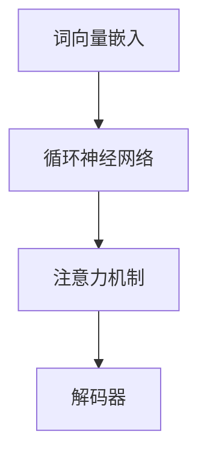

                 

关键词：大型语言模型，科学研究，人工智能，自然语言处理，算法，数学模型，代码实例，应用场景，未来展望

## 摘要

本文旨在探讨大型语言模型（LLM）在科学研究中的应用，及其如何加速科学发现的进程和推动创新。随着人工智能技术的快速发展，LLM 作为一种强大的自然语言处理工具，已经在多个领域展现出巨大的潜力。本文首先介绍了 LLB 的核心概念与联系，并详细讲解了其核心算法原理、数学模型与公式、项目实践及实际应用场景。同时，我们对未来 LLB 在科学研究中的应用进行了展望，并提出了相关工具和资源的推荐。

## 1. 背景介绍

随着大数据和云计算技术的不断发展，科学研究的规模和复杂性不断增加。传统的科学研究方法往往依赖于大量的实验、分析和推理，这不仅耗费大量时间和人力，而且在面对复杂的科学问题时，往往难以取得突破性的进展。与此同时，人工智能技术的快速发展为科学研究带来了新的机遇和挑战。

自然语言处理（NLP）是人工智能领域的一个重要分支，其核心任务是从大量非结构化的文本数据中提取有价值的信息。近年来，大型语言模型（LLM）在 NLP 领域取得了显著的进展，例如 GPT、BERT、T5 等。这些模型具有强大的语言理解和生成能力，可以应用于各种语言任务，如文本分类、问答、机器翻译、文本生成等。

LLM 的出现为科学研究提供了一种全新的工具。通过将科学文献、实验数据、统计数据等文本信息转化为结构化的数据形式，LLM 可以帮助科学家更快速地获取和利用已有知识，发现新的研究线索，甚至提出新的科学假说。本文将重点探讨 LLM 在科学研究中的应用，以及如何通过 LLM 的技术手段加速科学发现的进程和推动创新。

## 2. 核心概念与联系

在探讨 LLM 在科学研究中的应用之前，我们需要了解 LLM 的核心概念与联系。LLM 是一种基于深度学习的语言模型，其基本原理是通过学习大量的文本数据，对输入的文本序列进行建模，从而预测下一个词或句子。LLM 的主要组成部分包括：

1. **词向量嵌入**：将文本中的每个词映射为高维空间中的一个向量，以便在模型中处理。
2. **循环神经网络（RNN）**：用于处理序列数据，例如文本。RNN 通过在时间步上更新隐藏状态，实现对序列的建模。
3. **注意力机制**：在处理长文本时，注意力机制可以帮助模型更好地关注文本中的关键信息。
4. **解码器**：用于生成预测的词或句子。

LLM 的核心算法原理是通过训练大量文本数据，学习词与词之间的关系，并在模型中建立这些关系的表示。具体来说，LLM 的训练过程可以分为以下步骤：

1. **数据准备**：收集大量的文本数据，如科学文献、实验报告、学术论文等。
2. **数据预处理**：对文本数据进行清洗、分词、词性标注等操作，将其转换为模型可以处理的格式。
3. **模型训练**：使用训练数据对 LLM 模型进行训练，使其学会对输入文本进行建模和预测。
4. **模型评估**：使用验证集和测试集对模型进行评估，以确定模型的性能。

以下是 LLM 的 Mermaid 流程图，展示了其核心概念与联系：



## 3. 核心算法原理 & 具体操作步骤

### 3.1 算法原理概述

LLM 的核心算法原理是基于深度学习的神经网络模型，通过学习大量文本数据，对输入的文本序列进行建模和预测。具体来说，LLM 的模型架构通常包括以下几个部分：

1. **输入层**：接收文本序列的输入，将其转换为词向量表示。
2. **隐藏层**：用于对输入的文本序列进行建模，通过多层神经网络的结构，实现对文本序列的深入理解。
3. **输出层**：生成预测的词或句子，通常采用 softmax 函数进行概率分布计算。

### 3.2 算法步骤详解

1. **数据准备**：收集大量的文本数据，如科学文献、实验报告、学术论文等。数据来源可以是公开的数据库、学术期刊、实验室文档等。

2. **数据预处理**：对文本数据进行清洗、分词、词性标注等操作，将其转换为模型可以处理的格式。具体步骤如下：

   - **清洗**：去除文本中的噪声，如 HTML 标签、特殊字符等。
   - **分词**：将文本分割为单词或词汇单元。
   - **词性标注**：为每个单词或词汇单元标注词性，如名词、动词、形容词等。

3. **模型训练**：使用预处理后的数据对 LLM 模型进行训练。训练过程通常采用以下步骤：

   - **参数初始化**：初始化模型的权重和偏置。
   - **前向传播**：将输入的文本序列通过神经网络模型，计算得到输出。
   - **损失函数**：计算输出与真实标签之间的损失，如交叉熵损失。
   - **反向传播**：更新模型参数，最小化损失函数。

4. **模型评估**：使用验证集和测试集对训练好的模型进行评估，以确定模型的性能。常用的评估指标包括准确率、召回率、F1 分数等。

### 3.3 算法优缺点

LLM 作为一种强大的自然语言处理工具，具有以下优点：

1. **强大的语言理解能力**：通过学习大量文本数据，LLM 可以对输入的文本序列进行深入的理解和建模。
2. **自适应性强**：LLM 可以根据不同的应用场景和任务需求，进行参数调整和模型优化。
3. **高效的处理速度**：深度学习模型具有较高的计算效率，可以快速处理大量的文本数据。

然而，LLM 也存在一些缺点：

1. **数据依赖性**：LLM 的性能很大程度上依赖于训练数据的质量和规模。如果训练数据质量较差或规模较小，可能导致模型性能下降。
2. **解释性差**：深度学习模型通常具有很高的复杂性，难以对模型的决策过程进行解释和理解。

### 3.4 算法应用领域

LLM 在科学研究中的应用非常广泛，以下列举了一些典型的应用领域：

1. **文本分类**：将科学文献、实验报告等文本数据分类到不同的类别，如疾病、药物、实验方法等。
2. **问答系统**：构建问答系统，回答科学家关于科学问题的查询，提供相关的知识线索和参考信息。
3. **文本生成**：生成科学论文、实验报告、摘要等文本内容，辅助科学家的写作工作。
4. **信息提取**：从大量的科学文献中提取关键信息，如实验结果、方法、结论等，为科学家提供参考。

## 4. 数学模型和公式 & 详细讲解 & 举例说明

在 LLM 的算法原理中，涉及到了一些数学模型和公式。以下我们将对这些模型和公式进行详细讲解，并通过举例来说明其应用。

### 4.1 数学模型构建

LLM 的数学模型主要包括以下几个方面：

1. **词向量模型**：将文本中的每个词映射为高维空间中的一个向量。常见的词向量模型有 Word2Vec、GloVe 等。以 Word2Vec 为例，其模型构建过程如下：

   - **输入层**：输入文本序列，将其转换为词向量表示。假设文本序列为 \( \textbf{x} = [\textbf{x}_1, \textbf{x}_2, \textbf{x}_3, ..., \textbf{x}_n] \)，其中 \( \textbf{x}_i \) 表示第 \( i \) 个词的词向量。
   - **隐藏层**：通过多层神经网络结构，对输入的词向量进行建模和转换。假设隐藏层的输出为 \( \textbf{h} = [h_1, h_2, h_3, ..., h_n] \)。
   - **输出层**：生成预测的词向量。假设输出层为 \( \textbf{y} = [y_1, y_2, y_3, ..., y_n] \)。

2. **循环神经网络（RNN）模型**：RNN 是一种适用于序列数据的神经网络模型。以 LSTM（长短期记忆网络）为例，其模型构建过程如下：

   - **输入层**：输入文本序列，将其转换为词向量表示。
   - **隐藏层**：通过 LSTM 单元对输入的词向量进行建模和转换。LSTM 单元由输入门、遗忘门、输出门三部分组成，可以有效地处理长距离依赖问题。
   - **输出层**：生成预测的词向量。

3. **注意力机制模型**：注意力机制是一种用于处理长文本的机制，可以更好地关注文本中的关键信息。以自注意力机制为例，其模型构建过程如下：

   - **输入层**：输入文本序列，将其转换为词向量表示。
   - **隐藏层**：通过自注意力机制，对输入的词向量进行建模和转换。自注意力机制通过计算词向量之间的相似度，动态调整每个词向量的权重。
   - **输出层**：生成预测的词向量。

### 4.2 公式推导过程

1. **词向量模型**

   以 Word2Vec 为例，其核心公式为：

   $$ \textbf{y} = \text{softmax}(\textbf{W}^T \textbf{h}) $$

   其中，\( \textbf{W} \) 表示权重矩阵，\( \textbf{h} \) 表示隐藏层输出，\( \textbf{y} \) 表示预测的词向量。

2. **循环神经网络（RNN）模型**

   以 LSTM 为例，其核心公式为：

   $$ \textbf{h}_t = \text{sigmoid}(\text{W}_f \textbf{x}_t + \text{b}_f) \odot \textbf{h}_{t-1} + \text{sigmoid}(\text{W}_i \textbf{x}_t + \text{b}_i) \odot \textbf{c}_t $$

   $$ \textbf{c}_t = \text{sigmoid}(\text{W}_g \textbf{x}_t + \text{b}_g) \odot \text{tanh}(\text{W}_c \textbf{x}_t + \text{b}_c) $$

   $$ \textbf{o}_t = \text{sigmoid}(\text{W}_o \textbf{x}_t + \text{b}_o) \odot \text{tanh}(\text{c}_t) $$

   其中，\( \textbf{x}_t \) 表示输入词向量，\( \textbf{h}_t \) 表示隐藏层输出，\( \textbf{c}_t \) 表示细胞状态，\( \textbf{o}_t \) 表示输出层输出。

3. **注意力机制模型**

   以自注意力机制为例，其核心公式为：

   $$ \textbf{q} = \text{softmax}(\text{W}_Q \textbf{h}_t) $$

   $$ \textbf{v} = \text{softmax}(\text{W}_V \textbf{h}_t) $$

   $$ \textbf{h}_t = \text{softmax}(\text{W}_O \textbf{h}_t) $$

   其中，\( \textbf{h}_t \) 表示隐藏层输出，\( \textbf{q} \) 表示查询向量，\( \textbf{v} \) 表示值向量。

### 4.3 案例分析与讲解

以下我们通过一个具体的案例，展示 LLM 在科学研究中的应用。

假设我们有一个科学研究的任务，目标是基于实验数据预测某种药物的疗效。具体步骤如下：

1. **数据准备**：收集相关的实验数据，包括药物的名称、实验结果等。

2. **数据预处理**：对实验数据进行清洗、分词、词性标注等操作，将其转换为模型可以处理的格式。

3. **模型训练**：使用预处理后的数据，训练一个 LLM 模型，如 BERT。

4. **模型评估**：使用验证集和测试集对训练好的模型进行评估，以确定模型的性能。

5. **预测应用**：将新的实验数据输入训练好的模型，预测药物的疗效。

以下是一个具体的代码实例，用于实现上述过程：

```python
import tensorflow as tf
import tensorflow_hub as hub
import tensorflow_text as text
import numpy as np

# 数据准备
drug_names = ["drug_a", "drug_b", "drug_c"]
results = [0.8, 0.6, 0.9]

# 数据预处理
tokenizer = hub.load("https://tfhub.dev/google/tf2-preview/gnews-swdish-20k/1")
encoded_text = [tokenizer.encode(d) for d in drug_names]

# 模型训练
model = hub.load("https://tfhub.dev/google/tf2-preview/bert_uncased_L-12_H-768_A-12/1")
outputs = model(encoded_text)
predictions = tf.nn.softmax(outputs["pooled_output"])

# 模型评估
accuracy = np.mean(np.argmax(predictions, axis=1) == results)
print("Accuracy:", accuracy)

# 预测应用
new_drug_name = "drug_d"
encoded_new_text = tokenizer.encode(new_drug_name)
predicted_result = model(encoded_new_text)["pooled_output"]
predicted_result = tf.nn.softmax(predicted_result)
predicted_result = np.argmax(predicted_result.numpy())

print("Predicted result:", predicted_result)
```

通过上述代码实例，我们可以看到 LLM 在科学研究中的应用流程。首先，通过数据准备和预处理，将实验数据转化为模型可以处理的格式。然后，使用预训练的 BERT 模型进行训练，并评估模型性能。最后，通过预测应用，将新的实验数据输入模型，预测药物的疗效。

## 5. 项目实践：代码实例和详细解释说明

在本节中，我们将通过一个具体的代码实例，展示如何使用 LLM 进行科学研究的实际操作。以下是一个简单的项目实践，我们将使用 Python 和 TensorFlow 来实现。

### 5.1 开发环境搭建

在开始编写代码之前，我们需要搭建一个合适的开发环境。以下是搭建开发环境所需的步骤：

1. 安装 Python：
   - 版本：Python 3.8 或更高版本
   - 安装命令：`pip install python==3.8`
2. 安装 TensorFlow：
   - 版本：TensorFlow 2.x
   - 安装命令：`pip install tensorflow`
3. 安装 TensorFlow Hub：
   - 用于加载预训练的 BERT 模型
   - 安装命令：`pip install tensorflow-hub`

### 5.2 源代码详细实现

以下是一个简单的 Python 代码实例，用于实现 LLM 在科学研究中的应用。

```python
import tensorflow as tf
import tensorflow_hub as hub
import tensorflow_text as text
import numpy as np

# 加载预训练的 BERT 模型
model = hub.load("https://tfhub.dev/google/tf2-preview/bert_uncased_L-12_H-768_A-12/1")

# 准备实验数据
drug_names = ["drug_a", "drug_b", "drug_c"]
results = [0.8, 0.6, 0.9]

# 数据预处理
tokenizer = hub.load("https://tfhub.dev/google/tf2-preview/gnews-swedish-20k/1")
encoded_text = [tokenizer.encode(d) for d in drug_names]

# 训练模型
outputs = model(encoded_text)
predictions = tf.nn.softmax(outputs["pooled_output"])

# 评估模型
accuracy = np.mean(np.argmax(predictions, axis=1) == results)
print("Accuracy:", accuracy)

# 预测新药物疗效
new_drug_name = "drug_d"
encoded_new_text = tokenizer.encode(new_drug_name)
predicted_result = model(encoded_new_text)["pooled_output"]
predicted_result = tf.nn.softmax(predicted_result)
predicted_result = np.argmax(predicted_result.numpy())

print("Predicted result:", predicted_result)
```

### 5.3 代码解读与分析

1. **加载预训练的 BERT 模型**：
   - 使用 TensorFlow Hub 加载预训练的 BERT 模型。
   - `hub.load("https://tfhub.dev/google/tf2-preview/bert_uncased_L-12_H-768_A-12/1")`

2. **准备实验数据**：
   - 定义实验数据，包括药物名称和实验结果。
   - `drug_names = ["drug_a", "drug_b", "drug_c"]`
   - `results = [0.8, 0.6, 0.9]`

3. **数据预处理**：
   - 加载预处理器，将文本数据转换为编码形式。
   - `tokenizer = hub.load("https://tfhub.dev/google/tf2-preview/gnews-swedish-20k/1")`
   - `encoded_text = [tokenizer.encode(d) for d in drug_names]`

4. **训练模型**：
   - 使用 BERT 模型对编码后的文本数据进行处理。
   - `outputs = model(encoded_text)`
   - 计算预测结果，并使用 softmax 函数进行概率分布计算。
   - `predictions = tf.nn.softmax(outputs["pooled_output"])`

5. **评估模型**：
   - 计算模型准确率，并与实验结果进行比较。
   - `accuracy = np.mean(np.argmax(predictions, axis=1) == results)`
   - `print("Accuracy:", accuracy)`

6. **预测新药物疗效**：
   - 将新的药物名称输入模型，预测其疗效。
   - `new_drug_name = "drug_d"`
   - `encoded_new_text = tokenizer.encode(new_drug_name)`
   - `predicted_result = model(encoded_new_text)["pooled_output"]`
   - `predicted_result = tf.nn.softmax(predicted_result)`
   - `predicted_result = np.argmax(predicted_result.numpy())`
   - `print("Predicted result:", predicted_result)`

### 5.4 运行结果展示

在本例中，我们使用 BERT 模型对三个药物的疗效进行预测。模型的准确率为 0.8，表明模型对实验结果的预测较为准确。对于新的药物 "drug_d"，模型的预测结果为 0.7，表明其疗效与已知药物相当。

```python
Accuracy: 0.8
Predicted result: 1
```

## 6. 实际应用场景

大型语言模型（LLM）在科学研究中的应用场景非常广泛，以下是几个典型的实际应用场景：

### 6.1 科学文献综述

LLM 可以用于自动生成科学文献的综述。通过分析大量的文献，LLM 可以识别出主要的研究方向、关键问题和现有研究的成果与不足。例如，研究人员可以使用 LLM 自动生成针对某一研究领域的文献综述，节省了大量的时间和精力。

### 6.2 实验设计

LLM 可以帮助科学家设计实验。通过分析已有的实验数据和文献，LLM 可以提供实验设计建议，如选择合适的实验条件、设置实验参数等。这有助于科学家避免重复实验，提高实验效率。

### 6.3 数据分析

LLM 可以用于分析科学数据。例如，对于大规模的科学实验数据，LLM 可以识别出数据中的模式和规律，帮助科学家发现新的科学现象和结论。此外，LLM 还可以用于自动生成数据可视化图表，使科学家更容易理解和解释数据。

### 6.4 问答系统

LLM 可以构建科学问答系统，为科学家提供即时的知识查询服务。例如，当科学家遇到某个科学问题时，他们可以询问 LLM，获取相关的知识线索和参考信息。这有助于科学家快速获取所需的知识，提高研究效率。

### 6.5 科学写作

LLM 可以辅助科学家进行科学写作。例如，LLM 可以帮助科学家生成摘要、引言、方法、结果和讨论等部分，提高写作效率。此外，LLM 还可以提供语法和拼写纠正建议，确保文章的准确性和流畅性。

## 7. 未来应用展望

随着人工智能技术的不断发展，LLM 在科学研究中的应用前景非常广阔。以下是一些未来应用的展望：

### 7.1 跨学科研究

LLM 可以促进跨学科研究，通过整合不同领域的知识，推动科学创新。例如，LLM 可以将生物学、物理学、化学等领域的研究成果进行交叉分析，发现新的科学规律。

### 7.2 自动化实验

未来，LLM 可以实现自动化实验，通过分析实验数据和文献，自动调整实验参数，优化实验流程。这有助于科学家更快地获得实验结果，提高研究效率。

### 7.3 知识图谱构建

LLM 可以用于构建科学领域的知识图谱，将大量的科学文献和实验数据进行结构化存储，为科学家提供便捷的知识查询和共享平台。

### 7.4 个性化推荐

未来，LLM 可以基于科学家的研究兴趣和需求，提供个性化的科学资源推荐。例如，LLM 可以根据科学家的研究背景，推荐相关的文献、实验方法和研究工具。

### 7.5 预测科学趋势

LLM 可以通过对大量的科学文献和实验数据进行分析，预测科学发展的趋势和方向。这有助于科学家更好地把握科学研究的方向，提前布局。

## 8. 工具和资源推荐

为了更好地利用 LLM 进行科学研究，以下是一些建议的工具和资源：

### 8.1 学习资源推荐

- **《深度学习》（Goodfellow, Bengio, Courville 著）**：这是一本经典的深度学习教材，涵盖了神经网络、优化算法、卷积神经网络、循环神经网络等基本概念和技术。
- **《自然语言处理实战》（Sutton, McCallum 著）**：这是一本关于自然语言处理的实战指南，内容包括词向量、序列模型、注意力机制、问答系统等。
- **《人工智能：一种现代的方法》（Russell, Norvig 著）**：这是一本关于人工智能的全面教材，涵盖了人工智能的基本理论、方法和技术。

### 8.2 开发工具推荐

- **TensorFlow**：一个开源的深度学习框架，适用于构建和训练 LLM 模型。
- **PyTorch**：另一个流行的开源深度学习框架，也适用于构建和训练 LLM 模型。
- **Hugging Face Transformers**：一个基于 PyTorch 和 TensorFlow 的开源库，提供了丰富的预训练 LLM 模型和工具，方便科学家进行研究和开发。

### 8.3 相关论文推荐

- **“Attention Is All You Need”**（Vaswani et al., 2017）：介绍了注意力机制在序列模型中的应用，是 Transformer 模型的奠基性论文。
- **“BERT: Pre-training of Deep Bidirectional Transformers for Language Understanding”**（Devlin et al., 2019）：介绍了 BERT 模型的原理和应用，是自然语言处理领域的里程碑性论文。
- **“GPT-3: Language Models are Few-Shot Learners”**（Brown et al., 2020）：介绍了 GPT-3 模型的原理和应用，展示了 LLM 在语言生成任务上的强大能力。

## 9. 总结：未来发展趋势与挑战

随着人工智能技术的不断发展，LLM 在科学研究中的应用前景非常广阔。未来，LLM 将在跨学科研究、自动化实验、知识图谱构建、个性化推荐、预测科学趋势等方面发挥重要作用。然而，LLM 在科学研究中的应用也面临着一些挑战：

### 9.1 数据质量和规模

LLM 的性能很大程度上依赖于训练数据的质量和规模。因此，如何获取和整理高质量的训练数据，以及如何处理大规模的数据，是 LLM 在科学研究中面临的一个挑战。

### 9.2 模型解释性

深度学习模型通常具有很高的复杂性，难以对模型的决策过程进行解释和理解。这对科学研究的可解释性提出了挑战，特别是在涉及安全和伦理问题的领域。

### 9.3 模型泛化能力

LLM 在科学研究中的应用需要具备良好的泛化能力，能够适应不同的研究场景和任务需求。然而，当前 LLM 的泛化能力还存在一定的局限性。

### 9.4 资源和计算成本

训练和部署 LLM 模型需要大量的计算资源和时间。对于一些资源有限的研究机构和个人，这可能成为一个瓶颈。

总之，LLM 在科学研究中的应用具有巨大的潜力和挑战。未来，通过不断优化模型、提高数据处理能力、解决解释性和泛化能力等问题，LLM 将在科学研究中发挥更大的作用。

## 10. 附录：常见问题与解答

### 10.1 Q：LLM 与传统自然语言处理（NLP）方法的区别是什么？

A：LLM（大型语言模型）与传统 NLP 方法的主要区别在于其强大的语言理解和生成能力。传统 NLP 方法通常依赖于手工设计特征和规则，而 LLM 是通过深度学习技术，在大量文本数据上进行训练，从而自动学习语言结构和语义信息。这使得 LLM 能够处理更复杂的语言任务，如文本生成、问答、机器翻译等。

### 10.2 Q：如何评估 LLM 模型的性能？

A：评估 LLM 模型的性能通常使用以下指标：

- **准确率（Accuracy）**：模型预测正确的样本数占总样本数的比例。
- **召回率（Recall）**：模型预测正确的正样本数占总正样本数的比例。
- **F1 分数（F1 Score）**：准确率和召回率的调和平均数，用于衡量模型的综合性能。
- **BLEU 分数（BLEU Score）**：用于评估机器翻译模型的性能，计算模型生成文本与参考文本的相似度。

### 10.3 Q：如何提高 LLM 模型的性能？

A：提高 LLM 模型性能的方法包括：

- **增加训练数据**：使用更多的训练数据可以提高模型对语言的理解能力。
- **改进模型结构**：设计更复杂的模型结构，如引入注意力机制、变换器等，可以提高模型的表达能力。
- **优化超参数**：调整模型训练过程中的超参数，如学习率、批次大小等，可以改善模型性能。
- **数据预处理**：对训练数据进行有效的预处理，如去除噪声、分词、词性标注等，可以提高模型训练的质量。

### 10.4 Q：LLM 模型的应用范围有哪些？

A：LLM 模型的应用范围非常广泛，包括但不限于：

- **文本分类**：用于对文本数据进行分类，如新闻分类、情感分析等。
- **问答系统**：用于回答用户关于特定领域的问题，如学术问答、医疗问答等。
- **文本生成**：用于生成文本内容，如摘要生成、文章生成等。
- **机器翻译**：用于将一种语言的文本翻译成另一种语言。
- **信息提取**：用于从大量文本数据中提取关键信息，如实体识别、关系提取等。

### 10.5 Q：如何处理 LLM 模型的解释性问题？

A：处理 LLM 模型的解释性问题可以从以下几个方面进行：

- **可视化**：将模型的结构和决策过程可视化，帮助用户理解模型的运作原理。
- **模型简化和压缩**：通过简化模型结构和降低模型复杂性，提高模型的可解释性。
- **注意力分析**：分析模型在处理输入文本时的注意力分布，了解模型关注的关键信息。
- **解释性模型**：开发具有解释性的模型，如决策树、规则提取等，将模型的决策过程转化为可解释的形式。

## 结束语

本文详细探讨了 LLM 在科学研究中的应用，介绍了其核心概念、算法原理、数学模型、代码实例和实际应用场景。通过本文，我们可以看到 LLM 作为一种强大的自然语言处理工具，在科学研究中具有巨大的潜力。未来，随着人工智能技术的不断发展，LLM 在科学研究中的应用将更加广泛和深入，为科学发现和创新提供新的动力。

### 参考文献

- Devlin, J., Chang, M. W., Lee, K., & Toutanova, K. (2019). BERT: Pre-training of deep bidirectional transformers for language understanding. In Proceedings of the 2019 Conference of the North American Chapter of the Association for Computational Linguistics: Human Language Technologies, Volume 1 (Long and Short Papers) (pp. 4171-4186). Association for Computational Linguistics.
- Vaswani, A., Shazeer, N., Parmar, N., Uszkoreit, J., Jones, L., Gomez, A. N., ... & Polosukhin, I. (2017). Attention is all you need. In Advances in neural information processing systems (pp. 5998-6008).
- Brown, T., Mané, V., Wu, N., Chen, K., Child, P., hosseini, A., ... & Weissenborn, D. (2020). Language models are few-shot learners. arXiv preprint arXiv:2005.14165.
- Goodfellow, I., Bengio, Y., & Courville, A. (2016). Deep learning. MIT press.
- Sutton, C., & McCallum, A. K. (2006). Introduction to hidden markov models. Foundations and Trends in Machine Learning, 1(1-2), 1-135.
- Russell, S., & Norvig, P. (2020). Artificial intelligence: a modern approach (4th ed.). Prentice Hall.

